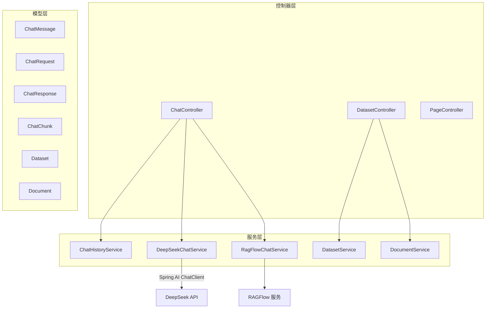
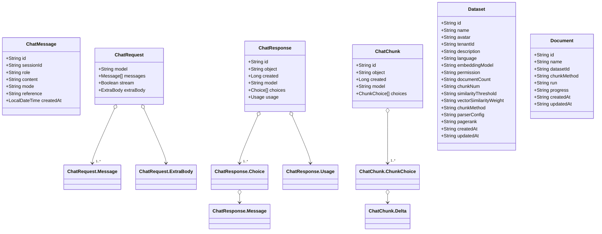
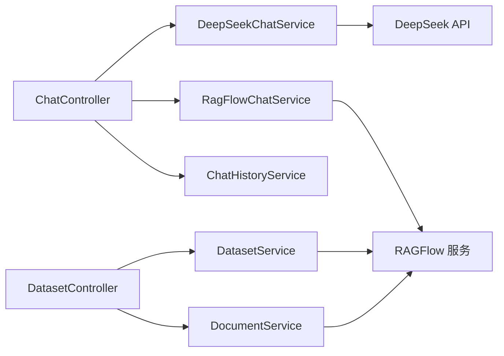

# API 接口文档

<cite>
**本文档引用的文件**
- [DeepSeekRagFlowApplication.java](file://src/main/java/org/wiki/DeepSeekRagFlowApplication.java)
- [ChatController.java](file://src/main/java/org/wiki/controller/ChatController.java)
- [DatasetController.java](file://src/main/java/org/wiki/controller/DatasetController.java)
- [PageController.java](file://src/main/java/org/wiki/controller/PageController.java)
- [application.yml](file://src/main/resources/application.yml)
- [ChatRequest.java](file://src/main/java/org/wiki/model/ChatRequest.java)
- [ChatResponse.java](file://src/main/java/org/wiki/model/ChatResponse.java)
- [ChatChunk.java](file://src/main/java/org/wiki/model/ChatChunk.java)
- [ChatMessage.java](file://src/main/java/org/wiki/model/ChatMessage.java)
- [Dataset.java](file://src/main/java/org/wiki/model/Dataset.java)
- [Document.java](file://src/main/java/org/wiki/model/Document.java)
- [ChatHistoryService.java](file://src/main/java/org/wiki/service/ChatHistoryService.java)
- [DeepSeekChatService.java](file://src/main/java/org/wiki/service/DeepSeekChatService.java)
- [RagFlowChatService.java](file://src/main/java/org/wiki/service/RagFlowChatService.java)
- [DatasetService.java](file://src/main/java/org/wiki/service/DatasetService.java)
- [DocumentService.java](file://src/main/java/org/wiki/service/DocumentService.java)
</cite>

## 目录
1. [简介](#简介)
2. [项目结构](#项目结构)
3. [核心组件](#核心组件)
4. [架构总览](#架构总览)
5. [详细组件分析](#详细组件分析)
6. [依赖关系分析](#依赖关系分析)
7. [性能考虑](#性能考虑)
8. [故障排查指南](#故障排查指南)
9. [结论](#结论)
10. [附录](#附录)

## 简介
本项目为 DeepSeek + RAGFlow 的集成演示应用，提供以下能力：
- 对话接口：RAGFlow 知识库问答、DeepSeek 直接对话、RAG 增强对话（先检索后生成），以及对应的流式接口（SSE/Flux）。
- 知识库管理接口：创建/查询/删除知识库；文档上传、解析/运行、删除。
- 会话历史管理：创建会话、查询历史、清空历史。
- 客户端集成：基于 Spring Boot + Spring AI + RAGFlow SDK 的完整实现。

## 项目结构
后端采用 Spring Boot 结构，按职责分层：
- controller 层：暴露 RESTful API
- service 层：业务逻辑与外部服务交互
- model 层：数据传输对象（DTO）
- resources：配置文件与静态模板



图表来源
- [ChatController.java:1-276](file://src/main/java/org/wiki/controller/ChatController.java#L1-276)
- [DatasetController.java:1-197](file://src/main/java/org/wiki/controller/DatasetController.java#L1-197)
- [ChatHistoryService.java:1-88](file://src/main/java/org/wiki/service/ChatHistoryService.java#L1-88)
- [DeepSeekChatService.java:1-125](file://src/main/java/org/wiki/service/DeepSeekChatService.java#L1-125)
- [RagFlowChatService.java:1-84](file://src/main/java/org/wiki/service/RagFlowChatService.java#L1-84)
- [DatasetService.java:1-128](file://src/main/java/org/wiki/service/DatasetService.java#L1-128)
- [DocumentService.java:1-98](file://src/main/java/org/wiki/service/DocumentService.java#L1-98)

章节来源
- [DeepSeekRagFlowApplication.java:1-12](file://src/main/java/org/wiki/DeepSeekRagFlowApplication.java#L1-12)
- [application.yml:1-27](file://src/main/resources/application.yml#L1-27)

## 核心组件
- 控制器：负责接收请求、参数校验、调用服务层并返回统一响应结构。
- 服务层：
  - 对话历史服务：内存会话存储与消息管理。
  - DeepSeek 对话服务：通过 Spring AI 调用 DeepSeek API，支持非流式与流式两种模式。
  - RAGFlow 对话服务：封装 RAGFlow OpenAI 兼容接口，支持非流式与流式。
  - 知识库与文档服务：封装 RAGFlow 数据集与文档管理接口。
- 模型：定义请求/响应结构、流式分片、会话消息、数据集与文档实体。

章节来源
- [ChatController.java:1-276](file://src/main/java/org/wiki/controller/ChatController.java#L1-276)
- [ChatHistoryService.java:1-88](file://src/main/java/org/wiki/service/ChatHistoryService.java#L1-88)
- [DeepSeekChatService.java:1-125](file://src/main/java/org/wiki/service/DeepSeekChatService.java#L1-125)
- [RagFlowChatService.java:1-84](file://src/main/java/org/wiki/service/RagFlowChatService.java#L1-84)
- [DatasetService.java:1-128](file://src/main/java/org/wiki/service/DatasetService.java#L1-128)
- [DocumentService.java:1-98](file://src/main/java/org/wiki/service/DocumentService.java#L1-98)

## 架构总览
系统通过控制器聚合服务层，服务层分别对接 DeepSeek 与 RAGFlow。对话接口支持非流式与流式两种输出方式；知识库管理接口覆盖数据集与文档全生命周期。

```mermaid
sequenceDiagram
participant Client as "客户端"
participant ChatCtrl as "ChatController"
participant Hist as "ChatHistoryService"
participant DeepSeek as "DeepSeekChatService"
participant RagFlow as "RagFlowChatService"
rect rgb(255,255,255)
Note over ChatCtrl,RagFlow : "RAGFlow 知识库问答非流式"
Client->>ChatCtrl : "POST /api/chat/ragflow?question=..."
ChatCtrl->>Hist : "创建/添加用户消息"
ChatCtrl->>RagFlow : "chat(question)"
RagFlow-->>ChatCtrl : "ChatResponse"
ChatCtrl->>Hist : "添加助手消息"
ChatCtrl-->>Client : "success, answer, sessionId, data"
end
rect rgb(255,255,255)
Note over ChatCtrl,DeepSeek : "DeepSeek 直接对话非流式"
Client->>ChatCtrl : "POST /api/chat/deepseek?question=..."
ChatCtrl->>Hist : "创建/添加用户消息"
ChatCtrl->>DeepSeek : "chat(question)"
DeepSeek-->>ChatCtrl : "answer"
ChatCtrl->>Hist : "添加助手消息"
ChatCtrl-->>Client : "success, answer, sessionId"
end
rect rgb(255,255,255)
Note over ChatCtrl,RagFlow,DeepSeek : "DeepSeek + RAG 增强对话非流式"
Client->>ChatCtrl : "POST /api/chat/deepseek/rag?question=..."
ChatCtrl->>Hist : "创建/添加用户消息"
ChatCtrl->>RagFlow : "chat(question)"
RagFlow-->>ChatCtrl : "ChatResponse"
ChatCtrl->>DeepSeek : "chatWithContext(question, context)"
DeepSeek-->>ChatCtrl : "answer"
ChatCtrl->>Hist : "添加助手消息"
ChatCtrl-->>Client : "success, answer, context, sessionId"
end
```

图表来源
- [ChatController.java:43-174](file://src/main/java/org/wiki/controller/ChatController.java#L43-174)
- [ChatHistoryService.java:29-43](file://src/main/java/org/wiki/service/ChatHistoryService.java#L29-43)
- [RagFlowChatService.java:34-41](file://src/main/java/org/wiki/service/RagFlowChatService.java#L34-41)
- [DeepSeekChatService.java:36-78](file://src/main/java/org/wiki/service/DeepSeekChatService.java#L36-78)

## 详细组件分析

### 对话接口

#### RAGFlow 知识库问答（非流式）
- 方法与路径：POST /api/chat/ragflow
- 参数：
  - question: 字符串，必填
  - sessionId: 字符串，可选
- 响应字段：
  - success: 布尔
  - answer: 字符串，模型回答
  - sessionId: 字符串，会话标识
  - data: ChatResponse 对象
- 错误处理：捕获 IO 异常，返回 success=false 和 message

章节来源
- [ChatController.java:43-76](file://src/main/java/org/wiki/controller/ChatController.java#L43-76)
- [RagFlowChatService.java:34-41](file://src/main/java/org/wiki/service/RagFlowChatService.java#L34-41)
- [ChatHistoryService.java:31-43](file://src/main/java/org/wiki/service/ChatHistoryService.java#L31-43)

#### RAGFlow 知识库问答（流式 SSE）
- 方法与路径：GET /api/chat/ragflow/stream
- 参数：
  - question: 字符串，必填
- 响应：SSE 流，逐块推送增量内容；结束时发送 "[DONE]"
- 错误处理：异常时 completeWithError

章节来源
- [ChatController.java:78-107](file://src/main/java/org/wiki/controller/ChatController.java#L78-107)
- [RagFlowChatService.java:50-72](file://src/main/java/org/wiki/service/RagFlowChatService.java#L50-72)

#### DeepSeek 直接对话（非流式）
- 方法与路径：POST /api/chat/deepseek
- 参数：
  - question: 字符串，必填
  - sessionId: 字符串，可选
- 响应字段：
  - success: 布尔
  - answer: 字符串，模型回答
  - sessionId: 字符串，会话标识
- 错误处理：捕获异常，返回 success=false 和 message

章节来源
- [ChatController.java:109-137](file://src/main/java/org/wiki/controller/ChatController.java#L109-137)
- [DeepSeekChatService.java:36-44](file://src/main/java/org/wiki/service/DeepSeekChatService.java#L36-44)
- [ChatHistoryService.java:31-43](file://src/main/java/org/wiki/service/ChatHistoryService.java#L31-43)

#### DeepSeek 直接对话（流式 SSE）
- 方法与路径：GET /api/chat/deepseek/stream
- 参数：
  - question: 字符串，必填
- 响应：SSE 流，使用 Spring AI Flux 输出；结束时发送 "[DONE]"
- 错误处理：异常时 completeWithError

章节来源
- [ChatController.java:215-228](file://src/main/java/org/wiki/controller/ChatController.java#L215-228)
- [DeepSeekChatService.java:86-92](file://src/main/java/org/wiki/service/DeepSeekChatService.java#L86-92)

#### DeepSeek + RAG 增强对话（非流式）
- 方法与路径：POST /api/chat/deepseek/rag
- 参数：
  - question: 字符串，必填
  - sessionId: 字符串，可选
- 响应字段：
  - success: 布尔
  - answer: 字符串，模型回答
  - context: 字符串，RAGFlow 检索到的上下文
  - sessionId: 字符串，会话标识
- 错误处理：捕获异常，返回 success=false 和 message

章节来源
- [ChatController.java:139-174](file://src/main/java/org/wiki/controller/ChatController.java#L139-174)
- [RagFlowChatService.java:34-41](file://src/main/java/org/wiki/service/RagFlowChatService.java#L34-41)
- [DeepSeekChatService.java:54-78](file://src/main/java/org/wiki/service/DeepSeekChatService.java#L54-78)

#### DeepSeek + RAG 增强对话（流式 SSE）
- 方法与路径：GET /api/chat/deepseek/rag/stream
- 参数：
  - question: 字符串，必填
- 响应：SSE 流，先获取 RAGFlow 上下文，再对 DeepSeek 发起流式请求；结束时发送 "[DONE]"
- 错误处理：异常时 completeWithError

章节来源
- [ChatController.java:230-274](file://src/main/java/org/wiki/controller/ChatController.java#L230-274)
- [RagFlowChatService.java:34-41](file://src/main/java/org/wiki/service/RagFlowChatService.java#L34-41)
- [DeepSeekChatService.java:101-123](file://src/main/java/org/wiki/service/DeepSeekChatService.java#L101-123)

#### 会话历史管理
- 创建会话
  - POST /api/chat/session
  - 响应：success, sessionId
- 获取历史
  - GET /api/chat/history/{sessionId}
  - 响应：success, data(list)
- 清空历史
  - DELETE /api/chat/history/{sessionId}
  - 响应：success

章节来源
- [ChatController.java:176-213](file://src/main/java/org/wiki/controller/ChatController.java#L176-213)
- [ChatHistoryService.java:78-86](file://src/main/java/org/wiki/service/ChatHistoryService.java#L78-86)

### 知识库管理接口

#### 数据集管理
- 创建数据集
  - POST /api/datasets
  - 请求体：name, language(默认 Chinese), description
  - 响应：success, data(Dataset)
- 获取数据集列表
  - GET /api/datasets
  - 响应：success, data(list)
- 获取数据集详情
  - GET /api/datasets/{datasetId}
  - 响应：success, data(Dataset)
- 删除数据集
  - DELETE /api/datasets/{datasetId}
  - 响应：success

章节来源
- [DatasetController.java:37-114](file://src/main/java/org/wiki/controller/DatasetController.java#L37-114)
- [DatasetService.java:37-103](file://src/main/java/org/wiki/service/DatasetService.java#L37-103)

#### 文档管理
- 上传文档
  - POST /api/datasets/{datasetId}/documents
  - 表单参数：file(MultipartFile)
  - 响应：success, data(字符串，上传响应)
- 获取文档列表
  - GET /api/datasets/{datasetId}/documents
  - 响应：success, data(list)
- 删除文档
  - DELETE /api/datasets/{datasetId}/documents/{documentId}
  - 响应：success
- 解析/运行文档
  - POST /api/datasets/{datasetId}/documents/{documentId}/run
  - 响应：success, data(字符串，执行结果)

章节来源
- [DatasetController.java:116-195](file://src/main/java/org/wiki/controller/DatasetController.java#L116-195)
- [DocumentService.java:33-96](file://src/main/java/org/wiki/service/DocumentService.java#L33-96)

### 数据模型



图表来源
- [ChatMessage.java:1-82](file://src/main/java/org/wiki/model/ChatMessage.java#L1-82)
- [ChatRequest.java:1-59](file://src/main/java/org/wiki/model/ChatRequest.java#L1-59)
- [ChatResponse.java:1-52](file://src/main/java/org/wiki/model/ChatResponse.java#L1-52)
- [ChatChunk.java:1-42](file://src/main/java/org/wiki/model/ChatChunk.java#L1-42)
- [Dataset.java:1-33](file://src/main/java/org/wiki/model/Dataset.java#L1-33)
- [Document.java:1-24](file://src/main/java/org/wiki/model/Document.java#L1-24)

## 依赖关系分析



图表来源
- [ChatController.java:32-41](file://src/main/java/org/wiki/controller/ChatController.java#L32-41)
- [DatasetController.java:28-35](file://src/main/java/org/wiki/controller/DatasetController.java#L28-35)
- [DeepSeekChatService.java:24-28](file://src/main/java/org/wiki/service/DeepSeekChatService.java#L24-28)
- [RagFlowChatService.java:20-24](file://src/main/java/org/wiki/service/RagFlowChatService.java#L20-24)
- [DatasetService.java:23-27](file://src/main/java/org/wiki/service/DatasetService.java#L23-27)
- [DocumentService.java:23-27](file://src/main/java/org/wiki/service/DocumentService.java#L23-27)

## 性能考虑
- 流式输出：优先使用 SSE/Flux 实现流式对话，降低首字节延迟与带宽占用。
- 线程池：流式接口使用缓存线程池异步处理，避免阻塞主线程。
- 会话限制：内存会话最大保留消息数限制，防止内存膨胀。
- 超时控制：RAGFlow 请求超时配置可调整，平衡响应速度与稳定性。
- 并发安全：会话存储采用并发容器，保证多线程访问安全。

章节来源
- [ChatController.java:35-35](file://src/main/java/org/wiki/controller/ChatController.java#L35-35)
- [ChatHistoryService.java:21-27](file://src/main/java/org/wiki/service/ChatHistoryService.java#L21-27)
- [application.yml:22-22](file://src/main/resources/application.yml#L22-22)

## 故障排查指南
- 认证与配置
  - DeepSeek API Key 与 Base URL：检查 application.yml 中 spring.ai.openai.* 配置是否正确。
  - RAGFlow API Key 与 Chat ID：检查 ragflow.* 配置项。
- 常见错误
  - IO 异常：对话与知识库操作均捕获 IO 异常，返回 message 字段描述错误原因。
  - 流式异常：SSE/Flux 在异常时会 completeWithError，前端需监听错误事件。
- 日志级别
  - application.yml 中设置日志级别为 DEBUG，便于定位问题。

章节来源
- [application.yml:7-26](file://src/main/resources/application.yml#L7-26)
- [ChatController.java:70-74](file://src/main/java/org/wiki/controller/ChatController.java#L70-74)
- [DatasetController.java:52-56](file://src/main/java/org/wiki/controller/DatasetController.java#L52-56)

## 结论
本项目提供了完整的 DeepSeek + RAGFlow 对话与知识库管理 API，涵盖非流式与流式两种输出方式，满足不同场景需求。通过统一的响应结构与完善的错误处理，便于客户端集成与扩展。

## 附录

### API 列表与示例

- 对话接口
  - RAGFlow 知识库问答（非流式）
    - 请求：POST /api/chat/ragflow?question=...&sessionId=...
    - 响应：success, answer, sessionId, data
  - RAGFlow 知识库问答（流式 SSE）
    - 请求：GET /api/chat/ragflow/stream?question=...
    - 响应：SSE 流，逐块推送增量内容，结束发送 "[DONE]"
  - DeepSeek 直接对话（非流式）
    - 请求：POST /api/chat/deepseek?question=...&sessionId=...
    - 响应：success, answer, sessionId
  - DeepSeek 直接对话（流式 SSE）
    - 请求：GET /api/chat/deepseek/stream?question=...
    - 响应：SSE 流，结束发送 "[DONE]"
  - DeepSeek + RAG 增强对话（非流式）
    - 请求：POST /api/chat/deepseek/rag?question=...&sessionId=...
    - 响应：success, answer, context, sessionId
  - DeepSeek + RAG 增强对话（流式 SSE）
    - 请求：GET /api/chat/deepseek/rag/stream?question=...
    - 响应：SSE 流，结束发送 "[DONE]"
  - 会话历史
    - 创建会话：POST /api/chat/session
    - 查询历史：GET /api/chat/history/{sessionId}
    - 清空历史：DELETE /api/chat/history/{sessionId}

- 知识库管理接口
  - 创建数据集：POST /api/datasets
  - 获取数据集列表：GET /api/datasets
  - 获取数据集详情：GET /api/datasets/{datasetId}
  - 删除数据集：DELETE /api/datasets/{datasetId}
  - 上传文档：POST /api/datasets/{datasetId}/documents
  - 获取文档列表：GET /api/datasets/{datasetId}/documents
  - 删除文档：DELETE /api/datasets/{datasetId}/documents/{documentId}
  - 解析/运行文档：POST /api/datasets/{datasetId}/documents/{documentId}/run

章节来源
- [ChatController.java:43-274](file://src/main/java/org/wiki/controller/ChatController.java#L43-274)
- [DatasetController.java:37-195](file://src/main/java/org/wiki/controller/DatasetController.java#L37-195)

### 统一响应结构
- 成功响应：success=true，携带业务数据字段
- 失败响应：success=false，携带 message 字段描述错误

章节来源
- [ChatController.java:54-76](file://src/main/java/org/wiki/controller/ChatController.java#L54-76)
- [DatasetController.java:42-58](file://src/main/java/org/wiki/controller/DatasetController.java#L42-58)

### 认证机制
- DeepSeek：通过 application.yml 中的 spring.ai.openai.api-key 与 base-url 配置进行认证与调用。
- RAGFlow：通过 application.yml 中的 ragflow.api-key 与 chat-id 配置进行认证与调用。

章节来源
- [application.yml:9-21](file://src/main/resources/application.yml#L9-21)

### 参数验证规则
- 必填参数：question、datasetId、documentId 等路径与查询参数需提供。
- 可选参数：sessionId、language 等可省略，默认行为由服务层处理。

章节来源
- [ChatController.java:52-53](file://src/main/java/org/wiki/controller/ChatController.java#L52-53)
- [DatasetController.java:121-123](file://src/main/java/org/wiki/controller/DatasetController.java#L121-123)

### 状态码与含义
- 200：成功
- 500：内部错误（IO 异常或未知异常）

章节来源
- [ChatController.java:70-74](file://src/main/java/org/wiki/controller/ChatController.java#L70-74)
- [DatasetController.java:52-56](file://src/main/java/org/wiki/controller/DatasetController.java#L52-56)

### API 版本管理
- 当前版本：v1（RESTful 路径中体现为 /api/*）
- 扩展建议：未来可在路径中加入版本号，如 /api/v1/chat/*，以支持向后兼容

章节来源
- [ChatController.java:29-29](file://src/main/java/org/wiki/controller/ChatController.java#L29-29)
- [DatasetController.java:25-25](file://src/main/java/org/wiki/controller/DatasetController.java#L25-25)

### 速率限制与性能优化建议
- 速率限制：当前未实现服务端限流策略，建议在网关或反向代理层增加限流与熔断。
- 性能优化：
  - 使用流式输出提升用户体验
  - 合理设置 RAGFlow 超时与重试
  - 对会话历史进行定期清理，避免无限增长

章节来源
- [application.yml:22-22](file://src/main/resources/application.yml#L22-22)
- [ChatHistoryService.java:26-26](file://src/main/java/org/wiki/service/ChatHistoryService.java#L26-26)

### 客户端集成指南
- 前端建议：使用 fetch 或 axios 发送请求；对于流式接口，使用 EventSource 或浏览器原生 EventSource 接收 SSE。
- 后端建议：遵循统一响应结构，对异常进行捕获并返回标准错误响应。
- 示例流程（概念性）：
  1) 创建会话：POST /api/chat/session
  2) 发送问题：POST /api/chat/deepseek 或 /api/chat/deepseek/rag
  3) 处理流式：监听 SSE/Flux，实时渲染回答
  4) 查询历史：GET /api/chat/history/{sessionId}
  5) 清空历史：DELETE /api/chat/history/{sessionId}

章节来源
- [ChatController.java:176-213](file://src/main/java/org/wiki/controller/ChatController.java#L176-213)
- [ChatHistoryService.java:48-61](file://src/main/java/org/wiki/service/ChatHistoryService.java#L48-61)