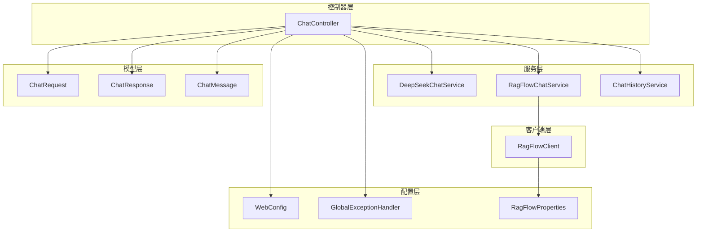
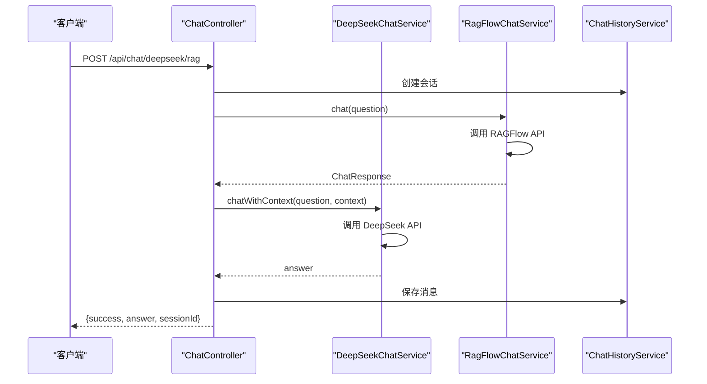
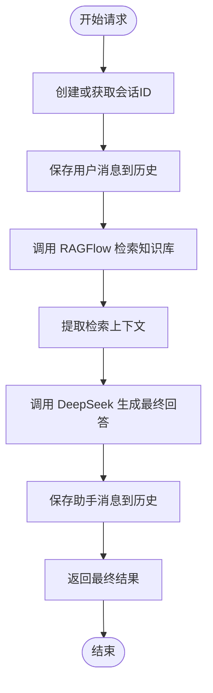
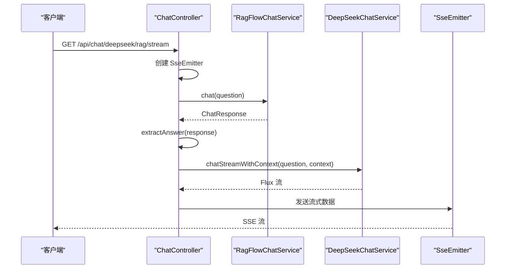
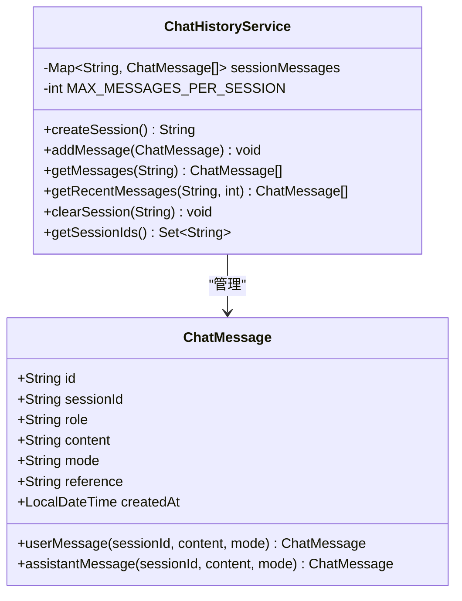
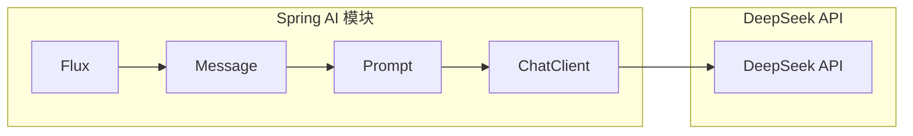

# DeepSeek 对话接口

<cite>
**本文档引用的文件**
- [ChatController.java](file://src/main/java/org/wiki/controller/ChatController.java)
- [DeepSeekChatService.java](file://src/main/java/org/wiki/service/DeepSeekChatService.java)
- [RagFlowChatService.java](file://src/main/java/org/wiki/service/RagFlowChatService.java)
- [RagFlowClient.java](file://src/main/java/org/wiki/client/RagFlowClient.java)
- [ChatHistoryService.java](file://src/main/java/org/wiki/service/ChatHistoryService.java)
- [ChatRequest.java](file://src/main/java/org/wiki/model/ChatRequest.java)
- [ChatResponse.java](file://src/main/java/org/wiki/model/ChatResponse.java)
- [ChatMessage.java](file://src/main/java/org/wiki/model/ChatMessage.java)
- [WebConfig.java](file://src/main/java/org/wiki/config/WebConfig.java)
- [GlobalExceptionHandler.java](file://src/main/java/org/wiki/config/GlobalExceptionHandler.java)
- [RagFlowProperties.java](file://src/main/java/org/wiki/config/RagFlowProperties.java)
- [application.yml](file://src/main/resources/application.yml)
- [pom.xml](file://pom.xml)
</cite>

## 目录
1. [简介](#简介)
2. [项目结构](#项目结构)
3. [核心组件](#核心组件)
4. [架构概览](#架构概览)
5. [详细组件分析](#详细组件分析)
6. [依赖关系分析](#依赖关系分析)
7. [性能考虑](#性能考虑)
8. [故障排除指南](#故障排除指南)
9. [结论](#结论)
10. [附录](#附录)

## 简介

DeepSeek 对话接口是一个基于 Spring Boot 和 Spring AI 构建的智能对话系统，集成了 DeepSeek 大语言模型和 RAGFlow 知识库检索功能。该系统提供了三种对话模式：

1. **DeepSeek 直接对话** - 通过 Spring AI 框架直接调用 DeepSeek API
2. **RAGFlow 知识库问答** - 基于 RAGFlow 的知识库检索功能
3. **DeepSeek + RAG 增强对话** - 结合知识库检索和大模型生成的混合对话模式

系统支持非流式和流式两种交互方式，包括传统的 SSE 流式传输和 Spring AI 原生的 Flux 流式处理。

## 项目结构

该项目采用标准的 Spring Boot 分层架构，主要包含以下模块：



**图表来源**
- [ChatController.java:1-276](file://src/main/java/org/wiki/controller/ChatController.java#L1-L276)
- [DeepSeekChatService.java:1-125](file://src/main/java/org/wiki/service/DeepSeekChatService.java#L1-L125)
- [RagFlowChatService.java:1-84](file://src/main/java/org/wiki/service/RagFlowChatService.java#L1-L84)
- [RagFlowClient.java:1-231](file://src/main/java/org/wiki/client/RagFlowClient.java#L1-L231)

**章节来源**
- [ChatController.java:1-276](file://src/main/java/org/wiki/controller/ChatController.java#L1-L276)
- [pom.xml:1-102](file://pom.xml#L1-L102)

## 核心组件

### 控制器层

**ChatController** 是系统的入口点，负责处理所有对话相关的 HTTP 请求。它实现了三个主要功能：

1. **DeepSeek 直接对话** - 支持非流式和流式两种模式
2. **RAGFlow 知识库问答** - 支持非流式和流式两种模式  
3. **DeepSeek + RAG 增强对话** - 结合两种技术的优势

### 服务层

**DeepSeekChatService** 通过 Spring AI 框架与 DeepSeek API 交互，支持：
- 纯对话模式
- RAG 增强对话模式
- 流式对话模式

**RagFlowChatService** 封装了 RAGFlow 知识库的调用逻辑，提供：
- 非流式问答
- 流式问答
- 答案提取功能

**ChatHistoryService** 管理会话历史，提供：
- 会话创建和管理
- 消息存储和检索
- 历史清理功能

### 客户端层

**RagFlowClient** 实现了对 RAGFlow RESTful API 的封装，包括：
- HTTP 客户端配置
- 对话请求构建
- 流式数据处理
- 文件上传功能

**章节来源**
- [ChatController.java:20-276](file://src/main/java/org/wiki/controller/ChatController.java#L20-L276)
- [DeepSeekChatService.java:15-125](file://src/main/java/org/wiki/service/DeepSeekChatService.java#L15-L125)
- [RagFlowChatService.java:12-84](file://src/main/java/org/wiki/service/RagFlowChatService.java#L12-L84)
- [ChatHistoryService.java:10-88](file://src/main/java/org/wiki/service/ChatHistoryService.java#L10-L88)

## 架构概览

系统采用分层架构设计，通过依赖注入实现松耦合：



**图表来源**
- [ChatController.java:148-174](file://src/main/java/org/wiki/controller/ChatController.java#L148-L174)
- [RagFlowChatService.java:34-41](file://src/main/java/org/wiki/service/RagFlowChatService.java#L34-L41)
- [DeepSeekChatService.java:54-78](file://src/main/java/org/wiki/service/DeepSeekChatService.java#L54-L78)

## 详细组件分析

### DeepSeek 直接对话接口

#### 非流式接口
**POST /api/chat/deepseek**

##### 请求参数
- `question` (String, 必填): 用户提出的问题
- `sessionId` (String, 可选): 会话标识符，如果为空则自动创建

##### 响应结构
```json
{
  "success": true,
  "answer": "模型回答内容",
  "sessionId": "会话ID"
}
```

##### 特殊处理逻辑
1. 自动会话管理：如果未提供 sessionId，系统自动生成新的会话
2. 历史记录：自动保存用户和助手的消息
3. 错误处理：捕获异常并返回统一格式的错误信息

#### 流式接口
**GET /api/chat/deepseek/stream**

##### 请求参数
- `question` (String, 必填): 用户提出的问题

##### 响应格式
使用 Server-Sent Events (SSE) 协议，逐字节推送响应：
- 每个字节作为一个事件发送
- 流结束时发送 `"[DONE]"` 标记

##### Spring AI 集成
使用 Spring AI 原生的 Flux 流式处理：
```java
return deepSeekChatService.chatStream(question)
        .concatWith(Flux.just("[DONE]"));
```

**章节来源**
- [ChatController.java:117-137](file://src/main/java/org/wiki/controller/ChatController.java#L117-L137)
- [ChatController.java:223-228](file://src/main/java/org/wiki/controller/ChatController.java#L223-L228)
- [DeepSeekChatService.java:36-44](file://src/main/java/org/wiki/service/DeepSeekChatService.java#L36-L44)
- [DeepSeekChatService.java:86-92](file://src/main/java/org/wiki/service/DeepSeekChatService.java#L86-L92)

### RAGFlow 知识库问答接口

#### 非流式接口
**POST /api/chat/ragflow**

##### 请求参数
- `question` (String, 必填): 用户提出的问题
- `sessionId` (String, 可选): 会话标识符

##### 响应结构
```json
{
  "success": true,
  "answer": "检索到的答案",
  "sessionId": "会话ID",
  "data": {
    "id": "响应ID",
    "choices": [...],
    "usage": {
      "promptTokens": 0,
      "completionTokens": 0,
      "totalTokens": 0
    }
  }
}
```

#### 流式接口
**GET /api/chat/ragflow/stream**

##### 响应格式
SSE 流式响应，包含：
- 检索到的内容片段
- 引用信息（以特殊标记显示）

##### 特殊处理逻辑
1. **引用信息处理**：当 RAGFlow 返回引用信息时，系统会将其转换为特殊格式发送
2. **流式解析**：实时解析 RAGFlow 的 SSE 数据流
3. **异常处理**：对解析异常进行优雅处理

**章节来源**
- [ChatController.java:51-76](file://src/main/java/org/wiki/controller/ChatController.java#L51-L76)
- [ChatController.java:85-107](file://src/main/java/org/wiki/controller/ChatController.java#L85-L107)
- [RagFlowChatService.java:34-41](file://src/main/java/org/wiki/service/RagFlowChatService.java#L34-L41)
- [RagFlowChatService.java:50-72](file://src/main/java/org/wiki/service/RagFlowChatService.java#L50-L72)

### DeepSeek + RAG 增强对话接口

#### 非流式接口
**POST /api/chat/deepseek/rag**

##### 两阶段处理流程



**图表来源**
- [ChatController.java:148-174](file://src/main/java/org/wiki/controller/ChatController.java#L148-L174)

##### 请求参数
- `question` (String, 必填): 用户提出的问题
- `sessionId` (String, 可选): 会话标识符

##### 响应结构
```json
{
  "success": true,
  "answer": "结合知识库生成的回答",
  "context": "检索到的上下文内容",
  "sessionId": "会话ID"
}
```

#### 流式接口
**GET /api/chat/deepseek/rag/stream**

##### 处理流程



**图表来源**
- [ChatController.java:238-274](file://src/main/java/org/wiki/controller/ChatController.java#L238-L274)

##### 特殊处理逻辑
1. **异步处理**：使用线程池处理长时间运行的 RAG+流式操作
2. **流式转发**：将 DeepSeek 的流式响应直接转发给客户端
3. **完成标记**：在流结束后发送 `"[DONE]"` 标记

**章节来源**
- [ChatController.java:148-174](file://src/main/java/org/wiki/controller/ChatController.java#L148-L174)
- [ChatController.java:238-274](file://src/main/java/org/wiki/controller/ChatController.java#L238-L274)

### 会话管理机制

系统提供了完整的会话管理功能：



**图表来源**
- [ChatHistoryService.java:14-88](file://src/main/java/org/wiki/service/ChatHistoryService.java#L14-L88)
- [ChatMessage.java:13-82](file://src/main/java/org/wiki/model/ChatMessage.java#L13-L82)

#### 会话 API
- **创建会话**: `POST /api/chat/session`
- **获取历史**: `GET /api/chat/history/{sessionId}`
- **清空历史**: `DELETE /api/chat/history/{sessionId}`

**章节来源**
- [ChatController.java:176-213](file://src/main/java/org/wiki/controller/ChatController.java#L176-L213)
- [ChatHistoryService.java:18-86](file://src/main/java/org/wiki/service/ChatHistoryService.java#L18-L86)

## 依赖关系分析

### Spring AI 集成

系统使用 Spring AI 框架简化了与 DeepSeek API 的集成：



**图表来源**
- [DeepSeekChatService.java:24-28](file://src/main/java/org/wiki/service/DeepSeekChatService.java#L24-L28)

### 外部依赖

项目的主要外部依赖包括：

| 依赖项 | 版本 | 用途 |
|--------|------|------|
| Spring Boot | 3.2.0 | Web 应用框架 |
| Spring AI | 1.0.0-M6 | AI 模型集成 |
| OkHttp | 4.12.0 | HTTP 客户端 |
| FastJSON2 | 2.0.53 | JSON 处理 |
| Lombok | 1.18.34 | 代码简化 |

**章节来源**
- [pom.xml:25-89](file://pom.xml#L25-L89)
- [application.yml:4-27](file://src/main/resources/application.yml#L4-L27)

## 性能考虑

### 流式处理优化

1. **SSE 超时设置**：RAGFlow 流式接口设置 5 分钟超时，DeepSeek 流式接口设置 30 秒超时
2. **线程池管理**：使用缓存线程池处理长时间运行的流式操作
3. **内存限制**：会话消息最多保存 100 条，防止内存泄漏

### 缓存和连接优化

1. **HTTP 客户端复用**：OkHttp 客户端在应用启动时初始化，避免重复创建
2. **连接超时配置**：连接超时 30 秒，读取超时可配置（默认 120 秒）
3. **并发控制**：使用线程池限制同时运行的流式任务数量

### 错误处理策略

1. **统一异常处理**：全局异常处理器提供标准化的错误响应
2. **超时处理**：针对不同类型的超时提供相应的错误信息
3. **重试机制**：对于网络异常提供重试策略

**章节来源**
- [ChatController.java:87-104](file://src/main/java/org/wiki/controller/ChatController.java#L87-L104)
- [ChatHistoryService.java:24-39](file://src/main/java/org/wiki/service/ChatHistoryService.java#L24-L39)
- [RagFlowClient.java:30-35](file://src/main/java/org/wiki/client/RagFlowClient.java#L30-L35)

## 故障排除指南

### 常见错误类型

#### RAGFlow 服务不可用
**症状**：返回 `RAGFlow 服务调用失败` 错误
**原因**：
- RAGFlow 服务地址配置错误
- API Key 无效
- 网络连接问题

**解决方案**：
1. 检查 `application.yml` 中的 RAGFlow 配置
2. 验证 API Key 的有效性
3. 确认网络连通性

#### DeepSeek API 调用失败
**症状**：返回 DeepSeek API 相关错误
**原因**：
- API Key 配置错误
- 模型名称不正确
- 请求频率过高

**解决方案**：
1. 检查 Spring AI 配置
2. 验证模型名称是否正确
3. 降低请求频率

#### 流式连接中断
**症状**：SSE 连接意外断开
**原因**：
- 超时设置过短
- 网络不稳定
- 服务器负载过高

**解决方案**：
1. 增加超时时间配置
2. 检查网络稳定性
3. 优化服务器性能

**章节来源**
- [GlobalExceptionHandler.java:20-44](file://src/main/java/org/wiki/config/GlobalExceptionHandler.java#L20-L44)
- [RagFlowClient.java:52-56](file://src/main/java/org/wiki/client/RagFlowClient.java#L52-L56)

## 结论

DeepSeek 对话接口提供了一个功能完整、架构清晰的智能对话系统。通过集成 Spring AI 和 RAGFlow，系统能够：

1. **灵活的对话模式**：支持纯对话、知识库问答和混合增强模式
2. **多种交互方式**：提供非流式和流式两种交互体验
3. **完善的会话管理**：支持会话创建、历史管理和状态维护
4. **健壮的错误处理**：提供统一的异常处理和错误恢复机制

系统的设计充分考虑了性能和可扩展性，适合在生产环境中部署使用。

## 附录

### API 使用示例

#### DeepSeek 直接对话
```bash
# 非流式
curl -X POST "http://localhost:8081/api/chat/deepseek?question=你好&sessionId=123"

# 流式
curl -N "http://localhost:8081/api/chat/deepseek/stream?question=你好"
```

#### RAGFlow 知识库问答
```bash
# 非流式
curl -X POST "http://localhost:8081/api/chat/ragflow?question=Spring AI如何使用&sessionId=123"

# 流式
curl -N "http://localhost:8081/api/chat/ragflow/stream?question=Spring AI如何使用"
```

#### DeepSeek + RAG 增强对话
```bash
# 非流式
curl -X POST "http://localhost:8081/api/chat/deepseek/rag?question=Spring AI最佳实践&sessionId=123"

# 流式
curl -N "http://localhost:8081/api/chat/deepseek/rag/stream?question=Spring AI最佳实践"
```

### 配置说明

#### application.yml 关键配置
- **server.port**: 服务端口，默认 8081
- **spring.ai.openai.api-key**: DeepSeek API 密钥
- **spring.ai.openai.base-url**: DeepSeek API 基础地址
- **spring.ai.openai.chat.options.model**: 模型名称（如 deepseek-chat）
- **ragflow.base-url**: RAGFlow 服务地址
- **ragflow.api-key**: RAGFlow API 密钥
- **ragflow.chat-id**: 聊天助手 ID
- **ragflow.timeout**: 请求超时时间（秒）

**章节来源**
- [application.yml:1-27](file://src/main/resources/application.yml#L1-L27)
- [RagFlowProperties.java:10-31](file://src/main/java/org/wiki/config/RagFlowProperties.java#L10-L31)