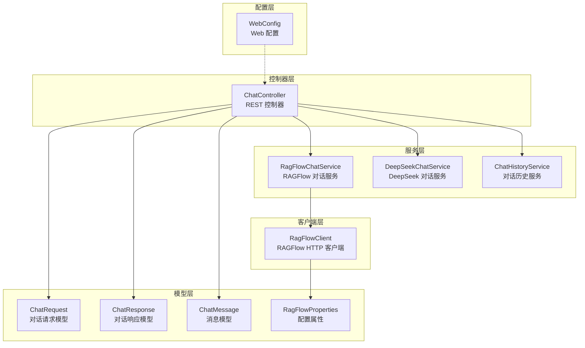
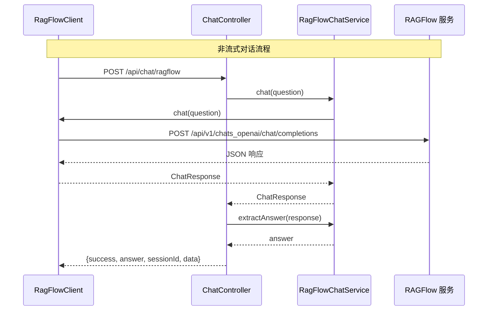
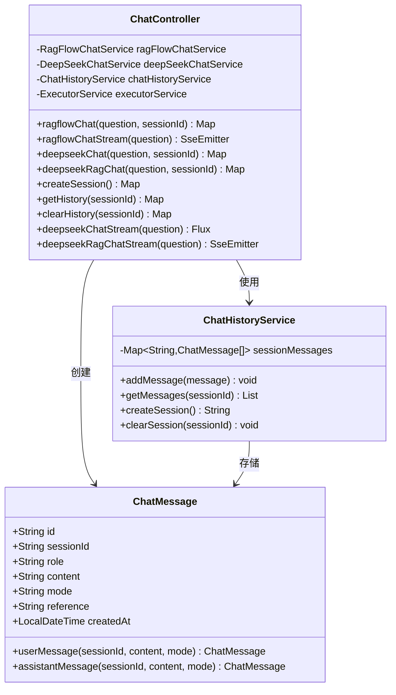
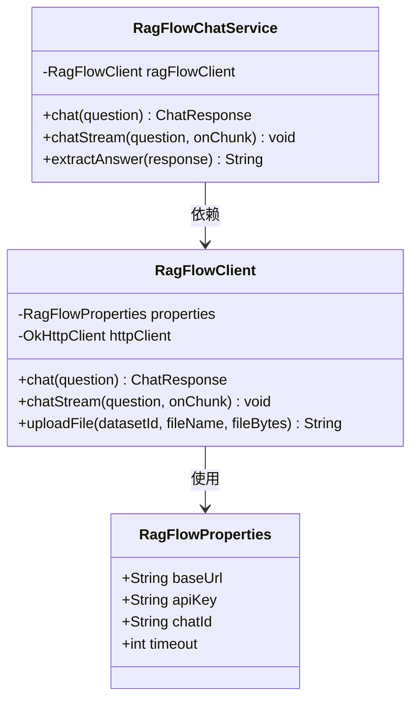
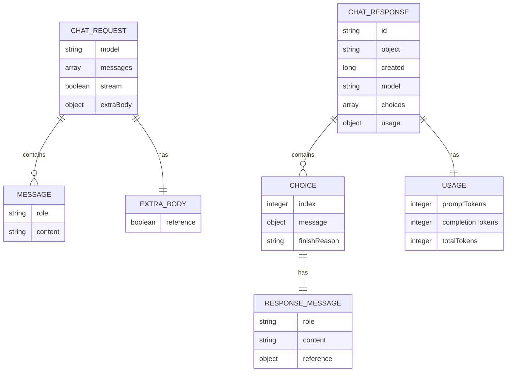
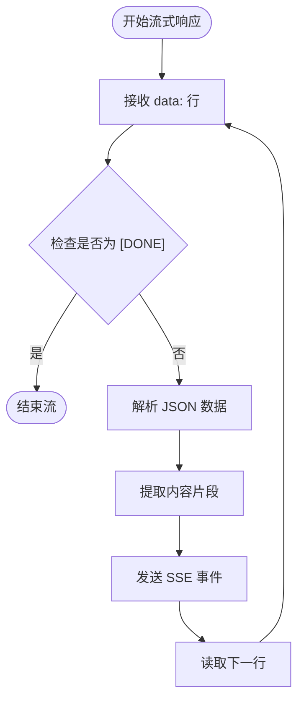
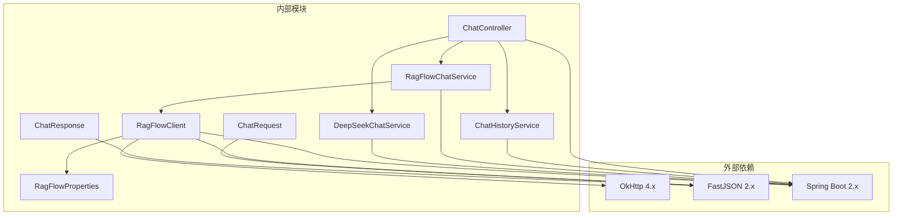

# RAGFlow 对话接口

<cite>
**本文档中引用的文件**
- [ChatController.java](file://src/main/java/org/wiki/controller/ChatController.java)
- [RagFlowChatService.java](file://src/main/java/org/wiki/service/RagFlowChatService.java)
- [RagFlowClient.java](file://src/main/java/org/wiki/client/RagFlowClient.java)
- [ChatRequest.java](file://src/main/java/org/wiki/model/ChatRequest.java)
- [ChatResponse.java](file://src/main/java/org/wiki/model/ChatResponse.java)
- [RagFlowProperties.java](file://src/main/java/org/wiki/config/RagFlowProperties.java)
- [ChatHistoryService.java](file://src/main/java/org/wiki/service/ChatHistoryService.java)
- [ChatMessage.java](file://src/main/java/org/wiki/model/ChatMessage.java)
- [WebConfig.java](file://src/main/java/org/wiki/config/WebConfig.java)
- [application.yml](file://src/main/resources/application.yml)
- [index.html](file://src/main/resources/templates/index.html)
</cite>

## 目录
1. [简介](#简介)
2. [项目结构](#项目结构)
3. [核心组件](#核心组件)
4. [架构概览](#架构概览)
5. [详细组件分析](#详细组件分析)
6. [API 规范](#api-规范)
7. [依赖关系分析](#依赖关系分析)
8. [性能考虑](#性能考虑)
9. [故障排除指南](#故障排除指南)
10. [结论](#结论)

## 简介

RAGFlow 对话接口是一个基于 Spring Boot 构建的智能问答系统，集成了 RAGFlow 知识库问答和 DeepSeek 大语言模型。该系统提供了两种对话模式：传统的非流式对话和实时流式对话（SSE），支持会话管理和历史记录功能。

系统的核心特性包括：
- **多模式对话支持**：RAGFlow 知识库问答、DeepSeek 直接对话、RAG 增强对话
- **流式与非流式接口**：支持实时流式响应和传统同步响应
- **会话管理**：完整的会话创建、历史记录和清理功能
- **引用信息展示**：自动提取和显示知识库引用来源
- **CORS 跨域支持**：完整的跨域访问配置

## 项目结构

该项目采用标准的 Spring Boot 项目结构，主要分为以下模块：



**图表来源**
- [ChatController.java:1-276](file://src/main/java/org/wiki/controller/ChatController.java#L1-L276)
- [RagFlowChatService.java:1-84](file://src/main/java/org/wiki/service/RagFlowChatService.java#L1-L84)
- [RagFlowClient.java:1-231](file://src/main/java/org/wiki/client/RagFlowClient.java#L1-L231)

**章节来源**
- [ChatController.java:27-41](file://src/main/java/org/wiki/controller/ChatController.java#L27-L41)
- [RagFlowChatService.java:12-24](file://src/main/java/org/wiki/service/RagFlowChatService.java#L12-L24)

## 核心组件

### ChatController - 主要控制器

ChatController 是系统的核心入口点，负责处理所有对话相关的 HTTP 请求。它实现了三个主要功能：

1. **RAGFlow 对话接口**：提供非流式和流式两种对话模式
2. **DeepSeek 对话接口**：直接调用 DeepSeek API 进行对话
3. **RAG 增强对话**：结合 RAGFlow 检索和 DeepSeek 生成的优势

### RagFlowChatService - RAGFlow 对话服务

RagFlowChatService 封装了与 RAGFlow 服务交互的所有逻辑，包括：
- 非流式对话调用
- 流式对话处理
- 响应数据解析和提取
- 引用信息处理

### RagFlowClient - HTTP 客户端

RagFlowClient 实现了与 RAGFlow 服务的底层通信，提供：
- OpenAI 兼容接口调用
- 流式数据处理
- 错误处理和重试机制
- 配置管理

**章节来源**
- [ChatController.java:32-41](file://src/main/java/org/wiki/controller/ChatController.java#L32-L41)
- [RagFlowChatService.java:20-24](file://src/main/java/org/wiki/service/RagFlowChatService.java#L20-L24)
- [RagFlowClient.java:25-35](file://src/main/java/org/wiki/client/RagFlowClient.java#L25-L35)

## 架构概览

系统采用分层架构设计，确保了良好的关注点分离和可维护性：



**图表来源**
- [ChatController.java:51-76](file://src/main/java/org/wiki/controller/ChatController.java#L51-L76)
- [RagFlowChatService.java:34-41](file://src/main/java/org/wiki/service/RagFlowChatService.java#L34-L41)
- [RagFlowClient.java:135-148](file://src/main/java/org/wiki/client/RagFlowClient.java#L135-L148)

## 详细组件分析

### ChatController 组件分析

ChatController 实现了完整的对话接口，包括会话管理和历史记录功能：



**图表来源**
- [ChatController.java:32-41](file://src/main/java/org/wiki/controller/ChatController.java#L32-L41)
- [ChatHistoryService.java:16-21](file://src/main/java/org/wiki/service/ChatHistoryService.java#L16-L21)
- [ChatMessage.java:17-52](file://src/main/java/org/wiki/model/ChatMessage.java#L17-L52)

### RagFlowChatService 组件分析

RagFlowChatService 提供了完整的 RAGFlow 对话功能：



**图表来源**
- [RagFlowChatService.java:18-24](file://src/main/java/org/wiki/service/RagFlowChatService.java#L18-L24)
- [RagFlowClient.java:25-35](file://src/main/java/org/wiki/client/RagFlowClient.java#L25-L35)
- [RagFlowProperties.java:10-31](file://src/main/java/org/wiki/config/RagFlowProperties.java#L10-L31)

**章节来源**
- [ChatController.java:43-107](file://src/main/java/org/wiki/controller/ChatController.java#L43-L107)
- [RagFlowChatService.java:26-82](file://src/main/java/org/wiki/service/RagFlowChatService.java#L26-L82)

### 数据模型分析

系统使用了多个数据模型来处理对话相关的数据：



**图表来源**
- [ChatRequest.java:17-58](file://src/main/java/org/wiki/model/ChatRequest.java#L17-L58)
- [ChatResponse.java:16-51](file://src/main/java/org/wiki/model/ChatResponse.java#L16-L51)

**章节来源**
- [ChatRequest.java:10-58](file://src/main/java/org/wiki/model/ChatRequest.java#L10-L58)
- [ChatResponse.java:10-51](file://src/main/java/org/wiki/model/ChatResponse.java#L10-L51)

## API 规范

### 非流式对话接口

#### 端点定义
- **方法**: POST
- **路径**: `/api/chat/ragflow`
- **描述**: RAGFlow 知识库问答（非流式）

#### 请求参数

| 参数名 | 类型 | 必需 | 描述 | 默认值 |
|--------|------|------|------|--------|
| question | string | 是 | 用户提出的问题 | - |
| sessionId | string | 否 | 会话标识符 | 自动生成 |

#### 请求示例
```bash
curl -X POST "http://localhost:8081/api/chat/ragflow?question=Spring框架的核心概念&sessionId=abc123"
```

#### 响应结构

| 字段名 | 类型 | 描述 |
|--------|------|------|
| success | boolean | 请求是否成功 |
| answer | string | 生成的回答内容 |
| sessionId | string | 会话标识符 |
| data | object | 原始响应数据 |

#### 成功响应示例
```json
{
  "success": true,
  "answer": "Spring框架是Java平台上的一个开源应用程序框架和容器，提供了全面的基础设施支持。",
  "sessionId": "abc123",
  "data": {
    "id": "chatcmpl-123456",
    "object": "chat.completion",
    "created": 1699123456,
    "model": "model",
    "choices": [
      {
        "index": 0,
        "message": {
          "role": "assistant",
          "content": "Spring框架是Java平台上的一个开源应用程序框架和容器，提供了全面的基础设施支持。",
          "reference": {
            "source": "spring-framework-documentation.pdf",
            "page": 15
          }
        },
        "finish_reason": "stop"
      }
    ],
    "usage": {
      "prompt_tokens": 120,
      "completion_tokens": 85,
      "total_tokens": 205
    }
  }
}
```

#### 错误响应示例
```json
{
  "success": false,
  "message": "RAGFlow API 调用失败: status=500, body={\"error\":\"Internal Server Error\"}"
}
```

### 流式对话接口

#### 端点定义
- **方法**: GET
- **路径**: `/api/chat/ragflow/stream`
- **描述**: RAGFlow 知识库问答（流式 SSE）

#### 请求参数

| 参数名 | 类型 | 必需 | 描述 |
|--------|------|------|------|
| question | string | 是 | 用户提出的问题 |

#### 请求示例
```bash
curl -N "http://localhost:8081/api/chat/ragflow/stream?question=Spring框架的核心概念"
```

#### SSE 事件格式

流式响应遵循 Server-Sent Events (SSE) 标准，每个数据块以 `data:` 开头：



**图表来源**
- [RagFlowClient.java:181-199](file://src/main/java/org/wiki/client/RagFlowClient.java#L181-L199)

#### SSE 事件示例

```text
data: {"id":"chatcmpl-123","object":"chat.completion.chunk","created":1699123456,"model":"model","choices":[{"delta":{"content":"Spring"}}]}

data: {"id":"chatcmpl-123","object":"chat.completion.chunk","created":1699123457,"model":"model","choices":[{"delta":{"content":"框架"}}]}

data: {"id":"chatcmpl-123","object":"chat.completion.chunk","created":1699123458,"model":"model","choices":[{"delta":{"content":"是"}}]}

data: {"id":"chatcmpl-123","object":"chat.completion.chunk","created":1699123459,"model":"model","choices":[{"delta":{"content":"Java"}}]}

data: {"id":"chatcmpl-123","object":"chat.completion.chunk","created":1699123460,"model":"model","choices":[{"delta":{"content":"平台"}}]}

data: {"id":"chatcmpl-123","object":"chat.completion.chunk","created":1699123461,"model":"model","choices":[{"delta":{"content":"上"}}]}

data: {"id":"chatcmpl-123","object":"chat.completion.chunk","created":1699123462,"model":"model","choices":[{"delta":{"content":"的一个"}}]}

data: {"id":"chatcmpl-123","object":"chat.completion.chunk","created":1699123463,"model":"model","choices":[{"delta":{"content":"开源"}}]}

data: {"id":"chatcmpl-123","object":"chat.completion.chunk","created":1699123464,"model":"model","choices":[{"delta":{"content":"应用程序"}}]}

data: {"id":"chatcmpl-123","object":"chat.completion.chunk","created":1699123465,"model":"model","choices":[{"delta":{"content":"框架"}}]}

data: {"id":"chatcmpl-123","object":"chat.completion.chunk","created":1699123466,"model":"model","choices":[{"delta":{"content":"和"}}]}

data: {"id":"chatcmpl-123","object":"chat.completion.chunk","created":1699123467,"model":"model","choices":[{"delta":{"content":"容器"}}]}

data: {"id":"chatcmpl-123","object":"chat.completion.chunk","created":1699123468,"model":"model","choices":[{"delta":{"content":"，"}}]}

data: {"id":"chatcmpl-123","object":"chat.completion.chunk","created":1699123469,"model":"model","choices":[{"delta":{"content":"提供了"}}]}

data: {"id":"chatcmpl-123","object":"chat.completion.chunk","created":1699123470,"model":"model","choices":[{"delta":{"content":"全面"}}]}

data: {"id":"chatcmpl-123","object":"chat.completion.chunk","created":1699123471,"model":"model","choices":[{"delta":{"content":"的"}}]}

data: {"id":"chatcmpl-123","object":"chat.completion.chunk","created":1699123472,"model":"model","choices":[{"delta":{"content":"基础设施"}}]}

data: {"id":"chatcmpl-123","object":"chat.completion.chunk","created":1699123473,"model":"model","choices":[{"delta":{"content":"支持"}}]}

data: {"id":"chatcmpl-123","object":"chat.completion.chunk","created":1699123474,"model":"model","choices":[{"delta":{"content":"。"}}]}

data: [DONE]
```

#### 连接管理

- **超时设置**: 5分钟（300秒）
- **连接类型**: 长连接
- **编码格式**: UTF-8
- **传输协议**: HTTP/1.1

### 会话管理接口

#### 创建会话
- **方法**: POST
- **路径**: `/api/chat/session`
- **响应**: 包含新的 sessionId

#### 获取历史记录
- **方法**: GET
- **路径**: `/api/chat/history/{sessionId}`

#### 清空历史记录
- **方法**: DELETE
- **路径**: `/api/chat/history/{sessionId}`

**章节来源**
- [ChatController.java:43-107](file://src/main/java/org/wiki/controller/ChatController.java#L43-L107)
- [ChatController.java:176-213](file://src/main/java/org/wiki/controller/ChatController.java#L176-L213)

## 依赖关系分析

系统的关键依赖关系如下：



**图表来源**
- [RagFlowClient.java:3,6,8:3-8](file://src/main/java/org/wiki/client/RagFlowClient.java#L3-L8)
- [RagFlowChatService.java:3,4,7:3-7](file://src/main/java/org/wiki/service/RagFlowChatService.java#L3-L7)

### 配置依赖

系统配置主要通过 application.yml 文件管理：

| 配置项 | 类型 | 描述 | 默认值 |
|--------|------|------|--------|
| server.port | integer | 应用程序端口 | 8081 |
| ragflow.base-url | string | RAGFlow 服务地址 | http://localhost:80 |
| ragflow.api-key | string | RAGFlow API 密钥 | - |
| ragflow.chat-id | string | 聊天助手 ID | - |
| ragflow.timeout | integer | 请求超时时间（秒） | 120 |
| spring.ai.openai.api-key | string | DeepSeek API 密钥 | sk-xxxxxxxxxxxxxxxxxxxxxxxx |
| spring.ai.openai.base-url | string | DeepSeek API 地址 | https://api.deepseek.com |

**章节来源**
- [application.yml:1-27](file://src/main/resources/application.yml#L1-L27)
- [RagFlowProperties.java:10-31](file://src/main/java/org/wiki/config/RagFlowProperties.java#L10-L31)

## 性能考虑

### 连接池配置

系统使用 OkHttp 作为 HTTP 客户端，具有以下性能特点：

- **连接超时**: 30 秒
- **读取超时**: 可配置（默认 120 秒）
- **写入超时**: 30 秒
- **连接复用**: 支持 HTTP/1.1 和 HTTP/2

### 流式处理优化

- **异步执行**: 使用线程池处理流式请求
- **内存管理**: 及时释放流式数据
- **背压处理**: SSE 发送端的错误处理

### 缓存策略

- **会话缓存**: 基于内存的会话消息存储
- **消息限制**: 每个会话最多存储 100 条消息
- **自动清理**: 超出限制时自动删除最早的消息

### 最佳实践建议

1. **合理设置超时时间**: 根据网络环境调整 `ragflow.timeout`
2. **使用会话管理**: 通过 sessionId 实现连续对话体验
3. **流式处理**: 对长回答使用流式接口提升用户体验
4. **错误重试**: 在客户端实现适当的错误重试机制
5. **资源清理**: 及时清理不再使用的会话数据

## 故障排除指南

### 常见错误及解决方案

| 错误类型 | 错误码 | 描述 | 解决方案 |
|----------|--------|------|----------|
| 连接超时 | 504 | RAGFlow 服务无响应 | 检查网络连接和服务器状态 |
| 认证失败 | 401 | API Key 无效 | 验证 ragflow.api-key 配置 |
| 服务不可用 | 500 | 内部服务器错误 | 检查 RAGFlow 服务日志 |
| 请求超时 | 408 | 请求处理超时 | 增加 ragflow.timeout 配置 |
| 参数错误 | 400 | 请求参数不正确 | 验证 question 参数 |

### 日志监控

系统提供了详细的日志记录：

- **请求日志**: 记录所有 API 调用的详细信息
- **错误日志**: 记录所有异常和错误信息
- **性能日志**: 记录响应时间和处理时间

### 调试技巧

1. **启用调试日志**: 设置 `logging.level.org.wiki=DEBUG`
2. **检查配置**: 验证 application.yml 中的所有配置项
3. **测试连接**: 使用 curl 命令测试基本连接
4. **监控资源**: 使用系统监控工具观察内存和 CPU 使用情况

**章节来源**
- [RagFlowClient.java:52-56](file://src/main/java/org/wiki/client/RagFlowClient.java#L52-L56)
- [RagFlowClient.java:176-179](file://src/main/java/org/wiki/client/RagFlowClient.java#L176-L179)

## 结论

RAGFlow 对话接口提供了一个完整、灵活且高性能的智能问答解决方案。通过集成 RAGFlow 知识库和 DeepSeek 大语言模型，系统能够提供准确、丰富的回答内容。

### 主要优势

1. **多模式支持**: 同时支持 RAGFlow、DeepSeek 和混合模式
2. **实时体验**: 流式接口提供接近实时的响应体验
3. **会话管理**: 完整的会话生命周期管理
4. **易于集成**: 标准化的 RESTful API 设计
5. **可扩展性**: 模块化设计便于功能扩展

### 适用场景

- 企业知识库问答系统
- 在线客服机器人
- 智能搜索增强
- 教育培训辅助
- 技术支持系统

### 未来发展

系统具备良好的扩展基础，未来可以考虑：
- 集成更多 LLM 模型
- 添加对话质量评估功能
- 实现多轮复杂对话
- 增强安全和权限控制
- 优化性能和资源使用