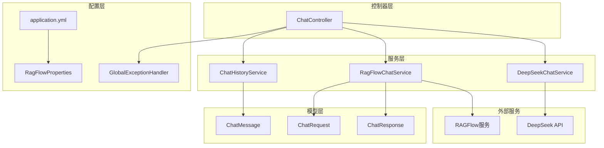
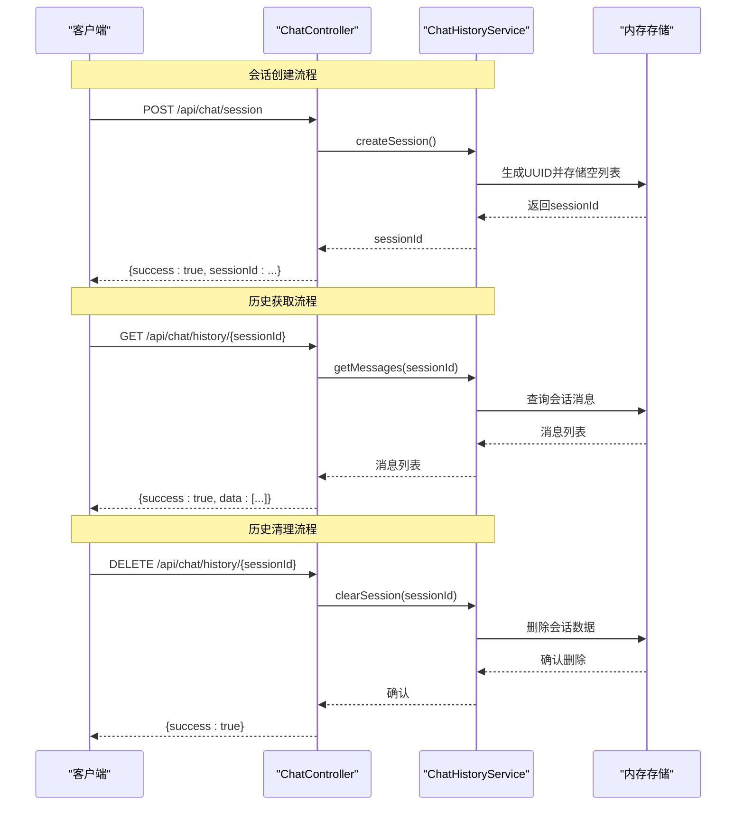
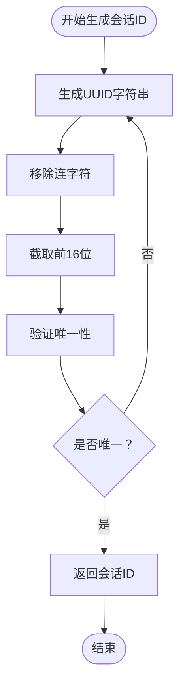
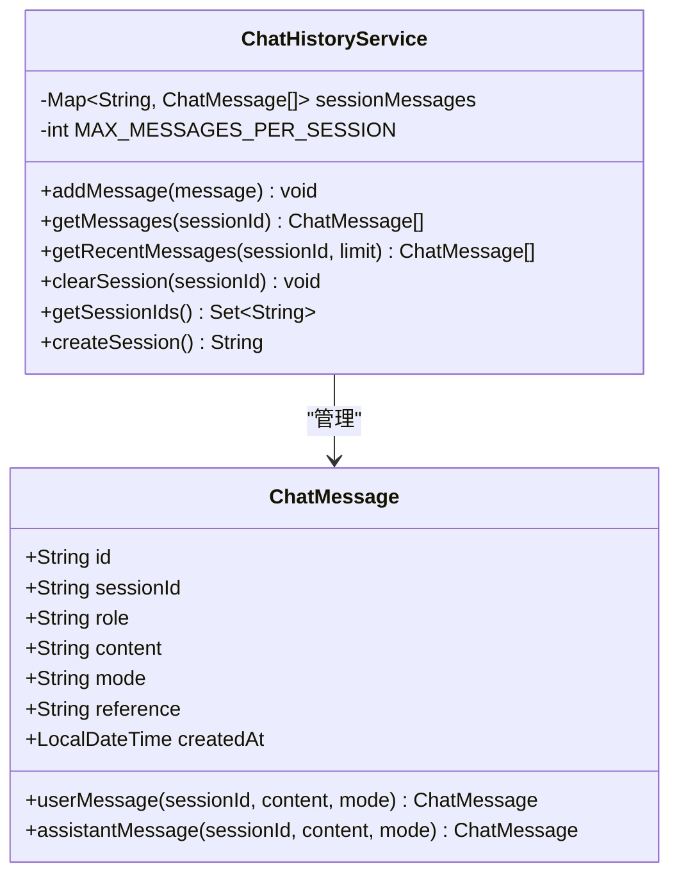
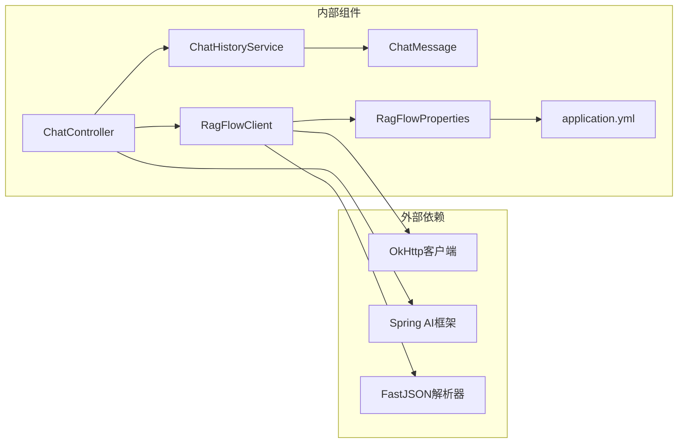
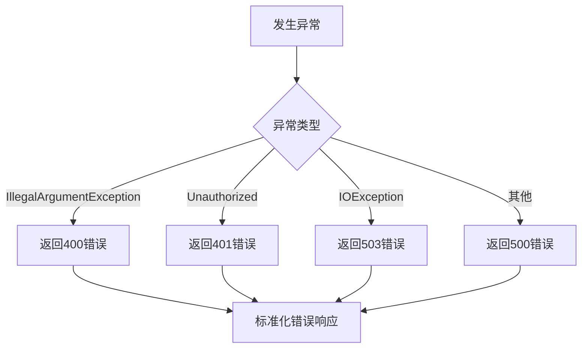

# 会话管理接口

<cite>
**本文档引用的文件**
- [ChatController.java](file://src/main/java/org/wiki/controller/ChatController.java)
- [ChatHistoryService.java](file://src/main/java/org/wiki/service/ChatHistoryService.java)
- [ChatMessage.java](file://src/main/java/org/wiki/model/ChatMessage.java)
- [application.yml](file://src/main/resources/application.yml)
- [RagFlowProperties.java](file://src/main/java/org/wiki/config/RagFlowProperties.java)
- [RagFlowClient.java](file://src/main/java/org/wiki/client/RagFlowClient.java)
- [GlobalExceptionHandler.java](file://src/main/java/org/wiki/config/GlobalExceptionHandler.java)
</cite>

## 目录
1. [简介](#简介)
2. [项目结构](#项目结构)
3. [核心组件](#核心组件)
4. [架构概览](#架构概览)
5. [详细组件分析](#详细组件分析)
6. [依赖分析](#依赖分析)
7. [性能考虑](#性能考虑)
8. [故障排除指南](#故障排除指南)
9. [结论](#结论)
10. [附录](#附录)

## 简介
本文件为会话管理接口的详细API文档，涵盖以下三个核心接口：
- 会话创建接口：POST /api/chat/session
- 会话历史获取接口：GET /api/chat/history/{sessionId}
- 会话历史清理接口：DELETE /api/chat/history/{sessionId}

文档详细说明了会话ID生成机制、会话状态管理、历史消息存储格式、会话生命周期、过期策略和内存管理机制，并提供最佳实践和常见问题解决方案。

## 项目结构
该项目采用Spring Boot框架构建，主要模块包括控制器层、服务层、模型层和配置层。会话管理功能位于控制器层的ChatController中，通过ChatHistoryService实现会话状态管理，ChatMessage定义消息数据结构。



**图表来源**
- [ChatController.java:1-276](file://src/main/java/org/wiki/controller/ChatController.java#L1-L276)
- [ChatHistoryService.java:1-88](file://src/main/java/org/wiki/service/ChatHistoryService.java#L1-L88)
- [application.yml:1-27](file://src/main/resources/application.yml#L1-L27)

**章节来源**
- [ChatController.java:1-276](file://src/main/java/org/wiki/controller/ChatController.java#L1-L276)
- [application.yml:1-27](file://src/main/resources/application.yml#L1-L27)

## 核心组件
会话管理功能由以下核心组件构成：

### ChatController
- 会话管理接口的入口控制器
- 实现会话创建、历史获取、历史清理等REST API
- 集成多种对话模式（RAGFlow、DeepSeek、RAG增强）

### ChatHistoryService
- 基于内存的会话历史存储服务
- 使用ConcurrentHashMap实现线程安全的会话管理
- 提供消息添加、获取、清理等操作

### ChatMessage
- 会话消息的数据模型
- 包含消息ID、会话ID、角色、内容、模式、引用信息、创建时间等字段
- 提供用户消息和助手消息的工厂方法

**章节来源**
- [ChatController.java:176-213](file://src/main/java/org/wiki/controller/ChatController.java#L176-L213)
- [ChatHistoryService.java:10-87](file://src/main/java/org/wiki/service/ChatHistoryService.java#L10-L87)
- [ChatMessage.java:10-82](file://src/main/java/org/wiki/model/ChatMessage.java#L10-L82)

## 架构概览
会话管理系统采用分层架构设计，各层职责清晰分离：



**图表来源**
- [ChatController.java:178-213](file://src/main/java/org/wiki/controller/ChatController.java#L178-L213)
- [ChatHistoryService.java:78-86](file://src/main/java/org/wiki/service/ChatHistoryService.java#L78-L86)

## 详细组件分析

### 会话创建接口
**接口定义**
- 方法：POST
- 路径：/api/chat/session
- 功能：创建新的会话并返回会话ID

**实现细节**
- 使用ChatHistoryService.createSession()生成会话ID
- 会话ID基于UUID随机生成，长度为16字符
- 新会话初始化为空消息列表

**响应格式**
```json
{
  "success": true,
  "sessionId": "生成的16位会话ID"
}
```

**错误处理**
- 生成会话ID失败时抛出异常
- 全局异常处理器统一处理并返回标准错误格式

**章节来源**
- [ChatController.java:182-189](file://src/main/java/org/wiki/controller/ChatController.java#L182-L189)
- [ChatHistoryService.java:81-86](file://src/main/java/org/wiki/service/ChatHistoryService.java#L81-L86)

### 会话历史获取接口
**接口定义**
- 方法：GET
- 路径：/api/chat/history/{sessionId}
- 参数：sessionId（路径参数）
- 功能：获取指定会话的所有历史消息

**实现细节**
- 通过ChatHistoryService.getMessages()查询会话消息
- 支持获取所有消息或最近N条消息
- 默认返回空列表表示无历史消息

**响应格式**
```json
{
  "success": true,
  "data": [
    {
      "id": "消息ID",
      "sessionId": "会话ID",
      "role": "user或assistant",
      "content": "消息内容",
      "mode": "对话模式",
      "reference": "引用信息",
      "createdAt": "创建时间"
    }
  ]
}
```

**查询优化建议**
- 对于大量历史消息，建议使用分页查询
- 可以实现按时间范围过滤的历史查询
- 考虑实现消息索引以支持快速检索

**章节来源**
- [ChatController.java:195-201](file://src/main/java/org/wiki/controller/ChatController.java#L195-L201)
- [ChatHistoryService.java:48-50](file://src/main/java/org/wiki/service/ChatHistoryService.java#L48-L50)

### 会话历史清理接口
**接口定义**
- 方法：DELETE
- 路径：/api/chat/history/{sessionId}
- 参数：sessionId（路径参数）
- 功能：清空指定会话的所有历史消息

**实现细节**
- 通过ChatHistoryService.clearSession()删除会话数据
- 删除操作不可恢复
- 清理后会话仍然存在但为空

**响应格式**
```json
{
  "success": true
}
```

**注意事项**
- 清理操作会释放内存空间
- 建议在会话结束时定期清理历史消息
- 对于重要对话场景，建议先备份再清理

**章节来源**
- [ChatController.java:207-213](file://src/main/java/org/wiki/controller/ChatController.java#L207-L213)
- [ChatHistoryService.java:66-69](file://src/main/java/org/wiki/service/ChatHistoryService.java#L66-L69)

### 会话ID生成机制
会话ID采用UUID随机生成算法：



**图表来源**
- [ChatHistoryService.java:81-86](file://src/main/java/org/wiki/service/ChatHistoryService.java#L81-L86)

**实现特点**
- 基于java.util.UUID.randomUUID()生成
- 移除连字符后截取前16位字符
- 通过ConcurrentHashMap确保并发安全性
- 长度固定为16位，便于存储和传输

**章节来源**
- [ChatHistoryService.java:81-86](file://src/main/java/org/wiki/service/ChatHistoryService.java#L81-L86)

### 会话状态管理
会话状态管理采用内存存储方案：



**图表来源**
- [ChatHistoryService.java:16-87](file://src/main/java/org/wiki/service/ChatHistoryService.java#L16-L87)
- [ChatMessage.java:17-82](file://src/main/java/org/wiki/model/ChatMessage.java#L17-L82)

**状态特性**
- 基于ConcurrentHashMap实现线程安全
- 支持高并发访问和修改
- 内存中缓存所有会话数据
- 自动消息数量限制（默认100条）

**章节来源**
- [ChatHistoryService.java:16-87](file://src/main/java/org/wiki/service/ChatHistoryService.java#L16-L87)

### 历史消息存储格式
消息存储采用结构化数据格式：

| 字段名 | 类型 | 必填 | 描述 | 示例 |
|--------|------|------|------|------|
| id | String | 是 | 消息唯一标识 | "550e8400-e29b-41d4-a716-446655440000" |
| sessionId | String | 是 | 所属会话ID | "a1b2c3d4e5f67890" |
| role | String | 是 | 消息角色 | "user" 或 "assistant" |
| content | String | 是 | 消息内容 | "你好，有什么可以帮助你的吗？" |
| mode | String | 否 | 对话模式 | "ragflow"、"deepseek"、"rag" |
| reference | String | 否 | 引用信息 | JSON格式的引用数据 |
| createdAt | LocalDateTime | 否 | 创建时间 | "2024-01-01T12:00:00" |

**存储策略**
- 每个会话维护独立的消息列表
- 支持消息数量上限控制（默认100条）
- 自动清理超出限制的旧消息
- 支持按会话ID快速检索

**章节来源**
- [ChatMessage.java:17-53](file://src/main/java/org/wiki/model/ChatMessage.java#L17-L53)
- [ChatHistoryService.java:31-43](file://src/main/java/org/wiki/service/ChatHistoryService.java#L31-L43)

## 依赖分析
会话管理功能的依赖关系如下：



**图表来源**
- [ChatController.java:32-41](file://src/main/java/org/wiki/controller/ChatController.java#L32-L41)
- [RagFlowClient.java:25-35](file://src/main/java/org/wiki/client/RagFlowClient.java#L25-L35)

**关键依赖**
- OkHttp：用于HTTP通信，支持连接超时、读写超时配置
- Spring AI：提供OpenAI兼容的对话能力
- FastJSON：用于JSON数据的序列化和反序列化
- Lombok：简化Java代码，自动生成getter/setter等方法

**章节来源**
- [RagFlowClient.java:25-35](file://src/main/java/org/wiki/client/RagFlowClient.java#L25-L35)
- [application.yml:17-22](file://src/main/resources/application.yml#L17-L22)

## 性能考虑
会话管理系统的性能特性：

### 内存管理
- **内存使用**：每个会话占用约1KB内存（取决于消息数量）
- **消息限制**：默认每会话最多100条消息，防止内存无限增长
- **自动清理**：超出限制时自动删除最旧的消息
- **并发安全**：使用ConcurrentHashMap确保多线程安全

### 并发处理
- **线程池**：使用cached thread pool处理异步操作
- **SSE支持**：支持Server-Sent Events流式传输
- **响应式编程**：部分接口支持Flux响应式流

### 缓存策略
- **会话缓存**：内存中缓存所有会话数据
- **消息缓存**：最近访问的消息保持在内存中
- **配置缓存**：应用配置在启动时加载并缓存

**优化建议**
1. **生产环境迁移**：将内存存储迁移到数据库持久化
2. **会话超时**：实现会话空闲超时机制
3. **批量操作**：支持批量消息查询和清理
4. **压缩存储**：对长文本内容进行压缩存储

## 故障排除指南
常见问题及解决方案：

### 会话创建失败
**症状**：POST /api/chat/session返回错误
**可能原因**：
- 会话ID生成冲突
- 内存不足导致创建失败
- 线程池资源耗尽

**解决方法**：
1. 检查系统内存使用情况
2. 查看应用日志中的异常信息
3. 增加JVM堆内存大小
4. 重启应用服务

### 历史消息查询异常
**症状**：GET /api/chat/history/{sessionId}返回空列表或错误
**可能原因**：
- 会话ID不存在
- 消息存储损坏
- 并发访问冲突

**解决方法**：
1. 验证会话ID的有效性
2. 检查会话是否已被清理
3. 重新创建会话并重试
4. 查看服务端异常日志

### 会话清理无效
**症状**：DELETE /api/chat/history/{sessionId}执行后消息仍然存在
**可能原因**：
- 会话ID错误
- 权限不足
- 并发修改冲突

**解决方法**：
1. 确认会话ID正确无误
2. 检查用户权限设置
3. 等待当前操作完成后再试
4. 重启应用服务

### 异常处理机制
系统提供统一的异常处理：



**图表来源**
- [GlobalExceptionHandler.java:20-44](file://src/main/java/org/wiki/config/GlobalExceptionHandler.java#L20-L44)

**错误响应格式**
```json
{
  "success": false,
  "message": "错误描述信息"
}
```

**章节来源**
- [GlobalExceptionHandler.java:20-44](file://src/main/java/org/wiki/config/GlobalExceptionHandler.java#L20-L44)

## 结论
会话管理接口提供了完整的对话状态管理功能，具有以下特点：

**优势**
- 简洁的API设计，易于集成和使用
- 基于内存的高性能存储方案
- 完善的异常处理和错误恢复机制
- 支持多种对话模式和流式传输

**局限性**
- 生产环境需要数据库持久化支持
- 内存存储不适合大规模部署
- 缺少会话超时和自动清理机制

**建议**
1. 在生产环境中替换内存存储为数据库
2. 实现会话超时和自动清理功能
3. 添加会话状态监控和统计功能
4. 考虑实现会话数据备份和恢复机制

## 附录

### API完整规范
所有会话管理接口的完整规范：

**会话创建**
- 方法：POST
- 路径：/api/chat/session
- 请求体：无
- 响应：包含success和sessionId字段

**历史获取**
- 方法：GET
- 路径：/api/chat/history/{sessionId}
- 路径参数：sessionId
- 响应：包含success和data字段

**历史清理**
- 方法：DELETE
- 路径：/api/chat/history/{sessionId}
- 路径参数：sessionId
- 响应：包含success字段

### 配置参考
应用配置文件中的相关设置：

| 配置项 | 默认值 | 描述 |
|--------|--------|------|
| server.port | 8081 | 应用监听端口 |
| ragflow.base-url | http://localhost:80 | RAGFlow服务地址 |
| ragflow.timeout | 120秒 | 请求超时时间 |
| spring.ai.openai.max-tokens | 4096 | 最大生成tokens数 |

**章节来源**
- [application.yml:1-27](file://src/main/resources/application.yml#L1-L27)