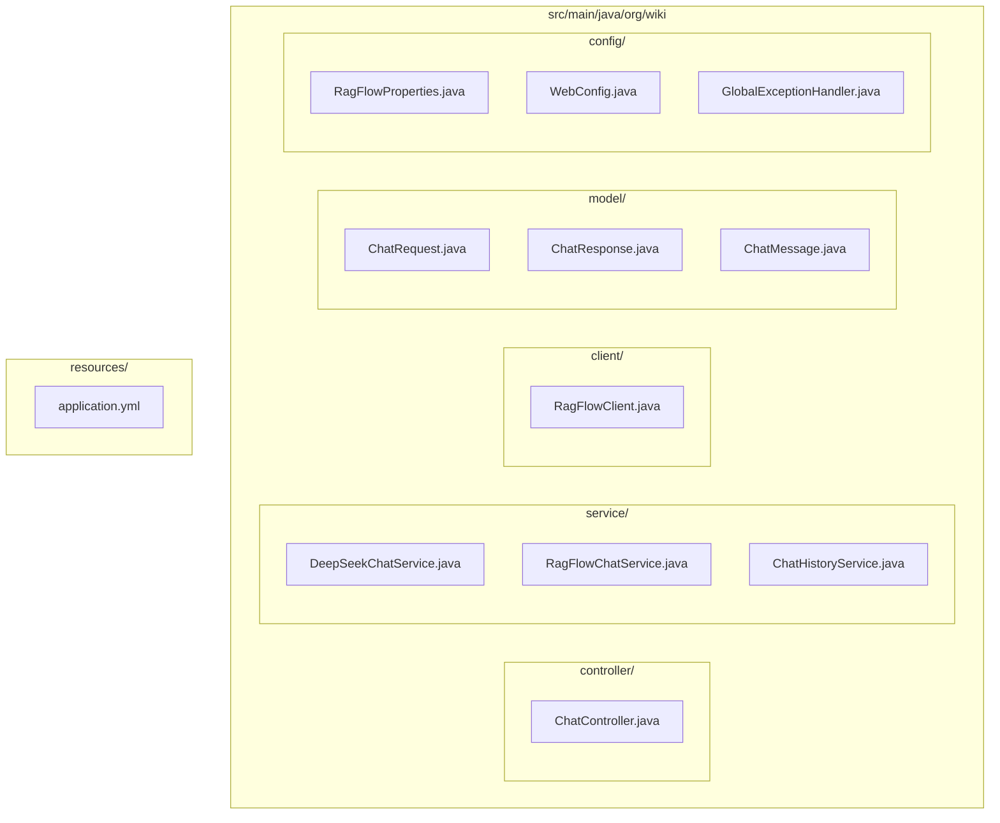
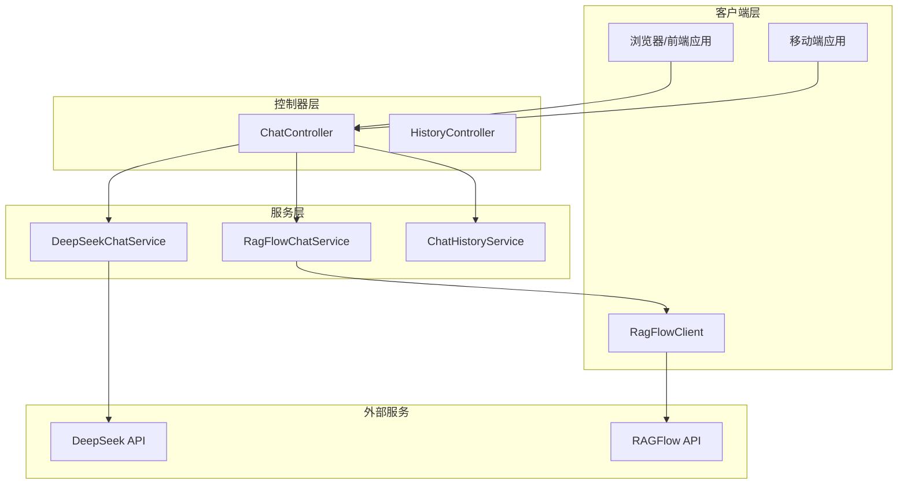
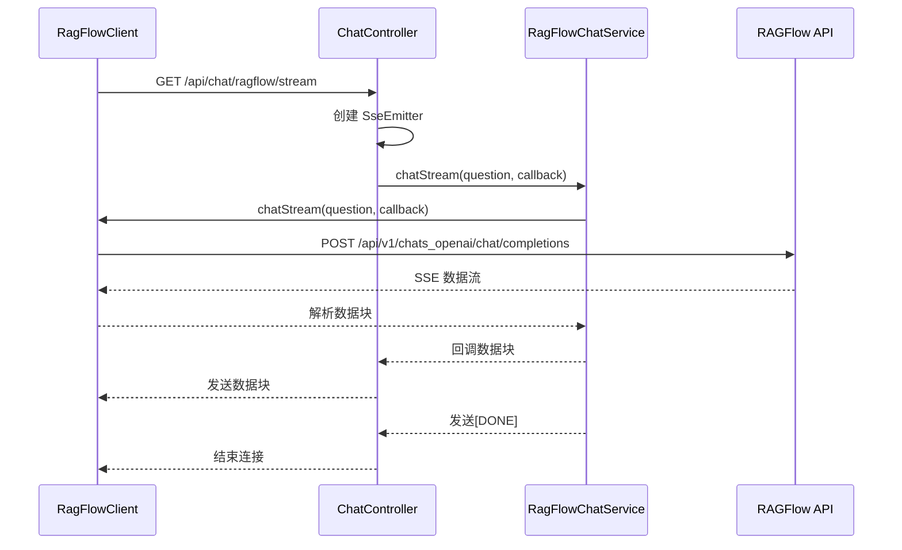
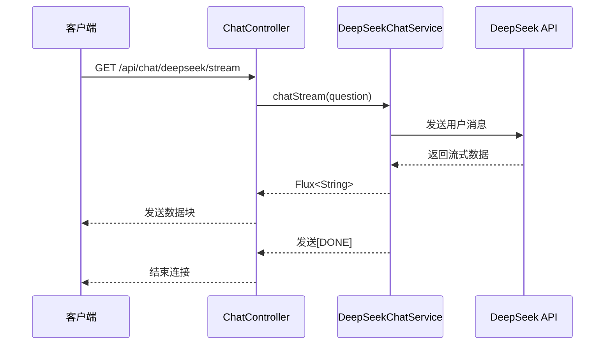

# 对话接口

<cite>
**本文档中引用的文件**
- [ChatController.java](file://src/main/java/org/wiki/controller/ChatController.java)
- [DeepSeekChatService.java](file://src/main/java/org/wiki/service/DeepSeekChatService.java)
- [RagFlowChatService.java](file://src/main/java/org/wiki/service/RagFlowChatService.java)
- [RagFlowClient.java](file://src/main/java/org/wiki/client/RagFlowClient.java)
- [ChatHistoryService.java](file://src/main/java/org/wiki/service/ChatHistoryService.java)
- [ChatRequest.java](file://src/main/java/org/wiki/model/ChatRequest.java)
- [ChatResponse.java](file://src/main/java/org/wiki/model/ChatResponse.java)
- [ChatMessage.java](file://src/main/java/org/wiki/model/ChatMessage.java)
- [RagFlowProperties.java](file://src/main/java/org/wiki/config/RagFlowProperties.java)
- [WebConfig.java](file://src/main/java/org/wiki/config/WebConfig.java)
- [GlobalExceptionHandler.java](file://src/main/java/org/wiki/config/GlobalExceptionHandler.java)
- [application.yml](file://src/main/resources/application.yml)
</cite>

## 目录
1. [简介](#简介)
2. [项目结构](#项目结构)
3. [核心组件](#核心组件)
4. [架构概览](#架构概览)
5. [详细接口文档](#详细接口文档)
6. [会话管理接口](#会话管理接口)
7. [流式接口实现](#流式接口实现)
8. [数据模型](#数据模型)
9. [错误处理](#错误处理)
10. [性能考虑](#性能考虑)
11. [故障排除指南](#故障排除指南)
12. [总结](#总结)

## 简介

本项目提供了一个基于 Spring Boot 的对话接口服务，集成了 RAGFlow 知识库问答和 DeepSeek 大语言模型对话功能。系统支持三种对话模式：

1. **RAGFlow 知识库问答** - 通过 RAGFlow 服务进行精确的知识库检索和问答
2. **DeepSeek 直接对话** - 直接调用 DeepSeek API 进行通用对话
3. **DeepSeek + RAG 增强对话** - 结合知识库检索的智能问答

系统还提供了完整的会话管理和历史记录功能，支持流式和非流式两种交互方式。

## 项目结构

项目采用标准的 Spring Boot 分层架构，主要目录结构如下：



**图表来源**
- [ChatController.java:1-276](file://src/main/java/org/wiki/controller/ChatController.java#L1-L276)
- [DeepSeekChatService.java:1-125](file://src/main/java/org/wiki/service/DeepSeekChatService.java#L1-L125)
- [RagFlowChatService.java:1-84](file://src/main/java/org/wiki/service/RagFlowChatService.java#L1-L84)

**章节来源**
- [ChatController.java:1-276](file://src/main/java/org/wiki/controller/ChatController.java#L1-L276)
- [application.yml:1-27](file://src/main/resources/application.yml#L1-L27)

## 核心组件

系统的核心组件包括：

### 控制器层
- **ChatController**: 主要的 REST API 控制器，负责路由和业务逻辑协调

### 服务层
- **DeepSeekChatService**: DeepSeek 对话服务，支持纯对话和 RAG 增强对话
- **RagFlowChatService**: RAGFlow 对话服务，封装知识库问答功能
- **ChatHistoryService**: 会话历史管理服务

### 客户端层
- **RagFlowClient**: RAGFlow API 客户端，处理 HTTP 通信

### 配置层
- **RagFlowProperties**: RAGFlow 服务配置
- **WebConfig**: Web 应用配置，包括 CORS 设置
- **GlobalExceptionHandler**: 全局异常处理

**章节来源**
- [ChatController.java:20-42](file://src/main/java/org/wiki/controller/ChatController.java#L20-L42)
- [DeepSeekChatService.java:15-28](file://src/main/java/org/wiki/service/DeepSeekChatService.java#L15-L28)
- [RagFlowChatService.java:12-24](file://src/main/java/org/wiki/service/RagFlowChatService.java#L12-L24)

## 架构概览

系统采用分层架构设计，各层职责清晰分离：



**图表来源**
- [ChatController.java:27-41](file://src/main/java/org/wiki/controller/ChatController.java#L27-L41)
- [DeepSeekChatService.java:20-28](file://src/main/java/org/wiki/service/DeepSeekChatService.java#L20-L28)
- [RagFlowChatService.java:16-24](file://src/main/java/org/wiki/service/RagFlowChatService.java#L16-L24)

## 详细接口文档

### RAGFlow 知识库问答接口

#### 非流式接口
- **HTTP 方法**: POST
- **URL**: `/api/chat/ragflow`
- **请求参数**: 
  - `question` (String, 必填): 用户问题
  - `sessionId` (String, 可选): 会话ID
- **响应格式**: JSON 对象
  - `success` (Boolean): 请求是否成功
  - `answer` (String): 问答结果
  - `sessionId` (String): 会话ID
  - `data` (Object): 原始响应数据

**章节来源**
- [ChatController.java:43-76](file://src/main/java/org/wiki/controller/ChatController.java#L43-L76)

#### 流式接口
- **HTTP 方法**: GET
- **URL**: `/api/chat/ragflow/stream`
- **请求参数**: 
  - `question` (String, 必填): 用户问题
- **响应格式**: Server-Sent Events (SSE)
  - 文本数据块，最后以 `[DONE]` 结束

**章节来源**
- [ChatController.java:78-107](file://src/main/java/org/wiki/controller/ChatController.java#L78-L107)

### DeepSeek 直接对话接口

#### 非流式接口
- **HTTP 方法**: POST
- **URL**: `/api/chat/deepseek`
- **请求参数**: 
  - `question` (String, 必填): 用户问题
  - `sessionId` (String, 可选): 会话ID
- **响应格式**: JSON 对象
  - `success` (Boolean): 请求是否成功
  - `answer` (String): 模型回答
  - `sessionId` (String): 会话ID

**章节来源**
- [ChatController.java:109-137](file://src/main/java/org/wiki/controller/ChatController.java#L109-L137)

#### 流式接口
- **HTTP 方法**: GET
- **URL**: `/api/chat/deepseek/stream`
- **请求参数**: 
  - `question` (String, 必填): 用户问题
- **响应格式**: Server-Sent Events (SSE)
  - Spring AI 原生 Flux 流式输出

**章节来源**
- [ChatController.java:215-228](file://src/main/java/org/wiki/controller/ChatController.java#L215-L228)

### DeepSeek + RAG 增强对话接口

#### 非流式接口
- **HTTP 方法**: POST
- **URL**: `/api/chat/deepseek/rag`
- **请求参数**: 
  - `question` (String, 必填): 用户问题
  - `sessionId` (String, 可选): 会话ID
- **响应格式**: JSON 对象
  - `success` (Boolean): 请求是否成功
  - `answer` (String): 模型回答
  - `context` (String): 检索到的知识上下文
  - `sessionId` (String): 会话ID

**章节来源**
- [ChatController.java:139-174](file://src/main/java/org/wiki/controller/ChatController.java#L139-L174)

#### 流式接口
- **HTTP 方法**: GET
- **URL**: `/api/chat/deepseek/rag/stream`
- **请求参数**: 
  - `question` (String, 必填): 用户问题
- **响应格式**: Server-Sent Events (SSE)
  - 先发送检索到的上下文，然后是流式回答

**章节来源**
- [ChatController.java:230-274](file://src/main/java/org/wiki/controller/ChatController.java#L230-L274)

## 会话管理接口

### 创建会话
- **HTTP 方法**: POST
- **URL**: `/api/chat/session`
- **请求参数**: 无
- **响应格式**: JSON 对象
  - `success` (Boolean): 请求是否成功
  - `sessionId` (String): 新创建的会话ID

**章节来源**
- [ChatController.java:178-189](file://src/main/java/org/wiki/controller/ChatController.java#L178-L189)

### 获取历史记录
- **HTTP 方法**: GET
- **URL**: `/api/chat/history/{sessionId}`
- **路径参数**: 
  - `sessionId` (String, 必填): 会话ID
- **响应格式**: JSON 对象
  - `success` (Boolean): 请求是否成功
  - `data` (Array): 消息列表

**章节来源**
- [ChatController.java:191-201](file://src/main/java/org/wiki/controller/ChatController.java#L191-L201)

### 清空历史记录
- **HTTP 方法**: DELETE
- **URL**: `/api/chat/history/{sessionId}`
- **路径参数**: 
  - `sessionId` (String, 必填): 会话ID
- **响应格式**: JSON 对象
  - `success` (Boolean): 请求是否成功

**章节来源**
- [ChatController.java:203-213](file://src/main/java/org/wiki/controller/ChatController.java#L203-L213)

## 流式接口实现

系统实现了多种流式接口，采用不同的技术方案：

### RAGFlow 流式实现
使用传统的 SSE 实现，支持自定义线程池：



**图表来源**
- [ChatController.java:85-107](file://src/main/java/org/wiki/controller/ChatController.java#L85-L107)
- [RagFlowChatService.java:50-72](file://src/main/java/org/wiki/service/RagFlowChatService.java#L50-L72)
- [RagFlowClient.java:154-200](file://src/main/java/org/wiki/client/RagFlowClient.java#L154-L200)

### DeepSeek 流式实现
使用 Spring AI 的原生 Flux 实现：



**图表来源**
- [ChatController.java:223-228](file://src/main/java/org/wiki/controller/ChatController.java#L223-L228)
- [DeepSeekChatService.java:86-92](file://src/main/java/org/wiki/service/DeepSeekChatService.java#L86-L92)

## 数据模型

### ChatRequest 模型
用于 RAGFlow API 请求的数据结构：

| 字段名 | 类型 | 必填 | 描述 |
|--------|------|------|------|
| model | String | 否 | 模型名称（RAGFlow 自动解析） |
| messages | Array | 是 | 消息列表 |
| stream | Boolean | 否 | 是否流式输出 |
| extraBody | Object | 否 | 额外参数 |

**章节来源**
- [ChatRequest.java:10-59](file://src/main/java/org/wiki/model/ChatRequest.java#L10-L59)

### ChatResponse 模型
用于 RAGFlow API 响应的数据结构：

| 字段名 | 类型 | 描述 |
|--------|------|------|
| id | String | 响应ID |
| object | String | 对象类型 |
| created | Long | 创建时间 |
| model | String | 模型名称 |
| choices | Array | 回答选择列表 |
| usage | Object | 使用统计 |

**章节来源**
- [ChatResponse.java:10-52](file://src/main/java/org/wiki/model/ChatResponse.java#L10-L52)

### ChatMessage 模型
用于会话历史的消息结构：

| 字段名 | 类型 | 描述 |
|--------|------|------|
| id | String | 消息ID |
| sessionId | String | 会话ID |
| role | String | 角色（user/assistant） |
| content | String | 消息内容 |
| mode | String | 对话模式（ragflow/deepseek/rag） |
| reference | String | 引用信息 |
| createdAt | DateTime | 创建时间 |

**章节来源**
- [ChatMessage.java:10-82](file://src/main/java/org/wiki/model/ChatMessage.java#L10-L82)

## 错误处理

系统实现了完善的错误处理机制：

### 全局异常处理
- **IllegalArgumentException**: 返回 400 Bad Request
- **Unauthorized**: 返回 401 Unauthorized  
- **IOException**: 返回 503 Service Unavailable
- **其他异常**: 返回 500 Internal Server Error

### RAGFlow 特定错误
- **API 调用失败**: 返回 "RAGFlow 服务调用失败" 消息
- **超时**: 基于配置的超时时间（默认 120 秒）

### 异常响应格式
所有错误响应都遵循统一格式：
```json
{
  "success": false,
  "message": "错误描述"
}
```

**章节来源**
- [GlobalExceptionHandler.java:13-46](file://src/main/java/org/wiki/config/GlobalExceptionHandler.java#L13-L46)
- [RagFlowClient.java:37-57](file://src/main/java/org/wiki/client/RagFlowClient.java#L37-L57)

## 性能考虑

### 连接池配置
- **OkHttp 客户端**: 使用连接池，支持并发请求
- **线程池**: 使用 `Executors.newCachedThreadPool()` 处理流式请求
- **超时设置**: RAGFlow 默认超时 120 秒

### 内存管理
- **会话限制**: 每个会话最多存储 100 条消息
- **自动清理**: 超过限制时自动清理最早的消息
- **并发安全**: 使用 `ConcurrentHashMap` 确保线程安全

### 缓存策略
- **会话存储**: 基于内存存储（生产环境建议使用数据库）
- **响应缓存**: 未实现响应缓存，确保实时性

## 故障排除指南

### 常见问题及解决方案

#### RAGFlow 服务不可达
**症状**: 所有 RAGFlow 相关接口返回 503 错误
**原因**: 
- RAGFlow 服务地址配置错误
- API Key 无效
- 网络连接问题

**解决方法**:
1. 检查 `application.yml` 中的 `ragflow.base-url` 配置
2. 验证 `ragflow.api-key` 和 `ragflow.chat-id`
3. 确认网络连通性

#### DeepSeek API 认证失败
**症状**: DeepSeek 相关接口返回 401 错误
**原因**: 
- `spring.ai.openai.api-key` 配置错误
- API Key 已过期

**解决方法**:
1. 更新 `spring.ai.openai.api-key` 为有效的 DeepSeek API Key
2. 确认 API Key 权限正确

#### 流式连接中断
**症状**: 流式接口在传输过程中断开
**原因**:
- RAGFlow 服务超时
- 网络不稳定
- 客户端连接超时

**解决方法**:
1. 增加 `ragflow.timeout` 配置值
2. 检查网络稳定性
3. 在客户端实现重连机制

#### 会话历史丢失
**症状**: 重启应用后会话历史消失
**原因**: 使用的是内存存储，非持久化存储

**解决方法**:
1. 在生产环境使用数据库替换内存存储
2. 实现会话数据的持久化

**章节来源**
- [application.yml:17-27](file://src/main/resources/application.yml#L17-L27)
- [ChatHistoryService.java:18-27](file://src/main/java/org/wiki/service/ChatHistoryService.java#L18-L27)

## 总结

本项目提供了一个功能完整的对话接口服务，具有以下特点：

### 技术优势
- **多模型支持**: 同时支持 RAGFlow 和 DeepSeek 两种对话模式
- **流式处理**: 提供 SSE 流式接口，提升用户体验
- **会话管理**: 完整的会话生命周期管理
- **错误处理**: 统一的异常处理机制

### 架构特点
- **分层清晰**: 控制器、服务、客户端三层架构
- **配置灵活**: 基于 Spring Boot 的配置体系
- **扩展性强**: 易于添加新的对话模式和服务

### 使用建议
1. 生产环境建议使用数据库替换内存存储
2. 根据实际需求调整超时时间和连接池配置
3. 实现适当的监控和日志记录
4. 考虑实现会话数据的备份和恢复机制