# 流式对话接口

<cite>
**本文档中引用的文件**
- [ChatController.java](file://src/main/java/org/wiki/controller/ChatController.java)
- [RagFlowChatService.java](file://src/main/java/org/wiki/service/RagFlowChatService.java)
- [DeepSeekChatService.java](file://src/main/java/org/wiki/service/DeepSeekChatService.java)
- [RagFlowClient.java](file://src/main/java/org/wiki/client/RagFlowClient.java)
- [ChatChunk.java](file://src/main/java/org/wiki/model/ChatChunk.java)
- [ChatResponse.java](file://src/main/java/org/wiki/model/ChatResponse.java)
- [ChatRequest.java](file://src/main/java/org/wiki/model/ChatRequest.java)
- [RagFlowProperties.java](file://src/main/java/org/wiki/config/RagFlowProperties.java)
- [application.yml](file://src/main/resources/application.yml)
- [index.html](file://src/main/resources/templates/index.html)
</cite>

## 目录
1. [简介](#简介)
2. [项目结构](#项目结构)
3. [核心组件](#核心组件)
4. [架构概览](#架构概览)
5. [详细组件分析](#详细组件分析)
6. [流式接口规范](#流式接口规范)
7. [SSE 连接规范](#sse-连接规范)
8. [数据流处理](#数据流处理)
9. [错误处理策略](#错误处理策略)
10. [客户端实现指南](#客户端实现指南)
11. [性能优化建议](#性能优化建议)
12. [故障排除指南](#故障排除指南)
13. [结论](#结论)

## 简介

本项目提供了一个基于 Spring Boot 的流式对话接口系统，支持三种对话模式：

1. **RAGFlow 知识库问答** - 通过 RAGFlow 服务进行知识库检索和问答
2. **DeepSeek 直接对话** - 直接调用 DeepSeek API 进行对话
3. **DeepSeek + RAG 增强对话** - 结合知识库检索的增强对话模式

系统采用 SSE（Server-Sent Events）协议实现实时流式数据传输，支持完整的流式对话体验，包括实时字幕显示、引用信息展示和断线重连机制。

## 项目结构

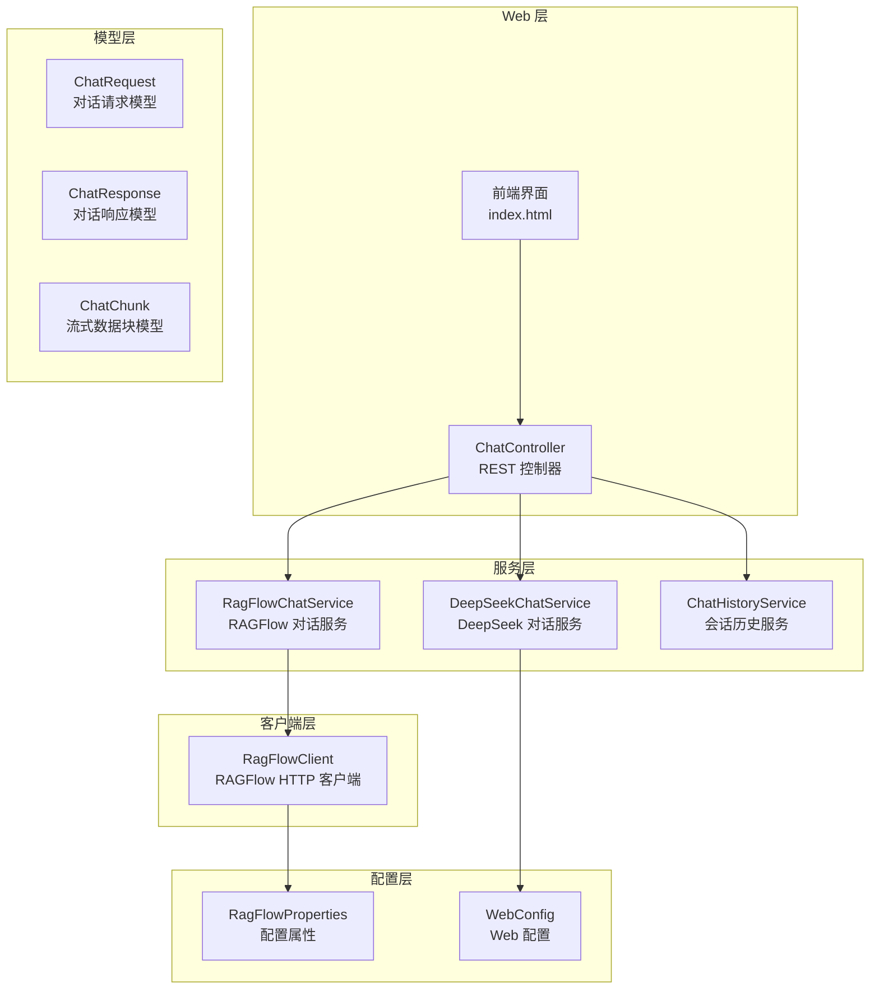

**图表来源**
- [ChatController.java:1-276](file://src/main/java/org/wiki/controller/ChatController.java#L1-L276)
- [RagFlowChatService.java:1-84](file://src/main/java/org/wiki/service/RagFlowChatService.java#L1-L84)
- [DeepSeekChatService.java:1-125](file://src/main/java/org/wiki/service/DeepSeekChatService.java#L1-L125)

**章节来源**
- [ChatController.java:20-41](file://src/main/java/org/wiki/controller/ChatController.java#L20-L41)
- [application.yml:1-27](file://src/main/resources/application.yml#L1-L27)

## 核心组件

### ChatController - 主控制器

负责处理所有对话相关的 HTTP 请求，提供三种流式对话接口：

- `/api/chat/ragflow/stream` - RAGFlow 知识库问答流式接口
- `/api/chat/deepseek/stream` - DeepSeek 直接对话流式接口  
- `/api/chat/deepseek/rag/stream` - DeepSeek + RAG 增强对话流式接口

### RagFlowChatService - RAGFlow 对话服务

封装 RAGFlow API 调用，支持流式和非流式两种模式：

- `chat()` - 非流式对话
- `chatStream()` - 流式对话，支持引用信息处理
- `extractAnswer()` - 提取回答内容

### DeepSeekChatService - DeepSeek 对话服务

基于 Spring AI 框架，支持多种对话模式：

- `chat()` - 纯对话模式
- `chatWithContext()` - RAG 增强模式
- `chatStream()` - 流式对话模式
- `chatStreamWithContext()` - RAG 增强流式对话模式

**章节来源**
- [ChatController.java:32-41](file://src/main/java/org/wiki/controller/ChatController.java#L32-L41)
- [RagFlowChatService.java:20-24](file://src/main/java/org/wiki/service/RagFlowChatService.java#L20-L24)
- [DeepSeekChatService.java:24-28](file://src/main/java/org/wiki/service/DeepSeekChatService.java#L24-L28)

## 架构概览

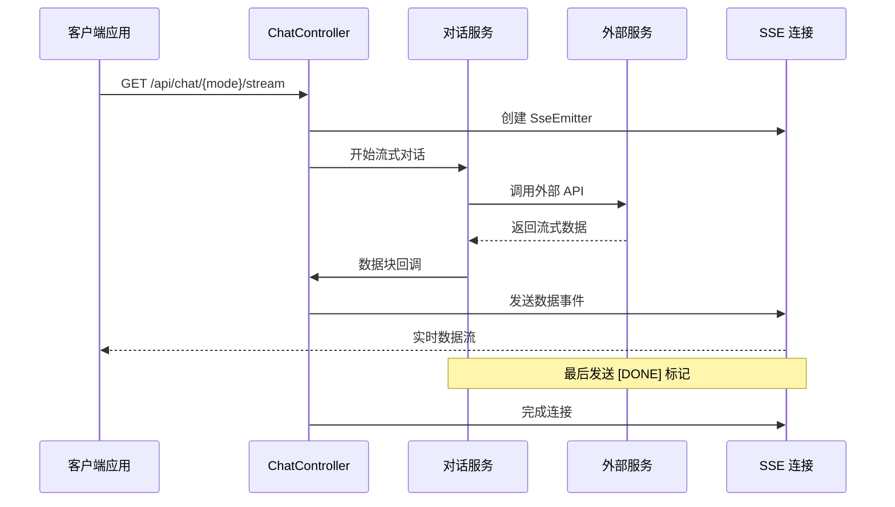

**图表来源**
- [ChatController.java:85-107](file://src/main/java/org/wiki/controller/ChatController.java#L85-L107)
- [ChatController.java:238-274](file://src/main/java/org/wiki/controller/ChatController.java#L238-L274)

## 详细组件分析

### ChatController 组件结构

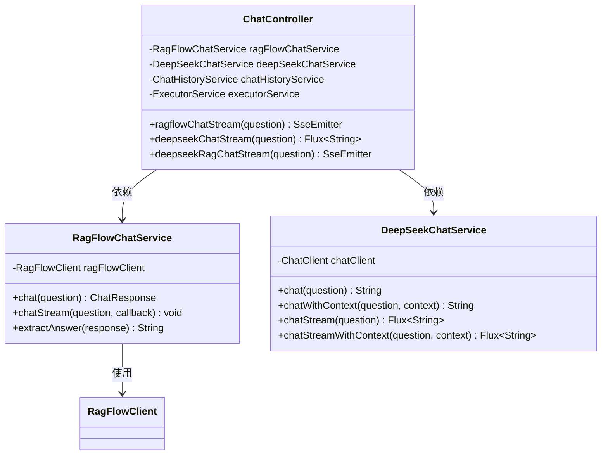

**图表来源**
- [ChatController.java:32-41](file://src/main/java/org/wiki/controller/ChatController.java#L32-L41)
- [RagFlowChatService.java:20-24](file://src/main/java/org/wiki/service/RagFlowChatService.java#L20-L24)
- [DeepSeekChatService.java:24-28](file://src/main/java/org/wiki/service/DeepSeekChatService.java#L24-L28)

**章节来源**
- [ChatController.java:20-41](file://src/main/java/org/wiki/controller/ChatController.java#L20-L41)

### RagFlowClient 组件结构

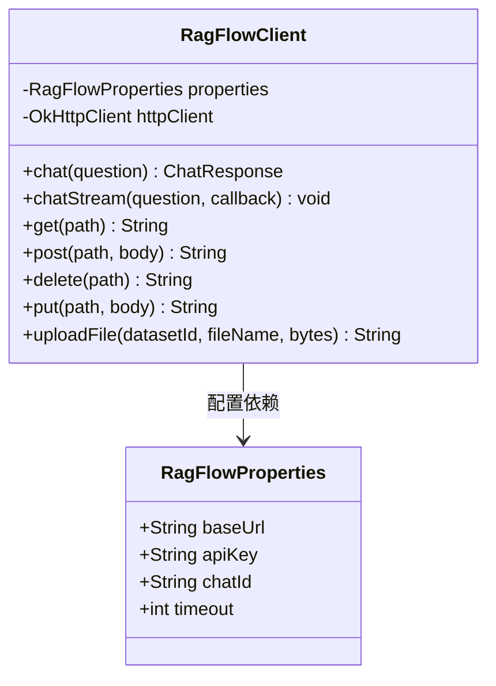

**图表来源**
- [RagFlowClient.java:25-35](file://src/main/java/org/wiki/client/RagFlowClient.java#L25-L35)
- [RagFlowProperties.java:10-31](file://src/main/java/org/wiki/config/RagFlowProperties.java#L10-L31)

**章节来源**
- [RagFlowClient.java:17-35](file://src/main/java/org/wiki/client/RagFlowClient.java#L17-L35)

## 流式接口规范

### RAGFlow 流式接口

**接口定义**
- **URL**: `/api/chat/ragflow/stream`
- **HTTP 方法**: GET
- **内容类型**: `text/event-stream`
- **超时时间**: 5 分钟

**请求参数**
- `question` (必需): 用户问题字符串

**响应格式**
- SSE 事件流，每个事件包含一个数据块
- 最后发送特殊标记 `[DONE]`

### DeepSeek 流式接口

**接口定义**
- **URL**: `/api/chat/deepseek/stream`
- **HTTP 方法**: GET
- **内容类型**: `text/event-stream`

**请求参数**
- `question` (必需): 用户问题字符串

**响应格式**
- Spring AI 原生 Flux 流式输出
- 自动添加 `[DONE]` 标记

### DeepSeek RAG 增强流式接口

**接口定义**
- **URL**: `/api/chat/deepseek/rag/stream`
- **HTTP 方法**: GET
- **内容类型**: `text/event-stream`

**请求流程**
1. 先调用 RAGFlow 获取知识库检索结果
2. 将检索结果作为上下文传给 DeepSeek
3. DeepSeek 基于上下文进行流式回答

**请求参数**
- `question` (必需): 用户问题字符串

**响应格式**
- 流式回答数据块
- 包含引用信息的特殊标记

**章节来源**
- [ChatController.java:85-107](file://src/main/java/org/wiki/controller/ChatController.java#L85-L107)
- [ChatController.java:223-228](file://src/main/java/org/wiki/controller/ChatController.java#L223-L228)
- [ChatController.java:238-274](file://src/main/java/org/wiki/controller/ChatController.java#L238-L274)

## SSE 连接规范

### 连接建立

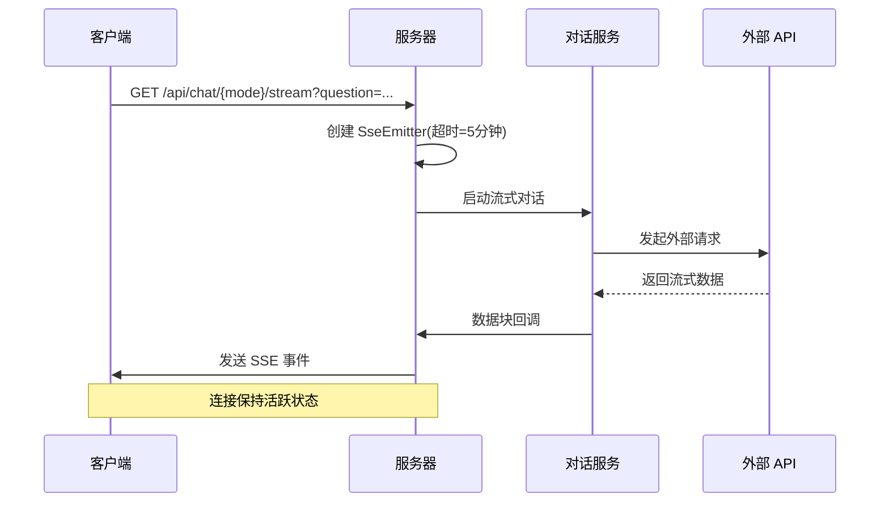

**图表来源**
- [ChatController.java:87-104](file://src/main/java/org/wiki/controller/ChatController.java#L87-L104)

### 连接超时机制

- **RAGFlow 流式接口**: 5 分钟超时
- **DeepSeek 流式接口**: 5 分钟超时  
- **DeepSeek RAG 增强流式接口**: 5 分钟超时

超时后自动断开连接，客户端需要实现重连逻辑。

### 断线重连策略

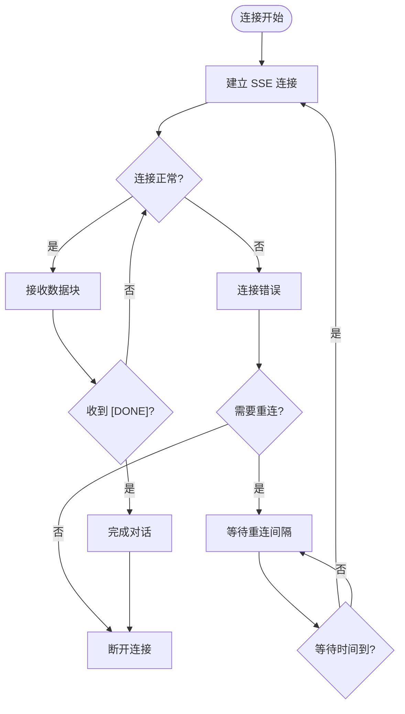

**图表来源**
- [ChatController.java:87-104](file://src/main/java/org/wiki/controller/ChatController.java#L87-L104)

**章节来源**
- [ChatController.java:87-104](file://src/main/java/org/wiki/controller/ChatController.java#L87-L104)

## 数据流处理

### 流式数据格式

#### RAGFlow 流式数据结构

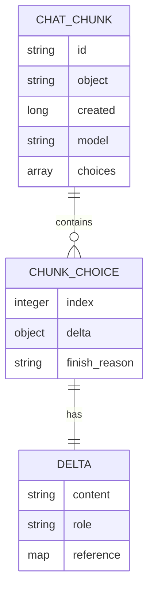

**图表来源**
- [ChatChunk.java:16-41](file://src/main/java/org/wiki/model/ChatChunk.java#L16-L41)

#### DeepSeek 流式数据格式

DeepSeek 使用 Spring AI 原生的流式输出格式，直接返回模型生成的文本内容。

### 数据处理流程

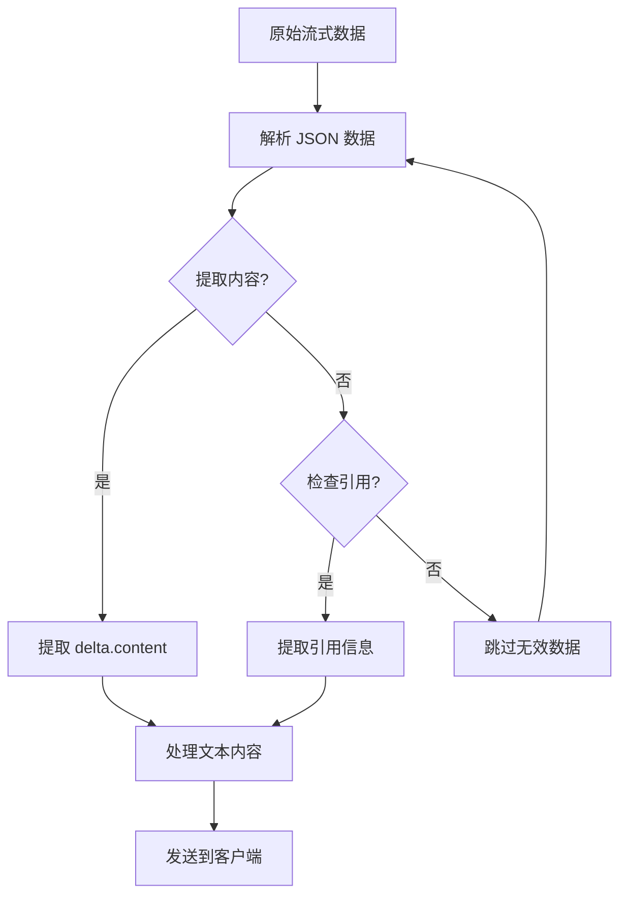

**图表来源**
- [RagFlowChatService.java:50-72](file://src/main/java/org/wiki/service/RagFlowChatService.java#L50-L72)

### 完成标记处理

所有流式接口在对话完成后都会发送 `[DONE]` 标记：

- **RAGFlow 流式接口**: 显式发送 `[DONE]` 事件
- **DeepSeek 流式接口**: 使用 `Flux.concatWith()` 添加 `[DONE]`  
- **DeepSeek RAG 增强流式接口**: 在流式订阅完成后发送 `[DONE]`

**章节来源**
- [RagFlowChatService.java:50-72](file://src/main/java/org/wiki/service/RagFlowChatService.java#L50-L72)
- [ChatController.java:98](file://src/main/java/org/wiki/controller/ChatController.java#L98)
- [ChatController.java:227](file://src/main/java/org/wiki/controller/ChatController.java#L227)

## 错误处理策略

### 错误分类

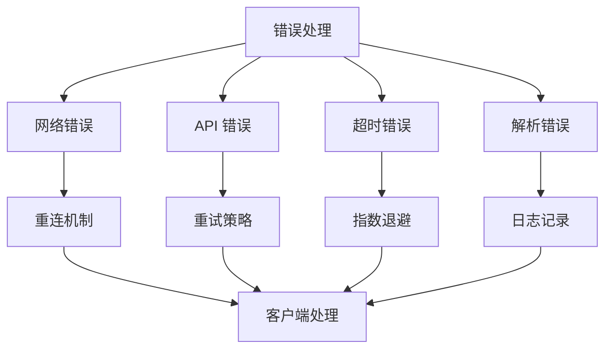

### 错误处理实现

#### 网络异常处理

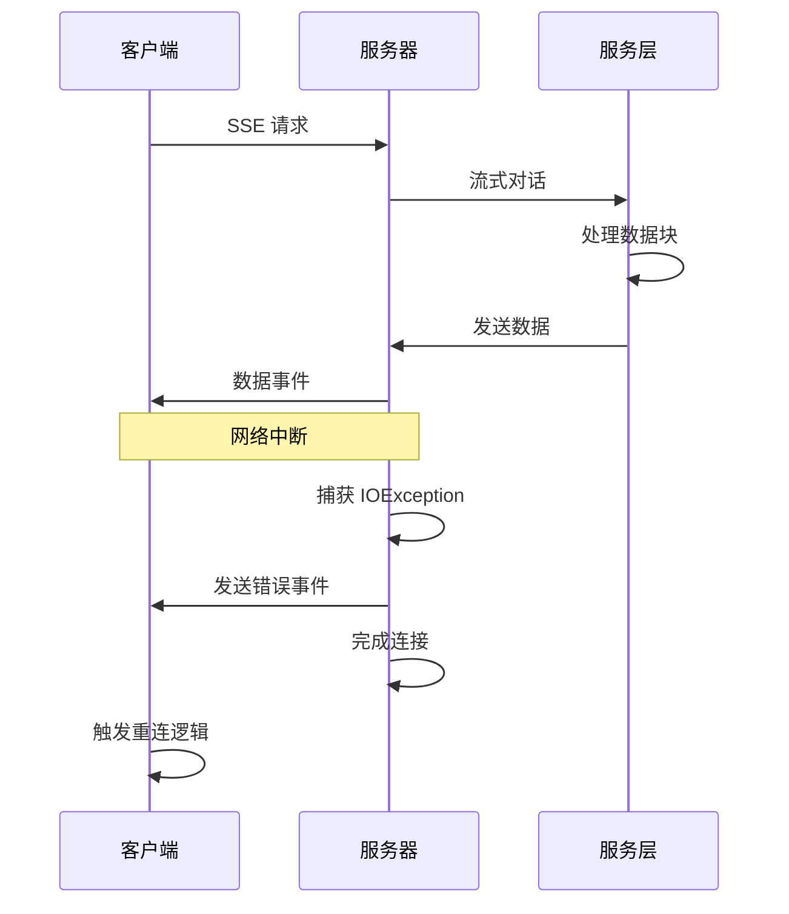

#### API 调用错误处理

- **RAGFlow API 错误**: 记录错误状态码和响应体
- **DeepSeek API 错误**: 通过 Spring AI 框架处理
- **超时处理**: 设置合理的超时时间并触发重连

**章节来源**
- [ChatController.java:94-103](file://src/main/java/org/wiki/controller/ChatController.java#L94-L103)
- [ChatController.java:253-265](file://src/main/java/org/wiki/controller/ChatController.java#L253-L265)

## 客户端实现指南

### 前端实现示例

系统提供了完整的前端实现，展示了如何正确处理 SSE 流式数据：

#### 基础流式处理

```javascript
async function streamChat(url, question) {
    const fullUrl = url + '?question=' + encodeURIComponent(question);
    const response = await fetch(fullUrl);
    const reader = response.body.getReader();
    const decoder = new TextDecoder();

    let fullText = '';
    while (true) {
        const { done, value } = await reader.read();
        if (done) break;

        const chunk = decoder.decode(value, { stream: true });
        const lines = chunk.split('\n');

        for (const line of lines) {
            if (line.startsWith('data:')) {
                const data = line.substring(5).trim();
                if (data === '[DONE]') continue;
                if (data) {
                    fullText += data;
                    // 实时更新 UI
                    updateUI(fullText);
                }
            }
        }
    }
}
```

#### 断线重连实现

```javascript
function setupReconnection() {
    let reconnectAttempts = 0;
    const maxAttempts = 5;
    const baseDelay = 1000;

    function reconnect() {
        if (reconnectAttempts < maxAttempts) {
            const delay = baseDelay * Math.pow(2, reconnectAttempts);
            setTimeout(() => {
                try {
                    startStream();
                    reconnectAttempts = 0;
                } catch (error) {
                    reconnectAttempts++;
                    reconnect();
                }
            }, delay);
        }
    }

    return reconnect;
}
```

### 客户端最佳实践

#### 连接管理

1. **设置合适的超时时间**: 根据网络环境调整超时参数
2. **实现优雅降级**: 当流式接口不可用时回退到轮询方式
3. **资源清理**: 正确关闭 SSE 连接和清理事件监听器

#### 性能优化

1. **防抖处理**: 对频繁的数据块进行防抖处理
2. **增量渲染**: 实现增量的 DOM 更新以提高性能
3. **内存管理**: 及时清理不再使用的数据和事件处理器

**章节来源**
- [index.html:295-325](file://src/main/resources/templates/index.html#L295-L325)

## 性能优化建议

### 服务器端优化

#### 线程池管理

- 使用 `Executors.newCachedThreadPool()` 处理并发流式请求
- 合理设置线程池大小以避免资源耗尽
- 实现连接池复用以减少连接开销

#### 缓存策略

- 对频繁访问的知识库数据进行缓存
- 实现响应式缓存以提高查询效率
- 设置合理的缓存失效时间

### 客户端优化

#### 数据处理优化

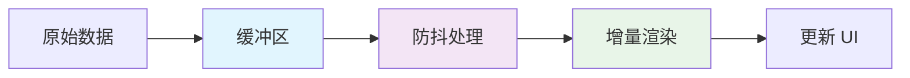

#### 内存管理

- 及时释放不再使用的数据块
- 实现数据块生命周期管理
- 监控内存使用情况并及时清理

## 故障排除指南

### 常见问题诊断

#### 连接问题

| 问题症状 | 可能原因 | 解决方案 |
|---------|---------|---------|
| 连接立即断开 | 超时设置过短 | 增加超时时间 |
| 数据传输缓慢 | 网络延迟高 | 实现重连机制 |
| 无法建立连接 | CORS 配置错误 | 检查跨域设置 |
| 500 错误 | 服务器内部错误 | 查看服务器日志 |

#### 数据处理问题

| 问题症状 | 可能原因 | 解决方案 |
|---------|---------|---------|
| 数据丢失 | SSE 缓冲区溢出 | 实现背压处理 |
| 字符乱码 | 编码格式不匹配 | 统一 UTF-8 编码 |
| 引用信息缺失 | API 响应格式变化 | 更新解析逻辑 |
| 完成标记异常 | 网络中断导致 | 实现重连和恢复 |

### 调试工具使用

#### 服务器端调试

1. **日志监控**: 启用 DEBUG 级别日志查看详细请求信息
2. **性能监控**: 监控线程池使用情况和内存占用
3. **API 调试**: 使用 curl 或 Postman 测试接口

#### 客户端调试

1. **浏览器开发者工具**: 监控 SSE 连接状态
2. **网络面板**: 查看数据传输情况
3. **控制台**: 检查 JavaScript 错误

### 监控指标

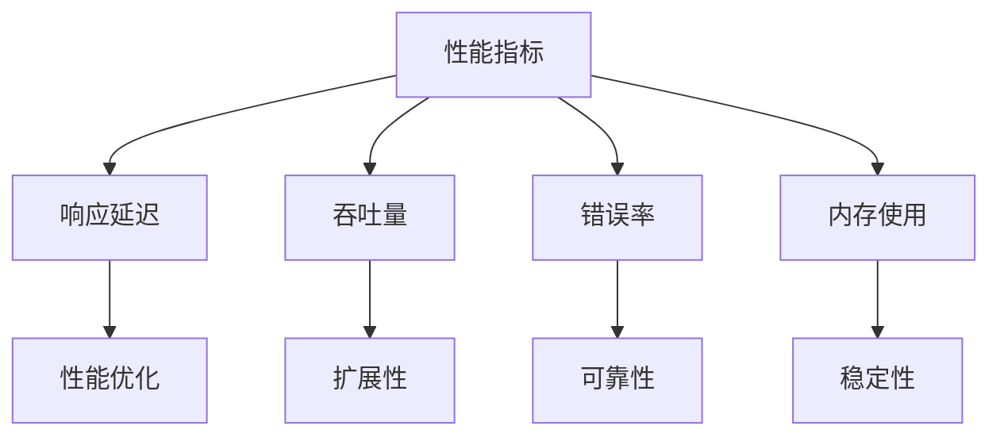

**章节来源**
- [application.yml:24-27](file://src/main/resources/application.yml#L24-L27)

## 结论

本流式对话接口系统提供了完整的 SSE 流式通信解决方案，具有以下特点：

### 技术优势

1. **多模式支持**: 支持 RAGFlow、DeepSeek 和 RAG 增强三种对话模式
2. **实时交互**: 基于 SSE 协议实现实时数据传输
3. **错误处理**: 完善的错误处理和重连机制
4. **性能优化**: 合理的线程池管理和资源复用

### 应用价值

1. **用户体验**: 提供流畅的实时对话体验
2. **技术集成**: 支持多种外部服务集成
3. **扩展性强**: 模块化设计便于功能扩展
4. **开发友好**: 提供完整的客户端实现示例

### 发展方向

1. **性能提升**: 进一步优化流式数据处理性能
2. **功能扩展**: 支持更多对话模式和外部服务
3. **监控完善**: 增强系统监控和告警能力
4. **安全加固**: 加强接口安全和数据保护

该系统为构建高性能的流式对话应用提供了坚实的技术基础，适合在企业级应用场景中部署和使用。