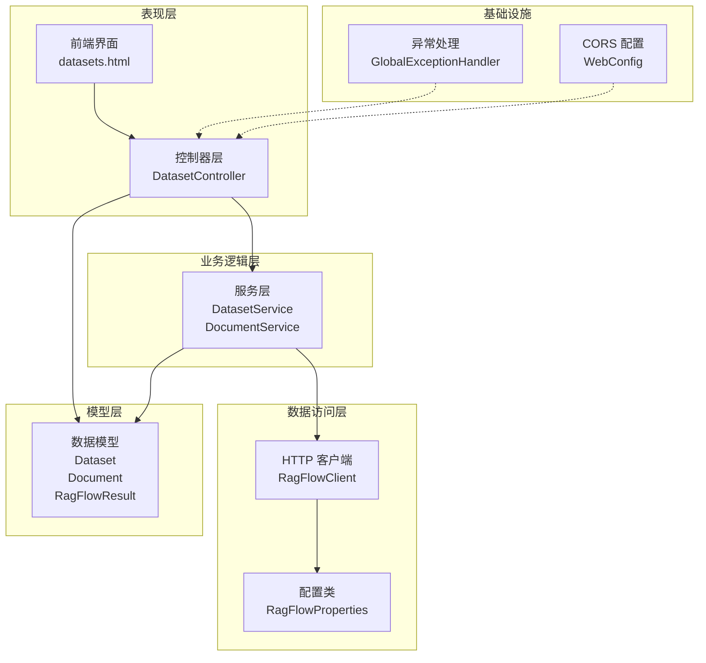
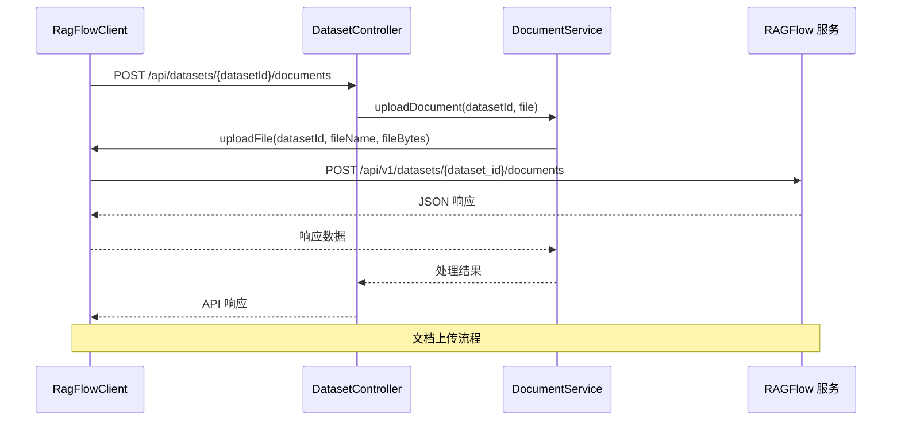
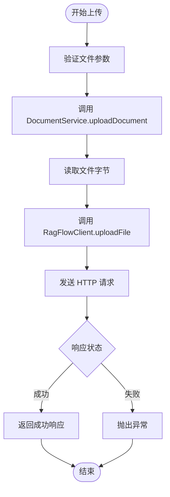
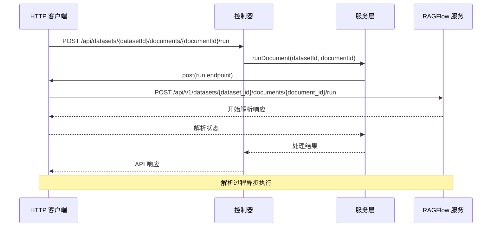
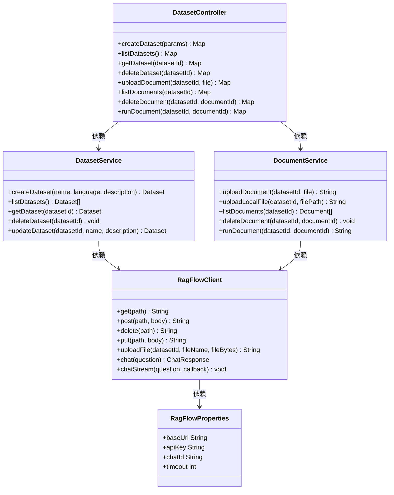

# 知识库管理接口

<cite>
**本文档引用的文件**
- [DatasetController.java](file://src/main/java/org/wiki/controller/DatasetController.java)
- [DatasetService.java](file://src/main/java/org/wiki/service/DatasetService.java)
- [DocumentService.java](file://src/main/java/org/wiki/service/DocumentService.java)
- [RagFlowClient.java](file://src/main/java/org/wiki/client/RagFlowClient.java)
- [RagFlowProperties.java](file://src/main/java/org/wiki/config/RagFlowProperties.java)
- [WebConfig.java](file://src/main/java/org/wiki/config/WebConfig.java)
- [GlobalExceptionHandler.java](file://src/main/java/org/wiki/config/GlobalExceptionHandler.java)
- [Dataset.java](file://src/main/java/org/wiki/model/Dataset.java)
- [Document.java](file://src/main/java/org/wiki/model/Document.java)
- [RagFlowResult.java](file://src/main/java/org/wiki/model/RagFlowResult.java)
- [application.yml](file://src/main/resources/application.yml)
- [datasets.html](file://src/main/resources/templates/datasets.html)
</cite>

## 目录
1. [简介](#简介)
2. [项目结构](#项目结构)
3. [核心组件](#核心组件)
4. [架构概览](#架构概览)
5. [详细组件分析](#详细组件分析)
6. [依赖关系分析](#依赖关系分析)
7. [性能考虑](#性能考虑)
8. [故障排除指南](#故障排除指南)
9. [结论](#结论)
10. [附录](#附录)

## 简介

本项目是一个基于 Spring Boot 的知识库管理系统，集成了 RAGFlow AI 知识库管理和 DeepSeek 大模型服务。系统提供了完整的知识库管理接口，包括文档上传、解析和删除功能，以及知识库的创建、查询和删除操作。

该系统采用分层架构设计，通过 HTTP 客户端封装与 RAGFlow 服务进行通信，实现了 RESTful API 接口，支持前后端分离的开发模式。

## 项目结构

项目采用标准的 Spring Boot 项目结构，主要分为以下层次：



**图表来源**
- [DatasetController.java:1-197](file://src/main/java/org/wiki/controller/DatasetController.java#L1-L197)
- [DatasetService.java:1-128](file://src/main/java/org/wiki/service/DatasetService.java#L1-L128)
- [DocumentService.java:1-98](file://src/main/java/org/wiki/service/DocumentService.java#L1-L98)
- [RagFlowClient.java:1-231](file://src/main/java/org/wiki/client/RagFlowClient.java#L1-L231)

**章节来源**
- [DatasetController.java:1-197](file://src/main/java/org/wiki/controller/DatasetController.java#L1-L197)
- [application.yml:1-27](file://src/main/resources/application.yml#L1-L27)

## 核心组件

### 控制器层

控制器层负责处理 HTTP 请求和响应，提供 RESTful API 接口。主要包含以下组件：

- **DatasetController**: 知识库管理控制器，处理知识库和文档的所有 CRUD 操作
- **异常处理器**: 全局异常处理机制，统一处理各种异常情况

### 服务层

服务层封装了业务逻辑，与底层 HTTP 客户端交互：

- **DatasetService**: 知识库服务，提供知识库的创建、查询、更新和删除功能
- **DocumentService**: 文档服务，处理文档的上传、解析和删除操作

### 数据模型

系统定义了清晰的数据模型来表示知识库和文档信息：

- **Dataset**: 知识库实体，包含基本信息和统计字段
- **Document**: 文档实体，包含文档元数据和处理状态
- **RagFlowResult**: 统一的 API 响应包装类

**章节来源**
- [DatasetController.java:20-35](file://src/main/java/org/wiki/controller/DatasetController.java#L20-L35)
- [DatasetService.java:15-27](file://src/main/java/org/wiki/service/DatasetService.java#L15-L27)
- [DocumentService.java:16-27](file://src/main/java/org/wiki/service/DocumentService.java#L16-L27)
- [Dataset.java:7-32](file://src/main/java/org/wiki/model/Dataset.java#L7-L32)
- [Document.java:7-23](file://src/main/java/org/wiki/model/Document.java#L7-L23)

## 架构概览

系统采用分层架构设计，通过 HTTP 客户端与外部 RAGFlow 服务进行通信：



**图表来源**
- [DatasetController.java:116-135](file://src/main/java/org/wiki/controller/DatasetController.java#L116-L135)
- [DocumentService.java:29-37](file://src/main/java/org/wiki/service/DocumentService.java#L29-L37)
- [RagFlowClient.java:202-229](file://src/main/java/org/wiki/client/RagFlowClient.java#L202-L229)

系统架构特点：
- **分层清晰**: 表现层、业务层、数据访问层职责明确
- **可扩展性**: 支持添加新的知识库和文档类型
- **安全性**: 通过 API Key 进行身份认证
- **容错性**: 完善的异常处理和错误响应机制

## 详细组件分析

### 知识库管理接口

#### 创建知识库
- **HTTP 方法**: POST
- **URL 路径**: `/api/datasets`
- **请求参数**: 
  - name: 知识库名称 (必填)
  - language: 语言 (默认: Chinese)
  - description: 描述信息 (可选)
- **响应格式**: 
  ```json
  {
    "success": true,
    "data": {
      "id": "string",
      "name": "string",
      "language": "string",
      "description": "string",
      "documentCount": "string",
      "createdAt": "string",
      "updatedAt": "string"
    }
  }
  ```

#### 获取知识库列表
- **HTTP 方法**: GET
- **URL 路径**: `/api/datasets`
- **请求参数**: 无
- **响应格式**: 
  ```json
  {
    "success": true,
    "data": [
      {
        "id": "string",
        "name": "string",
        "language": "string",
        "description": "string",
        "documentCount": "string"
      }
    ]
  }
  ```

#### 获取知识库详情
- **HTTP 方法**: GET
- **URL 路径**: `/api/datasets/{datasetId}`
- **路径参数**: datasetId (知识库ID)
- **响应格式**: 同创建知识库响应

#### 删除知识库
- **HTTP 方法**: DELETE
- **URL 路径**: `/api/datasets/{datasetId}`
- **路径参数**: datasetId (知识库ID)
- **响应格式**: 
  ```json
  {
    "success": true
  }
  ```

**章节来源**
- [DatasetController.java:37-114](file://src/main/java/org/wiki/controller/DatasetController.java#L37-L114)
- [DatasetService.java:29-103](file://src/main/java/org/wiki/service/DatasetService.java#L29-L103)

### 文档管理接口

#### 上传文档
- **HTTP 方法**: POST
- **URL 路径**: `/api/datasets/{datasetId}/documents`
- **路径参数**: datasetId (知识库ID)
- **请求参数**: 
  - file: 上传的文件 (multipart/form-data)
- **文件格式支持**: .txt, .pdf, .docx, .doc, .md, .csv
- **响应格式**: 
  ```json
  {
    "success": true,
    "data": "上传响应内容"
  }
  ```

#### 获取文档列表
- **HTTP 方法**: GET
- **URL 路径**: `/api/datasets/{datasetId}/documents`
- **路径参数**: datasetId (知识库ID)
- **响应格式**: 
  ```json
  {
    "success": true,
    "data": [
      {
        "id": "string",
        "name": "string",
        "datasetId": "string",
        "chunkMethod": "string",
        "run": "string",
        "progress": "string",
        "createdAt": "string",
        "updatedAt": "string"
      }
    ]
  }
  ```

#### 删除文档
- **HTTP 方法**: DELETE
- **URL 路径**: `/api/datasets/{datasetId}/documents/{documentId}`
- **路径参数**: 
  - datasetId (知识库ID)
  - documentId (文档ID)
- **响应格式**: 同知识库删除响应

#### 解析/运行文档
- **HTTP 方法**: POST
- **URL 路径**: `/api/datasets/{datasetId}/documents/{documentId}/run`
- **路径参数**: 
  - datasetId (知识库ID)
  - documentId (文档ID)
- **响应格式**: 
  ```json
  {
    "success": true,
    "data": "解析响应内容"
  }
  ```

**章节来源**
- [DatasetController.java:116-195](file://src/main/java/org/wiki/controller/DatasetController.java#L116-L195)
- [DocumentService.java:29-96](file://src/main/java/org/wiki/service/DocumentService.java#L29-L96)

### API 工作流程

#### 文档上传流程


**图表来源**
- [DocumentService.java:33-37](file://src/main/java/org/wiki/service/DocumentService.java#L33-L37)
- [RagFlowClient.java:206-229](file://src/main/java/org/wiki/client/RagFlowClient.java#L206-L229)

#### 文档解析流程


**图表来源**
- [DatasetController.java:176-195](file://src/main/java/org/wiki/controller/DatasetController.java#L176-L195)
- [DocumentService.java:91-96](file://src/main/java/org/wiki/service/DocumentService.java#L91-L96)

## 依赖关系分析

系统采用松耦合的设计，各组件之间的依赖关系如下：



**图表来源**
- [DatasetController.java:28-35](file://src/main/java/org/wiki/controller/DatasetController.java#L28-L35)
- [DatasetService.java:23-27](file://src/main/java/org/wiki/service/DatasetService.java#L23-L27)
- [DocumentService.java:23-27](file://src/main/java/org/wiki/service/DocumentService.java#L23-L27)
- [RagFlowClient.java:25-35](file://src/main/java/org/wiki/client/RagFlowClient.java#L25-L35)
- [RagFlowProperties.java:10-31](file://src/main/java/org/wiki/config/RagFlowProperties.java#L10-L31)

**章节来源**
- [DatasetController.java:28-35](file://src/main/java/org/wiki/controller/DatasetController.java#L28-L35)
- [DatasetService.java:23-27](file://src/main/java/org/wiki/service/DatasetService.java#L23-L27)
- [DocumentService.java:23-27](file://src/main/java/org/wiki/service/DocumentService.java#L23-L27)

## 性能考虑

### 并发处理
系统使用线程池处理并发请求，提高响应性能：

- **线程池配置**: 缓存线程池，根据需要动态调整线程数量
- **适用场景**: 处理多个同时上传或解析请求

### 超时设置
- **连接超时**: 30 秒
- **读取超时**: 可配置，默认 120 秒
- **写入超时**: 30 秒

### 内存管理
- **文件处理**: 使用字节数组处理文件内容
- **内存限制**: 受 JVM 堆内存限制影响
- **建议**: 大文件上传时注意内存使用

## 故障排除指南

### 常见错误及解决方案

#### 认证失败
- **症状**: HTTP 401 未授权
- **原因**: API Key 配置错误
- **解决**: 检查 `application.yml` 中的 `ragflow.api-key` 配置

#### 服务不可达
- **症状**: HTTP 503 服务不可用
- **原因**: RAGFlow 服务地址配置错误
- **解决**: 检查 `ragflow.base-url` 配置

#### 文件上传失败
- **症状**: 上传过程中断
- **原因**: 文件过大或网络问题
- **解决**: 检查文件大小限制和网络连接

#### 解析失败
- **症状**: 文档解析状态异常
- **原因**: 文件格式不支持或内容损坏
- **解决**: 验证文件格式和内容完整性

**章节来源**
- [GlobalExceptionHandler.java:20-44](file://src/main/java/org/wiki/config/GlobalExceptionHandler.java#L20-L44)
- [RagFlowClient.java:52-56](file://src/main/java/org/wiki/client/RagFlowClient.java#L52-L56)

### 错误处理策略

系统采用统一的异常处理机制：

1. **业务异常**: 包装为 API 响应，返回错误信息
2. **IO 异常**: 转换为服务不可用状态
3. **参数异常**: 返回 400 Bad Request
4. **认证异常**: 返回 401 Unauthorized

## 结论

本知识库管理接口提供了完整的文档生命周期管理功能，包括上传、解析和删除操作。系统采用分层架构设计，具有良好的可扩展性和维护性。

主要优势：
- **RESTful 设计**: 符合 RESTful API 规范
- **安全机制**: 通过 API Key 进行身份认证
- **错误处理**: 完善的异常处理和错误响应
- **前端集成**: 提供完整的前端界面示例
- **配置灵活**: 支持多种配置选项

建议的最佳实践：
- 合理设置文件大小限制
- 实施适当的缓存策略
- 监控 API 使用情况
- 定期清理过期文档

## 附录

### 配置说明

#### 应用配置
```yaml
server:
  port: 8081

spring:
  application:
    name: deepseek-ragflow-demo
  ai:
    openai:
      api-key: sk-xxxxxxxxxxxxxxxxxxxxxxxx  # DeepSeek API Key
      base-url: https://api.deepseek.com    # DeepSeek API 地址
      chat:
        options:
          model: deepseek-chat
          temperature: 0.7
          max-tokens: 4096

# RAGFlow 配置
ragflow:
  base-url: http://localhost:80            # RAGFlow 服务地址
  api-key: ragflow-xxxxxxxxxxxxxxxx        # RAGFlow API Key
  chat-id: xxxxxxxxxxxxxxxxxxxxxxxx        # 聊天助手 ID
  timeout: 120                             # 请求超时时间（秒）
```

#### CORS 配置
系统支持跨域请求，允许所有域名访问 `/api/**` 路径。

**章节来源**
- [application.yml:1-27](file://src/main/resources/application.yml#L1-L27)
- [WebConfig.java:13-21](file://src/main/java/org/wiki/config/WebConfig.java#L13-L21)

### 前端集成示例

系统提供了完整的前端界面，展示了如何集成知识库管理功能：

- **知识库管理页面**: 展示知识库列表和操作按钮
- **文档上传界面**: 支持多种文件格式上传
- **实时状态更新**: 自动刷新文档解析状态
- **用户反馈**: 通过通知消息提供操作反馈

**章节来源**
- [datasets.html:146-332](file://src/main/resources/templates/datasets.html#L146-L332)