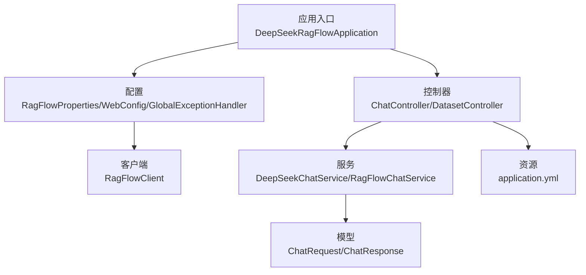
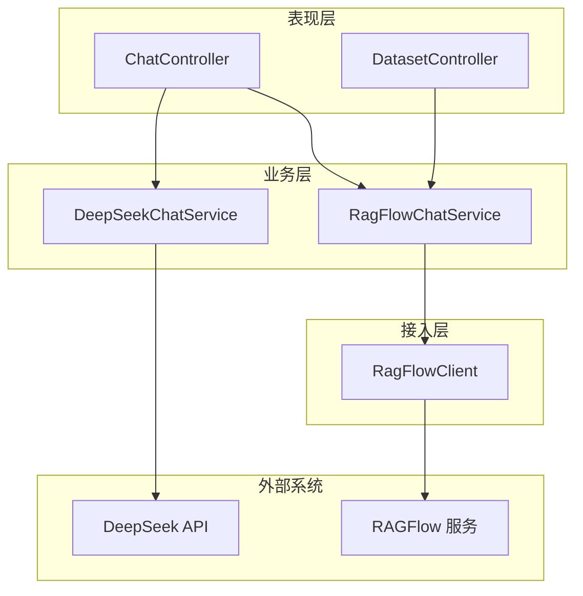
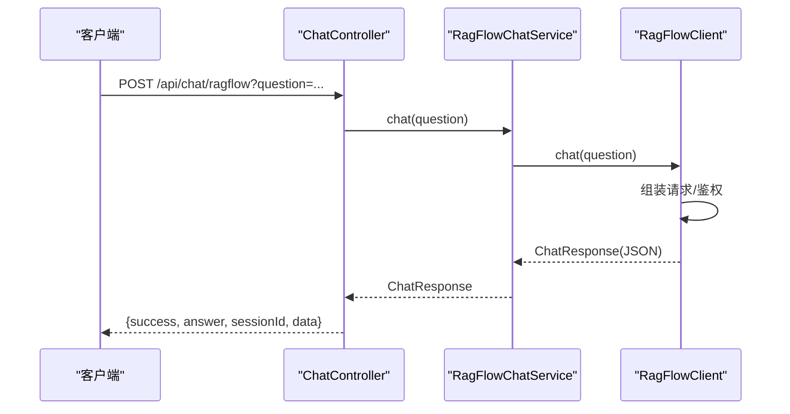
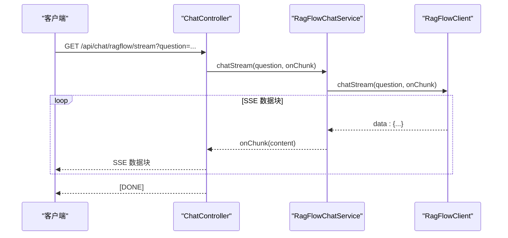
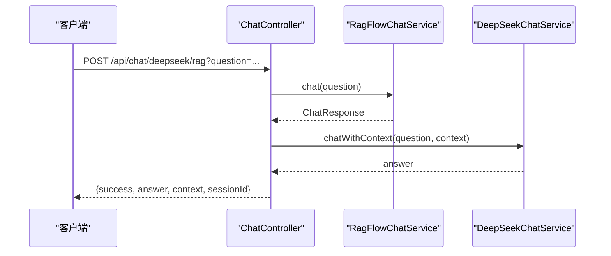
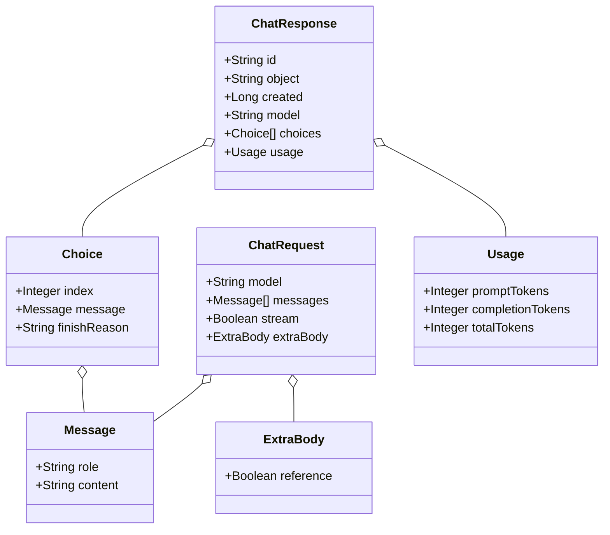

# 快速开始

<cite>
**本文引用的文件**
- [pom.xml](file://pom.xml)
- [Dockerfile](file://Dockerfile)
- [docker-compose.yml](file://docker-compose.yml)
- [application.yml](file://src/main/resources/application.yml)
- [DeepSeekRagFlowApplication.java](file://src/main/java/org/wiki/DeepSeekRagFlowApplication.java)
- [RagFlowProperties.java](file://src/main/java/org/wiki/config/RagFlowProperties.java)
- [WebConfig.java](file://src/main/java/org/wiki/config/WebConfig.java)
- [GlobalExceptionHandler.java](file://src/main/java/org/wiki/config/GlobalExceptionHandler.java)
- [RagFlowClient.java](file://src/main/java/org/wiki/client/RagFlowClient.java)
- [DeepSeekChatService.java](file://src/main/java/org/wiki/service/DeepSeekChatService.java)
- [RagFlowChatService.java](file://src/main/java/org/wiki/service/RagFlowChatService.java)
- [ChatController.java](file://src/main/java/org/wiki/controller/ChatController.java)
- [DatasetController.java](file://src/main/java/org/wiki/controller/DatasetController.java)
- [ChatRequest.java](file://src/main/java/org/wiki/model/ChatRequest.java)
- [ChatResponse.java](file://src/main/java/org/wiki/model/ChatResponse.java)
</cite>

## 目录
1. [简介](#简介)
2. [项目结构](#项目结构)
3. [核心组件](#核心组件)
4. [架构总览](#架构总览)
5. [详细组件分析](#详细组件分析)
6. [依赖分析](#依赖分析)
7. [性能考虑](#性能考虑)
8. [故障排查指南](#故障排查指南)
9. [结论](#结论)
10. [附录](#附录)

## 简介
本指南面向希望快速搭建并运行“DeepSeek + RAGFlow”知识库问答系统的开发者。项目基于 Spring Boot 3.2.0 与 Spring AI OpenAI 兼容层，结合 OkHttp 客户端与 RAGFlow HTTP API，提供三类对话模式：
- RAGFlow 知识库问答（非流式与流式）
- DeepSeek 直接对话（非流式与流式）
- DeepSeek + RAG 增强对话（检索增强生成）

同时提供本地开发、单容器 Docker 与 docker-compose 多服务编排三种部署方式，并给出环境变量、配置示例与基本使用步骤，帮助新手快速上手。

## 项目结构
项目采用标准 Spring Boot 结构，主要模块如下：
- 应用入口：Spring Boot 启动类
- 配置：RAGFlow 参数绑定、CORS、全局异常处理
- 客户端：RAGFlow HTTP 客户端封装
- 服务：DeepSeek 对话服务、RAGFlow 对话服务、数据集/文档服务
- 控制器：对话 API、数据集管理 API
- 模型：对话请求/响应数据模型
- 资源：应用配置文件、模板与静态资源

图表来源
- [DeepSeekRagFlowApplication.java:1-12](file://src/main/java/org/wiki/DeepSeekRagFlowApplication.java#L1-L12)
- [RagFlowProperties.java:1-32](file://src/main/java/org/wiki/config/RagFlowProperties.java#L1-L32)
- [WebConfig.java:1-23](file://src/main/java/org/wiki/config/WebConfig.java#L1-L23)
- [GlobalExceptionHandler.java:1-46](file://src/main/java/org/wiki/config/GlobalExceptionHandler.java#L1-L46)
- [RagFlowClient.java:1-231](file://src/main/java/org/wiki/client/RagFlowClient.java#L1-L231)
- [DeepSeekChatService.java:1-125](file://src/main/java/org/wiki/service/DeepSeekChatService.java#L1-L125)
- [RagFlowChatService.java:1-84](file://src/main/java/org/wiki/service/RagFlowChatService.java#L1-L84)
- [ChatController.java:1-276](file://src/main/java/org/wiki/controller/ChatController.java#L1-L276)
- [DatasetController.java:1-197](file://src/main/java/org/wiki/controller/DatasetController.java#L1-L197)
- [ChatRequest.java:1-59](file://src/main/java/org/wiki/model/ChatRequest.java#L1-L59)
- [ChatResponse.java:1-52](file://src/main/java/org/wiki/model/ChatResponse.java#L1-L52)
- [application.yml:1-27](file://src/main/resources/application.yml#L1-L27)

章节来源
- [pom.xml:1-102](file://pom.xml#L1-L102)
- [application.yml:1-27](file://src/main/resources/application.yml#L1-L27)

## 核心组件
- 应用入口与启动
  - 启动类负责加载 Spring Boot 应用上下文，暴露 HTTP 服务。
  - 章节来源: [DeepSeekRagFlowApplication.java:1-12](file://src/main/java/org/wiki/DeepSeekRagFlowApplication.java#L1-L12)

- RAGFlow 配置
  - 通过属性前缀 ragflow 绑定基础地址、API Key、聊天助手 ID、超时等。
  - 章节来源: [RagFlowProperties.java:1-32](file://src/main/java/org/wiki/config/RagFlowProperties.java#L1-L32), [application.yml:17-22](file://src/main/resources/application.yml#L17-L22)

- CORS 与全局异常处理
  - 开放 /api/** 跨域；统一捕获异常并返回结构化错误信息。
  - 章节来源: [WebConfig.java:1-23](file://src/main/java/org/wiki/config/WebConfig.java#L1-L23), [GlobalExceptionHandler.java:1-46](file://src/main/java/org/wiki/config/GlobalExceptionHandler.java#L1-L46)

- RAGFlow HTTP 客户端
  - 封装 GET/POST/PUT/DELETE 与文件上传；支持非流式与 SSE 流式对话。
  - 章节来源: [RagFlowClient.java:1-231](file://src/main/java/org/wiki/client/RagFlowClient.java#L1-L231)

- 对话服务
  - DeepSeekChatService：基于 Spring AI ChatClient 的本地对话、RAG 增强与流式输出。
  - RagFlowChatService：调用 RAGFlow OpenAI 兼容接口进行问答与流式输出。
  - 章节来源: [DeepSeekChatService.java:1-125](file://src/main/java/org/wiki/service/DeepSeekChatService.java#L1-L125), [RagFlowChatService.java:1-84](file://src/main/java/org/wiki/service/RagFlowChatService.java#L1-L84)

- 控制器 API
  - ChatController：提供 RAGFlow/DeepSeek/DeepSeek+RAG 三种对话模式（含流式 SSE）与会话历史管理。
  - DatasetController：提供知识库与文档的增删改查、上传与解析执行。
  - 章节来源: [ChatController.java:1-276](file://src/main/java/org/wiki/controller/ChatController.java#L1-L276), [DatasetController.java:1-197](file://src/main/java/org/wiki/controller/DatasetController.java#L1-L197)

- 数据模型
  - ChatRequest/ChatResponse：RAGFlow 对话请求与响应的数据结构。
  - 章节来源: [ChatRequest.java:1-59](file://src/main/java/org/wiki/model/ChatRequest.java#L1-L59), [ChatResponse.java:1-52](file://src/main/java/org/wiki/model/ChatResponse.java#L1-L52)

## 架构总览
系统由三层组成：
- 表现层：Spring MVC 控制器对外提供 REST API 与 SSE。
- 业务层：服务层协调对话与知识库操作。
- 接入层：RAGFlow HTTP 客户端封装第三方 API 调用。

图表来源
- [ChatController.java:1-276](file://src/main/java/org/wiki/controller/ChatController.java#L1-L276)
- [DatasetController.java:1-197](file://src/main/java/org/wiki/controller/DatasetController.java#L1-L197)
- [DeepSeekChatService.java:1-125](file://src/main/java/org/wiki/service/DeepSeekChatService.java#L1-L125)
- [RagFlowChatService.java:1-84](file://src/main/java/org/wiki/service/RagFlowChatService.java#L1-L84)
- [RagFlowClient.java:1-231](file://src/main/java/org/wiki/client/RagFlowClient.java#L1-L231)

## 详细组件分析

### 对话流程（RAGFlow 非流式）

图表来源
- [ChatController.java:51-76](file://src/main/java/org/wiki/controller/ChatController.java#L51-L76)
- [RagFlowChatService.java:34-41](file://src/main/java/org/wiki/service/RagFlowChatService.java#L34-L41)
- [RagFlowClient.java:135-148](file://src/main/java/org/wiki/client/RagFlowClient.java#L135-L148)

章节来源
- [ChatController.java:51-76](file://src/main/java/org/wiki/controller/ChatController.java#L51-L76)
- [RagFlowChatService.java:34-41](file://src/main/java/org/wiki/service/RagFlowChatService.java#L34-L41)
- [RagFlowClient.java:135-148](file://src/main/java/org/wiki/client/RagFlowClient.java#L135-L148)

### 对话流程（RAGFlow 流式）

图表来源
- [ChatController.java:85-107](file://src/main/java/org/wiki/controller/ChatController.java#L85-L107)
- [RagFlowChatService.java:50-72](file://src/main/java/org/wiki/service/RagFlowChatService.java#L50-L72)
- [RagFlowClient.java:154-200](file://src/main/java/org/wiki/client/RagFlowClient.java#L154-L200)

章节来源
- [ChatController.java:85-107](file://src/main/java/org/wiki/controller/ChatController.java#L85-L107)
- [RagFlowChatService.java:50-72](file://src/main/java/org/wiki/service/RagFlowChatService.java#L50-L72)
- [RagFlowClient.java:154-200](file://src/main/java/org/wiki/client/RagFlowClient.java#L154-L200)

### 对话流程（DeepSeek + RAG 增强）

图表来源
- [ChatController.java:148-174](file://src/main/java/org/wiki/controller/ChatController.java#L148-L174)
- [RagFlowChatService.java:34-41](file://src/main/java/org/wiki/service/RagFlowChatService.java#L34-L41)
- [DeepSeekChatService.java:54-78](file://src/main/java/org/wiki/service/DeepSeekChatService.java#L54-L78)

章节来源
- [ChatController.java:148-174](file://src/main/java/org/wiki/controller/ChatController.java#L148-L174)
- [RagFlowChatService.java:34-41](file://src/main/java/org/wiki/service/RagFlowChatService.java#L34-L41)
- [DeepSeekChatService.java:54-78](file://src/main/java/org/wiki/service/DeepSeekChatService.java#L54-L78)

### 数据模型（对话请求/响应）

图表来源
- [ChatRequest.java:1-59](file://src/main/java/org/wiki/model/ChatRequest.java#L1-L59)
- [ChatResponse.java:1-52](file://src/main/java/org/wiki/model/ChatResponse.java#L1-L52)

章节来源
- [ChatRequest.java:1-59](file://src/main/java/org/wiki/model/ChatRequest.java#L1-L59)
- [ChatResponse.java:1-52](file://src/main/java/org/wiki/model/ChatResponse.java#L1-L52)

## 依赖分析
- 构建工具与语言版本
  - Maven 3.6+，Java 17+，Spring Boot 3.2.0。
  - 章节来源: [pom.xml:15-23](file://pom.xml#L15-L23)

- 关键依赖
  - Spring Web、Spring AI OpenAI Starter（兼容 DeepSeek）、Tika 文档读取、OkHttp/OkHttp SSE、FastJSON2、Lombok、Thymeleaf、JUnit。
  - 章节来源: [pom.xml:25-89](file://pom.xml#L25-L89)

- 仓库与里程碑
  - Spring Milestones 仓库用于获取 Spring AI 预发布版本。
  - 章节来源: [pom.xml:91-100](file://pom.xml#L91-L100)

- 运行与打包
  - Dockerfile 使用多阶段构建：Alpine JDK 编译，Alpine JRE 运行；默认暴露 8081 端口；可通过 JAVA_OPTS 调整内存。
  - docker-compose.yml 提供一键编排，映射 8081:8081，注入 DEEPSEEK_API_KEY、RAGFLOW_BASE_URL、RAGFLOW_API_KEY、RAGFLOW_CHAT_ID 等环境变量。
  - 章节来源: [Dockerfile:1-15](file://Dockerfile#L1-L15), [docker-compose.yml:1-20](file://docker-compose.yml#L1-L20)

- 配置文件
  - application.yml 设置服务端口、DeepSeek API Key/BaseURL、RAGFlow 基础地址/API Key/Chat ID/超时、日志级别。
  - 章节来源: [application.yml:1-27](file://src/main/resources/application.yml#L1-L27)

## 性能考虑
- 超时与连接
  - RAGFlow 客户端读超时由 ragflow.timeout 控制；OkHttp 连接/写超时固定为 30 秒。
  - 章节来源: [RagFlowClient.java:30-34](file://src/main/java/org/wiki/client/RagFlowClient.java#L30-L34), [RagFlowProperties.java:27-30](file://src/main/java/org/wiki/config/RagFlowProperties.java#L27-L30)

- 流式输出
  - SSE 流式对话在控制器中使用线程池异步推送，注意并发与内存占用。
  - 章节来源: [ChatController.java:89-104](file://src/main/java/org/wiki/controller/ChatController.java#L89-L104), [ChatController.java:242-271](file://src/main/java/org/wiki/controller/ChatController.java#L242-L271)

- 内存与容器
  - Dockerfile 默认 JAVA_OPTS=-Xms256m -Xmx512m，可根据负载调整。
  - 章节来源: [Dockerfile:11-11](file://Dockerfile#L11-L11)

## 故障排查指南
- 常见错误与处理
  - 未授权：当异常消息包含“Unauthorized”，返回 401；检查 DEEPSEEK_API_KEY 或 RAGFLOW_API_KEY。
  - 参数错误：IllegalArgumentException 映射为 400。
  - IO 异常（通常为 RAGFlow API 调用失败）：返回 503，提示“RAGFlow 服务调用失败”。
  - 章节来源: [GlobalExceptionHandler.java:20-44](file://src/main/java/org/wiki/config/GlobalExceptionHandler.java#L20-L44)

- RAGFlow 调用失败
  - 检查 RAGFLOW_BASE_URL、RAGFLOW_API_KEY、RAGFLOW_CHAT_ID 是否正确；确认 RAGFlow 服务可达且聊天助手已创建。
  - 章节来源: [RagFlowClient.java:40-57](file://src/main/java/org/wiki/client/RagFlowClient.java#L40-L57), [RagFlowProperties.java:12-25](file://src/main/java/org/wiki/config/RagFlowProperties.java#L12-L25)

- 跨域问题
  - /api/** 已开放跨域；若前端跨域仍失败，检查浏览器控制台与实际请求头。
  - 章节来源: [WebConfig.java:14-21](file://src/main/java/org/wiki/config/WebConfig.java#L14-L21)

- 日志定位
  - application.yml 已开启 DEBUG 级别日志，便于跟踪请求/响应与异常堆栈。
  - 章节来源: [application.yml:24-27](file://src/main/resources/application.yml#L24-L27)

## 结论
通过本指南，您可以在本地或容器环境中快速部署 DeepSeek + RAGFlow 系统，体验三种对话模式与知识库管理能力。建议优先使用 docker-compose 快速验证，随后按需调整配置与扩展。

## 附录

### 环境准备与安装
- 安装 Java 17+
  - 下载并安装 OpenJDK 17+，确保 JAVA_HOME 与 PATH 正确。
- 安装 Maven
  - 下载 Maven 3.6+，配置本地仓库与镜像源（可选）。
- 安装 Docker 与 docker-compose
  - 官方安装包或包管理器安装，验证 docker --version 与 docker compose version。

### 本地开发环境
- 获取项目
  - 克隆仓库至本地，进入工程根目录。
- 配置应用
  - 在 application.yml 中填写：
    - spring.ai.openai.api-key：DeepSeek API Key
    - spring.ai.openai.base-url：DeepSeek Base URL（兼容 OpenAI 接口）
    - ragflow.base-url：RAGFlow 服务地址（例如 http://localhost:80）
    - ragflow.api-key：RAGFlow API Key
    - ragflow.chat-id：RAGFlow 中创建的聊天助手 ID
    - ragflow.timeout：请求超时秒数
- 启动应用
  - 使用 Maven 打包：mvn clean package
  - 运行：java -jar target/*.jar
  - 访问：http://localhost:8081

章节来源
- [application.yml:1-27](file://src/main/resources/application.yml#L1-L27)
- [pom.xml:15-23](file://pom.xml#L15-L23)

### Docker 单容器部署
- 构建镜像
  - 在工程根目录执行：docker build -t deepseek-ragflow-demo .
- 运行容器
  - 挂载配置或通过环境变量注入：
    - -e SPRING_AI_OPENAI_API_KEY=your_deepseek_key
    - -e SPRING_AI_OPENAI_BASE_URL=https://api.deepseek.com
    - -e RAGFLOW_BASE_URL=http://host.docker.internal:80
    - -e RAGFLOW_API_KEY=your_ragflow_key
    - -e RAGFLOW_CHAT_ID=your_chat_id
  - 端口映射：-p 8081:8081
- 访问：http://localhost:8081

章节来源
- [Dockerfile:1-15](file://Dockerfile#L1-L15)
- [docker-compose.yml:4-17](file://docker-compose.yml#L4-L17)

### docker-compose 多服务编排
- 使用仓库提供的 docker-compose.yml
  - 确保宿主机网络可达 RAGFlow 服务（host.docker.internal 通过 extra_hosts 映射 host-gateway）
  - 设置环境变量：DEEPSEEK_API_KEY、RAGFLOW_BASE_URL、RAGFLOW_API_KEY、RAGFLOW_CHAT_ID
- 启动
  - docker compose up -d
- 访问：http://localhost:8081

章节来源
- [docker-compose.yml:1-20](file://docker-compose.yml#L1-L20)

### 基本使用示例
- 启动应用
  - 本地：java -jar target/*.jar
  - Docker：docker run -p 8081:8081 deepseek-ragflow-demo
- 访问 Web 界面
  - 默认端口 8081，浏览器打开 http://localhost:8081
- 测试 API 接口
  - RAGFlow 非流式对话：POST /api/chat/ragflow?question=你的问题
  - RAGFlow 流式对话：GET /api/chat/ragflow/stream?question=你的问题（SSE）
  - DeepSeek 非流式对话：POST /api/chat/deepseek?question=你的问题
  - DeepSeek 流式对话：GET /api/chat/deepseek/stream?question=你的问题（SSE）
  - DeepSeek + RAG 增强：POST /api/chat/deepseek/rag?question=你的问题
  - 会话历史：POST /api/chat/session、GET /api/chat/history/{sessionId}、DELETE /api/chat/history/{sessionId}
  - 知识库管理：POST/GET/DELETE /api/datasets、POST/GET/DELETE /api/datasets/{datasetId}/documents、POST /api/datasets/{datasetId}/documents/{documentId}/run

章节来源
- [ChatController.java:51-274](file://src/main/java/org/wiki/controller/ChatController.java#L51-L274)
- [DatasetController.java:41-195](file://src/main/java/org/wiki/controller/DatasetController.java#L41-L195)