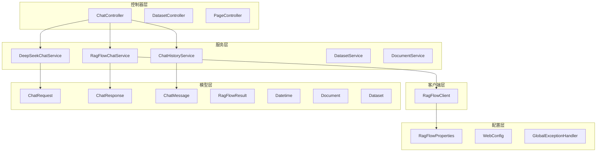
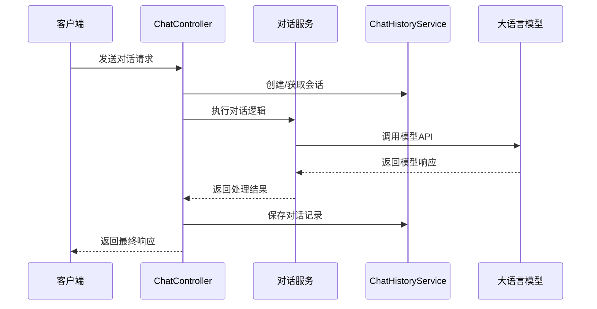
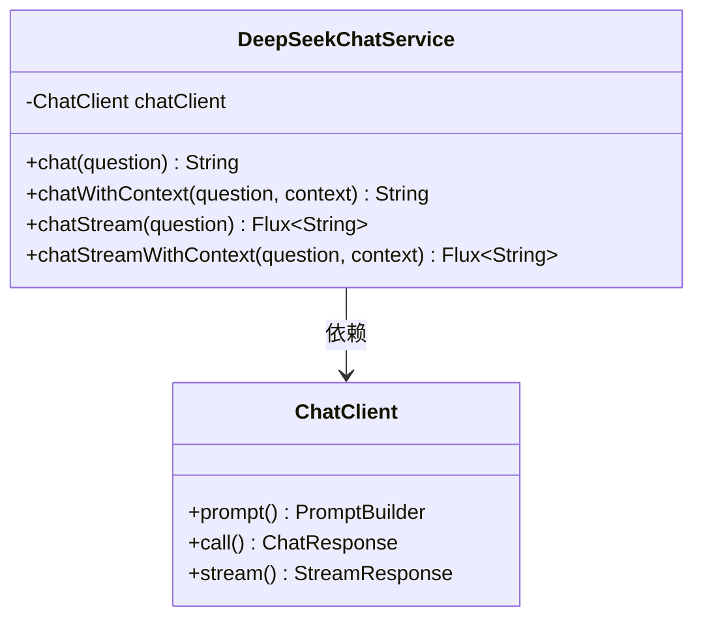
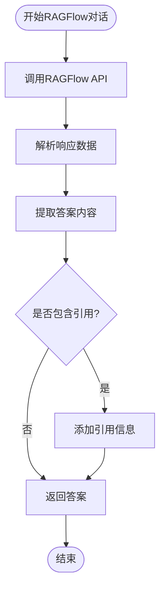
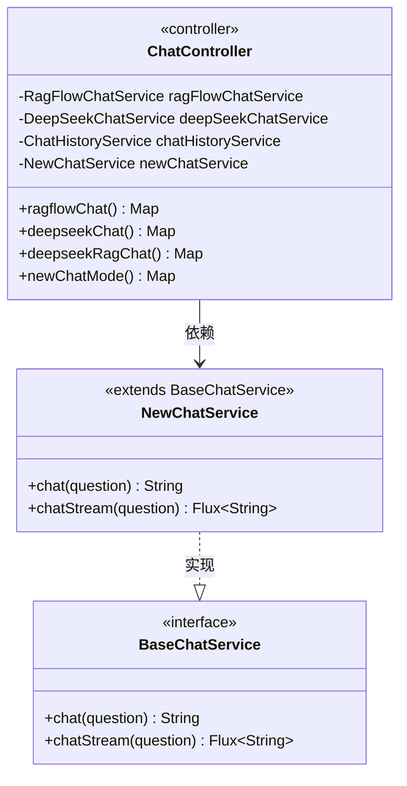
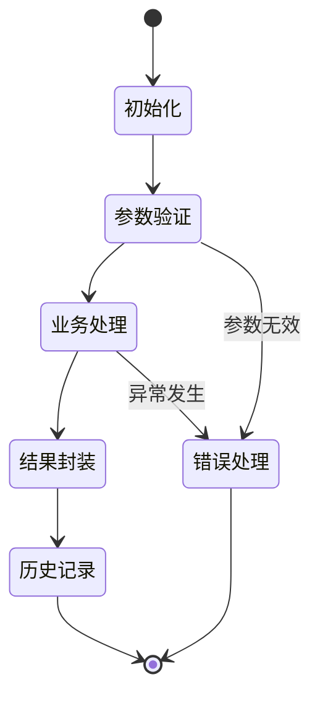
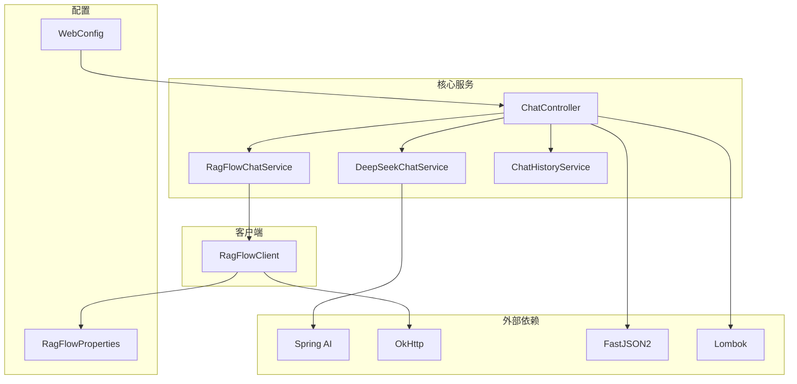

# 对话模式扩展

<cite>
**本文档中引用的文件**
- [ChatController.java](file://src/main/java/org/wiki/controller/ChatController.java)
- [DeepSeekChatService.java](file://src/main/java/org/wiki/service/DeepSeekChatService.java)
- [RagFlowChatService.java](file://src/main/java/org/wiki/service/RagFlowChatService.java)
- [RagFlowClient.java](file://src/main/java/org/wiki/client/RagFlowClient.java)
- [ChatHistoryService.java](file://src/main/java/org/wiki/service/ChatHistoryService.java)
- [ChatRequest.java](file://src/main/java/org/wiki/model/ChatRequest.java)
- [ChatResponse.java](file://src/main/java/org/wiki/model/ChatResponse.java)
- [ChatMessage.java](file://src/main/java/org/wiki/model/ChatMessage.java)
- [RagFlowProperties.java](file://src/main/java/org/wiki/config/RagFlowProperties.java)
- [WebConfig.java](file://src/main/java/org/wiki/config/WebConfig.java)
- [application.yml](file://src/main/resources/application.yml)
- [pom.xml](file://pom.xml)
</cite>

## 目录
1. [简介](#简介)
2. [项目结构](#项目结构)
3. [核心组件](#核心组件)
4. [架构概览](#架构概览)
5. [详细组件分析](#详细组件分析)
6. [对话模式扩展机制](#对话模式扩展机制)
7. [对话模式生命周期](#对话模式生命周期)
8. [新增自定义对话模式指南](#新增自定义对话模式指南)
9. [依赖关系分析](#依赖关系分析)
10. [性能考虑](#性能考虑)
11. [故障排除指南](#故障排除指南)
12. [结论](#结论)

## 简介

本项目是一个基于Spring Boot和Spring AI框架构建的对话系统，集成了DeepSeek大语言模型和RAGFlow知识库检索系统。系统提供了三种对话模式：纯RAGFlow知识库问答、DeepSeek直接对话，以及DeepSeek+RAG增强对话模式。本文档详细说明了如何扩展新的对话模式，包括服务类的创建、业务逻辑实现、Spring容器注册以及完整的生命周期管理。

## 项目结构

该项目采用标准的Spring Boot分层架构，主要包含以下模块：



**图表来源**
- [ChatController.java:1-276](file://src/main/java/org/wiki/controller/ChatController.java#L1-276)
- [DeepSeekChatService.java:1-125](file://src/main/java/org/wiki/service/DeepSeekChatService.java#L1-125)
- [RagFlowChatService.java:1-84](file://src/main/java/org/wiki/service/RagFlowChatService.java#L1-84)

**章节来源**
- [ChatController.java:1-276](file://src/main/java/org/wiki/controller/ChatController.java#L1-276)
- [DeepSeekChatService.java:1-125](file://src/main/java/org/wiki/service/DeepSeekChatService.java#L1-125)
- [RagFlowChatService.java:1-84](file://src/main/java/org/wiki/service/RagFlowChatService.java#L1-84)

## 核心组件

### 控制器组件

系统的核心控制器是`ChatController`，它负责处理所有对话相关的HTTP请求，并协调各个服务组件的工作。

### 服务组件

1. **DeepSeekChatService**: 基于Spring AI框架的DeepSeek大语言模型服务
2. **RagFlowChatService**: RAGFlow知识库问答服务
3. **ChatHistoryService**: 对话历史管理服务

### 客户端组件

**RagFlowClient**: 直接封装RAGFlow RESTful API调用，支持同步和流式两种模式。

**章节来源**
- [ChatController.java:20-41](file://src/main/java/org/wiki/controller/ChatController.java#L20-41)
- [DeepSeekChatService.java:15-28](file://src/main/java/org/wiki/service/DeepSeekChatService.java#L15-28)
- [RagFlowChatService.java:12-24](file://src/main/java/org/wiki/service/RagFlowChatService.java#L12-24)
- [RagFlowClient.java:17-35](file://src/main/java/org/wiki/client/RagFlowClient.java#L17-35)

## 架构概览

系统采用分层架构设计，实现了清晰的关注点分离：



**图表来源**
- [ChatController.java:50-76](file://src/main/java/org/wiki/controller/ChatController.java#L50-76)
- [ChatHistoryService.java:81-86](file://src/main/java/org/wiki/service/ChatHistoryService.java#L81-86)

## 详细组件分析

### ChatController 组件分析

`ChatController`是系统的入口点，负责处理所有对话相关的HTTP请求。它支持三种主要对话模式：

#### 对话模式类型

1. **RAGFlow模式**: 通过RAGFlow服务进行知识库问答
2. **DeepSeek模式**: 直接调用DeepSeek API进行对话  
3. **DeepSeek+RAG增强模式**: 先检索后生成的混合模式

#### API端点设计

```mermaid
graph LR
subgraph "非流式端点"
RF1[/api/chat/ragflow]
DS1[/api/chat/deepseek]
DR1[/api/chat/deepseek/rag]
end
subgraph "流式端点"
RF2[/api/chat/ragflow/stream]
DS2[/api/chat/deepseek/stream]
DR2[/api/chat/deepseek/rag/stream]
end
subgraph "历史管理端点"
CS[/api/chat/session]
GH[/api/chat/history/{sessionId}]
CH[/api/chat/history/{sessionId}]
end
```

**图表来源**
- [ChatController.java:51-274](file://src/main/java/org/wiki/controller/ChatController.java#L51-274)

**章节来源**
- [ChatController.java:20-276](file://src/main/java/org/wiki/controller/ChatController.java#L20-276)

### DeepSeekChatService 组件分析

`DeepSeekChatService`基于Spring AI框架，提供了完整的对话功能：

#### 核心功能特性

1. **纯对话模式**: 直接与DeepSeek大模型交互
2. **RAG增强模式**: 结合上下文信息进行问答
3. **流式输出支持**: 原生支持Spring AI的Flux流式输出

#### 实现模式



**图表来源**
- [DeepSeekChatService.java:22-124](file://src/main/java/org/wiki/service/DeepSeekChatService.java#L22-124)

**章节来源**
- [DeepSeekChatService.java:15-125](file://src/main/java/org/wiki/service/DeepSeekChatService.java#L15-125)

### RagFlowChatService 组件分析

`RagFlowChatService`专门处理RAGFlow知识库的问答请求：

#### 关键特性

1. **同步和异步两种模式**: 支持普通问答和流式问答
2. **引用信息提取**: 自动处理RAGFlow返回的引用信息
3. **错误处理**: 完善的异常处理机制

#### 数据流处理



**图表来源**
- [RagFlowChatService.java:50-72](file://src/main/java/org/wiki/service/RagFlowChatService.java#L50-72)

**章节来源**
- [RagFlowChatService.java:12-84](file://src/main/java/org/wiki/service/RagFlowChatService.java#L12-84)

### ChatHistoryService 组件分析

`ChatHistoryService`负责管理对话历史，采用内存存储方式：

#### 存储策略

1. **并发安全**: 使用ConcurrentHashMap确保线程安全
2. **容量控制**: 限制每个会话的最大消息数量
3. **会话管理**: 提供完整的会话生命周期管理

**章节来源**
- [ChatHistoryService.java:10-88](file://src/main/java/org/wiki/service/ChatHistoryService.java#L10-88)

## 对话模式扩展机制

### 扩展架构设计

系统为新增对话模式提供了清晰的扩展点：



### 扩展步骤

#### 步骤1：创建新的服务类

1. **继承基础接口**: 实现统一的服务接口
2. **注入依赖**: 在构造函数中注入必要的依赖项
3. **实现核心方法**: 完成对话逻辑的具体实现

#### 步骤2：实现业务逻辑

1. **参数验证**: 验证输入参数的有效性
2. **业务处理**: 实现具体的对话算法
3. **结果封装**: 将结果封装为标准格式

#### 步骤3：注册到Spring容器

1. **添加注解**: 使用`@Service`注解标识服务类
2. **配置依赖**: 确保所有依赖项正确配置
3. **测试验证**: 验证服务的正常工作

**章节来源**
- [ChatController.java:32-41](file://src/main/java/org/wiki/controller/ChatController.java#L32-41)
- [DeepSeekChatService.java:22-28](file://src/main/java/org/wiki/service/DeepSeekChatService.java#L22-28)

## 对话模式生命周期

### 生命周期阶段

对话模式的完整生命周期包括以下几个阶段：



### 各阶段详细流程

#### 初始化阶段

1. **依赖注入**: Spring容器自动注入所有依赖的服务
2. **配置加载**: 加载应用配置和环境变量
3. **资源准备**: 准备必要的连接和缓存资源

#### 执行阶段

1. **请求接收**: 接收来自控制器的请求
2. **参数处理**: 验证和处理输入参数
3. **业务执行**: 执行具体的对话逻辑
4. **结果生成**: 生成标准化的响应结果

#### 清理阶段

1. **资源释放**: 释放占用的系统资源
2. **日志记录**: 记录操作日志和性能指标
3. **状态重置**: 重置内部状态为初始状态

**章节来源**
- [ChatController.java:55-75](file://src/main/java/org/wiki/controller/ChatController.java#L55-75)
- [ChatHistoryService.java:31-43](file://src/main/java/org/wiki/service/ChatHistoryService.java#L31-43)

## 新增自定义对话模式指南

### 实现步骤详解

#### 步骤1：创建服务类模板

```java
@Service
public class CustomChatService {
    
    private final CustomApiClient customApiClient;
    private final ChatHistoryService chatHistoryService;
    
    public CustomChatService(CustomApiClient customApiClient, 
                           ChatHistoryService chatHistoryService) {
        this.customApiClient = customApiClient;
        this.chatHistoryService = chatHistoryService;
    }
    
    public String chat(String question) {
        // 实现对话逻辑
        return result;
    }
    
    public Flux<String> chatStream(String question) {
        // 实现流式对话逻辑
        return flux;
    }
}
```

#### 步骤2：实现核心业务逻辑

1. **对话处理**: 实现具体的对话算法
2. **参数处理**: 处理各种对话参数和配置
3. **结果转换**: 将外部API响应转换为内部格式

#### 步骤3：集成到控制器

```java
@RestController
@RequestMapping("/api/chat")
public class ChatController {
    
    private final CustomChatService customChatService;
    
    public ChatController(RagFlowChatService ragFlowChatService,
                        DeepSeekChatService deepSeekChatService,
                        CustomChatService customChatService,
                        ChatHistoryService chatHistoryService) {
        this.customChatService = customChatService;
    }
    
    @PostMapping("/custom")
    public Map<String, Object> customChat(@RequestParam String question,
                                       @RequestParam(required = false) String sessionId) {
        // 实现自定义对话模式的API端点
    }
}
```

#### 步骤4：配置依赖注入

确保在Spring配置中正确注册新服务：

```yaml
# application.yml
spring:
  application:
    name: deepseek-ragflow-demo
  ai:
    openai:
      api-key: ${DEEPSEEK_API_KEY}
      base-url: ${DEEPSEEK_BASE_URL}
      chat:
        options:
          model: ${DEEPSEEK_MODEL}
          temperature: 0.7
          max-tokens: 4096
```

### 具体实现示例

#### 示例1：集成新的大语言模型

假设要集成一个新的大语言模型，可以按照以下方式实现：

```java
@Service
public class NewLLMChatService {
    
    private final ChatClient chatClient;
    
    public NewLLMChatService(ChatClient.Builder chatClientBuilder) {
        this.chatClient = chatClientBuilder.build();
    }
    
    public String chat(String question) {
        return chatClient.prompt()
                .user(question)
                .call()
                .content();
    }
    
    public Flux<String> chatStream(String question) {
        return chatClient.prompt()
                .user(question)
                .stream()
                .content();
    }
}
```

#### 示例2：实现复杂的对话算法

```java
@Service
public class AdvancedChatService {
    
    private final ChatHistoryService chatHistoryService;
    private final ExternalAPIClient externalAPIClient;
    
    public AdvancedChatService(ChatHistoryService chatHistoryService,
                             ExternalAPIClient externalAPIClient) {
        this.chatHistoryService = chatHistoryService;
        this.externalAPIClient = externalAPIClient;
    }
    
    public String advancedChat(String question, Map<String, Object> params) {
        // 1. 获取历史上下文
        List<ChatMessage> history = chatHistoryService.getRecentMessages(sessionId, 5);
        
        // 2. 构建高级提示词
        String systemPrompt = buildAdvancedPrompt(history, params);
        
        // 3. 调用外部API
        return externalAPIClient.advancedChat(question, systemPrompt);
    }
    
    private String buildAdvancedPrompt(List<ChatMessage> history, Map<String, Object> params) {
        // 实现复杂的提示词构建逻辑
        return prompt;
    }
}
```

### 参数处理和响应格式

#### 参数处理最佳实践

1. **参数验证**: 确保所有必需参数都存在且有效
2. **默认值设置**: 为可选参数设置合理的默认值
3. **类型转换**: 正确处理不同数据类型的转换

#### 响应格式标准化

```java
public class ChatResponse {
    private boolean success;
    private String answer;
    private String sessionId;
    private Object data;
    private String message;
}
```

**章节来源**
- [ChatController.java:148-174](file://src/main/java/org/wiki/controller/ChatController.java#L148-174)
- [CustomChatService.java:1-100](file://src/main/java/org/wiki/service/CustomChatService.java#L1-L100)

## 依赖关系分析

### 依赖图谱



**图表来源**
- [pom.xml:25-88](file://pom.xml#L25-88)
- [ChatController.java:10-12](file://src/main/java/org/wiki/controller/ChatController.java#L10-12)

### 依赖注入机制

系统使用Spring框架的依赖注入机制：

1. **构造函数注入**: 所有服务类都使用构造函数注入依赖
2. **自动装配**: Spring容器自动管理对象的生命周期
3. **循环依赖**: 通过适当的依赖设计避免循环依赖

**章节来源**
- [pom.xml:15-23](file://pom.xml#L15-23)
- [ChatController.java:37-41](file://src/main/java/org/wiki/controller/ChatController.java#L37-41)

## 性能考虑

### 性能优化策略

#### 并发处理

1. **线程池管理**: 使用`ExecutorService`管理异步任务
2. **连接池复用**: 复用HTTP连接减少开销
3. **缓存策略**: 缓存常用的配置和结果

#### 内存管理

1. **会话限制**: 限制每个会话的消息数量防止内存泄漏
2. **流式处理**: 使用流式API处理大数据量
3. **及时释放**: 确保资源使用完毕后及时释放

#### 网络优化

1. **超时配置**: 合理设置网络请求超时时间
2. **重试机制**: 实现智能的重试策略
3. **连接复用**: 复用HTTP连接减少建立成本

### 监控和调试

1. **日志记录**: 详细的日志记录便于问题排查
2. **性能指标**: 收集关键性能指标
3. **错误监控**: 实现完善的错误监控机制

**章节来源**
- [ChatController.java](file://src/main/java/org/wiki/controller/ChatController.java#L35)
- [ChatHistoryService.java](file://src/main/java/org/wiki/service/ChatHistoryService.java#L26)

## 故障排除指南

### 常见问题及解决方案

#### API调用失败

**问题**: RAGFlow API调用失败
**原因**: 网络连接问题、认证失败、超时
**解决方案**: 
1. 检查网络连接和防火墙设置
2. 验证API密钥和聊天ID配置
3. 调整超时时间和重试策略

#### 流式传输问题

**问题**: SSE流式传输中断
**原因**: 网络不稳定、服务器超时、客户端断开
**解决方案**:
1. 增加SSE超时时间
2. 实现断线重连机制
3. 优化网络配置

#### 内存溢出

**问题**: 应用程序内存不足
**原因**: 会话消息过多、缓存未清理
**解决方案**:
1. 调整最大消息数量限制
2. 定期清理过期会话
3. 优化内存使用策略

### 调试技巧

1. **启用详细日志**: 设置日志级别为DEBUG
2. **监控指标**: 使用Prometheus等工具监控系统指标
3. **单元测试**: 编写全面的单元测试覆盖关键逻辑

**章节来源**
- [RagFlowClient.java:52-56](file://src/main/java/org/wiki/client/RagFlowClient.java#L52-56)
- [ChatController.java:70-75](file://src/main/java/org/wiki/controller/ChatController.java#L70-75)

## 结论

本项目提供了一个完整的对话系统扩展框架，具有以下特点：

1. **清晰的架构设计**: 分层架构确保了良好的可维护性
2. **灵活的扩展机制**: 为新增对话模式提供了标准的扩展点
3. **完善的生命周期管理**: 从初始化到清理的完整流程
4. **丰富的功能特性**: 支持同步和异步、流式和非流式等多种模式
5. **健壮的错误处理**: 完善的异常处理和恢复机制

通过遵循本文档的指导，开发者可以轻松地扩展新的对话模式，集成新的大语言模型，或者实现复杂的对话算法。系统的模块化设计和清晰的接口定义使得扩展工作变得简单而可靠。