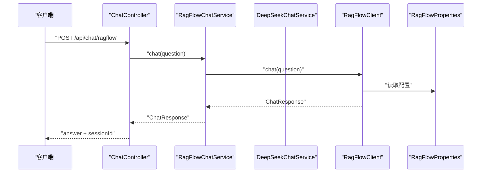
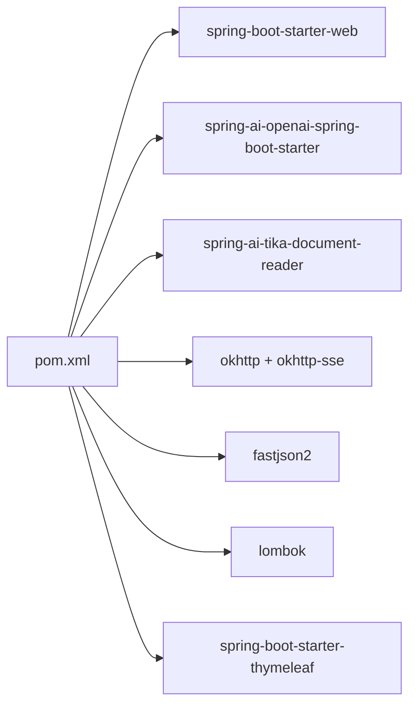
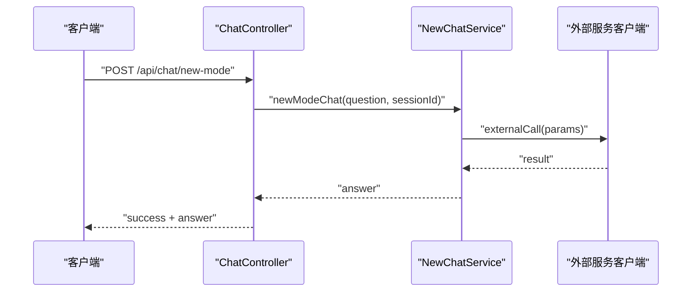

# 扩展与定制

<cite>
**本文引用的文件**
- [DeepSeekRagFlowApplication.java](file://src/main/java/org/wiki/DeepSeekRagFlowApplication.java)
- [RagFlowProperties.java](file://src/main/java/org/wiki/config/RagFlowProperties.java)
- [WebConfig.java](file://src/main/java/org/wiki/config/WebConfig.java)
- [GlobalExceptionHandler.java](file://src/main/java/org/wiki/config/GlobalExceptionHandler.java)
- [ChatController.java](file://src/main/java/org/wiki/controller/ChatController.java)
- [RagFlowChatService.java](file://src/main/java/org/wiki/service/RagFlowChatService.java)
- [DeepSeekChatService.java](file://src/main/java/org/wiki/service/DeepSeekChatService.java)
- [ChatHistoryService.java](file://src/main/java/org/wiki/service/ChatHistoryService.java)
- [RagFlowClient.java](file://src/main/java/org/wiki/client/RagFlowClient.java)
- [ChatRequest.java](file://src/main/java/org/wiki/model/ChatRequest.java)
- [ChatResponse.java](file://src/main/java/org/wiki/model/ChatResponse.java)
- [ChatMessage.java](file://src/main/java/org/wiki/model/ChatMessage.java)
- [Dataset.java](file://src/main/java/org/wiki/model/Dataset.java)
- [application.yml](file://src/main/resources/application.yml)
- [pom.xml](file://pom.xml)
</cite>

## 目录
1. [简介](#简介)
2. [项目结构](#项目结构)
3. [核心组件](#核心组件)
4. [架构总览](#架构总览)
5. [详细组件分析](#详细组件分析)
6. [依赖分析](#依赖分析)
7. [性能考量](#性能考量)
8. [故障排查指南](#故障排查指南)
9. [结论](#结论)
10. [附录](#附录)

## 简介
本文件面向希望在 DeepSeek + RAGFlow 系统基础上进行功能扩展与定制的开发者，提供从新增对话模式、自定义配置、插件系统设计思路、第三方服务集成、知识库扩展到测试与质量保障的完整指南。文档结合现有代码结构，给出可操作的步骤、最佳实践与架构建议。

## 项目结构
系统采用分层架构：控制器层负责对外 API；服务层封装业务逻辑；客户端层封装外部服务调用；模型层承载请求/响应数据结构；配置层管理应用与外部服务参数；资源层包含静态页面与配置文件。

```mermaid
graph TB
subgraph "应用入口"
A["DeepSeekRagFlowApplication.java"]
end
subgraph "配置层"
B["RagFlowProperties.java"]
C["WebConfig.java"]
D["GlobalExceptionHandler.java"]
E["application.yml"]
end
subgraph "控制器层"
F["ChatController.java"]
end
subgraph "服务层"
G["RagFlowChatService.java"]
H["DeepSeekChatService.java"]
I["ChatHistoryService.java"]
end
subgraph "客户端层"
J["RagFlowClient.java"]
end
subgraph "模型层"
K["ChatRequest.java"]
L["ChatResponse.java"]
M["ChatMessage.java"]
N["Dataset.java"]
end
A --> F
F --> G
F --> H
F --> I
G --> J
J --> B
F --> K
F --> L
F --> M
F --> N
B --> E
C --> F
D --> F
```

**图表来源**
- [DeepSeekRagFlowApplication.java:1-12](file://src/main/java/org/wiki/DeepSeekRagFlowApplication.java#L1-L12)
- [RagFlowProperties.java:1-32](file://src/main/java/org/wiki/config/RagFlowProperties.java#L1-L32)
- [WebConfig.java:1-23](file://src/main/java/org/wiki/config/WebConfig.java#L1-L23)
- [GlobalExceptionHandler.java:1-46](file://src/main/java/org/wiki/config/GlobalExceptionHandler.java#L1-L46)
- [ChatController.java:1-276](file://src/main/java/org/wiki/controller/ChatController.java#L1-L276)
- [RagFlowChatService.java:1-84](file://src/main/java/org/wiki/service/RagFlowChatService.java#L1-L84)
- [DeepSeekChatService.java:1-125](file://src/main/java/org/wiki/service/DeepSeekChatService.java#L1-L125)
- [ChatHistoryService.java:1-88](file://src/main/java/org/wiki/service/ChatHistoryService.java#L1-L88)
- [RagFlowClient.java:1-231](file://src/main/java/org/wiki/client/RagFlowClient.java#L1-L231)
- [ChatRequest.java:1-59](file://src/main/java/org/wiki/model/ChatRequest.java#L1-L59)
- [ChatResponse.java:1-52](file://src/main/java/org/wiki/model/ChatResponse.java#L1-L52)
- [ChatMessage.java:1-82](file://src/main/java/org/wiki/model/ChatMessage.java#L1-L82)
- [Dataset.java:1-33](file://src/main/java/org/wiki/model/Dataset.java#L1-L33)
- [application.yml:1-27](file://src/main/resources/application.yml#L1-L27)

**章节来源**
- [pom.xml:1-102](file://pom.xml#L1-L102)

## 核心组件
- 应用入口：启动 Spring Boot 应用。
- 控制器：提供多模式对话 API，包括 RAGFlow、DeepSeek、DeepSeek+RAG 增强及流式输出。
- 服务层：
  - RAGFlowChatService：封装 RAGFlow OpenAI 兼容接口调用与 SSE 流式解析。
  - DeepSeekChatService：基于 Spring AI ChatClient 的 DeepSeek 对话能力，支持纯对话、RAG 增强与流式输出。
  - ChatHistoryService：内存级对话历史管理。
- 客户端：RagFlowClient 封装 HTTP 调用、Multipart 上传与 SSE 流读取。
- 配置：RagFlowProperties 绑定 ragflow.* 配置；WebConfig 提供跨域；GlobalExceptionHandler 统一异常处理。
- 模型：ChatRequest/ChatResponse/ChatMessage/Dataset 描述请求/响应与领域对象。

**章节来源**
- [ChatController.java:1-276](file://src/main/java/org/wiki/controller/ChatController.java#L1-L276)
- [RagFlowChatService.java:1-84](file://src/main/java/org/wiki/service/RagFlowChatService.java#L1-L84)
- [DeepSeekChatService.java:1-125](file://src/main/java/org/wiki/service/DeepSeekChatService.java#L1-L125)
- [ChatHistoryService.java:1-88](file://src/main/java/org/wiki/service/ChatHistoryService.java#L1-L88)
- [RagFlowClient.java:1-231](file://src/main/java/org/wiki/client/RagFlowClient.java#L1-L231)
- [RagFlowProperties.java:1-32](file://src/main/java/org/wiki/config/RagFlowProperties.java#L1-L32)
- [WebConfig.java:1-23](file://src/main/java/org/wiki/config/WebConfig.java#L1-L23)
- [GlobalExceptionHandler.java:1-46](file://src/main/java/org/wiki/config/GlobalExceptionHandler.java#L1-L46)
- [ChatRequest.java:1-59](file://src/main/java/org/wiki/model/ChatRequest.java#L1-L59)
- [ChatResponse.java:1-52](file://src/main/java/org/wiki/model/ChatResponse.java#L1-L52)
- [ChatMessage.java:1-82](file://src/main/java/org/wiki/model/ChatMessage.java#L1-L82)
- [Dataset.java:1-33](file://src/main/java/org/wiki/model/Dataset.java#L1-L33)

## 架构总览
系统采用“控制器-服务-客户端-外部服务”的分层设计，通过配置类集中管理外部服务参数，通过模型类统一请求/响应契约，通过异常处理器统一错误语义。

**图表来源**
- [ChatController.java:51-76](file://src/main/java/org/wiki/controller/ChatController.java#L51-L76)
- [RagFlowChatService.java:34-41](file://src/main/java/org/wiki/service/RagFlowChatService.java#L34-L41)
- [RagFlowClient.java:135-148](file://src/main/java/org/wiki/client/RagFlowClient.java#L135-L148)
- [RagFlowProperties.java:10-31](file://src/main/java/org/wiki/config/RagFlowProperties.java#L10-L31)

## 详细组件分析

### 新增对话模式：创建新的 Service 类、实现业务逻辑与集成到控制器
- 步骤一：创建新的 Service 类
  - 在服务包中新增类，标注为服务组件，注入所需依赖（如客户端、配置、其他服务）。
  - 实现业务方法，遵循现有风格的日志记录与异常处理。
  - 示例参考：RagFlowChatService、DeepSeekChatService 的方法命名与职责划分。
- 步骤二：在控制器中注册与暴露 API
  - 在控制器构造函数注入新服务。
  - 新增 REST 接口，定义路径、HTTP 方法与参数，返回统一结构。
  - 参考现有接口：RAGFlow 模式、DeepSeek 模式、流式接口等。
- 步骤三：可选集成流式输出
  - 若需要 SSE 或 Spring Reactor Flux，参考现有实现，注意超时与错误处理。
- 最佳实践
  - 明确单一职责，避免在控制器中直接拼接业务逻辑。
  - 统一返回结构与错误码，便于前端消费。
  - 对外部调用增加超时与重试策略（见配置与客户端）。

**章节来源**
- [RagFlowChatService.java:1-84](file://src/main/java/org/wiki/service/RagFlowChatService.java#L1-L84)
- [DeepSeekChatService.java:1-125](file://src/main/java/org/wiki/service/DeepSeekChatService.java#L1-L125)
- [ChatController.java:37-41](file://src/main/java/org/wiki/controller/ChatController.java#L37-L41)

### 自定义配置：添加新的配置属性与配置类
- 方案一：扩展现有配置类
  - 在 RagFlowProperties 中新增字段，设置合理默认值。
  - 在 application.yml 中添加对应键值，保持前缀一致。
  - 参考现有字段：baseUrl、apiKey、chatId、timeout。
- 方案二：新增独立配置类
  - 新建配置类，使用 @ConfigurationProperties(prefix = "...")。
  - 在 application.yml 中新增前缀段落。
  - 通过构造函数注入到客户端或服务中使用。
- 注意事项
  - 字段类型与默认值需与外部服务接口匹配。
  - 对敏感信息（如 API Key）建议通过环境变量覆盖。

**章节来源**
- [RagFlowProperties.java:10-31](file://src/main/java/org/wiki/config/RagFlowProperties.java#L10-L31)
- [application.yml:17-22](file://src/main/resources/application.yml#L17-L22)

### 插件系统设计思路与实现方式
- 设计思路
  - 插件应遵循“接口隔离 + 工厂注册 + 动态加载”原则。
  - 定义统一的插件接口（如 ChatModePlugin），由不同实现提供具体模式。
  - 通过工厂或枚举选择当前模式，避免在控制器中硬编码分支。
- 实现要点
  - 将模式切换逻辑抽象到服务层，控制器仅负责路由与参数传递。
  - 插件内部可复用现有客户端与模型，降低耦合。
  - 为每个插件提供独立的配置类与默认参数，便于扩展。
- 与现有代码的契合点
  - 当前已区分 RAGFlow、DeepSeek、DeepSeek+RAG 三种模式，可作为插件化改造的起点。

[本节为概念性设计，不直接分析具体文件，故无“章节来源”]

### 第三方服务集成：新的外部 API 客户端开发与集成模式
- 开发步骤
  - 定义请求/响应模型（参考 ChatRequest/ChatResponse）。
  - 编写客户端类，封装 HTTP 调用、认证头、超时与错误处理。
  - 在服务层注入客户端，实现业务方法。
  - 在控制器中暴露 API，统一返回结构。
- 集成模式
  - 非流式：直接返回响应对象。
  - 流式：解析 SSE/Flux，逐块推送至客户端。
  - 文件上传：使用 Multipart 构造请求体。
- 参考实现
  - RagFlowClient 的通用 HTTP 方法、SSE 解析与文件上传。
  - RagFlowChatService 的流式回调与引用信息提取。

**章节来源**
- [RagFlowClient.java:40-229](file://src/main/java/org/wiki/client/RagFlowClient.java#L40-L229)
- [RagFlowChatService.java:50-72](file://src/main/java/org/wiki/service/RagFlowChatService.java#L50-L72)
- [ChatRequest.java:17-58](file://src/main/java/org/wiki/model/ChatRequest.java#L17-L58)
- [ChatResponse.java:16-51](file://src/main/java/org/wiki/model/ChatResponse.java#L16-L51)

### 扩展知识库功能：支持新的文档格式或存储方式
- 新增文档格式
  - 在客户端层新增针对特定格式的解析与上传逻辑（参考文件上传方法）。
  - 在服务层提供统一的文档入库接口，屏蔽格式差异。
- 存储方式扩展
  - 若需替换底层存储，可在客户端层抽象出存储接口，通过配置切换实现。
  - 保持与现有 Dataset 模型的兼容性，确保 UI 与查询逻辑不受影响。
- 与现有能力的衔接
  - 可沿用 RagFlowClient 的上传接口，统一走 OpenAI 兼容路径。
  - 通过 ChatHistoryService 记录入库状态与引用信息。

**章节来源**
- [RagFlowClient.java:206-229](file://src/main/java/org/wiki/client/RagFlowClient.java#L206-L229)
- [Dataset.java:13-32](file://src/main/java/org/wiki/model/Dataset.java#L13-L32)

### 代码扩展的最佳实践、设计模式与架构考虑
- 最佳实践
  - 单一职责：每个服务只做一件事，控制器只负责路由。
  - 配置驱动：将外部服务参数集中在配置类，便于切换与测试。
  - 错误处理：统一异常捕获与返回，区分业务异常与系统异常。
  - 日志规范：记录关键入参与摘要响应，便于排障。
- 设计模式
  - 工厂/策略：用于模式切换与插件注册。
  - 适配器：封装第三方 API 差异。
  - 观察者/回调：用于流式输出的增量推送。
- 架构考虑
  - 可观测性：增加指标与链路追踪。
  - 安全性：鉴权头与密钥管理，避免明文存储。
  - 性能：连接池、超时与限流，避免阻塞主线程。

[本节为通用指导，不直接分析具体文件，故无“章节来源”]

## 依赖分析
系统依赖以 Maven 管理，核心包括 Spring Web、Spring AI OpenAI 兼容层、OkHttp 及其 SSE 扩展、FastJSON2、Lombok 与 Thymeleaf。这些依赖支撑了控制器、AI 对话、HTTP 客户端与模板渲染。

**图表来源**
- [pom.xml:25-88](file://pom.xml#L25-L88)

**章节来源**
- [pom.xml:15-23](file://pom.xml#L15-L23)

## 性能考量
- 超时与连接池
  - 客户端使用 OkHttp 并设置连接/读/写超时，建议根据外部服务 SLA 调整。
  - 控制器流式接口使用 SSE，注意超时时间与客户端断线重连。
- 并发与线程
  - 流式场景使用线程池执行长耗时任务，避免阻塞 Web 线程。
- 日志与监控
  - 对关键路径增加日志与采样，生产环境建议接入链路追踪与指标采集。

[本节提供一般性建议，不直接分析具体文件，故无“章节来源”]

## 故障排查指南
- 统一异常处理
  - 全局异常处理器对 Exception 与 IOException 进行分类处理，返回标准化结构。
  - 对未授权与 IO 失败场景设置明确的状态码。
- 常见问题定位
  - RAGFlow 服务不可达：检查 baseUrl、apiKey、chatId 与网络连通性。
  - 超时：调整 RagFlowProperties.timeout 与客户端超时配置。
  - 流式解析异常：关注 SSE 数据格式与 JSON 解析逻辑。
- 建议流程
  - 打开调试日志，复现问题并核对请求/响应摘要。
  - 分离问题来源：是控制器参数问题、服务层业务问题还是外部服务异常。

**章节来源**
- [GlobalExceptionHandler.java:20-44](file://src/main/java/org/wiki/config/GlobalExceptionHandler.java#L20-L44)
- [RagFlowProperties.java:15-30](file://src/main/java/org/wiki/config/RagFlowProperties.java#L15-L30)
- [RagFlowClient.java:175-199](file://src/main/java/org/wiki/client/RagFlowClient.java#L175-L199)

## 结论
通过模块化设计与配置驱动，系统具备良好的扩展性。新增对话模式、第三方服务与知识库能力均可在现有框架内快速落地。建议优先采用插件化与工厂模式组织扩展点，配合完善的测试与可观测性体系，确保演进过程的稳定性与可维护性。

## 附录

### 新增对话模式的端到端序列图（示例）

[此图为概念示意，不映射具体源文件，故无“图表来源”]