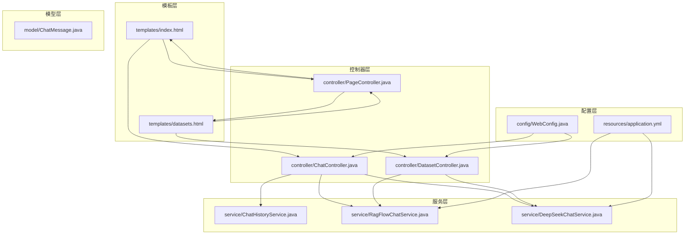
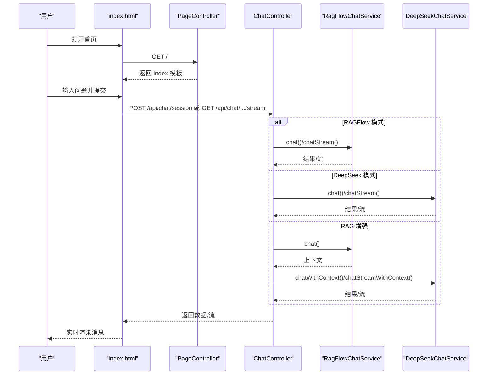
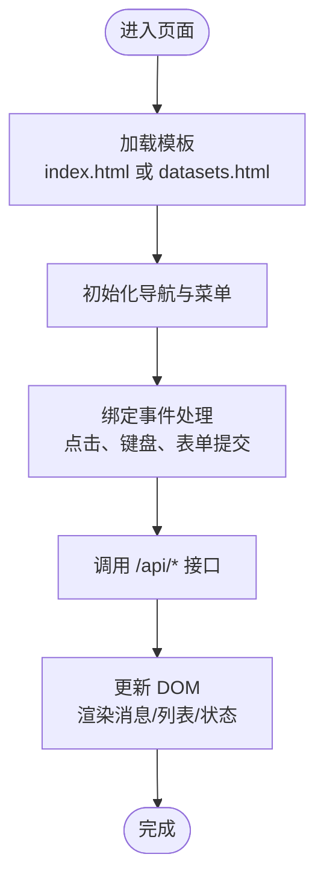
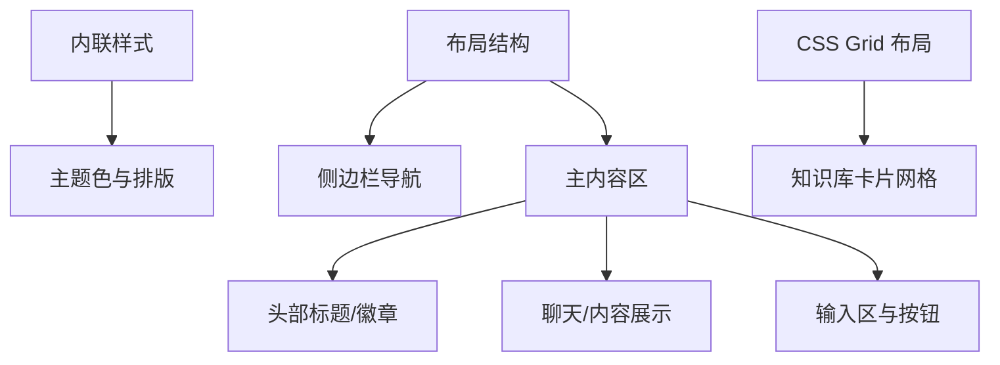
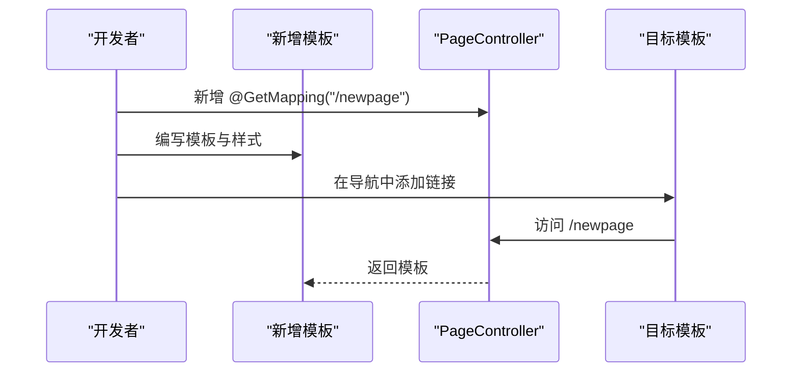
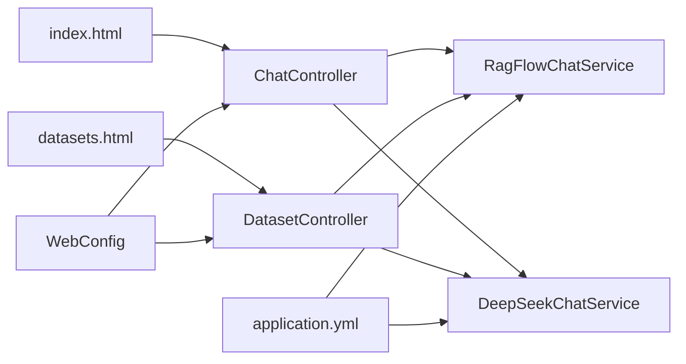

# 界面定制

<cite>
**本文引用的文件**
- [index.html](file://src/main/resources/templates/index.html)
- [datasets.html](file://src/main/resources/templates/datasets.html)
- [PageController.java](file://src/main/java/org/wiki/controller/PageController.java)
- [WebConfig.java](file://src/main/java/org/wiki/config/WebConfig.java)
- [application.yml](file://src/main/resources/application.yml)
- [ChatController.java](file://src/main/java/org/wiki/controller/ChatController.java)
- [DatasetController.java](file://src/main/java/org/wiki/controller/DatasetController.java)
- [ChatHistoryService.java](file://src/main/java/org/wiki/service/ChatHistoryService.java)
- [RagFlowChatService.java](file://src/main/java/org/wiki/service/RagFlowChatService.java)
- [DeepSeekChatService.java](file://src/main/java/org/wiki/service/DeepSeekChatService.java)
- [ChatMessage.java](file://src/main/java/org/wiki/model/ChatMessage.java)
- [pom.xml](file://pom.xml)
</cite>

## 目录
1. [简介](#简介)
2. [项目结构](#项目结构)
3. [核心组件](#核心组件)
4. [架构总览](#架构总览)
5. [详细组件分析](#详细组件分析)
6. [依赖分析](#依赖分析)
7. [性能考虑](#性能考虑)
8. [故障排查指南](#故障排查指南)
9. [结论](#结论)
10. [附录](#附录)

## 简介
本文件面向开发者，系统化讲解如何在本项目中进行界面定制与用户体验优化。内容覆盖：
- Thymeleaf 模板的定制方法（页面布局、组件替换、样式调整）
- 静态资源管理（CSS、JavaScript、图片）与组织结构
- 响应式设计与移动端适配策略
- 新页面与导航菜单的扩展流程
- 用户体验优化与无障碍访问最佳实践
- 界面测试与兼容性验证方法

## 项目结构
本项目采用 Spring Boot + Thymeleaf 的前后端同构方案，模板位于 resources/templates 下，控制器负责路由与数据装配，前端交互通过内联脚本与后端 API 协作。

**图表来源**
- [index.html](file://src/main/resources/templates/index.html)
- [datasets.html](file://src/main/resources/templates/datasets.html)
- [PageController.java](file://src/main/java/org/wiki/controller/PageController.java)
- [ChatController.java](file://src/main/java/org/wiki/controller/ChatController.java)
- [DatasetController.java](file://src/main/java/org/wiki/controller/DatasetController.java)
- [WebConfig.java](file://src/main/java/org/wiki/config/WebConfig.java)
- [application.yml](file://src/main/resources/application.yml)
- [ChatHistoryService.java](file://src/main/java/org/wiki/service/ChatHistoryService.java)
- [RagFlowChatService.java](file://src/main/java/org/wiki/service/RagFlowChatService.java)
- [DeepSeekChatService.java](file://src/main/java/org/wiki/service/DeepSeekChatService.java)
- [ChatMessage.java](file://src/main/java/org/wiki/model/ChatMessage.java)

**章节来源**
- [PageController.java:17-28](file://src/main/java/org/wiki/controller/PageController.java#L17-L28)
- [index.html:1-329](file://src/main/resources/templates/index.html#L1-L329)
- [datasets.html:1-335](file://src/main/resources/templates/datasets.html#L1-L335)

## 核心组件
- 页面路由控制器：负责将路径映射到模板文件，实现页面跳转与初始渲染。
- 对话控制器：提供三类对话模式的 REST API，支持流式与非流式响应。
- 知识库控制器：提供知识库与文档的增删改查与解析任务触发。
- 服务层：封装 RAGFlow 与 DeepSeek 的调用细节，统一输出格式。
- 配置：CORS 放通 /api/**，便于前端直连后端接口。
- 应用配置：定义 RAGFlow 与 DeepSeek 的基础参数与超时设置。

**章节来源**
- [PageController.java:17-28](file://src/main/java/org/wiki/controller/PageController.java#L17-L28)
- [ChatController.java:31-275](file://src/main/java/org/wiki/controller/ChatController.java#L31-L275)
- [DatasetController.java:26-196](file://src/main/java/org/wiki/controller/DatasetController.java#L26-L196)
- [WebConfig.java:14-21](file://src/main/java/org/wiki/config/WebConfig.java#L14-L21)
- [application.yml:17-22](file://src/main/resources/application.yml#L17-L22)

## 架构总览
前端通过 Thymeleaf 模板渲染，内联 JavaScript 调用后端 /api/* 接口，实现对话、知识库管理等交互。控制器与服务层解耦，便于扩展新功能或替换底层实现。

**图表来源**
- [index.html:164-326](file://src/main/resources/templates/index.html#L164-L326)
- [ChatController.java:51-274](file://src/main/java/org/wiki/controller/ChatController.java#L51-L274)
- [RagFlowChatService.java:34-72](file://src/main/java/org/wiki/service/RagFlowChatService.java#L34-L72)
- [DeepSeekChatService.java:36-123](file://src/main/java/org/wiki/service/DeepSeekChatService.java#L36-L123)

## 详细组件分析

### 页面与模板定制（Thymeleaf）
- 模板位置：resources/templates 下的 HTML 文件即为 Thymeleaf 模板。
- 页面路由：PageController 将路径 "/" 与 "/datasets" 映射到对应模板名，实现页面切换。
- 导航菜单：模板内通过内联事件绑定实现页面跳转，可直接修改导航项与目标路径。
- 组件替换：模板内的模块（如侧边栏、卡片、表单）均可按需替换为自定义结构，保持与 JS 交互一致即可。

**图表来源**
- [index.html:86-143](file://src/main/resources/templates/index.html#L86-L143)
- [datasets.html:75-100](file://src/main/resources/templates/datasets.html#L75-L100)
- [PageController.java:17-28](file://src/main/java/org/wiki/controller/PageController.java#L17-L28)

**章节来源**
- [index.html:86-143](file://src/main/resources/templates/index.html#L86-L143)
- [datasets.html:75-100](file://src/main/resources/templates/datasets.html#L75-L100)
- [PageController.java:17-28](file://src/main/java/org/wiki/controller/PageController.java#L17-L28)

### 样式与布局定制
- 内联样式：模板内包含大量内联 CSS，便于快速定制主题与布局。
- 布局结构：采用侧边栏 + 主内容区的两列布局，主区包含头部、聊天/内容区、输入区。
- 响应式网格：知识库页面使用 CSS Grid 实现卡片自适应排列。
- 可视化元素：欢迎页卡片、输入框自动高度、打字指示器等交互细节。

**图表来源**
- [index.html:12-82](file://src/main/resources/templates/index.html#L12-L82)
- [datasets.html:7-71](file://src/main/resources/templates/datasets.html#L7-L71)

**章节来源**
- [index.html:12-82](file://src/main/resources/templates/index.html#L12-L82)
- [datasets.html:7-71](file://src/main/resources/templates/datasets.html#L7-L71)

### 静态资源管理
- 当前项目未使用 resources/static 目录存放静态资源；所有样式与脚本均以内联形式嵌入模板。
- 若需引入外部 CSS/JS/图片：
  - 在 templates 中通过相对路径引用（例如 <link>、<script>、）。
  - 注意跨域与安全策略，必要时在 WebConfig 中补充 CORS 配置。
  - 生产部署建议将静态资源放入 static 目录并通过 CDN 加速。

**章节来源**
- [WebConfig.java:14-21](file://src/main/java/org/wiki/config/WebConfig.java#L14-L21)
- [pom.xml:75-80](file://pom.xml#L75-L80)

### 响应式设计与移动端适配
- 已内置 viewport 设置与媒体查询友好的布局（如卡片网格、输入框自适应）。
- 建议进一步：
  - 使用 CSS 媒体查询细化断点，保证窄屏下导航折叠与字体缩放。
  - 优化触摸交互（按钮尺寸、点击热区），确保移动端点击友好。
  - 图片与图标使用矢量格式或多分辨率位图，提升清晰度。

**章节来源**
- [index.html:4-6](file://src/main/resources/templates/index.html#L4-L6)
- [datasets.html:4-6](file://src/main/resources/templates/datasets.html#L4-L6)

### 新页面与导航菜单扩展
- 新增页面步骤：
  1) 在 resources/templates 下新增模板文件（如 mypage.html）。
  2) 在 PageController 中新增 @GetMapping 映射，返回模板名。
  3) 在各模板的导航区增加链接，或在模板内通过内联事件跳转。
- 导航菜单：
  - 当前模板通过内联 onclick 事件跳转，也可改为使用 a 标签配合后端路由。
  - 保持活动状态样式（active）与当前页面一致，提升可用性。

**图表来源**
- [PageController.java:17-28](file://src/main/java/org/wiki/controller/PageController.java#L17-L28)
- [index.html:92-94](file://src/main/resources/templates/index.html#L92-L94)
- [datasets.html:80-83](file://src/main/resources/templates/datasets.html#L80-L83)

**章节来源**
- [PageController.java:17-28](file://src/main/java/org/wiki/controller/PageController.java#L17-L28)
- [index.html:92-94](file://src/main/resources/templates/index.html#L92-L94)
- [datasets.html:80-83](file://src/main/resources/templates/datasets.html#L80-L83)

### 用户体验优化与无障碍访问
- 无障碍建议：
  - 为按钮与链接提供语义化标签与可读性文案。
  - 控制焦点顺序与键盘可达性（Tab 键顺序、回车提交）。
  - 为图片提供替代文本，为表单控件提供关联标签。
- 交互优化：
  - 输入框自动高度、禁用发送按钮防抖、打字指示器。
  - 成功/错误通知统一提示，避免覆盖重要信息。
  - 列表懒加载与分页，减少首屏压力。

**章节来源**
- [index.html:174-184](file://src/main/resources/templates/index.html#L174-L184)
- [index.html:249-255](file://src/main/resources/templates/index.html#L249-L255)
- [datasets.html:322-328](file://src/main/resources/templates/datasets.html#L322-L328)

### 界面测试与兼容性验证
- 测试建议：
  - 功能测试：覆盖三种对话模式、会话历史、知识库 CRUD、文档上传与解析。
  - 兼容性：在主流浏览器（Chrome、Firefox、Safari、Edge）与移动端浏览器验证。
  - 性能：监控首屏渲染、流式响应延迟、DOM 更新频率。
- 兼容性配置：
  - CORS 已放通 /api/**，确保跨域请求正常。
  - 如需引入外部 CDN 资源，注意 HTTPS 与子资源完整性（SRI）。

**章节来源**
- [WebConfig.java:14-21](file://src/main/java/org/wiki/config/WebConfig.java#L14-L21)

## 依赖分析
- 模板与控制器：PageController 负责路由，模板内 JS 调用 ChatController/DatasetController 提供的 API。
- 服务层：ChatController 组合 RagFlowChatService 与 DeepSeekChatService，统一输出格式；DatasetController 调用 DatasetService/DocumentService。
- 配置：WebConfig 放通 /api/**，application.yml 提供 RAGFlow 与 DeepSeek 的基础配置。

**图表来源**
- [ChatController.java:32-41](file://src/main/java/org/wiki/controller/ChatController.java#L32-L41)
- [DatasetController.java:28-35](file://src/main/java/org/wiki/controller/DatasetController.java#L28-L35)
- [WebConfig.java:14-21](file://src/main/java/org/wiki/config/WebConfig.java#L14-L21)
- [application.yml:17-22](file://src/main/resources/application.yml#L17-L22)

**章节来源**
- [ChatController.java:32-41](file://src/main/java/org/wiki/controller/ChatController.java#L32-L41)
- [DatasetController.java:28-35](file://src/main/java/org/wiki/controller/DatasetController.java#L28-L35)
- [WebConfig.java:14-21](file://src/main/java/org/wiki/config/WebConfig.java#L14-L21)
- [application.yml:17-22](file://src/main/resources/application.yml#L17-L22)

## 性能考虑
- 流式响应：RAGFlow 与 DeepSeek 的流式接口可降低首屏等待时间，提升感知速度。
- DOM 更新：批量更新与节流（如输入框高度计算）有助于减少重排重绘。
- 资源加载：若引入外部资源，建议启用压缩与缓存策略，合理设置缓存头。
- 会话历史：ChatHistoryService 限制每会话最大消息数，避免内存膨胀。

**章节来源**
- [ChatController.java:85-107](file://src/main/java/org/wiki/controller/ChatController.java#L85-L107)
- [ChatController.java:223-274](file://src/main/java/org/wiki/controller/ChatController.java#L223-L274)
- [ChatHistoryService.java:26-43](file://src/main/java/org/wiki/service/ChatHistoryService.java#L26-L43)

## 故障排查指南
- 对话接口异常：
  - 检查 /api/chat/* 是否被 CORS 放通。
  - 核对 application.yml 中 RAGFlow 与 DeepSeek 的基础地址与密钥。
- 知识库管理异常：
  - 确认 /api/datasets/* 接口返回 success=true。
  - 检查文件上传类型与大小限制。
- 前端交互异常：
  - 查看浏览器控制台网络与脚本报错。
  - 确保模板内 JS 与后端接口路径一致。

**章节来源**
- [WebConfig.java:14-21](file://src/main/java/org/wiki/config/WebConfig.java#L14-L21)
- [application.yml:17-22](file://src/main/resources/application.yml#L17-L22)
- [ChatController.java:51-76](file://src/main/java/org/wiki/controller/ChatController.java#L51-L76)
- [DatasetController.java:41-58](file://src/main/java/org/wiki/controller/DatasetController.java#L41-L58)

## 结论
本项目以 Thymeleaf 模板为核心，结合内联脚本与后端 API 实现了完整的对话与知识库管理界面。通过合理的布局与样式定制、完善的 CORS 配置与服务层抽象，开发者可以高效地扩展新页面、优化用户体验并保障兼容性。建议在后续迭代中逐步引入静态资源目录与构建工具链，以获得更佳的开发与运维体验。

## 附录
- 快速定位参考：
  - 首页模板与脚本：[index.html:164-326](file://src/main/resources/templates/index.html#L164-L326)
  - 知识库模板与脚本：[datasets.html:150-332](file://src/main/resources/templates/datasets.html#L150-L332)
  - 页面路由：[PageController.java:17-28](file://src/main/java/org/wiki/controller/PageController.java#L17-L28)
  - 对话 API：[ChatController.java:51-274](file://src/main/java/org/wiki/controller/ChatController.java#L51-L274)
  - 知识库 API：[DatasetController.java:41-195](file://src/main/java/org/wiki/controller/DatasetController.java#L41-L195)
  - CORS 配置：[WebConfig.java:14-21](file://src/main/java/org/wiki/config/WebConfig.java#L14-L21)
  - 应用配置：[application.yml:17-22](file://src/main/resources/application.yml#L17-L22)