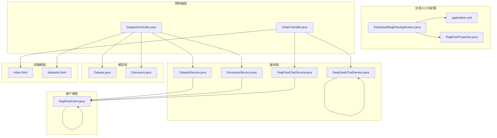
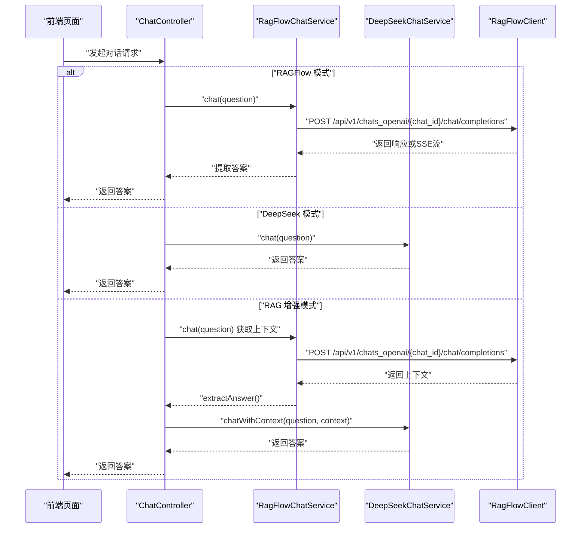
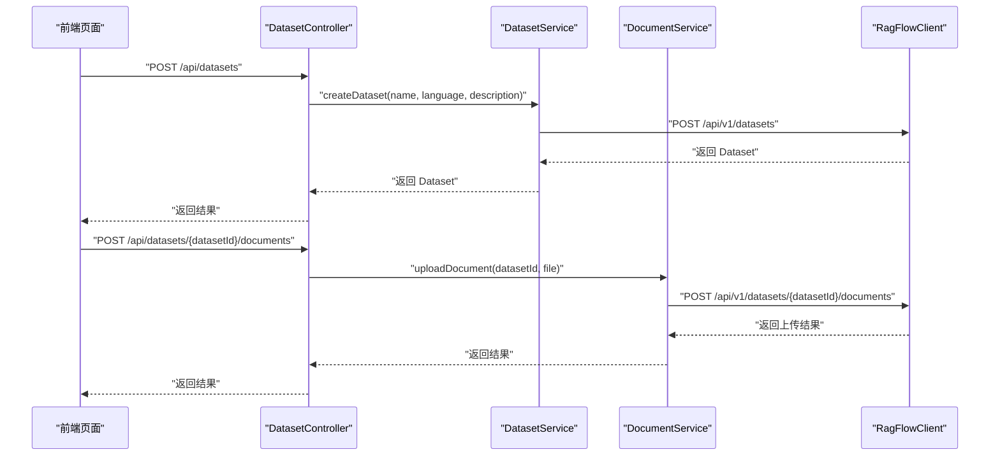
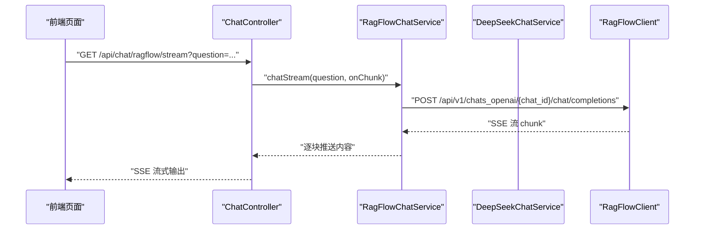
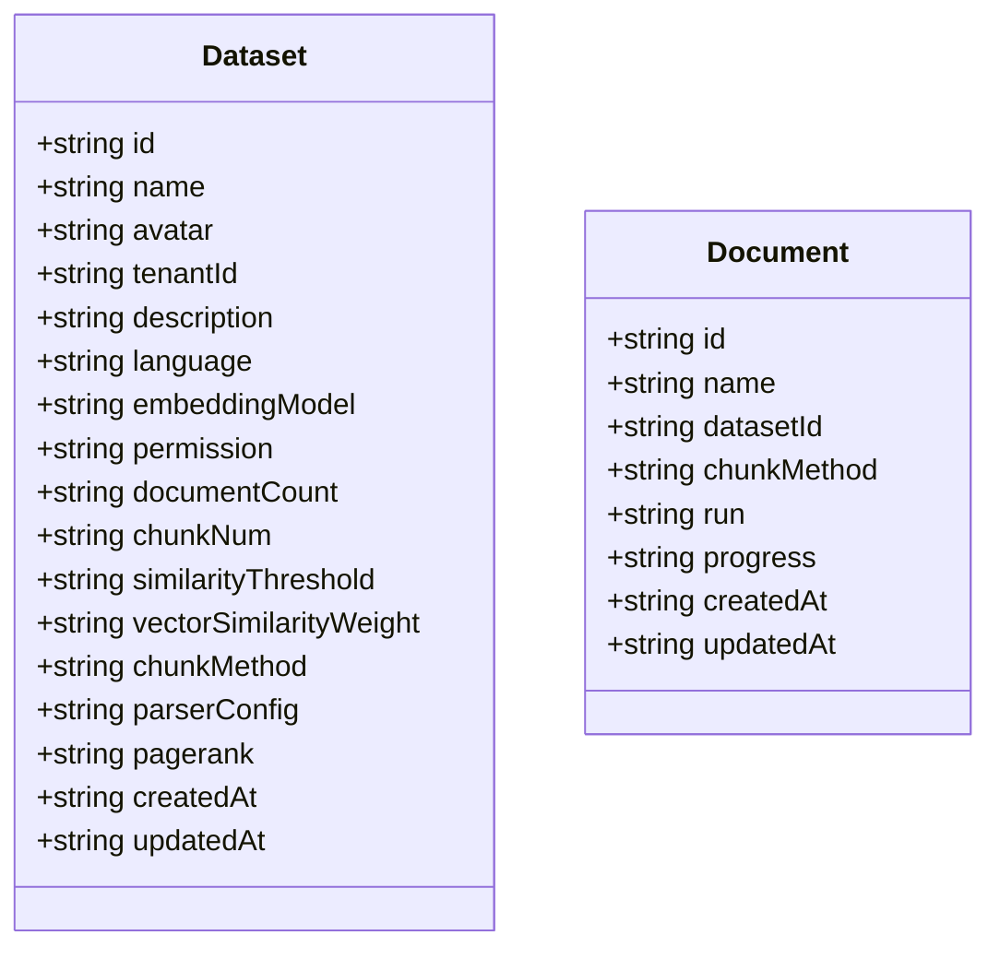
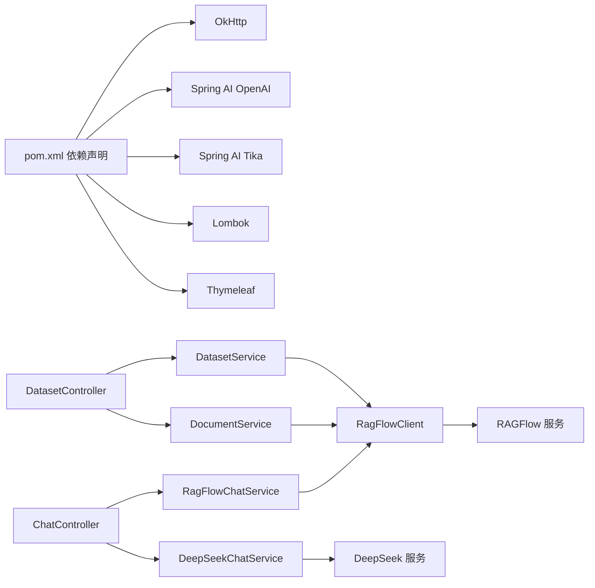

# 知识库功能扩展

<cite>
**本文引用的文件**
- [DeepSeekRagFlowApplication.java](file://src/main/java/org/wiki/DeepSeekRagFlowApplication.java)
- [application.yml](file://src/main/resources/application.yml)
- [RagFlowProperties.java](file://src/main/java/org/wiki/config/RagFlowProperties.java)
- [RagFlowClient.java](file://src/main/java/org/wiki/client/RagFlowClient.java)
- [DatasetController.java](file://src/main/java/org/wiki/controller/DatasetController.java)
- [ChatController.java](file://src/main/java/org/wiki/controller/ChatController.java)
- [DatasetService.java](file://src/main/java/org/wiki/service/DatasetService.java)
- [DocumentService.java](file://src/main/java/org/wiki/service/DocumentService.java)
- [RagFlowChatService.java](file://src/main/java/org/wiki/service/RagFlowChatService.java)
- [DeepSeekChatService.java](file://src/main/java/org/wiki/service/DeepSeekChatService.java)
- [Dataset.java](file://src/main/java/org/wiki/model/Dataset.java)
- [Document.java](file://src/main/java/org/wiki/model/Document.java)
- [index.html](file://src/main/resources/templates/index.html)
- [datasets.html](file://src/main/resources/templates/datasets.html)
- [pom.xml](file://pom.xml)
</cite>

## 目录
1. [简介](#简介)
2. [项目结构](#项目结构)
3. [核心组件](#核心组件)
4. [架构总览](#架构总览)
5. [详细组件分析](#详细组件分析)
6. [依赖分析](#依赖分析)
7. [性能考虑](#性能考虑)
8. [故障排查指南](#故障排查指南)
9. [结论](#结论)
10. [附录](#附录)

## 简介
本文件面向需要扩展“知识库管理功能”的开发者，围绕以下目标提供系统化指导：
- 如何支持新的文档格式（文件解析器与元数据提取）
- 存储系统的扩展机制（不同存储后端与索引策略）
- 文档生命周期管理（自动分类、标签管理、版本控制）
- 增量更新与批量导入
- 性能优化与容量规划
- 扩展开发的测试与质量保障

当前仓库基于 Spring Boot 与 OkHttp 实现了与 RAGFlow 的对接，提供知识库 CRUD、文档上传/解析/删除、以及三种对话模式（RAGFlow、DeepSeek、RAG 增强）。扩展点主要集中在解析层、存储层与索引层的抽象与替换。

## 项目结构
项目采用典型的分层架构：
- 应用入口与配置：应用启动类、全局配置、RAGFlow 属性
- 控制器层：对外暴露 REST API，处理请求与响应
- 服务层：封装业务逻辑，协调客户端与外部服务
- 客户端层：封装 HTTP 客户端与外部服务交互
- 模型层：数据传输对象
- 前端模板：Thymeleaf 页面，提供知识库与对话界面

**图表来源**
- [DeepSeekRagFlowApplication.java:1-12](file://src/main/java/org/wiki/DeepSeekRagFlowApplication.java#L1-L12)
- [application.yml:1-27](file://src/main/resources/application.yml#L1-L27)
- [RagFlowProperties.java:1-32](file://src/main/java/org/wiki/config/RagFlowProperties.java#L1-L32)
- [DatasetController.java:1-197](file://src/main/java/org/wiki/controller/DatasetController.java#L1-L197)
- [ChatController.java:1-276](file://src/main/java/org/wiki/controller/ChatController.java#L1-L276)
- [DatasetService.java:1-128](file://src/main/java/org/wiki/service/DatasetService.java#L1-L128)
- [DocumentService.java:1-98](file://src/main/java/org/wiki/service/DocumentService.java#L1-L98)
- [RagFlowChatService.java:1-84](file://src/main/java/org/wiki/service/RagFlowChatService.java#L1-L84)
- [DeepSeekChatService.java:1-125](file://src/main/java/org/wiki/service/DeepSeekChatService.java#L1-L125)
- [RagFlowClient.java:1-231](file://src/main/java/org/wiki/client/RagFlowClient.java#L1-L231)
- [Dataset.java:1-33](file://src/main/java/org/wiki/model/Dataset.java#L1-L33)
- [Document.java:1-24](file://src/main/java/org/wiki/model/Document.java#L1-L24)
- [index.html:1-329](file://src/main/resources/templates/index.html#L1-L329)
- [datasets.html:1-335](file://src/main/resources/templates/datasets.html#L1-L335)

**章节来源**
- [DeepSeekRagFlowApplication.java:1-12](file://src/main/java/org/wiki/DeepSeekRagFlowApplication.java#L1-L12)
- [application.yml:1-27](file://src/main/resources/application.yml#L1-L27)
- [pom.xml:1-102](file://pom.xml#L1-L102)

## 核心组件
- 应用入口与配置
  - 应用启动类负责引导 Spring Boot 启动
  - 配置文件定义 RAGFlow 服务地址、API Key、聊天助手 ID、超时等参数
- 控制器
  - 知识库管理控制器：提供知识库的创建、查询、删除；文档上传、查询、删除；文档解析
  - 对话控制器：提供三种对话模式的接口，支持非流式与流式
- 服务层
  - DatasetService：封装知识库的增删改查
  - DocumentService：封装文档上传、查询、删除、解析
  - RagFlowChatService：封装 RAGFlow 对话（含流式）
  - DeepSeekChatService：封装 DeepSeek 对话（含流式）
- 客户端
  - RagFlowClient：封装 RAGFlow HTTP API 调用，包括文件上传、对话流式读取
- 模型
  - Dataset、Document：对应 RAGFlow 的知识库与文档实体

**章节来源**
- [DatasetController.java:1-197](file://src/main/java/org/wiki/controller/DatasetController.java#L1-L197)
- [ChatController.java:1-276](file://src/main/java/org/wiki/controller/ChatController.java#L1-L276)
- [DatasetService.java:1-128](file://src/main/java/org/wiki/service/DatasetService.java#L1-L128)
- [DocumentService.java:1-98](file://src/main/java/org/wiki/service/DocumentService.java#L1-L98)
- [RagFlowChatService.java:1-84](file://src/main/java/org/wiki/service/RagFlowChatService.java#L1-L84)
- [DeepSeekChatService.java:1-125](file://src/main/java/org/wiki/service/DeepSeekChatService.java#L1-L125)
- [RagFlowClient.java:1-231](file://src/main/java/org/wiki/client/RagFlowClient.java#L1-L231)
- [Dataset.java:1-33](file://src/main/java/org/wiki/model/Dataset.java#L1-L33)
- [Document.java:1-24](file://src/main/java/org/wiki/model/Document.java#L1-L24)

## 架构总览
系统采用“控制器-服务-客户端-外部服务”的分层设计。前端通过控制器暴露的 REST API 与后端交互，服务层通过客户端访问 RAGFlow 与 DeepSeek。对话流程支持非流式与流式两种模式，分别用于不同场景。

**图表来源**
- [ChatController.java:1-276](file://src/main/java/org/wiki/controller/ChatController.java#L1-L276)
- [RagFlowChatService.java:1-84](file://src/main/java/org/wiki/service/RagFlowChatService.java#L1-L84)
- [DeepSeekChatService.java:1-125](file://src/main/java/org/wiki/service/DeepSeekChatService.java#L1-L125)
- [RagFlowClient.java:1-231](file://src/main/java/org/wiki/client/RagFlowClient.java#L1-L231)

## 详细组件分析

### 知识库管理组件
- 知识库 CRUD
  - 创建：向 RAGFlow 发起创建请求，携带名称、语言、描述
  - 列表：获取所有知识库
  - 查询：按 ID 获取详情
  - 删除：删除指定知识库
  - 更新：修改名称与描述
- 文档管理
  - 上传：支持 MultipartFile 与本地文件路径
  - 列表：获取知识库下所有文档
  - 删除：删除指定文档
  - 解析：触发文档解析（生成 chunks）

**图表来源**
- [DatasetController.java:1-197](file://src/main/java/org/wiki/controller/DatasetController.java#L1-L197)
- [DatasetService.java:1-128](file://src/main/java/org/wiki/service/DatasetService.java#L1-L128)
- [DocumentService.java:1-98](file://src/main/java/org/wiki/service/DocumentService.java#L1-L98)
- [RagFlowClient.java:1-231](file://src/main/java/org/wiki/client/RagFlowClient.java#L1-L231)

**章节来源**
- [DatasetController.java:1-197](file://src/main/java/org/wiki/controller/DatasetController.java#L1-L197)
- [DatasetService.java:1-128](file://src/main/java/org/wiki/service/DatasetService.java#L1-L128)
- [DocumentService.java:1-98](file://src/main/java/org/wiki/service/DocumentService.java#L1-L98)
- [RagFlowClient.java:1-231](file://src/main/java/org/wiki/client/RagFlowClient.java#L1-L231)
- [Dataset.java:1-33](file://src/main/java/org/wiki/model/Dataset.java#L1-L33)
- [Document.java:1-24](file://src/main/java/org/wiki/model/Document.java#L1-L24)

### 对话组件
- RAGFlow 模式：通过 RAGFlow 的 OpenAI 兼容接口进行问答，支持非流式与流式
- DeepSeek 模式：直接调用 DeepSeek API（兼容 OpenAI），支持非流式与流式
- RAG 增强模式：先从 RAGFlow 检索上下文，再由 DeepSeek 生成最终回答

**图表来源**
- [ChatController.java:1-276](file://src/main/java/org/wiki/controller/ChatController.java#L1-L276)
- [RagFlowChatService.java:1-84](file://src/main/java/org/wiki/service/RagFlowChatService.java#L1-L84)
- [RagFlowClient.java:1-231](file://src/main/java/org/wiki/client/RagFlowClient.java#L1-L231)

**章节来源**
- [ChatController.java:1-276](file://src/main/java/org/wiki/controller/ChatController.java#L1-L276)
- [RagFlowChatService.java:1-84](file://src/main/java/org/wiki/service/RagFlowChatService.java#L1-L84)
- [DeepSeekChatService.java:1-125](file://src/main/java/org/wiki/service/DeepSeekChatService.java#L1-L125)

### 数据模型
- Dataset：知识库实体，包含标识、名称、语言、描述、嵌入模型、权限、文档计数、相似度阈值、向量权重、切块方式、解析配置、PageRank、创建/更新时间等
- Document：文档实体，包含标识、名称、所属知识库、切块方式、运行状态、进度、创建/更新时间等

**图表来源**
- [Dataset.java:1-33](file://src/main/java/org/wiki/model/Dataset.java#L1-L33)
- [Document.java:1-24](file://src/main/java/org/wiki/model/Document.java#L1-L24)

**章节来源**
- [Dataset.java:1-33](file://src/main/java/org/wiki/model/Dataset.java#L1-L33)
- [Document.java:1-24](file://src/main/java/org/wiki/model/Document.java#L1-L24)

### 前端界面
- 对话页：提供三种对话模式切换、消息渲染、Markdown 渲染、引用信息展示、流式输出
- 知识库管理页：支持创建知识库、上传文档、查看文档列表、解析与删除

**章节来源**
- [index.html:1-329](file://src/main/resources/templates/index.html#L1-L329)
- [datasets.html:1-335](file://src/main/resources/templates/datasets.html#L1-L335)

## 依赖分析
- 外部依赖
  - OkHttp：HTTP 客户端，用于调用 RAGFlow API 与 SSE 流式读取
  - Spring AI OpenAI Starter：兼容 DeepSeek API 的对话能力
  - Spring AI Tika 文档读取：用于文档解析（可作为扩展点）
  - Lombok：简化 POJO
  - Thymeleaf：前端模板引擎
- 内部模块耦合
  - 控制器依赖服务层
  - 服务层依赖客户端
  - 客户端依赖配置属性
  - 前端模板依赖控制器接口

**图表来源**
- [pom.xml:1-102](file://pom.xml#L1-L102)
- [DatasetController.java:1-197](file://src/main/java/org/wiki/controller/DatasetController.java#L1-L197)
- [ChatController.java:1-276](file://src/main/java/org/wiki/controller/ChatController.java#L1-L276)
- [DatasetService.java:1-128](file://src/main/java/org/wiki/service/DatasetService.java#L1-L128)
- [DocumentService.java:1-98](file://src/main/java/org/wiki/service/DocumentService.java#L1-L98)
- [RagFlowChatService.java:1-84](file://src/main/java/org/wiki/service/RagFlowChatService.java#L1-L84)
- [DeepSeekChatService.java:1-125](file://src/main/java/org/wiki/service/DeepSeekChatService.java#L1-L125)
- [RagFlowClient.java:1-231](file://src/main/java/org/wiki/client/RagFlowClient.java#L1-L231)

**章节来源**
- [pom.xml:1-102](file://pom.xml#L1-L102)

## 性能考虑
- 网络与超时
  - RAGFlow 客户端设置连接与读取超时，避免长时间阻塞
  - 对话流式读取时注意 SSE 数据解析的健壮性
- 并发与线程池
  - 控制器中使用缓存线程池处理 SSE 与流式输出，需结合实际负载评估
- 前端渲染
  - 流式渲染采用增量 Markdown 渲染，减少一次性渲染开销
- 存储与索引
  - 扩展存储后端时，优先考虑向量化索引与倒排索引的组合，提升检索效率
- 批量导入
  - 批量导入应采用分批提交与并发控制，避免单次请求过大导致超时
- 缓存策略
  - 对热点知识库与常用文档可引入缓存，降低重复解析成本

[本节为通用性能建议，不直接分析具体文件]

## 故障排查指南
- RAGFlow API 调用失败
  - 检查基础 URL、API Key、聊天助手 ID 是否正确
  - 关注返回状态码与错误体，定位具体失败原因
- 对话流式异常
  - 检查 SSE 数据格式与解析逻辑，确保对 [DONE] 标记的处理
- 文件上传失败
  - 确认文件大小限制、MIME 类型与后端解析配置
- 前端交互异常
  - 检查跨域、SSE 连接超时、DOM 渲染错误

**章节来源**
- [RagFlowClient.java:1-231](file://src/main/java/org/wiki/client/RagFlowClient.java#L1-L231)
- [application.yml:1-27](file://src/main/resources/application.yml#L1-L27)
- [RagFlowProperties.java:1-32](file://src/main/java/org/wiki/config/RagFlowProperties.java#L1-L32)

## 结论
本项目提供了清晰的知识库管理与对话能力边界，扩展的关键在于：
- 在解析层引入多格式解析器与统一元数据抽取接口
- 在存储层抽象出可插拔的存储后端与索引策略
- 在生命周期管理上增加自动分类、标签与版本控制
- 在导入与更新上支持增量与批量策略
- 在性能与容量上持续优化网络、并发与缓存

## 附录

### 扩展开发步骤（概览）
- 新增文档格式支持
  - 定义解析器接口与实现，适配不同文件类型
  - 统一输出标准化的元数据与文本块
  - 在服务层接入解析器，保持与现有 Document 模型一致
- 存储系统扩展
  - 抽象存储接口，支持多种后端（如本地文件、对象存储、数据库）
  - 设计索引策略（向量/倒排/混合），并提供可配置项
- 文档生命周期管理
  - 自动分类：基于规则或模型对文档进行分类
  - 标签管理：支持标签的增删改查与过滤
  - 版本控制：记录文档版本，支持回滚与对比
- 增量更新与批量导入
  - 增量：监听文件变更，仅解析新增/变更部分
  - 批量：分批提交、并发控制、断点续传
- 性能优化与容量规划
  - 评估并发与吞吐，合理设置线程池与超时
  - 规划存储容量与索引规模，预留扩容空间
- 测试与质量保障
  - 单元测试：覆盖解析器、服务层关键逻辑
  - 集成测试：模拟 RAGFlow 与 DeepSeek 的交互
  - 性能测试：压测导入、解析、检索与对话链路
  - 监控与日志：完善错误监控与链路追踪

[本节为概念性扩展指导，不直接分析具体文件]