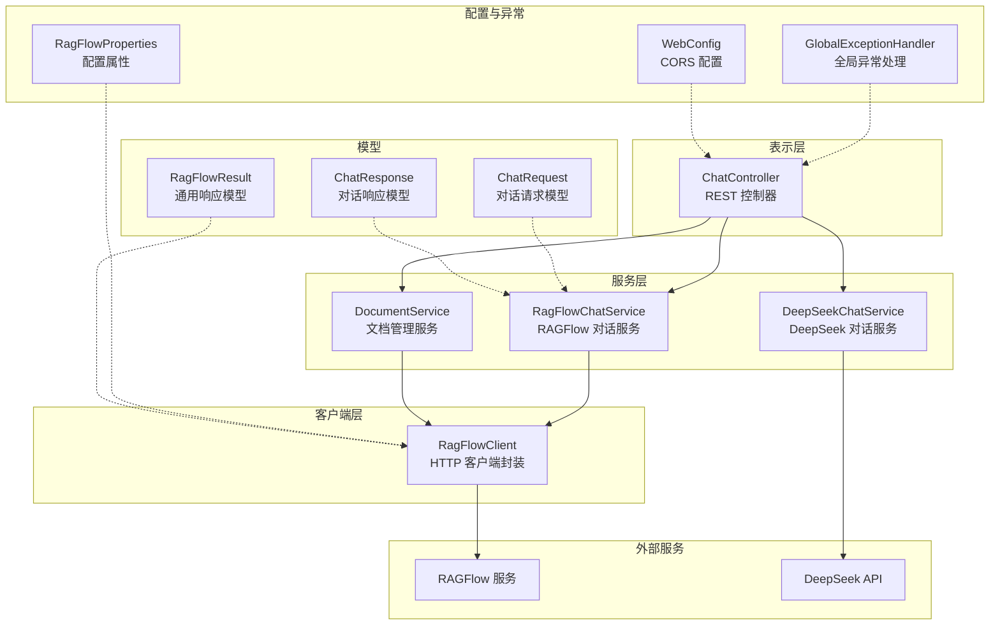
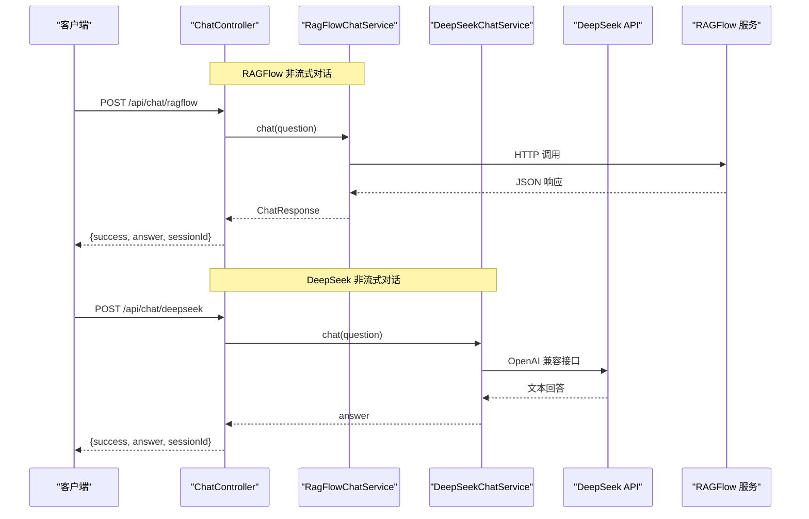
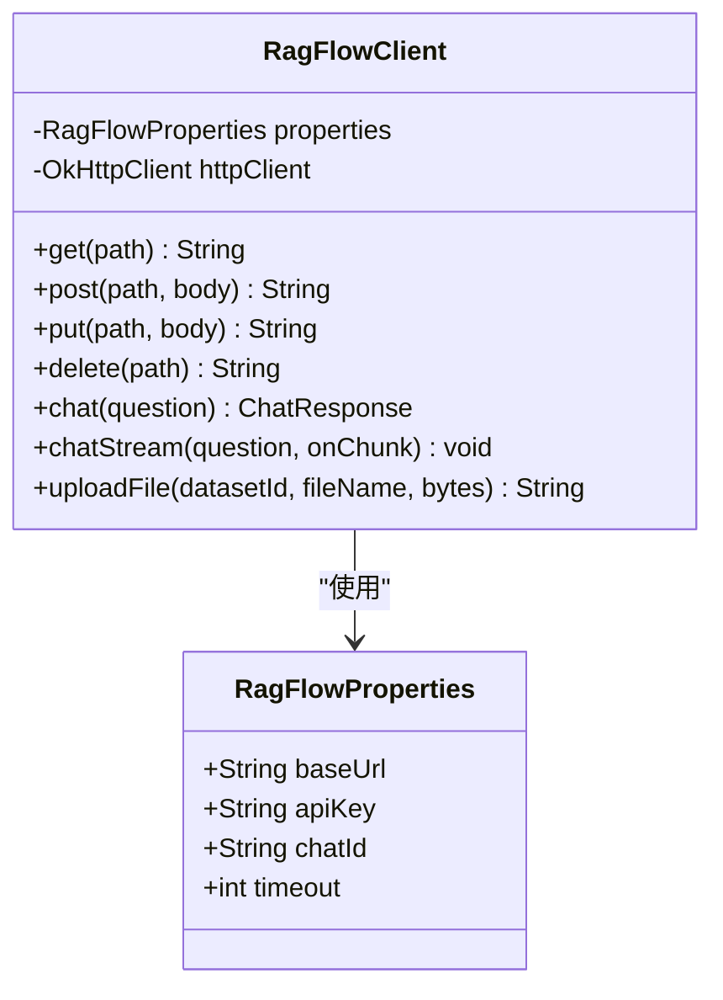
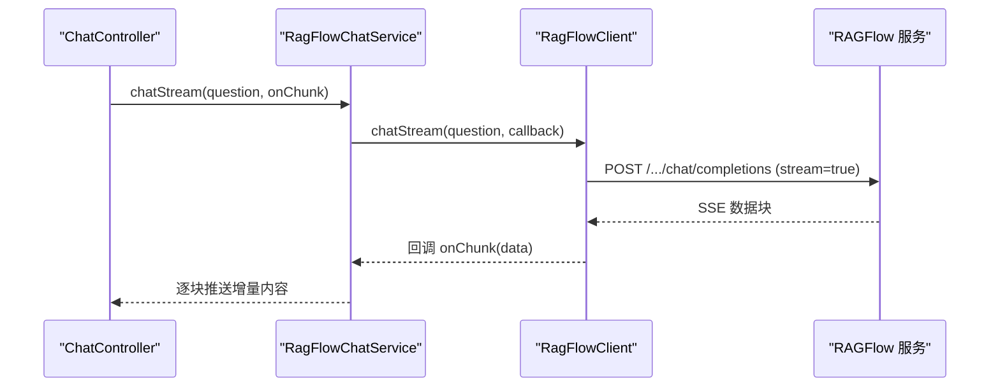
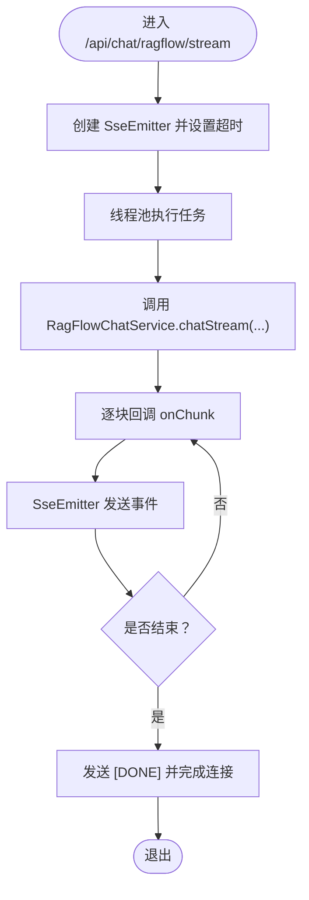
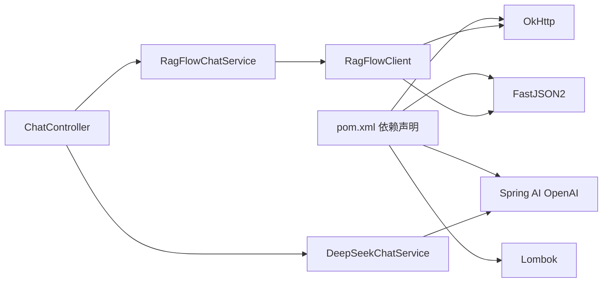

# 第三方服务集成

<cite>
**本文引用的文件**
- [RagFlowClient.java](file://src/main/java/org/wiki/client/RagFlowClient.java)
- [RagFlowProperties.java](file://src/main/java/org/wiki/config/RagFlowProperties.java)
- [RagFlowChatService.java](file://src/main/java/org/wiki/service/RagFlowChatService.java)
- [DeepSeekChatService.java](file://src/main/java/org/wiki/service/DeepSeekChatService.java)
- [DocumentService.java](file://src/main/java/org/wiki/service/DocumentService.java)
- [ChatController.java](file://src/main/java/org/wiki/controller/ChatController.java)
- [WebConfig.java](file://src/main/java/org/wiki/config/WebConfig.java)
- [GlobalExceptionHandler.java](file://src/main/java/org/wiki/config/GlobalExceptionHandler.java)
- [RagFlowResult.java](file://src/main/java/org/wiki/model/RagFlowResult.java)
- [ChatRequest.java](file://src/main/java/org/wiki/model/ChatRequest.java)
- [ChatResponse.java](file://src/main/java/org/wiki/model/ChatResponse.java)
- [application.yml](file://src/main/resources/application.yml)
- [pom.xml](file://pom.xml)
- [Dockerfile](file://Dockerfile)
- [docker-compose.yml](file://docker-compose.yml)
</cite>

## 目录
1. [简介](#简介)
2. [项目结构](#项目结构)
3. [核心组件](#核心组件)
4. [架构总览](#架构总览)
5. [详细组件分析](#详细组件分析)
6. [依赖分析](#依赖分析)
7. [性能考虑](#性能考虑)
8. [故障排查指南](#故障排查指南)
9. [结论](#结论)
10. [附录](#附录)

## 简介
本项目演示了如何在 Spring Boot 应用中集成第三方服务，重点围绕以下目标展开：
- 设计并实现一个通用的 HTTP 客户端封装（OkHttp），统一处理请求构建、认证头注入、超时配置与响应解析。
- 通过服务层抽象第三方 API 的业务能力，例如 RAGFlow 的知识库问答与文档管理、DeepSeek 的对话与流式输出。
- 提供异步调用、SSE 流式响应与批处理操作的实践范式。
- 展示如何通过配置文件与环境变量进行服务发现与负载均衡的替代方案（多实例部署与反向代理）。
- 给出集成测试与监控指标收集的建议路径。

## 项目结构
项目采用分层架构，按功能模块组织代码：
- client：第三方 HTTP 客户端封装
- config：配置类与全局异常处理
- controller：对外 HTTP 接口
- service：业务服务层，协调客户端与控制器
- model：数据传输对象与响应模型
- resources：应用配置与模板资源

图表来源
- [ChatController.java:1-276](file://src/main/java/org/wiki/controller/ChatController.java#L1-L276)
- [RagFlowChatService.java:1-84](file://src/main/java/org/wiki/service/RagFlowChatService.java#L1-L84)
- [DeepSeekChatService.java:1-125](file://src/main/java/org/wiki/service/DeepSeekChatService.java#L1-L125)
- [DocumentService.java:1-98](file://src/main/java/org/wiki/service/DocumentService.java#L1-L98)
- [RagFlowClient.java:1-231](file://src/main/java/org/wiki/client/RagFlowClient.java#L1-L231)
- [RagFlowProperties.java:1-32](file://src/main/java/org/wiki/config/RagFlowProperties.java#L1-L32)
- [GlobalExceptionHandler.java:1-46](file://src/main/java/org/wiki/config/GlobalExceptionHandler.java#L1-L46)
- [WebConfig.java:1-23](file://src/main/java/org/wiki/config/WebConfig.java#L1-L23)
- [ChatRequest.java:1-59](file://src/main/java/org/wiki/model/ChatRequest.java#L1-L59)
- [ChatResponse.java:1-52](file://src/main/java/org/wiki/model/ChatResponse.java#L1-L52)
- [RagFlowResult.java:1-25](file://src/main/java/org/wiki/model/RagFlowResult.java#L1-L25)

章节来源
- [ChatController.java:1-276](file://src/main/java/org/wiki/controller/ChatController.java#L1-L276)
- [RagFlowClient.java:1-231](file://src/main/java/org/wiki/client/RagFlowClient.java#L1-L231)
- [RagFlowProperties.java:1-32](file://src/main/java/org/wiki/config/RagFlowProperties.java#L1-L32)
- [RagFlowChatService.java:1-84](file://src/main/java/org/wiki/service/RagFlowChatService.java#L1-L84)
- [DeepSeekChatService.java:1-125](file://src/main/java/org/wiki/service/DeepSeekChatService.java#L1-L125)
- [DocumentService.java:1-98](file://src/main/java/org/wiki/service/DocumentService.java#L1-L98)
- [WebConfig.java:1-23](file://src/main/java/org/wiki/config/WebConfig.java#L1-L23)
- [GlobalExceptionHandler.java:1-46](file://src/main/java/org/wiki/config/GlobalExceptionHandler.java#L1-L46)
- [ChatRequest.java:1-59](file://src/main/java/org/wiki/model/ChatRequest.java#L1-L59)
- [ChatResponse.java:1-52](file://src/main/java/org/wiki/model/ChatResponse.java#L1-L52)
- [RagFlowResult.java:1-25](file://src/main/java/org/wiki/model/RagFlowResult.java#L1-L25)

## 核心组件
- HTTP 客户端封装（RagFlowClient）
  - 使用 OkHttp 构建通用的 GET/POST/PUT/DELETE 方法，自动注入认证头与 Content-Type。
  - 提供对话（非流式与流式）、文件上传等专用方法，内部统一处理响应体读取与错误抛出。
  - 关键实现参考：[RagFlowClient.java:28-231](file://src/main/java/org/wiki/client/RagFlowClient.java#L28-L231)

- 配置类（RagFlowProperties）
  - 通过 @ConfigurationProperties 绑定 ragflow.* 配置项，包括基础地址、API Key、聊天助手 ID、超时时间。
  - 关键实现参考：[RagFlowProperties.java:9-31](file://src/main/java/org/wiki/config/RagFlowProperties.java#L9-L31)

- 服务层（RagFlowChatService、DeepSeekChatService、DocumentService）
  - RagFlowChatService：封装 RAGFlow 对话能力，支持非流式与流式，负责日志记录与结果提取。
  - DeepSeekChatService：基于 Spring AI 的 ChatClient，支持纯对话、RAG 增强与流式输出。
  - DocumentService：封装文档上传、列表查询、删除与解析执行等操作。
  - 关键实现参考：
    - [RagFlowChatService.java:18-84](file://src/main/java/org/wiki/service/RagFlowChatService.java#L18-L84)
    - [DeepSeekChatService.java:22-125](file://src/main/java/org/wiki/service/DeepSeekChatService.java#L22-L125)
    - [DocumentService.java:21-98](file://src/main/java/org/wiki/service/DocumentService.java#L21-L98)

- 控制器（ChatController）
  - 提供 /api/chat 下的多种对话模式接口：RAGFlow 非流式、RAGFlow 流式（SSE）、DeepSeek 非流式、DeepSeek 流式、RAG 增强组合模式。
  - 使用线程池与 SSE 或 Reactor Flux 实现异步与流式输出。
  - 关键实现参考：[ChatController.java:30-276](file://src/main/java/org/wiki/controller/ChatController.java#L30-L276)

- 异常处理与跨域
  - GlobalExceptionHandler：统一捕获异常并返回标准化结构；针对 IO 异常映射为服务不可用。
  - WebConfig：配置 CORS，允许来自任意源的跨域访问。
  - 关键实现参考：
    - [GlobalExceptionHandler.java:17-46](file://src/main/java/org/wiki/config/GlobalExceptionHandler.java#L17-L46)
    - [WebConfig.java:11-23](file://src/main/java/org/wiki/config/WebConfig.java#L11-L23)

章节来源
- [RagFlowClient.java:28-231](file://src/main/java/org/wiki/client/RagFlowClient.java#L28-L231)
- [RagFlowProperties.java:9-31](file://src/main/java/org/wiki/config/RagFlowProperties.java#L9-L31)
- [RagFlowChatService.java:18-84](file://src/main/java/org/wiki/service/RagFlowChatService.java#L18-L84)
- [DeepSeekChatService.java:22-125](file://src/main/java/org/wiki/service/DeepSeekChatService.java#L22-L125)
- [DocumentService.java:21-98](file://src/main/java/org/wiki/service/DocumentService.java#L21-L98)
- [ChatController.java:30-276](file://src/main/java/org/wiki/controller/ChatController.java#L30-L276)
- [GlobalExceptionHandler.java:17-46](file://src/main/java/org/wiki/config/GlobalExceptionHandler.java#L17-L46)
- [WebConfig.java:11-23](file://src/main/java/org/wiki/config/WebConfig.java#L11-L23)

## 架构总览
系统通过控制器接收请求，服务层协调客户端或外部 API，客户端封装 HTTP 调用细节，配置类与异常处理贯穿各层。

图表来源
- [ChatController.java:51-137](file://src/main/java/org/wiki/controller/ChatController.java#L51-L137)
- [RagFlowChatService.java:34-41](file://src/main/java/org/wiki/service/RagFlowChatService.java#L34-L41)
- [DeepSeekChatService.java:36-44](file://src/main/java/org/wiki/service/DeepSeekChatService.java#L36-L44)
- [RagFlowClient.java:135-148](file://src/main/java/org/wiki/client/RagFlowClient.java#L135-L148)

## 详细组件分析

### HTTP 客户端封装（RagFlowClient）
- 设计要点
  - 单例 OkHttpClient，统一超时配置（连接、读、写）。
  - 通用请求方法自动注入 Authorization 与 Content-Type。
  - 对每个 API 调用进行日志记录与失败抛出，便于上层统一处理。
  - 提供专用方法：非流式对话、流式对话（SSE）、文件上传等。
- 错误处理
  - 对非成功状态码抛出 IOException，由上层服务或控制器捕获。
- 性能特性
  - 复用连接池，减少握手开销；超时合理设置避免阻塞。
- 扩展建议
  - 添加重试策略（指数退避）、熔断与限流。
  - 支持服务发现与负载均衡（多实例部署 + 反向代理）。

图表来源
- [RagFlowClient.java:23-35](file://src/main/java/org/wiki/client/RagFlowClient.java#L23-L35)
- [RagFlowProperties.java:10-31](file://src/main/java/org/wiki/config/RagFlowProperties.java#L10-L31)

章节来源
- [RagFlowClient.java:28-231](file://src/main/java/org/wiki/client/RagFlowClient.java#L28-L231)
- [RagFlowProperties.java:9-31](file://src/main/java/org/wiki/config/RagFlowProperties.java#L9-L31)

### 服务层（RagFlowChatService）
- 能力概述
  - 封装 RAGFlow 对话接口，支持非流式与流式两种模式。
  - 流式模式解析 SSE 数据块，提取增量内容与引用信息。
  - 提供答案提取工具方法，简化控制器逻辑。
- 异步与流式
  - 非流式：直接返回完整响应。
  - 流式：逐块推送增量内容，支持引用信息附加输出。
- 错误处理
  - 将底层异常向上抛出，由控制器或全局异常处理器统一处理。

图表来源
- [RagFlowChatService.java:50-72](file://src/main/java/org/wiki/service/RagFlowChatService.java#L50-L72)
- [RagFlowClient.java:154-200](file://src/main/java/org/wiki/client/RagFlowClient.java#L154-L200)

章节来源
- [RagFlowChatService.java:18-84](file://src/main/java/org/wiki/service/RagFlowChatService.java#L18-L84)
- [RagFlowClient.java:135-200](file://src/main/java/org/wiki/client/RagFlowClient.java#L135-L200)

### 服务层（DeepSeekChatService）
- 能力概述
  - 基于 Spring AI 的 ChatClient，兼容 OpenAI 接口风格。
  - 支持纯对话、RAG 增强（系统提示注入上下文）、流式输出。
- 流式输出
  - 使用 Flux<String> 提供原生流式响应，便于前端 SSE 或 WebSocket 接收。
- 扩展建议
  - 结合 RAGFlow 的检索结果动态构造系统提示，实现“检索增强生成”。

章节来源
- [DeepSeekChatService.java:22-125](file://src/main/java/org/wiki/service/DeepSeekChatService.java#L22-L125)

### 服务层（DocumentService）
- 能力概述
  - 文档上传（支持 MultipartFile 与本地文件路径）。
  - 文档列表查询、删除、解析/运行（触发解析流程）。
- 错误处理
  - 对第三方返回的 code 字段进行校验，非 0 时抛出 IOException。

章节来源
- [DocumentService.java:21-98](file://src/main/java/org/wiki/service/DocumentService.java#L21-L98)

### 控制器（ChatController）
- 能力概述
  - 提供四种对话模式：RAGFlow 非流式、RAGFlow 流式（SSE）、DeepSeek 非流式、DeepSeek 流式、RAG 增强组合模式。
  - 使用线程池与 SSE 或 Reactor Flux 实现异步与流式输出。
  - 对话历史管理：创建会话、添加消息、查询与清空历史。
- 异步与流式
  - RAGFlow 流式：使用 SseEmitter，后台线程消费流并推送事件。
  - DeepSeek 流式：使用 Spring AI 的 Flux，自动背压与订阅管理。
- 错误处理
  - 捕获 IO 异常并返回统一结构；全局异常处理器进一步兜底。

图表来源
- [ChatController.java:85-107](file://src/main/java/org/wiki/controller/ChatController.java#L85-L107)
- [RagFlowChatService.java:50-72](file://src/main/java/org/wiki/service/RagFlowChatService.java#L50-L72)

章节来源
- [ChatController.java:30-276](file://src/main/java/org/wiki/controller/ChatController.java#L30-L276)

### 配置与异常处理
- 配置
  - application.yml：定义服务端口、Spring AI OpenAI 配置（兼容 DeepSeek）、RAGFlow 配置与日志级别。
  - docker-compose.yml：容器化部署，暴露端口并注入环境变量。
  - Dockerfile：多阶段构建，生产镜像精简。
- 异常处理
  - 全局异常处理器统一返回 {success, message} 结构；IO 异常映射为服务不可用。
  - CORS：允许任意源跨域访问，便于前端调试。

章节来源
- [application.yml:1-27](file://src/main/resources/application.yml#L1-L27)
- [docker-compose.yml:1-20](file://docker-compose.yml#L1-L20)
- [Dockerfile:1-15](file://Dockerfile#L1-L15)
- [GlobalExceptionHandler.java:17-46](file://src/main/java/org/wiki/config/GlobalExceptionHandler.java#L17-L46)
- [WebConfig.java:11-23](file://src/main/java/org/wiki/config/WebConfig.java#L11-L23)

## 依赖分析
- 外部依赖
  - OkHttp 与 OkHttp SSE：用于 HTTP 调用与 SSE 流式处理。
  - Spring AI OpenAI Starter：提供 ChatClient，兼容 OpenAI/DeepSeek 接口。
  - FastJSON2：JSON 解析与序列化。
  - Lombok：简化 POJO 与日志注解。
- 内部耦合
  - 控制器依赖服务层；服务层依赖客户端或外部 API；客户端依赖配置类。
  - 异常处理与跨域配置横切各层。

图表来源
- [pom.xml:25-88](file://pom.xml#L25-L88)
- [ChatController.java:32-41](file://src/main/java/org/wiki/controller/ChatController.java#L32-L41)
- [RagFlowChatService.java:20-24](file://src/main/java/org/wiki/service/RagFlowChatService.java#L20-L24)
- [DeepSeekChatService.java:24-28](file://src/main/java/org/wiki/service/DeepSeekChatService.java#L24-L28)
- [RagFlowClient.java:26-35](file://src/main/java/org/wiki/client/RagFlowClient.java#L26-L35)

章节来源
- [pom.xml:15-102](file://pom.xml#L15-L102)

## 性能考虑
- 连接复用与超时
  - OkHttp 复用连接池，建议根据 QPS 调整连接数与超时时间，避免阻塞。
- 流式输出
  - SSE 与 Reactor Flux 均支持背压与异步推送，降低内存占用。
- 日志与监控
  - 当前已启用 DEBUG 级别日志，建议结合 APM 工具采集请求耗时、错误率与吞吐量。
- 缓存与批处理
  - 对频繁查询的元数据可引入本地缓存；对批量上传可合并请求或分片处理。

## 故障排查指南
- 常见问题
  - 认证失败：检查 API Key 与基础地址配置是否正确。
  - 超时异常：调整超时时间或优化上游服务性能。
  - IO 异常：查看全局异常处理器返回的错误信息，定位具体上游调用失败点。
- 排查步骤
  - 检查 application.yml 与 docker-compose 环境变量是否一致。
  - 查看控制器与服务层日志，确认调用链路与参数传递。
  - 使用 Postman 或 curl 直连第三方服务验证接口可用性。

章节来源
- [GlobalExceptionHandler.java:37-44](file://src/main/java/org/wiki/config/GlobalExceptionHandler.java#L37-L44)
- [application.yml:17-27](file://src/main/resources/application.yml#L17-L27)
- [docker-compose.yml:11-17](file://docker-compose.yml#L11-L17)

## 结论
本项目提供了在 Spring 生态中集成第三方服务的完整范式：通过客户端封装统一 HTTP 调用，服务层抽象业务能力，控制器提供 REST 接口与流式输出。结合配置与异常处理，形成可扩展、可观测且易维护的集成体系。后续可在客户端层引入重试、熔断与限流，在服务层增加缓存与批处理，并通过 APM 工具完善监控指标。

## 附录

### 如何创建新的客户端类来集成不同 API 服务
- 步骤
  - 定义配置类（@ConfigurationProperties）绑定服务地址、密钥与超时。
  - 编写客户端类，封装通用请求方法与业务专用方法，注入配置类与 JSON 工具。
  - 在服务层注入客户端，实现业务逻辑与错误处理。
  - 在控制器中新增接口，调用服务层方法。
- 参考路径
  - [RagFlowProperties.java:9-31](file://src/main/java/org/wiki/config/RagFlowProperties.java#L9-L31)
  - [RagFlowClient.java:28-231](file://src/main/java/org/wiki/client/RagFlowClient.java#L28-L231)
  - [RagFlowChatService.java:18-84](file://src/main/java/org/wiki/service/RagFlowChatService.java#L18-L84)

### 认证机制、错误处理与重试策略
- 认证机制
  - 在客户端统一注入 Authorization 头（如 Bearer Token）。
- 错误处理
  - 客户端对非成功状态码抛出异常；服务层捕获并转换为业务异常；控制器与全局异常处理器统一返回。
- 重试策略
  - 建议在客户端层引入指数退避重试（对 5xx、网络超时等场景），并限制最大重试次数与总等待时间。

章节来源
- [RagFlowClient.java:40-104](file://src/main/java/org/wiki/client/RagFlowClient.java#L40-L104)
- [RagFlowChatService.java:34-72](file://src/main/java/org/wiki/service/RagFlowChatService.java#L34-L72)
- [GlobalExceptionHandler.java:20-44](file://src/main/java/org/wiki/config/GlobalExceptionHandler.java#L20-L44)

### 异步调用、流式响应与批量操作
- 异步调用
  - 使用线程池执行耗时任务，避免阻塞主线程。
- 流式响应
  - RAGFlow：SSE 流式推送；DeepSeek：Spring AI Flux 流式输出。
- 批量操作
  - 对文档上传与解析可设计批量接口，合并请求或分片处理，提升吞吐量。

章节来源
- [ChatController.java:85-107](file://src/main/java/org/wiki/controller/ChatController.java#L85-L107)
- [ChatController.java:223-274](file://src/main/java/org/wiki/controller/ChatController.java#L223-L274)
- [DocumentService.java:33-96](file://src/main/java/org/wiki/service/DocumentService.java#L33-L96)

### 服务发现与负载均衡机制
- 说明
  - 本项目通过环境变量与配置文件指定服务地址；若需高可用，可在网关层或反向代理层实现多实例负载均衡与健康检查。
- 建议
  - 使用 Nginx/Envoy/Ingress 等实现服务发现与轮询/加权轮询策略。

章节来源
- [application.yml:17-22](file://src/main/resources/application.yml#L17-L22)
- [docker-compose.yml:11-17](file://docker-compose.yml#L11-L17)

### 集成测试的编写方法与监控指标收集策略
- 集成测试
  - 使用 Spring Boot Test 与 Mock 机制，模拟第三方服务响应，覆盖正常与异常分支。
- 监控指标
  - 请求延迟、成功率、错误分布、并发数、重试次数；结合 APM 工具采集并可视化。

[本节为通用实践建议，不直接分析具体文件]