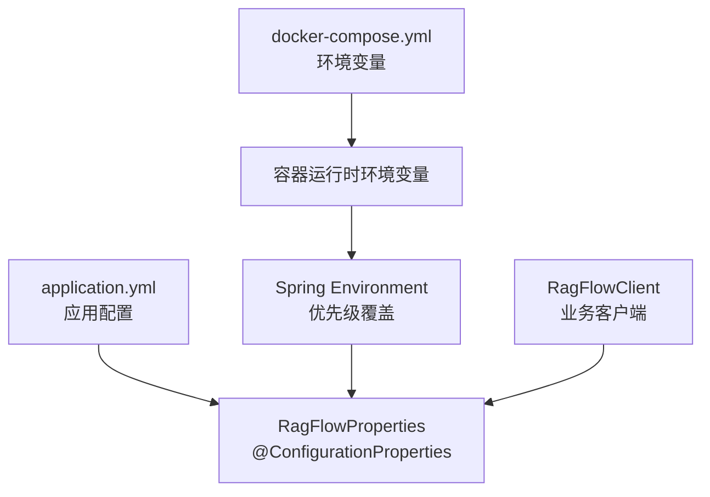
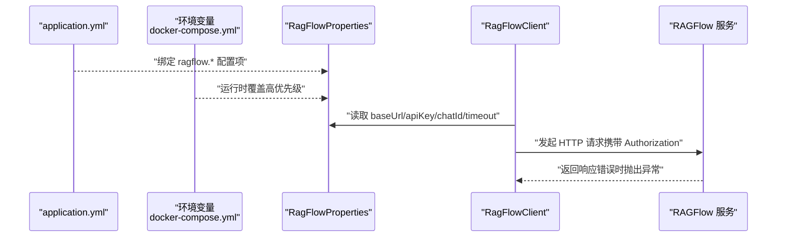
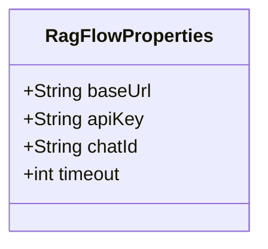
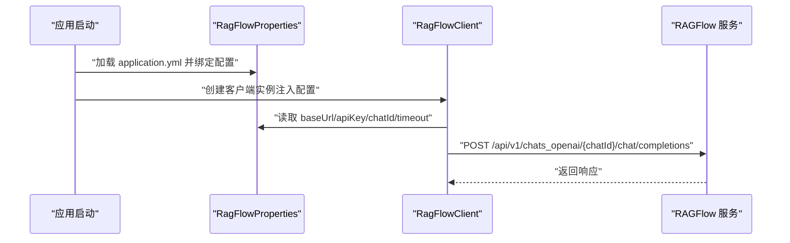
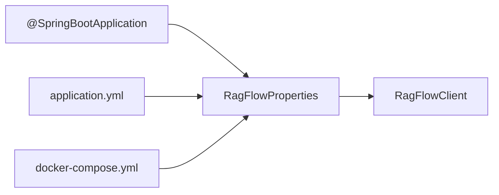

# 配置扩展

<cite>
**本文引用的文件列表**
- [RagFlowProperties.java](file://src/main/java/org/wiki/config/RagFlowProperties.java)
- [application.yml](file://src/main/resources/application.yml)
- [WebConfig.java](file://src/main/java/org/wiki/config/WebConfig.java)
- [GlobalExceptionHandler.java](file://src/main/java/org/wiki/config/GlobalExceptionHandler.java)
- [RagFlowClient.java](file://src/main/java/org/wiki/client/RagFlowClient.java)
- [DeepSeekRagFlowApplication.java](file://src/main/java/org/wiki/DeepSeekRagFlowApplication.java)
- [pom.xml](file://pom.xml)
- [docker-compose.yml](file://docker-compose.yml)
- [Dockerfile](file://Dockerfile)
</cite>

## 目录
1. [简介](#简介)
2. [项目结构与配置位置](#项目结构与配置位置)
3. [核心配置组件](#核心配置组件)
4. [架构总览](#架构总览)
5. [详细组件分析](#详细组件分析)
6. [依赖关系分析](#依赖关系分析)
7. [性能与可维护性考虑](#性能与可维护性考虑)
8. [故障排查指南](#故障排查指南)
9. [结论](#结论)
10. [附录：新增配置属性与类的步骤清单](#附录新增配置属性与类的步骤清单)

## 简介
本文件面向开发者，系统化讲解如何在现有项目中扩展配置能力，重点围绕以下目标：
- 如何使用 @ConfigurationProperties 创建自定义配置类
- 属性命名规范、默认值设置与验证策略
- 在 application.yml 中扩展配置项以及环境变量覆盖机制
- 配置类的单元测试方法与配置验证策略
- 动态配置更新与配置热加载机制的实现建议
- 配置安全性与配置文档化的最佳实践

本项目以 RagFlowProperties 为核心配置类，结合 application.yml 与 docker-compose 的环境变量覆盖，展示了从静态配置到容器化部署的完整配置链路。

## 项目结构与配置位置
- 配置类位于 config 包，采用标准的 Spring Boot 配置类组织方式
- 应用级配置集中于 application.yml
- 容器化部署通过 docker-compose 注入环境变量，实现运行时覆盖
- 客户端通过注入的配置类读取参数，完成对外部服务的调用

图表来源
- [application.yml:1-27](file://src/main/resources/application.yml#L1-L27)
- [RagFlowProperties.java:1-32](file://src/main/java/org/wiki/config/RagFlowProperties.java#L1-L32)
- [docker-compose.yml:1-20](file://docker-compose.yml#L1-L20)

章节来源
- [application.yml:1-27](file://src/main/resources/application.yml#L1-L27)
- [RagFlowProperties.java:1-32](file://src/main/java/org/wiki/config/RagFlowProperties.java#L1-L32)
- [docker-compose.yml:1-20](file://docker-compose.yml#L1-L20)

## 核心配置组件
- 配置类：RagFlowProperties
  - 作用：承载 ragflow 前缀下的所有配置项，包括服务地址、API Key、聊天助手 ID、请求超时等
  - 默认值：为关键字段提供了合理的默认值，降低首次使用门槛
  - 绑定：通过 @ConfigurationProperties(prefix = "ragflow") 自动绑定 application.yml 中的 ragflow.* 键值
- 配置文件：application.yml
  - 位置：resources 下
  - 内容：包含 ragflow 分组及其子项，同时包含其他模块配置（如 spring.ai.openai）
- 环境变量覆盖：docker-compose.yml
  - 通过环境变量对配置进行运行时覆盖，便于不同环境切换
- 客户端使用：RagFlowClient
  - 通过构造注入获取配置实例，按需读取配置并发起外部 API 调用

章节来源
- [RagFlowProperties.java:1-32](file://src/main/java/org/wiki/config/RagFlowProperties.java#L1-L32)
- [application.yml:17-22](file://src/main/resources/application.yml#L17-L22)
- [docker-compose.yml:11-16](file://docker-compose.yml#L11-L16)
- [RagFlowClient.java:25-35](file://src/main/java/org/wiki/client/RagFlowClient.java#L25-L35)

## 架构总览
下图展示配置从定义到使用的整体流程，以及环境变量覆盖的优先级关系。

图表来源
- [application.yml:17-22](file://src/main/resources/application.yml#L17-L22)
- [docker-compose.yml:11-16](file://docker-compose.yml#L11-L16)
- [RagFlowProperties.java:10-31](file://src/main/java/org/wiki/config/RagFlowProperties.java#L10-L31)
- [RagFlowClient.java:40-82](file://src/main/java/org/wiki/client/RagFlowClient.java#L40-L82)

## 详细组件分析

### 配置类：RagFlowProperties
- 设计要点
  - 使用 @ConfigurationProperties(prefix = "ragflow") 将 application.yml 中 ragflow.* 的键值自动映射到类字段
  - 字段具备默认值，减少首次配置成本
  - 通过 Lombok 的 @Data 提供 getter/setter，便于在客户端中直接读取
- 字段与默认值
  - baseUrl：默认本地服务地址
  - apiKey：敏感信息，建议通过环境变量覆盖
  - chatId：业务标识，建议通过环境变量覆盖
  - timeout：请求超时，单位秒，默认值合理
- 扩展建议
  - 新增字段时遵循驼峰命名与 yml 键一致的原则
  - 对关键字段提供合理的默认值
  - 对必填字段建议增加校验注解（见“验证策略”）

图表来源
- [RagFlowProperties.java:10-31](file://src/main/java/org/wiki/config/RagFlowProperties.java#L10-L31)

章节来源
- [RagFlowProperties.java:1-32](file://src/main/java/org/wiki/config/RagFlowProperties.java#L1-L32)

### 配置文件：application.yml
- 结构与分组
  - server.port：服务端口
  - spring.application.name：应用名
  - spring.ai.openai.*：OpenAI 兼容模型配置（DeepSeek）
  - ragflow.*：RAGFlow 配置分组
  - logging.level：日志级别
- 扩展方法
  - 在 ragflow 分组下新增键值即可扩展配置
  - 新增字段后，确保配置类对应字段存在且命名一致
- 注意事项
  - 敏感信息不建议写入版本控制文件，应通过环境变量覆盖

章节来源
- [application.yml:1-27](file://src/main/resources/application.yml#L1-L27)

### 环境变量覆盖：docker-compose.yml
- 覆盖范围
  - SPRING_AI_OPENAI_API_KEY、SPRING_AI_OPENAI_BASE_URL：OpenAI 兼容配置
  - RAGFLOW_BASE_URL、RAGFLOW_API_KEY、RAGFLOW_CHAT_ID：RAGFlow 配置
- 覆盖优先级
  - 运行时环境变量优先级高于 application.yml
  - 可通过 docker-compose 的环境变量列表灵活切换不同环境

章节来源
- [docker-compose.yml:11-16](file://docker-compose.yml#L11-L16)

### 客户端使用：RagFlowClient
- 依赖注入
  - 通过构造函数注入 RagFlowProperties，避免硬编码
- 参数使用
  - 读取 baseUrl、apiKey、chatId、timeout 等参数
  - 在 HTTP 请求头中携带 Authorization: Bearer {apiKey}
- 异常处理
  - 对外部服务调用失败抛出 IOException，由全局异常处理器统一处理

图表来源
- [RagFlowClient.java:25-35](file://src/main/java/org/wiki/client/RagFlowClient.java#L25-L35)
- [RagFlowClient.java:135-148](file://src/main/java/org/wiki/client/RagFlowClient.java#L135-L148)
- [RagFlowProperties.java:10-31](file://src/main/java/org/wiki/config/RagFlowProperties.java#L10-L31)

章节来源
- [RagFlowClient.java:1-231](file://src/main/java/org/wiki/client/RagFlowClient.java#L1-L231)

### Web 配置与跨域
- WebConfig 提供了基础的跨域配置，便于前端访问后端 API
- 该配置与配置扩展无直接耦合，但影响客户端调用体验

章节来源
- [WebConfig.java:1-23](file://src/main/java/org/wiki/config/WebConfig.java#L1-L23)

### 全局异常处理
- GlobalExceptionHandler 对异常进行统一处理，区分不同异常类型并返回标准化响应
- 对 IO 异常（通常来自外部服务调用失败）返回特定提示，便于定位问题

章节来源
- [GlobalExceptionHandler.java:1-46](file://src/main/java/org/wiki/config/GlobalExceptionHandler.java#L1-L46)

## 依赖关系分析
- 配置类与客户端
  - RagFlowClient 依赖 RagFlowProperties，形成“配置驱动行为”的清晰边界
- 配置来源
  - application.yml 提供默认配置
  - docker-compose 的环境变量在运行时覆盖默认配置
- 依赖注入与生命周期
  - @SpringBootApplication 启动应用，自动扫描配置类与组件
  - 客户端作为组件被 Spring 容器管理，注入配置类

图表来源
- [DeepSeekRagFlowApplication.java:6-11](file://src/main/java/org/wiki/DeepSeekRagFlowApplication.java#L6-L11)
- [RagFlowProperties.java:7-9](file://src/main/java/org/wiki/config/RagFlowProperties.java#L7-L9)
- [RagFlowClient.java:25-35](file://src/main/java/org/wiki/client/RagFlowClient.java#L25-L35)
- [application.yml:17-22](file://src/main/resources/application.yml#L17-L22)
- [docker-compose.yml:11-16](file://docker-compose.yml#L11-L16)

章节来源
- [DeepSeekRagFlowApplication.java:1-12](file://src/main/java/org/wiki/DeepSeekRagFlowApplication.java#L1-L12)
- [pom.xml:25-88](file://pom.xml#L25-L88)

## 性能与可维护性考虑
- 配置读取开销
  - 配置类为单例，读取字段为简单内存访问，开销极低
- 超时与连接池
  - 客户端基于 OkHttp，超时与连接池参数可在配置类中扩展，以提升稳定性
- 日志与可观测性
  - 建议在配置类中增加日志开关或级别字段，便于调试与生产监控

[本节为通用建议，无需特定文件引用]

## 故障排查指南
- 外部服务调用失败
  - 现象：客户端抛出 IO 异常，全局异常处理器返回服务不可用
  - 排查：检查 RAGFlow 服务地址、API Key、聊天助手 ID 是否正确；确认网络连通性
- 认证失败
  - 现象：异常消息包含 Unauthorized
  - 排查：确认 API Key 是否有效、是否被正确注入到配置中
- 超时问题
  - 现象：请求超时
  - 排查：适当增大 timeout；检查外部服务响应速度

章节来源
- [GlobalExceptionHandler.java:37-44](file://src/main/java/org/wiki/config/GlobalExceptionHandler.java#L37-L44)
- [RagFlowClient.java:40-57](file://src/main/java/org/wiki/client/RagFlowClient.java#L40-L57)

## 结论
本项目通过 @ConfigurationProperties 将配置与代码解耦，配合 application.yml 与 docker-compose 的环境变量覆盖，实现了从开发到生产的灵活配置管理。建议在新增配置时遵循命名规范、提供默认值、使用环境变量覆盖敏感信息，并通过单元测试与异常处理保障配置的健壮性。

[本节为总结，无需特定文件引用]

## 附录：新增配置属性与类的步骤清单

- 步骤一：创建配置类
  - 在 config 包下新建类，使用 @Configuration 与 @ConfigurationProperties(prefix = "your-prefix")
  - 为每个字段提供合理的默认值
  - 使用 Lombok 的 @Data 简化 getter/setter
  - 参考路径：[RagFlowProperties.java:7-9](file://src/main/java/org/wiki/config/RagFlowProperties.java#L7-L9)

- 步骤二：在 application.yml 中添加配置项
  - 在对应前缀下新增键值，保持与类字段一致的命名
  - 参考路径：[application.yml:17-22](file://src/main/resources/application.yml#L17-L22)

- 步骤三：通过环境变量覆盖（可选）
  - 在 docker-compose.yml 中设置环境变量，实现运行时覆盖
  - 参考路径：[docker-compose.yml:11-16](file://docker-compose.yml#L11-L16)

- 步骤四：在客户端中使用配置
  - 通过构造函数注入配置类，读取所需字段
  - 参考路径：[RagFlowClient.java:25-35](file://src/main/java/org/wiki/client/RagFlowClient.java#L25-L35)

- 步骤五：验证与测试
  - 单元测试：使用 @TestPropertySource 或 @Import 机制加载自定义配置，断言字段值
  - 集成测试：通过 application.yml 与环境变量组合验证覆盖逻辑
  - 参考依赖声明：[pom.xml:82-88](file://pom.xml#L82-L88)

- 步骤六：动态配置更新与热加载（建议）
  - 使用 @RefreshScope（Spring Cloud Config）或 @EventListener 监听配置变更事件
  - 对于客户端连接池、超时等参数，建议在配置变更时重建客户端实例
  - 参考依赖：Spring Cloud Config Starter（如引入）

- 步骤七：安全与文档化
  - 敏感信息（API Key）必须通过环境变量注入，不在版本控制中出现
  - 为配置类字段添加注释，说明用途与默认值
  - 在 README 或配置文档中列出所有可配置项及示例

[本节为操作清单，已在各步骤中给出参考路径]