# API 响应模型

<cite>
**本文档引用的文件**
- [ChatResponse.java](file://src/main/java/org/wiki/model/ChatResponse.java)
- [RagFlowResult.java](file://src/main/java/org/wiki/model/RagFlowResult.java)
- [ChatChunk.java](file://src/main/java/org/wiki/model/ChatChunk.java)
- [ChatMessage.java](file://src/main/java/org/wiki/model/ChatMessage.java)
- [ChatController.java](file://src/main/java/org/wiki/controller/ChatController.java)
- [RagFlowChatService.java](file://src/main/java/org/wiki/service/RagFlowChatService.java)
- [DeepSeekChatService.java](file://src/main/java/org/wiki/service/DeepSeekChatService.java)
- [RagFlowClient.java](file://src/main/java/org/wiki/client/RagFlowClient.java)
- [GlobalExceptionHandler.java](file://src/main/java/org/wiki/config/GlobalExceptionHandler.java)
- [application.yml](file://src/main/resources/application.yml)
- [ChatRequest.java](file://src/main/java/org/wiki/model/ChatRequest.java)
- [RagFlowProperties.java](file://src/main/java/org/wiki/config/RagFlowProperties.java)
- [ChatHistoryService.java](file://src/main/java/org/wiki/service/ChatHistoryService.java)
</cite>

## 目录
1. [简介](#简介)
2. [项目结构](#项目结构)
3. [核心组件](#核心组件)
4. [架构概览](#架构概览)
5. [详细组件分析](#详细组件分析)
6. [依赖关系分析](#依赖关系分析)
7. [性能考虑](#性能考虑)
8. [故障排除指南](#故障排除指南)
9. [结论](#结论)

## 简介

本项目是一个基于 Spring Boot 的 AI 对话系统，集成了 RAGFlow 和 DeepSeek 两大 AI 服务。本文档专注于 API 响应模型的设计与实现，详细说明了 ChatResponse 模型、RagFlowResult 模型以及流式响应机制的实现方式。

系统支持三种对话模式：
- **RAGFlow 模式**：通过 RAGFlow 服务进行知识库问答
- **DeepSeek 模式**：直接调用 DeepSeek API 进行对话  
- **DeepSeek + RAG 增强模式**：先检索后生成的混合对话模式

## 项目结构

项目采用标准的 Spring Boot 分层架构，主要目录结构如下：

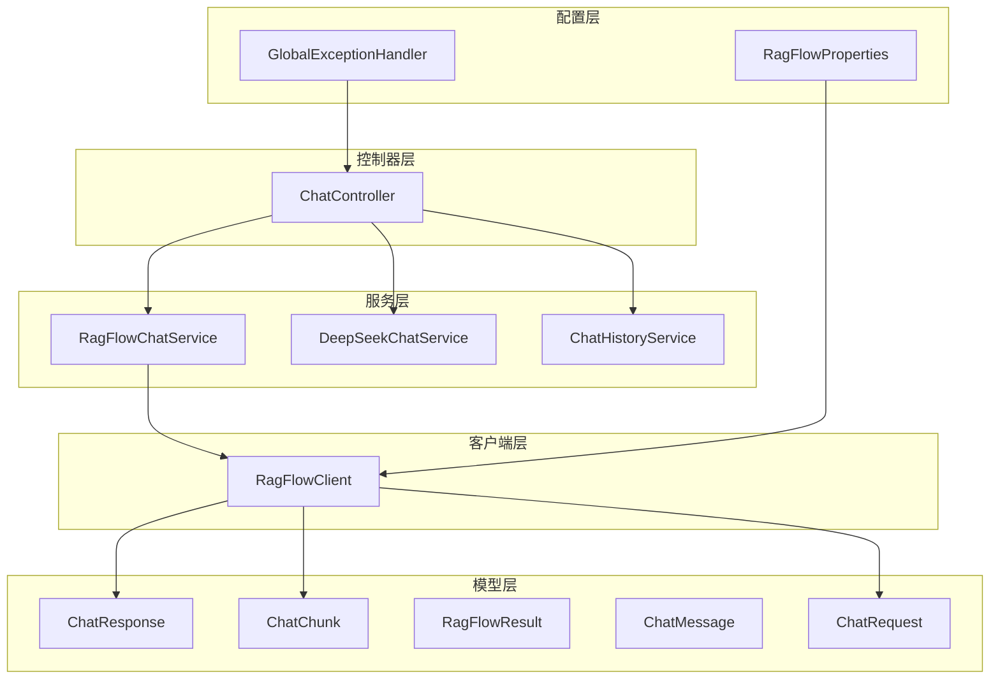

**图表来源**
- [ChatController.java:1-276](file://src/main/java/org/wiki/controller/ChatController.java#L1-276)
- [RagFlowChatService.java:1-84](file://src/main/java/org/wiki/service/RagFlowChatService.java#L1-84)
- [DeepSeekChatService.java:1-125](file://src/main/java/org/wiki/service/DeepSeekChatService.java#L1-125)
- [RagFlowClient.java:1-231](file://src/main/java/org/wiki/client/RagFlowClient.java#L1-231)

**章节来源**
- [ChatController.java:1-276](file://src/main/java/org/wiki/controller/ChatController.java#L1-276)
- [application.yml:1-27](file://src/main/resources/application.yml#L1-27)

## 核心组件

### ChatResponse 模型

ChatResponse 是 RAGFlow 对话的非流式响应模型，遵循 OpenAI 兼容的响应格式设计。

#### 主要结构

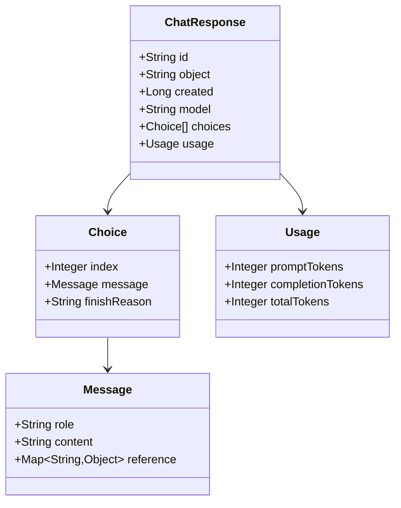

**图表来源**
- [ChatResponse.java:16-51](file://src/main/java/org/wiki/model/ChatResponse.java#L16-L51)

#### 字段说明

| 字段名 | 类型 | 必填 | 描述 |
|--------|------|------|------|
| id | String | 是 | 响应唯一标识符 |
| object | String | 是 | 对象类型标识 |
| created | Long | 是 | 创建时间戳 |
| model | String | 是 | 使用的模型名称 |
| choices | List<Choice> | 是 | 响应选择列表 |
| usage | Usage | 是 | Token 使用统计 |

#### Choice 子结构

| 字段名 | 类型 | 必填 | 描述 |
|--------|------|------|------|
| index | Integer | 是 | 选择索引 |
| message | Message | 是 | 实际回复内容 |
| finishReason | String | 否 | 结束原因 |

#### Message 子结构

| 字段名 | 类型 | 必填 | 描述 |
|--------|------|------|------|
| role | String | 是 | 角色标识（user/assistant） |
| content | String | 是 | 文本内容 |
| reference | Map<String,Object> | 否 | 引用信息 |

#### Usage 统计结构

| 字段名 | 类型 | 必填 | 描述 |
|--------|------|------|------|
| promptTokens | Integer | 是 | 提示词 Token 数量 |
| completionTokens | Integer | 是 | 补全 Token 数量 |
| totalTokens | Integer | 是 | 总 Token 数量 |

**章节来源**
- [ChatResponse.java:10-51](file://src/main/java/org/wiki/model/ChatResponse.java#L10-L51)

### ChatChunk 模型

ChatChunk 是流式响应的数据块模型，用于 SSE（Server-Sent Events）协议传输。

#### 主要结构

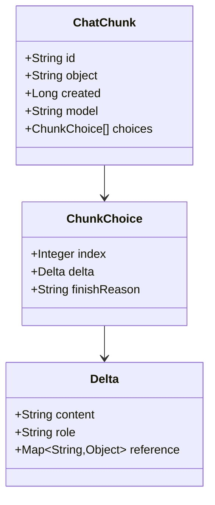

**图表来源**
- [ChatChunk.java:16-41](file://src/main/java/org/wiki/model/ChatChunk.java#L16-L41)

#### 字段说明

| 字段名 | 类型 | 必填 | 描述 |
|--------|------|------|------|
| id | String | 是 | 响应唯一标识符 |
| object | String | 是 | 对象类型标识 |
| created | Long | 是 | 创建时间戳 |
| model | String | 是 | 使用的模型名称 |
| choices | List<ChunkChoice> | 是 | 流式选择列表 |

#### Delta 子结构

| 字段名 | 类型 | 必填 | 描述 |
|--------|------|------|------|
| content | String | 否 | 新增的文本内容 |
| role | String | 否 | 角色标识 |
| reference | Map<String,Object> | 否 | 引用信息 |

**章节来源**
- [ChatChunk.java:10-41](file://src/main/java/org/wiki/model/ChatChunk.java#L10-L41)

### RagFlowResult 模型

RagFlowResult 是系统的通用响应包装器，提供统一的响应格式。

#### 结构定义

```mermaid
classDiagram
class RagFlowResult~T~ {
+Integer code
+String message
+T data
+isSuccess() boolean
}
note for RagFlowResult : "泛型 T 代表具体的数据类型"
```

**图表来源**
- [RagFlowResult.java:15-24](file://src/main/java/org/wiki/model/RagFlowResult.java#L15-L24)

#### 字段说明

| 字段名 | 类型 | 必填 | 描述 |
|--------|------|------|------|
| code | Integer | 是 | 响应状态码 |
| message | String | 是 | 响应消息 |
| data | T | 否 | 泛型数据对象 |

#### 状态判断

```java
public boolean isSuccess() {
    return code != null && code == 0;
}
```

**章节来源**
- [RagFlowResult.java:8-24](file://src/main/java/org/wiki/model/RagFlowResult.java#L8-L24)

### ChatMessage 模型

ChatMessage 用于会话历史管理，支持三种对话模式。

#### 结构定义

```mermaid
classDiagram
class ChatMessage {
+String id
+String sessionId
+String role
+String content
+String mode
+String reference
+LocalDateTime createdAt
+userMessage(sessionId, content, mode) ChatMessage
+assistantMessage(sessionId, content, mode) ChatMessage
}
note for ChatMessage : "role : user/assistant<br/>mode : ragflow/deepseek/rag"
```

**图表来源**
- [ChatMessage.java:17-81](file://src/main/java/org/wiki/model/ChatMessage.java#L17-L81)

#### 字段说明

| 字段名 | 类型 | 必填 | 描述 |
|--------|------|------|------|
| id | String | 是 | 消息唯一标识 |
| sessionId | String | 是 | 会话标识 |
| role | String | 是 | 角色标识 |
| content | String | 是 | 消息内容 |
| mode | String | 是 | 对话模式 |
| reference | String | 否 | 引用信息 |
| createdAt | LocalDateTime | 是 | 创建时间 |

**章节来源**
- [ChatMessage.java:10-81](file://src/main/java/org/wiki/model/ChatMessage.java#L10-L81)

## 架构概览

系统采用分层架构设计，实现了完整的 AI 对话服务：

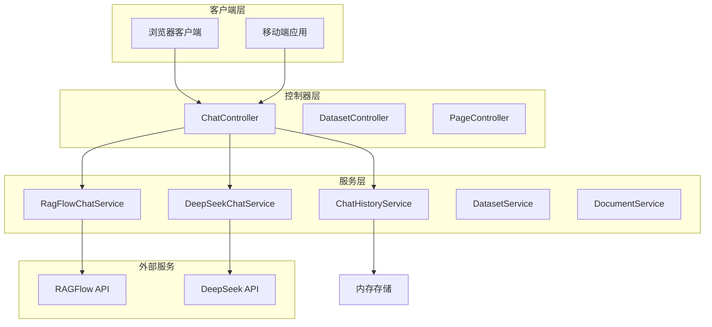

**图表来源**
- [ChatController.java:27-41](file://src/main/java/org/wiki/controller/ChatController.java#L27-L41)
- [RagFlowChatService.java:18-24](file://src/main/java/org/wiki/service/RagFlowChatService.java#L18-L24)
- [DeepSeekChatService.java:22-28](file://src/main/java/org/wiki/service/DeepSeekChatService.java#L22-L28)

## 详细组件分析

### 流式响应实现机制

系统支持两种流式响应实现方式：

#### 1. RAGFlow 流式响应（SSE）

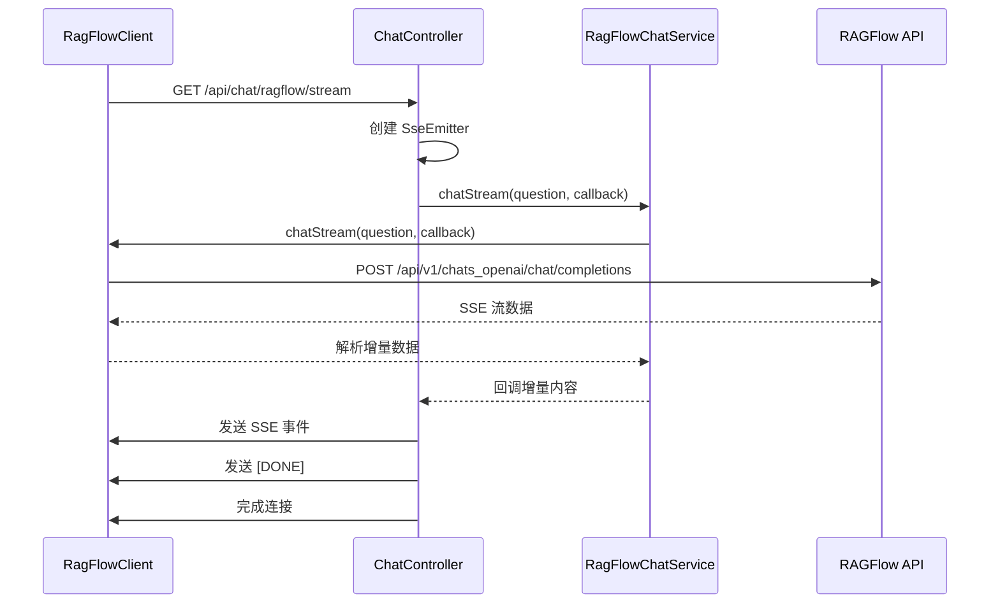

**图表来源**
- [ChatController.java:85-107](file://src/main/java/org/wiki/controller/ChatController.java#L85-L107)
- [RagFlowChatService.java:50-72](file://src/main/java/org/wiki/service/RagFlowChatService.java#L50-L72)
- [RagFlowClient.java:154-200](file://src/main/java/org/wiki/client/RagFlowClient.java#L154-L200)

#### 2. DeepSeek 流式响应（Spring AI）

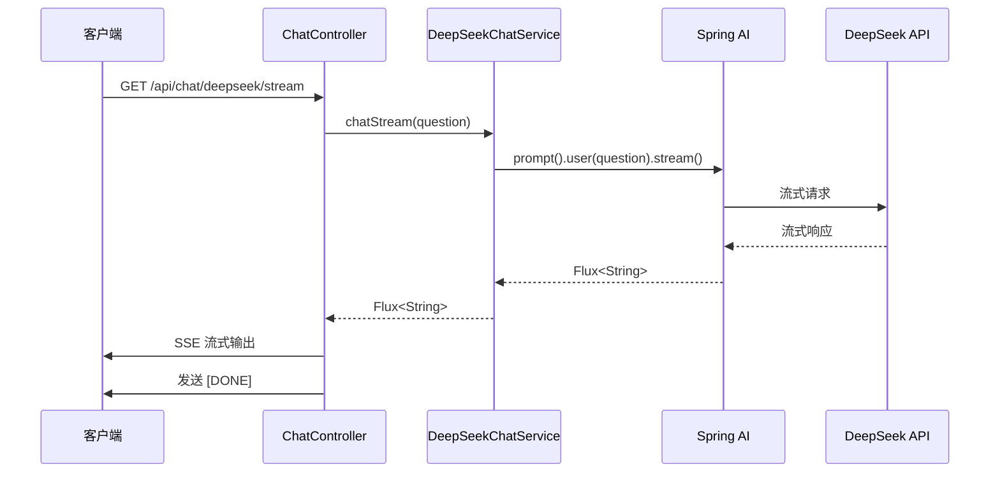

**图表来源**
- [ChatController.java:223-228](file://src/main/java/org/wiki/controller/ChatController.java#L223-L228)
- [DeepSeekChatService.java:86-92](file://src/main/java/org/wiki/service/DeepSeekChatService.java#L86-L92)

#### 3. DeepSeek + RAG 增强流式响应

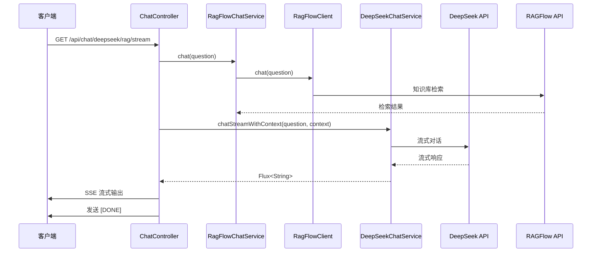

**图表来源**
- [ChatController.java:238-274](file://src/main/java/org/wiki/controller/ChatController.java#L238-L274)
- [RagFlowChatService.java:34-41](file://src/main/java/org/wiki/service/RagFlowChatService.java#L34-L41)
- [DeepSeekChatService.java:101-123](file://src/main/java/org/wiki/service/DeepSeekChatService.java#L101-L123)

### 不同对话模式的响应差异

#### RAGFlow 模式响应

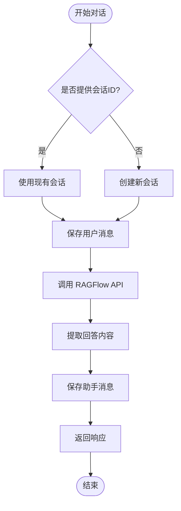

**图表来源**
- [ChatController.java:51-76](file://src/main/java/org/wiki/controller/ChatController.java#L51-L76)

#### DeepSeek 模式响应

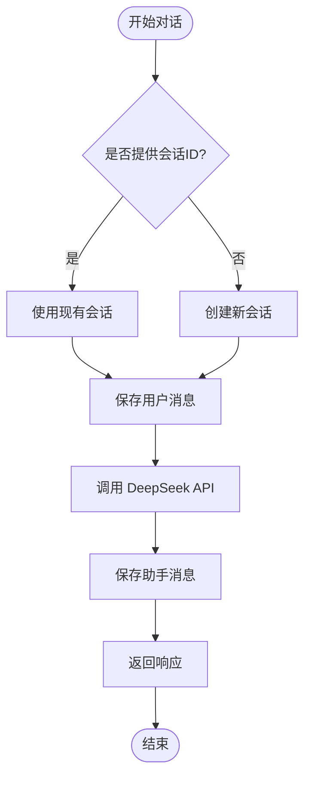

**图表来源**
- [ChatController.java:117-137](file://src/main/java/org/wiki/controller/ChatController.java#L117-L137)

#### DeepSeek + RAG 增强模式响应

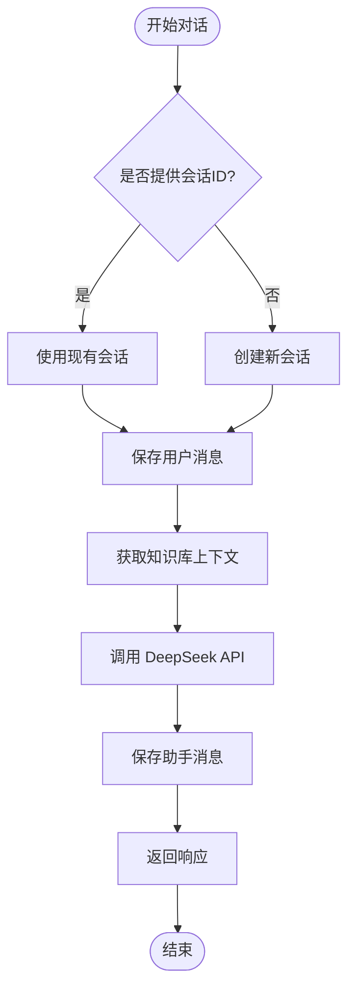

**图表来源**
- [ChatController.java:148-174](file://src/main/java/org/wiki/controller/ChatController.java#L148-L174)

### 错误处理机制

系统实现了多层次的错误处理机制：

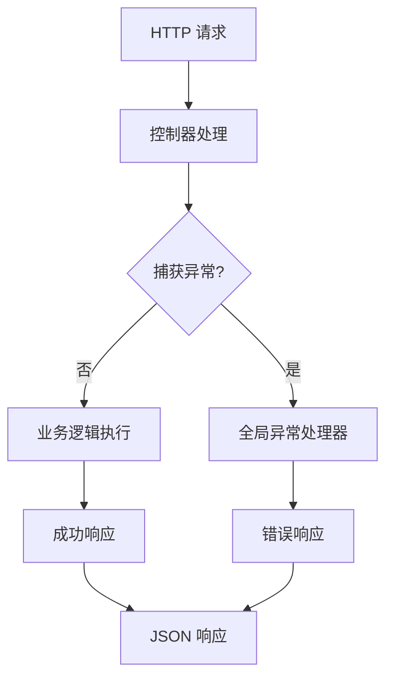

**图表来源**
- [GlobalExceptionHandler.java:20-44](file://src/main/java/org/wiki/config/GlobalExceptionHandler.java#L20-L44)

#### 错误响应格式

| 状态码 | 异常类型 | 错误响应 |
|--------|----------|----------|
| 400 | IllegalArgumentException | `{ "success": false, "message": "参数错误" }` |
| 401 | 认证相关 | `{ "success": false, "message": "未授权访问" }` |
| 500 | 其他异常 | `{ "success": false, "message": "服务器内部错误" }` |
| 503 | IO 异常 | `{ "success": false, "message": "RAGFlow 服务调用失败" }` |

**章节来源**
- [GlobalExceptionHandler.java:13-45](file://src/main/java/org/wiki/config/GlobalExceptionHandler.java#L13-L45)

### 响应序列化格式

系统支持多种响应格式：

#### JSON 序列化规则

1. **标准响应格式**：使用 RagFlowResult 包装器
2. **流式响应格式**：使用 SSE 协议，每行以 `data:` 开头
3. **对话历史格式**：使用 ChatMessage 模型

#### 流式数据格式

```mermaid
flowchart LR
SSELine[SSE 数据行] --> ParseData[解析 data: 前缀]
ParseData --> CheckDone{检查 [DONE]?}
CheckDone --> |是| Complete[完成流]
CheckDone --> |否| ParseJSON[解析 JSON]
ParseJSON --> SendChunk[发送增量数据]
SendChunk --> NextLine[下一行]
NextLine --> ParseData
```

**图表来源**
- [RagFlowClient.java:182-198](file://src/main/java/org/wiki/client/RagFlowClient.java#L182-L198)

**章节来源**
- [RagFlowClient.java:150-200](file://src/main/java/org/wiki/client/RagFlowClient.java#L150-L200)

## 依赖关系分析

### 组件依赖图

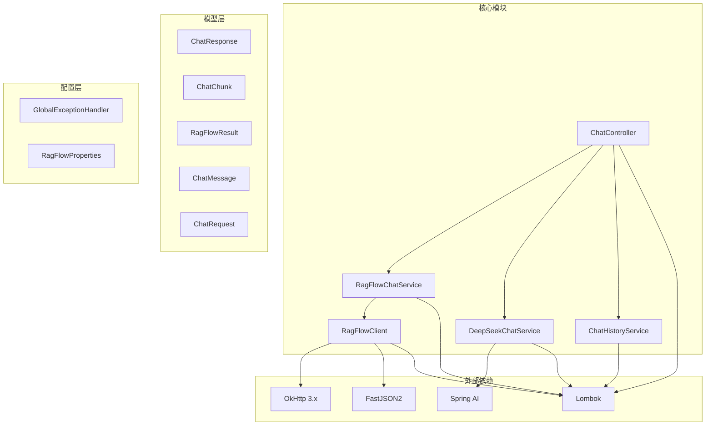

**图表来源**
- [RagFlowClient.java:3-6](file://src/main/java/org/wiki/client/RagFlowClient.java#L3-L6)
- [DeepSeekChatService.java:3-4](file://src/main/java/org/wiki/service/DeepSeekChatService.java#L3-L4)

### 关键依赖关系

| 组件 | 依赖组件 | 用途 |
|------|----------|------|
| ChatController | RagFlowChatService, DeepSeekChatService, ChatHistoryService | 控制器协调者 |
| RagFlowChatService | RagFlowClient, ChatResponse, ChatChunk | RAGFlow 对话服务 |
| DeepSeekChatService | ChatClient, Flux | DeepSeek 对话服务 |
| RagFlowClient | OkHttpClient, FastJSON, ChatRequest | RAGFlow HTTP 客户端 |
| ChatHistoryService | ChatMessage | 会话历史管理 |

**章节来源**
- [ChatController.java:32-41](file://src/main/java/org/wiki/controller/ChatController.java#L32-L41)
- [RagFlowChatService.java:20-24](file://src/main/java/org/wiki/service/RagFlowChatService.java#L20-L24)
- [DeepSeekChatService.java:24-28](file://src/main/java/org/wiki/service/DeepSeekChatService.java#L24-L28)

## 性能考虑

### 缓存策略

系统当前采用内存级缓存策略：

1. **会话消息缓存**：使用 ConcurrentHashMap 存储会话历史
2. **消息数量限制**：每个会话最多存储 100 条消息
3. **自动清理机制**：超出限制时自动清理最早的消息

### 性能优化建议

1. **连接池优化**：OkHttp 默认连接池配置
2. **超时设置**：RAGFlow 超时时间为 120 秒
3. **线程池管理**：使用缓存线程池处理流式响应
4. **内存管理**：定期清理过期会话数据

### 监控指标

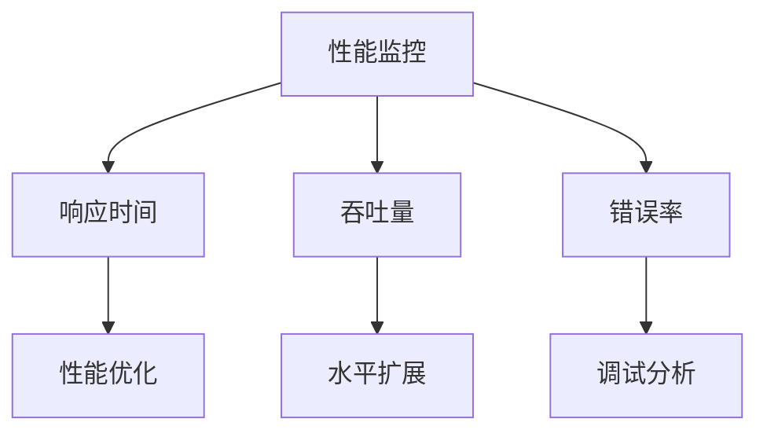

**章节来源**
- [ChatHistoryService.java:21-43](file://src/main/java/org/wiki/service/ChatHistoryService.java#L21-L43)
- [application.yml:17-22](file://src/main/resources/application.yml#L17-L22)

## 故障排除指南

### 常见问题及解决方案

#### 1. RAGFlow API 调用失败

**症状**：返回 `RAGFlow 服务调用失败`

**可能原因**：
- API Key 配置错误
- 网络连接问题
- 服务端超时

**解决方法**：
1. 检查 `application.yml` 中的配置
2. 验证网络连通性
3. 调整超时时间设置

#### 2. 流式响应中断

**症状**：SSE 连接意外断开

**可能原因**：
- 客户端超时设置过短
- 服务器压力过大
- 网络不稳定

**解决方法**：
1. 增加客户端超时时间
2. 优化服务器性能
3. 检查网络稳定性

#### 3. 会话数据丢失

**症状**：重启后会话历史消失

**原因**：内存存储不持久化

**解决方法**：
1. 使用数据库替换内存存储
2. 实现数据持久化机制
3. 添加数据备份策略

**章节来源**
- [GlobalExceptionHandler.java:37-44](file://src/main/java/org/wiki/config/GlobalExceptionHandler.java#L37-L44)
- [ChatHistoryService.java:10-13](file://src/main/java/org/wiki/service/ChatHistoryService.java#L10-L13)

### 调试技巧

1. **启用详细日志**：查看 `application.yml` 中的日志配置
2. **监控 API 调用**：观察 RAGFlow 和 DeepSeek 的调用情况
3. **验证响应格式**：确保 JSON 格式符合预期

## 结论

本项目成功实现了基于 Spring Boot 的 AI 对话系统，提供了完整的 API 响应模型设计。通过 ChatResponse 和 ChatChunk 模型，系统能够灵活支持同步和异步对话场景。RagFlowResult 作为统一的响应包装器，为前端提供了标准化的数据格式。

系统的主要优势包括：
- **多模式支持**：支持 RAGFlow、DeepSeek 和混合模式
- **流式响应**：完善的 SSE 协议支持
- **错误处理**：多层次的异常处理机制
- **可扩展性**：清晰的分层架构便于功能扩展

未来可以考虑的改进方向：
- 实现持久化的会话存储
- 添加更详细的性能监控
- 优化流式响应的并发处理能力
- 增强安全性和访问控制机制