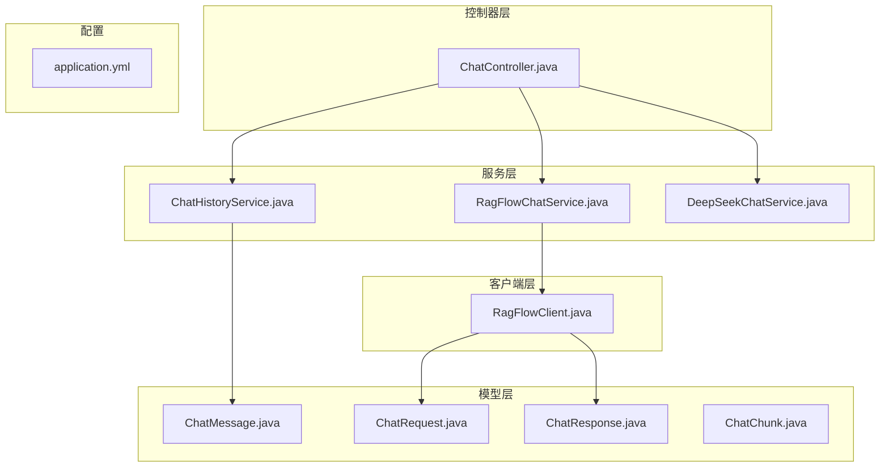
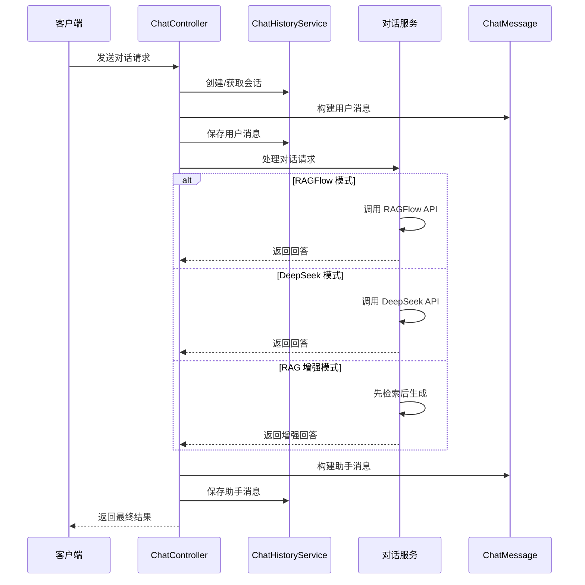
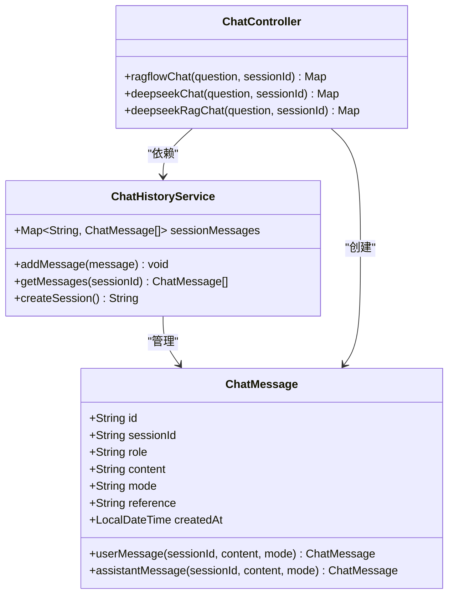
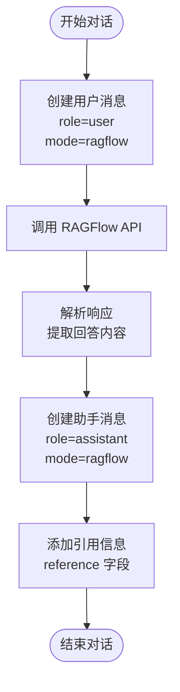
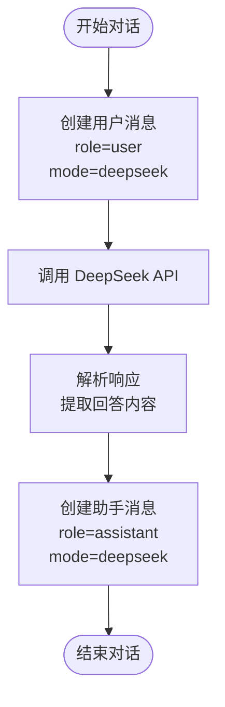
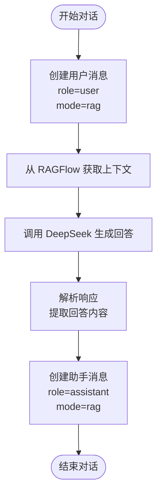
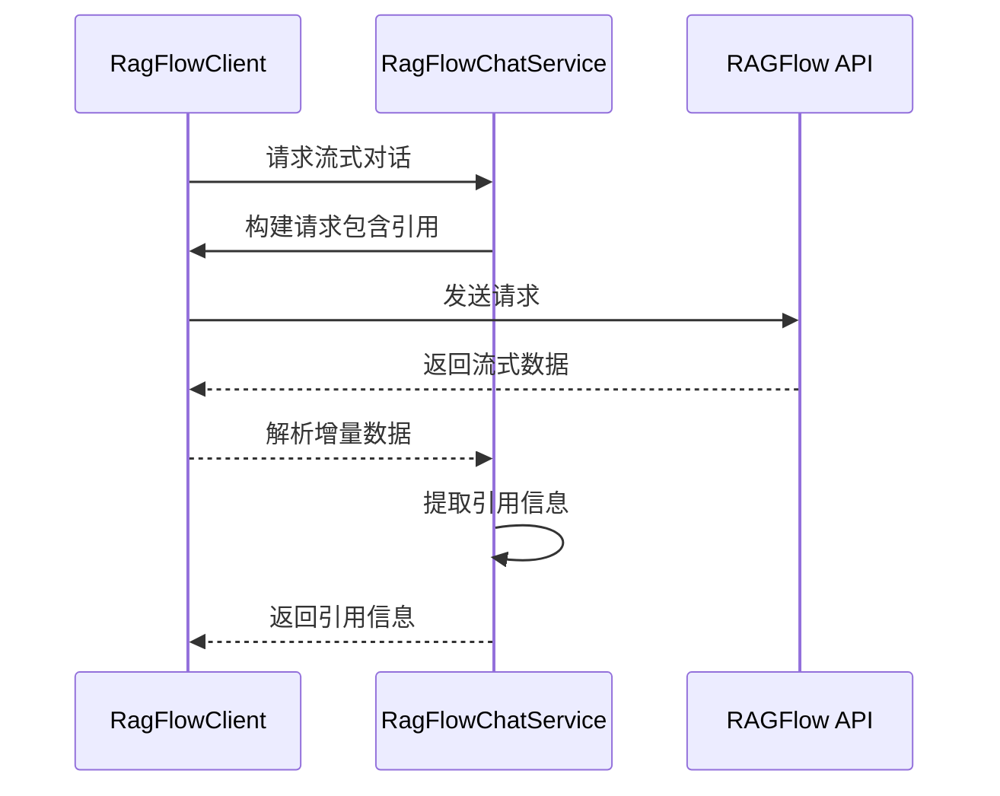
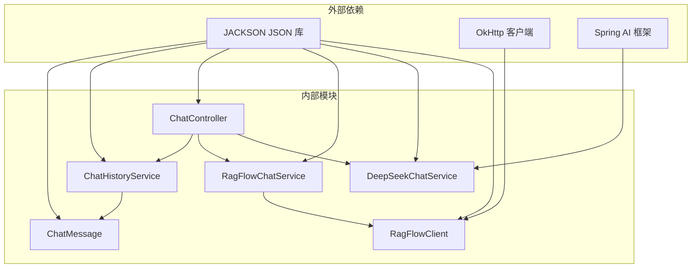

# 对话消息模型

<cite>
**本文档引用的文件**
- [ChatMessage.java](file://src/main/java/org/wiki/model/ChatMessage.java)
- [ChatRequest.java](file://src/main/java/org/wiki/model/ChatRequest.java)
- [ChatResponse.java](file://src/main/java/org/wiki/model/ChatResponse.java)
- [ChatChunk.java](file://src/main/java/org/wiki/model/ChatChunk.java)
- [ChatController.java](file://src/main/java/org/wiki/controller/ChatController.java)
- [RagFlowChatService.java](file://src/main/java/org/wiki/service/RagFlowChatService.java)
- [DeepSeekChatService.java](file://src/main/java/org/wiki/service/DeepSeekChatService.java)
- [ChatHistoryService.java](file://src/main/java/org/wiki/service/ChatHistoryService.java)
- [RagFlowClient.java](file://src/main/java/org/wiki/client/RagFlowClient.java)
- [application.yml](file://src/main/resources/application.yml)
</cite>

## 目录
1. [简介](#简介)
2. [项目结构](#项目结构)
3. [核心组件](#核心组件)
4. [架构概览](#架构概览)
5. [详细组件分析](#详细组件分析)
6. [依赖关系分析](#依赖关系分析)
7. [性能考虑](#性能考虑)
8. [故障排除指南](#故障排除指南)
9. [结论](#结论)

## 简介

本文件详细阐述了 Spring Wiki AI 项目中的对话消息模型，重点分析 ChatMessage 类的完整结构和使用方式。该系统支持三种对话模式：RAGFlow 知识库问答、DeepSeek 直接对话以及 DeepSeek + RAG 增强模式。通过对消息模型的深入分析，帮助开发者正确理解和使用对话消息的各个字段及其在不同模式下的行为。

## 项目结构

该项目采用标准的 Spring Boot 项目结构，围绕对话消息模型构建了完整的对话系统：

**图表来源**
- [ChatMessage.java:1-82](file://src/main/java/org/wiki/model/ChatMessage.java#L1-L82)
- [ChatController.java:1-276](file://src/main/java/org/wiki/controller/ChatController.java#L1-L276)
- [RagFlowChatService.java:1-84](file://src/main/java/org/wiki/service/RagFlowChatService.java#L1-L84)
- [DeepSeekChatService.java:1-125](file://src/main/java/org/wiki/service/DeepSeekChatService.java#L1-L125)
- [ChatHistoryService.java:1-88](file://src/main/java/org/wiki/service/ChatHistoryService.java#L1-L88)

**章节来源**
- [ChatMessage.java:1-82](file://src/main/java/org/wiki/model/ChatMessage.java#L1-L82)
- [ChatController.java:1-276](file://src/main/java/org/wiki/controller/ChatController.java#L1-L276)

## 核心组件

### ChatMessage 消息模型

ChatMessage 是整个对话系统的核心数据模型，定义了对话消息的完整结构：

#### 字段定义与用途

| 字段名 | 类型 | 必填 | 描述 | 默认值 |
|--------|------|------|------|--------|
| id | String | 是 | 消息唯一标识符 | 自动生成 |
| sessionId | String | 是 | 会话标识符 | 手动指定 |
| role | String | 是 | 角色类型 | "user" 或 "assistant" |
| content | String | 是 | 消息内容 | 手动指定 |
| mode | String | 是 | 对话模式 | "ragflow"、"deepseek" 或 "rag" |
| reference | String | 否 | 引用信息（RAGFlow专用） | null |
| createdAt | LocalDateTime | 是 | 创建时间戳 | 当前时间 |

#### 角色枚举值详解

系统支持两种角色类型，每种角色在对话流程中承担不同的职责：

- **user 角色**：代表用户发送的消息，通常包含用户提出的问题或指令
- **assistant 角色**：代表系统或AI助手回复的消息，包含AI的回答内容

#### 对话模式影响

对话模式决定了消息的处理方式和后续行为：

- **ragflow 模式**：通过 RAGFlow 知识库进行问答，支持引用信息展示
- **deepseek 模式**：直接调用 DeepSeek API 进行对话，不涉及知识库检索
- **rag 模式**：结合 RAGFlow 检索和 DeepSeek 生成的增强对话

**章节来源**
- [ChatMessage.java:19-52](file://src/main/java/org/wiki/model/ChatMessage.java#L19-L52)
- [ChatMessage.java:57-80](file://src/main/java/org/wiki/model/ChatMessage.java#L57-L80)

## 架构概览

系统采用分层架构设计，通过 ChatMessage 统一承载各种对话场景的数据：

**图表来源**
- [ChatController.java:51-174](file://src/main/java/org/wiki/controller/ChatController.java#L51-L174)
- [ChatHistoryService.java:31-43](file://src/main/java/org/wiki/service/ChatHistoryService.java#L31-L43)
- [RagFlowChatService.java:34-41](file://src/main/java/org/wiki/service/RagFlowChatService.java#L34-L41)
- [DeepSeekChatService.java:36-78](file://src/main/java/org/wiki/service/DeepSeekChatService.java#L36-L78)

## 详细组件分析

### ChatMessage 类结构分析

**图表来源**
- [ChatMessage.java:17-81](file://src/main/java/org/wiki/model/ChatMessage.java#L17-L81)
- [ChatHistoryService.java:16-87](file://src/main/java/org/wiki/service/ChatHistoryService.java#L16-L87)
- [ChatController.java:30-41](file://src/main/java/org/wiki/controller/ChatController.java#L30-L41)

#### 静态工厂方法详解

ChatMessage 提供了两个静态工厂方法来简化消息创建过程：

**userMessage() 方法**
- 用途：创建用户发送的消息
- 特性：自动设置 role 为 "user"，生成唯一 id，记录当前时间
- 参数：sessionId（会话ID）、content（消息内容）、mode（对话模式）

**assistantMessage() 方法**
- 用途：创建助手回复的消息
- 特性：自动设置 role 为 "assistant"，生成唯一 id，记录当前时间
- 参数：sessionId（会话ID）、content（消息内容）、mode（对话模式）

#### 时间戳字段处理

createdAt 字段采用 Java 8 的 LocalDateTime 类型，具有以下特点：

- **自动生成**：通过工厂方法自动设置为当前时间
- **时区处理**：使用系统默认时区，无需额外配置
- **精度**：支持到纳秒级别的时间精度
- **序列化**：通过 Jackson 库自动序列化为 JSON 格式

**章节来源**
- [ChatMessage.java:57-80](file://src/main/java/org/wiki/model/ChatMessage.java#L57-L80)
- [ChatMessage.java:49-52](file://src/main/java/org/wiki/model/ChatMessage.java#L49-L52)

### 对话模式处理机制

系统支持三种不同的对话模式，每种模式都有特定的消息处理逻辑：

#### RAGFlow 模式（知识库问答）

**图表来源**
- [ChatController.java:51-76](file://src/main/java/org/wiki/controller/ChatController.java#L51-L76)
- [RagFlowChatService.java:34-41](file://src/main/java/org/wiki/service/RagFlowChatService.java#L34-L41)

#### DeepSeek 模式（直接对话）

**图表来源**
- [ChatController.java:117-137](file://src/main/java/org/wiki/controller/ChatController.java#L117-L137)
- [DeepSeekChatService.java:36-44](file://src/main/java/org/wiki/service/DeepSeekChatService.java#L36-L44)

#### RAG 增强模式（检索增强生成）

**图表来源**
- [ChatController.java:148-174](file://src/main/java/org/wiki/controller/ChatController.java#L148-L174)
- [DeepSeekChatService.java:54-78](file://src/main/java/org/wiki/service/DeepSeekChatService.java#L54-L78)

### 引用信息处理机制

在 RAGFlow 模式下，系统支持引用信息的提取和展示：

#### 引用信息格式

引用信息通过 ChatMessage 的 reference 字段存储，格式为字符串形式的 JSON 对象。引用信息包含以下关键属性：

- **id**：引用文档的唯一标识符
- **title**：文档标题
- **content**：引用的具体内容片段
- **score**：相似度评分
- **source**：文档来源信息

#### 引用信息提取流程

**图表来源**
- [RagFlowChatService.java:50-72](file://src/main/java/org/wiki/service/RagFlowChatService.java#L50-L72)
- [RagFlowClient.java:154-200](file://src/main/java/org/wiki/client/RagFlowClient.java#L154-L200)

**章节来源**
- [ChatMessage.java:44-47](file://src/main/java/org/wiki/model/ChatMessage.java#L44-L47)
- [RagFlowChatService.java:62-66](file://src/main/java/org/wiki/service/RagFlowChatService.java#L62-L66)

### 消息序列化与反序列化

系统使用 Jackson 库进行消息的 JSON 序列化和反序列化处理：

#### 序列化规则

- **基础类型**：String、Integer、Long 等基本类型直接序列化
- **日期时间**：LocalDateTime 自动转换为 ISO-8601 格式的字符串
- **嵌套对象**：通过 getter 方法递归序列化
- **空值处理**：null 值会被忽略，不会出现在 JSON 输出中

#### 反序列化规则

- **类型匹配**：JSON 字段类型必须与 Java 字段类型匹配
- **日期解析**：ISO-8601 格式的日期字符串自动解析为 LocalDateTime
- **集合处理**：数组和列表自动映射到对应的 Java 集合类型
- **错误处理**：类型不匹配时抛出 JsonProcessingException 异常

**章节来源**
- [ChatMessage.java:8](file://src/main/java/org/wiki/model/ChatMessage.java#L8)
- [application.yml:24-27](file://src/main/resources/application.yml#L24-L27)

## 依赖关系分析

系统各组件之间的依赖关系清晰明确，遵循单一职责原则：

**图表来源**
- [ChatMessage.java:3](file://src/main/java/org/wiki/model/ChatMessage.java#L3)
- [RagFlowClient.java:3](file://src/main/java/org/wiki/client/RagFlowClient.java#L3)
- [DeepSeekChatService.java:4](file://src/main/java/org/wiki/service/DeepSeekChatService.java#L4)

### 数据验证规则

系统实现了多层次的数据验证机制：

#### 基础验证规则

- **必填字段**：id、sessionId、role、content、mode、createdAt 必须提供
- **类型验证**：每个字段必须符合其声明的类型
- **长度限制**：content 字段长度不应超过系统限制
- **格式验证**：sessionId 必须是有效的 UUID 格式

#### 业务规则验证

- **角色验证**：role 字段只能是 "user" 或 "assistant"
- **模式验证**：mode 字段只能是 "ragflow"、"deepseek" 或 "rag"
- **时间验证**：createdAt 必须是过去或当前时间
- **关联验证**：用户消息和助手消息必须属于同一个 sessionId

#### 错误处理策略

- **验证失败**：抛出 IllegalArgumentException 异常
- **网络异常**：捕获 IOException 并返回友好的错误信息
- **API 错误**：处理 RAGFlow 和 DeepSeek API 的错误响应
- **超时处理**：配置合理的超时时间避免长时间阻塞

**章节来源**
- [ChatMessage.java:29-42](file://src/main/java/org/wiki/model/ChatMessage.java#L29-L42)
- [ChatHistoryService.java:31-43](file://src/main/java/org/wiki/service/ChatHistoryService.java#L31-L43)

## 性能考虑

### 内存管理

- **消息限制**：每个会话最多保留 100 条消息，超出部分自动清理
- **并发安全**：使用 ConcurrentHashMap 确保多线程环境下的数据一致性
- **内存优化**：及时清理不再使用的会话数据，避免内存泄漏

### 网络性能

- **连接池**：OkHttp 客户端使用连接池复用 TCP 连接
- **超时配置**：RAGFlow 请求超时时间为 120 秒，DeepSeek 为 30 秒
- **流式处理**：支持流式响应减少内存占用

### 缓存策略

- **会话缓存**：基于内存的会话消息缓存
- **响应缓存**：可扩展的响应缓存机制
- **配置缓存**：应用配置的热更新支持

## 故障排除指南

### 常见问题及解决方案

#### 对话模式配置错误

**问题**：mode 字段设置不正确导致消息处理异常
**解决方案**：确保 mode 字段只能是 "ragflow"、"deepseek" 或 "rag"

#### 会话ID无效

**问题**：sessionId 格式不正确或不存在
**解决方案**：使用 ChatHistoryService.createSession() 创建新的会话ID

#### 时间戳异常

**问题**：createdAt 字段出现时区问题
**解决方案**：系统使用系统默认时区，无需手动处理时区转换

#### 引用信息缺失

**问题**：RAGFlow 模式下缺少引用信息
**解决方案**：确认 ChatRequest.ExtraBody 中的 reference 字段设置为 true

**章节来源**
- [ChatController.java:70-75](file://src/main/java/org/wiki/controller/ChatController.java#L70-L75)
- [RagFlowClient.java:142](file://src/main/java/org/wiki/client/RagFlowClient.java#L142)

### 日志监控

系统提供了详细的日志记录机制：

- **请求日志**：记录所有 API 请求的详细信息
- **错误日志**：捕获并记录所有异常情况
- **性能日志**：监控关键操作的执行时间和资源使用
- **调试日志**：开发模式下的详细调试信息

**章节来源**
- [application.yml:24-27](file://src/main/resources/application.yml#L24-L27)

## 结论

对话消息模型 ChatMessage 作为 Spring Wiki AI 项目的核心数据结构，成功地统一了三种不同对话模式的数据表示。通过精心设计的字段结构、完善的工厂方法和严格的验证机制，该模型为系统的稳定运行提供了坚实基础。

系统的主要优势包括：

1. **统一的数据模型**：无论哪种对话模式，都使用相同的 ChatMessage 结构
2. **灵活的工厂方法**：简化了消息创建过程，减少了重复代码
3. **完整的生命周期管理**：从创建到存储的全流程支持
4. **强大的扩展性**：易于添加新的对话模式和功能特性

未来可以考虑的改进方向：

1. **数据持久化**：将内存存储替换为数据库持久化
2. **缓存优化**：实现更智能的缓存策略
3. **监控增强**：添加更详细的性能监控指标
4. **安全加固**：增加输入验证和安全防护措施