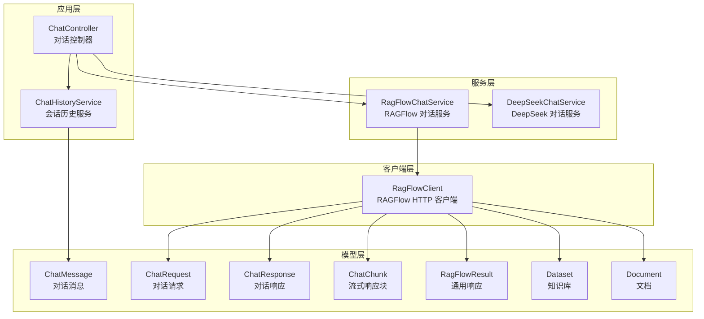
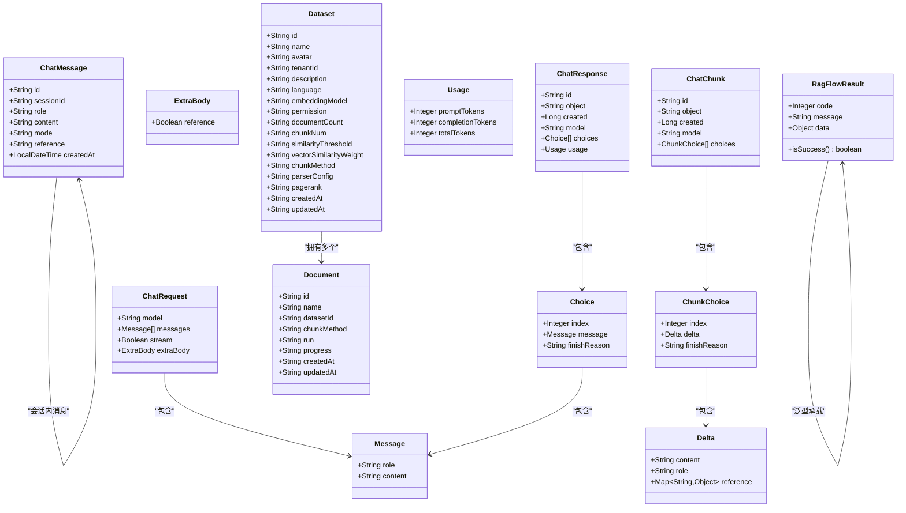
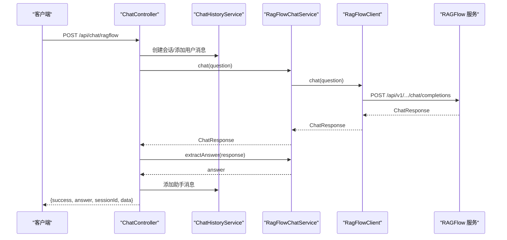
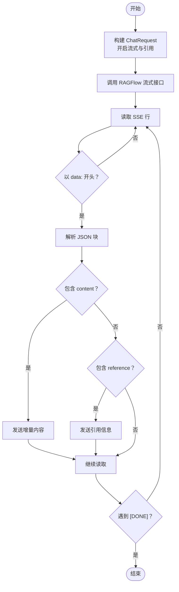
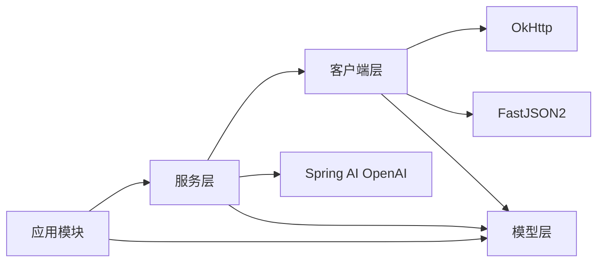

# 数据模型

<cite>
**本文引用的文件**
- [ChatMessage.java](file://src/main/java/org/wiki/model/ChatMessage.java)
- [ChatResponse.java](file://src/main/java/org/wiki/model/ChatResponse.java)
- [RagFlowResult.java](file://src/main/java/org/wiki/model/RagFlowResult.java)
- [Dataset.java](file://src/main/java/org/wiki/model/Dataset.java)
- [Document.java](file://src/main/java/org/wiki/model/Document.java)
- [ChatChunk.java](file://src/main/java/org/wiki/model/ChatChunk.java)
- [ChatRequest.java](file://src/main/java/org/wiki/model/ChatRequest.java)
- [ChatController.java](file://src/main/java/org/wiki/controller/ChatController.java)
- [RagFlowChatService.java](file://src/main/java/org/wiki/service/RagFlowChatService.java)
- [DeepSeekChatService.java](file://src/main/java/org/wiki/service/DeepSeekChatService.java)
- [ChatHistoryService.java](file://src/main/java/org/wiki/service/ChatHistoryService.java)
- [RagFlowClient.java](file://src/main/java/org/wiki/client/RagFlowClient.java)
- [application.yml](file://src/main/resources/application.yml)
- [pom.xml](file://pom.xml)
</cite>

## 目录
1. [简介](#简介)
2. [项目结构](#项目结构)
3. [核心数据模型](#核心数据模型)
4. [架构总览](#架构总览)
5. [组件详细分析](#组件详细分析)
6. [依赖关系分析](#依赖关系分析)
7. [性能考量](#性能考量)
8. [故障排查指南](#故障排查指南)
9. [结论](#结论)
10. [附录](#附录)

## 简介
本文件系统性梳理 DeepSeek + RAGFlow 系统中的数据模型与实体关系，重点覆盖以下方面：
- 对话消息模型 ChatMessage 的字段定义、数据类型与使用场景
- API 响应模型 ChatResponse 与 RagFlowResult 的结构与用途
- 知识库数据模型 Dataset 与 Document 的关系与属性
- 数据验证规则、业务约束与数据完整性要求
- 数据模型之间的关系图与实体关系图
- 数据访问模式、缓存策略与性能考虑
- 数据迁移路径与版本管理策略
- 数据安全、隐私要求与访问控制机制

## 项目结构
该项目采用 Spring Boot + Spring AI 架构，围绕对话控制器、服务层与客户端封装 RAGFlow 与 DeepSeek 的交互。数据模型主要位于 model 包中，控制器负责路由与会话管理，服务层负责业务逻辑与外部调用，客户端负责与 RAGFlow 的 HTTP 通信。

图表来源
- [ChatController.java:1-276](file://src/main/java/org/wiki/controller/ChatController.java#L1-276)
- [RagFlowChatService.java:1-84](file://src/main/java/org/wiki/service/RagFlowChatService.java#L1-84)
- [DeepSeekChatService.java:1-125](file://src/main/java/org/wiki/service/DeepSeekChatService.java#L1-125)
- [ChatHistoryService.java:1-88](file://src/main/java/org/wiki/service/ChatHistoryService.java#L1-88)
- [RagFlowClient.java:1-231](file://src/main/java/org/wiki/client/RagFlowClient.java#L1-231)
- [ChatMessage.java:1-82](file://src/main/java/org/wiki/model/ChatMessage.java#L1-82)
- [ChatRequest.java:1-59](file://src/main/java/org/wiki/model/ChatRequest.java#L1-59)
- [ChatResponse.java:1-52](file://src/main/java/org/wiki/model/ChatResponse.java#L1-52)
- [ChatChunk.java:1-42](file://src/main/java/org/wiki/model/ChatChunk.java#L1-42)
- [RagFlowResult.java:1-25](file://src/main/java/org/wiki/model/RagFlowResult.java#L1-25)
- [Dataset.java:1-33](file://src/main/java/org/wiki/model/Dataset.java#L1-33)
- [Document.java:1-24](file://src/main/java/org/wiki/model/Document.java#L1-24)

章节来源
- [ChatController.java:1-276](file://src/main/java/org/wiki/controller/ChatController.java#L1-276)
- [RagFlowClient.java:1-231](file://src/main/java/org/wiki/client/RagFlowClient.java#L1-231)
- [ChatMessage.java:1-82](file://src/main/java/org/wiki/model/ChatMessage.java#L1-82)
- [ChatResponse.java:1-52](file://src/main/java/org/wiki/model/ChatResponse.java#L1-52)
- [RagFlowResult.java:1-25](file://src/main/java/org/wiki/model/RagFlowResult.java#L1-25)
- [Dataset.java:1-33](file://src/main/java/org/wiki/model/Dataset.java#L1-33)
- [Document.java:1-24](file://src/main/java/org/wiki/model/Document.java#L1-24)
- [ChatChunk.java:1-42](file://src/main/java/org/wiki/model/ChatChunk.java#L1-42)
- [ChatRequest.java:1-59](file://src/main/java/org/wiki/model/ChatRequest.java#L1-59)
- [ChatHistoryService.java:1-88](file://src/main/java/org/wiki/service/ChatHistoryService.java#L1-88)
- [RagFlowChatService.java:1-84](file://src/main/java/org/wiki/service/RagFlowChatService.java#L1-84)
- [DeepSeekChatService.java:1-125](file://src/main/java/org/wiki/service/DeepSeekChatService.java#L1-125)
- [application.yml:1-27](file://src/main/resources/application.yml#L1-27)
- [pom.xml:1-102](file://pom.xml#L1-102)

## 核心数据模型
本节对关键数据模型进行逐项说明，包括字段定义、数据类型、默认值、约束与典型使用场景。

- 对话消息模型 ChatMessage
  - 字段与类型
    - id: 字符串，唯一标识
    - sessionId: 字符串，所属会话标识
    - role: 字符串，角色，取值为 user 或 assistant
    - content: 字符串，消息内容
    - mode: 字符串，对话模式，取值为 ragflow、deepseek、rag
    - reference: 字符串，引用信息（RAGFlow 返回的知识库引用）
    - createdAt: 时间戳，消息创建时间
  - 默认值与约束
    - id 自动生成（UUID），createdAt 默认当前时间
    - role 必须为 user 或 assistant
    - mode 必须为 ragflow、deepseek、rag 之一
    - reference 为可选字符串，用于承载引用元数据
  - 使用场景
    - 记录用户与助手的对话历史，支持会话管理与回放
    - 在不同对话模式下区分消息来源与处理流程

- API 响应模型 ChatResponse
  - 字段与类型
    - id: 字符串
    - object: 字符串
    - created: 整数（毫秒或秒级时间戳）
    - model: 字符串
    - choices: 列表，元素为 Choice
    - usage: Usage 对象
  - Choice 内部结构
    - index: 整数
    - message: Message 对象
    - finishReason: 字符串
  - Message 内部结构
    - role: 字符串
    - content: 字符串
    - reference: 映射对象，承载引用信息
  - Usage 内部结构
    - promptTokens: 整数
    - completionTokens: 整数
    - totalTokens: 整数
  - 使用场景
    - 非流式对话的标准响应载体
    - 用于统计 token 使用量与提取回答内容

- API 响应模型 RagFlowResult<T>
  - 字段与类型
    - code: 整数，状态码，0 表示成功
    - message: 字符串，消息描述
    - data: 泛型 T，实际数据
  - 方法
    - isSuccess(): 布尔，判断 code 是否为 0
  - 使用场景
    - 统一包装 RAGFlow 通用 API 响应，便于前端与上层服务处理

- 知识库数据模型 Dataset
  - 字段与类型
    - id: 字符串
    - name: 字符串
    - avatar: 字符串
    - tenantId: 字符串
    - description: 字符串
    - language: 字符串
    - embeddingModel: 字符串
    - permission: 字符串
    - documentCount: 字符串（计数）
    - chunkNum: 字符串（分片数量）
    - similarityThreshold: 字符串（相似度阈值）
    - vectorSimilarityWeight: 字符串（向量相似度权重）
    - chunkMethod: 字符串（分块方法）
    - parserConfig: 字符串（解析器配置）
    - pagerank: 字符串（PageRank 相关参数）
    - createdAt: 字符串（ISO 时间）
    - updatedAt: 字符串（ISO 时间）
  - 使用场景
    - 描述知识库的基本信息与配置参数
    - 作为文档上传与检索的容器

- 文档模型 Document
  - 字段与类型
    - id: 字符串
    - name: 字符串
    - datasetId: 字符串，所属知识库标识
    - chunkMethod: 字符串（分块方法）
    - run: 字符串（运行状态）
    - progress: 字符串（进度）
    - createdAt: 字符串（ISO 时间）
    - updatedAt: 字符串（ISO 时间）
  - 使用场景
    - 描述单个文档在知识库中的状态与元数据
    - 支持文件上传、解析与索引过程的追踪

- 流式响应块 ChatChunk
  - 字段与类型
    - id: 字符串
    - object: 字符串
    - created: 整数
    - model: 字符串
    - choices: 列表，元素为 ChunkChoice
  - ChunkChoice 内部结构
    - index: 整数
    - delta: Delta 对象
    - finishReason: 字符串
  - Delta 内部结构
    - content: 字符串（增量内容）
    - role: 字符串（角色）
    - reference: 映射对象（引用信息）
  - 使用场景
    - SSE 流式输出的增量数据载体

- 对话请求模型 ChatRequest
  - 字段与类型
    - model: 字符串（模型名）
    - messages: 列表，元素为 Message
    - stream: 布尔，是否流式输出
    - extraBody: ExtraBody 对象
  - Message 内部结构
    - role: 字符串
    - content: 字符串
  - ExtraBody 内部结构
    - reference: 布尔，是否包含引用
  - 使用场景
    - 封装 RAGFlow OpenAI 兼容接口的请求体

章节来源
- [ChatMessage.java:1-82](file://src/main/java/org/wiki/model/ChatMessage.java#L1-82)
- [ChatResponse.java:1-52](file://src/main/java/org/wiki/model/ChatResponse.java#L1-52)
- [RagFlowResult.java:1-25](file://src/main/java/org/wiki/model/RagFlowResult.java#L1-25)
- [Dataset.java:1-33](file://src/main/java/org/wiki/model/Dataset.java#L1-33)
- [Document.java:1-24](file://src/main/java/org/wiki/model/Document.java#L1-24)
- [ChatChunk.java:1-42](file://src/main/java/org/wiki/model/ChatChunk.java#L1-42)
- [ChatRequest.java:1-59](file://src/main/java/org/wiki/model/ChatRequest.java#L1-59)

## 架构总览
下图展示数据模型在系统中的分布与交互关系，以及与控制器、服务层、客户端的关系映射。

图表来源
- [ChatMessage.java:1-82](file://src/main/java/org/wiki/model/ChatMessage.java#L1-82)
- [ChatRequest.java:1-59](file://src/main/java/org/wiki/model/ChatRequest.java#L1-59)
- [ChatResponse.java:1-52](file://src/main/java/org/wiki/model/ChatResponse.java#L1-52)
- [ChatChunk.java:1-42](file://src/main/java/org/wiki/model/ChatChunk.java#L1-42)
- [RagFlowResult.java:1-25](file://src/main/java/org/wiki/model/RagFlowResult.java#L1-25)
- [Dataset.java:1-33](file://src/main/java/org/wiki/model/Dataset.java#L1-33)
- [Document.java:1-24](file://src/main/java/org/wiki/model/Document.java#L1-24)

## 组件详细分析

### 对话消息模型 ChatMessage
- 设计要点
  - 使用 Lombok 注解简化 getter/setter/构造函数
  - 提供静态工厂方法 userMessage 与 assistantMessage，统一创建流程
  - 字段覆盖会话标识、角色、内容、模式与引用等关键维度
- 数据完整性
  - id 由 UUID 生成，避免冲突
  - role 限定为 user/assistant，保证语义一致性
  - mode 限定为 ragflow/deepseek/rag，确保与对话模式一致
- 使用场景
  - 与 ChatHistoryService 协作实现会话历史管理
  - 与 ChatController 的多模式对话集成

章节来源
- [ChatMessage.java:1-82](file://src/main/java/org/wiki/model/ChatMessage.java#L1-82)
- [ChatHistoryService.java:1-88](file://src/main/java/org/wiki/service/ChatHistoryService.java#L1-88)
- [ChatController.java:1-276](file://src/main/java/org/wiki/controller/ChatController.java#L1-276)

### API 响应模型 ChatResponse
- 结构设计
  - 嵌套 Choice/Message/Usage，符合 OpenAI 兼容接口风格
  - reference 字段承载引用信息，便于溯源
- 使用场景
  - 非流式对话的标准响应
  - Token 统计与回答提取

章节来源
- [ChatResponse.java:1-52](file://src/main/java/org/wiki/model/ChatResponse.java#L1-52)
- [RagFlowChatService.java:1-84](file://src/main/java/org/wiki/service/RagFlowChatService.java#L1-84)

### API 响应模型 RagFlowResult<T>
- 设计要点
  - 泛型承载任意数据类型，统一错误码与消息
  - isSuccess() 方法提供便捷判断
- 使用场景
  - 包装通用 API 响应，便于跨模块复用

章节来源
- [RagFlowResult.java:1-25](file://src/main/java/org/wiki/model/RagFlowResult.java#L1-25)

### 知识库与文档模型 Dataset 与 Document
- 关系
  - Dataset 与 Document 为一对多关系：一个知识库可包含多个文档
- 属性差异
  - Dataset 更关注配置与元信息（embedding 模型、语言、权限、相似度阈值等）
  - Document 更关注文档生命周期状态（run、progress）与所属知识库标识
- 使用场景
  - 作为 RAGFlowClient 的上传与查询目标
  - 作为 ChatController 的知识库问答前置条件

章节来源
- [Dataset.java:1-33](file://src/main/java/org/wiki/model/Dataset.java#L1-33)
- [Document.java:1-24](file://src/main/java/org/wiki/model/Document.java#L1-24)
- [RagFlowClient.java:1-231](file://src/main/java/org/wiki/client/RagFlowClient.java#L1-231)

### 流式响应模型 ChatChunk
- 设计要点
  - 与 ChatResponse 类似，但以增量 delta 形式传输
  - 支持引用信息的增量传输
- 使用场景
  - SSE 流式输出，提升用户体验

章节来源
- [ChatChunk.java:1-42](file://src/main/java/org/wiki/model/ChatChunk.java#L1-42)
- [RagFlowChatService.java:1-84](file://src/main/java/org/wiki/service/RagFlowChatService.java#L1-84)

### 对话请求模型 ChatRequest
- 设计要点
  - 支持流式开关与额外参数（是否包含引用）
  - 与 RAGFlow 的 OpenAI 兼容接口保持一致
- 使用场景
  - 作为 RagFlowClient 的请求体

章节来源
- [ChatRequest.java:1-59](file://src/main/java/org/wiki/model/ChatRequest.java#L1-59)
- [RagFlowClient.java:1-231](file://src/main/java/org/wiki/client/RagFlowClient.java#L1-231)

### 控制器与服务层交互序列
以下序列图展示非流式 RAGFlow 对话的端到端流程。

图表来源
- [ChatController.java:1-276](file://src/main/java/org/wiki/controller/ChatController.java#L1-276)
- [ChatHistoryService.java:1-88](file://src/main/java/org/wiki/service/ChatHistoryService.java#L1-88)
- [RagFlowChatService.java:1-84](file://src/main/java/org/wiki/service/RagFlowChatService.java#L1-84)
- [RagFlowClient.java:1-231](file://src/main/java/org/wiki/client/RagFlowClient.java#L1-231)

### 流式对话处理流程
以下流程图展示 RAGFlow 流式对话的处理步骤。

图表来源
- [RagFlowClient.java:154-200](file://src/main/java/org/wiki/client/RagFlowClient.java#L154-L200)
- [RagFlowChatService.java:50-72](file://src/main/java/org/wiki/service/RagFlowChatService.java#L50-L72)

## 依赖关系分析
- 模块依赖
  - 应用层依赖服务层与模型层
  - 服务层依赖客户端与模型层
  - 客户端依赖模型层与配置层
- 外部依赖
  - OkHttp 用于 HTTP 通信
  - Spring AI OpenAI Starter 用于 DeepSeek 调用
  - FastJSON2 用于 JSON 解析
- 版本与兼容性
  - Spring AI 版本与 Spring Boot 3.2.0 兼容
  - OkHttp 4.12.0 与 SSE 扩展配合使用

图表来源
- [pom.xml:1-102](file://pom.xml#L1-102)
- [RagFlowClient.java:1-231](file://src/main/java/org/wiki/client/RagFlowClient.java#L1-231)
- [DeepSeekChatService.java:1-125](file://src/main/java/org/wiki/service/DeepSeekChatService.java#L1-125)

章节来源
- [pom.xml:1-102](file://pom.xml#L1-102)
- [RagFlowClient.java:1-231](file://src/main/java/org/wiki/client/RagFlowClient.java#L1-231)
- [DeepSeekChatService.java:1-125](file://src/main/java/org/wiki/service/DeepSeekChatService.java#L1-125)

## 性能考量
- 会话历史存储
  - ChatHistoryService 使用并发 Map 存储，消息上限为 100 条，避免无限增长
  - 建议生产环境替换为数据库持久化，结合分页与归档策略
- 流式输出
  - RAGFlow 流式接口基于 SSE，客户端按行解析，减少内存占用
  - DeepSeek 使用 Spring AI 的 Flux 流式输出，天然支持背压
- 超时与重试
  - OkHttp 读超时由配置注入，默认随应用配置生效
  - 建议在客户端层增加指数退避重试与熔断策略
- 缓存策略
  - 当前模型层未内置缓存；可在服务层对热点知识片段进行短期缓存
  - 对话历史建议使用本地缓存（如 Caffeine）与数据库双写

[本节为通用性能建议，不直接分析具体文件]

## 故障排查指南
- RAGFlow API 调用失败
  - 现象：HTTP 非 2xx，抛出异常
  - 排查：检查 Authorization、Base URL、Chat ID、API Key
  - 参考：客户端统一错误处理与日志记录
- 流式数据解析异常
  - 现象：解析 SSE 数据时出现警告
  - 排查：确认 RAGFlow 返回格式与客户端解析逻辑一致
- 会话历史异常
  - 现象：消息丢失或越界
  - 排查：检查最大消息数量限制与会话清理逻辑

章节来源
- [RagFlowClient.java:38-129](file://src/main/java/org/wiki/client/RagFlowClient.java#L38-L129)
- [RagFlowChatService.java:67-70](file://src/main/java/org/wiki/service/RagFlowChatService.java#L67-L70)
- [ChatHistoryService.java:35-43](file://src/main/java/org/wiki/service/ChatHistoryService.java#L35-L43)

## 结论
本系统通过清晰的数据模型与分层架构，实现了与 RAGFlow 和 DeepSeek 的稳定集成。ChatMessage、ChatResponse、ChatChunk、ChatRequest、RagFlowResult、Dataset、Document 等模型共同支撑了对话、流式输出、知识库管理与引用溯源等核心能力。建议在生产环境中强化持久化、缓存与监控体系，以进一步提升可靠性与性能。

[本节为总结性内容，不直接分析具体文件]

## 附录

### 数据验证规则与业务约束
- ChatMessage
  - role 必须为 user 或 assistant
  - mode 必须为 ragflow、deepseek、rag
  - id 与 createdAt 自动生成
- ChatResponse/ChatChunk
  - choices/message/reference 结构遵循 OpenAI 兼容接口
  - usage 字段用于统计 token 使用
- Dataset/Document
  - datasetId 与文档关联
  - run/progress 描述文档处理状态

章节来源
- [ChatMessage.java:1-82](file://src/main/java/org/wiki/model/ChatMessage.java#L1-82)
- [ChatResponse.java:1-52](file://src/main/java/org/wiki/model/ChatResponse.java#L1-52)
- [ChatChunk.java:1-42](file://src/main/java/org/wiki/model/ChatChunk.java#L1-42)
- [Dataset.java:1-33](file://src/main/java/org/wiki/model/Dataset.java#L1-33)
- [Document.java:1-24](file://src/main/java/org/wiki/model/Document.java#L1-24)

### 数据访问模式与缓存策略
- 访问模式
  - 控制器通过服务层访问客户端与历史服务
  - 客户端封装 HTTP 与 SSE 调用
- 缓存策略
  - 会话历史：内存 Map，建议替换为数据库
  - 知识片段：可引入短期缓存以降低重复检索成本

章节来源
- [ChatController.java:1-276](file://src/main/java/org/wiki/controller/ChatController.java#L1-276)
- [ChatHistoryService.java:1-88](file://src/main/java/org/wiki/service/ChatHistoryService.java#L1-88)
- [RagFlowClient.java:1-231](file://src/main/java/org/wiki/client/RagFlowClient.java#L1-231)

### 数据迁移路径与版本管理策略
- 迁移路径
  - 从内存会话迁移到数据库：新增会话表与消息表，保留 sessionId 与消息结构
  - 从字符串字段升级为强类型：如将 createdAt/description 等字段转换为更精确的类型
- 版本管理
  - 通过 application.yml 与 pom.xml 统一管理依赖版本
  - 对外部 API（RAGFlow/DeepSeek）变更时，优先在客户端层隔离

章节来源
- [application.yml:1-27](file://src/main/resources/application.yml#L1-27)
- [pom.xml:1-102](file://pom.xml#L1-102)

### 数据安全、隐私与访问控制
- 安全配置
  - API Key 通过配置注入，避免硬编码
  - HTTP 请求统一添加 Authorization 头
- 隐私与合规
  - 对话历史与引用信息需遵循最小化原则
  - 建议对敏感内容进行脱敏与审计
- 访问控制
  - 建议在网关层或控制器层增加鉴权与限流策略

章节来源
- [RagFlowClient.java:40-129](file://src/main/java/org/wiki/client/RagFlowClient.java#L40-L129)
- [application.yml:17-22](file://src/main/resources/application.yml#L17-22)