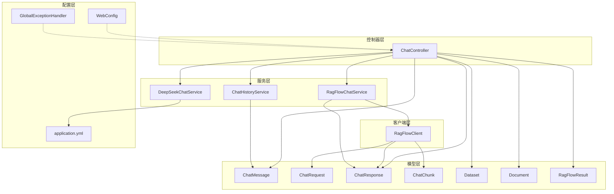
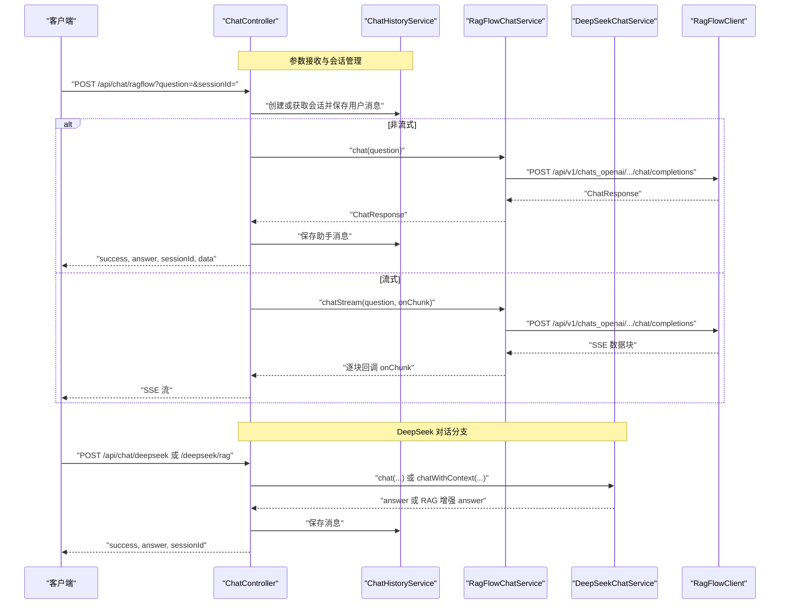
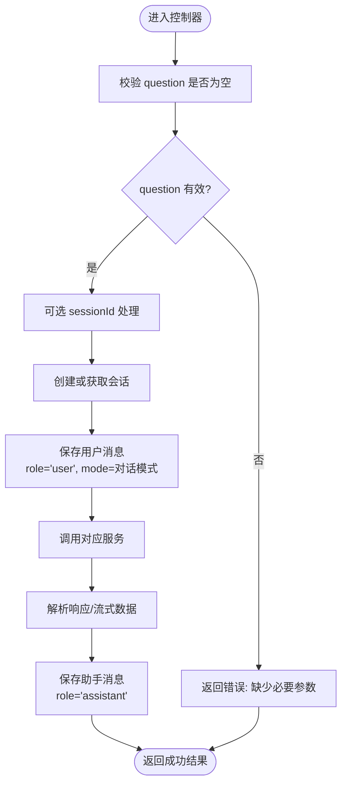
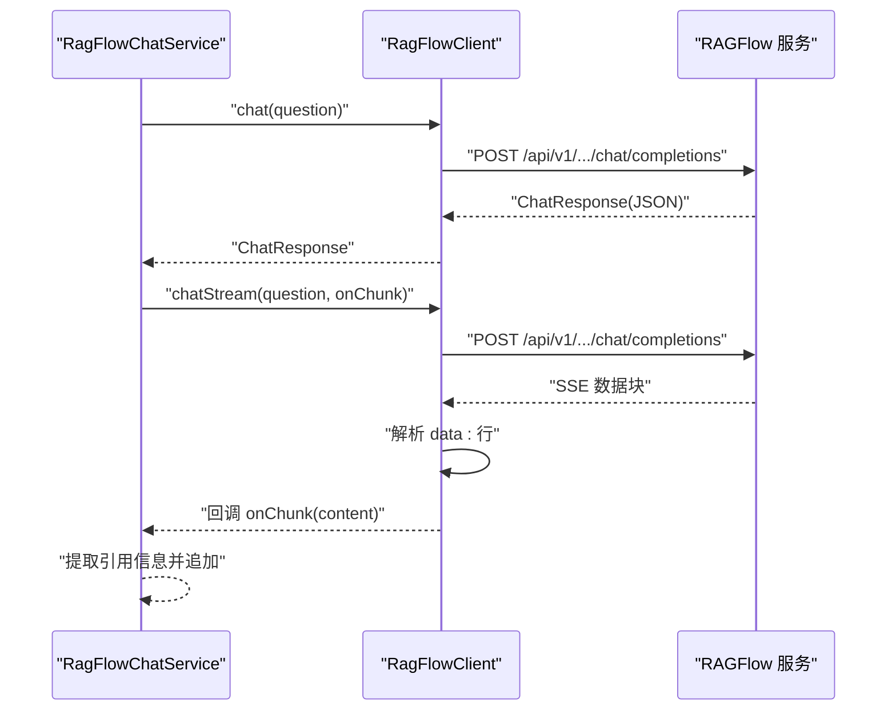
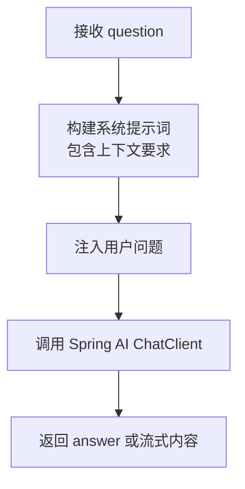
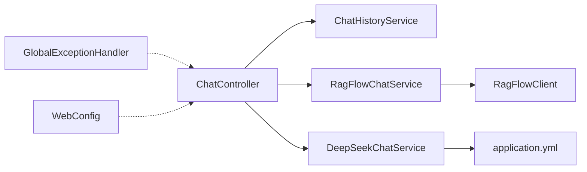

# 数据验证与约束

<cite>
**本文引用的文件**
- [ChatRequest.java](file://src/main/java/org/wiki/model/ChatRequest.java)
- [ChatMessage.java](file://src/main/java/org/wiki/model/ChatMessage.java)
- [ChatResponse.java](file://src/main/java/org/wiki/model/ChatResponse.java)
- [ChatChunk.java](file://src/main/java/org/wiki/model/ChatChunk.java)
- [Dataset.java](file://src/main/java/org/wiki/model/Dataset.java)
- [Document.java](file://src/main/java/org/wiki/model/Document.java)
- [RagFlowResult.java](file://src/main/java/org/wiki/model/RagFlowResult.java)
- [ChatController.java](file://src/main/java/org/wiki/controller/ChatController.java)
- [ChatHistoryService.java](file://src/main/java/org/wiki/service/ChatHistoryService.java)
- [RagFlowChatService.java](file://src/main/java/org/wiki/service/RagFlowChatService.java)
- [DeepSeekChatService.java](file://src/main/java/org/wiki/service/DeepSeekChatService.java)
- [RagFlowClient.java](file://src/main/java/org/wiki/client/RagFlowClient.java)
- [GlobalExceptionHandler.java](file://src/main/java/org/wiki/config/GlobalExceptionHandler.java)
- [WebConfig.java](file://src/main/java/org/wiki/config/WebConfig.java)
- [application.yml](file://src/main/resources/application.yml)
</cite>

## 目录
1. [简介](#简介)
2. [项目结构](#项目结构)
3. [核心组件](#核心组件)
4. [架构总览](#架构总览)
5. [详细组件分析](#详细组件分析)
6. [依赖分析](#依赖分析)
7. [性能考虑](#性能考虑)
8. [故障排查指南](#故障排查指南)
9. [结论](#结论)
10. [附录](#附录)

## 简介
本文件聚焦于本项目的“数据验证与业务约束”，系统梳理模型字段的验证规则（必填、类型、长度）、业务约束（角色值合法性、对话模式有效性）、数据完整性与外键关系、时间戳时序与并发控制、输入清理与过滤、异常处理与错误格式化、数据迁移与兼容性策略、以及缓存一致性与数据同步机制。文档以代码为依据，辅以图示帮助不同技术背景的读者理解。

## 项目结构
项目采用典型的分层架构：控制器层负责对外接口与参数接收；服务层封装业务流程与第三方调用；模型层定义数据结构；客户端层封装外部HTTP调用；配置层提供跨域与全局异常处理等横切能力。

图表来源
- [ChatController.java:1-276](file://src/main/java/org/wiki/controller/ChatController.java#L1-L276)
- [ChatHistoryService.java:1-88](file://src/main/java/org/wiki/service/ChatHistoryService.java#L1-L88)
- [RagFlowChatService.java:1-84](file://src/main/java/org/wiki/service/RagFlowChatService.java#L1-L84)
- [DeepSeekChatService.java:1-125](file://src/main/java/org/wiki/service/DeepSeekChatService.java#L1-L125)
- [RagFlowClient.java:1-231](file://src/main/java/org/wiki/client/RagFlowClient.java#L1-L231)
- [ChatMessage.java:1-82](file://src/main/java/org/wiki/model/ChatMessage.java#L1-L82)
- [ChatRequest.java:1-59](file://src/main/java/org/wiki/model/ChatRequest.java#L1-L59)
- [ChatResponse.java:1-52](file://src/main/java/org/wiki/model/ChatResponse.java#L1-L52)
- [ChatChunk.java:1-42](file://src/main/java/org/wiki/model/ChatChunk.java#L1-L42)
- [Dataset.java:1-33](file://src/main/java/org/wiki/model/Dataset.java#L1-L33)
- [Document.java:1-24](file://src/main/java/org/wiki/model/Document.java#L1-L24)
- [RagFlowResult.java:1-25](file://src/main/java/org/wiki/model/RagFlowResult.java#L1-L25)
- [GlobalExceptionHandler.java:1-46](file://src/main/java/org/wiki/config/GlobalExceptionHandler.java#L1-L46)
- [WebConfig.java:1-22](file://src/main/java/org/wiki/config/WebConfig.java#L1-L22)
- [application.yml:1-27](file://src/main/resources/application.yml#L1-L27)

章节来源
- [ChatController.java:1-276](file://src/main/java/org/wiki/controller/ChatController.java#L1-L276)
- [application.yml:1-27](file://src/main/resources/application.yml#L1-L27)

## 核心组件
- 模型层：定义了对话请求、响应、消息、Chunk、知识库与文档等数据结构，用于承载业务数据与传输协议。
- 控制器层：暴露REST接口，接收参数并协调服务层执行业务逻辑。
- 服务层：封装RAGFlow与DeepSeek调用、对话历史管理、流式输出处理。
- 客户端层：封装RAGFlow HTTP调用，统一鉴权头、超时与错误处理。
- 配置层：CORS跨域、全局异常处理、应用配置。

章节来源
- [ChatRequest.java:1-59](file://src/main/java/org/wiki/model/ChatRequest.java#L1-L59)
- [ChatMessage.java:1-82](file://src/main/java/org/wiki/model/ChatMessage.java#L1-L82)
- [ChatResponse.java:1-52](file://src/main/java/org/wiki/model/ChatResponse.java#L1-L52)
- [ChatChunk.java:1-42](file://src/main/java/org/wiki/model/ChatChunk.java#L1-L42)
- [Dataset.java:1-33](file://src/main/java/org/wiki/model/Dataset.java#L1-L33)
- [Document.java:1-24](file://src/main/java/org/wiki/model/Document.java#L1-L24)
- [RagFlowResult.java:1-25](file://src/main/java/org/wiki/model/RagFlowResult.java#L1-L25)
- [ChatController.java:1-276](file://src/main/java/org/wiki/controller/ChatController.java#L1-L276)
- [ChatHistoryService.java:1-88](file://src/main/java/org/wiki/service/ChatHistoryService.java#L1-L88)
- [RagFlowChatService.java:1-84](file://src/main/java/org/wiki/service/RagFlowChatService.java#L1-L84)
- [DeepSeekChatService.java:1-125](file://src/main/java/org/wiki/service/DeepSeekChatService.java#L1-L125)
- [RagFlowClient.java:1-231](file://src/main/java/org/wiki/client/RagFlowClient.java#L1-L231)
- [GlobalExceptionHandler.java:1-46](file://src/main/java/org/wiki/config/GlobalExceptionHandler.java#L1-L46)
- [WebConfig.java:1-22](file://src/main/java/org/wiki/config/WebConfig.java#L1-L22)
- [application.yml:1-27](file://src/main/resources/application.yml#L1-L27)

## 架构总览
下图展示对话流程中各组件之间的交互与数据流向，重点体现参数校验、业务约束、异常处理与流式输出路径。

图表来源
- [ChatController.java:1-276](file://src/main/java/org/wiki/controller/ChatController.java#L1-L276)
- [ChatHistoryService.java:1-88](file://src/main/java/org/wiki/service/ChatHistoryService.java#L1-L88)
- [RagFlowChatService.java:1-84](file://src/main/java/org/wiki/service/RagFlowChatService.java#L1-L84)
- [DeepSeekChatService.java:1-125](file://src/main/java/org/wiki/service/DeepSeekChatService.java#L1-L125)
- [RagFlowClient.java:1-231](file://src/main/java/org/wiki/client/RagFlowClient.java#L1-L231)

## 详细组件分析

### 模型字段验证规则与业务约束
- 必填字段检查
  - 控制器参数：question为必填；sessionId可选，若为空则由服务层创建新会话。
  - RAGFlow请求：ChatRequest.messages必须包含至少一条消息；ChatRequest.extraBody.reference为true以启用引用返回。
  - 消息模型：ChatMessage.role与content不能为空；mode需符合预设集合；createdAt为必填时间戳。
  - 知识库与文档：Dataset与Document模型字段均为字符串类型，未见显式非空校验注解，需在业务层保证。

- 数据类型验证
  - 所有模型字段为基本类型包装或字符串，序列化/反序列化由Fastjson与Spring MVC处理。
  - 时间戳字段：ChatMessage.createdAt为LocalDateTime；ChatResponse.usage为整数计数；ChatChunk.created为Long。

- 长度限制
  - 未设置固定长度限制；DeepSeek模型参数在配置文件中设置最大token数，间接限制输出长度。

- 业务逻辑约束
  - 角色值合法性：ChatMessage.role限定为"user"/"assistant"，控制器与消息构造方法均按此设定。
  - 对话模式合法性：ChatMessage.mode限定为"ragflow"/"deepseek"/"rag"，控制器在保存消息时写入对应模式。
  - 引用信息：RAGFlow请求开启reference=true，服务层解析引用并回传至客户端。

- 外键关系与完整性
  - 模型间未声明JPA注解或外键关系；sessionId在内存中作为会话标识，未与数据库建立外键约束。
  - 建议：生产环境应引入数据库持久化，并在消息表上建立对会话表的外键约束，确保引用完整性。

- 时间戳时序与并发控制
  - ChatMessage.createdAt使用当前时间写入，控制器在保存用户消息与助手消息时分别记录。
  - ChatHistoryService基于ConcurrentHashMap存储，线程安全；但未实现严格的时间序校验与并发锁。
  - 建议：引入数据库事务与唯一索引，避免并发写入导致的消息乱序与重复。

- 输入清理与过滤
  - 未发现专门的输入清洗或XSS过滤逻辑；建议在控制器层增加白名单过滤与长度截断策略。
  - 对RAGFlow返回的引用信息，服务层仅做存在性判断与拼接，未做深度净化。

- 错误消息格式化
  - 全局异常处理器统一返回包含success与message的对象；针对非法参数与IO异常设置相应状态码。
  - 控制器内部捕获异常时也返回包含success与message的结构，保持一致的错误格式。

- 缓存一致性与数据同步
  - 内存会话存储不具备持久化与跨实例共享能力；流式输出依赖SSE或Flux，客户端需正确处理中断与重连。
  - 建议：引入Redis等分布式缓存，结合版本号或ETag实现一致性校验与失效策略。

章节来源
- [ChatController.java:50-76](file://src/main/java/org/wiki/controller/ChatController.java#L50-L76)
- [ChatController.java:117-137](file://src/main/java/org/wiki/controller/ChatController.java#L117-L137)
- [ChatController.java:148-174](file://src/main/java/org/wiki/controller/ChatController.java#L148-L174)
- [ChatMessage.java:57-80](file://src/main/java/org/wiki/model/ChatMessage.java#L57-L80)
- [ChatRequest.java:39-57](file://src/main/java/org/wiki/model/ChatRequest.java#L39-L57)
- [ChatHistoryService.java:31-43](file://src/main/java/org/wiki/service/ChatHistoryService.java#L31-L43)
- [GlobalExceptionHandler.java:20-44](file://src/main/java/org/wiki/config/GlobalExceptionHandler.java#L20-L44)

### 对话请求与响应模型验证流程

图表来源
- [ChatController.java:50-76](file://src/main/java/org/wiki/controller/ChatController.java#L50-L76)
- [ChatController.java:117-137](file://src/main/java/org/wiki/controller/ChatController.java#L117-L137)
- [ChatController.java:148-174](file://src/main/java/org/wiki/controller/ChatController.java#L148-L174)
- [ChatMessage.java:57-80](file://src/main/java/org/wiki/model/ChatMessage.java#L57-L80)
- [ChatHistoryService.java:31-43](file://src/main/java/org/wiki/service/ChatHistoryService.java#L31-L43)

### RAGFlow 客户端调用与流式解析

图表来源
- [RagFlowChatService.java:50-72](file://src/main/java/org/wiki/service/RagFlowChatService.java#L50-L72)
- [RagFlowClient.java:154-200](file://src/main/java/org/wiki/client/RagFlowClient.java#L154-L200)
- [ChatChunk.java:1-42](file://src/main/java/org/wiki/model/ChatChunk.java#L1-L42)
- [ChatResponse.java:1-52](file://src/main/java/org/wiki/model/ChatResponse.java#L1-L52)

### DeepSeek 服务调用与提示词注入

图表来源
- [DeepSeekChatService.java:54-78](file://src/main/java/org/wiki/service/DeepSeekChatService.java#L54-L78)
- [DeepSeekChatService.java:101-123](file://src/main/java/org/wiki/service/DeepSeekChatService.java#L101-L123)

### 异常处理与错误格式化
- 全局异常处理器：
  - 捕获Exception与IOException，统一返回包含success与message的对象。
  - 针对IllegalArgumentException映射为400，包含"Unauthorized"的异常映射为401，其他IO异常映射为503。
- 控制器内部异常：
  - 在各对话接口中捕获异常并返回包含success与message的结果，保持前端一致的错误呈现。

章节来源
- [GlobalExceptionHandler.java:20-44](file://src/main/java/org/wiki/config/GlobalExceptionHandler.java#L20-L44)
- [ChatController.java:70-75](file://src/main/java/org/wiki/controller/ChatController.java#L70-L75)
- [ChatController.java:131-136](file://src/main/java/org/wiki/controller/ChatController.java#L131-L136)
- [ChatController.java:168-173](file://src/main/java/org/wiki/controller/ChatController.java#L168-L173)

### 数据迁移与兼容性检查
- 当前模型字段均为字符串类型，未见显式长度或格式约束；迁移时建议：
  - 明确字段长度上限与字符集要求，避免超长输入导致下游异常。
  - 对时间戳字段统一为LocalDateTime或Long，确保序列化/反序列化一致性。
  - 对枚举类（如role、mode）引入白名单校验与默认值策略，提升兼容性。
- 配置兼容性：
  - application.yml中定义了DeepSeek与RAGFlow的基础URL、API Key、chat选项与超时时间，迁移时需确保这些配置项在目标环境正确设置。

章节来源
- [application.yml:7-22](file://src/main/resources/application.yml#L7-L22)
- [ChatMessage.java:32-42](file://src/main/java/org/wiki/model/ChatMessage.java#L32-L42)
- [ChatRequest.java:22-37](file://src/main/java/org/wiki/model/ChatRequest.java#L22-L37)

### 缓存一致性与数据同步
- 现状：
  - ChatHistoryService基于内存Map存储，未实现持久化与跨实例同步。
  - 流式输出通过SSE或Flux实现，客户端需自行处理断线重连与顺序保证。
- 建议：
  - 引入Redis存储会话与消息，设置TTL与过期策略；对关键操作使用Lua脚本保证原子性。
  - 对流式输出增加事件ID与重放窗口，客户端按ID恢复消息顺序。
  - 在消息表上建立索引（sessionId, createdAt），优化查询与清理。

章节来源
- [ChatHistoryService.java:21-43](file://src/main/java/org/wiki/service/ChatHistoryService.java#L21-L43)
- [ChatController.java:85-107](file://src/main/java/org/wiki/controller/ChatController.java#L85-L107)
- [ChatController.java:238-274](file://src/main/java/org/wiki/controller/ChatController.java#L238-L274)

## 依赖分析
- 组件耦合
  - ChatController依赖ChatHistoryService、RagFlowChatService、DeepSeekChatService，形成清晰的业务编排。
  - RagFlowChatService依赖RagFlowClient，负责请求组装与响应解析。
  - DeepSeekChatService依赖Spring AI框架，负责提示词注入与流式输出。
- 外部依赖
  - OkHttp用于RAGFlow HTTP调用；Fastjson用于JSON序列化；Spring Web用于MVC与SSE；Spring AI用于OpenAI兼容对话。
- 风险点
  - 内存会话存储在多实例部署下不可用；需替换为分布式缓存或数据库。
  - 缺少输入清洗与长度限制，存在注入与资源耗尽风险。

图表来源
- [ChatController.java:37-41](file://src/main/java/org/wiki/controller/ChatController.java#L37-L41)
- [RagFlowChatService.java:22-24](file://src/main/java/org/wiki/service/RagFlowChatService.java#L22-L24)
- [RagFlowClient.java:28-35](file://src/main/java/org/wiki/client/RagFlowClient.java#L28-L35)
- [DeepSeekChatService.java:26-28](file://src/main/java/org/wiki/service/DeepSeekChatService.java#L26-L28)
- [GlobalExceptionHandler.java:16-18](file://src/main/java/org/wiki/config/GlobalExceptionHandler.java#L16-L18)
- [WebConfig.java:11-22](file://src/main/java/org/wiki/config/WebConfig.java#L11-L22)

章节来源
- [ChatController.java:37-41](file://src/main/java/org/wiki/controller/ChatController.java#L37-L41)
- [RagFlowChatService.java:22-24](file://src/main/java/org/wiki/service/RagFlowChatService.java#L22-L24)
- [RagFlowClient.java:28-35](file://src/main/java/org/wiki/client/RagFlowClient.java#L28-L35)
- [DeepSeekChatService.java:26-28](file://src/main/java/org/wiki/service/DeepSeekChatService.java#L26-L28)
- [GlobalExceptionHandler.java:16-18](file://src/main/java/org/wiki/config/GlobalExceptionHandler.java#L16-L18)
- [WebConfig.java:11-22](file://src/main/java/org/wiki/config/WebConfig.java#L11-L22)

## 性能考虑
- 流式输出
  - RAGFlow与DeepSeek均支持流式输出，减少首字节延迟；建议客户端侧缓冲与背压处理。
- 超时与重试
  - RAGFlow客户端读超时可配置；建议在服务层增加指数退避重试与熔断策略。
- 并发与限流
  - 控制器使用线程池处理流式任务；建议引入令牌桶限流与队列长度限制，避免资源耗尽。
- 缓存与压缩
  - 对频繁查询的会话摘要可引入Redis缓存；SSE响应可启用Gzip压缩以降低带宽。

## 故障排查指南
- 常见错误与定位
  - IO异常：通常来自RAGFlow API调用失败，检查基础URL、API Key与chatId是否正确。
  - 参数缺失：question为空会导致控制器返回错误，确认前端参数传递。
  - 会话异常：sessionId不存在或被清理，检查会话生命周期与存储策略。
- 日志与监控
  - 控制器与服务层均输出请求与响应日志，便于定位问题；建议接入统一日志平台与指标监控。
- 修复建议
  - 对输入参数增加白名单与长度限制；对引用信息进行安全过滤；在生产环境替换内存存储为数据库或Redis。

章节来源
- [GlobalExceptionHandler.java:37-44](file://src/main/java/org/wiki/config/GlobalExceptionHandler.java#L37-L44)
- [RagFlowClient.java:49-56](file://src/main/java/org/wiki/client/RagFlowClient.java#L49-L56)
- [RagFlowClient.java:175-179](file://src/main/java/org/wiki/client/RagFlowClient.java#L175-L179)
- [application.yml:17-22](file://src/main/resources/application.yml#L17-L22)

## 结论
本项目在模型设计上简洁清晰，业务流程通过控制器与服务层有效分离；但在数据验证、输入过滤、并发控制与持久化方面仍有改进空间。建议补充参数校验、输入清洗、数据库外键约束、分布式缓存与流式一致性保障，以提升系统的健壮性与可维护性。

## 附录
- 关键字段清单与约束建议
  - ChatMessage
    - 必填：sessionId、role、content、mode、createdAt
    - 角色：user/assistant
    - 模式：ragflow/deepseek/rag
    - 建议：引入枚举与白名单校验，添加长度限制与XSS过滤
  - ChatRequest
    - 必填：messages（至少一条），extraBody.reference=true
    - 建议：对content长度与特殊字符进行限制
  - ChatResponse/ChatChunk
    - 注意引用信息与增量内容的解析边界
  - Dataset/Document
    - 建议：明确字段长度与字符集，增加唯一索引与校验
- 跨域与异常
  - WebConfig已配置CORS；全局异常处理器统一错误格式，便于前端一致处理