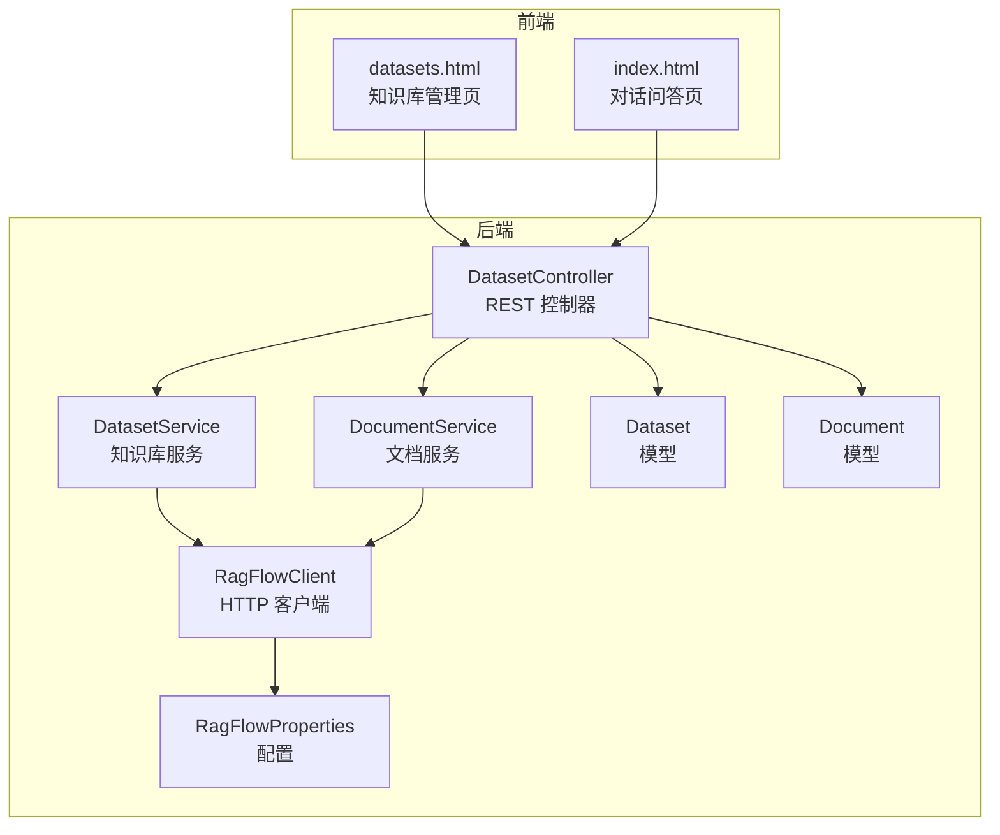
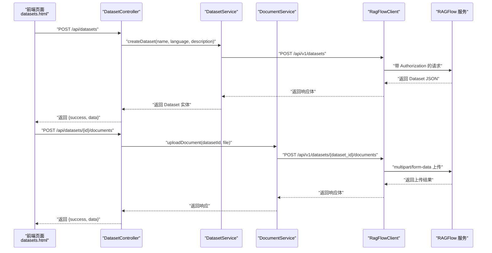
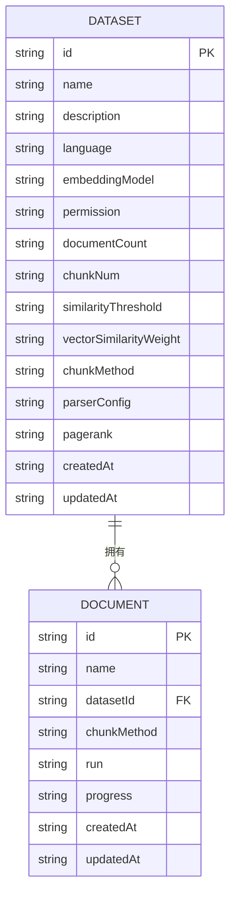
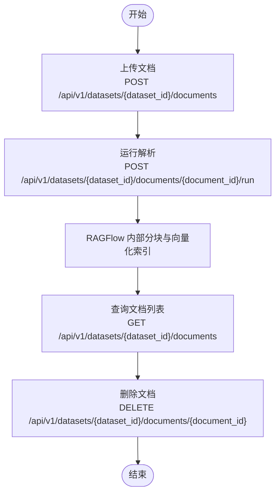
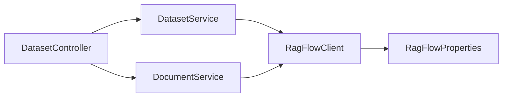

# 知识库数据模型

<cite>
**本文引用的文件**
- [Dataset.java](file://src/main/java/org/wiki/model/Dataset.java)
- [Document.java](file://src/main/java/org/wiki/model/Document.java)
- [DatasetService.java](file://src/main/java/org/wiki/service/DatasetService.java)
- [DocumentService.java](file://src/main/java/org/wiki/service/DocumentService.java)
- [RagFlowClient.java](file://src/main/java/org/wiki/client/RagFlowClient.java)
- [DatasetController.java](file://src/main/java/org/wiki/controller/DatasetController.java)
- [RagFlowProperties.java](file://src/main/java/org/wiki/config/RagFlowProperties.java)
- [application.yml](file://src/main/resources/application.yml)
- [datasets.html](file://src/main/resources/templates/datasets.html)
- [index.html](file://src/main/resources/templates/index.html)
</cite>

## 目录
1. [简介](#简介)
2. [项目结构](#项目结构)
3. [核心组件](#核心组件)
4. [架构总览](#架构总览)
5. [详细组件分析](#详细组件分析)
6. [依赖关系分析](#依赖关系分析)
7. [性能考量](#性能考量)
8. [故障排查指南](#故障排查指南)
9. [结论](#结论)
10. [附录](#附录)

## 简介
本文件面向“知识库数据模型”的设计与实现，聚焦于以下目标：
- 深入解释 Dataset 模型的完整结构（标识、名称、描述、状态与元数据字段）
- 详细说明 Document 模型的属性定义（标识、标题、内容、大小、格式、解析状态等）
- 描述知识库与文档之间的一对多关系及数据关联方式
- 解释文档生命周期管理（上传、解析、索引、删除）
- 说明文档内容的存储格式与索引策略（基于 RAGFlow 的分块与向量化）
- 提供知识库配置参数与容量限制建议
- 包含文档分类、标签管理与搜索优化机制的实践建议
- 解释数据完整性检查与一致性保证

## 项目结构
该项目采用 Spring Boot 结构，围绕 RAGFlow 服务进行封装，提供知识库与文档的增删改查、上传与解析能力，并通过前端页面进行可视化操作。

图表来源
- [DatasetController.java:23-196](file://src/main/java/org/wiki/controller/DatasetController.java#L23-L196)
- [DatasetService.java:19-127](file://src/main/java/org/wiki/service/DatasetService.java#L19-L127)
- [DocumentService.java:19-97](file://src/main/java/org/wiki/service/DocumentService.java#L19-L97)
- [RagFlowClient.java:23-230](file://src/main/java/org/wiki/client/RagFlowClient.java#L23-L230)
- [RagFlowProperties.java:10-31](file://src/main/java/org/wiki/config/RagFlowProperties.java#L10-L31)
- [Dataset.java:13-32](file://src/main/java/org/wiki/model/Dataset.java#L13-L32)
- [Document.java:13-23](file://src/main/java/org/wiki/model/Document.java#L13-L23)
- [datasets.html:146-332](file://src/main/resources/templates/datasets.html#L146-L332)
- [index.html:145-326](file://src/main/resources/templates/index.html#L145-L326)

章节来源
- [DatasetController.java:23-196](file://src/main/java/org/wiki/controller/DatasetController.java#L23-L196)
- [DatasetService.java:19-127](file://src/main/java/org/wiki/service/DatasetService.java#L19-L127)
- [DocumentService.java:19-97](file://src/main/java/org/wiki/service/DocumentService.java#L19-L97)
- [RagFlowClient.java:23-230](file://src/main/java/org/wiki/client/RagFlowClient.java#L23-L230)
- [RagFlowProperties.java:10-31](file://src/main/java/org/wiki/config/RagFlowProperties.java#L10-L31)
- [Dataset.java:13-32](file://src/main/java/org/wiki/model/Dataset.java#L13-L32)
- [Document.java:13-23](file://src/main/java/org/wiki/model/Document.java#L13-L23)
- [datasets.html:146-332](file://src/main/resources/templates/datasets.html#L146-L332)
- [index.html:145-326](file://src/main/resources/templates/index.html#L145-L326)

## 核心组件
- Dataset 模型：承载知识库的基本信息与元数据，包括标识、名称、头像、租户、描述、语言、嵌入模型、权限、文档计数、分块数量、相似度阈值、向量权重、分块方法、解析配置、PageRank、创建与更新时间等。
- Document 模型：承载文档的基本信息与处理状态，包括标识、名称、所属知识库标识、分块方法、运行状态、进度、创建与更新时间等。
- DatasetService：封装知识库的创建、查询、更新、删除等 API 调用。
- DocumentService：封装文档上传、查询、删除、运行解析等 API 调用。
- RagFlowClient：统一发起 HTTP 请求，支持 GET/POST/PUT/DELETE 与文件上传，携带认证头与超时设置。
- RagFlowProperties：读取 application.yml 中的 RAGFlow 服务地址、API Key、聊天助手 ID、请求超时等配置。
- 前端模板：datasets.html 展示知识库与文档管理；index.html 提供对话问答界面。

章节来源
- [Dataset.java:13-32](file://src/main/java/org/wiki/model/Dataset.java#L13-L32)
- [Document.java:13-23](file://src/main/java/org/wiki/model/Document.java#L13-L23)
- [DatasetService.java:19-127](file://src/main/java/org/wiki/service/DatasetService.java#L19-L127)
- [DocumentService.java:19-97](file://src/main/java/org/wiki/service/DocumentService.java#L19-L97)
- [RagFlowClient.java:23-230](file://src/main/java/org/wiki/client/RagFlowClient.java#L23-L230)
- [RagFlowProperties.java:10-31](file://src/main/java/org/wiki/config/RagFlowProperties.java#L10-L31)
- [datasets.html:146-332](file://src/main/resources/templates/datasets.html#L146-L332)
- [index.html:145-326](file://src/main/resources/templates/index.html#L145-L326)

## 架构总览
后端通过 DatasetController 暴露 REST 接口，DatasetService 与 DocumentService 分别调用 RagFlowClient 访问 RAGFlow 服务。RagFlowClient 从 RagFlowProperties 读取基础地址、API Key、超时等配置，统一添加认证头并执行 HTTP 请求。前端通过 datasets.html 与 index.html 与后端交互，完成知识库与文档的管理与问答。

图表来源
- [DatasetController.java:41-135](file://src/main/java/org/wiki/controller/DatasetController.java#L41-L135)
- [DatasetService.java:37-53](file://src/main/java/org/wiki/service/DatasetService.java#L37-L53)
- [DocumentService.java:33-37](file://src/main/java/org/wiki/service/DocumentService.java#L33-L37)
- [RagFlowClient.java:206-229](file://src/main/java/org/wiki/client/RagFlowClient.java#L206-L229)
- [application.yml:18-22](file://src/main/resources/application.yml#L18-L22)

章节来源
- [DatasetController.java:41-135](file://src/main/java/org/wiki/controller/DatasetController.java#L41-L135)
- [DatasetService.java:37-53](file://src/main/java/org/wiki/service/DatasetService.java#L37-L53)
- [DocumentService.java:33-37](file://src/main/java/org/wiki/service/DocumentService.java#L33-L37)
- [RagFlowClient.java:206-229](file://src/main/java/org/wiki/client/RagFlowClient.java#L206-L229)
- [application.yml:18-22](file://src/main/resources/application.yml#L18-L22)

## 详细组件分析

### Dataset 模型详解
- 字段说明
  - id：知识库唯一标识
  - name：知识库名称
  - avatar：头像（字符串形式）
  - tenantId：租户标识
  - description：描述
  - language：语言（如 Chinese/English）
  - embeddingModel：嵌入模型名称
  - permission：访问权限
  - documentCount：文档数量（字符串）
  - chunkNum：分块数量（字符串）
  - similarityThreshold：相似度阈值（字符串）
  - vectorSimilarityWeight：向量相似度权重（字符串）
  - chunkMethod：分块方法（字符串）
  - parserConfig：解析配置（字符串）
  - pagerank：PageRank（字符串）
  - createdAt/updatedAt：创建与更新时间（字符串）

- 设计要点
  - 所有字段均为字符串类型，便于与 RAGFlow 返回的 JSON 字段保持一致，减少类型转换开销。
  - 保留了与 RAGFlow API 对齐的关键元数据字段，便于后续扩展与配置。

- 复杂度与性能
  - 作为 DTO，无复杂算法，内存占用极低。
  - 字符串字段便于序列化/反序列化，适合网络传输。

章节来源
- [Dataset.java:13-32](file://src/main/java/org/wiki/model/Dataset.java#L13-L32)

### Document 模型详解
- 字段说明
  - id：文档唯一标识
  - name：文档名称
  - datasetId：所属知识库标识
  - chunkMethod：分块方法（字符串）
  - run：运行/解析状态（字符串）
  - progress：解析进度（字符串）
  - createdAt/updatedAt：创建与更新时间（字符串）

- 设计要点
  - 与 Dataset 保持一致的字符串字段风格，便于与 RAGFlow API 交互。
  - run 与 progress 字段用于前端展示文档解析状态，便于用户感知处理进度。

- 复杂度与性能
  - 作为轻量 DTO，内存与序列化开销小。
  - 与 Dataset 的一对多关系通过 datasetId 关联。

章节来源
- [Document.java:13-23](file://src/main/java/org/wiki/model/Document.java#L13-L23)

### 知识库与文档的一对多关系
- 关系定义
  - 一个 Dataset 可包含多个 Document，通过 Document.datasetId 关联到 Dataset.id。
- 数据关联
  - 后端通过 DatasetController 的路径参数 datasetId 与 DocumentService 的 listDocuments/runDocument/deleteDocument 等方法配合，实现对某知识库下文档的查询、解析与删除。
- 前端展示
  - datasets.html 在点击“查看文档”时，调用 GET /api/datasets/{datasetId}/documents，展示该知识库下的文档列表，并显示 run 与 progress 状态。

图表来源
- [Dataset.java:13-32](file://src/main/java/org/wiki/model/Dataset.java#L13-L32)
- [Document.java:13-23](file://src/main/java/org/wiki/model/Document.java#L13-L23)
- [DatasetController.java:141-154](file://src/main/java/org/wiki/controller/DatasetController.java#L141-L154)

章节来源
- [Dataset.java:13-32](file://src/main/java/org/wiki/model/Dataset.java#L13-L32)
- [Document.java:13-23](file://src/main/java/org/wiki/model/Document.java#L13-L23)
- [DatasetController.java:141-154](file://src/main/java/org/wiki/controller/DatasetController.java#L141-L154)

### 文档生命周期管理
- 生命周期阶段
  - 上传：将文件以 multipart/form-data 形式上传至 /api/v1/datasets/{dataset_id}/documents
  - 解析：调用 /api/v1/datasets/{dataset_id}/documents/{document_id}/run 触发解析与分块
  - 索引：解析完成后，RAGFlow 将文档内容切分为 chunks 并建立向量索引（由 RAGFlow 内部处理）
  - 删除：调用 /api/v1/datasets/{dataset_id}/documents/{document_id} 删除文档
- 控制器与服务
  - DatasetController 提供 /api/datasets/{datasetId}/documents、/api/datasets/{datasetId}/documents/{documentId}/run、/api/datasets/{datasetId}/documents/{documentId} 等路由
  - DocumentService 封装上传、查询、删除、运行解析等调用
  - RagFlowClient 统一处理 HTTP 请求与认证头

图表来源
- [DocumentService.java:33-96](file://src/main/java/org/wiki/service/DocumentService.java#L33-L96)
- [DatasetController.java:120-195](file://src/main/java/org/wiki/controller/DatasetController.java#L120-L195)
- [RagFlowClient.java:206-229](file://src/main/java/org/wiki/client/RagFlowClient.java#L206-L229)

章节来源
- [DocumentService.java:33-96](file://src/main/java/org/wiki/service/DocumentService.java#L33-L96)
- [DatasetController.java:120-195](file://src/main/java/org/wiki/controller/DatasetController.java#L120-L195)
- [RagFlowClient.java:206-229](file://src/main/java/org/wiki/client/RagFlowClient.java#L206-L229)

### 文档内容存储格式与索引策略
- 存储格式
  - 上传采用 multipart/form-data，文件名与字节流由 RagFlowClient 构造并发送
- 索引策略
  - 解析阶段由 RAGFlow 内部完成分块（chunkMethod）、向量化（embeddingModel）与索引构建
  - 前端通过 run 与 progress 字段反馈解析状态，便于用户感知进度
- 配置项
  - Dataset.embeddingModel：嵌入模型
  - Dataset.chunkMethod：分块方法
  - Dataset.similarityThreshold、Dataset.vectorSimilarityWeight：检索相关性配置
  - Dataset.parserConfig：解析器配置（字符串，可承载 JSON 或键值对）

章节来源
- [RagFlowClient.java:206-229](file://src/main/java/org/wiki/client/RagFlowClient.java#L206-L229)
- [Dataset.java:13-32](file://src/main/java/org/wiki/model/Dataset.java#L13-L32)
- [Document.java:13-23](file://src/main/java/org/wiki/model/Document.java#L13-L23)
- [datasets.html:225-251](file://src/main/resources/templates/datasets.html#L225-L251)

### 知识库配置参数与容量限制
- 配置参数
  - 基础地址：ragflow.base-url
  - API Key：ragflow.api-key
  - 聊天助手 ID：ragflow.chat-id
  - 请求超时：ragflow.timeout
- 容量限制
  - 仓库未提供明确的容量限制参数；实际限制取决于 RAGFlow 服务端配置与资源配额
- 建议
  - 在 application.yml 中合理设置超时时间，避免长时间阻塞
  - 通过 Dataset.embeddingModel 与 chunkMethod 等字段在知识库层面进行策略配置

章节来源
- [application.yml:18-22](file://src/main/resources/application.yml#L18-L22)
- [RagFlowProperties.java:10-31](file://src/main/java/org/wiki/config/RagFlowProperties.java#L10-L31)
- [Dataset.java:13-32](file://src/main/java/org/wiki/model/Dataset.java#L13-L32)

### 文档分类、标签管理与搜索优化
- 分类与标签
  - 当前模型未提供专门的分类或标签字段；可通过文档名称、描述或解析配置（parserConfig）间接表达分类意图
- 搜索优化
  - 通过 similarityThreshold 与 vectorSimilarityWeight 调整检索相关性
  - 通过 embeddingModel 与 chunkMethod 优化分块与向量化质量
- 建议
  - 在文档命名中体现主题类别，便于检索与筛选
  - 使用 parserConfig 传递解析规则（如分段策略、特殊格式处理），提升检索质量

章节来源
- [Dataset.java:13-32](file://src/main/java/org/wiki/model/Dataset.java#L13-L32)
- [datasets.html:225-251](file://src/main/resources/templates/datasets.html#L225-L251)

### 数据完整性检查与一致性保证
- 完整性检查
  - 服务层在调用 RAGFlow API 后校验返回码（code），非 0 则抛出异常并记录错误日志
  - 文件上传前进行存在性检查（本地文件场景）
- 一致性保证
  - 前端通过定时刷新（如解析后延迟刷新文档列表）确保 UI 与后端状态一致
  - 控制器返回统一的 {success, data/message} 结构，便于前端判断操作结果

章节来源
- [DatasetService.java:48-50](file://src/main/java/org/wiki/service/DatasetService.java#L48-L50)
- [DocumentService.java:44-49](file://src/main/java/org/wiki/service/DocumentService.java#L44-L49)
- [DatasetController.java:52-56](file://src/main/java/org/wiki/controller/DatasetController.java#L52-L56)

## 依赖关系分析
- 组件耦合
  - DatasetController 依赖 DatasetService 与 DocumentService
  - DatasetService 与 DocumentService 依赖 RagFlowClient
  - RagFlowClient 依赖 RagFlowProperties
- 外部依赖
  - RAGFlow 服务端：负责知识库、文档、解析与检索
  - OkHttp：用于 HTTP 请求
  - FastJSON2：用于 JSON 序列化/反序列化
- 循环依赖
  - 未发现循环依赖，职责清晰

图表来源
- [DatasetController.java:23-35](file://src/main/java/org/wiki/controller/DatasetController.java#L23-L35)
- [DatasetService.java:23-27](file://src/main/java/org/wiki/service/DatasetService.java#L23-L27)
- [DocumentService.java:23-27](file://src/main/java/org/wiki/service/DocumentService.java#L23-L27)
- [RagFlowClient.java:25-35](file://src/main/java/org/wiki/client/RagFlowClient.java#L25-L35)
- [RagFlowProperties.java:10-31](file://src/main/java/org/wiki/config/RagFlowProperties.java#L10-L31)

章节来源
- [DatasetController.java:23-35](file://src/main/java/org/wiki/controller/DatasetController.java#L23-L35)
- [DatasetService.java:23-27](file://src/main/java/org/wiki/service/DatasetService.java#L23-L27)
- [DocumentService.java:23-27](file://src/main/java/org/wiki/service/DocumentService.java#L23-L27)
- [RagFlowClient.java:25-35](file://src/main/java/org/wiki/client/RagFlowClient.java#L25-L35)
- [RagFlowProperties.java:10-31](file://src/main/java/org/wiki/config/RagFlowProperties.java#L10-L31)

## 性能考量
- HTTP 超时与连接池
  - OkHttp 客户端设置了连接与读取超时，避免长时间阻塞
- JSON 序列化
  - 使用 FastJSON2，具备较好的性能与兼容性
- 前端轮询
  - 解析完成后通过定时刷新确保 UI 与后端状态一致，避免频繁轮询带来的压力
- 建议
  - 对于大批量文档上传，建议分批进行并监控解析进度
  - 合理设置 ragflow.timeout，平衡响应速度与稳定性

章节来源
- [RagFlowClient.java:30-34](file://src/main/java/org/wiki/client/RagFlowClient.java#L30-L34)
- [application.yml:22-22](file://src/main/resources/application.yml#L22-L22)
- [datasets.html:287-287](file://src/main/resources/templates/datasets.html#L287-L287)

## 故障排查指南
- 常见错误与定位
  - RAGFlow API 调用失败：检查 baseUrl、apiKey、chatId 配置是否正确
  - 上传文件失败：确认文件存在且大小在服务端允许范围内
  - 解析状态异常：关注 run 与 progress 字段，必要时重新触发解析
- 日志与返回
  - 控制器捕获异常并返回 {success, message}，便于前端提示
  - 客户端记录调试日志，包含状态码与响应体

章节来源
- [RagFlowClient.java:50-56](file://src/main/java/org/wiki/client/RagFlowClient.java#L50-L56)
- [DatasetService.java:48-50](file://src/main/java/org/wiki/service/DatasetService.java#L48-L50)
- [DocumentService.java:46-49](file://src/main/java/org/wiki/service/DocumentService.java#L46-L49)
- [DatasetController.java:52-56](file://src/main/java/org/wiki/controller/DatasetController.java#L52-L56)

## 结论
本项目通过简洁的数据模型与清晰的服务边界，实现了对 RAGFlow 知识库与文档的完整生命周期管理。Dataset 与 Document 模型以字符串字段适配 RAGFlow API，结合 DatasetController 与 DocumentService 的 REST 接口，满足上传、解析、索引与删除等核心需求。通过配置参数与检索相关性字段，可在知识库层面进行策略优化。前端模板提供了直观的操作界面，配合后端统一的错误返回与日志记录，有助于快速定位与解决问题。

## 附录
- 关键 API 路径
  - 创建知识库：POST /api/v1/datasets
  - 获取知识库列表：GET /api/v1/datasets
  - 获取知识库详情：GET /api/v1/datasets/{dataset_id}
  - 删除知识库：DELETE /api/v1/datasets/{dataset_id}
  - 上传文档：POST /api/v1/datasets/{dataset_id}/documents
  - 获取文档列表：GET /api/v1/datasets/{dataset_id}/documents
  - 删除文档：DELETE /api/v1/datasets/{dataset_id}/documents/{document_id}
  - 运行解析：POST /api/v1/datasets/{dataset_id}/documents/{document_id}/run

章节来源
- [DatasetService.java:37-126](file://src/main/java/org/wiki/service/DatasetService.java#L37-L126)
- [DocumentService.java:33-96](file://src/main/java/org/wiki/service/DocumentService.java#L33-L96)
- [DatasetController.java:41-195](file://src/main/java/org/wiki/controller/DatasetController.java#L41-L195)