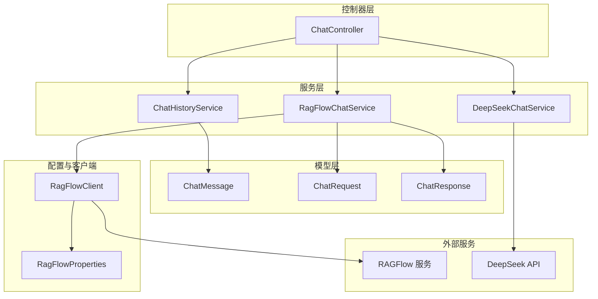
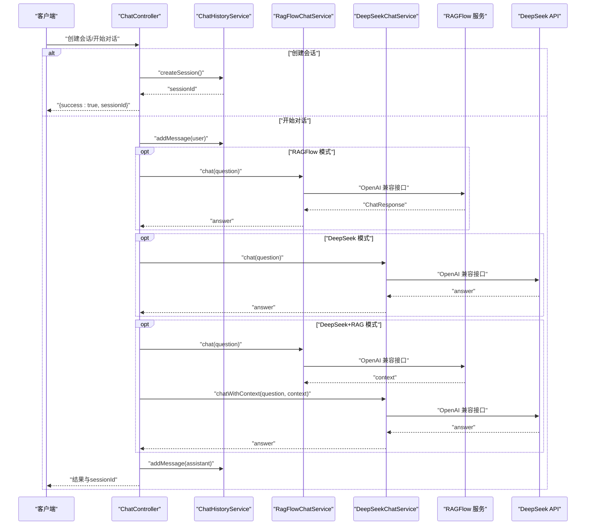
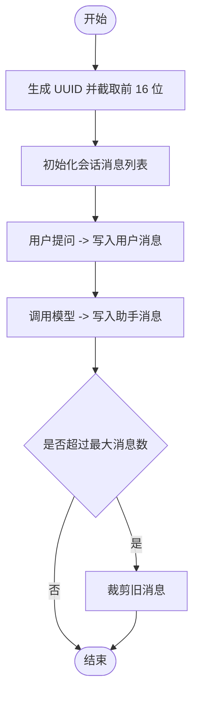
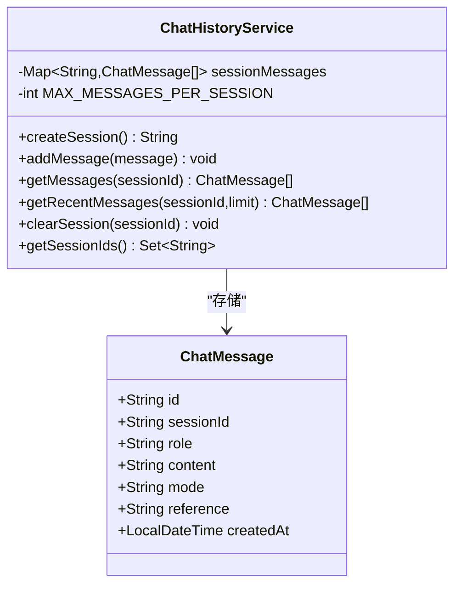
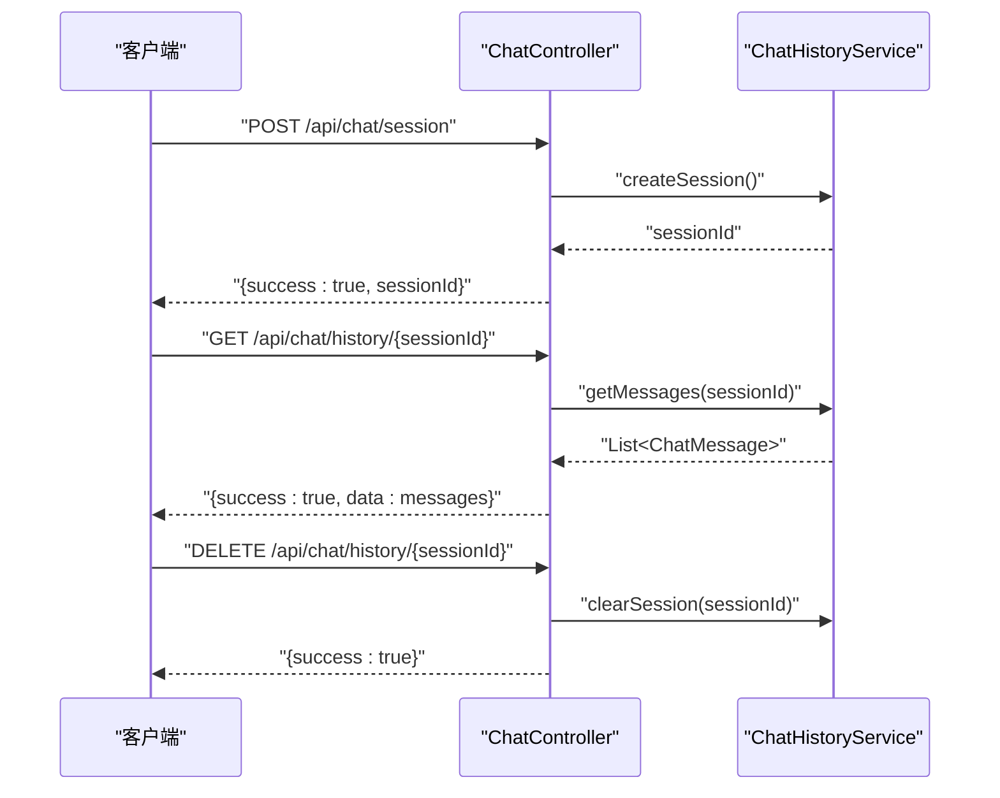
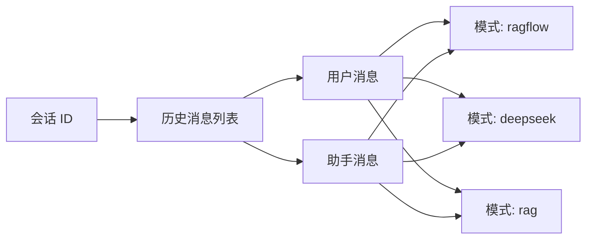
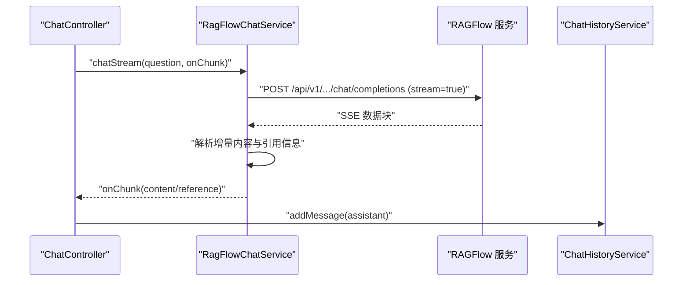
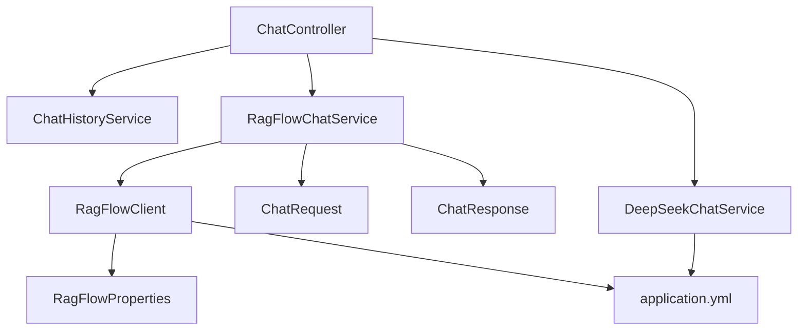

# 会话管理

<cite>
**本文档引用的文件**
- [ChatHistoryService.java](file://src/main/java/org/wiki/service/ChatHistoryService.java)
- [ChatMessage.java](file://src/main/java/org/wiki/model/ChatMessage.java)
- [ChatController.java](file://src/main/java/org/wiki/controller/ChatController.java)
- [RagFlowChatService.java](file://src/main/java/org/wiki/service/RagFlowChatService.java)
- [DeepSeekChatService.java](file://src/main/java/org/wiki/service/DeepSeekChatService.java)
- [RagFlowClient.java](file://src/main/java/org/wiki/client/RagFlowClient.java)
- [ChatRequest.java](file://src/main/java/org/wiki/model/ChatRequest.java)
- [ChatResponse.java](file://src/main/java/org/wiki/model/ChatResponse.java)
- [RagFlowProperties.java](file://src/main/java/org/wiki/config/RagFlowProperties.java)
- [application.yml](file://src/main/resources/application.yml)
</cite>

## 目录
1. [简介](#简介)
2. [项目结构](#项目结构)
3. [核心组件](#核心组件)
4. [架构总览](#架构总览)
5. [详细组件分析](#详细组件分析)
6. [依赖关系分析](#依赖关系分析)
7. [性能考量](#性能考量)
8. [故障排查指南](#故障排查指南)
9. [结论](#结论)
10. [附录](#附录)

## 简介
本文件围绕 DeepSeek + RAGFlow 系统的会话管理功能展开，重点阐述以下方面：
- 会话的创建、维护与清理机制，包括会话 ID 的生成规则与生命周期管理
- 对话历史的存储结构，涵盖用户消息与助手消息的格式定义
- 内存存储方案的选择原因与性能考量
- 会话管理 API 的完整说明，包括创建会话、获取历史记录与清空会话等
- 会话状态的持久化策略与内存管理机制
- 会话与不同对话模式的兼容性，以及在多种对话模式间共享会话历史的方法
- 会话管理的扩展建议与自定义存储方案的实现思路

## 项目结构
系统采用典型的分层架构，会话管理位于服务层，控制器负责对外暴露 API，模型用于数据传输，客户端封装外部服务调用。

图表来源
- [ChatController.java:1-276](file://src/main/java/org/wiki/controller/ChatController.java#L1-276)
- [ChatHistoryService.java:1-88](file://src/main/java/org/wiki/service/ChatHistoryService.java#L1-88)
- [RagFlowChatService.java:1-84](file://src/main/java/org/wiki/service/RagFlowChatService.java#L1-84)
- [DeepSeekChatService.java:1-125](file://src/main/java/org/wiki/service/DeepSeekChatService.java#L1-125)
- [RagFlowClient.java:1-231](file://src/main/java/org/wiki/client/RagFlowClient.java#L1-231)
- [ChatMessage.java:1-82](file://src/main/java/org/wiki/model/ChatMessage.java#L1-82)
- [ChatRequest.java:1-59](file://src/main/java/org/wiki/model/ChatRequest.java#L1-59)
- [ChatResponse.java:1-52](file://src/main/java/org/wiki/model/ChatResponse.java#L1-52)
- [RagFlowProperties.java:1-32](file://src/main/java/org/wiki/config/RagFlowProperties.java#L1-32)

章节来源
- [ChatController.java:1-276](file://src/main/java/org/wiki/controller/ChatController.java#L1-276)
- [ChatHistoryService.java:1-88](file://src/main/java/org/wiki/service/ChatHistoryService.java#L1-88)
- [RagFlowChatService.java:1-84](file://src/main/java/org/wiki/service/RagFlowChatService.java#L1-84)
- [DeepSeekChatService.java:1-125](file://src/main/java/org/wiki/service/DeepSeekChatService.java#L1-125)
- [RagFlowClient.java:1-231](file://src/main/java/org/wiki/client/RagFlowClient.java#L1-231)
- [ChatMessage.java:1-82](file://src/main/java/org/wiki/model/ChatMessage.java#L1-82)
- [ChatRequest.java:1-59](file://src/main/java/org/wiki/model/ChatRequest.java#L1-59)
- [ChatResponse.java:1-52](file://src/main/java/org/wiki/model/ChatResponse.java#L1-52)
- [RagFlowProperties.java:1-32](file://src/main/java/org/wiki/config/RagFlowProperties.java#L1-32)
- [application.yml:1-27](file://src/main/resources/application.yml#L1-27)

## 核心组件
- 会话历史服务：基于内存的会话消息存储，支持添加消息、获取历史、清空会话、创建会话等操作
- 会话消息模型：统一描述用户消息与助手消息，包含角色、内容、会话 ID、对话模式、引用信息与创建时间
- 控制器：对外提供会话管理与对话 API，支持三种对话模式（RAGFlow、DeepSeek、DeepSeek+RAG）
- RAGFlow 服务：封装 RAGFlow 的 OpenAI 兼容接口，支持非流式与流式问答
- DeepSeek 服务：通过 Spring AI 框架调用 DeepSeek API，支持纯对话、RAG 增强与流式输出
- 客户端与配置：RAGFlow 客户端封装 HTTP 调用，RAGFlow 配置读取 application.yml 中的连接参数

章节来源
- [ChatHistoryService.java:1-88](file://src/main/java/org/wiki/service/ChatHistoryService.java#L1-88)
- [ChatMessage.java:1-82](file://src/main/java/org/wiki/model/ChatMessage.java#L1-82)
- [ChatController.java:1-276](file://src/main/java/org/wiki/controller/ChatController.java#L1-276)
- [RagFlowChatService.java:1-84](file://src/main/java/org/wiki/service/RagFlowChatService.java#L1-84)
- [DeepSeekChatService.java:1-125](file://src/main/java/org/wiki/service/DeepSeekChatService.java#L1-125)
- [RagFlowClient.java:1-231](file://src/main/java/org/wiki/client/RagFlowClient.java#L1-231)
- [RagFlowProperties.java:1-32](file://src/main/java/org/wiki/config/RagFlowProperties.java#L1-32)
- [application.yml:1-27](file://src/main/resources/application.yml#L1-27)

## 架构总览
会话管理贯穿控制器、服务与模型层，形成“请求-处理-存储-响应”的闭环。控制器接收请求后，根据对话模式调用相应服务；服务将用户消息写入会话历史，再调用外部服务获取回答；最后将助手消息写回会话历史并返回结果。

图表来源
- [ChatController.java:1-276](file://src/main/java/org/wiki/controller/ChatController.java#L1-276)
- [ChatHistoryService.java:1-88](file://src/main/java/org/wiki/service/ChatHistoryService.java#L1-88)
- [RagFlowChatService.java:1-84](file://src/main/java/org/wiki/service/RagFlowChatService.java#L1-84)
- [DeepSeekChatService.java:1-125](file://src/main/java/org/wiki/service/DeepSeekChatService.java#L1-125)
- [RagFlowClient.java:1-231](file://src/main/java/org/wiki/client/RagFlowClient.java#L1-231)

## 详细组件分析

### 会话 ID 生成与生命周期
- 生成规则：使用随机 UUID 去除连字符后截取前 16 位作为会话 ID，确保短小且唯一
- 生命周期：
  - 创建：通过控制器或服务创建新会话，初始化空的历史消息列表
  - 维护：每次用户提问后，先写入用户消息，再写入助手消息
  - 清理：支持按会话 ID 清空历史；当前实现为内存级清理，不持久化

图表来源
- [ChatHistoryService.java:78-86](file://src/main/java/org/wiki/service/ChatHistoryService.java#L78-86)
- [ChatHistoryService.java:28-43](file://src/main/java/org/wiki/service/ChatHistoryService.java#L28-43)

章节来源
- [ChatHistoryService.java:18-86](file://src/main/java/org/wiki/service/ChatHistoryService.java#L18-86)

### 对话历史存储结构
- 存储容器：线程安全的并发映射，键为会话 ID，值为消息列表
- 消息模型字段：
  - id：消息唯一标识
  - sessionId：所属会话
  - role：角色（user/assistant）
  - content：消息内容
  - mode：对话模式（ragflow/deepseek/rag）
  - reference：引用信息（RAGFlow 返回的知识库引用）
  - createdAt：创建时间
- 限制策略：单会话最多保留固定数量的消息，超出则删除最早的部分

图表来源
- [ChatMessage.java:13-82](file://src/main/java/org/wiki/model/ChatMessage.java#L13-82)
- [ChatHistoryService.java:14-88](file://src/main/java/org/wiki/service/ChatHistoryService.java#L14-88)

章节来源
- [ChatMessage.java:10-82](file://src/main/java/org/wiki/model/ChatMessage.java#L10-82)
- [ChatHistoryService.java:18-86](file://src/main/java/org/wiki/service/ChatHistoryService.java#L18-86)

### 会话管理 API
- 创建会话
  - 方法：POST /api/chat/session
  - 行为：生成新的会话 ID 并返回
- 获取历史记录
  - 方法：GET /api/chat/history/{sessionId}
  - 行为：返回指定会话的所有历史消息
- 清空会话
  - 方法：DELETE /api/chat/history/{sessionId}
  - 行为：删除指定会话的历史消息

图表来源
- [ChatController.java:176-213](file://src/main/java/org/wiki/controller/ChatController.java#L176-213)
- [ChatHistoryService.java:78-86](file://src/main/java/org/wiki/service/ChatHistoryService.java#L78-86)
- [ChatHistoryService.java:45-50](file://src/main/java/org/wiki/service/ChatHistoryService.java#L45-50)
- [ChatHistoryService.java:63-69](file://src/main/java/org/wiki/service/ChatHistoryService.java#L63-69)

章节来源
- [ChatController.java:176-213](file://src/main/java/org/wiki/controller/ChatController.java#L176-213)

### 对话模式与会话共享
- RAGFlow 模式：通过 RAGFlow 服务进行知识库问答，消息中包含引用信息
- DeepSeek 模式：直接调用 DeepSeek API 进行对话
- DeepSeek+RAG 模式：先检索后生成，将检索结果作为上下文传给 DeepSeek
- 会话共享：三种模式均使用相同的会话 ID 与消息模型，因此可在不同模式间共享同一份历史记录

图表来源
- [ChatMessage.java:39-42](file://src/main/java/org/wiki/model/ChatMessage.java#L39-42)
- [ChatController.java:20-26](file://src/main/java/org/wiki/controller/ChatController.java#L20-26)

章节来源
- [ChatMessage.java:39-42](file://src/main/java/org/wiki/model/ChatMessage.java#L39-42)
- [ChatController.java:20-26](file://src/main/java/org/wiki/controller/ChatController.java#L20-26)

### 内存存储方案选择与性能考量
- 选择原因：
  - 实现简单，开发效率高
  - 适合演示与小规模场景
  - 无需额外的数据库依赖
- 性能与限制：
  - 单机内存上限：受 JVM 堆大小限制
  - 并发访问：使用并发映射保证线程安全
  - 消息数量限制：防止无限增长导致内存膨胀
  - 建议：生产环境应迁移到持久化存储（如数据库或缓存）

章节来源
- [ChatHistoryService.java:10-13](file://src/main/java/org/wiki/service/ChatHistoryService.java#L10-13)
- [ChatHistoryService.java:24-26](file://src/main/java/org/wiki/service/ChatHistoryService.java#L24-26)
- [ChatHistoryService.java:35-43](file://src/main/java/org/wiki/service/ChatHistoryService.java#L35-43)

### 对话流程与引用信息处理
- RAGFlow 流式对话：解析 SSE 数据块，提取增量内容与引用信息
- DeepSeek 对话：支持纯对话与 RAG 增强两种模式，均写入会话历史

图表来源
- [RagFlowChatService.java:43-72](file://src/main/java/org/wiki/service/RagFlowChatService.java#L43-72)
- [RagFlowClient.java:150-200](file://src/main/java/org/wiki/client/RagFlowClient.java#L150-200)
- [ChatHistoryService.java:28-43](file://src/main/java/org/wiki/service/ChatHistoryService.java#L28-43)

章节来源
- [RagFlowChatService.java:43-72](file://src/main/java/org/wiki/service/RagFlowChatService.java#L43-72)
- [RagFlowClient.java:150-200](file://src/main/java/org/wiki/client/RagFlowClient.java#L150-200)

## 依赖关系分析
- 控制器依赖服务层：ChatController 注入 ChatHistoryService、RagFlowChatService、DeepSeekChatService
- 服务层依赖模型与客户端：RagFlowChatService 依赖 RagFlowClient 与 ChatRequest/ChatResponse；DeepSeekChatService 依赖 Spring AI ChatClient
- 配置注入：RagFlowProperties 从 application.yml 读取 RAGFlow 服务地址、API Key、聊天助手 ID 与超时时间

图表来源
- [ChatController.java:32-41](file://src/main/java/org/wiki/controller/ChatController.java#L32-41)
- [RagFlowChatService.java:20-24](file://src/main/java/org/wiki/service/RagFlowChatService.java#L20-24)
- [RagFlowClient.java:25-35](file://src/main/java/org/wiki/client/RagFlowClient.java#L25-35)
- [RagFlowProperties.java:9-31](file://src/main/java/org/wiki/config/RagFlowProperties.java#L9-31)
- [application.yml:17-22](file://src/main/resources/application.yml#L17-22)

章节来源
- [ChatController.java:32-41](file://src/main/java/org/wiki/controller/ChatController.java#L32-41)
- [RagFlowChatService.java:20-24](file://src/main/java/org/wiki/service/RagFlowChatService.java#L20-24)
- [RagFlowClient.java:25-35](file://src/main/java/org/wiki/client/RagFlowClient.java#L25-35)
- [RagFlowProperties.java:9-31](file://src/main/java/org/wiki/config/RagFlowProperties.java#L9-31)
- [application.yml:17-22](file://src/main/resources/application.yml#L17-22)

## 性能考量
- 内存占用控制：通过最大消息数量限制避免无限增长
- 并发安全：使用并发映射保证多线程下的读写一致性
- I/O 优化：RAGFlow 客户端设置合理的连接与读取超时
- 扩展建议：
  - 引入 LRU 缓存或数据库持久化，支持跨实例共享会话
  - 对引用信息进行结构化存储，便于检索与展示
  - 在高并发场景下增加会话过期清理策略

[本节为通用性能讨论，不直接分析具体文件]

## 故障排查指南
- RAGFlow API 调用失败：检查基础 URL、API Key、聊天助手 ID 与超时设置
- 会话历史为空：确认是否正确传递 sessionId 或是否已创建新会话
- 流式输出异常：关注 SSE 数据解析与网络中断处理
- 日志级别：将日志级别调整为 DEBUG 以便定位问题

章节来源
- [RagFlowClient.java:37-57](file://src/main/java/org/wiki/client/RagFlowClient.java#L37-57)
- [RagFlowClient.java:175-199](file://src/main/java/org/wiki/client/RagFlowClient.java#L175-199)
- [application.yml:24-26](file://src/main/resources/application.yml#L24-26)

## 结论
本系统通过简洁的内存存储实现了会话管理，满足演示与小规模应用需求。其设计具备良好的扩展性：可通过替换存储层实现持久化，通过引入缓存提升性能，并通过标准化的消息模型支持多种对话模式的无缝切换。生产环境中建议结合数据库或分布式缓存进行持久化与横向扩展。

[本节为总结性内容，不直接分析具体文件]

## 附录

### 会话管理 API 参考
- 创建会话
  - 方法：POST /api/chat/session
  - 返回：success、sessionId
- 获取历史记录
  - 方法：GET /api/chat/history/{sessionId}
  - 返回：success、data(List<ChatMessage>)
- 清空会话
  - 方法：DELETE /api/chat/history/{sessionId}
  - 返回：success

章节来源
- [ChatController.java:176-213](file://src/main/java/org/wiki/controller/ChatController.java#L176-213)

### 对话模式与消息字段
- 模式枚举：ragflow、deepseek、rag
- 消息字段：id、sessionId、role、content、mode、reference、createdAt
- 引用信息：RAGFlow 返回的知识库引用，会在流式输出中单独标注

章节来源
- [ChatMessage.java:39-47](file://src/main/java/org/wiki/model/ChatMessage.java#L39-47)
- [RagFlowChatService.java:62-66](file://src/main/java/org/wiki/service/RagFlowChatService.java#L62-66)

### 配置项说明
- spring.ai.openai：DeepSeek API 配置（兼容 OpenAI 接口）
- ragflow.base-url、ragflow.api-key、ragflow.chat-id、ragflow.timeout：RAGFlow 服务配置
- logging.level.org.wiki：日志级别

章节来源
- [application.yml:4-26](file://src/main/resources/application.yml#L4-26)
- [RagFlowProperties.java:12-30](file://src/main/java/org/wiki/config/RagFlowProperties.java#L12-30)

### 扩展建议与自定义存储实现思路
- 自定义存储实现步骤：
  1) 定义会话与消息的持久化实体与仓库接口
  2) 实现 ChatHistoryService 的持久化版本，覆盖 createSession、addMessage、getMessages、clearSession 等方法
  3) 在控制器中注入持久化服务，保持对外 API 不变
  4) 引入缓存（如 Redis）以提升读写性能
  5) 设计会话过期策略与清理任务，避免数据膨胀
- 注意事项：
  - 保持消息模型不变，确保不同对话模式的兼容性
  - 对引用信息进行结构化存储，便于检索与展示
  - 在高并发场景下考虑分片与索引优化

[本节为概念性扩展建议，不直接分析具体文件]