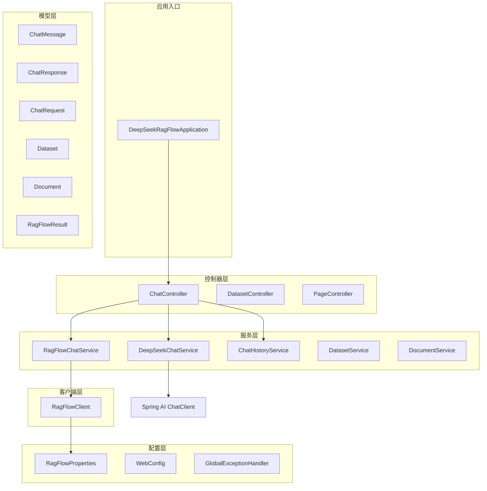
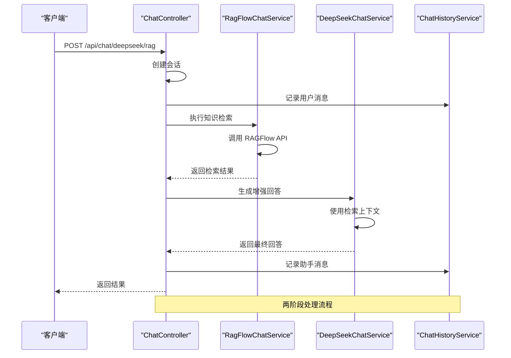
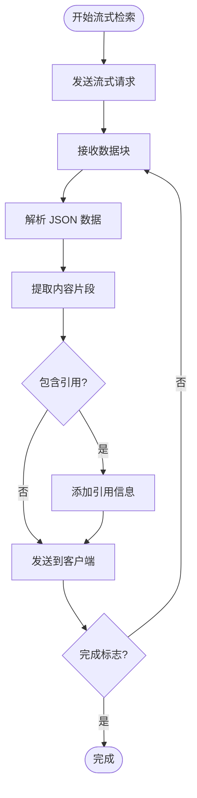
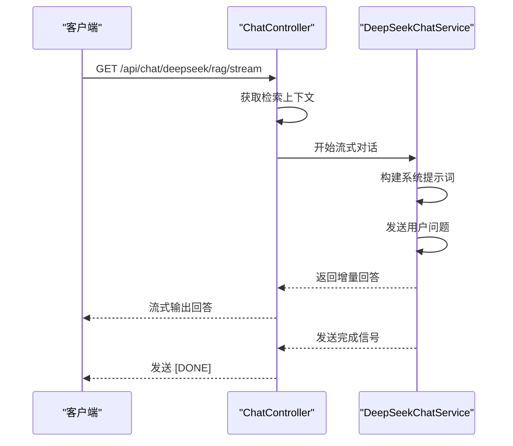
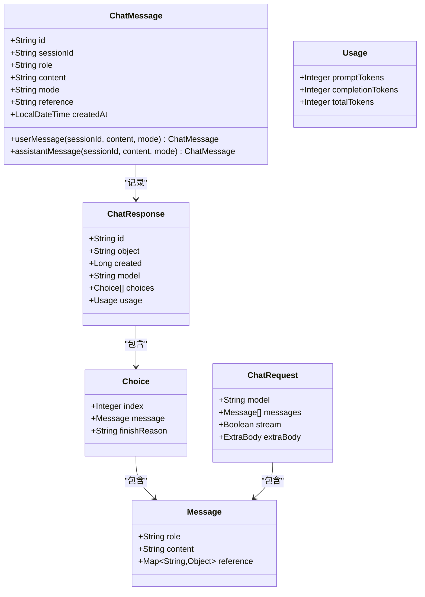
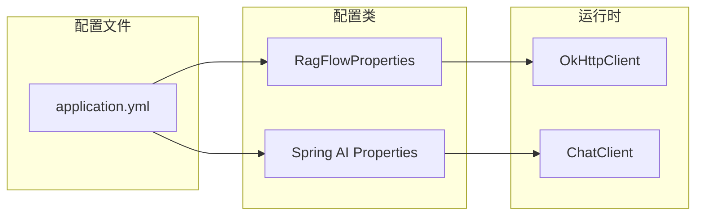
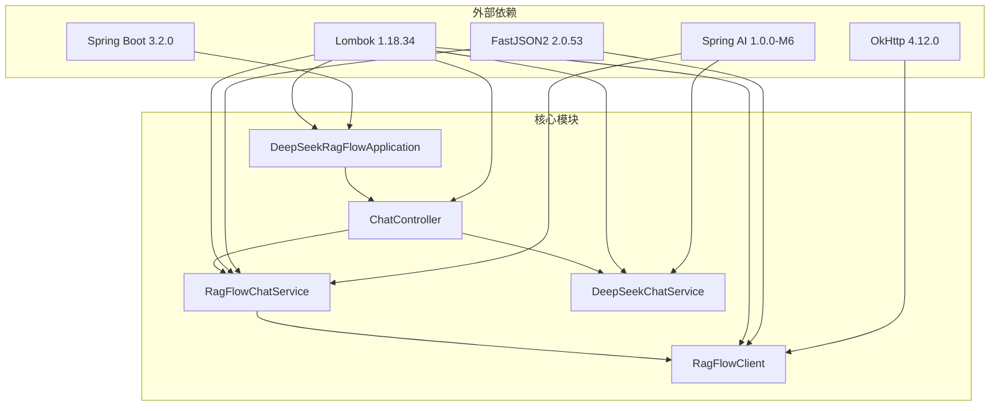
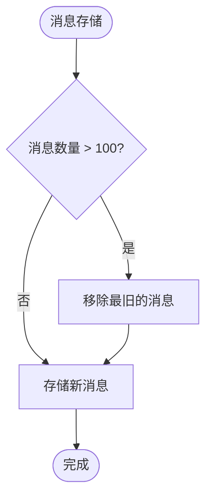

# DeepSeek + RAG 增强对话模式

<cite>
**本文档引用的文件**
- [DeepSeekRagFlowApplication.java](file://src/main/java/org/wiki/DeepSeekRagFlowApplication.java)
- [ChatController.java](file://src/main/java/org/wiki/controller/ChatController.java)
- [RagFlowChatService.java](file://src/main/java/org/wiki/service/RagFlowChatService.java)
- [DeepSeekChatService.java](file://src/main/java/org/wiki/service/DeepSeekChatService.java)
- [RagFlowClient.java](file://src/main/java/org/wiki/client/RagFlowClient.java)
- [ChatResponse.java](file://src/main/java/org/wiki/model/ChatResponse.java)
- [ChatRequest.java](file://src/main/java/org/wiki/model/ChatRequest.java)
- [RagFlowProperties.java](file://src/main/java/org/wiki/config/RagFlowProperties.java)
- [ChatHistoryService.java](file://src/main/java/org/wiki/service/ChatHistoryService.java)
- [ChatMessage.java](file://src/main/java/org/wiki/model/ChatMessage.java)
- [application.yml](file://src/main/resources/application.yml)
- [pom.xml](file://pom.xml)
- [Dockerfile](file://Dockerfile)
- [docker-compose.yml](file://docker-compose.yml)
</cite>

## 目录
1. [简介](#简介)
2. [项目结构](#项目结构)
3. [核心组件](#核心组件)
4. [架构概览](#架构概览)
5. [详细组件分析](#详细组件分析)
6. [依赖关系分析](#依赖关系分析)
7. [性能考量](#性能考量)
8. [故障排除指南](#故障排除指南)
9. [结论](#结论)
10. [附录](#附录)

## 简介

本项目实现了基于 Spring Boot 和 Spring AI 的 DeepSeek + RAG 增强对话系统。该系统采用两阶段处理流程：首先通过 RAGFlow 进行知识检索，然后将检索结果作为上下文传递给 DeepSeek 生成更准确的回答。系统支持三种对话模式：纯 RAGFlow 模式、纯 DeepSeek 模式和 DeepSeek + RAG 增强模式，同时提供流式和非流式两种实现方式。

该增强模式的核心优势在于结合了 RAGFlow 的知识检索能力和 DeepSeek 的语言生成能力，能够在保持较低成本的同时显著提升回答的准确性，特别适用于需要精确知识支撑的场景。

## 项目结构

项目采用标准的 Spring Boot 分层架构，主要包含以下模块：



**图表来源**
- [DeepSeekRagFlowApplication.java:1-12](file://src/main/java/org/wiki/DeepSeekRagFlowApplication.java#L1-L12)
- [ChatController.java:1-276](file://src/main/java/org/wiki/controller/ChatController.java#L1-L276)
- [RagFlowChatService.java:1-84](file://src/main/java/org/wiki/service/RagFlowChatService.java#L1-L84)
- [DeepSeekChatService.java:1-125](file://src/main/java/org/wiki/service/DeepSeekChatService.java#L1-L125)

**章节来源**
- [DeepSeekRagFlowApplication.java:1-12](file://src/main/java/org/wiki/DeepSeekRagFlowApplication.java#L1-L12)
- [pom.xml:1-102](file://pom.xml#L1-L102)

## 核心组件

### 对话控制器 (ChatController)

ChatController 是系统的核心入口，负责处理所有对话相关的 HTTP 请求。它提供了三种主要的对话模式：

1. **RAGFlow 知识库问答**：直接调用 RAGFlow 进行知识检索
2. **DeepSeek 直接对话**：纯语言模型对话
3. **DeepSeek + RAG 增强对话**：两阶段检索增强生成

每个对话模式都提供非流式和流式两种实现方式，以满足不同场景的需求。

**章节来源**
- [ChatController.java:20-276](file://src/main/java/org/wiki/controller/ChatController.java#L20-L276)

### RAGFlow 对话服务 (RagFlowChatService)

RagFlowChatService 封装了与 RAGFlow 服务的交互逻辑，提供了完整的知识检索功能：

- **非流式检索**：一次性获取完整的检索结果
- **流式检索**：实时获取增量检索结果
- **结果提取**：从复杂的响应结构中提取有用的信息

该服务还处理了引用信息的展示，这是 RAGFlow 的特色功能之一。

**章节来源**
- [RagFlowChatService.java:12-84](file://src/main/java/org/wiki/service/RagFlowChatService.java#L12-L84)

### DeepSeek 对话服务 (DeepSeekChatService)

DeepSeekChatService 利用 Spring AI 框架与 DeepSeek API 交互，支持多种对话模式：

- **纯对话模式**：直接与语言模型交互
- **RAG 增强模式**：基于检索上下文进行回答
- **流式对话模式**：实时流式输出回答
- **RAG 增强流式模式**：结合检索上下文的流式回答

该服务通过精心设计的系统提示词确保回答的质量和准确性。

**章节来源**
- [DeepSeekChatService.java:15-125](file://src/main/java/org/wiki/service/DeepSeekChatService.java#L15-L125)

### RAGFlow HTTP 客户端 (RagFlowClient)

RagFlowClient 实现了与 RAGFlow 服务的底层通信，提供了完整的 HTTP 客户端功能：

- **通用 HTTP 方法**：支持 GET、POST、PUT、DELETE
- **流式 SSE 处理**：正确解析服务器发送事件格式
- **文件上传**：支持多部分表单数据上传
- **错误处理**：统一的错误处理和状态码检查

**章节来源**
- [RagFlowClient.java:17-231](file://src/main/java/org/wiki/client/RagFlowClient.java#L17-L231)

## 架构概览

系统采用分层架构设计，清晰分离了关注点：



**图表来源**
- [ChatController.java:148-174](file://src/main/java/org/wiki/controller/ChatController.java#L148-L174)
- [RagFlowChatService.java:34-41](file://src/main/java/org/wiki/service/RagFlowChatService.java#L34-L41)
- [DeepSeekChatService.java:54-78](file://src/main/java/org/wiki/service/DeepSeekChatService.java#L54-L78)

系统架构的关键特点：

1. **解耦设计**：各组件职责明确，便于维护和扩展
2. **异步处理**：流式接口使用异步线程池处理，避免阻塞
3. **配置驱动**：通过配置文件管理外部服务连接参数
4. **错误隔离**：每个组件都有独立的错误处理机制

## 详细组件分析

### 流式处理机制

系统实现了两种流式处理模式，分别针对不同的使用场景：

#### RAGFlow 流式检索



**图表来源**
- [RagFlowChatService.java:50-72](file://src/main/java/org/wiki/service/RagFlowChatService.java#L50-L72)
- [RagFlowClient.java:154-200](file://src/main/java/org/wiki/client/RagFlowClient.java#L154-L200)

#### DeepSeek 流式增强回答



**图表来源**
- [ChatController.java:238-274](file://src/main/java/org/wiki/controller/ChatController.java#L238-L274)
- [DeepSeekChatService.java:101-123](file://src/main/java/org/wiki/service/DeepSeekChatService.java#L101-L123)

### 数据模型设计

系统使用了完整的数据模型来描述对话过程中的各种实体：



**图表来源**
- [ChatMessage.java:10-82](file://src/main/java/org/wiki/model/ChatMessage.java#L10-L82)
- [ChatResponse.java:10-52](file://src/main/java/org/wiki/model/ChatResponse.java#L10-L52)
- [ChatRequest.java:10-59](file://src/main/java/org/wiki/model/ChatRequest.java#L10-L59)

**章节来源**
- [ChatMessage.java:10-82](file://src/main/java/org/wiki/model/ChatMessage.java#L10-L82)
- [ChatResponse.java:10-52](file://src/main/java/org/wiki/model/ChatResponse.java#L10-L52)
- [ChatRequest.java:10-59](file://src/main/java/org/wiki/model/ChatRequest.java#L10-L59)

### 配置管理

系统通过配置文件集中管理外部服务的连接参数：



**图表来源**
- [application.yml:17-27](file://src/main/resources/application.yml#L17-L27)
- [RagFlowProperties.java:7-32](file://src/main/java/org/wiki/config/RagFlowProperties.java#L7-L32)

**章节来源**
- [application.yml:1-27](file://src/main/resources/application.yml#L1-L27)
- [RagFlowProperties.java:1-32](file://src/main/java/org/wiki/config/RagFlowProperties.java#L1-L32)

## 依赖关系分析

系统依赖关系清晰，遵循了良好的软件工程原则：



**图表来源**
- [pom.xml:25-88](file://pom.xml#L25-L88)
- [DeepSeekRagFlowApplication.java:1-12](file://src/main/java/org/wiki/DeepSeekRagFlowApplication.java#L1-L12)

### 关键依赖特性

1. **Spring AI 集成**：利用 Spring AI 的 OpenAI 兼容性，无缝支持 DeepSeek
2. **HTTP 客户端**：使用 OkHttp 处理与 RAGFlow 的通信
3. **JSON 处理**：使用 FastJSON2 提供高性能的 JSON 序列化
4. **开发效率**：Lombok 减少样板代码，提高开发效率

**章节来源**
- [pom.xml:15-102](file://pom.xml#L15-L102)

## 性能考量

### 延迟优化策略

系统采用了多种策略来优化响应延迟：

1. **异步处理**：流式接口使用独立的线程池，避免阻塞主线程
2. **连接复用**：OkHttp 客户端自动管理连接池
3. **缓存策略**：内存中的会话历史减少重复计算
4. **超时配置**：合理的超时设置平衡响应速度和稳定性

### 内存管理



**图表来源**
- [ChatHistoryService.java:24-43](file://src/main/java/org/wiki/service/ChatHistoryService.java#L24-L43)

### 资源限制

系统通过配置文件控制资源使用：

- **JVM 内存**：最小 256MB，最大 512MB
- **连接超时**：30 秒连接，自定义读取超时
- **会话限制**：每会话最多 100 条消息

## 故障排除指南

### 常见问题及解决方案

#### RAGFlow 连接问题

**症状**：调用 RAGFlow API 时出现连接超时或认证失败

**诊断步骤**：
1. 检查 RAGFlow 服务是否正常运行
2. 验证 API Key 配置是否正确
3. 确认网络连通性
4. 查看超时配置是否合理

**解决方案**：
- 更新正确的 API Key
- 调整超时时间配置
- 检查防火墙设置

#### DeepSeek API 问题

**症状**：DeepSeek API 调用失败或响应异常

**诊断步骤**：
1. 验证 API Key 有效性
2. 检查模型名称配置
3. 确认网络访问权限
4. 查看请求频率限制

**解决方案**：
- 重新申请有效的 API Key
- 确认模型可用性
- 实施重试机制

#### 流式处理问题

**症状**：流式响应中断或数据丢失

**诊断步骤**：
1. 检查 SSE 连接状态
2. 验证数据解析逻辑
3. 确认客户端处理能力
4. 查看网络稳定性

**解决方案**：
- 实现断线重连机制
- 增加重试逻辑
- 优化客户端缓冲区

**章节来源**
- [RagFlowClient.java:37-82](file://src/main/java/org/wiki/client/RagFlowClient.java#L37-L82)
- [ChatController.java:70-104](file://src/main/java/org/wiki/controller/ChatController.java#L70-L104)

### 日志分析

系统提供了详细的日志记录，有助于问题诊断：

- **请求日志**：记录所有 API 调用的输入输出
- **错误日志**：捕获异常和错误信息
- **性能日志**：记录响应时间和处理耗时
- **调试日志**：提供详细的内部状态信息

## 结论

DeepSeek + RAG 增强对话模式通过两阶段处理流程实现了知识检索与语言生成的有机结合。该系统具有以下优势：

1. **准确性提升**：通过检索增强，回答准确性显著提高
2. **成本控制**：相比纯深度学习模型，成本更低
3. **灵活性**：支持多种对话模式和流式处理
4. **可扩展性**：模块化设计便于功能扩展

在实际应用中，建议根据具体需求选择合适的模式：
- **简单问答**：使用纯 DeepSeek 模式
- **知识密集型**：使用 RAG 增强模式
- **实时交互**：使用流式处理模式

## 附录

### 使用示例

#### 非流式 RAG 增强对话

```bash
curl -X POST "http://localhost:8081/api/chat/deepseek/rag" \
  -H "Content-Type: application/x-www-form-urlencoded" \
  -d "question=Spring Boot 如何集成 Spring AI？&sessionId=123456"
```

#### 流式 RAG 增强对话

```bash
curl -N "http://localhost:8081/api/chat/deepseek/rag/stream?question=Spring Boot 配置详解"
```

#### 会话管理

```bash
# 创建会话
curl -X POST "http://localhost:8081/api/chat/session"

# 获取历史
curl "http://localhost:8081/api/chat/history/{sessionId}"

# 清空历史
curl -X DELETE "http://localhost:8081/api/chat/history/{sessionId}"
```

### 最佳实践

1. **配置管理**：使用环境变量管理敏感配置
2. **错误处理**：实现完善的异常处理和重试机制
3. **监控告警**：建立系统监控和性能指标
4. **安全防护**：实施 API 访问控制和数据加密
5. **版本管理**：定期更新依赖包和修复安全漏洞

### 部署指南

系统支持容器化部署，推荐使用 Docker Compose：

```yaml
version: '3.8'
services:
  deepseek-ragflow-demo:
    build: .
    ports:
      - "8081:8081"
    environment:
      - SPRING_AI_OPENAI_API_KEY=${DEEPSEEK_API_KEY}
      - RAGFLOW_BASE_URL=${RAGFLOW_BASE_URL}
      - RAGFLOW_API_KEY=${RAGFLOW_API_KEY}
      - RAGFLOW_CHAT_ID=${RAGFLOW_CHAT_ID}
    restart: unless-stopped
```