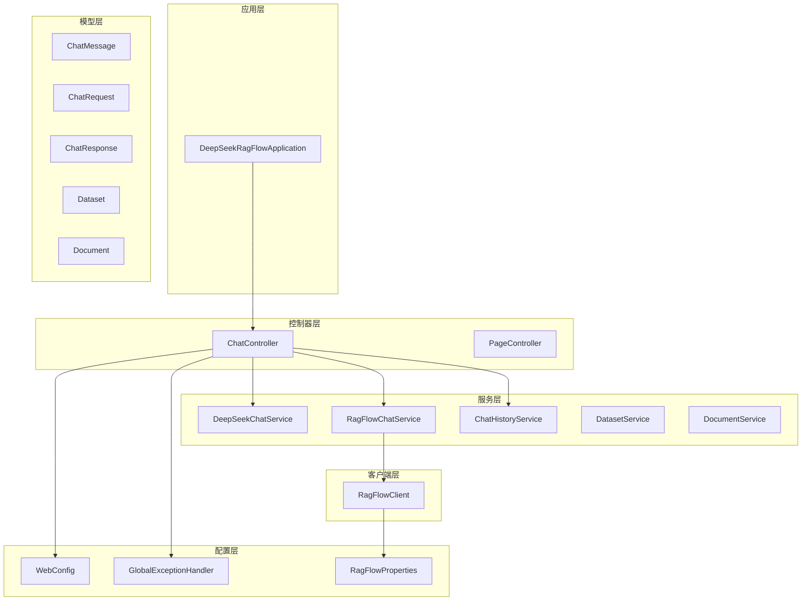
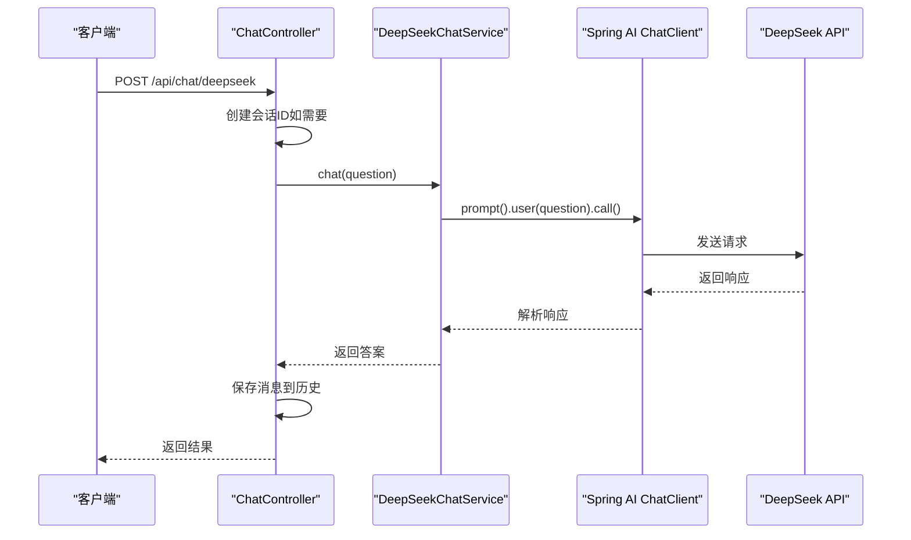
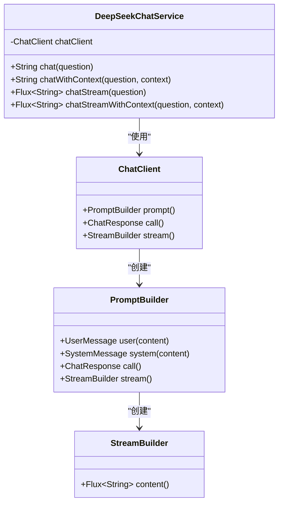
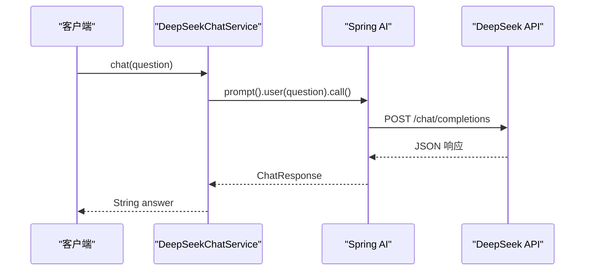
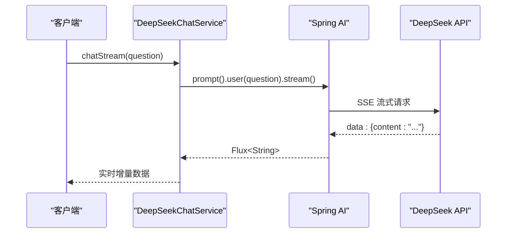
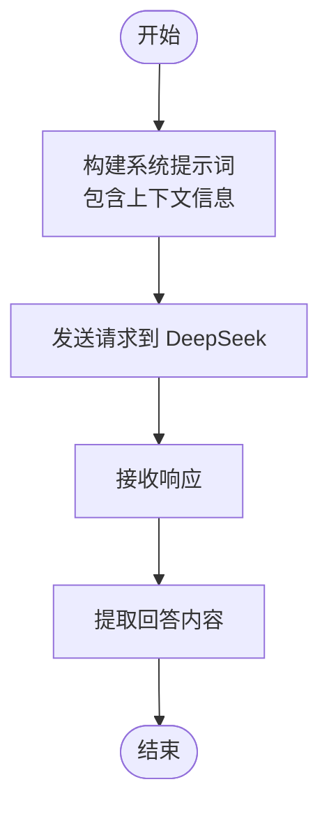
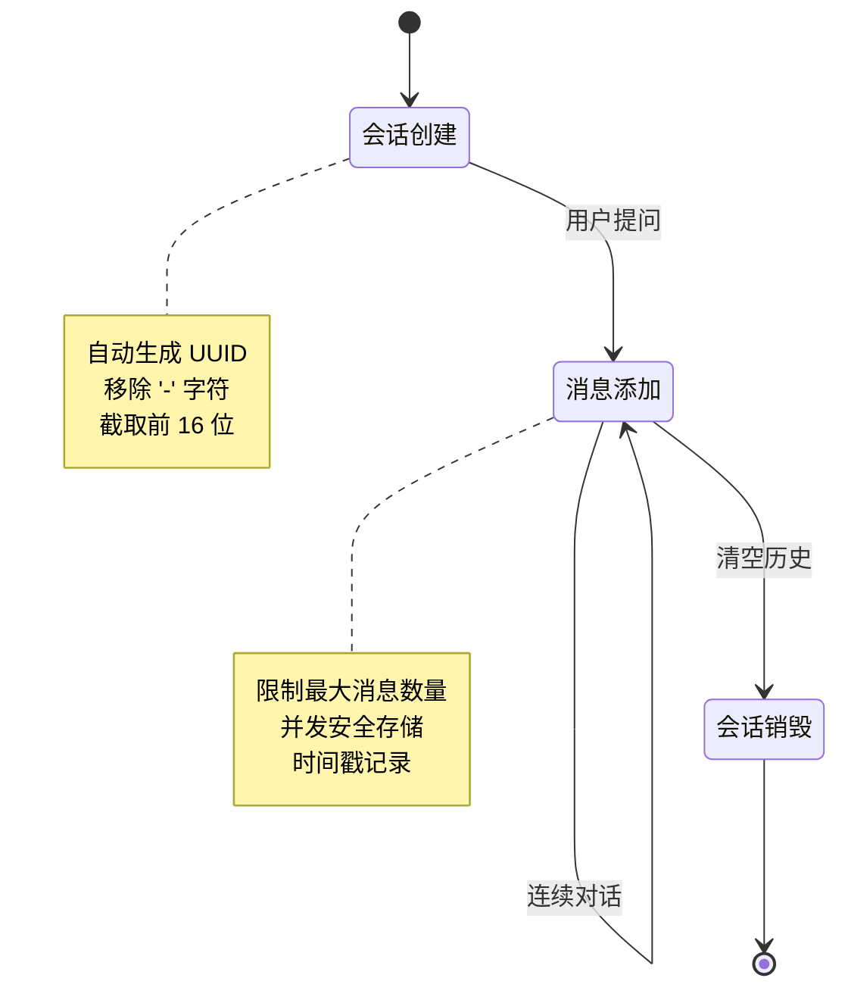
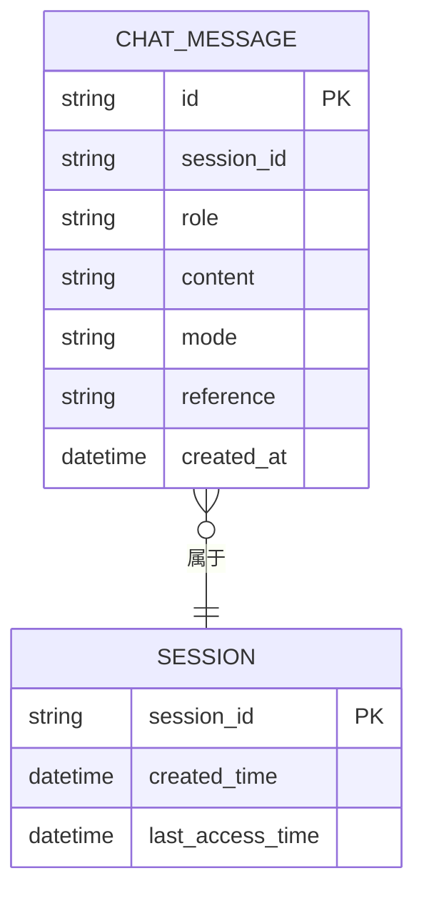
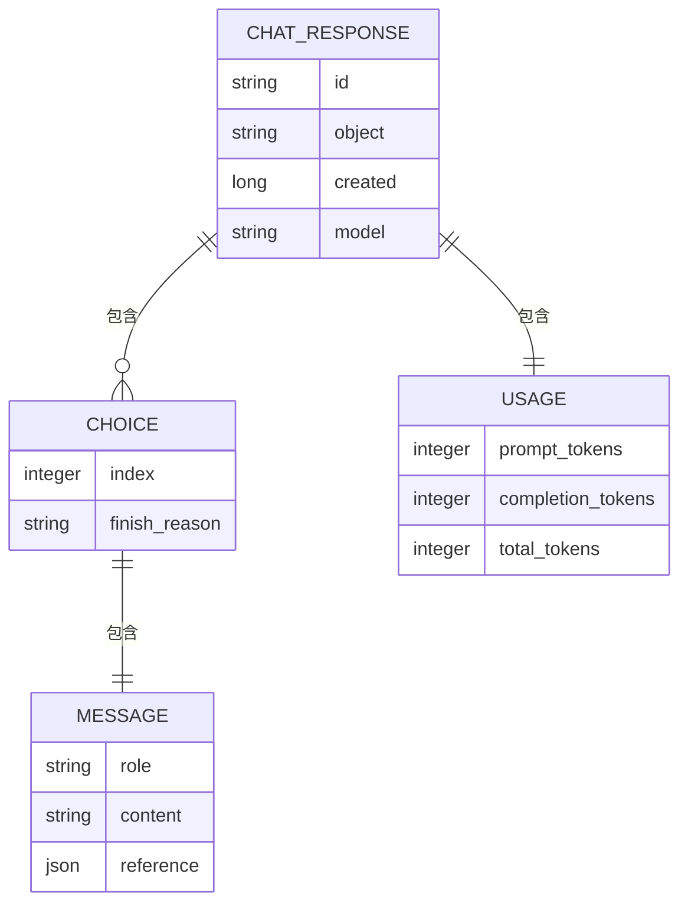
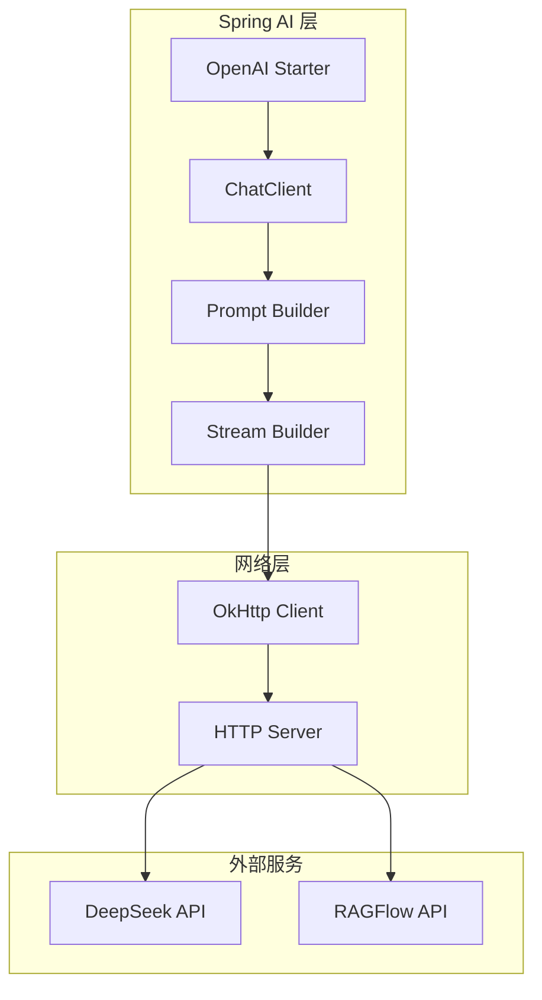

# DeepSeek 直接对话模式

<cite>
**本文档引用的文件**
- [DeepSeekRagFlowApplication.java](file://src/main/java/org/wiki/DeepSeekRagFlowApplication.java)
- [ChatController.java](file://src/main/java/org/wiki/controller/ChatController.java)
- [DeepSeekChatService.java](file://src/main/java/org/wiki/service/DeepSeekChatService.java)
- [RagFlowChatService.java](file://src/main/java/org/wiki/service/RagFlowChatService.java)
- [RagFlowClient.java](file://src/main/java/org/wiki/client/RagFlowClient.java)
- [ChatHistoryService.java](file://src/main/java/org/wiki/service/ChatHistoryService.java)
- [ChatMessage.java](file://src/main/java/org/wiki/model/ChatMessage.java)
- [ChatRequest.java](file://src/main/java/org/wiki/model/ChatRequest.java)
- [ChatResponse.java](file://src/main/java/org/wiki/model/ChatResponse.java)
- [RagFlowProperties.java](file://src/main/java/org/wiki/config/RagFlowProperties.java)
- [WebConfig.java](file://src/main/java/org/wiki/config/WebConfig.java)
- [GlobalExceptionHandler.java](file://src/main/java/org/wiki/config/GlobalExceptionHandler.java)
- [application.yml](file://src/main/resources/application.yml)
- [pom.xml](file://pom.xml)
</cite>

## 目录
1. [简介](#简介)
2. [项目结构](#项目结构)
3. [核心组件](#核心组件)
4. [架构总览](#架构总览)
5. [详细组件分析](#详细组件分析)
6. [依赖关系分析](#依赖关系分析)
7. [性能考虑](#性能考虑)
8. [故障排除指南](#故障排除指南)
9. [结论](#结论)
10. [附录](#附录)

## 简介
本项目实现了基于 Spring Boot 和 Spring AI 的 DeepSeek 直接对话模式，支持纯大语言模型对话、流式对话以及与 RAGFlow 系统的集成增强。系统通过 Spring AI 的 OpenAI 兼容客户端直接调用 DeepSeek API，同时提供完整的会话管理、历史记录存储和错误处理机制。本文档将深入解释纯大语言模型对话的实现原理，包括模型调用、参数配置和响应处理机制，并详细说明非流式和流式两种调用方式的技术实现，涵盖 Spring AI 集成方式、Flux 流式处理和 SSE 事件传输。此外，还将解释会话管理和上下文保持机制，提供完整的 API 使用指南，并分析该模式在通用对话、创意写作和推理任务中的优势和局限性。

## 项目结构
该项目采用标准的 Spring Boot 分层架构，主要包含以下模块：
- 控制器层：处理 HTTP 请求和响应
- 服务层：封装业务逻辑和外部服务调用
- 客户端层：负责与外部系统的通信
- 配置层：应用配置和全局异常处理
- 模型层：数据传输对象和实体类
- 资源层：静态资源和模板文件



**图表来源**
- [DeepSeekRagFlowApplication.java:1-12](file://src/main/java/org/wiki/DeepSeekRagFlowApplication.java#L1-L12)
- [ChatController.java:1-276](file://src/main/java/org/wiki/controller/ChatController.java#L1-L276)
- [DeepSeekChatService.java:1-125](file://src/main/java/org/wiki/service/DeepSeekChatService.java#L1-L125)
- [RagFlowChatService.java:1-84](file://src/main/java/org/wiki/service/RagFlowChatService.java#L1-L84)
- [RagFlowClient.java:1-231](file://src/main/java/org/wiki/client/RagFlowClient.java#L1-L231)

**章节来源**
- [pom.xml:1-102](file://pom.xml#L1-L102)
- [application.yml:1-27](file://src/main/resources/application.yml#L1-L27)

## 核心组件
本项目的核心组件围绕对话功能构建，主要包括：

### 对话控制器 (ChatController)
负责处理所有对话相关的 HTTP 请求，提供多种对话模式：
- DeepSeek 直接对话（非流式和流式）
- RAGFlow 知识库问答（非流式和流式）
- DeepSeek + RAG 增强对话（非流式和流式）

### DeepSeek 对话服务 (DeepSeekChatService)
通过 Spring AI 的 ChatClient 直接调用 DeepSeek API，支持：
- 纯对话模式
- RAG 增强对话模式
- 流式对话模式
- 基于上下文的对话模式

### RAGFlow 对话服务 (RagFlowChatService)
封装 RAGFlow 系统的 OpenAI 兼容接口，提供：
- 知识库问答功能
- 流式数据处理
- 引用信息提取

### 会话管理服务 (ChatHistoryService)
提供完整的会话生命周期管理：
- 会话创建和销毁
- 消息存储和检索
- 历史记录维护
- 并发安全的消息管理

**章节来源**
- [ChatController.java:20-276](file://src/main/java/org/wiki/controller/ChatController.java#L20-L276)
- [DeepSeekChatService.java:15-125](file://src/main/java/org/wiki/service/DeepSeekChatService.java#L15-L125)
- [RagFlowChatService.java:12-84](file://src/main/java/org/wiki/service/RagFlowChatService.java#L12-L84)
- [ChatHistoryService.java:10-88](file://src/main/java/org/wiki/service/ChatHistoryService.java#L10-L88)

## 架构总览
系统采用分层架构设计，通过依赖注入实现松耦合的服务组合。整体架构包括以下关键层次：



**图表来源**
- [ChatController.java:117-137](file://src/main/java/org/wiki/controller/ChatController.java#L117-L137)
- [DeepSeekChatService.java:36-44](file://src/main/java/org/wiki/service/DeepSeekChatService.java#L36-L44)

系统支持多种调用模式，包括同步和异步处理，以及不同的响应格式（JSON 和 SSE）。

**章节来源**
- [ChatController.java:1-276](file://src/main/java/org/wiki/controller/ChatController.java#L1-L276)
- [DeepSeekChatService.java:1-125](file://src/main/java/org/wiki/service/DeepSeekChatService.java#L1-L125)

## 详细组件分析

### DeepSeekChatService 组件分析
DeepSeekChatService 是系统的核心对话服务，通过 Spring AI 的 ChatClient 实现与 DeepSeek API 的交互。

#### 类关系图


**图表来源**
- [DeepSeekChatService.java:22-125](file://src/main/java/org/wiki/service/DeepSeekChatService.java#L22-L125)

#### 纯对话模式实现
纯对话模式是最简单的调用方式，直接向 DeepSeek 模型发送用户问题：



**图表来源**
- [DeepSeekChatService.java:36-44](file://src/main/java/org/wiki/service/DeepSeekChatService.java#L36-L44)

#### 流式对话模式实现
流式对话模式使用 Spring AI 的原生 Flux 流式处理，提供实时的增量响应：



**图表来源**
- [DeepSeekChatService.java:86-92](file://src/main/java/org/wiki/service/DeepSeekChatService.java#L86-L92)

#### RAG 增强对话模式
RAG 增强模式结合了知识库检索和大模型生成，提供更准确的回答：



**图表来源**
- [DeepSeekChatService.java:54-78](file://src/main/java/org/wiki/service/DeepSeekChatService.java#L54-L78)

**章节来源**
- [DeepSeekChatService.java:15-125](file://src/main/java/org/wiki/service/DeepSeekChatService.java#L15-L125)

### ChatController 组件分析
ChatController 提供了完整的对话 API 接口，支持多种对话模式和会话管理功能。

#### API 接口概览
系统提供了以下主要 API 接口：

| 接口 | 方法 | 路径 | 功能描述 |
|------|------|------|----------|
| DeepSeek 非流式对话 | POST | `/api/chat/deepseek` | 直接调用 DeepSeek 进行对话 |
| DeepSeek 流式对话 | GET | `/api/chat/deepseek/stream` | 使用 SSE 流式输出 |
| RAGFlow 非流式对话 | POST | `/api/chat/ragflow` | 通过 RAGFlow 进行知识库问答 |
| RAGFlow 流式对话 | GET | `/api/chat/ragflow/stream` | RAGFlow 流式问答 |
| DeepSeek + RAG 增强对话 | POST | `/api/chat/deepseek/rag` | 结合 RAGFlow 的增强对话 |
| DeepSeek + RAG 流式对话 | GET | `/api/chat/deepseek/rag/stream` | 增强模式的流式对话 |
| 创建会话 | POST | `/api/chat/session` | 创建新的对话会话 |
| 获取历史 | GET | `/api/chat/history/{sessionId}` | 获取会话历史记录 |
| 清空历史 | DELETE | `/api/chat/history/{sessionId}` | 清空指定会话的历史 |

#### 会话管理机制
系统实现了完整的会话管理功能，包括会话 ID 生成、消息存储和历史记录查询：



**图表来源**
- [ChatHistoryService.java:81-86](file://src/main/java/org/wiki/service/ChatHistoryService.java#L81-L86)
- [ChatHistoryService.java:31-43](file://src/main/java/org/wiki/service/ChatHistoryService.java#L31-L43)

**章节来源**
- [ChatController.java:20-276](file://src/main/java/org/wiki/controller/ChatController.java#L20-L276)
- [ChatHistoryService.java:10-88](file://src/main/java/org/wiki/service/ChatHistoryService.java#L10-L88)

### 数据模型分析
系统使用了多个数据传输对象来处理不同类型的请求和响应。

#### ChatMessage 数据模型
ChatMessage 是对话消息的标准数据结构，支持用户和助手两种角色：



**图表来源**
- [ChatMessage.java:17-82](file://src/main/java/org/wiki/model/ChatMessage.java#L17-L82)

#### ChatResponse 数据模型
ChatResponse 定义了 RAGFlow 系统的响应结构，支持完整的对话历史和统计信息：



**图表来源**
- [ChatResponse.java:16-51](file://src/main/java/org/wiki/model/ChatResponse.java#L16-L51)

**章节来源**
- [ChatMessage.java:10-82](file://src/main/java/org/wiki/model/ChatMessage.java#L10-L82)
- [ChatResponse.java:10-52](file://src/main/java/org/wiki/model/ChatResponse.java#L10-L52)

## 依赖关系分析
系统使用 Maven 作为构建工具，集成了多个关键依赖项来实现所需功能。

### 核心依赖项
系统的主要依赖包括：

| 依赖项 | 版本 | 用途 |
|--------|------|------|
| Spring Boot Web | 3.2.0 | Web 应用框架 |
| Spring AI OpenAI | 1.0.0-M6 | OpenAI 兼容接口 |
| OkHttp | 4.12.0 | HTTP 客户端 |
| FastJSON2 | 2.0.53 | JSON 处理 |
| Lombok | 1.18.34 | 代码简化 |
| Thymeleaf | 3.2.0 | 模板引擎 |

### Spring AI 集成架构
系统通过 Spring AI 的 OpenAI 兼容适配器实现与 DeepSeek API 的无缝集成：



**图表来源**
- [pom.xml:25-88](file://pom.xml#L25-L88)
- [application.yml:7-16](file://src/main/resources/application.yml#L7-L16)

**章节来源**
- [pom.xml:1-102](file://pom.xml#L1-L102)
- [application.yml:1-27](file://src/main/resources/application.yml#L1-L27)

## 性能考虑
系统在设计时充分考虑了性能优化和资源管理：

### 并发处理
- 使用线程池处理异步操作
- 采用并发安全的数据结构
- 限制单会话消息数量防止内存泄漏

### 缓存策略
- 内存中缓存会话消息
- 合理设置超时时间
- 流式处理避免大响应阻塞

### 资源管理
- 连接池复用 HTTP 连接
- 及时释放流式资源
- 监控日志级别控制

## 故障排除指南
系统提供了完善的异常处理机制和错误码定义：

### 错误码定义
| 状态码 | 错误类型 | 描述 | 处理建议 |
|--------|----------|------|----------|
| 200 | 成功 | 请求成功执行 | 正常处理响应 |
| 400 | 参数错误 | 请求参数无效 | 检查请求格式 |
| 401 | 未授权 | API 密钥无效 | 验证认证信息 |
| 404 | 资源不存在 | 会话或数据不存在 | 检查会话ID |
| 500 | 服务器内部错误 | 系统异常 | 查看日志详情 |
| 503 | 服务不可用 | 外部服务调用失败 | 检查网络连接 |

### 常见问题诊断
1. **DeepSeek API 调用失败**
   - 检查 API Key 配置
   - 验证网络连接
   - 查看超时设置

2. **RAGFlow 服务调用异常**
   - 确认服务地址可达
   - 验证聊天助手 ID
   - 检查权限配置

3. **流式对话中断**
   - 检查 SSE 连接状态
   - 验证流式数据格式
   - 监控网络稳定性

**章节来源**
- [GlobalExceptionHandler.java:13-46](file://src/main/java/org/wiki/config/GlobalExceptionHandler.java#L13-L46)

## 结论
DeepSeek 直接对话模式通过 Spring AI 的 OpenAI 兼容接口实现了与 DeepSeek API 的无缝集成，提供了灵活的对话模式选择和强大的扩展能力。系统的设计充分考虑了性能、可维护性和用户体验，支持从简单问答到复杂推理的各种应用场景。

### 主要优势
- **技术栈现代化**：基于 Spring Boot 和 Spring AI，开发效率高
- **多模式支持**：纯对话、流式对话、RAG 增强等多种模式
- **会话管理完善**：完整的会话生命周期管理
- **错误处理健全**：全面的异常处理和错误码定义
- **性能优化**：合理的并发处理和资源管理

### 局限性分析
- **内存限制**：当前使用内存存储会话历史，不适合大规模部署
- **单一模型**：仅支持 DeepSeek 模型，缺乏多模型切换
- **配置复杂**：需要正确配置多个外部服务参数
- **监控不足**：缺少完善的性能监控和指标收集

### 应用场景建议
- **通用对话**：适合日常问答和信息查询
- **创意写作**：支持故事创作和内容生成
- **推理任务**：适合数据分析和逻辑推理
- **知识问答**：结合 RAGFlow 实现专业领域问答

## 附录

### API 使用指南

#### DeepSeek 非流式对话
- **请求方法**：POST
- **请求路径**：`/api/chat/deepseek`
- **请求参数**：
  - `question` (必需)：用户问题
  - `sessionId` (可选)：会话ID，不提供则自动生成
- **响应结构**：
  ```json
  {
    "success": true,
    "answer": "模型回答内容",
    "sessionId": "会话ID"
  }
  ```

#### DeepSeek 流式对话
- **请求方法**：GET
- **请求路径**：`/api/chat/deepseek/stream`
- **请求参数**：
  - `question` (必需)：用户问题
- **响应格式**：SSE 流式数据
- **数据格式**：逐字节增量输出

#### 会话管理 API
- **创建会话**：POST `/api/chat/session`
- **获取历史**：GET `/api/chat/history/{sessionId}`
- **清空历史**：DELETE `/api/chat/history/{sessionId}`

### 配置说明
系统通过 `application.yml` 进行配置管理，主要配置项包括：
- **Spring AI 配置**：API Key、Base URL、模型参数
- **RAGFlow 配置**：服务地址、API Key、聊天助手ID
- **日志配置**：调试级别和输出格式