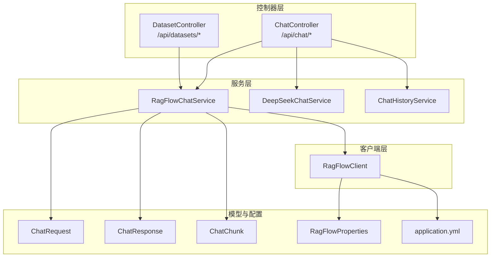
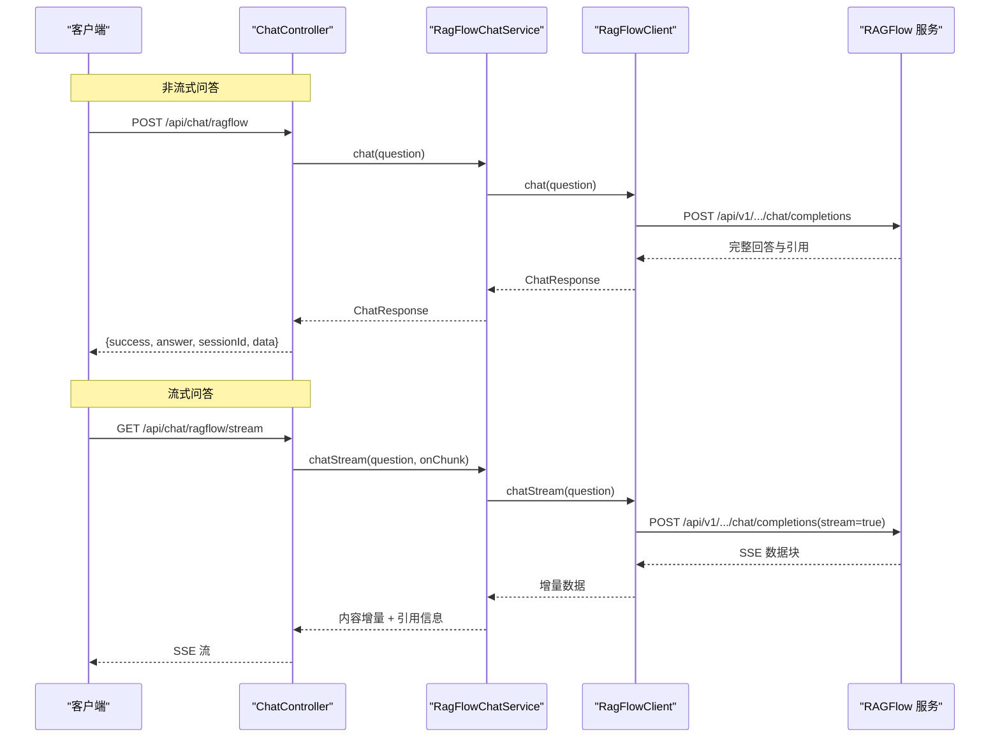
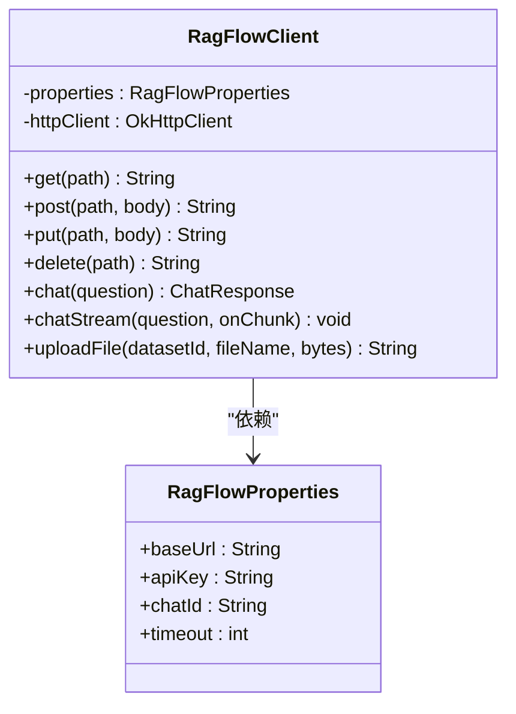
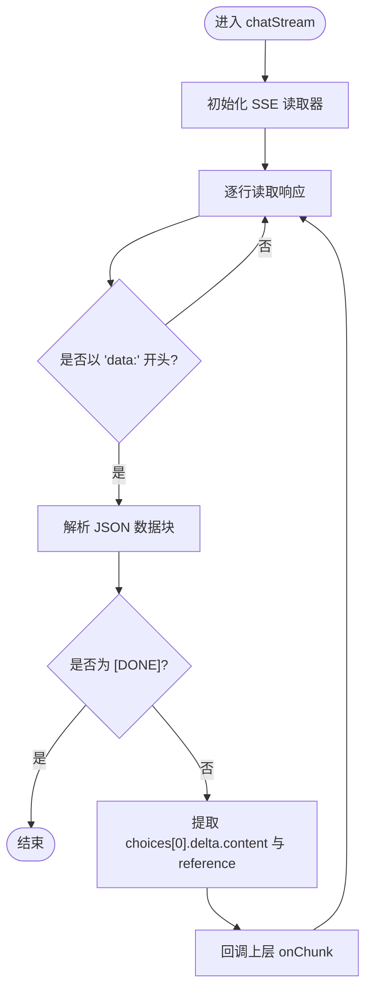
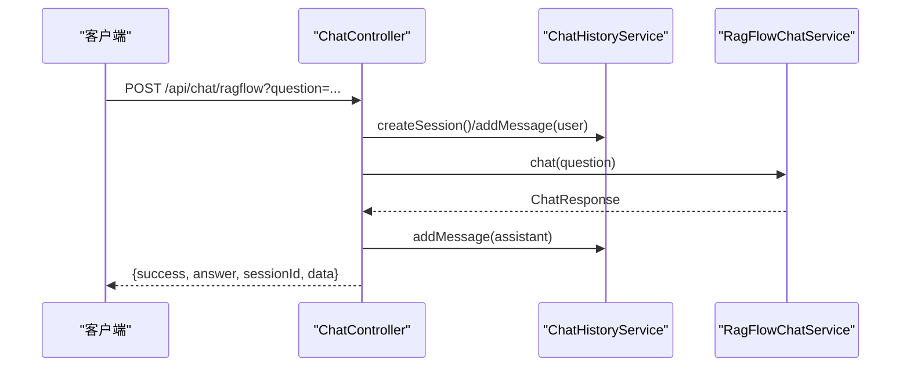
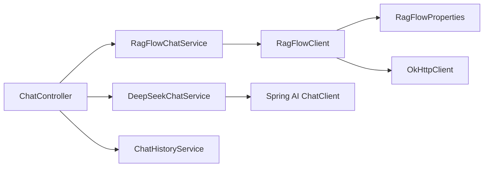

# RAGFlow 知识库问答模式

<cite>
**本文引用的文件**
- [RagFlowClient.java](file://src/main/java/org/wiki/client/RagFlowClient.java)
- [RagFlowChatService.java](file://src/main/java/org/wiki/service/RagFlowChatService.java)
- [ChatController.java](file://src/main/java/org/wiki/controller/ChatController.java)
- [ChatRequest.java](file://src/main/java/org/wiki/model/ChatRequest.java)
- [ChatResponse.java](file://src/main/java/org/wiki/model/ChatResponse.java)
- [ChatChunk.java](file://src/main/java/org/wiki/model/ChatChunk.java)
- [RagFlowProperties.java](file://src/main/java/org/wiki/config/RagFlowProperties.java)
- [application.yml](file://src/main/resources/application.yml)
- [DatasetController.java](file://src/main/java/org/wiki/controller/DatasetController.java)
- [Dataset.java](file://src/main/java/org/wiki/model/Dataset.java)
- [Document.java](file://src/main/java/org/wiki/model/Document.java)
- [ChatHistoryService.java](file://src/main/java/org/wiki/service/ChatHistoryService.java)
- [ChatMessage.java](file://src/main/java/org/wiki/model/ChatMessage.java)
- [RagFlowResult.java](file://src/main/java/org/wiki/model/RagFlowResult.java)
</cite>

## 目录
1. [简介](#简介)
2. [项目结构](#项目结构)
3. [核心组件](#核心组件)
4. [架构总览](#架构总览)
5. [详细组件分析](#详细组件分析)
6. [依赖分析](#依赖分析)
7. [性能考虑](#性能考虑)
8. [故障排查指南](#故障排查指南)
9. [结论](#结论)
10. [附录](#附录)

## 简介
本文件面向需要在应用中集成 RAGFlow 知识库问答能力的开发者，系统性阐述“知识库问答模式”的实现原理与使用方法。内容涵盖：
- 基于外部知识库的问答技术流程：知识检索、上下文构建与答案生成
- 非流式与流式两种调用方式的差异与适用场景
- API 接口规范、请求参数、响应格式与错误处理机制
- RAGFlow 客户端集成方式：配置参数、认证方式与性能优化策略
- 实际使用示例与最佳实践，帮助评估在准确性、响应速度与成本方面的权衡

## 项目结构
该项目采用 Spring Boot 层次化组织，围绕“控制器-服务-客户端-模型-配置”分层设计，便于扩展与维护。

图表来源
- [ChatController.java:31-275](file://src/main/java/org/wiki/controller/ChatController.java#L31-L275)
- [RagFlowChatService.java:18-83](file://src/main/java/org/wiki/service/RagFlowChatService.java#L18-L83)
- [RagFlowClient.java:23-230](file://src/main/java/org/wiki/client/RagFlowClient.java#L23-L230)
- [ChatRequest.java:17-58](file://src/main/java/org/wiki/model/ChatRequest.java#L17-L58)
- [ChatResponse.java:16-51](file://src/main/java/org/wiki/model/ChatResponse.java#L16-L51)
- [ChatChunk.java:16-41](file://src/main/java/org/wiki/model/ChatChunk.java#L16-L41)
- [RagFlowProperties.java:10-31](file://src/main/java/org/wiki/config/RagFlowProperties.java#L10-L31)
- [application.yml:1-27](file://src/main/resources/application.yml#L1-L27)

章节来源
- [ChatController.java:31-275](file://src/main/java/org/wiki/controller/ChatController.java#L31-L275)
- [RagFlowChatService.java:18-83](file://src/main/java/org/wiki/service/RagFlowChatService.java#L18-L83)
- [RagFlowClient.java:23-230](file://src/main/java/org/wiki/client/RagFlowClient.java#L23-L230)
- [application.yml:1-27](file://src/main/resources/application.yml#L1-L27)

## 核心组件
- 控制器层：提供对外 REST API，分别支持 RAGFlow 非流式、RAGFlow 流式、DeepSeek 对话、DeepSeek+RAG 增强等多模式。
- 服务层：
  - RagFlowChatService：封装 RAGFlow 对话调用，支持非流式与流式，并负责抽取回答与引用信息。
  - DeepSeekChatService：封装 DeepSeek 对话调用，支持纯对话、RAG 增强与流式输出。
  - ChatHistoryService：会话历史管理（内存存储，适合演示；生产建议持久化）。
- 客户端层：RagFlowClient 封装 RAGFlow RESTful API 调用，统一处理认证、超时与错误。
- 模型与配置：ChatRequest/ChatResponse/ChatChunk 定义请求与响应结构；RagFlowProperties 与 application.yml 提供配置注入。

章节来源
- [ChatController.java:31-275](file://src/main/java/org/wiki/controller/ChatController.java#L31-L275)
- [RagFlowChatService.java:18-83](file://src/main/java/org/wiki/service/RagFlowChatService.java#L18-L83)
- [RagFlowClient.java:23-230](file://src/main/java/org/wiki/client/RagFlowClient.java#L23-L230)
- [ChatRequest.java:17-58](file://src/main/java/org/wiki/model/ChatRequest.java#L17-L58)
- [ChatResponse.java:16-51](file://src/main/java/org/wiki/model/ChatResponse.java#L16-L51)
- [ChatChunk.java:16-41](file://src/main/java/org/wiki/model/ChatChunk.java#L16-L41)
- [RagFlowProperties.java:10-31](file://src/main/java/org/wiki/config/RagFlowProperties.java#L10-L31)
- [application.yml:17-22](file://src/main/resources/application.yml#L17-L22)

## 架构总览
RAGFlow 知识库问答模式的核心流程如下：
- 非流式：前端发起 POST 请求至 /api/chat/ragflow，后端调用 RagFlowClient 发送 OpenAI 兼容请求，RAGFlow 返回完整答案与引用，后端抽取并返回。
- 流式：前端发起 GET 请求至 /api/chat/ragflow/stream，后端通过 SSE 将 RAGFlow 的增量数据块实时推送，RagFlowChatService 解析并转发内容与引用。

图表来源
- [ChatController.java:51-107](file://src/main/java/org/wiki/controller/ChatController.java#L51-L107)
- [RagFlowChatService.java:34-72](file://src/main/java/org/wiki/service/RagFlowChatService.java#L34-L72)
- [RagFlowClient.java:135-200](file://src/main/java/org/wiki/client/RagFlowClient.java#L135-L200)

## 详细组件分析

### 组件一：RAGFlow 客户端（RagFlowClient）
- 功能职责
  - 统一封装 RAGFlow RESTful API 调用（GET/POST/PUT/DELETE），自动添加认证头与 JSON 内容类型。
  - 对话接口：非流式 chat 与流式 chatStream，均使用 OpenAI 兼容路径。
  - 文件上传：支持向指定知识库上传文档。
- 关键点
  - 认证：Authorization 头使用 Bearer Token，Token 来自 RagFlowProperties。
  - 超时：连接超时固定，读/写超时来自 RagFlowProperties.timeout。
  - 错误处理：非成功状态码抛出 IOException，包含状态码与响应体。
- 适用场景
  - 需要稳定、可控的 HTTP 调用时优先使用该客户端。
  - 若需细粒度控制或自定义中间件，可在此基础上扩展。

图表来源
- [RagFlowClient.java:23-230](file://src/main/java/org/wiki/client/RagFlowClient.java#L23-L230)
- [RagFlowProperties.java:10-31](file://src/main/java/org/wiki/config/RagFlowProperties.java#L10-L31)

章节来源
- [RagFlowClient.java:23-230](file://src/main/java/org/wiki/client/RagFlowClient.java#L23-L230)
- [RagFlowProperties.java:10-31](file://src/main/java/org/wiki/config/RagFlowProperties.java#L10-L31)

### 组件二：RAGFlow 对话服务（RagFlowChatService）
- 功能职责
  - 非流式：调用 RagFlowClient.chat，记录日志并返回 ChatResponse。
  - 流式：调用 RagFlowClient.chatStream，解析增量数据，提取 content 与 reference 并回调。
  - 抽取答案：从 ChatResponse.choices[0].message.content 提取最终答案。
- 关键点
  - 流式解析：按行读取 SSE，过滤 data: 行，遇到 [DONE] 结束。
  - 引用处理：当增量包含 reference 字段时，追加提示信息以便前端展示。
- 适用场景
  - 需要前端实时显示回答与引用时使用流式。
  - 需要一次性获取完整回答时使用非流式。

图表来源
- [RagFlowChatService.java:50-72](file://src/main/java/org/wiki/service/RagFlowChatService.java#L50-L72)
- [RagFlowClient.java:154-200](file://src/main/java/org/wiki/client/RagFlowClient.java#L154-L200)

章节来源
- [RagFlowChatService.java:18-83](file://src/main/java/org/wiki/service/RagFlowChatService.java#L18-L83)
- [RagFlowClient.java:135-200](file://src/main/java/org/wiki/client/RagFlowClient.java#L135-L200)

### 组件三：控制器（ChatController）
- 功能职责
  - 提供 /api/chat/ragflow（非流式）、/api/chat/ragflow/stream（流式）等接口。
  - 统一封装会话管理：创建会话、保存用户与助手消息、查询与清理历史。
  - 与 DeepSeekChatService 协作实现“DeepSeek + RAG 增强”模式。
- 关键点
  - 非流式：接收 question 与可选 sessionId，调用 RagFlowChatService 并返回 answer、sessionId 与原始数据。
  - 流式：使用 SseEmitter 在独立线程中拉取流式数据并推送。
  - 异常：捕获 IO 异常并返回统一结构 {success, message}。

图表来源
- [ChatController.java:51-76](file://src/main/java/org/wiki/controller/ChatController.java#L51-L76)
- [ChatHistoryService.java:31-43](file://src/main/java/org/wiki/service/ChatHistoryService.java#L31-L43)
- [RagFlowChatService.java:34-41](file://src/main/java/org/wiki/service/RagFlowChatService.java#L34-L41)

章节来源
- [ChatController.java:31-275](file://src/main/java/org/wiki/controller/ChatController.java#L31-L275)
- [ChatHistoryService.java:15-87](file://src/main/java/org/wiki/service/ChatHistoryService.java#L15-L87)

### 组件四：模型与配置
- ChatRequest/ChatResponse/ChatChunk
  - ChatRequest：包含 model、messages、stream、extraBody.reference。
  - ChatResponse：包含 id/object/created/model/choices/usage；choices[0].message 包含 content 与 reference。
  - ChatChunk：SSE 增量块结构，delta.content 为增量文本，delta.reference 为增量引用。
- RagFlowProperties 与 application.yml
  - 提供 base-url、api-key、chat-id、timeout 等配置项，支持通过 Spring Boot 配置注入。

章节来源
- [ChatRequest.java:17-58](file://src/main/java/org/wiki/model/ChatRequest.java#L17-L58)
- [ChatResponse.java:16-51](file://src/main/java/org/wiki/model/ChatResponse.java#L16-L51)
- [ChatChunk.java:16-41](file://src/main/java/org/wiki/model/ChatChunk.java#L16-L41)
- [RagFlowProperties.java:10-31](file://src/main/java/org/wiki/config/RagFlowProperties.java#L10-L31)
- [application.yml:17-22](file://src/main/resources/application.yml#L17-L22)

### 组件五：知识库管理（DatasetController）
- 功能职责
  - 管理知识库（创建/查询/删除）与文档（上传/查询/删除/运行）。
  - 与 RagFlowClient 协作，实现文件上传到指定知识库。
- 适用场景
  - 需要在问答前准备或更新知识库内容时使用。

章节来源
- [DatasetController.java:37-196](file://src/main/java/org/wiki/controller/DatasetController.java#L37-L196)
- [Dataset.java:13-32](file://src/main/java/org/wiki/model/Dataset.java#L13-L32)
- [Document.java:13-23](file://src/main/java/org/wiki/model/Document.java#L13-L23)

## 依赖分析
- 组件耦合
  - ChatController 依赖 RagFlowChatService、DeepSeekChatService、ChatHistoryService。
  - RagFlowChatService 依赖 RagFlowClient。
  - RagFlowClient 依赖 RagFlowProperties 与 OkHttp。
- 外部依赖
  - RAGFlow 服务：OpenAI 兼容接口，SSE 流式输出。
  - DeepSeek 服务：通过 Spring AI ChatClient 调用（兼容 OpenAI 接口）。
- 潜在风险
  - SSE 流解析依赖响应格式稳定性；若 RAGFlow 返回结构变化，需同步调整解析逻辑。
  - 会话历史默认内存存储，生产需替换为持久化存储。

图表来源
- [ChatController.java:32-41](file://src/main/java/org/wiki/controller/ChatController.java#L32-L41)
- [RagFlowChatService.java:20-24](file://src/main/java/org/wiki/service/RagFlowChatService.java#L20-L24)
- [RagFlowClient.java:25-35](file://src/main/java/org/wiki/client/RagFlowClient.java#L25-L35)
- [RagFlowProperties.java:10-31](file://src/main/java/org/wiki/config/RagFlowProperties.java#L10-L31)

章节来源
- [ChatController.java:31-275](file://src/main/java/org/wiki/controller/ChatController.java#L31-L275)
- [RagFlowChatService.java:18-83](file://src/main/java/org/wiki/service/RagFlowChatService.java#L18-L83)
- [RagFlowClient.java:23-230](file://src/main/java/org/wiki/client/RagFlowClient.java#L23-L230)

## 性能考虑
- 超时设置
  - 连接超时固定，读/写超时由 RagFlowProperties.timeout 控制，建议根据网络与 RAGFlow 部署情况调整。
- 流式传输
  - 流式模式显著降低首字节延迟，适合对交互体验敏感的场景。
- 会话历史
  - 默认内存存储，消息上限有限；生产建议使用数据库或缓存持久化，避免内存压力。
- 并发与线程
  - 控制器使用线程池执行流式任务，注意线程池大小与资源占用。
- 建议
  - 对高频问答场景启用连接复用与合理的超时策略。
  - 对长对话与大量历史消息，采用分页或滚动窗口策略。

[本节为通用性能建议，不直接分析具体文件]

## 故障排查指南
- 常见错误与定位
  - HTTP 非成功状态：RagFlowClient 在非成功状态抛出 IOException，包含状态码与响应体，检查 base-url、api-key、chat-id。
  - SSE 解析异常：RagFlowChatService 在解析增量数据时记录警告日志，确认 RAGFlow 返回格式符合预期。
  - 会话异常：ChatController 捕获 IO 异常并返回 {success=false, message}，检查 sessionId 与历史服务状态。
- 建议排查步骤
  - 核对 application.yml 中 ragflow.* 配置是否正确。
  - 使用 curl 或 Postman 直接调用 RAGFlow 接口验证连通性与权限。
  - 查看服务端日志级别，必要时提升至 DEBUG 以获取更详细信息。

章节来源
- [RagFlowClient.java:49-56](file://src/main/java/org/wiki/client/RagFlowClient.java#L49-L56)
- [RagFlowClient.java:74-82](file://src/main/java/org/wiki/client/RagFlowClient.java#L74-L82)
- [RagFlowClient.java:96-104](file://src/main/java/org/wiki/client/RagFlowClient.java#L96-L104)
- [RagFlowClient.java:175-179](file://src/main/java/org/wiki/client/RagFlowClient.java#L175-L179)
- [RagFlowChatService.java:67-69](file://src/main/java/org/wiki/service/RagFlowChatService.java#L67-L69)
- [ChatController.java:70-75](file://src/main/java/org/wiki/controller/ChatController.java#L70-L75)

## 结论
RAGFlow 知识库问答模式通过“检索+引用+生成”的闭环实现高质量问答。非流式适合简单集成与批量处理，流式适合强调交互体验的应用。结合合理的配置、超时与并发策略，可在准确性、响应速度与成本之间取得平衡。生产部署建议完善会话持久化、监控与告警体系。

[本节为总结性内容，不直接分析具体文件]

## 附录

### API 接口规范与使用示例

- 非流式问答（RAGFlow）
  - 方法与路径：POST /api/chat/ragflow
  - 参数
    - question: 用户问题（必填）
    - sessionId: 会话 ID（可选）
  - 响应字段
    - success: 布尔，是否成功
    - answer: 字符串，最终回答
    - sessionId: 字符串，会话 ID
    - data: 对象，原始 ChatResponse
  - 示例
    - 请求：POST /api/chat/ragflow?question=如何配置RAGFlow？&sessionId=会话标识
    - 响应：包含 answer 与 data（含 choices[0].message.content 与引用）

- 流式问答（RAGFlow）
  - 方法与路径：GET /api/chat/ragflow/stream
  - 参数
    - question: 用户问题（必填）
  - 响应
    - SSE 流，逐块推送增量内容；遇到 [DONE] 结束。
    - 增量中可能包含引用信息提示，前端可识别并展示。
  - 示例
    - 请求：GET /api/chat/ragflow/stream?question=如何上传文件？
    - 响应：SSE 流，逐步输出回答与引用提示。

- 会话管理
  - 创建会话：POST /api/chat/session → {success, sessionId}
  - 获取历史：GET /api/chat/history/{sessionId} → {success, data}
  - 清空历史：DELETE /api/chat/history/{sessionId} → {success}

- 知识库管理（可选）
  - 创建知识库：POST /api/datasets → {success, data}
  - 上传文档：POST /api/datasets/{datasetId}/documents → {success, data}
  - 查询文档：GET /api/datasets/{datasetId}/documents → {success, data}

章节来源
- [ChatController.java:51-107](file://src/main/java/org/wiki/controller/ChatController.java#L51-L107)
- [ChatController.java:182-213](file://src/main/java/org/wiki/controller/ChatController.java#L182-L213)
- [DatasetController.java:117-154](file://src/main/java/org/wiki/controller/DatasetController.java#L117-L154)

### 配置参数与认证方式
- RAGFlow 配置（application.yml）
  - ragflow.base-url：RAGFlow 服务地址
  - ragflow.api-key：访问令牌
  - ragflow.chat-id：聊天助手 ID
  - ragflow.timeout：请求超时（秒）
- 认证方式
  - 所有 HTTP 请求在 Authorization 头中携带 Bearer Token。
- 生产建议
  - 将密钥与敏感配置放入安全的配置中心或环境变量。
  - 为不同环境设置独立的 base-url 与 chat-id。

章节来源
- [application.yml:17-22](file://src/main/resources/application.yml#L17-L22)
- [RagFlowProperties.java:10-31](file://src/main/java/org/wiki/config/RagFlowProperties.java#L10-L31)
- [RagFlowClient.java:45-46](file://src/main/java/org/wiki/client/RagFlowClient.java#L45-L46)
- [RagFlowClient.java:92-93](file://src/main/java/org/wiki/client/RagFlowClient.java#L92-L93)
- [RagFlowClient.java:171-172](file://src/main/java/org/wiki/client/RagFlowClient.java#L171-L172)

### 不同复杂度问题的处理效果与最佳实践
- 简单事实类问题
  - 非流式即可满足，响应快且成本低。
- 需要上下文引用的问题
  - 流式模式可边输出边展示引用，提升可信度与透明度。
- 长链路问答（多轮）
  - 建议使用会话管理，结合 ChatHistoryService 维护上下文，避免重复检索。
- 大规模知识库
  - 建议提前构建高质量知识库，合理切分与索引，减少无关检索。
- 成本控制
  - 优先使用非流式批处理；对交互体验要求高的场景使用流式。
  - 合理设置 timeout 与重试策略，避免无效请求。

[本节为通用实践建议，不直接分析具体文件]