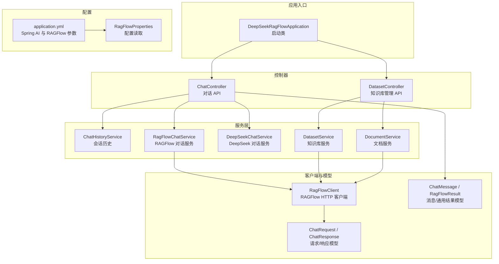
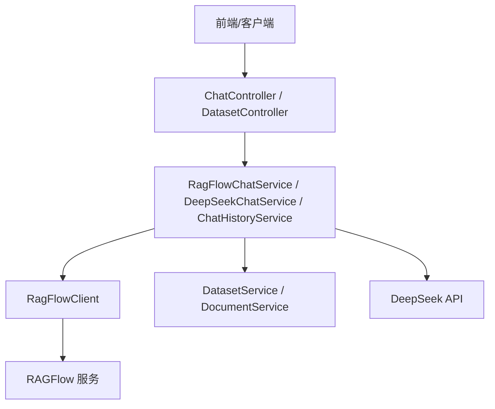
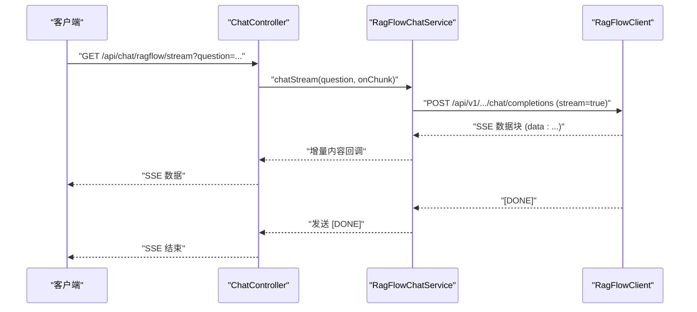
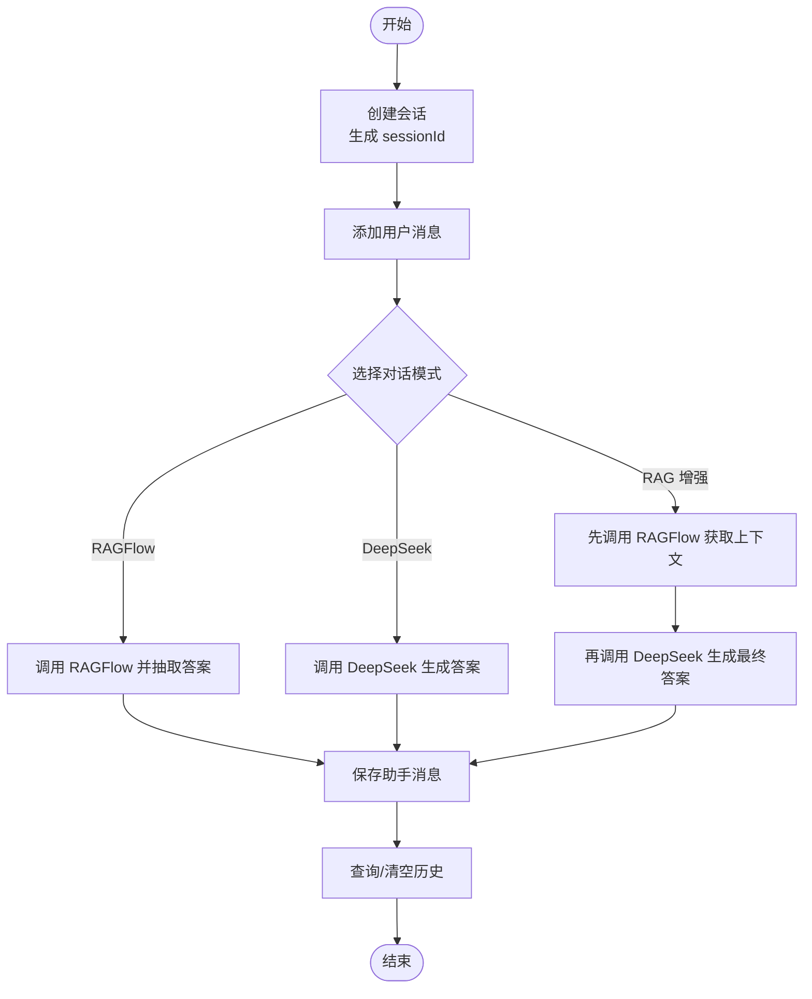
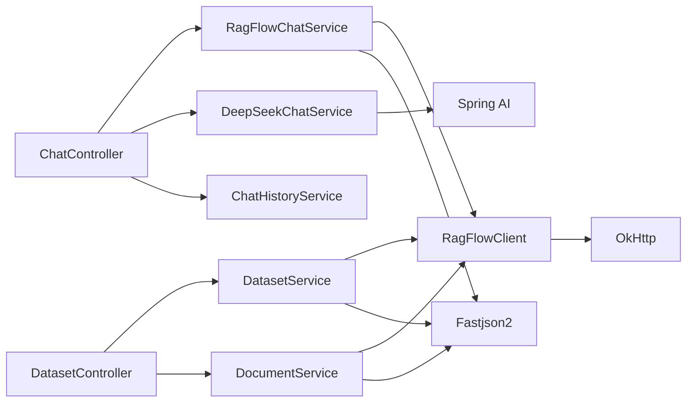

# 对话系统

<cite>
**本文引用的文件**
- [DeepSeekRagFlowApplication.java](file://src/main/java/org/wiki/DeepSeekRagFlowApplication.java)
- [ChatController.java](file://src/main/java/org/wiki/controller/ChatController.java)
- [RagFlowChatService.java](file://src/main/java/org/wiki/service/RagFlowChatService.java)
- [DeepSeekChatService.java](file://src/main/java/org/wiki/service/DeepSeekChatService.java)
- [RagFlowClient.java](file://src/main/java/org/wiki/client/RagFlowClient.java)
- [RagFlowProperties.java](file://src/main/java/org/wiki/config/RagFlowProperties.java)
- [ChatRequest.java](file://src/main/java/org/wiki/model/ChatRequest.java)
- [ChatResponse.java](file://src/main/java/org/wiki/model/ChatResponse.java)
- [ChatMessage.java](file://src/main/java/org/wiki/model/ChatMessage.java)
- [RagFlowResult.java](file://src/main/java/org/wiki/model/RagFlowResult.java)
- [ChatHistoryService.java](file://src/main/java/org/wiki/service/ChatHistoryService.java)
- [DatasetController.java](file://src/main/java/org/wiki/controller/DatasetController.java)
- [DatasetService.java](file://src/main/java/org/wiki/service/DatasetService.java)
- [DocumentService.java](file://src/main/java/org/wiki/service/DocumentService.java)
- [Dataset.java](file://src/main/java/org/wiki/model/Dataset.java)
- [Document.java](file://src/main/java/org/wiki/model/Document.java)
- [application.yml](file://src/main/resources/application.yml)
</cite>

## 目录
1. [简介](#简介)
2. [项目结构](#项目结构)
3. [核心组件](#核心组件)
4. [架构总览](#架构总览)
5. [详细组件分析](#详细组件分析)
6. [依赖分析](#依赖分析)
7. [性能考虑](#性能考虑)
8. [故障排查指南](#故障排查指南)
9. [结论](#结论)
10. [附录](#附录)

## 简介
本项目为 DeepSeek + RAGFlow 的对话系统演示，提供三种对话模式：
- RAGFlow 知识库问答模式：基于外部 RAGFlow 知识库检索，适合需要权威知识来源与引用溯源的场景。
- DeepSeek 直接对话模式：纯大模型对话，适合通用问答与创意性任务。
- RAG 增强对话模式：先检索后生成，结合知识库与大模型能力，兼顾准确性与灵活性。

系统同时支持非流式与流式（SSE）响应，便于实时交互体验；并提供会话历史管理与知识库管理能力，便于构建完整的对话应用。

## 项目结构
后端采用 Spring Boot 结构，按职责划分为控制器、服务层、客户端与模型层，并通过配置文件集中管理外部服务参数。

图表来源
- [DeepSeekRagFlowApplication.java:1-12](file://src/main/java/org/wiki/DeepSeekRagFlowApplication.java#L1-L12)
- [application.yml:1-27](file://src/main/resources/application.yml#L1-L27)
- [RagFlowProperties.java:1-32](file://src/main/java/org/wiki/config/RagFlowProperties.java#L1-L32)
- [ChatController.java:1-276](file://src/main/java/org/wiki/controller/ChatController.java#L1-L276)
- [DatasetController.java:1-197](file://src/main/java/org/wiki/controller/DatasetController.java#L1-L197)
- [RagFlowChatService.java:1-84](file://src/main/java/org/wiki/service/RagFlowChatService.java#L1-L84)
- [DeepSeekChatService.java:1-125](file://src/main/java/org/wiki/service/DeepSeekChatService.java#L1-L125)
- [RagFlowClient.java:1-231](file://src/main/java/org/wiki/client/RagFlowClient.java#L1-L231)
- [ChatRequest.java:1-59](file://src/main/java/org/wiki/model/ChatRequest.java#L1-L59)
- [ChatResponse.java:1-52](file://src/main/java/org/wiki/model/ChatResponse.java#L1-L52)
- [ChatMessage.java:1-82](file://src/main/java/org/wiki/model/ChatMessage.java#L1-L82)
- [RagFlowResult.java:1-25](file://src/main/java/org/wiki/model/RagFlowResult.java#L1-L25)
- [ChatHistoryService.java:1-88](file://src/main/java/org/wiki/service/ChatHistoryService.java#L1-L88)
- [DatasetService.java:1-128](file://src/main/java/org/wiki/service/DatasetService.java#L1-L128)
- [DocumentService.java:1-98](file://src/main/java/org/wiki/service/DocumentService.java#L1-L98)

章节来源
- [DeepSeekRagFlowApplication.java:1-12](file://src/main/java/org/wiki/DeepSeekRagFlowApplication.java#L1-L12)
- [application.yml:1-27](file://src/main/resources/application.yml#L1-L27)

## 核心组件
- 控制器层
  - ChatController：提供三种对话模式的非流式与流式接口，以及会话历史管理。
  - DatasetController：提供知识库的创建、查询、删除与文档上传、解析等管理接口。
- 服务层
  - RagFlowChatService：封装 RAGFlow 对话调用，支持非流式与流式，负责抽取回答文本。
  - DeepSeekChatService：封装 Spring AI 对话调用，支持纯对话与 RAG 增强对话，以及对应的流式输出。
  - ChatHistoryService：基于内存的会话历史存储与清理。
  - DatasetService / DocumentService：对 RAGFlow 知识库与文档的增删查改与解析。
- 客户端与模型
  - RagFlowClient：基于 OkHttp 的 RAGFlow HTTP 客户端，支持通用 CRUD 与 SSE 流式对话。
  - ChatRequest / ChatResponse：RAGFlow OpenAI 兼容接口的请求/响应模型。
  - ChatMessage / RagFlowResult：消息与通用响应模型。
- 配置
  - application.yml：定义 Spring AI 与 RAGFlow 的基础配置项。
  - RagFlowProperties：读取 application.yml 中 ragflow 前缀的配置。

章节来源
- [ChatController.java:1-276](file://src/main/java/org/wiki/controller/ChatController.java#L1-L276)
- [RagFlowChatService.java:1-84](file://src/main/java/org/wiki/service/RagFlowChatService.java#L1-L84)
- [DeepSeekChatService.java:1-125](file://src/main/java/org/wiki/service/DeepSeekChatService.java#L1-L125)
- [ChatHistoryService.java:1-88](file://src/main/java/org/wiki/service/ChatHistoryService.java#L1-L88)
- [DatasetController.java:1-197](file://src/main/java/org/wiki/controller/DatasetController.java#L1-L197)
- [DatasetService.java:1-128](file://src/main/java/org/wiki/service/DatasetService.java#L1-L128)
- [DocumentService.java:1-98](file://src/main/java/org/wiki/service/DocumentService.java#L1-L98)
- [RagFlowClient.java:1-231](file://src/main/java/org/wiki/client/RagFlowClient.java#L1-L231)
- [ChatRequest.java:1-59](file://src/main/java/org/wiki/model/ChatRequest.java#L1-L59)
- [ChatResponse.java:1-52](file://src/main/java/org/wiki/model/ChatResponse.java#L1-L52)
- [ChatMessage.java:1-82](file://src/main/java/org/wiki/model/ChatMessage.java#L1-L82)
- [RagFlowResult.java:1-25](file://src/main/java/org/wiki/model/RagFlowResult.java#L1-L25)
- [application.yml:1-27](file://src/main/resources/application.yml#L1-L27)
- [RagFlowProperties.java:1-32](file://src/main/java/org/wiki/config/RagFlowProperties.java#L1-L32)

## 架构总览
系统采用分层架构，控制器负责对外暴露 API，服务层协调业务逻辑，客户端封装外部服务调用，模型层承载数据结构。RAGFlow 与 DeepSeek 通过统一的服务抽象接入，便于扩展与替换。

图表来源
- [ChatController.java:1-276](file://src/main/java/org/wiki/controller/ChatController.java#L1-L276)
- [RagFlowChatService.java:1-84](file://src/main/java/org/wiki/service/RagFlowChatService.java#L1-L84)
- [DeepSeekChatService.java:1-125](file://src/main/java/org/wiki/service/DeepSeekChatService.java#L1-L125)
- [RagFlowClient.java:1-231](file://src/main/java/org/wiki/client/RagFlowClient.java#L1-L231)
- [DatasetController.java:1-197](file://src/main/java/org/wiki/controller/DatasetController.java#L1-L197)
- [DatasetService.java:1-128](file://src/main/java/org/wiki/service/DatasetService.java#L1-L128)
- [DocumentService.java:1-98](file://src/main/java/org/wiki/service/DocumentService.java#L1-L98)

## 详细组件分析

### 对话模式与实现原理
- RAGFlow 知识库问答模式
  - 实现要点：通过 RagFlowClient 调用 RAGFlow OpenAI 兼容接口，非流式返回完整回答；流式模式解析 SSE 数据块，提取增量内容与引用信息。
  - 适用场景：需要权威知识来源、可溯源引用的问答。
  - 性能特点：依赖外部 RAGFlow 服务延迟与吞吐；流式可降低首字延迟。
- DeepSeek 直接对话模式
  - 实现要点：使用 Spring AI ChatClient 直连 DeepSeek API，支持纯对话与 RAG 增强（通过系统提示词注入上下文）。
  - 适用场景：通用问答、创意任务、快速原型验证。
  - 性能特点：低延迟、高并发；受网络与模型服务影响。
- RAG 增强对话模式
  - 实现要点：先调用 RAGFlow 获取上下文，再将上下文注入 DeepSeek 的系统提示词中生成回答。
  - 适用场景：需要结合权威知识与大模型泛化能力的任务。
  - 性能特点：两次调用叠加延迟，但回答质量更高。

章节来源
- [RagFlowChatService.java:1-84](file://src/main/java/org/wiki/service/RagFlowChatService.java#L1-L84)
- [DeepSeekChatService.java:1-125](file://src/main/java/org/wiki/service/DeepSeekChatService.java#L1-L125)
- [RagFlowClient.java:1-231](file://src/main/java/org/wiki/client/RagFlowClient.java#L1-L231)

### 流式响应（SSE）技术
- 技术实现
  - RAGFlow 流式：RagFlowClient 以 SSE 形式接收数据，逐行解析 data: 行，提取增量内容与引用信息，通过回调传递给上层。
  - DeepSeek 流式：DeepSeekChatService 使用 Spring AI 的 Flux 流式输出，ChatController 将其拼接 [DONE] 结束标记。
  - 统一出口：ChatController 提供 SseEmitter 与 Flux 两种方式，分别用于复杂控制（RAGFlow 增强）与简单直通（DeepSeek）。
- 数据传输格式
  - SSE：以 data: 开头的行，最后以 [DONE] 结束。
  - JSON：RAGFlow SSE 内容为 JSON 字符串，需解析 choices.delta.content 与引用字段。
- 连接管理与错误处理
  - 超时设置：SseEmitter 设置较长超时（毫秒级），避免长对话中断。
  - 错误处理：捕获 IO 异常并 completeWithError，确保客户端收到终止信号。
  - 日志记录：对关键步骤进行日志记录，便于定位问题。

图表来源
- [ChatController.java:85-107](file://src/main/java/org/wiki/controller/ChatController.java#L85-L107)
- [RagFlowChatService.java:50-72](file://src/main/java/org/wiki/service/RagFlowChatService.java#L50-L72)
- [RagFlowClient.java:154-200](file://src/main/java/org/wiki/client/RagFlowClient.java#L154-L200)

章节来源
- [ChatController.java:85-107](file://src/main/java/org/wiki/controller/ChatController.java#L85-L107)
- [RagFlowChatService.java:50-72](file://src/main/java/org/wiki/service/RagFlowChatService.java#L50-L72)
- [RagFlowClient.java:154-200](file://src/main/java/org/wiki/client/RagFlowClient.java#L154-L200)

### API 使用示例与规范
- 通用约定
  - 基础路径：/api/chat 或 /api/datasets
  - 认证：RAGFlow 通过 Authorization: Bearer 在 HTTP 头中携带 API Key
  - 超时：RAGFlow 客户端读取配置的超时时间
- 对话 API
  - RAGFlow 非流式
    - 方法与路径：POST /api/chat/ragflow
    - 参数：question（必填），sessionId（可选）
    - 响应：success（布尔），answer（字符串），sessionId（字符串），data（原始响应对象）
  - RAGFlow 流式
    - 方法与路径：GET /api/chat/ragflow/stream?question=...
    - 响应：SSE 流，逐段返回增量内容；结束时发送 [DONE]
  - DeepSeek 非流式
    - 方法与路径：POST /api/chat/deepseek
    - 参数：question（必填），sessionId（可选）
    - 响应：success（布尔），answer（字符串），sessionId（字符串）
  - DeepSeek 流式
    - 方法与路径：GET /api/chat/deepseek/stream?question=...
    - 响应：SSE 流，逐段返回增量内容；结束时发送 [DONE]
  - DeepSeek + RAG 增强（非流式）
    - 方法与路径：POST /api/chat/deepseek/rag
    - 参数：question（必填），sessionId（可选）
    - 响应：success（布尔），answer（字符串），context（检索上下文），sessionId（字符串）
  - DeepSeek + RAG 增强（流式）
    - 方法与路径：GET /api/chat/deepseek/rag/stream?question=...
    - 响应：SSE 流，先返回检索上下文，再返回增量回答；结束时发送 [DONE]
- 会话历史 API
  - 创建会话：POST /api/chat/session → {"success": true, "sessionId": "..."}
  - 获取历史：GET /api/chat/history/{sessionId} → {"success": true, "data": [...]}
  - 清空历史：DELETE /api/chat/history/{sessionId} → {"success": true}
- 知识库管理 API
  - 创建知识库：POST /api/datasets → {"success": true, "data": {...}}
  - 获取列表：GET /api/datasets → {"success": true, "data": [...]}
  - 获取详情：GET /api/datasets/{datasetId} → {"success": true, "data": {...}}
  - 删除知识库：DELETE /api/datasets/{datasetId} → {"success": true}
  - 上传文档：POST /api/datasets/{datasetId}/documents → {"success": true, "data": "..."}
  - 获取文档列表：GET /api/datasets/{datasetId}/documents → {"success": true, "data": [...]}
  - 删除文档：DELETE /api/datasets/{datasetId}/documents/{documentId} → {"success": true}
  - 运行文档：POST /api/datasets/{datasetId}/documents/{documentId}/run → {"success": true, "data": "..."}

章节来源
- [ChatController.java:51-174](file://src/main/java/org/wiki/controller/ChatController.java#L51-L174)
- [ChatController.java:223-274](file://src/main/java/org/wiki/controller/ChatController.java#L223-L274)
- [DatasetController.java:41-195](file://src/main/java/org/wiki/controller/DatasetController.java#L41-L195)

### 三模式差异与选择策略
- 差异对比
  - RAGFlow 知识库问答：强引用、强权威，适合合规与审计场景；流式可改善首字延迟。
  - DeepSeek 直接对话：低延迟、高并发，适合通用与快速迭代；无外部知识库引用。
  - RAG 增强对话：兼顾权威与泛化，适合高质量问答；整体延迟较高。
- 选择策略
  - 若强调权威与可溯源：优先 RAGFlow 非流式或流式。
  - 若强调速度与成本：优先 DeepSeek 直接对话。
  - 若追求最佳回答质量：优先 RAG 增强对话。
  - 若需要混合策略：可先走 RAG 增强，若命中不足再回退至 DeepSeek 直接对话。

章节来源
- [RagFlowChatService.java:1-84](file://src/main/java/org/wiki/service/RagFlowChatService.java#L1-L84)
- [DeepSeekChatService.java:1-125](file://src/main/java/org/wiki/service/DeepSeekChatService.java#L1-L125)
- [ChatController.java:148-174](file://src/main/java/org/wiki/controller/ChatController.java#L148-L174)

### 会话历史与状态管理
- 会话创建：自动生成 sessionId，用于关联一组消息。
- 消息存储：按会话聚合，限制最大消息数量，避免内存膨胀。
- 历史查询：支持全量与最近 N 条查询。
- 清空会话：一键清理，便于重新开始。

图表来源
- [ChatHistoryService.java:1-88](file://src/main/java/org/wiki/service/ChatHistoryService.java#L1-L88)
- [ChatController.java:51-174](file://src/main/java/org/wiki/controller/ChatController.java#L51-L174)

章节来源
- [ChatHistoryService.java:1-88](file://src/main/java/org/wiki/service/ChatHistoryService.java#L1-L88)
- [ChatMessage.java:1-82](file://src/main/java/org/wiki/model/ChatMessage.java#L1-L82)

## 依赖分析
- 组件耦合
  - ChatController 依赖 RagFlowChatService、DeepSeekChatService、ChatHistoryService，承担编排职责。
  - RagFlowChatService 依赖 RagFlowClient，负责与外部服务交互。
  - DeepSeekChatService 依赖 Spring AI ChatClient，负责与 DeepSeek 对话。
  - DatasetController 依赖 DatasetService 与 DocumentService，提供知识库管理能力。
- 外部依赖
  - OkHttp：RAGFlowClient 的 HTTP 客户端。
  - Spring AI：DeepSeekChatService 的对话框架。
  - Fastjson2：RAGFlowClient 与服务层的 JSON 序列化/反序列化。
- 配置依赖
  - application.yml 与 RagFlowProperties：集中管理 RAGFlow 与 DeepSeek 的访问参数。

图表来源
- [ChatController.java:1-276](file://src/main/java/org/wiki/controller/ChatController.java#L1-L276)
- [RagFlowChatService.java:1-84](file://src/main/java/org/wiki/service/RagFlowChatService.java#L1-L84)
- [DeepSeekChatService.java:1-125](file://src/main/java/org/wiki/service/DeepSeekChatService.java#L1-L125)
- [RagFlowClient.java:1-231](file://src/main/java/org/wiki/client/RagFlowClient.java#L1-L231)
- [DatasetController.java:1-197](file://src/main/java/org/wiki/controller/DatasetController.java#L1-L197)
- [DatasetService.java:1-128](file://src/main/java/org/wiki/service/DatasetService.java#L1-L128)
- [DocumentService.java:1-98](file://src/main/java/org/wiki/service/DocumentService.java#L1-L98)

章节来源
- [RagFlowClient.java:1-231](file://src/main/java/org/wiki/client/RagFlowClient.java#L1-L231)
- [application.yml:1-27](file://src/main/resources/application.yml#L1-L27)
- [RagFlowProperties.java:1-32](file://src/main/java/org/wiki/config/RagFlowProperties.java#L1-L32)

## 性能考虑
- 流式输出
  - RAGFlow 流式：减少等待时间，提升用户体验；注意解析开销与异常恢复。
  - DeepSeek 流式：Spring AI 原生支持，性能稳定；注意网络抖动与背压。
- 超时与并发
  - RAGFlow 客户端设置读超时，避免长时间阻塞；ChatController 使用线程池执行流式任务。
  - SseEmitter 设置合理超时，防止连接泄漏。
- 缓存与限流
  - 可在网关或应用层增加缓存与限流策略，避免突发流量冲击外部服务。
- 日志与监控
  - 对关键链路增加埋点与指标采集，便于定位性能瓶颈。

## 故障排查指南
- 常见错误与处理
  - RAGFlow API 调用失败：检查 base-url、api-key、chat-id 与网络连通性；查看响应状态与错误体。
  - 流式解析异常：关注 SSE 数据行格式，确保正确识别 data: 与 [DONE]。
  - DeepSeek 对话异常：检查 Spring AI 配置、模型名与温度参数；确认网络可达。
  - 会话历史异常：确认 sessionId 存在且未被清理；检查内存存储上限。
- 建议排查步骤
  - 打开调试日志，复现问题并定位具体环节。
  - 分别测试 RAGFlow 与 DeepSeek 的独立可用性。
  - 使用最小化请求参数复现问题，逐步缩小范围。
  - 关注超时与连接池配置，避免资源耗尽。

章节来源
- [RagFlowClient.java:37-129](file://src/main/java/org/wiki/client/RagFlowClient.java#L37-L129)
- [RagFlowClient.java:175-200](file://src/main/java/org/wiki/client/RagFlowClient.java#L175-L200)
- [application.yml:7-22](file://src/main/resources/application.yml#L7-L22)

## 结论
本项目通过清晰的分层设计与统一的服务抽象，实现了 RAGFlow 与 DeepSeek 的灵活组合，覆盖了从权威问答到通用对话的多种场景。配合流式响应与会话历史管理，能够满足大多数对话应用的需求。建议在生产环境中进一步完善缓存、限流与监控体系，并针对不同业务场景选择合适的对话模式与参数配置。

## 附录
- 配置项说明
  - server.port：应用监听端口
  - spring.ai.openai.api-key：DeepSeek API Key
  - spring.ai.openai.base-url：DeepSeek API 基础地址
  - spring.ai.openai.chat.options.model：模型名称（如 deepseek-chat）
  - spring.ai.openai.chat.options.temperature/max-tokens：推理参数
  - ragflow.base-url/api-key/chat-id/timeout：RAGFlow 服务参数

章节来源
- [application.yml:1-27](file://src/main/resources/application.yml#L1-L27)
- [RagFlowProperties.java:1-32](file://src/main/java/org/wiki/config/RagFlowProperties.java#L1-L32)