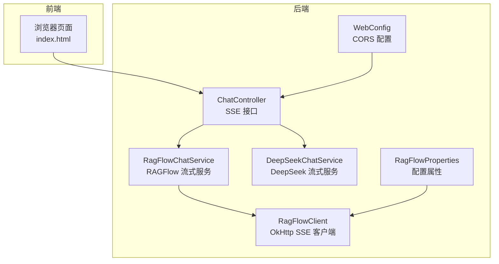
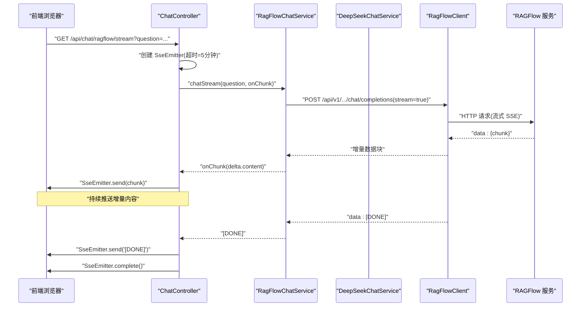
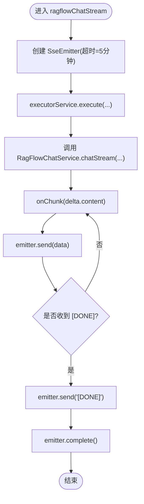
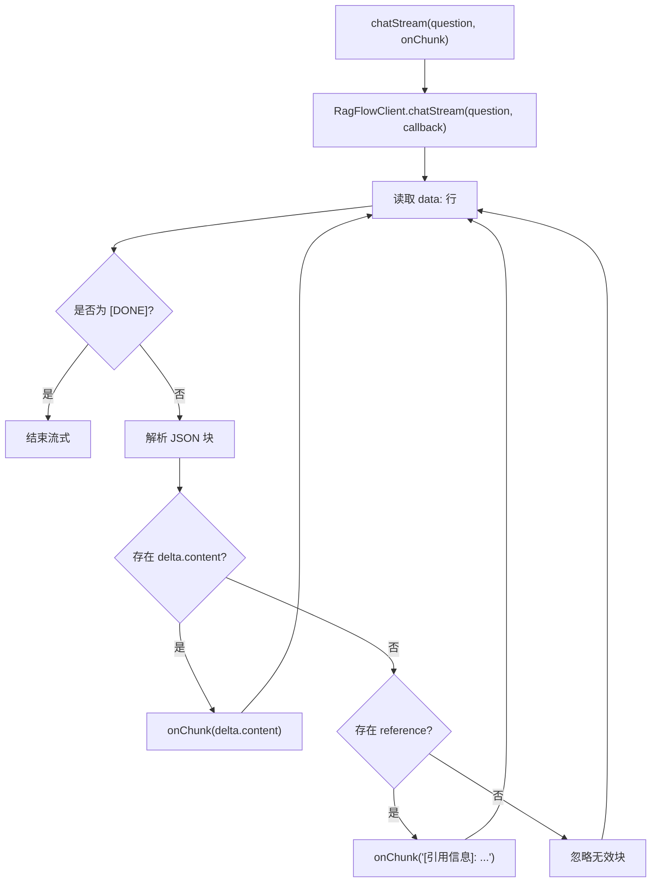
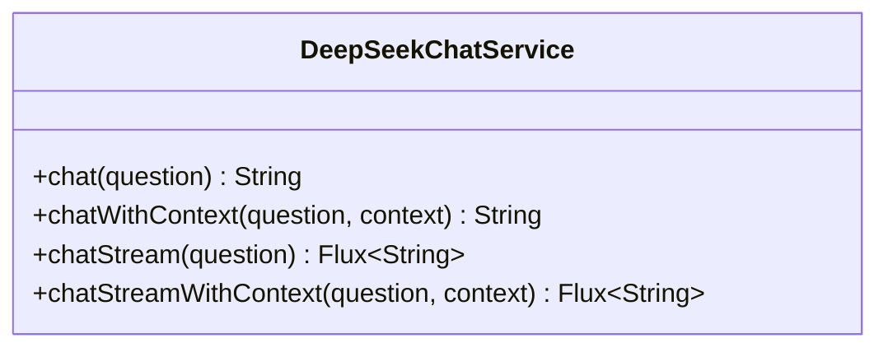
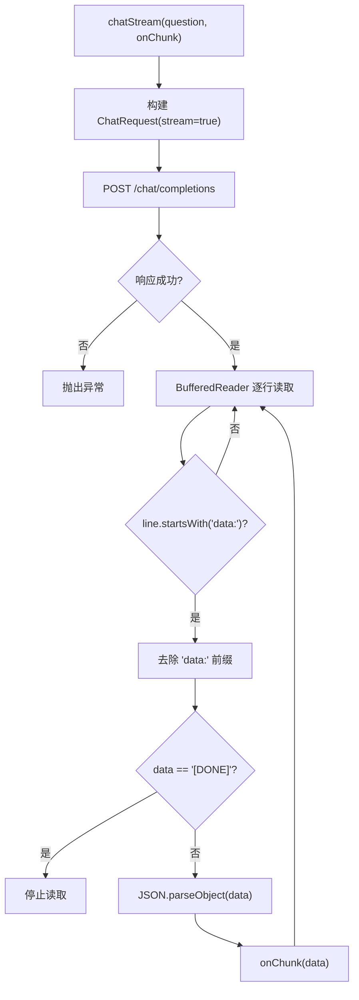
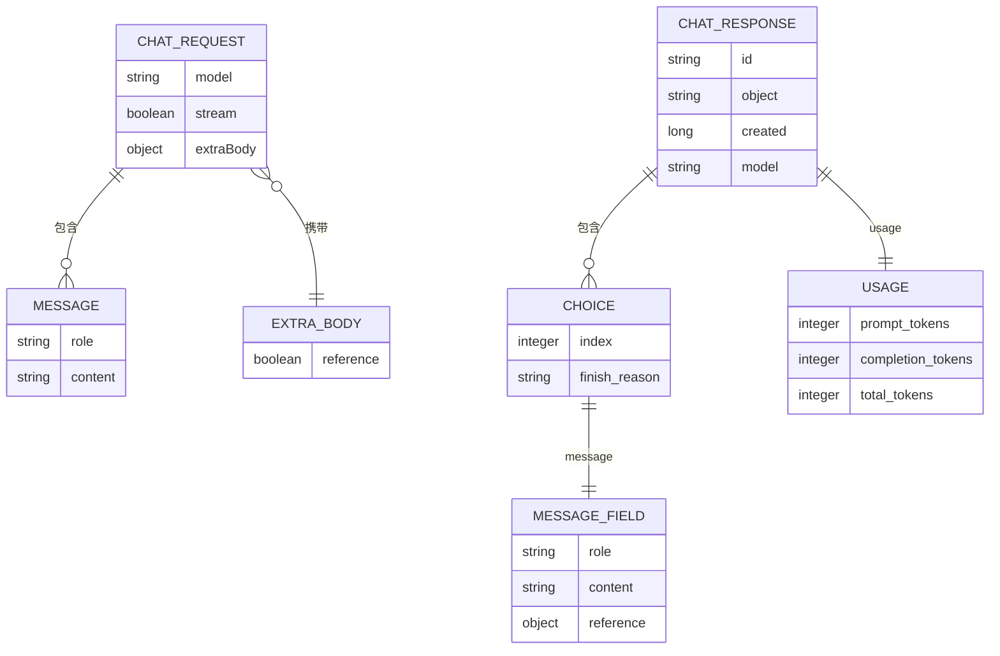
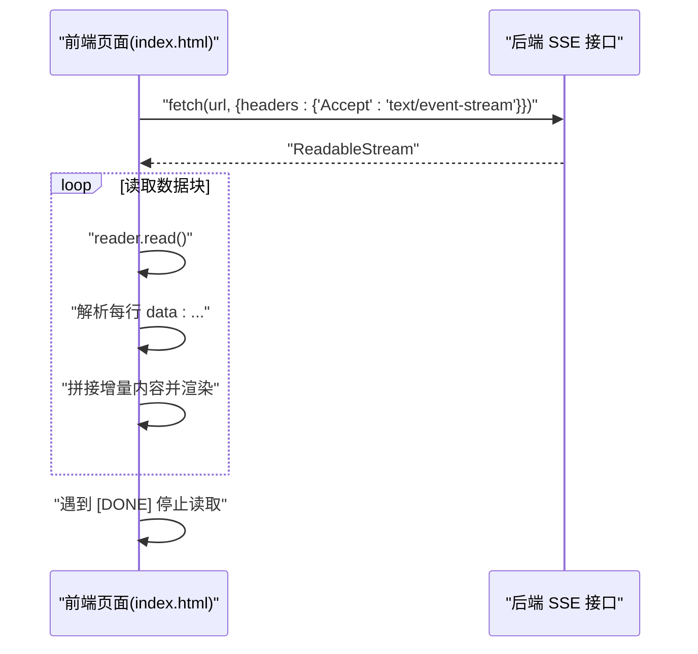
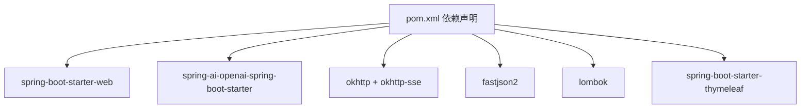

# 流式响应机制

<cite>
**本文引用的文件**
- [ChatController.java](file://src/main/java/org/wiki/controller/ChatController.java)
- [RagFlowChatService.java](file://src/main/java/org/wiki/service/RagFlowChatService.java)
- [DeepSeekChatService.java](file://src/main/java/org/wiki/service/DeepSeekChatService.java)
- [RagFlowClient.java](file://src/main/java/org/wiki/client/RagFlowClient.java)
- [ChatChunk.java](file://src/main/java/org/wiki/model/ChatChunk.java)
- [ChatResponse.java](file://src/main/java/org/wiki/model/ChatResponse.java)
- [ChatRequest.java](file://src/main/java/org/wiki/model/ChatRequest.java)
- [WebConfig.java](file://src/main/java/org/wiki/config/WebConfig.java)
- [RagFlowProperties.java](file://src/main/java/org/wiki/config/RagFlowProperties.java)
- [application.yml](file://src/main/resources/application.yml)
- [index.html](file://src/main/resources/templates/index.html)
- [pom.xml](file://pom.xml)
- [DeepSeekRagFlowApplication.java](file://src/main/java/org/wiki/DeepSeekRagFlowApplication.java)
</cite>

## 目录
1. [简介](#简介)
2. [项目结构](#项目结构)
3. [核心组件](#核心组件)
4. [架构总览](#架构总览)
5. [详细组件分析](#详细组件分析)
6. [依赖关系分析](#依赖关系分析)
7. [性能考量](#性能考量)
8. [故障排查指南](#故障排查指南)
9. [结论](#结论)
10. [附录](#附录)

## 简介
本文件围绕流式响应机制展开，重点解释 Server-Sent Events（SSE）在实时对话中的应用，涵盖连接建立、数据传输格式、连接管理策略；详细说明流式响应的数据结构（事件类型、数据格式、结束标记“[DONE]”的处理机制）；解释线程池管理与异步处理（ExecutorService 的使用、异常处理、连接超时控制）；提供流式 API 的使用指南（客户端连接方式、事件监听、错误恢复策略）；并从用户体验、网络效率与服务器资源消耗角度分析优势与权衡，最后给出前端集成示例与最佳实践建议。

## 项目结构
该项目采用 Spring Boot + Spring MVC + Spring AI 的组合，控制器负责暴露 REST API，服务层封装业务逻辑，客户端封装外部服务调用，模板页面提供前端交互入口。与流式响应直接相关的模块包括：
- 控制器层：暴露 SSE 流式接口
- 服务层：封装 RAGFlow 与 DeepSeek 的流式调用
- 客户端层：封装 OkHttp 与 RAGFlow 的 SSE 通信
- 配置层：CORS、属性绑定、应用启动
- 前端模板：演示如何消费 SSE 流

图表来源
- [ChatController.java:35-107](file://src/main/java/org/wiki/controller/ChatController.java#L35-L107)
- [RagFlowChatService.java:50-72](file://src/main/java/org/wiki/service/RagFlowChatService.java#L50-L72)
- [DeepSeekChatService.java:86-92](file://src/main/java/org/wiki/service/DeepSeekChatService.java#L86-L92)
- [RagFlowClient.java:154-200](file://src/main/java/org/wiki/client/RagFlowClient.java#L154-L200)
- [WebConfig.java:14-21](file://src/main/java/org/wiki/config/WebConfig.java#L14-L21)
- [RagFlowProperties.java:10-31](file://src/main/java/org/wiki/config/RagFlowProperties.java#L10-L31)

章节来源
- [ChatController.java:35-107](file://src/main/java/org/wiki/controller/ChatController.java#L35-L107)
- [RagFlowChatService.java:50-72](file://src/main/java/org/wiki/service/RagFlowChatService.java#L50-L72)
- [DeepSeekChatService.java:86-92](file://src/main/java/org/wiki/service/DeepSeekChatService.java#L86-L92)
- [RagFlowClient.java:154-200](file://src/main/java/org/wiki/client/RagFlowClient.java#L154-L200)
- [WebConfig.java:14-21](file://src/main/java/org/wiki/config/WebConfig.java#L14-L21)
- [RagFlowProperties.java:10-31](file://src/main/java/org/wiki/config/RagFlowProperties.java#L10-L31)

## 核心组件
- ChatController：提供 SSE 流式接口，使用 SseEmitter 或 Reactor Flux 实现流式输出，并通过线程池执行外部调用。
- RagFlowChatService：封装 RAGFlow 的 OpenAI 兼容接口，支持非流式与流式两种模式；流式模式中解析增量数据块。
- DeepSeekChatService：通过 Spring AI 的 ChatClient 实现流式输出，支持纯对话与 RAG 增强流式。
- RagFlowClient：基于 OkHttp 的 HTTP 客户端，负责与 RAGFlow SSE 接口通信，逐行读取 data: 行并过滤“[DONE]”。
- WebConfig：启用跨域访问，确保前端页面能正常访问后端 SSE 接口。
- RagFlowProperties：RAGFlow 服务地址、API Key、聊天助手 ID、超时等配置项。
- application.yml：Spring AI 与 RAGFlow 的基础配置，包括 API Key、Base URL、模型参数等。

章节来源
- [ChatController.java:35-107](file://src/main/java/org/wiki/controller/ChatController.java#L35-L107)
- [RagFlowChatService.java:50-72](file://src/main/java/org/wiki/service/RagFlowChatService.java#L50-L72)
- [DeepSeekChatService.java:86-92](file://src/main/java/org/wiki/service/DeepSeekChatService.java#L86-L92)
- [RagFlowClient.java:154-200](file://src/main/java/org/wiki/client/RagFlowClient.java#L154-L200)
- [WebConfig.java:14-21](file://src/main/java/org/wiki/config/WebConfig.java#L14-L21)
- [RagFlowProperties.java:10-31](file://src/main/java/org/wiki/config/RagFlowProperties.java#L10-L31)
- [application.yml:1-27](file://src/main/resources/application.yml#L1-L27)

## 架构总览
SSE 流式对话的整体流程如下：
- 前端发起 SSE 请求，后端控制器创建 SseEmitter 或返回 Flux。
- 控制器在独立线程中调用服务层，服务层再调用外部客户端（OkHttp 或 Spring AI）。
- 外部客户端接收流式数据，逐行解析 data: 行，过滤“[DONE]”，并将增量数据块推送到 SSE。
- 前端持续接收并渲染增量内容，直到收到“[DONE]”。

图表来源
- [ChatController.java:85-107](file://src/main/java/org/wiki/controller/ChatController.java#L85-L107)
- [RagFlowChatService.java:50-72](file://src/main/java/org/wiki/service/RagFlowChatService.java#L50-L72)
- [RagFlowClient.java:154-200](file://src/main/java/org/wiki/client/RagFlowClient.java#L154-L200)

## 详细组件分析

### ChatController（SSE 控制器）
- 提供三类流式接口：
  - RAGFlow 流式：GET /api/chat/ragflow/stream
  - DeepSeek 流式：GET /api/chat/deepseek/stream
  - DeepSeek + RAG 增强流式：GET /api/chat/deepseek/rag/stream
- 使用 SseEmitter 实现 SSE 输出，设置超时时间为 5 分钟。
- 使用缓存线程池（newCachedThreadPool）在独立线程中执行外部调用，避免阻塞主线程。
- 对异常进行捕获并调用 completeWithError，确保连接正确关闭。
- 在 RAGFlow 流式场景中，解析增量数据并在末尾发送“[DONE]”。

图表来源
- [ChatController.java:85-107](file://src/main/java/org/wiki/controller/ChatController.java#L85-L107)
- [RagFlowChatService.java:50-72](file://src/main/java/org/wiki/service/RagFlowChatService.java#L50-L72)

章节来源
- [ChatController.java:85-107](file://src/main/java/org/wiki/controller/ChatController.java#L85-L107)
- [ChatController.java:238-274](file://src/main/java/org/wiki/controller/ChatController.java#L238-L274)

### RagFlowChatService（RAGFlow 流式服务）
- chatStream：调用 RagFlowClient.chatStream，解析 JSON 增量块，提取 delta.content 并回调上层。
- 对引用信息（reference）进行特殊处理，将其转换为人类可读的提示并回调。
- 异常处理：解析异常时记录警告日志，保证流式过程不中断。

图表来源
- [RagFlowChatService.java:50-72](file://src/main/java/org/wiki/service/RagFlowChatService.java#L50-L72)
- [RagFlowClient.java:154-200](file://src/main/java/org/wiki/client/RagFlowClient.java#L154-L200)

章节来源
- [RagFlowChatService.java:50-72](file://src/main/java/org/wiki/service/RagFlowChatService.java#L50-L72)

### DeepSeekChatService（DeepSeek 流式服务）
- chatStream：通过 Spring AI ChatClient.prompt().user(...).stream() 返回 Flux<String>。
- chatStreamWithContext：在系统提示中注入检索到的上下文，实现 RAG 增强的流式回答。
- 无需手动解析 SSE，由 Spring AI 框架自动处理流式分片。

图表来源
- [DeepSeekChatService.java:86-123](file://src/main/java/org/wiki/service/DeepSeekChatService.java#L86-L123)

章节来源
- [DeepSeekChatService.java:86-123](file://src/main/java/org/wiki/service/DeepSeekChatService.java#L86-L123)

### RagFlowClient（RAGFlow SSE 客户端）
- chatStream：构造 OpenAI 兼容的 ChatRequest（stream=true），发送 POST 请求。
- 逐行读取响应体，匹配以“data:”开头的行，去除前缀后解析为 JSON。
- 过滤“[DONE]”标记，避免将其作为增量内容推送。
- 对非成功响应抛出异常，便于上层统一处理。

图表来源
- [RagFlowClient.java:154-200](file://src/main/java/org/wiki/client/RagFlowClient.java#L154-L200)

章节来源
- [RagFlowClient.java:154-200](file://src/main/java/org/wiki/client/RagFlowClient.java#L154-L200)

### 数据模型与传输格式
- ChatRequest：封装模型名、消息列表、是否流式、额外参数（如是否包含引用）。
- ChatResponse：封装非流式响应的 choices、usage 等字段。
- ChatChunk：封装流式响应的增量块结构（choices[].delta.content、reference 等）。

图表来源
- [ChatRequest.java:17-58](file://src/main/java/org/wiki/model/ChatRequest.java#L17-L58)
- [ChatResponse.java:16-51](file://src/main/java/org/wiki/model/ChatResponse.java#L16-L51)
- [ChatChunk.java:16-41](file://src/main/java/org/wiki/model/ChatChunk.java#L16-L41)

章节来源
- [ChatRequest.java:17-58](file://src/main/java/org/wiki/model/ChatRequest.java#L17-L58)
- [ChatResponse.java:16-51](file://src/main/java/org/wiki/model/ChatResponse.java#L16-L51)
- [ChatChunk.java:16-41](file://src/main/java/org/wiki/model/ChatChunk.java#L16-L41)

### 线程池管理与异步处理
- 控制器使用缓存线程池（newCachedThreadPool）执行外部调用，避免阻塞 Web 线程。
- 对每个 SSE 连接设置超时（5 分钟），防止长时间占用连接资源。
- 异常处理：在回调中捕获 IO 异常并调用 completeWithError，确保连接被正确关闭。
- RAGFlow + RAG 增强模式中，先调用非流式 RAGFlow 获取上下文，再进行流式 DeepSeek 生成，结合 SseEmitter 推送增量。

章节来源
- [ChatController.java:35-41](file://src/main/java/org/wiki/controller/ChatController.java#L35-L41)
- [ChatController.java:85-107](file://src/main/java/org/wiki/controller/ChatController.java#L85-L107)
- [ChatController.java:238-274](file://src/main/java/org/wiki/controller/ChatController.java#L238-L274)

### 前端集成与事件监听
- 前端页面通过 fetch 获取 ReadableStream，使用 getReader() 逐块读取。
- 逐行解析“data:”行，拼接增量内容并进行 Markdown 渲染。
- 遇到“[DONE]”标记时停止读取，完成渲染。
- 提供清空对话、切换模式、快捷提问等功能。

图表来源
- [index.html:295-325](file://src/main/resources/templates/index.html#L295-L325)

章节来源
- [index.html:295-325](file://src/main/resources/templates/index.html#L295-L325)

## 依赖关系分析
- 依赖 Spring Boot Web、Spring AI OpenAI Starter、OkHttp、FastJSON2、Lombok、Thymeleaf。
- OkHttp SSE 依赖用于处理 RAGFlow 的 SSE 流式响应。
- Spring AI 用于 DeepSeek 的原生流式输出。

图表来源
- [pom.xml:25-88](file://pom.xml#L25-L88)

章节来源
- [pom.xml:25-88](file://pom.xml#L25-L88)

## 性能考量
- 用户体验
  - 流式响应显著降低首字延迟，提升交互流畅性。
  - 增量渲染使用户感知更及时，减少等待焦虑。
- 网络效率
  - SSE 单向推送，避免轮询开销；逐块传输减少内存峰值。
  - “[DONE]”标记确保前端及时停止读取，避免无效传输。
- 服务器资源
  - 缓存线程池避免阻塞 Web 线程；SSE 超时控制防止资源泄漏。
  - RAGFlow + RAG 增强模式中，先非流式获取上下文，再流式生成，平衡了延迟与准确性。
- 权衡
  - 流式模式需要更复杂的异常处理与连接管理。
  - 大并发下需评估线程池大小与 SSE 超时策略，避免资源耗尽。

## 故障排查指南
- 前端无法接收 SSE
  - 检查 CORS 配置是否允许 /api/** 路径跨域。
  - 确认浏览器支持 EventSource 或使用 fetch + ReadableStream 方案。
- 连接过早断开
  - 检查 SseEmitter 超时设置（默认 5 分钟）是否合理。
  - 观察后端日志是否存在 IO 异常导致 completeWithError。
- 数据解析异常
  - RAGFlow 客户端对非标准行或异常 JSON 进行异常捕获，记录警告日志但不中断流。
- RAGFlow API 调用失败
  - 检查 baseUrl、apiKey、chatId、timeout 等配置项。
  - 关注非成功响应的状态码与错误体，必要时增加重试逻辑。

章节来源
- [WebConfig.java:14-21](file://src/main/java/org/wiki/config/WebConfig.java#L14-L21)
- [RagFlowClient.java:175-179](file://src/main/java/org/wiki/client/RagFlowClient.java#L175-L179)
- [RagFlowProperties.java:10-31](file://src/main/java/org/wiki/config/RagFlowProperties.java#L10-L31)
- [application.yml:17-22](file://src/main/resources/application.yml#L17-L22)

## 结论
本项目通过 SSE 与 Spring AI 的结合，实现了高效的流式对话能力。RAGFlow 侧使用 OkHttp SSE 客户端逐行解析增量数据，DeepSeek 侧利用 Spring AI 原生 Flux 流式输出。配合缓存线程池与超时控制，既提升了用户体验，也兼顾了服务器资源的合理使用。前端通过 fetch + ReadableStream 实现增量渲染与“[DONE]”标记处理，形成完整的实时对话闭环。

## 附录

### 流式 API 使用指南
- RAGFlow 流式接口
  - 方法：GET
  - 路径：/api/chat/ragflow/stream
  - 参数：question（必填）
  - 返回：text/event-stream，逐行 data: 增量内容，末尾追加“[DONE]”
- DeepSeek 流式接口
  - 方法：GET
  - 路径：/api/chat/deepseek/stream
  - 参数：question（必填）
  - 返回：text/event-stream，逐行增量内容，末尾追加“[DONE]”
- DeepSeek + RAG 增强流式接口
  - 方法：GET
  - 路径：/api/chat/deepseek/rag/stream
  - 参数：question（必填）
  - 返回：text/event-stream，逐行增量内容，末尾追加“[DONE]”

章节来源
- [ChatController.java:85-107](file://src/main/java/org/wiki/controller/ChatController.java#L85-L107)
- [ChatController.java:223-228](file://src/main/java/org/wiki/controller/ChatController.java#L223-L228)
- [ChatController.java:238-274](file://src/main/java/org/wiki/controller/ChatController.java#L238-L274)

### 最佳实践建议
- 前端
  - 使用 fetch + ReadableStream 读取 SSE，逐行解析“data:”并增量渲染。
  - 遇到“[DONE]”立即停止读取，释放资源。
  - 添加错误处理与重试逻辑，提升鲁棒性。
- 后端
  - 合理设置 SseEmitter 超时，避免长时间占用连接。
  - 在回调中捕获 IO 异常并调用 completeWithError，确保连接正确关闭。
  - 对外部 API 的异常进行统一处理，记录日志并返回友好的错误信息。
- 配置
  - 明确 baseUrl、apiKey、chatId、timeout 等配置项，确保与实际环境一致。
  - 根据业务负载调整线程池大小与 SSE 超时策略。

章节来源
- [index.html:295-325](file://src/main/resources/templates/index.html#L295-L325)
- [ChatController.java:85-107](file://src/main/java/org/wiki/controller/ChatController.java#L85-L107)
- [RagFlowClient.java:175-179](file://src/main/java/org/wiki/client/RagFlowClient.java#L175-L179)
- [application.yml:17-22](file://src/main/resources/application.yml#L17-L22)