# 核心功能

<cite>
**本文引用的文件**
- [DeepSeekRagFlowApplication.java](file://src/main/java/org/wiki/DeepSeekRagFlowApplication.java)
- [ChatController.java](file://src/main/java/org/wiki/controller/ChatController.java)
- [DatasetController.java](file://src/main/java/org/wiki/controller/DatasetController.java)
- [RagFlowChatService.java](file://src/main/java/org/wiki/service/RagFlowChatService.java)
- [DeepSeekChatService.java](file://src/main/java/org/wiki/service/DeepSeekChatService.java)
- [RagFlowClient.java](file://src/main/java/org/wiki/client/RagFlowClient.java)
- [ChatHistoryService.java](file://src/main/java/org/wiki/service/ChatHistoryService.java)
- [ChatMessage.java](file://src/main/java/org/wiki/model/ChatMessage.java)
- [ChatResponse.java](file://src/main/java/org/wiki/model/ChatResponse.java)
- [Dataset.java](file://src/main/java/org/wiki/model/Dataset.java)
- [Document.java](file://src/main/java/org/wiki/model/Document.java)
- [DatasetService.java](file://src/main/java/org/wiki/service/DatasetService.java)
- [DocumentService.java](file://src/main/java/org/wiki/service/DocumentService.java)
- [RagFlowProperties.java](file://src/main/java/org/wiki/config/RagFlowProperties.java)
- [application.yml](file://src/main/resources/application.yml)
</cite>

## 目录
1. [简介](#简介)
2. [项目结构](#项目结构)
3. [核心组件](#核心组件)
4. [架构总览](#架构总览)
5. [详细组件分析](#详细组件分析)
6. [依赖分析](#依赖分析)
7. [性能考虑](#性能考虑)
8. [故障排除指南](#故障排除指南)
9. [结论](#结论)
10. [附录](#附录)

## 简介
本项目基于 Spring Boot 构建，集成 DeepSeek 与 RAGFlow，提供三大对话模式：
- RAGFlow 知识库问答（非流式与流式）
- DeepSeek 直接对话（非流式与流式）
- DeepSeek + RAG 增强对话（非流式与流式）

同时提供知识库管理能力（创建、查询、删除知识库；上传文档、列出文档、删除文档、运行解析），以及会话管理（创建会话、记录对话历史、清理历史）。系统采用 SSE 技术实现流式响应，提升用户体验。

## 项目结构
项目采用标准 Spring Boot 结构，按职责划分为控制器层、服务层、客户端层、配置与模型层，并通过模板与静态资源提供基础页面。

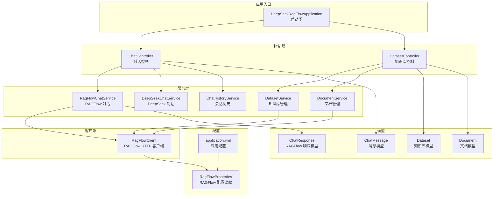

图表来源
- [DeepSeekRagFlowApplication.java:1-12](file://src/main/java/org/wiki/DeepSeekRagFlowApplication.java#L1-L12)
- [application.yml:1-27](file://src/main/resources/application.yml#L1-L27)
- [RagFlowProperties.java:1-32](file://src/main/java/org/wiki/config/RagFlowProperties.java#L1-L32)
- [ChatController.java:1-276](file://src/main/java/org/wiki/controller/ChatController.java#L1-L276)
- [DatasetController.java:1-197](file://src/main/java/org/wiki/controller/DatasetController.java#L1-L197)
- [RagFlowChatService.java:1-84](file://src/main/java/org/wiki/service/RagFlowChatService.java#L1-L84)
- [DeepSeekChatService.java:1-125](file://src/main/java/org/wiki/service/DeepSeekChatService.java#L1-L125)
- [RagFlowClient.java:1-231](file://src/main/java/org/wiki/client/RagFlowClient.java#L1-L231)
- [ChatHistoryService.java:1-88](file://src/main/java/org/wiki/service/ChatHistoryService.java#L1-L88)
- [ChatMessage.java:1-82](file://src/main/java/org/wiki/model/ChatMessage.java#L1-L82)
- [ChatResponse.java:1-52](file://src/main/java/org/wiki/model/ChatResponse.java#L1-L52)
- [DatasetService.java:1-128](file://src/main/java/org/wiki/service/DatasetService.java#L1-L128)
- [DocumentService.java:1-98](file://src/main/java/org/wiki/service/DocumentService.java#L1-L98)
- [Dataset.java:1-33](file://src/main/java/org/wiki/model/Dataset.java#L1-L33)
- [Document.java:1-24](file://src/main/java/org/wiki/model/Document.java#L1-L24)

章节来源
- [DeepSeekRagFlowApplication.java:1-12](file://src/main/java/org/wiki/DeepSeekRagFlowApplication.java#L1-L12)
- [application.yml:1-27](file://src/main/resources/application.yml#L1-L27)

## 核心组件
- 控制器层
  - ChatController：提供三种对话模式的 REST 接口，支持非流式与流式两种输出方式；提供会话管理接口（创建、查询、清空）。
  - DatasetController：提供知识库与文档的增删改查及运行解析接口。
- 服务层
  - RagFlowChatService：封装 RAGFlow 对话调用，支持非流式与流式，负责抽取回答文本。
  - DeepSeekChatService：封装 DeepSeek 对话调用，支持纯对话、RAG 增强对话与流式输出。
  - ChatHistoryService：内存级会话历史管理，提供消息存储、清理与查询。
  - DatasetService：封装知识库的创建、查询、更新、删除。
  - DocumentService：封装文档上传、列表、删除与运行解析。
- 客户端层
  - RagFlowClient：基于 OkHttp 实现对 RAGFlow 的 RESTful 调用，支持通用 GET/POST/PUT/DELETE 与 SSE 流式对话。
- 配置与模型
  - RagFlowProperties：读取 application.yml 中 ragflow 前缀配置。
  - ChatMessage/ChatResponse/Dataset/Document：数据传输与领域模型。

章节来源
- [ChatController.java:1-276](file://src/main/java/org/wiki/controller/ChatController.java#L1-L276)
- [DatasetController.java:1-197](file://src/main/java/org/wiki/controller/DatasetController.java#L1-L197)
- [RagFlowChatService.java:1-84](file://src/main/java/org/wiki/service/RagFlowChatService.java#L1-L84)
- [DeepSeekChatService.java:1-125](file://src/main/java/org/wiki/service/DeepSeekChatService.java#L1-L125)
- [ChatHistoryService.java:1-88](file://src/main/java/org/wiki/service/ChatHistoryService.java#L1-L88)
- [DatasetService.java:1-128](file://src/main/java/org/wiki/service/DatasetService.java#L1-L128)
- [DocumentService.java:1-98](file://src/main/java/org/wiki/service/DocumentService.java#L1-L98)
- [RagFlowClient.java:1-231](file://src/main/java/org/wiki/client/RagFlowClient.java#L1-L231)
- [RagFlowProperties.java:1-32](file://src/main/java/org/wiki/config/RagFlowProperties.java#L1-L32)
- [ChatMessage.java:1-82](file://src/main/java/org/wiki/model/ChatMessage.java#L1-L82)
- [ChatResponse.java:1-52](file://src/main/java/org/wiki/model/ChatResponse.java#L1-L52)
- [Dataset.java:1-33](file://src/main/java/org/wiki/model/Dataset.java#L1-L33)
- [Document.java:1-24](file://src/main/java/org/wiki/model/Document.java#L1-L24)

## 架构总览
系统采用分层架构，控制器负责对外暴露 API，服务层编排业务逻辑，客户端层对接外部服务，配置与模型层提供参数与数据结构支撑。

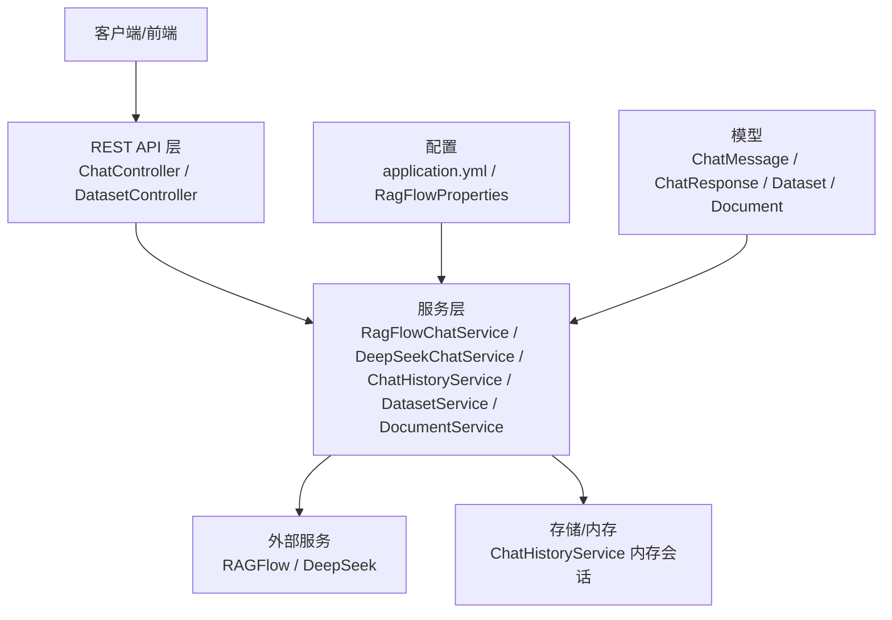

图表来源
- [ChatController.java:1-276](file://src/main/java/org/wiki/controller/ChatController.java#L1-L276)
- [DatasetController.java:1-197](file://src/main/java/org/wiki/controller/DatasetController.java#L1-L197)
- [RagFlowChatService.java:1-84](file://src/main/java/org/wiki/service/RagFlowChatService.java#L1-L84)
- [DeepSeekChatService.java:1-125](file://src/main/java/org/wiki/service/DeepSeekChatService.java#L1-L125)
- [ChatHistoryService.java:1-88](file://src/main/java/org/wiki/service/ChatHistoryService.java#L1-L88)
- [DatasetService.java:1-128](file://src/main/java/org/wiki/service/DatasetService.java#L1-L128)
- [DocumentService.java:1-98](file://src/main/java/org/wiki/service/DocumentService.java#L1-L98)
- [RagFlowClient.java:1-231](file://src/main/java/org/wiki/client/RagFlowClient.java#L1-L231)
- [application.yml:1-27](file://src/main/resources/application.yml#L1-L27)
- [RagFlowProperties.java:1-32](file://src/main/java/org/wiki/config/RagFlowProperties.java#L1-L32)
- [ChatMessage.java:1-82](file://src/main/java/org/wiki/model/ChatMessage.java#L1-L82)
- [ChatResponse.java:1-52](file://src/main/java/org/wiki/model/ChatResponse.java#L1-L52)
- [Dataset.java:1-33](file://src/main/java/org/wiki/model/Dataset.java#L1-L33)
- [Document.java:1-24](file://src/main/java/org/wiki/model/Document.java#L1-L24)

## 详细组件分析

### 对话模式与实现原理

#### RAGFlow 知识库问答（非流式）
- 控制器接口：POST /api/chat/ragflow
- 流程要点
  - 若未提供 sessionId，则创建新会话；记录用户消息。
  - 调用 RagFlowChatService 执行问答，提取回答文本。
  - 记录助手消息。
  - 返回成功标志、答案、会话 ID 与原始响应数据。
- 关键实现路径
  - [ChatController.ragflowChat:51-76](file://src/main/java/org/wiki/controller/ChatController.java#L51-L76)
  - [RagFlowChatService.chat:34-41](file://src/main/java/org/wiki/service/RagFlowChatService.java#L34-L41)
  - [ChatHistoryService.addMessage:31-43](file://src/main/java/org/wiki/service/ChatHistoryService.java#L31-L43)

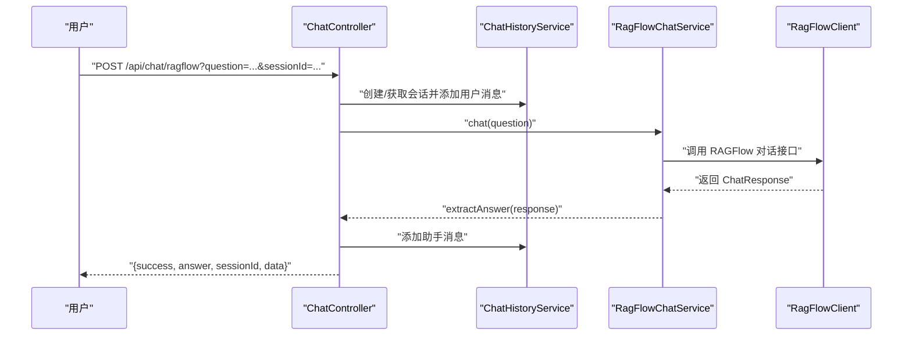

图表来源
- [ChatController.java:51-76](file://src/main/java/org/wiki/controller/ChatController.java#L51-L76)
- [RagFlowChatService.java:34-41](file://src/main/java/org/wiki/service/RagFlowChatService.java#L34-L41)
- [RagFlowClient.java:135-148](file://src/main/java/org/wiki/client/RagFlowClient.java#L135-L148)
- [ChatHistoryService.java:31-43](file://src/main/java/org/wiki/service/ChatHistoryService.java#L31-L43)

章节来源
- [ChatController.java:51-76](file://src/main/java/org/wiki/controller/ChatController.java#L51-L76)
- [RagFlowChatService.java:34-41](file://src/main/java/org/wiki/service/RagFlowChatService.java#L34-L41)
- [ChatHistoryService.java:31-43](file://src/main/java/org/wiki/service/ChatHistoryService.java#L31-L43)

#### RAGFlow 知识库问答（流式 SSE）
- 控制器接口：GET /api/chat/ragflow/stream?question=...
- 流程要点
  - 使用 SseEmitter 建立 SSE 连接，设置超时。
  - 在线程池中执行 RAGFlow 对话流式输出，逐块推送数据。
  - 当流结束发送 [DONE] 并完成连接。
- 关键实现路径
  - [ChatController.ragflowChatStream:85-107](file://src/main/java/org/wiki/controller/ChatController.java#L85-L107)
  - [RagFlowChatService.chatStream:50-72](file://src/main/java/org/wiki/service/RagFlowChatService.java#L50-L72)
  - [RagFlowClient.chatStream:154-200](file://src/main/java/org/wiki/client/RagFlowClient.java#L154-L200)

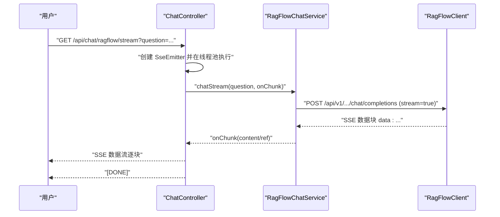

图表来源
- [ChatController.java:85-107](file://src/main/java/org/wiki/controller/ChatController.java#L85-L107)
- [RagFlowChatService.java:50-72](file://src/main/java/org/wiki/service/RagFlowChatService.java#L50-L72)
- [RagFlowClient.java:154-200](file://src/main/java/org/wiki/client/RagFlowClient.java#L154-L200)

章节来源
- [ChatController.java:85-107](file://src/main/java/org/wiki/controller/ChatController.java#L85-L107)
- [RagFlowChatService.java:50-72](file://src/main/java/org/wiki/service/RagFlowChatService.java#L50-L72)
- [RagFlowClient.java:154-200](file://src/main/java/org/wiki/client/RagFlowClient.java#L154-L200)

#### DeepSeek 直接对话（非流式）
- 控制器接口：POST /api/chat/deepseek
- 流程要点
  - 与 RAGFlow 模式类似，记录用户与助手消息。
  - 调用 DeepSeekChatService 执行问答。
- 关键实现路径
  - [ChatController.deepseekChat:117-137](file://src/main/java/org/wiki/controller/ChatController.java#L117-L137)
  - [DeepSeekChatService.chat:36-44](file://src/main/java/org/wiki/service/DeepSeekChatService.java#L36-L44)

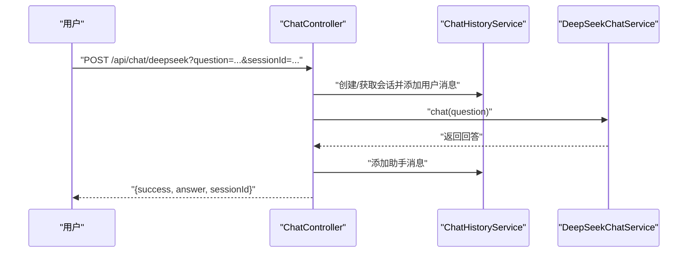

图表来源
- [ChatController.java:117-137](file://src/main/java/org/wiki/controller/ChatController.java#L117-L137)
- [DeepSeekChatService.java:36-44](file://src/main/java/org/wiki/service/DeepSeekChatService.java#L36-L44)
- [ChatHistoryService.java:31-43](file://src/main/java/org/wiki/service/ChatHistoryService.java#L31-L43)

章节来源
- [ChatController.java:117-137](file://src/main/java/org/wiki/controller/ChatController.java#L117-L137)
- [DeepSeekChatService.java:36-44](file://src/main/java/org/wiki/service/DeepSeekChatService.java#L36-L44)
- [ChatHistoryService.java:31-43](file://src/main/java/org/wiki/service/ChatHistoryService.java#L31-L43)

#### DeepSeek 直接对话（流式 SSE）
- 控制器接口：GET /api/chat/deepseek/stream?question=...
- 流程要点
  - 使用 Spring AI 的 Flux 流式输出，拼接 [DONE] 结束标记。
- 关键实现路径
  - [ChatController.deepseekChatStream:223-228](file://src/main/java/org/wiki/controller/ChatController.java#L223-L228)
  - [DeepSeekChatService.chatStream:86-92](file://src/main/java/org/wiki/service/DeepSeekChatService.java#L86-L92)

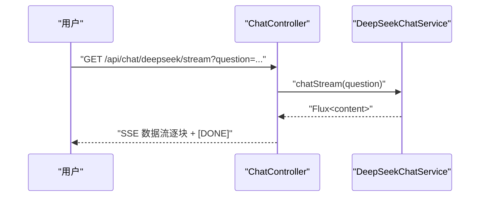

图表来源
- [ChatController.java:223-228](file://src/main/java/org/wiki/controller/ChatController.java#L223-L228)
- [DeepSeekChatService.java:86-92](file://src/main/java/org/wiki/service/DeepSeekChatService.java#L86-L92)

章节来源
- [ChatController.java:223-228](file://src/main/java/org/wiki/controller/ChatController.java#L223-L228)
- [DeepSeekChatService.java:86-92](file://src/main/java/org/wiki/service/DeepSeekChatService.java#L86-L92)

#### DeepSeek + RAG 增强对话（非流式）
- 控制器接口：POST /api/chat/deepseek/rag
- 流程要点
  - 先调用 RAGFlowChatService 获取检索上下文。
  - 再调用 DeepSeekChatService.chatWithContext，将上下文注入系统提示词。
  - 记录用户与助手消息。
- 关键实现路径
  - [ChatController.deepseekRagChat:148-174](file://src/main/java/org/wiki/controller/ChatController.java#L148-L174)
  - [RagFlowChatService.chat:34-41](file://src/main/java/org/wiki/service/RagFlowChatService.java#L34-L41)
  - [RagFlowChatService.extractAnswer:77-82](file://src/main/java/org/wiki/service/RagFlowChatService.java#L77-L82)
  - [DeepSeekChatService.chatWithContext:54-78](file://src/main/java/org/wiki/service/DeepSeekChatService.java#L54-L78)

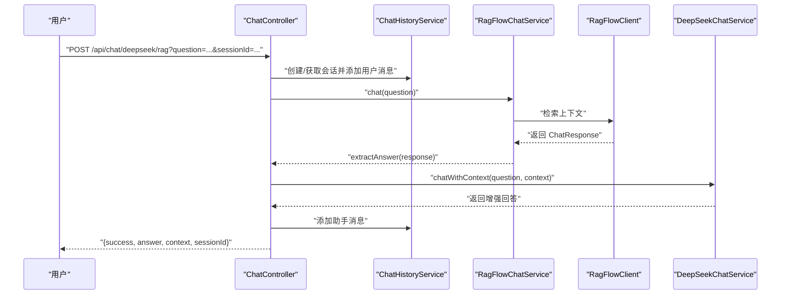

图表来源
- [ChatController.java:148-174](file://src/main/java/org/wiki/controller/ChatController.java#L148-L174)
- [RagFlowChatService.java:34-41](file://src/main/java/org/wiki/service/RagFlowChatService.java#L34-L41)
- [RagFlowClient.java:135-148](file://src/main/java/org/wiki/client/RagFlowClient.java#L135-L148)
- [DeepSeekChatService.java:54-78](file://src/main/java/org/wiki/service/DeepSeekChatService.java#L54-L78)
- [ChatHistoryService.java:31-43](file://src/main/java/org/wiki/service/ChatHistoryService.java#L31-L43)

章节来源
- [ChatController.java:148-174](file://src/main/java/org/wiki/controller/ChatController.java#L148-L174)
- [RagFlowChatService.java:34-41](file://src/main/java/org/wiki/service/RagFlowChatService.java#L34-L41)
- [DeepSeekChatService.java:54-78](file://src/main/java/org/wiki/service/DeepSeekChatService.java#L54-L78)
- [ChatHistoryService.java:31-43](file://src/main/java/org/wiki/service/ChatHistoryService.java#L31-L43)

#### DeepSeek + RAG 增强对话（流式 SSE）
- 控制器接口：GET /api/chat/deepseek/rag/stream?question=...
- 流程要点
  - 先获取上下文，再调用 DeepSeekChatService.chatStreamWithContext，逐块推送。
  - 完成后发送 [DONE] 并完成连接。
- 关键实现路径
  - [ChatController.deepseekRagChatStream:238-274](file://src/main/java/org/wiki/controller/ChatController.java#L238-L274)
  - [DeepSeekChatService.chatStreamWithContext:101-123](file://src/main/java/org/wiki/service/DeepSeekChatService.java#L101-L123)

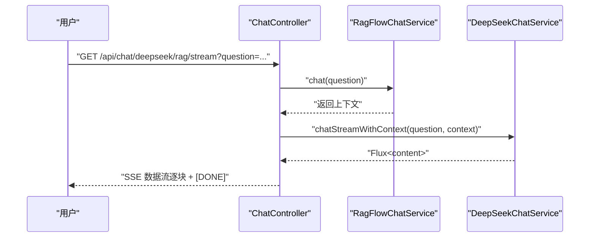

图表来源
- [ChatController.java:238-274](file://src/main/java/org/wiki/controller/ChatController.java#L238-L274)
- [DeepSeekChatService.java:101-123](file://src/main/java/org/wiki/service/DeepSeekChatService.java#L101-L123)
- [RagFlowChatService.java:34-41](file://src/main/java/org/wiki/service/RagFlowChatService.java#L34-L41)

章节来源
- [ChatController.java:238-274](file://src/main/java/org/wiki/controller/ChatController.java#L238-L274)
- [DeepSeekChatService.java:101-123](file://src/main/java/org/wiki/service/DeepSeekChatService.java#L101-L123)
- [RagFlowChatService.java:34-41](file://src/main/java/org/wiki/service/RagFlowChatService.java#L34-L41)

### 会话管理机制
- 会话创建：随机生成 sessionId，初始化消息列表。
- 消息存储：按会话聚合，限制每会话最大消息数，避免无限增长。
- 历史查询：支持获取全部或最近 N 条消息。
- 历史清理：按会话清空消息。
- 关键实现路径
  - [ChatHistoryService.createSession:81-86](file://src/main/java/org/wiki/service/ChatHistoryService.java#L81-L86)
  - [ChatHistoryService.addMessage:31-43](file://src/main/java/org/wiki/service/ChatHistoryService.java#L31-L43)
  - [ChatHistoryService.getMessages:48-50](file://src/main/java/org/wiki/service/ChatHistoryService.java#L48-L50)
  - [ChatHistoryService.getRecentMessages:55-61](file://src/main/java/org/wiki/service/ChatHistoryService.java#L55-L61)
  - [ChatHistoryService.clearSession:66-69](file://src/main/java/org/wiki/service/ChatHistoryService.java#L66-L69)
  - [ChatMessage.userMessage / assistantMessage:57-80](file://src/main/java/org/wiki/model/ChatMessage.java#L57-L80)

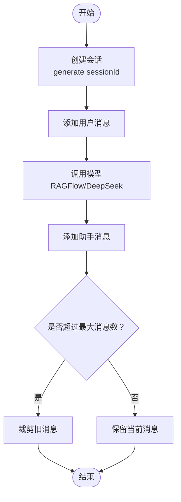

图表来源
- [ChatHistoryService.java:31-43](file://src/main/java/org/wiki/service/ChatHistoryService.java#L31-L43)
- [ChatMessage.java:57-80](file://src/main/java/org/wiki/model/ChatMessage.java#L57-L80)

章节来源
- [ChatHistoryService.java:1-88](file://src/main/java/org/wiki/service/ChatHistoryService.java#L1-L88)
- [ChatMessage.java:1-82](file://src/main/java/org/wiki/model/ChatMessage.java#L1-L82)

### 知识库管理功能
- 知识库管理
  - 创建：POST /api/datasets
  - 列表：GET /api/datasets
  - 详情：GET /api/datasets/{datasetId}
  - 删除：DELETE /api/datasets/{datasetId}
  - 更新：PUT /api/datasets/{datasetId}
- 文档管理
  - 上传：POST /api/datasets/{datasetId}/documents
  - 列表：GET /api/datasets/{datasetId}/documents
  - 删除：DELETE /api/datasets/{datasetId}/documents/{documentId}
  - 运行解析：POST /api/datasets/{datasetId}/documents/{documentId}/run
- 关键实现路径
  - [DatasetController:41-195](file://src/main/java/org/wiki/controller/DatasetController.java#L41-L195)
  - [DatasetService:37-126](file://src/main/java/org/wiki/service/DatasetService.java#L37-L126)
  - [DocumentService:33-96](file://src/main/java/org/wiki/service/DocumentService.java#L33-L96)
  - [RagFlowClient.uploadFile:206-229](file://src/main/java/org/wiki/client/RagFlowClient.java#L206-L229)

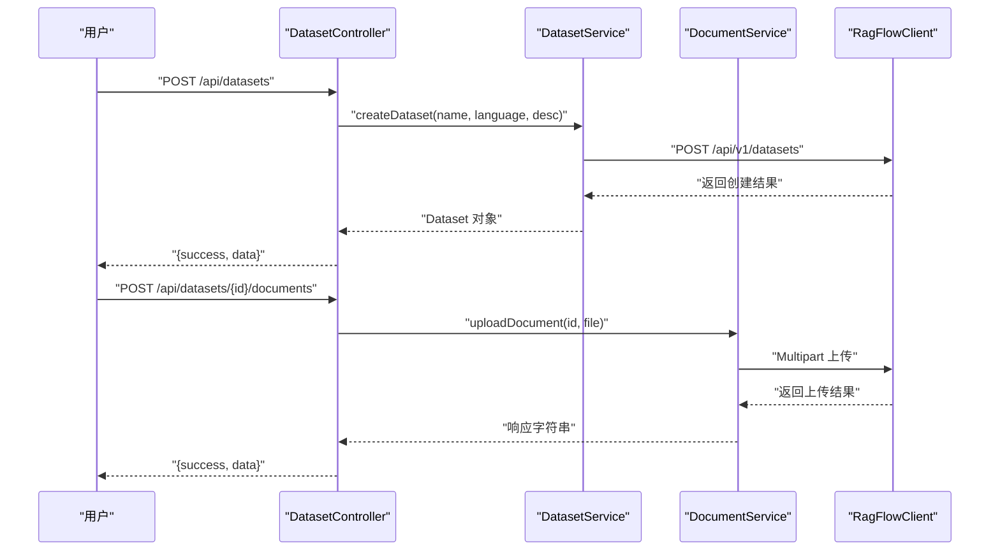

图表来源
- [DatasetController.java:41-195](file://src/main/java/org/wiki/controller/DatasetController.java#L41-L195)
- [DatasetService.java:37-126](file://src/main/java/org/wiki/service/DatasetService.java#L37-L126)
- [DocumentService.java:33-96](file://src/main/java/org/wiki/service/DocumentService.java#L33-L96)
- [RagFlowClient.java:206-229](file://src/main/java/org/wiki/client/RagFlowClient.java#L206-L229)

章节来源
- [DatasetController.java:1-197](file://src/main/java/org/wiki/controller/DatasetController.java#L1-L197)
- [DatasetService.java:1-128](file://src/main/java/org/wiki/service/DatasetService.java#L1-L128)
- [DocumentService.java:1-98](file://src/main/java/org/wiki/service/DocumentService.java#L1-L98)
- [RagFlowClient.java:1-231](file://src/main/java/org/wiki/client/RagFlowClient.java#L1-L231)

### 流式响应（SSE）技术应用与优势
- 应用点
  - RAGFlow 流式对话：SseEmitter 推送增量内容，支持引用信息透传。
  - DeepSeek 流式对话：Spring AI Flux 输出，统一拼接 [DONE]。
  - DeepSeek+RAG 增强流式：先获取上下文，再流式生成回答。
- 优势
  - 低延迟：用户可边接收边展示，无需等待完整回答。
  - 友好体验：实时反馈，适合长回答与复杂推理。
  - 易扩展：统一的 SSE 协议便于前端处理与断线重连。
- 关键实现路径
  - [ChatController.ragflowChatStream:85-107](file://src/main/java/org/wiki/controller/ChatController.java#L85-L107)
  - [ChatController.deepseekChatStream:223-228](file://src/main/java/org/wiki/controller/ChatController.java#L223-L228)
  - [ChatController.deepseekRagChatStream:238-274](file://src/main/java/org/wiki/controller/ChatController.java#L238-L274)
  - [RagFlowChatService.chatStream:50-72](file://src/main/java/org/wiki/service/RagFlowChatService.java#L50-L72)
  - [DeepSeekChatService.chatStream / chatStreamWithContext:86-123](file://src/main/java/org/wiki/service/DeepSeekChatService.java#L86-L123)

章节来源
- [ChatController.java:85-107](file://src/main/java/org/wiki/controller/ChatController.java#L85-L107)
- [ChatController.java:223-228](file://src/main/java/org/wiki/controller/ChatController.java#L223-L228)
- [ChatController.java:238-274](file://src/main/java/org/wiki/controller/ChatController.java#L238-L274)
- [RagFlowChatService.java:50-72](file://src/main/java/org/wiki/service/RagFlowChatService.java#L50-L72)
- [DeepSeekChatService.java:86-123](file://src/main/java/org/wiki/service/DeepSeekChatService.java#L86-L123)

### 使用示例与最佳实践
- RAGFlow 知识库问答（非流式）
  - 示例请求：POST /api/chat/ragflow?question=如何安装RAGFlow&sessionId=...
  - 最佳实践：为每次会话传递 sessionId，以便后续查询与清理。
  - 关键实现路径：[ChatController.ragflowChat:51-76](file://src/main/java/org/wiki/controller/ChatController.java#L51-L76)
- RAGFlow 知识库问答（流式）
  - 示例请求：GET /api/chat/ragflow/stream?question=...
  - 最佳实践：前端使用 EventSource 或 fetch + ReadableStream 处理 SSE；注意 [DONE] 标记。
  - 关键实现路径：[ChatController.ragflowChatStream:85-107](file://src/main/java/org/wiki/controller/ChatController.java#L85-L107)
- DeepSeek 直接对话（非流式）
  - 示例请求：POST /api/chat/deepseek?question=...
  - 最佳实践：保持问题简洁清晰，必要时提供上下文。
  - 关键实现路径：[ChatController.deepseekChat:117-137](file://src/main/java/org/wiki/controller/ChatController.java#L117-L137)
- DeepSeek 直接对话（流式）
  - 示例请求：GET /api/chat/deepseek/stream?question=...
  - 最佳实践：与非流式相同，但需处理增量输出。
  - 关键实现路径：[ChatController.deepseekChatStream:223-228](file://src/main/java/org/wiki/controller/ChatController.java#L223-L228)
- DeepSeek + RAG 增强对话（非流式）
  - 示例请求：POST /api/chat/deepseek/rag?question=...
  - 最佳实践：确保知识库已正确解析文档，上下文质量决定回答准确性。
  - 关键实现路径：[ChatController.deepseekRagChat:148-174](file://src/main/java/org/wiki/controller/ChatController.java#L148-L174)
- DeepSeek + RAG 增强对话（流式）
  - 示例请求：GET /api/chat/deepseek/rag/stream?question=...
  - 最佳实践：先获取上下文，再流式生成，注意引用信息透传。
  - 关键实现路径：[ChatController.deepseekRagChatStream:238-274](file://src/main/java/org/wiki/controller/ChatController.java#L238-L274)
- 会话管理
  - 创建会话：POST /api/chat/session
  - 查询历史：GET /api/chat/history/{sessionId}
  - 清空历史：DELETE /api/chat/history/{sessionId}
  - 关键实现路径：[ChatController.createSession / getHistory / clearHistory:182-213](file://src/main/java/org/wiki/controller/ChatController.java#L182-L213)
- 知识库与文档管理
  - 创建知识库：POST /api/datasets
  - 上传文档：POST /api/datasets/{id}/documents
  - 运行解析：POST /api/datasets/{id}/documents/{docId}/run
  - 关键实现路径：[DatasetController / DatasetService / DocumentService:41-195](file://src/main/java/org/wiki/controller/DatasetController.java#L41-L195)

章节来源
- [ChatController.java:51-76](file://src/main/java/org/wiki/controller/ChatController.java#L51-L76)
- [ChatController.java:85-107](file://src/main/java/org/wiki/controller/ChatController.java#L85-L107)
- [ChatController.java:117-137](file://src/main/java/org/wiki/controller/ChatController.java#L117-L137)
- [ChatController.java:148-174](file://src/main/java/org/wiki/controller/ChatController.java#L148-L174)
- [ChatController.java:182-213](file://src/main/java/org/wiki/controller/ChatController.java#L182-L213)
- [DatasetController.java:41-195](file://src/main/java/org/wiki/controller/DatasetController.java#L41-L195)

## 依赖分析
- 组件耦合
  - ChatController 依赖 RagFlowChatService、DeepSeekChatService、ChatHistoryService。
  - 服务层依赖 RagFlowClient 与 Spring AI ChatClient。
  - 配置通过 RagFlowProperties 注入，application.yml 提供默认值。
- 外部依赖
  - RAGFlow：OpenAI 兼容接口（/api/v1/.../chat/completions）、知识库与文档管理接口。
  - DeepSeek：OpenAI 兼容接口（/chat/completions）。
- 潜在风险
  - 内存存储会话：生产环境建议替换为持久化存储。
  - SSE 超时与断开：需在前端实现重连与缓冲策略。
  - RAGFlow/DeepSeek 可用性：网络抖动与限流需在客户端与服务端分别处理。

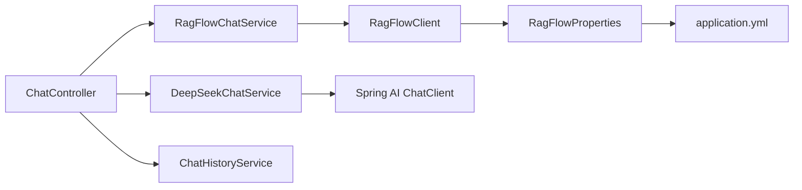

图表来源
- [ChatController.java:32-41](file://src/main/java/org/wiki/controller/ChatController.java#L32-L41)
- [RagFlowChatService.java:20-24](file://src/main/java/org/wiki/service/RagFlowChatService.java#L20-L24)
- [DeepSeekChatService.java:24-28](file://src/main/java/org/wiki/service/DeepSeekChatService.java#L24-L28)
- [RagFlowClient.java:25-35](file://src/main/java/org/wiki/client/RagFlowClient.java#L25-L35)
- [RagFlowProperties.java:10-31](file://src/main/java/org/wiki/config/RagFlowProperties.java#L10-L31)
- [application.yml:17-22](file://src/main/resources/application.yml#L17-L22)

章节来源
- [ChatController.java:1-276](file://src/main/java/org/wiki/controller/ChatController.java#L1-L276)
- [RagFlowChatService.java:1-84](file://src/main/java/org/wiki/service/RagFlowChatService.java#L1-L84)
- [DeepSeekChatService.java:1-125](file://src/main/java/org/wiki/service/DeepSeekChatService.java#L1-L125)
- [RagFlowClient.java:1-231](file://src/main/java/org/wiki/client/RagFlowClient.java#L1-L231)
- [RagFlowProperties.java:1-32](file://src/main/java/org/wiki/config/RagFlowProperties.java#L1-L32)
- [application.yml:1-27](file://src/main/resources/application.yml#L1-L27)

## 性能考虑
- 流式输出
  - 减少首字节延迟，提升交互体验；注意前端缓冲与渲染节流。
- 线程池与 SSE
  - ChatController 使用缓存线程池执行流式任务，避免阻塞主线程；合理设置超时与并发上限。
- 会话存储
  - 内存 Map 存储消息，建议在高并发场景引入分布式缓存或数据库持久化。
- 网络与超时
  - RAGFlow 客户端配置读写超时，结合服务端超时策略，防止长时间占用连接。
- 最佳实践
  - 对长回答与复杂检索场景，优先使用流式输出。
  - 对高频会话，定期清理历史或迁移至持久化存储。

## 故障排除指南
- RAGFlow 对话失败
  - 现象：返回错误信息，success=false。
  - 排查：检查 RAGFlow 服务地址、API Key、chat-id 是否正确；确认知识库已创建并启用。
  - 关键实现路径：[RagFlowClient.get/post/delete/put:40-129](file://src/main/java/org/wiki/client/RagFlowClient.java#L40-L129)
- DeepSeek 对话失败
  - 现象：抛出异常，返回错误信息。
  - 排查：检查 DeepSeek API Key 与 base-url；确认模型名称与温度等参数合法。
  - 关键实现路径：[application.yml:8-16](file://src/main/resources/application.yml#L8-L16)
- SSE 连接中断
  - 现象：流式输出提前结束或断断续续。
  - 排查：检查服务端超时设置；前端实现断线重连与缓冲；确认网络稳定性。
  - 关键实现路径：[ChatController.ragflowChatStream / deepseekRagChatStream:85-107](file://src/main/java/org/wiki/controller/ChatController.java#L85-L107)
- 知识库/文档操作失败
  - 现象：返回 message 字段包含错误原因。
  - 排查：确认 datasetId/documentId 正确；检查文件格式与大小限制；查看 RAGFlow 返回码。
  - 关键实现路径：[DatasetService / DocumentService:37-126](file://src/main/java/org/wiki/service/DatasetService.java#L37-L126)

章节来源
- [RagFlowClient.java:40-129](file://src/main/java/org/wiki/client/RagFlowClient.java#L40-L129)
- [application.yml:8-16](file://src/main/resources/application.yml#L8-L16)
- [ChatController.java:85-107](file://src/main/java/org/wiki/controller/ChatController.java#L85-L107)
- [DatasetService.java:37-126](file://src/main/java/org/wiki/service/DatasetService.java#L37-L126)

## 结论
本系统通过清晰的分层设计与 SSE 流式输出，实现了 RAGFlow 知识库问答、DeepSeek 直接对话与 RAG 增强对话三大核心能力，并提供了完整的知识库与文档管理接口。会话管理以内存存储为基础，便于快速迭代；生产部署建议替换为持久化方案。整体架构易于扩展，可进一步接入更多模型与知识源。

## 附录
- 配置说明
  - application.yml 中包含 DeepSeek 与 RAGFlow 的基础配置项，建议在部署时替换为实际值。
  - 关键配置项：spring.ai.openai.*、ragflow.base-url、ragflow.api-key、ragflow.chat-id、ragflow.timeout。
  - 关键实现路径：[application.yml:8-22](file://src/main/resources/application.yml#L8-L22)

章节来源
- [application.yml:1-27](file://src/main/resources/application.yml#L1-L27)