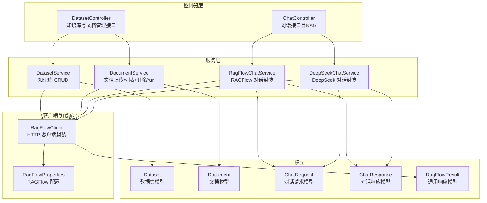
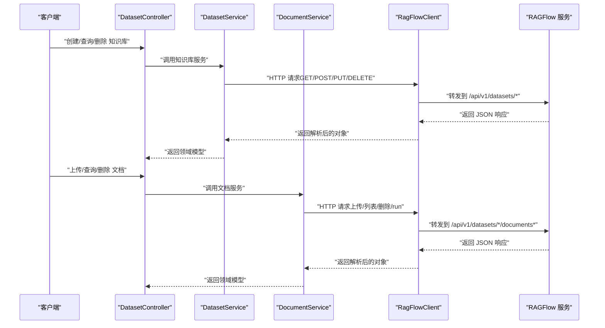
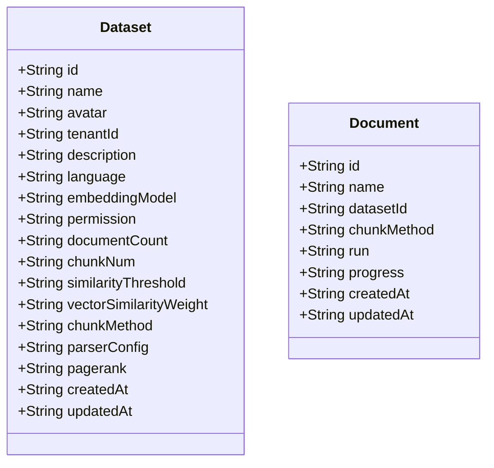
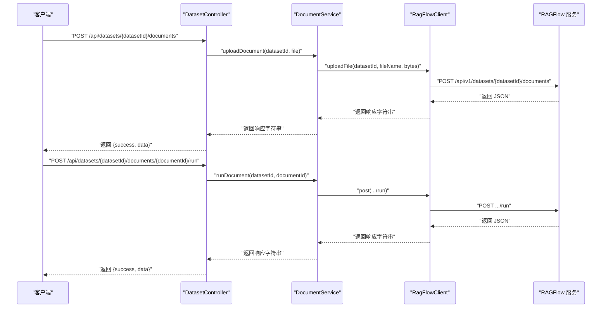
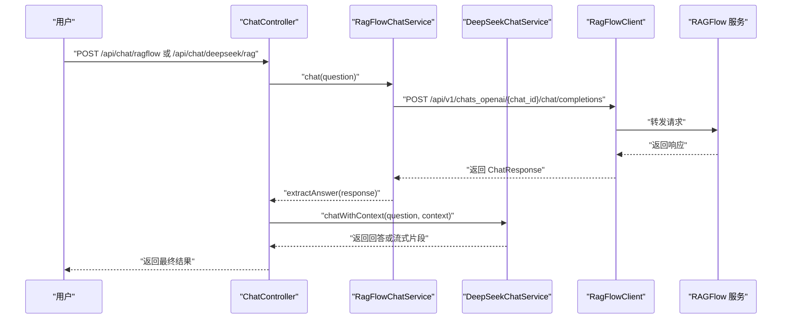
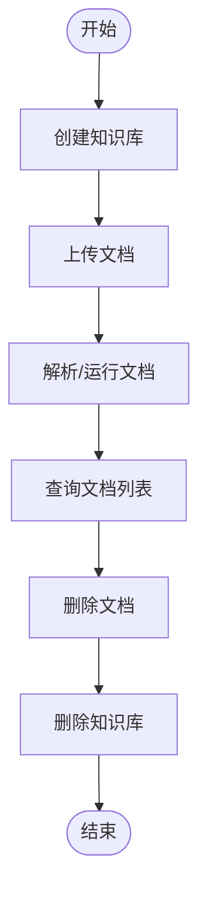
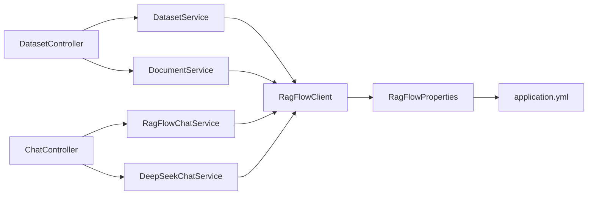

# 知识库管理

<cite>
**本文引用的文件**
- [src/main/java/org/wiki/controller/DatasetController.java](file://src/main/java/org/wiki/controller/DatasetController.java)
- [src/main/java/org/wiki/service/DatasetService.java](file://src/main/java/org/wiki/service/DatasetService.java)
- [src/main/java/org/wiki/service/DocumentService.java](file://src/main/java/org/wiki/service/DocumentService.java)
- [src/main/java/org/wiki/client/RagFlowClient.java](file://src/main/java/org/wiki/client/RagFlowClient.java)
- [src/main/java/org/wiki/config/RagFlowProperties.java](file://src/main/java/org/wiki/config/RagFlowProperties.java)
- [src/main/java/org/wiki/model/Dataset.java](file://src/main/java/org/wiki/model/Dataset.java)
- [src/main/java/org/wiki/model/Document.java](file://src/main/java/org/wiki/model/Document.java)
- [src/main/resources/application.yml](file://src/main/resources/application.yml)
- [src/main/java/org/wiki/controller/ChatController.java](file://src/main/java/org/wiki/controller/ChatController.java)
- [src/main/java/org/wiki/service/RagFlowChatService.java](file://src/main/java/org/wiki/service/RagFlowChatService.java)
- [src/main/java/org/wiki/service/DeepSeekChatService.java](file://src/main/java/org/wiki/service/DeepSeekChatService.java)
- [src/main/java/org/wiki/model/ChatRequest.java](file://src/main/java/org/wiki/model/ChatRequest.java)
- [src/main/java/org/wiki/model/ChatResponse.java](file://src/main/java/org/wiki/model/ChatResponse.java)
- [src/main/java/org/wiki/model/RagFlowResult.java](file://src/main/java/org/wiki/model/RagFlowResult.java)
</cite>

## 目录
1. [简介](#简介)
2. [项目结构](#项目结构)
3. [核心组件](#核心组件)
4. [架构总览](#架构总览)
5. [详细组件分析](#详细组件分析)
6. [依赖分析](#依赖分析)
7. [性能考虑](#性能考虑)
8. [故障排查指南](#故障排查指南)
9. [结论](#结论)
10. [附录](#附录)

## 简介
本文件面向 DeepSeek + RAGFlow 系统的知识库管理功能，提供从“知识库创建、文档上传、解析与删除”的完整流程说明；解释文档服务的实现机制（文件上传、内容提取与索引构建的调用链路）；阐述数据集（Dataset）与文档（Document）模型的设计与用途；给出知识库管理的 API 接口清单及使用方法；说明知识库与对话系统的集成方式，以及如何通过知识库提升对话的准确性和相关性；最后提供知识库维护的最佳实践与性能优化建议。

## 项目结构
该项目采用 Spring Boot 结构，按职责划分为控制器层、服务层、客户端封装层与配置层，并提供前端模板资源。知识库管理相关的核心代码集中在控制器、服务与客户端模块中。

图表来源
- [src/main/java/org/wiki/controller/DatasetController.java:1-197](file://src/main/java/org/wiki/controller/DatasetController.java#L1-L197)
- [src/main/java/org/wiki/controller/ChatController.java:1-276](file://src/main/java/org/wiki/controller/ChatController.java#L1-L276)
- [src/main/java/org/wiki/service/DatasetService.java:1-128](file://src/main/java/org/wiki/service/DatasetService.java#L1-L128)
- [src/main/java/org/wiki/service/DocumentService.java:1-98](file://src/main/java/org/wiki/service/DocumentService.java#L1-L98)
- [src/main/java/org/wiki/service/RagFlowChatService.java:1-84](file://src/main/java/org/wiki/service/RagFlowChatService.java#L1-L84)
- [src/main/java/org/wiki/service/DeepSeekChatService.java:1-125](file://src/main/java/org/wiki/service/DeepSeekChatService.java#L1-L125)
- [src/main/java/org/wiki/client/RagFlowClient.java:1-231](file://src/main/java/org/wiki/client/RagFlowClient.java#L1-L231)
- [src/main/java/org/wiki/config/RagFlowProperties.java:1-32](file://src/main/java/org/wiki/config/RagFlowProperties.java#L1-L32)
- [src/main/java/org/wiki/model/Dataset.java:1-33](file://src/main/java/org/wiki/model/Dataset.java#L1-L33)
- [src/main/java/org/wiki/model/Document.java:1-24](file://src/main/java/org/wiki/model/Document.java#L1-L24)
- [src/main/java/org/wiki/model/ChatRequest.java:1-59](file://src/main/java/org/wiki/model/ChatRequest.java#L1-L59)
- [src/main/java/org/wiki/model/ChatResponse.java:1-52](file://src/main/java/org/wiki/model/ChatResponse.java#L1-L52)
- [src/main/java/org/wiki/model/RagFlowResult.java:1-25](file://src/main/java/org/wiki/model/RagFlowResult.java#L1-L25)

章节来源
- [src/main/java/org/wiki/controller/DatasetController.java:1-197](file://src/main/java/org/wiki/controller/DatasetController.java#L1-L197)
- [src/main/java/org/wiki/controller/ChatController.java:1-276](file://src/main/java/org/wiki/controller/ChatController.java#L1-L276)
- [src/main/java/org/wiki/service/DatasetService.java:1-128](file://src/main/java/org/wiki/service/DatasetService.java#L1-L128)
- [src/main/java/org/wiki/service/DocumentService.java:1-98](file://src/main/java/org/wiki/service/DocumentService.java#L1-L98)
- [src/main/java/org/wiki/client/RagFlowClient.java:1-231](file://src/main/java/org/wiki/client/RagFlowClient.java#L1-L231)
- [src/main/java/org/wiki/config/RagFlowProperties.java:1-32](file://src/main/java/org/wiki/config/RagFlowProperties.java#L1-L32)
- [src/main/resources/application.yml:1-27](file://src/main/resources/application.yml#L1-L27)

## 核心组件
- 控制器层
  - 知识库与文档管理：提供知识库创建、查询、删除与文档上传、查询、删除、解析等接口。
  - 对话控制：提供 RAGFlow、DeepSeek、DeepSeek+RAG 三种对话模式的接口。
- 服务层
  - DatasetService：封装对 RAGFlow 知识库的增删改查。
  - DocumentService：封装文档上传、列表查询、删除与解析（run）。
  - RagFlowChatService：封装 RAGFlow 对话（含流式），并提取回答。
  - DeepSeekChatService：封装 DeepSeek 对话（含流式与 RAG 增强）。
- 客户端与配置
  - RagFlowClient：统一发起 HTTP 请求，支持 GET/POST/PUT/DELETE、SSE 流式对话与文件上传。
  - RagFlowProperties：读取配置项（基础地址、API Key、聊天助手 ID、超时时间）。
- 模型
  - Dataset、Document：知识库与文档的数据模型。
  - ChatRequest、ChatResponse：OpenAI 兼容对话请求与响应模型。
  - RagFlowResult：通用响应包装模型。

章节来源
- [src/main/java/org/wiki/controller/DatasetController.java:1-197](file://src/main/java/org/wiki/controller/DatasetController.java#L1-L197)
- [src/main/java/org/wiki/service/DatasetService.java:1-128](file://src/main/java/org/wiki/service/DatasetService.java#L1-L128)
- [src/main/java/org/wiki/service/DocumentService.java:1-98](file://src/main/java/org/wiki/service/DocumentService.java#L1-L98)
- [src/main/java/org/wiki/service/RagFlowChatService.java:1-84](file://src/main/java/org/wiki/service/RagFlowChatService.java#L1-L84)
- [src/main/java/org/wiki/service/DeepSeekChatService.java:1-125](file://src/main/java/org/wiki/service/DeepSeekChatService.java#L1-L125)
- [src/main/java/org/wiki/client/RagFlowClient.java:1-231](file://src/main/java/org/wiki/client/RagFlowClient.java#L1-L231)
- [src/main/java/org/wiki/config/RagFlowProperties.java:1-32](file://src/main/java/org/wiki/config/RagFlowProperties.java#L1-L32)
- [src/main/java/org/wiki/model/Dataset.java:1-33](file://src/main/java/org/wiki/model/Dataset.java#L1-L33)
- [src/main/java/org/wiki/model/Document.java:1-24](file://src/main/java/org/wiki/model/Document.java#L1-L24)
- [src/main/java/org/wiki/model/ChatRequest.java:1-59](file://src/main/java/org/wiki/model/ChatRequest.java#L1-L59)
- [src/main/java/org/wiki/model/ChatResponse.java:1-52](file://src/main/java/org/wiki/model/ChatResponse.java#L1-L52)
- [src/main/java/org/wiki/model/RagFlowResult.java:1-25](file://src/main/java/org/wiki/model/RagFlowResult.java#L1-L25)

## 架构总览
系统通过控制器接收外部请求，服务层负责业务编排，客户端封装统一访问 RAGFlow 与 DeepSeek 的 API。知识库管理与对话增强均通过 RAGFlowClient 实现，配置由 RagFlowProperties 提供。

图表来源
- [src/main/java/org/wiki/controller/DatasetController.java:1-197](file://src/main/java/org/wiki/controller/DatasetController.java#L1-L197)
- [src/main/java/org/wiki/service/DatasetService.java:1-128](file://src/main/java/org/wiki/service/DatasetService.java#L1-L128)
- [src/main/java/org/wiki/service/DocumentService.java:1-98](file://src/main/java/org/wiki/service/DocumentService.java#L1-L98)
- [src/main/java/org/wiki/client/RagFlowClient.java:1-231](file://src/main/java/org/wiki/client/RagFlowClient.java#L1-L231)

## 详细组件分析

### 数据集（Dataset）与文档（Document）模型
- Dataset 模型用于承载 RAGFlow 端知识库的元信息，如标识、名称、语言、描述、嵌入模型、权限、统计信息等。
- Document 模型用于承载 RAGFlow 端文档的元信息，如标识、名称、所属数据集、分块策略、运行状态、进度、时间戳等。

图表来源
- [src/main/java/org/wiki/model/Dataset.java:1-33](file://src/main/java/org/wiki/model/Dataset.java#L1-L33)
- [src/main/java/org/wiki/model/Document.java:1-24](file://src/main/java/org/wiki/model/Document.java#L1-L24)

章节来源
- [src/main/java/org/wiki/model/Dataset.java:1-33](file://src/main/java/org/wiki/model/Dataset.java#L1-L33)
- [src/main/java/org/wiki/model/Document.java:1-24](file://src/main/java/org/wiki/model/Document.java#L1-L24)

### 知识库管理 API 接口文档
以下为知识库与文档管理的完整接口清单与使用说明：

- 创建知识库
  - 方法与路径：POST /api/datasets
  - 请求体字段：
    - name：字符串，必填
    - language：字符串，可选，默认为 Chinese
    - description：字符串，可选
  - 成功返回：包含 success 与 data（Dataset 对象）
  - 失败返回：包含 success 与 message

- 查询知识库列表
  - 方法与路径：GET /api/datasets
  - 成功返回：包含 success 与 data（Dataset 列表）

- 查询单个知识库详情
  - 方法与路径：GET /api/datasets/{datasetId}
  - 成功返回：包含 success 与 data（Dataset 对象）

- 删除知识库
  - 方法与路径：DELETE /api/datasets/{datasetId}
  - 成功返回：包含 success

- 上传文档到知识库
  - 方法与路径：POST /api/datasets/{datasetId}/documents
  - 参数：multipart/form-data，字段 file 为文件
  - 成功返回：包含 success 与 data（上传响应字符串）

- 查询知识库下的文档列表
  - 方法与路径：GET /api/datasets/{datasetId}/documents
  - 成功返回：包含 success 与 data（Document 列表）

- 删除文档
  - 方法与路径：DELETE /api/datasets/{datasetId}/documents/{documentId}
  - 成功返回：包含 success

- 解析/运行文档
  - 方法与路径：POST /api/datasets/{datasetId}/documents/{documentId}/run
  - 成功返回：包含 success 与 data（执行响应字符串）

章节来源
- [src/main/java/org/wiki/controller/DatasetController.java:1-197](file://src/main/java/org/wiki/controller/DatasetController.java#L1-L197)
- [src/main/java/org/wiki/service/DatasetService.java:1-128](file://src/main/java/org/wiki/service/DatasetService.java#L1-L128)
- [src/main/java/org/wiki/service/DocumentService.java:1-98](file://src/main/java/org/wiki/service/DocumentService.java#L1-L98)

### 文档服务实现机制与流程
- 文件上传
  - 通过 DocumentService 调用 RagFlowClient.uploadFile，构造 multipart/form-data 并携带文件名与字节流。
  - RAGFlow 服务接收后返回 JSON 响应，客户端解析并返回给上层。
- 内容提取与索引构建
  - 通过 DocumentService.runDocument 触发 /api/v1/datasets/{datasetId}/documents/{documentId}/run。
  - RAGFlow 服务内部执行解析与向量化，构建索引；客户端返回原始响应字符串。
- 错误处理
  - 所有服务层在调用客户端后都会检查响应码，若非成功则抛出 IO 异常并由控制器封装错误信息返回。

图表来源
- [src/main/java/org/wiki/controller/DatasetController.java:1-197](file://src/main/java/org/wiki/controller/DatasetController.java#L1-L197)
- [src/main/java/org/wiki/service/DocumentService.java:1-98](file://src/main/java/org/wiki/service/DocumentService.java#L1-L98)
- [src/main/java/org/wiki/client/RagFlowClient.java:1-231](file://src/main/java/org/wiki/client/RagFlowClient.java#L1-L231)

章节来源
- [src/main/java/org/wiki/service/DocumentService.java:1-98](file://src/main/java/org/wiki/service/DocumentService.java#L1-L98)
- [src/main/java/org/wiki/client/RagFlowClient.java:1-231](file://src/main/java/org/wiki/client/RagFlowClient.java#L1-L231)

### 知识库与对话系统的集成
- RAGFlow 对话模式
  - 通过 RagFlowChatService 调用 RagFlowClient.chat 或 chatStream，使用 OpenAI 兼容接口进行知识库问答。
  - 服务会解析响应中的引用信息并透传给调用方。
- DeepSeek 对话模式
  - 通过 DeepSeekChatService 使用 Spring AI 的 ChatClient 调用 DeepSeek API，支持非流式与流式输出。
- DeepSeek + RAG 增强模式
  - 先调用 RagFlowChatService 获取检索上下文，再将上下文注入系统提示词，调用 DeepSeek 生成最终回答。
  - 支持非流式与流式两种增强对话。

图表来源
- [src/main/java/org/wiki/controller/ChatController.java:1-276](file://src/main/java/org/wiki/controller/ChatController.java#L1-L276)
- [src/main/java/org/wiki/service/RagFlowChatService.java:1-84](file://src/main/java/org/wiki/service/RagFlowChatService.java#L1-L84)
- [src/main/java/org/wiki/service/DeepSeekChatService.java:1-125](file://src/main/java/org/wiki/service/DeepSeekChatService.java#L1-L125)
- [src/main/java/org/wiki/client/RagFlowClient.java:1-231](file://src/main/java/org/wiki/client/RagFlowClient.java#L1-L231)

章节来源
- [src/main/java/org/wiki/controller/ChatController.java:1-276](file://src/main/java/org/wiki/controller/ChatController.java#L1-L276)
- [src/main/java/org/wiki/service/RagFlowChatService.java:1-84](file://src/main/java/org/wiki/service/RagFlowChatService.java#L1-L84)
- [src/main/java/org/wiki/service/DeepSeekChatService.java:1-125](file://src/main/java/org/wiki/service/DeepSeekChatService.java#L1-L125)

### 知识库管理流程图（创建/上传/解析/删除）

图表来源
- [src/main/java/org/wiki/controller/DatasetController.java:1-197](file://src/main/java/org/wiki/controller/DatasetController.java#L1-L197)
- [src/main/java/org/wiki/service/DatasetService.java:1-128](file://src/main/java/org/wiki/service/DatasetService.java#L1-L128)
- [src/main/java/org/wiki/service/DocumentService.java:1-98](file://src/main/java/org/wiki/service/DocumentService.java#L1-L98)

## 依赖分析
- 组件耦合
  - 控制器仅依赖服务层，服务层仅依赖客户端与配置，模型独立，整体呈现清晰的分层依赖。
- 外部依赖
  - RAGFlow 服务：通过 HTTP 接口访问，需正确配置 base-url、API Key 与 chat-id。
  - DeepSeek 服务：通过 Spring AI 的 ChatClient 访问，需配置 OpenAI 兼容的 base-url 与 API Key。
- 配置项
  - application.yml 中定义了 ragflow 与 spring.ai.openai 的配置项，RagFlowProperties 读取这些配置。

图表来源
- [src/main/java/org/wiki/controller/DatasetController.java:1-197](file://src/main/java/org/wiki/controller/DatasetController.java#L1-L197)
- [src/main/java/org/wiki/controller/ChatController.java:1-276](file://src/main/java/org/wiki/controller/ChatController.java#L1-L276)
- [src/main/java/org/wiki/service/DatasetService.java:1-128](file://src/main/java/org/wiki/service/DatasetService.java#L1-L128)
- [src/main/java/org/wiki/service/DocumentService.java:1-98](file://src/main/java/org/wiki/service/DocumentService.java#L1-L98)
- [src/main/java/org/wiki/service/RagFlowChatService.java:1-84](file://src/main/java/org/wiki/service/RagFlowChatService.java#L1-L84)
- [src/main/java/org/wiki/service/DeepSeekChatService.java:1-125](file://src/main/java/org/wiki/service/DeepSeekChatService.java#L1-L125)
- [src/main/java/org/wiki/client/RagFlowClient.java:1-231](file://src/main/java/org/wiki/client/RagFlowClient.java#L1-L231)
- [src/main/java/org/wiki/config/RagFlowProperties.java:1-32](file://src/main/java/org/wiki/config/RagFlowProperties.java#L1-L32)
- [src/main/resources/application.yml:1-27](file://src/main/resources/application.yml#L1-L27)

章节来源
- [src/main/java/org/wiki/config/RagFlowProperties.java:1-32](file://src/main/java/org/wiki/config/RagFlowProperties.java#L1-L32)
- [src/main/resources/application.yml:1-27](file://src/main/resources/application.yml#L1-L27)

## 性能考虑
- 超时设置
  - RagFlowProperties.timeout 控制 HTTP 请求超时时间，建议根据网络环境与 RAGFlow 服务性能调整。
- 并发与线程池
  - 控制器层使用缓存线程池处理 SSE 与异步任务，避免阻塞主线程。
- 流式输出
  - RAGFlow 的 chatStream 与 DeepSeek 的流式输出均采用增量推送，降低首屏延迟。
- 文件上传
  - 上传采用 multipart/form-data，建议控制单文件大小与并发上传数量，避免内存压力过大。
- 缓存与重试
  - 可在客户端层增加幂等键与指数退避重试策略，提升稳定性。

## 故障排查指南
- 常见错误类型
  - HTTP 响应非成功：客户端会在 unsuccessful 时抛出异常，包含状态码与响应体。
  - RAGFlow API 返回错误码：服务层会解析 code 字段，非 0 时抛出 IO 异常。
  - 文件不存在：本地文件上传时若路径无效会抛出 IO 异常。
- 排查步骤
  - 检查 application.yml 中 ragflow.base-url、api-key、chat-id 是否正确。
  - 检查 RAGFlow 服务是否可达，网络与防火墙是否放行。
  - 查看日志级别为 DEBUG，关注客户端日志中的请求 URL、状态码与响应体。
  - 对于流式对话，确认浏览器或客户端正确处理 SSE 事件流。

章节来源
- [src/main/java/org/wiki/client/RagFlowClient.java:1-231](file://src/main/java/org/wiki/client/RagFlowClient.java#L1-L231)
- [src/main/java/org/wiki/service/DatasetService.java:1-128](file://src/main/java/org/wiki/service/DatasetService.java#L1-L128)
- [src/main/java/org/wiki/service/DocumentService.java:1-98](file://src/main/java/org/wiki/service/DocumentService.java#L1-L98)
- [src/main/resources/application.yml:1-27](file://src/main/resources/application.yml#L1-L27)

## 结论
本项目通过清晰的分层设计与统一的客户端封装，实现了对 RAGFlow 知识库与文档的全生命周期管理，并提供了与 DeepSeek 的无缝集成能力。结合流式对话与 RAG 增强模式，可在保证性能的同时显著提升对话的准确性与相关性。建议在生产环境中合理配置超时与并发策略，并完善监控与日志体系以保障稳定性。

## 附录
- 配置项说明
  - ragflow.base-url：RAGFlow 服务地址
  - ragflow.api-key：RAGFlow API Key
  - ragflow.chat-id：RAGFlow 中创建的聊天助手 ID
  - ragflow.timeout：请求超时时间（秒）
  - spring.ai.openai.*：DeepSeek API 配置（兼容 OpenAI 接口）

章节来源
- [src/main/resources/application.yml:1-27](file://src/main/resources/application.yml#L1-L27)
- [src/main/java/org/wiki/config/RagFlowProperties.java:1-32](file://src/main/java/org/wiki/config/RagFlowProperties.java#L1-L32)