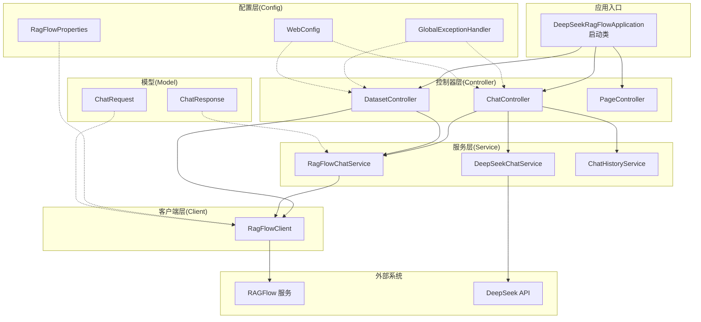
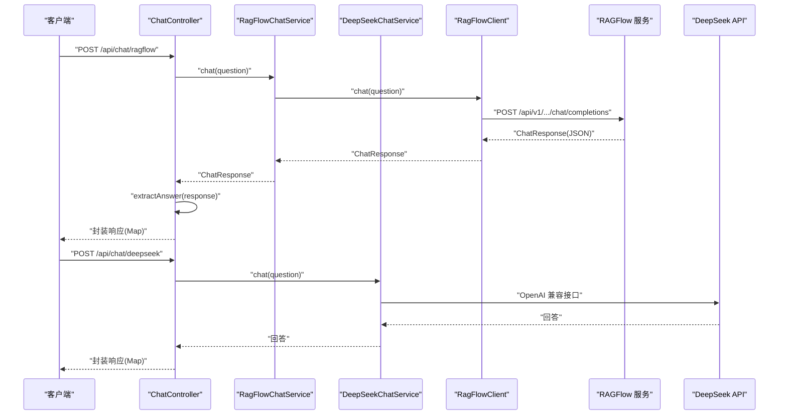
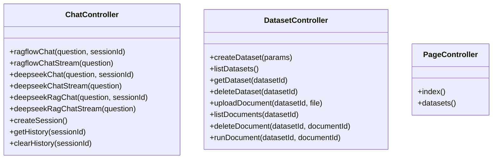
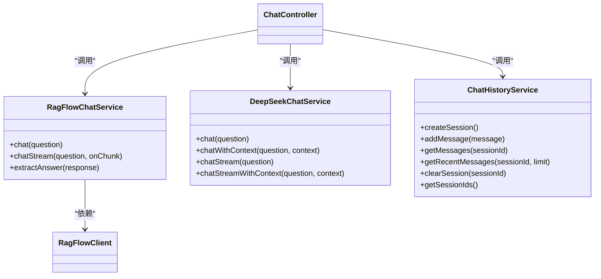
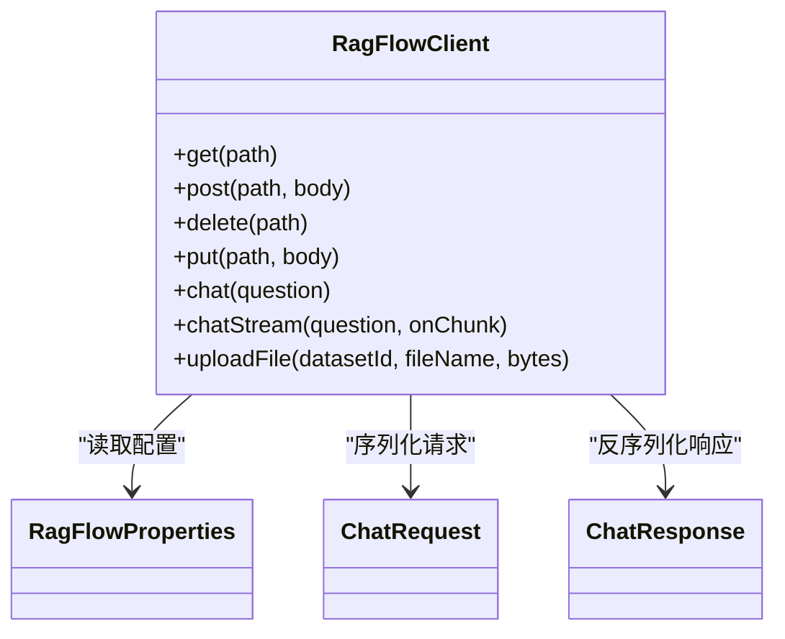
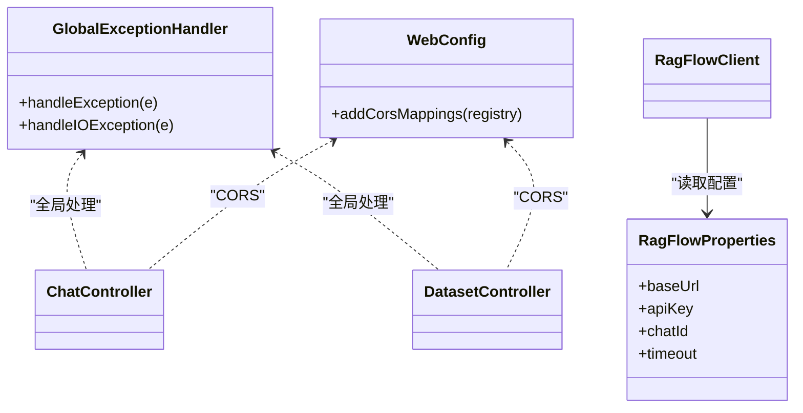
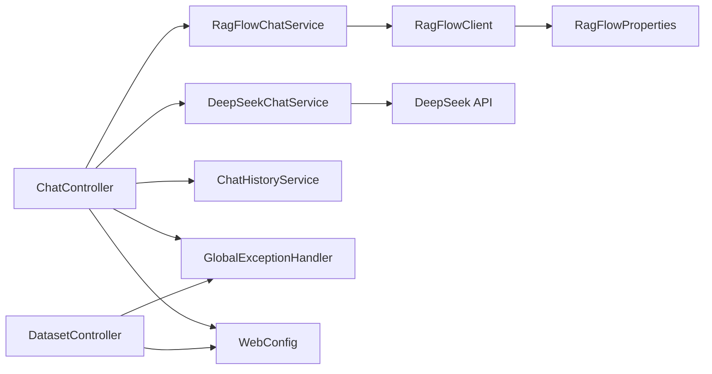

# 分层架构设计

<cite>
**本文引用的文件**
- [DeepSeekRagFlowApplication.java](file://src/main/java/org/wiki/DeepSeekRagFlowApplication.java)
- [ChatController.java](file://src/main/java/org/wiki/controller/ChatController.java)
- [DatasetController.java](file://src/main/java/org/wiki/controller/DatasetController.java)
- [PageController.java](file://src/main/java/org/wiki/controller/PageController.java)
- [RagFlowChatService.java](file://src/main/java/org/wiki/service/RagFlowChatService.java)
- [DeepSeekChatService.java](file://src/main/java/org/wiki/service/DeepSeekChatService.java)
- [ChatHistoryService.java](file://src/main/java/org/wiki/service/ChatHistoryService.java)
- [RagFlowClient.java](file://src/main/java/org/wiki/client/RagFlowClient.java)
- [GlobalExceptionHandler.java](file://src/main/java/org/wiki/config/GlobalExceptionHandler.java)
- [WebConfig.java](file://src/main/java/org/wiki/config/WebConfig.java)
- [RagFlowProperties.java](file://src/main/java/org/wiki/config/RagFlowProperties.java)
- [ChatResponse.java](file://src/main/java/org/wiki/model/ChatResponse.java)
- [ChatRequest.java](file://src/main/java/org/wiki/model/ChatRequest.java)
- [application.yml](file://src/main/resources/application.yml)
- [pom.xml](file://pom.xml)
</cite>

## 目录
1. [引言](#引言)
2. [项目结构](#项目结构)
3. [核心组件](#核心组件)
4. [架构总览](#架构总览)
5. [详细组件分析](#详细组件分析)
6. [依赖分析](#依赖分析)
7. [性能考虑](#性能考虑)
8. [故障排查指南](#故障排查指南)
9. [结论](#结论)
10. [附录](#附录)

## 引言
本设计文档围绕 MVC 分层架构在项目中的落地实践展开，系统性阐述控制器层（Controller）、服务层（Service）、客户端层（Client）、配置层（Config）以及模型层（Model）的职责划分、交互方式与最佳实践。重点包括：
- 控制器层负责 HTTP 请求处理、参数校验与响应封装；
- 服务层封装业务逻辑、组合多个服务、协调外部调用；
- 客户端层封装外部 API 调用、统一 HTTP 客户端配置与错误处理；
- 配置层提供全局配置、CORS、异常处理等横切能力；
- 模型层定义请求/响应的数据结构。

## 项目结构
项目采用标准 Spring Boot 结构，按功能模块组织代码：
- controller：REST 控制器，暴露 HTTP 接口
- service：业务服务，封装领域逻辑
- client：外部 API 客户端，封装 HTTP 调用
- config：全局配置、拦截器、异常处理
- model：数据模型
- resources：静态资源、模板与配置文件

图表来源
- [DeepSeekRagFlowApplication.java:1-12](file://src/main/java/org/wiki/DeepSeekRagFlowApplication.java#L1-L12)
- [ChatController.java:1-276](file://src/main/java/org/wiki/controller/ChatController.java#L1-L276)
- [DatasetController.java:1-197](file://src/main/java/org/wiki/controller/DatasetController.java#L1-L197)
- [PageController.java:1-30](file://src/main/java/org/wiki/controller/PageController.java#L1-L30)
- [RagFlowChatService.java:1-84](file://src/main/java/org/wiki/service/RagFlowChatService.java#L1-L84)
- [DeepSeekChatService.java:1-125](file://src/main/java/org/wiki/service/DeepSeekChatService.java#L1-L125)
- [ChatHistoryService.java:1-88](file://src/main/java/org/wiki/service/ChatHistoryService.java#L1-L88)
- [RagFlowClient.java:1-231](file://src/main/java/org/wiki/client/RagFlowClient.java#L1-L231)
- [GlobalExceptionHandler.java:1-46](file://src/main/java/org/wiki/config/GlobalExceptionHandler.java#L1-L46)
- [WebConfig.java:1-23](file://src/main/java/org/wiki/config/WebConfig.java#L1-L23)
- [RagFlowProperties.java:1-32](file://src/main/java/org/wiki/config/RagFlowProperties.java#L1-L32)
- [ChatRequest.java:1-59](file://src/main/java/org/wiki/model/ChatRequest.java#L1-L59)
- [ChatResponse.java:1-52](file://src/main/java/org/wiki/model/ChatResponse.java#L1-L52)

章节来源
- [pom.xml:1-102](file://pom.xml#L1-L102)
- [application.yml:1-27](file://src/main/resources/application.yml#L1-L27)

## 核心组件
- 控制器层：提供 REST 接口，负责请求参数接收、简单参数校验、调用服务层并统一封装响应。
- 服务层：封装业务规则与流程编排，协调多个服务或外部调用，保证幂等与一致性。
- 客户端层：封装外部 API 调用细节，统一鉴权头、超时、序列化与错误处理。
- 配置层：提供跨域、全局异常处理、外部服务配置等横切关注点。
- 模型层：定义请求/响应的数据结构，便于序列化与契约约束。

章节来源
- [ChatController.java:1-276](file://src/main/java/org/wiki/controller/ChatController.java#L1-L276)
- [DatasetController.java:1-197](file://src/main/java/org/wiki/controller/DatasetController.java#L1-L197)
- [RagFlowChatService.java:1-84](file://src/main/java/org/wiki/service/RagFlowChatService.java#L1-L84)
- [DeepSeekChatService.java:1-125](file://src/main/java/org/wiki/service/DeepSeekChatService.java#L1-L125)
- [RagFlowClient.java:1-231](file://src/main/java/org/wiki/client/RagFlowClient.java#L1-L231)
- [GlobalExceptionHandler.java:1-46](file://src/main/java/org/wiki/config/GlobalExceptionHandler.java#L1-L46)
- [WebConfig.java:1-23](file://src/main/java/org/wiki/config/WebConfig.java#L1-L23)
- [RagFlowProperties.java:1-32](file://src/main/java/org/wiki/config/RagFlowProperties.java#L1-L32)
- [ChatRequest.java:1-59](file://src/main/java/org/wiki/model/ChatRequest.java#L1-L59)
- [ChatResponse.java:1-52](file://src/main/java/org/wiki/model/ChatResponse.java#L1-L52)

## 架构总览
系统采用典型的 MVC 分层架构，控制器层仅负责“薄薄一层”的请求处理与响应封装；服务层承担业务编排与规则；客户端层屏蔽外部调用细节；配置层提供横切能力。整体调用链路清晰，职责边界明确。

图表来源
- [ChatController.java:1-276](file://src/main/java/org/wiki/controller/ChatController.java#L1-L276)
- [RagFlowChatService.java:1-84](file://src/main/java/org/wiki/service/RagFlowChatService.java#L1-L84)
- [DeepSeekChatService.java:1-125](file://src/main/java/org/wiki/service/DeepSeekChatService.java#L1-L125)
- [RagFlowClient.java:1-231](file://src/main/java/org/wiki/client/RagFlowClient.java#L1-L231)

## 详细组件分析

### 控制器层（Controller）
- 职责
  - 接收 HTTP 请求，进行参数校验与类型转换；
  - 组织业务流程，调用服务层；
  - 统一响应封装，返回结构化结果；
  - 支持 SSE 流式输出与多模式对话（RAGFlow、DeepSeek、RAG 增强）。
- 关键点
  - 参数校验：对必填参数进行判空与默认值处理；
  - 响应封装：统一返回 Map(success, data/message/sessionId)；
  - 异常处理：捕获 IO/运行时异常并记录日志；
  - 流式输出：RAGFlow 使用 SseEmitter，DeepSeek 使用 Spring AI 的 Flux。
- 代表接口
  - 对话接口：RAGFlow 非流式/流式、DeepSeek 非流式/流式、RAG 增强；
  - 知识库接口：创建/查询/删除知识库，上传/查询/删除文档，运行文档；
  - 页面路由：首页与知识库管理页面。

图表来源
- [ChatController.java:1-276](file://src/main/java/org/wiki/controller/ChatController.java#L1-L276)
- [DatasetController.java:1-197](file://src/main/java/org/wiki/controller/DatasetController.java#L1-L197)
- [PageController.java:1-30](file://src/main/java/org/wiki/controller/PageController.java#L1-L30)

章节来源
- [ChatController.java:1-276](file://src/main/java/org/wiki/controller/ChatController.java#L1-L276)
- [DatasetController.java:1-197](file://src/main/java/org/wiki/controller/DatasetController.java#L1-L197)
- [PageController.java:1-30](file://src/main/java/org/wiki/controller/PageController.java#L1-L30)

### 服务层（Service）
- 职责
  - 封装业务逻辑与流程编排；
  - 协调多个服务或外部调用；
  - 维护会话历史、上下文拼接与提示词工程。
- 设计要点
  - 会话历史：基于内存的并发安全存储，限制最大消息数；
  - RAGFlow 服务：封装 RAGFlow 对话与流式处理，提取回答文本；
  - DeepSeek 服务：通过 Spring AI 调用兼容 OpenAI 接口的 DeepSeek API，支持纯对话与 RAG 增强、流式输出。
- 代表方法
  - RagFlowChatService.chat()/chatStream()/extractAnswer()
  - DeepSeekChatService.chat()/chatWithContext()/chatStream()/chatStreamWithContext()
  - ChatHistoryService.createSession()/addMessage()/getMessages()/clearSession()

图表来源
- [RagFlowChatService.java:1-84](file://src/main/java/org/wiki/service/RagFlowChatService.java#L1-L84)
- [DeepSeekChatService.java:1-125](file://src/main/java/org/wiki/service/DeepSeekChatService.java#L1-L125)
- [ChatHistoryService.java:1-88](file://src/main/java/org/wiki/service/ChatHistoryService.java#L1-L88)
- [RagFlowClient.java:1-231](file://src/main/java/org/wiki/client/RagFlowClient.java#L1-L231)
- [ChatController.java:1-276](file://src/main/java/org/wiki/controller/ChatController.java#L1-L276)

章节来源
- [RagFlowChatService.java:1-84](file://src/main/java/org/wiki/service/RagFlowChatService.java#L1-L84)
- [DeepSeekChatService.java:1-125](file://src/main/java/org/wiki/service/DeepSeekChatService.java#L1-L125)
- [ChatHistoryService.java:1-88](file://src/main/java/org/wiki/service/ChatHistoryService.java#L1-L88)

### 客户端层（Client）
- 职责
  - 封装外部 API 调用，统一 HTTP 客户端配置；
  - 统一鉴权头、超时、序列化与反序列化；
  - 错误处理：对外抛出 IO 异常，便于上层统一处理。
- 设计要点
  - 基于 OkHttp 构建客户端，支持 GET/POST/PUT/DELETE；
  - 对 RAGFlow 的 OpenAI 兼容接口进行封装，支持流式 SSE；
  - 文件上传采用 multipart/form-data。
- 代表方法
  - RagFlowClient.get/post/delete/put/chat/chatStream/uploadFile

图表来源
- [RagFlowClient.java:1-231](file://src/main/java/org/wiki/client/RagFlowClient.java#L1-L231)
- [RagFlowProperties.java:1-32](file://src/main/java/org/wiki/config/RagFlowProperties.java#L1-L32)
- [ChatRequest.java:1-59](file://src/main/java/org/wiki/model/ChatRequest.java#L1-L59)
- [ChatResponse.java:1-52](file://src/main/java/org/wiki/model/ChatResponse.java#L1-L52)

章节来源
- [RagFlowClient.java:1-231](file://src/main/java/org/wiki/client/RagFlowClient.java#L1-L231)
- [RagFlowProperties.java:1-32](file://src/main/java/org/wiki/config/RagFlowProperties.java#L1-L32)
- [ChatRequest.java:1-59](file://src/main/java/org/wiki/model/ChatRequest.java#L1-L59)
- [ChatResponse.java:1-52](file://src/main/java/org/wiki/model/ChatResponse.java#L1-L52)

### 配置层（Config）
- 职责
  - 提供全局配置（RAGFlow 服务地址、API Key、聊天助手 ID、超时）；
  - 配置跨域策略；
  - 提供全局异常处理，统一返回结构。
- 设计要点
  - 使用 @ConfigurationProperties 绑定 application.yml 中的 ragflow.* 配置；
  - WebConfig 开启 CORS，允许 /api/** 路径跨域；
  - GlobalExceptionHandler 统一捕获异常，区分状态码（如 UNAUTHORIZED、BAD_REQUEST、SERVICE_UNAVAILABLE）。

图表来源
- [RagFlowProperties.java:1-32](file://src/main/java/org/wiki/config/RagFlowProperties.java#L1-L32)
- [WebConfig.java:1-23](file://src/main/java/org/wiki/config/WebConfig.java#L1-L23)
- [GlobalExceptionHandler.java:1-46](file://src/main/java/org/wiki/config/GlobalExceptionHandler.java#L1-L46)
- [application.yml:1-27](file://src/main/resources/application.yml#L1-L27)

章节来源
- [RagFlowProperties.java:1-32](file://src/main/java/org/wiki/config/RagFlowProperties.java#L1-L32)
- [WebConfig.java:1-23](file://src/main/java/org/wiki/config/WebConfig.java#L1-L23)
- [GlobalExceptionHandler.java:1-46](file://src/main/java/org/wiki/config/GlobalExceptionHandler.java#L1-L46)
- [application.yml:1-27](file://src/main/resources/application.yml#L1-L27)

### 模型层（Model）
- 设计要点
  - ChatRequest：定义 OpenAI 兼容接口的请求体结构；
  - ChatResponse：定义 OpenAI 兼容接口的响应体结构；
  - 通过 JSON 序列化/反序列化与外部服务交互。
- 代表字段
  - ChatRequest.model/messages/stream/extraBody
  - ChatResponse.id/object/created/model/choices/usage

章节来源
- [ChatRequest.java:1-59](file://src/main/java/org/wiki/model/ChatRequest.java#L1-L59)
- [ChatResponse.java:1-52](file://src/main/java/org/wiki/model/ChatResponse.java#L1-L52)

## 依赖分析
- 组件耦合
  - 控制器依赖服务层，服务层依赖客户端层；
  - 客户端层依赖配置层（RagFlowProperties）；
  - 控制器与服务层之间为松耦合，通过接口抽象与依赖注入连接。
- 外部依赖
  - Spring Web、Spring AI OpenAI Starter、OkHttp、FastJSON2、Lombok、Thymeleaf。

图表来源
- [ChatController.java:1-276](file://src/main/java/org/wiki/controller/ChatController.java#L1-L276)
- [DatasetController.java:1-197](file://src/main/java/org/wiki/controller/DatasetController.java#L1-L197)
- [RagFlowChatService.java:1-84](file://src/main/java/org/wiki/service/RagFlowChatService.java#L1-L84)
- [DeepSeekChatService.java:1-125](file://src/main/java/org/wiki/service/DeepSeekChatService.java#L1-L125)
- [ChatHistoryService.java:1-88](file://src/main/java/org/wiki/service/ChatHistoryService.java#L1-L88)
- [RagFlowClient.java:1-231](file://src/main/java/org/wiki/client/RagFlowClient.java#L1-L231)
- [RagFlowProperties.java:1-32](file://src/main/java/org/wiki/config/RagFlowProperties.java#L1-L32)
- [GlobalExceptionHandler.java:1-46](file://src/main/java/org/wiki/config/GlobalExceptionHandler.java#L1-L46)
- [WebConfig.java:1-23](file://src/main/java/org/wiki/config/WebConfig.java#L1-L23)

章节来源
- [pom.xml:25-88](file://pom.xml#L25-L88)

## 性能考虑
- 流式输出
  - RAGFlow 使用 OkHttp SSE 流式读取，逐块推送；
  - DeepSeek 使用 Spring AI 的 Flux 流式输出，减少一次性响应体积。
- 并发与线程
  - 控制器层使用线程池执行 SSE 写入任务，避免阻塞主线程；
  - 会话历史使用并发安全容器，限制消息上限，防止内存膨胀。
- 超时与重试
  - 客户端设置连接/读/写超时，结合上层异常处理；
  - 建议在生产环境引入指数退避重试与熔断策略。
- 日志与可观测性
  - 控制器与服务层记录关键请求/响应摘要，避免泄露敏感信息；
  - 全局异常处理器统一返回结构，便于前端与监控系统消费。

## 故障排查指南
- 常见异常与定位
  - IO 异常：通常来自外部 API 调用失败，全局异常处理器将其映射为 SERVICE_UNAVAILABLE；
  - 参数异常：非法参数会被映射为 BAD_REQUEST；
  - 未授权：消息中包含 Unauthorized 时映射为 UNAUTHORIZED。
- 排查步骤
  - 检查 application.yml 中 ragflow.* 配置是否正确；
  - 查看控制器与服务层日志，确认参数与调用链；
  - 使用 curl 或 Postman 直连 RAGFlow/DeepSeek 接口验证外部服务可用性；
  - 关注 SSE 流式输出的异常回调与完成事件。
- 建议
  - 在生产环境替换内存存储为持久化存储；
  - 为外部调用增加超时与重试策略；
  - 对敏感日志输出进行脱敏处理。

章节来源
- [GlobalExceptionHandler.java:1-46](file://src/main/java/org/wiki/config/GlobalExceptionHandler.java#L1-L46)
- [application.yml:17-27](file://src/main/resources/application.yml#L17-L27)

## 结论
本项目通过清晰的 MVC 分层实现了对话与知识库管理能力，控制器层薄而稳，服务层承载业务编排，客户端层屏蔽外部差异，配置层提供横切能力。整体架构具备良好的扩展性与可维护性，适合在生产环境中进一步增强可观测性、稳定性与安全性。

## 附录
- 启动入口
  - 应用启动类位于 [DeepSeekRagFlowApplication.java:1-12](file://src/main/java/org/wiki/DeepSeekRagFlowApplication.java#L1-L12)
- 配置文件
  - 全局配置位于 [application.yml:1-27](file://src/main/resources/application.yml#L1-L27)，包含服务端口、Spring AI OpenAI 配置、RAGFlow 配置与日志级别
- 依赖清单
  - 详见 [pom.xml:25-88](file://pom.xml#L25-L88)