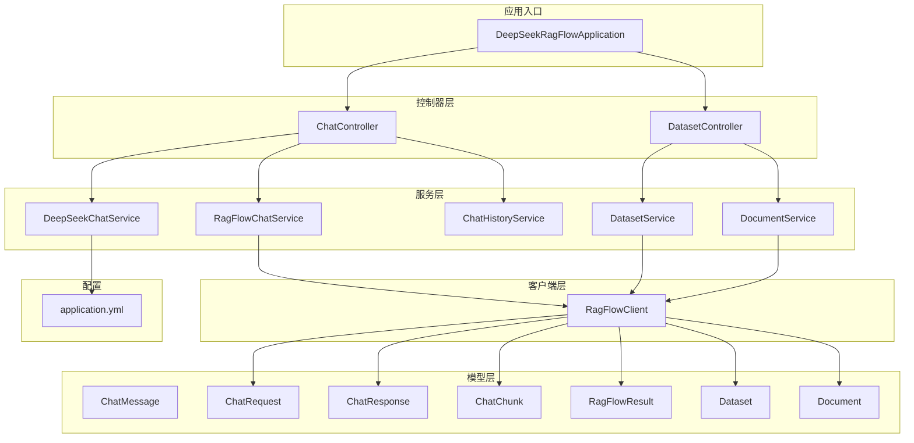
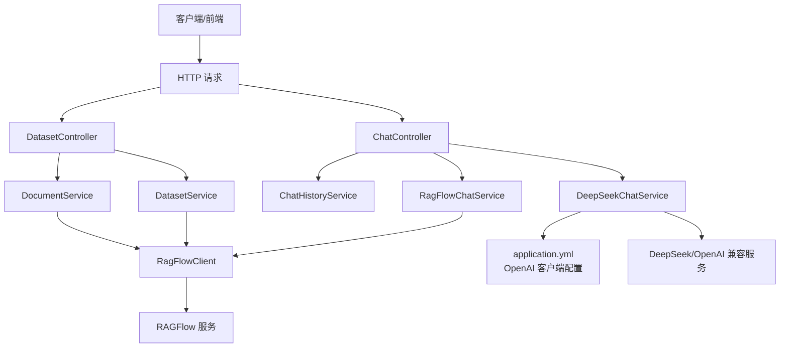
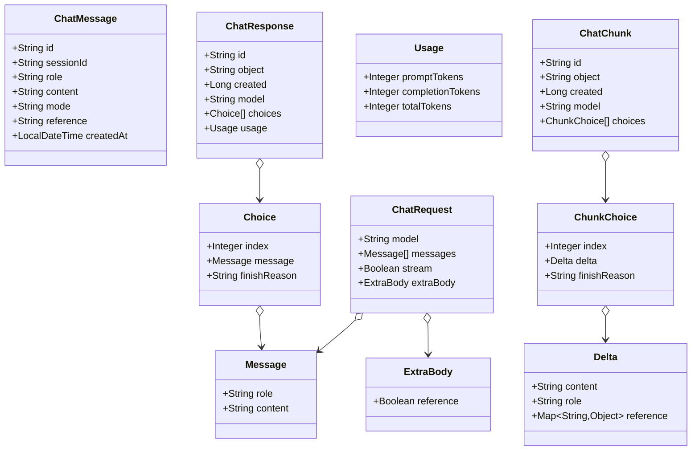
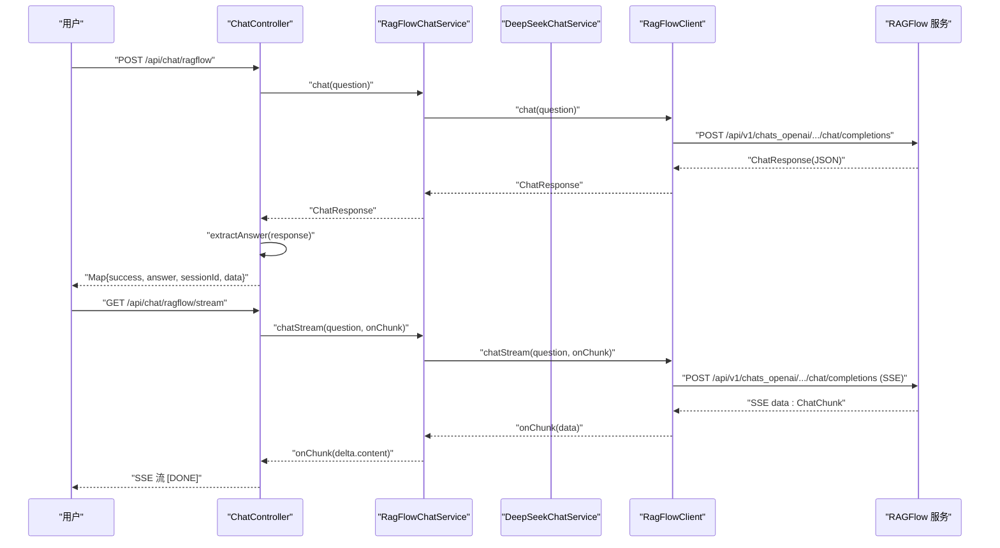
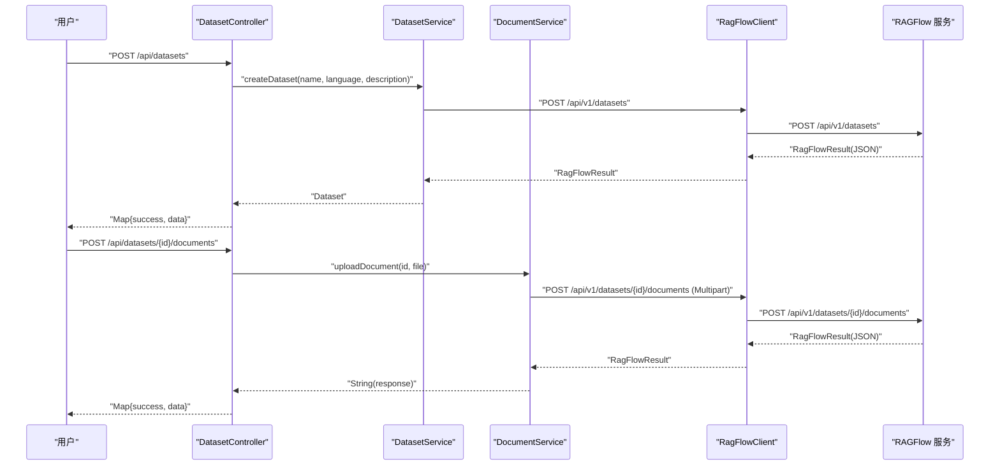
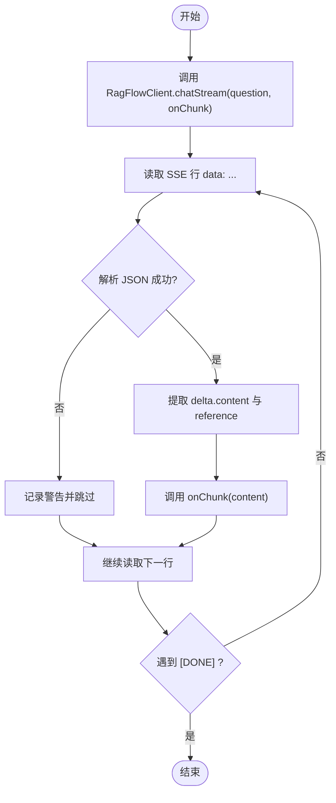
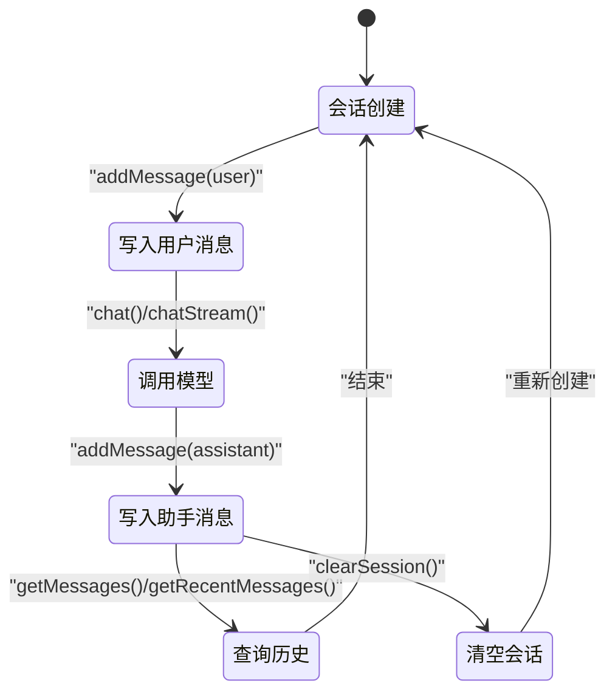
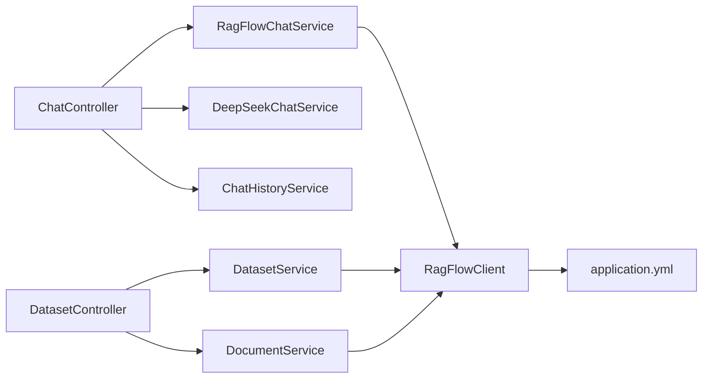

# 数据流分析

<cite>
**本文引用的文件**
- [DeepSeekRagFlowApplication.java](file://src/main/java/org/wiki/DeepSeekRagFlowApplication.java)
- [ChatController.java](file://src/main/java/org/wiki/controller/ChatController.java)
- [DatasetController.java](file://src/main/java/org/wiki/controller/DatasetController.java)
- [ChatMessage.java](file://src/main/java/org/wiki/model/ChatMessage.java)
- [ChatRequest.java](file://src/main/java/org/wiki/model/ChatRequest.java)
- [ChatResponse.java](file://src/main/java/org/wiki/model/ChatResponse.java)
- [ChatChunk.java](file://src/main/java/org/wiki/model/ChatChunk.java)
- [RagFlowResult.java](file://src/main/java/org/wiki/model/RagFlowResult.java)
- [Dataset.java](file://src/main/java/org/wiki/model/Dataset.java)
- [Document.java](file://src/main/java/org/wiki/model/Document.java)
- [RagFlowChatService.java](file://src/main/java/org/wiki/service/RagFlowChatService.java)
- [DeepSeekChatService.java](file://src/main/java/org/wiki/service/DeepSeekChatService.java)
- [ChatHistoryService.java](file://src/main/java/org/wiki/service/ChatHistoryService.java)
- [DatasetService.java](file://src/main/java/org/wiki/service/DatasetService.java)
- [DocumentService.java](file://src/main/java/org/wiki/service/DocumentService.java)
- [RagFlowClient.java](file://src/main/java/org/wiki/client/RagFlowClient.java)
- [application.yml](file://src/main/resources/application.yml)
</cite>

## 目录
1. [引言](#引言)
2. [项目结构](#项目结构)
3. [核心组件](#核心组件)
4. [架构总览](#架构总览)
5. [详细组件分析](#详细组件分析)
6. [依赖分析](#依赖分析)
7. [性能考虑](#性能考虑)
8. [故障排查指南](#故障排查指南)
9. [结论](#结论)
10. [附录](#附录)

## 引言
本文件聚焦于系统中“数据流”的全链路分析，覆盖从 HTTP 请求接收到最终响应返回的完整路径；解释对话消息的数据结构变化，从 ChatMessage 到 API 响应的转换过程；描述知识库数据的处理流程（上传、解析、存储、查询）；解释流式响应的数据传输机制（SSE 的数据推送过程）；提供数据流图与状态转换图；讨论数据验证、转换与序列化的处理逻辑；并分析内存存储与会话管理的数据处理方式。

## 项目结构
系统采用 Spring Boot 层次化组织，主要模块如下：
- 应用入口：启动类负责应用初始化
- 控制器层：ChatController、DatasetController 提供 REST API
- 服务层：RagFlowChatService、DeepSeekChatService、ChatHistoryService、DatasetService、DocumentService 实现业务逻辑
- 客户端层：RagFlowClient 封装对 RAGFlow 服务的 HTTP 调用
- 模型层：ChatMessage、ChatRequest、ChatResponse、ChatChunk、RagFlowResult、Dataset、Document 等数据模型
- 配置：application.yml 提供 OpenAI 兼容客户端与 RAGFlow 服务的配置

图表来源
- [DeepSeekRagFlowApplication.java:1-12](file://src/main/java/org/wiki/DeepSeekRagFlowApplication.java#L1-L12)
- [ChatController.java:1-276](file://src/main/java/org/wiki/controller/ChatController.java#L1-L276)
- [DatasetController.java:1-197](file://src/main/java/org/wiki/controller/DatasetController.java#L1-L197)
- [RagFlowChatService.java:1-84](file://src/main/java/org/wiki/service/RagFlowChatService.java#L1-L84)
- [DeepSeekChatService.java:1-125](file://src/main/java/org/wiki/service/DeepSeekChatService.java#L1-L125)
- [ChatHistoryService.java:1-88](file://src/main/java/org/wiki/service/ChatHistoryService.java#L1-L88)
- [DatasetService.java:1-128](file://src/main/java/org/wiki/service/DatasetService.java#L1-L128)
- [DocumentService.java:1-98](file://src/main/java/org/wiki/service/DocumentService.java#L1-L98)
- [RagFlowClient.java:1-231](file://src/main/java/org/wiki/client/RagFlowClient.java#L1-L231)
- [application.yml:1-27](file://src/main/resources/application.yml#L1-L27)

章节来源
- [DeepSeekRagFlowApplication.java:1-12](file://src/main/java/org/wiki/DeepSeekRagFlowApplication.java#L1-L12)
- [application.yml:1-27](file://src/main/resources/application.yml#L1-L27)

## 核心组件
- 控制器层：负责接收 HTTP 请求、参数校验、路由到具体服务，并封装统一的响应结构
- 服务层：实现业务逻辑，包括对话、历史、知识库与文档管理
- 客户端层：封装对 RAGFlow 的 HTTP 调用，支持流式与非流式
- 模型层：定义请求、响应、流式分片、会话消息等数据结构
- 配置层：定义 OpenAI 兼容客户端与 RAGFlow 服务的连接参数

章节来源
- [ChatController.java:1-276](file://src/main/java/org/wiki/controller/ChatController.java#L1-L276)
- [DatasetController.java:1-197](file://src/main/java/org/wiki/controller/DatasetController.java#L1-L197)
- [RagFlowChatService.java:1-84](file://src/main/java/org/wiki/service/RagFlowChatService.java#L1-L84)
- [DeepSeekChatService.java:1-125](file://src/main/java/org/wiki/service/DeepSeekChatService.java#L1-L125)
- [ChatHistoryService.java:1-88](file://src/main/java/org/wiki/service/ChatHistoryService.java#L1-L88)
- [DatasetService.java:1-128](file://src/main/java/org/wiki/service/DatasetService.java#L1-L128)
- [DocumentService.java:1-98](file://src/main/java/org/wiki/service/DocumentService.java#L1-L98)
- [RagFlowClient.java:1-231](file://src/main/java/org/wiki/client/RagFlowClient.java#L1-L231)
- [ChatMessage.java:1-82](file://src/main/java/org/wiki/model/ChatMessage.java#L1-L82)
- [ChatRequest.java:1-59](file://src/main/java/org/wiki/model/ChatRequest.java#L1-L59)
- [ChatResponse.java:1-52](file://src/main/java/org/wiki/model/ChatResponse.java#L1-L52)
- [ChatChunk.java:1-42](file://src/main/java/org/wiki/model/ChatChunk.java#L1-L42)
- [RagFlowResult.java:1-25](file://src/main/java/org/wiki/model/RagFlowResult.java#L1-L25)
- [Dataset.java:1-33](file://src/main/java/org/wiki/model/Dataset.java#L1-L33)
- [Document.java:1-24](file://src/main/java/org/wiki/model/Document.java#L1-L24)

## 架构总览
系统采用“控制器-服务-客户端-外部服务”的分层架构。控制器负责协议与路由，服务层负责业务编排，客户端封装 HTTP 交互，外部服务为 RAGFlow 与 DeepSeek（OpenAI 兼容）。

图表来源
- [ChatController.java:1-276](file://src/main/java/org/wiki/controller/ChatController.java#L1-L276)
- [DatasetController.java:1-197](file://src/main/java/org/wiki/controller/DatasetController.java#L1-L197)
- [RagFlowChatService.java:1-84](file://src/main/java/org/wiki/service/RagFlowChatService.java#L1-L84)
- [DeepSeekChatService.java:1-125](file://src/main/java/org/wiki/service/DeepSeekChatService.java#L1-L125)
- [ChatHistoryService.java:1-88](file://src/main/java/org/wiki/service/ChatHistoryService.java#L1-L88)
- [DatasetService.java:1-128](file://src/main/java/org/wiki/service/DatasetService.java#L1-L128)
- [DocumentService.java:1-98](file://src/main/java/org/wiki/service/DocumentService.java#L1-L98)
- [RagFlowClient.java:1-231](file://src/main/java/org/wiki/client/RagFlowClient.java#L1-L231)
- [application.yml:1-27](file://src/main/resources/application.yml#L1-L27)

## 详细组件分析

### 对话消息的数据结构与流转
- ChatMessage：用于内存会话存储的消息载体，包含角色、内容、模式、引用、时间戳等字段
- ChatRequest：RAGFlow 对话请求模型，包含消息列表、是否流式、额外参数（含引用开关）
- ChatResponse：RAGFlow 非流式响应模型，包含 choices、usage 等
- ChatChunk：RAGFlow 流式响应分片模型，包含 delta（含 content 与 reference）

数据结构转换与处理要点：
- 控制器接收用户输入，构造 ChatMessage 并写入会话
- RagFlowChatService 将 ChatMessage 转换为 ChatRequest 发送至 RAGFlow
- RAGFlow 返回 ChatResponse 或流式数据（ChatChunk），服务层提取回答与引用
- DeepSeekChatService 使用 Spring AI 的 Prompt/Flux 进行对话或流式输出
- 控制器将最终结果封装为统一响应结构返回

图表来源
- [ChatMessage.java:1-82](file://src/main/java/org/wiki/model/ChatMessage.java#L1-L82)
- [ChatRequest.java:1-59](file://src/main/java/org/wiki/model/ChatRequest.java#L1-L59)
- [ChatResponse.java:1-52](file://src/main/java/org/wiki/model/ChatResponse.java#L1-L52)
- [ChatChunk.java:1-42](file://src/main/java/org/wiki/model/ChatChunk.java#L1-L42)

章节来源
- [ChatMessage.java:1-82](file://src/main/java/org/wiki/model/ChatMessage.java#L1-L82)
- [ChatRequest.java:1-59](file://src/main/java/org/wiki/model/ChatRequest.java#L1-L59)
- [ChatResponse.java:1-52](file://src/main/java/org/wiki/model/ChatResponse.java#L1-L52)
- [ChatChunk.java:1-42](file://src/main/java/org/wiki/model/ChatChunk.java#L1-L42)

### 对话流程（非流式与流式）
- 非流式：控制器调用对应服务，服务层发起 HTTP 请求，解析响应，提取回答并写入会话历史
- 流式：RAGFlow 使用 SSE，DeepSeek 使用 Spring AI 的 Flux；控制器分别通过 SseEmitter 与直接返回 Flux 输出

图表来源
- [ChatController.java:51-107](file://src/main/java/org/wiki/controller/ChatController.java#L51-L107)
- [RagFlowChatService.java:34-72](file://src/main/java/org/wiki/service/RagFlowChatService.java#L34-L72)
- [RagFlowClient.java:135-200](file://src/main/java/org/wiki/client/RagFlowClient.java#L135-L200)

章节来源
- [ChatController.java:51-107](file://src/main/java/org/wiki/controller/ChatController.java#L51-L107)
- [RagFlowChatService.java:34-72](file://src/main/java/org/wiki/service/RagFlowChatService.java#L34-L72)
- [RagFlowClient.java:135-200](file://src/main/java/org/wiki/client/RagFlowClient.java#L135-L200)

### 知识库与文档处理流程
- 知识库管理：创建、查询、删除、更新
- 文档管理：上传、列出、删除、解析/运行
- 数据流转：控制器接收请求，服务层调用 RagFlowClient，客户端封装 HTTP 请求，返回 JSON 结构，服务层解析为 Dataset/Document 列表

图表来源
- [DatasetController.java:41-135](file://src/main/java/org/wiki/controller/DatasetController.java#L41-L135)
- [DatasetService.java:37-53](file://src/main/java/org/wiki/service/DatasetService.java#L37-L53)
- [DocumentService.java:33-37](file://src/main/java/org/wiki/service/DocumentService.java#L33-L37)
- [RagFlowClient.java:206-229](file://src/main/java/org/wiki/client/RagFlowClient.java#L206-L229)

章节来源
- [DatasetController.java:41-135](file://src/main/java/org/wiki/controller/DatasetController.java#L41-L135)
- [DatasetService.java:37-53](file://src/main/java/org/wiki/service/DatasetService.java#L37-L53)
- [DocumentService.java:33-37](file://src/main/java/org/wiki/service/DocumentService.java#L33-L37)
- [RagFlowClient.java:206-229](file://src/main/java/org/wiki/client/RagFlowClient.java#L206-L229)

### 流式响应机制（SSE）
- RAGFlow 流式：RagFlowClient 以 SSE 形式读取服务端返回的 data 行，逐块解析并回调 onChunk
- DeepSeek 流式：DeepSeekChatService 使用 Spring AI 的 Flux，控制器通过 SseEmitter 或直接返回 Flux
- 控制器侧：RagFlow 使用 SseEmitter，DeepSeek+RAG 增强模式同样使用 SseEmitter 包裹

图表来源
- [RagFlowClient.java:154-200](file://src/main/java/org/wiki/client/RagFlowClient.java#L154-L200)
- [RagFlowChatService.java:50-72](file://src/main/java/org/wiki/service/RagFlowChatService.java#L50-L72)

章节来源
- [RagFlowClient.java:154-200](file://src/main/java/org/wiki/client/RagFlowClient.java#L154-L200)
- [RagFlowChatService.java:50-72](file://src/main/java/org/wiki/service/RagFlowChatService.java#L50-L72)
- [ChatController.java:85-107](file://src/main/java/org/wiki/controller/ChatController.java#L85-L107)

### 会话管理与内存存储
- ChatHistoryService 基于内存 ConcurrentHashMap 存储会话消息，支持创建会话、添加消息、获取历史、清理会话
- 控制器在每次对话前后写入用户与助手消息，限制每会话最大消息数，避免内存无限增长

图表来源
- [ChatHistoryService.java:31-86](file://src/main/java/org/wiki/service/ChatHistoryService.java#L31-L86)
- [ChatController.java:182-213](file://src/main/java/org/wiki/controller/ChatController.java#L182-L213)

章节来源
- [ChatHistoryService.java:31-86](file://src/main/java/org/wiki/service/ChatHistoryService.java#L31-L86)
- [ChatController.java:182-213](file://src/main/java/org/wiki/controller/ChatController.java#L182-L213)

### 数据验证、转换与序列化
- 参数校验：控制器通过@RequestParam/@RequestBody 接收参数，必要时进行日志记录与错误包装
- 序列化/反序列化：RagFlowClient 使用 FastJSON2 进行 JSON 序列化与解析；Spring AI 使用其内部序列化策略处理流式数据
- 类型转换：ChatRequest/ChatResponse/ChatChunk 与 RAGFlow API 的 JSON 字段一一映射，服务层负责提取与组装

章节来源
- [RagFlowClient.java:62-82](file://src/main/java/org/wiki/client/RagFlowClient.java#L62-L82)
- [RagFlowClient.java:135-148](file://src/main/java/org/wiki/client/RagFlowClient.java#L135-L148)
- [RagFlowChatService.java:77-82](file://src/main/java/org/wiki/service/RagFlowChatService.java#L77-L82)
- [DeepSeekChatService.java:86-92](file://src/main/java/org/wiki/service/DeepSeekChatService.java#L86-L92)

## 依赖分析
- 控制器依赖服务：ChatController 依赖 RagFlowChatService、DeepSeekChatService、ChatHistoryService；DatasetController 依赖 DatasetService、DocumentService
- 服务依赖客户端：RagFlowChatService、DatasetService、DocumentService 依赖 RagFlowClient
- 客户端依赖配置：RagFlowClient 依赖 RagFlowProperties（由 application.yml 注入）
- 模型依赖：ChatRequest/ChatResponse/ChatChunk 与 RAGFlow API 协议一致

图表来源
- [ChatController.java:37-41](file://src/main/java/org/wiki/controller/ChatController.java#L37-L41)
- [DatasetController.java:32-35](file://src/main/java/org/wiki/controller/DatasetController.java#L32-L35)
- [RagFlowChatService.java:22-24](file://src/main/java/org/wiki/service/RagFlowChatService.java#L22-L24)
- [DatasetService.java:25-27](file://src/main/java/org/wiki/service/DatasetService.java#L25-L27)
- [DocumentService.java:25-27](file://src/main/java/org/wiki/service/DocumentService.java#L25-L27)
- [RagFlowClient.java:28-35](file://src/main/java/org/wiki/client/RagFlowClient.java#L28-L35)
- [application.yml:17-22](file://src/main/resources/application.yml#L17-L22)

章节来源
- [ChatController.java:37-41](file://src/main/java/org/wiki/controller/ChatController.java#L37-L41)
- [DatasetController.java:32-35](file://src/main/java/org/wiki/controller/DatasetController.java#L32-L35)
- [RagFlowClient.java:28-35](file://src/main/java/org/wiki/client/RagFlowClient.java#L28-L35)
- [application.yml:17-22](file://src/main/resources/application.yml#L17-L22)

## 性能考虑
- 流式传输：优先使用 SSE/Flux 减少首字节延迟与内存占用
- 超时控制：RagFlowClient 设置读超时，application.yml 设置 OpenAI 客户端选项
- 会话容量限制：ChatHistoryService 限制每会话消息数量，防止内存膨胀
- 并发执行：控制器使用线程池执行流式任务，避免阻塞主线程

章节来源
- [RagFlowClient.java:30-34](file://src/main/java/org/wiki/client/RagFlowClient.java#L30-L34)
- [application.yml:9-15](file://src/main/resources/application.yml#L9-L15)
- [ChatHistoryService.java](file://src/main/java/org/wiki/service/ChatHistoryService.java#L26)
- [ChatController.java](file://src/main/java/org/wiki/controller/ChatController.java#L35)
- [ChatController.java:89-104](file://src/main/java/org/wiki/controller/ChatController.java#L89-L104)

## 故障排查指南
- RAGFlow API 失败：检查授权头、URL、超时设置；查看客户端日志与异常堆栈
- 流式解析异常：关注 SSE 数据行解析失败的日志，确认数据格式与边界条件
- 会话异常：确认 sessionId 是否正确传递，内存存储是否被清理
- DeepSeek 对话失败：检查 OpenAI 兼容配置、模型名称与网络连通性

章节来源
- [RagFlowClient.java:49-56](file://src/main/java/org/wiki/client/RagFlowClient.java#L49-L56)
- [RagFlowClient.java:175-179](file://src/main/java/org/wiki/client/RagFlowClient.java#L175-L179)
- [RagFlowChatService.java:67-69](file://src/main/java/org/wiki/service/RagFlowChatService.java#L67-L69)
- [ChatHistoryService.java:66-69](file://src/main/java/org/wiki/service/ChatHistoryService.java#L66-L69)
- [application.yml:9-15](file://src/main/resources/application.yml#L9-L15)

## 结论
本系统通过清晰的分层设计实现了从 HTTP 请求到响应返回的完整数据流：控制器负责路由与封装，服务层负责业务编排与数据转换，客户端负责与外部服务交互，模型层保证数据结构一致性。系统同时支持非流式与流式两种输出方式，并通过内存会话管理与配置化参数实现灵活扩展与稳定运行。

## 附录
- 统一响应结构：控制器将成功/失败标志与数据封装为 Map，便于前端统一处理
- 配置项说明：application.yml 中包含 OpenAI 兼容客户端与 RAGFlow 服务的关键参数

章节来源
- [ChatController.java:54-75](file://src/main/java/org/wiki/controller/ChatController.java#L54-L75)
- [DatasetController.java:44-57](file://src/main/java/org/wiki/controller/DatasetController.java#L44-L57)
- [application.yml:9-22](file://src/main/resources/application.yml#L9-L22)