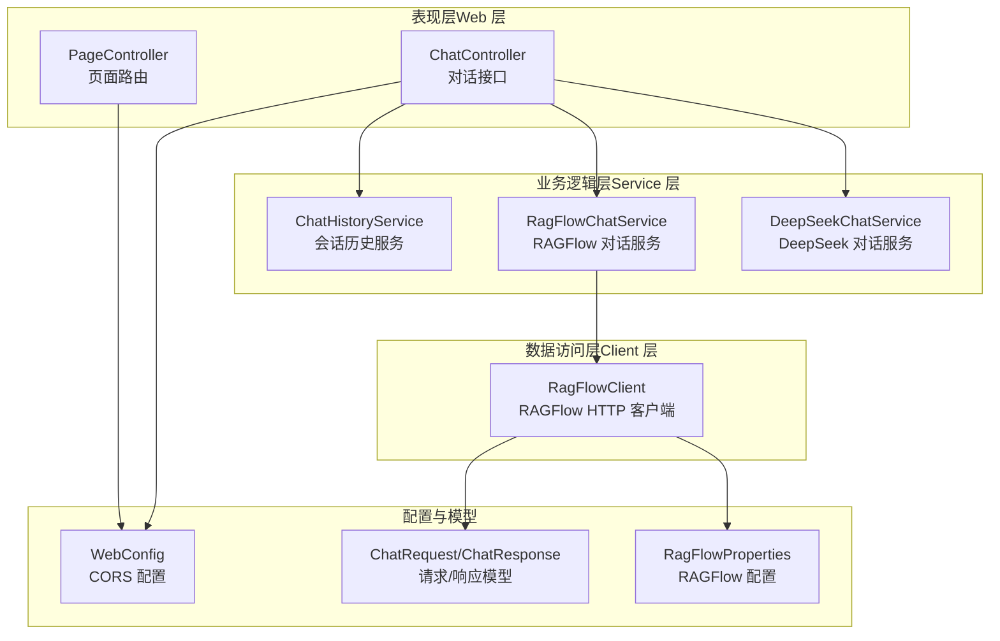
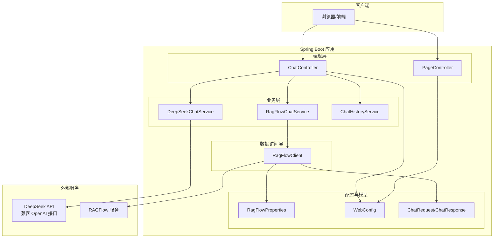
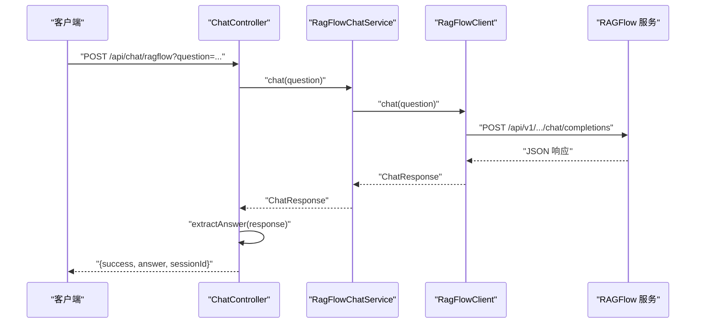
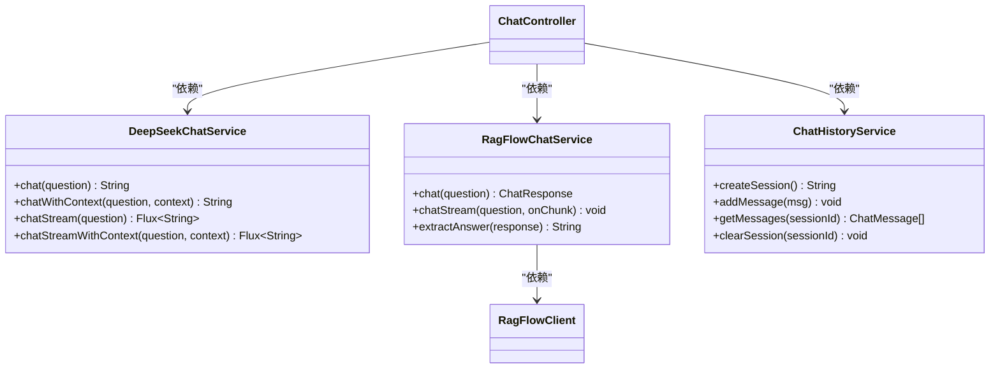
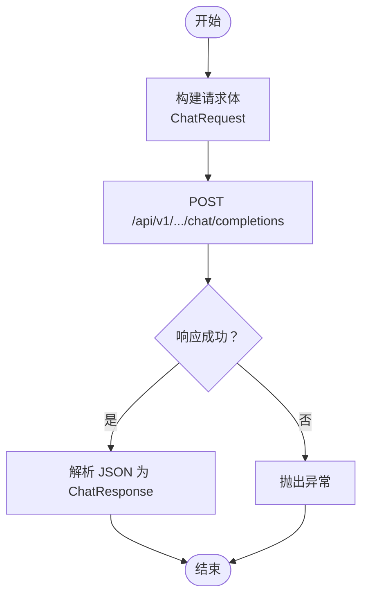
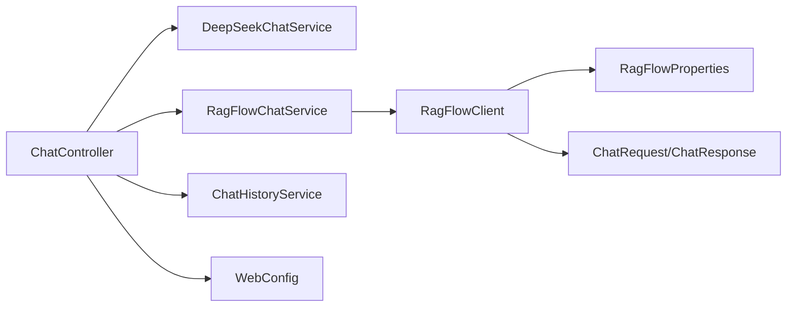

# 整体架构设计

<cite>
**本文档引用的文件**
- [DeepSeekRagFlowApplication.java](file://src/main/java/org/wiki/DeepSeekRagFlowApplication.java)
- [pom.xml](file://pom.xml)
- [application.yml](file://src/main/resources/application.yml)
- [ChatController.java](file://src/main/java/org/wiki/controller/ChatController.java)
- [PageController.java](file://src/main/java/org/wiki/controller/PageController.java)
- [RagFlowClient.java](file://src/main/java/org/wiki/client/RagFlowClient.java)
- [DeepSeekChatService.java](file://src/main/java/org/wiki/service/DeepSeekChatService.java)
- [RagFlowChatService.java](file://src/main/java/org/wiki/service/RagFlowChatService.java)
- [ChatHistoryService.java](file://src/main/java/org/wiki/service/ChatHistoryService.java)
- [RagFlowProperties.java](file://src/main/java/org/wiki/config/RagFlowProperties.java)
- [WebConfig.java](file://src/main/java/org/wiki/config/WebConfig.java)
- [ChatRequest.java](file://src/main/java/org/wiki/model/ChatRequest.java)
- [ChatResponse.java](file://src/main/java/org/wiki/model/ChatResponse.java)
- [Dockerfile](file://Dockerfile)
- [docker-compose.yml](file://docker-compose.yml)
</cite>

## 目录
1. [引言](#引言)
2. [项目结构](#项目结构)
3. [核心组件](#核心组件)
4. [架构总览](#架构总览)
5. [详细组件分析](#详细组件分析)
6. [依赖分析](#依赖分析)
7. [性能考虑](#性能考虑)
8. [故障排查指南](#故障排查指南)
9. [结论](#结论)
10. [附录](#附录)

## 引言
本项目为基于 Spring Boot 的“DeepSeek + RAGFlow”知识库问答演示系统，采用三层架构与 MVC 设计模式，结合 Spring AI 与 OkHttp 实现对 DeepSeek（兼容 OpenAI 接口）与 RAGFlow 的统一接入。系统提供三种对话模式：RAGFlow 独立问答、DeepSeek 直连问答、以及“RAG 增强”的 DeepSeek 问答。同时支持非流式与流式（SSE）两种交互方式，并内置会话历史管理与跨域配置。

## 项目结构
项目采用标准 Maven 结构，按功能域划分包：
- controller：MVC 的表现层，负责 HTTP 接口与视图跳转
- service：业务逻辑层，封装与外部服务的交互与业务处理
- client：数据访问层（Client 层），封装对 RAGFlow 的 HTTP 调用
- model：数据模型，定义请求/响应结构
- config：配置类，包括属性绑定、CORS、全局异常等
- resources：静态资源、模板与配置文件

图表来源
- [ChatController.java:1-276](file://src/main/java/org/wiki/controller/ChatController.java#L1-276)
- [PageController.java:1-30](file://src/main/java/org/wiki/controller/PageController.java#L1-30)
- [DeepSeekChatService.java:1-125](file://src/main/java/org/wiki/service/DeepSeekChatService.java#L1-125)
- [RagFlowChatService.java:1-84](file://src/main/java/org/wiki/service/RagFlowChatService.java#L1-84)
- [ChatHistoryService.java:1-88](file://src/main/java/org/wiki/service/ChatHistoryService.java#L1-88)
- [RagFlowClient.java:1-231](file://src/main/java/org/wiki/client/RagFlowClient.java#L1-231)
- [RagFlowProperties.java:1-32](file://src/main/java/org/wiki/config/RagFlowProperties.java#L1-32)
- [WebConfig.java:1-23](file://src/main/java/org/wiki/config/WebConfig.java#L1-23)
- [ChatRequest.java:1-59](file://src/main/java/org/wiki/model/ChatRequest.java#L1-59)
- [ChatResponse.java:1-52](file://src/main/java/org/wiki/model/ChatResponse.java#L1-52)

章节来源
- [pom.xml:1-102](file://pom.xml#L1-102)
- [application.yml:1-27](file://src/main/resources/application.yml#L1-27)

## 核心组件
- 主应用类与启动流程
  - 主应用类位于根包路径，使用注解启用 Spring Boot 自动装配，启动时由引导方法加载配置并启动嵌入式服务器。
- 技术栈与作用
  - Spring Boot：应用容器与自动配置
  - Spring AI：OpenAI 兼容客户端，简化与 DeepSeek 的对话调用与流式输出
  - OkHttp：HTTP 客户端，封装 RAGFlow RESTful API 调用（含 SSE 流式）
  - Thymeleaf：服务端渲染页面（首页与知识库管理页）
  - Lombok：减少样板代码
  - FastJSON2：JSON 序列化与解析
- MVC 设计模式实现
  - 控制器（Controller）：接收请求、组织参数、调用服务、返回响应或视图
  - 服务（Service）：封装业务逻辑与对外接口调用
  - 视图（Template）：Thymeleaf 模板提供页面展示
- 三层架构映射
  - 表现层（Web 层）：PageController、ChatController
  - 业务逻辑层（Service 层）：DeepSeekChatService、RagFlowChatService、ChatHistoryService
  - 数据访问层（Client 层）：RagFlowClient

章节来源
- [DeepSeekRagFlowApplication.java:1-12](file://src/main/java/org/wiki/DeepSeekRagFlowApplication.java#L1-12)
- [pom.xml:25-88](file://pom.xml#L25-88)
- [application.yml:1-27](file://src/main/resources/application.yml#L1-27)

## 架构总览
系统边界与组件交互如下：

图表来源
- [ChatController.java:1-276](file://src/main/java/org/wiki/controller/ChatController.java#L1-276)
- [PageController.java:1-30](file://src/main/java/org/wiki/controller/PageController.java#L1-30)
- [DeepSeekChatService.java:1-125](file://src/main/java/org/wiki/service/DeepSeekChatService.java#L1-125)
- [RagFlowChatService.java:1-84](file://src/main/java/org/wiki/service/RagFlowChatService.java#L1-84)
- [ChatHistoryService.java:1-88](file://src/main/java/org/wiki/service/ChatHistoryService.java#L1-88)
- [RagFlowClient.java:1-231](file://src/main/java/org/wiki/client/RagFlowClient.java#L1-231)
- [RagFlowProperties.java:1-32](file://src/main/java/org/wiki/config/RagFlowProperties.java#L1-32)
- [WebConfig.java:1-23](file://src/main/java/org/wiki/config/WebConfig.java#L1-23)
- [ChatRequest.java:1-59](file://src/main/java/org/wiki/model/ChatRequest.java#L1-59)
- [ChatResponse.java:1-52](file://src/main/java/org/wiki/model/ChatResponse.java#L1-52)

## 详细组件分析

### 控制器层（表现层）
- ChatController
  - 提供三类对话接口：RAGFlow 非流式/流式、DeepSeek 非流式/流式、DeepSeek+RAG 增强（先检索后生成）
  - 支持会话管理：创建会话、查询历史、清空历史
  - 流式输出：RAGFlow 使用自定义 SSE，DeepSeek 使用 Spring AI 原生 Flux
- PageController
  - 提供页面路由：首页与知识库管理页

图表来源
- [ChatController.java:51-76](file://src/main/java/org/wiki/controller/ChatController.java#L51-76)
- [RagFlowChatService.java:34-41](file://src/main/java/org/wiki/service/RagFlowChatService.java#L34-41)
- [RagFlowClient.java:135-148](file://src/main/java/org/wiki/client/RagFlowClient.java#L135-148)

章节来源
- [ChatController.java:1-276](file://src/main/java/org/wiki/controller/ChatController.java#L1-276)
- [PageController.java:1-30](file://src/main/java/org/wiki/controller/PageController.java#L1-30)

### 业务逻辑层（Service 层）
- DeepSeekChatService
  - 使用 Spring AI ChatClient 调用 DeepSeek API，支持纯对话、RAG 增强、流式输出
  - RAG 增强通过系统提示词注入检索上下文
- RagFlowChatService
  - 封装 RAGFlow OpenAI 兼容接口调用，支持非流式与流式
  - 流式解析增量内容与引用信息
- ChatHistoryService
  - 内存级会话历史管理，支持并发安全与容量限制

图表来源
- [DeepSeekChatService.java:1-125](file://src/main/java/org/wiki/service/DeepSeekChatService.java#L1-125)
- [RagFlowChatService.java:1-84](file://src/main/java/org/wiki/service/RagFlowChatService.java#L1-84)
- [ChatHistoryService.java:1-88](file://src/main/java/org/wiki/service/ChatHistoryService.java#L1-88)

章节来源
- [DeepSeekChatService.java:1-125](file://src/main/java/org/wiki/service/DeepSeekChatService.java#L1-125)
- [RagFlowChatService.java:1-84](file://src/main/java/org/wiki/service/RagFlowChatService.java#L1-84)
- [ChatHistoryService.java:1-88](file://src/main/java/org/wiki/service/ChatHistoryService.java#L1-88)

### 数据访问层（Client 层）
- RagFlowClient
  - 统一封装 RAGFlow RESTful API：GET/POST/PUT/DELETE
  - 对话接口：非流式与 SSE 流式；文件上传
  - 基于 OkHttp 与 FastJSON2，支持超时与错误处理

图表来源
- [RagFlowClient.java:135-148](file://src/main/java/org/wiki/client/RagFlowClient.java#L135-148)
- [ChatRequest.java:1-59](file://src/main/java/org/wiki/model/ChatRequest.java#L1-59)
- [ChatResponse.java:1-52](file://src/main/java/org/wiki/model/ChatResponse.java#L1-52)

章节来源
- [RagFlowClient.java:1-231](file://src/main/java/org/wiki/client/RagFlowClient.java#L1-231)
- [ChatRequest.java:1-59](file://src/main/java/org/wiki/model/ChatRequest.java#L1-59)
- [ChatResponse.java:1-52](file://src/main/java/org/wiki/model/ChatResponse.java#L1-52)

### 配置与模型
- RagFlowProperties
  - 通过前缀绑定 application.yml 中的 ragflow.* 配置项
- WebConfig
  - 配置 CORS，开放 /api/** 路径跨域
- ChatRequest/ChatResponse
  - 定义 RAGFlow 对话请求与响应的数据结构

章节来源
- [RagFlowProperties.java:1-32](file://src/main/java/org/wiki/config/RagFlowProperties.java#L1-32)
- [WebConfig.java:1-23](file://src/main/java/org/wiki/config/WebConfig.java#L1-23)
- [ChatRequest.java:1-59](file://src/main/java/org/wiki/model/ChatRequest.java#L1-59)
- [ChatResponse.java:1-52](file://src/main/java/org/wiki/model/ChatResponse.java#L1-52)

## 依赖分析
- 外部依赖
  - Spring Boot Starter Web：提供 Web 运行时
  - Spring AI OpenAI Starter：提供 OpenAI 兼容客户端能力
  - Spring AI Tika Document Reader：文档解析（可选）
  - OkHttp 与 OkHttp SSE：HTTP 与 SSE 流式通信
  - FastJSON2：高性能 JSON 解析
  - Lombok：减少样板代码
  - Thymeleaf：服务端模板引擎
- 内部模块耦合
  - 控制器依赖服务层；服务层依赖客户端；客户端依赖配置与模型
  - 低耦合高内聚：各层职责清晰，便于替换与扩展

图表来源
- [ChatController.java:1-276](file://src/main/java/org/wiki/controller/ChatController.java#L1-276)
- [DeepSeekChatService.java:1-125](file://src/main/java/org/wiki/service/DeepSeekChatService.java#L1-125)
- [RagFlowChatService.java:1-84](file://src/main/java/org/wiki/service/RagFlowChatService.java#L1-84)
- [ChatHistoryService.java:1-88](file://src/main/java/org/wiki/service/ChatHistoryService.java#L1-88)
- [RagFlowClient.java:1-231](file://src/main/java/org/wiki/client/RagFlowClient.java#L1-231)
- [RagFlowProperties.java:1-32](file://src/main/java/org/wiki/config/RagFlowProperties.java#L1-32)
- [WebConfig.java:1-23](file://src/main/java/org/wiki/config/WebConfig.java#L1-23)
- [ChatRequest.java:1-59](file://src/main/java/org/wiki/model/ChatRequest.java#L1-59)
- [ChatResponse.java:1-52](file://src/main/java/org/wiki/model/ChatResponse.java#L1-52)

章节来源
- [pom.xml:25-88](file://pom.xml#L25-88)

## 性能考虑
- 流式输出
  - RAGFlow 使用 SSE 流式传输，降低首字节延迟
  - DeepSeek 使用 Spring AI 原生 Flux，具备背压与异步特性
- 并发与线程池
  - ChatController 使用缓存线程池执行 SSE 流式任务，避免阻塞主线程
- 超时与重试
  - OkHttp 设置连接/读/写超时；RAGFlow 客户端使用配置超时
- 资源优化
  - Dockerfile 使用 JRE 镜像与最小化依赖，减小镜像体积
  - JVM 参数通过环境变量注入，便于运行时调优

章节来源
- [ChatController.java:85-107](file://src/main/java/org/wiki/controller/ChatController.java#L85-107)
- [RagFlowClient.java:30-35](file://src/main/java/org/wiki/client/RagFlowClient.java#L30-35)
- [Dockerfile:1-15](file://Dockerfile#L1-15)

## 故障排查指南
- 常见问题定位
  - RAGFlow API 调用失败：检查 baseUrl、apiKey、chatId 与网络连通性
  - DeepSeek API 认证失败：确认 api-key 与 base-url 配置正确
  - 跨域问题：确认 /api/** 已开放 CORS
  - 流式输出中断：检查 SSE 超时设置与网络稳定性
- 日志与监控
  - application.yml 中开启 DEBUG 日志级别，便于定位问题
  - 控制器与服务层均记录关键日志，便于审计
- 配置验证
  - docker-compose 中通过环境变量注入配置，确保变量齐全

章节来源
- [application.yml:1-27](file://src/main/resources/application.yml#L1-27)
- [WebConfig.java:14-21](file://src/main/java/org/wiki/config/WebConfig.java#L14-21)
- [docker-compose.yml:11-17](file://docker-compose.yml#L11-17)

## 结论
本系统以 Spring Boot 为核心，结合 Spring AI 与 OkHttp，实现了对 DeepSeek 与 RAGFlow 的统一接入，采用 MVC 与三层架构，职责清晰、扩展性强。通过流式输出与内存会话管理，满足实时问答场景需求；通过 Docker 化部署与配置注入，提升运维效率。未来可在以下方面进一步增强：持久化会话历史、引入限流与熔断、增加可观测性与测试覆盖。

## 附录
- 部署与运行
  - 使用 docker-compose 构建并启动服务，端口映射 8081
  - 通过环境变量注入 DeepSeek 与 RAGFlow 的配置
- API 概览
  - 对话接口：/api/chat/ragflow、/api/chat/ragflow/stream、/api/chat/deepseek、/api/chat/deepseek/stream、/api/chat/deepseek/rag、/api/chat/deepseek/rag/stream
  - 会话接口：/api/chat/session、/api/chat/history/{sessionId}、/api/chat/history/{sessionId}

章节来源
- [docker-compose.yml:1-20](file://docker-compose.yml#L1-20)
- [ChatController.java:51-274](file://src/main/java/org/wiki/controller/ChatController.java#L51-274)