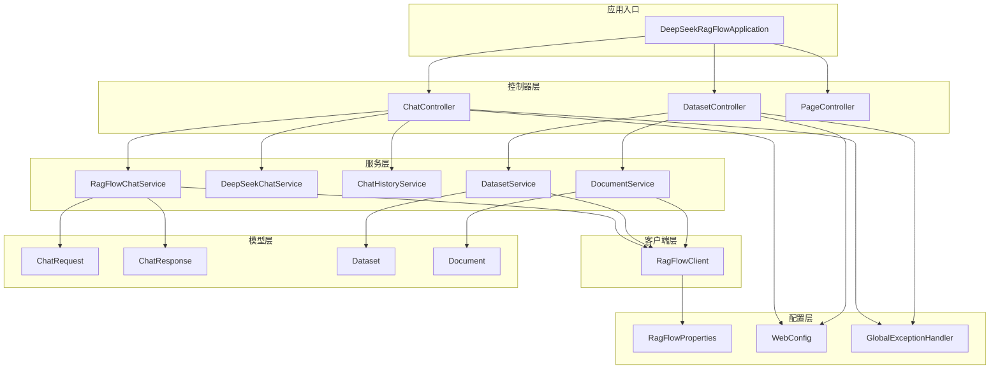
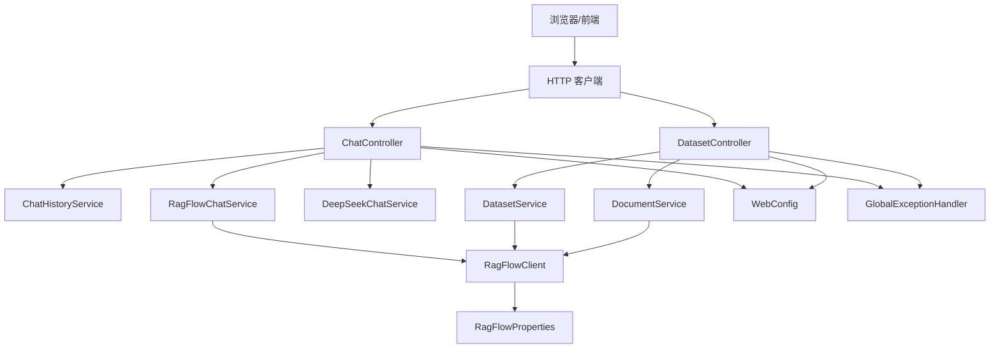
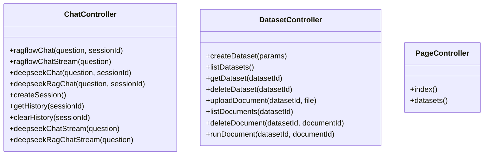
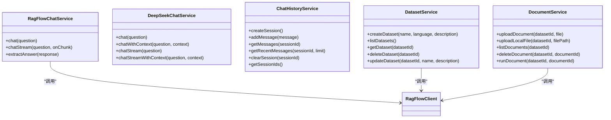
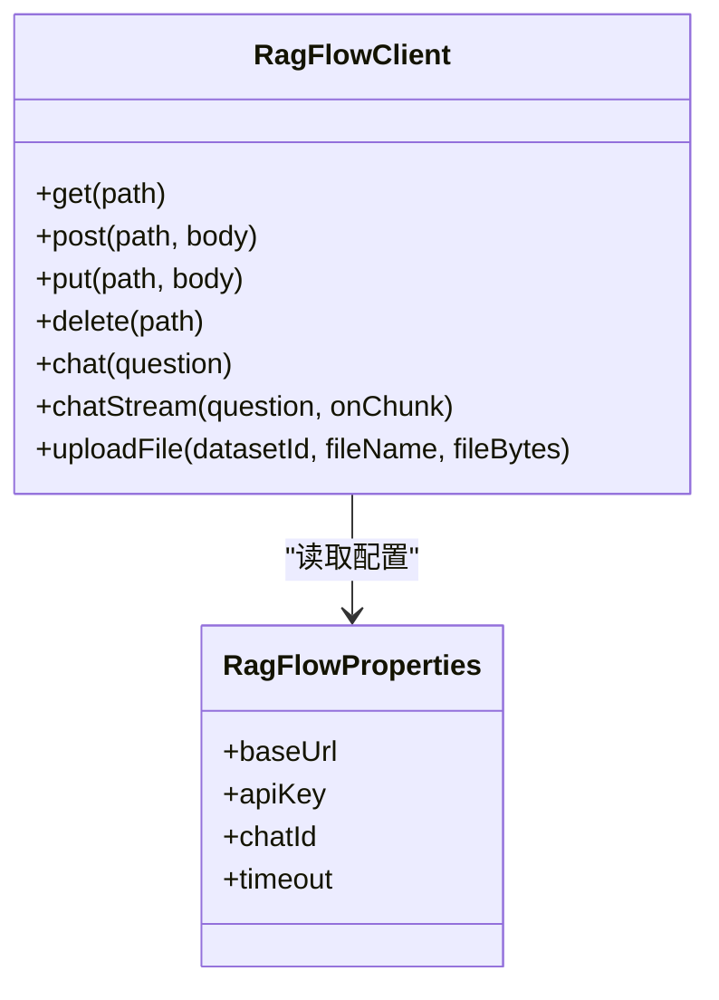
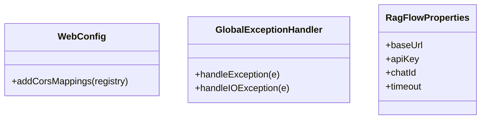
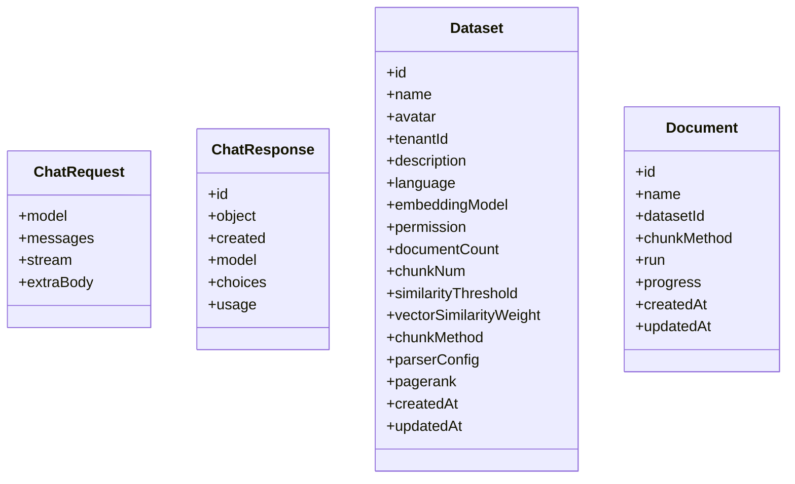
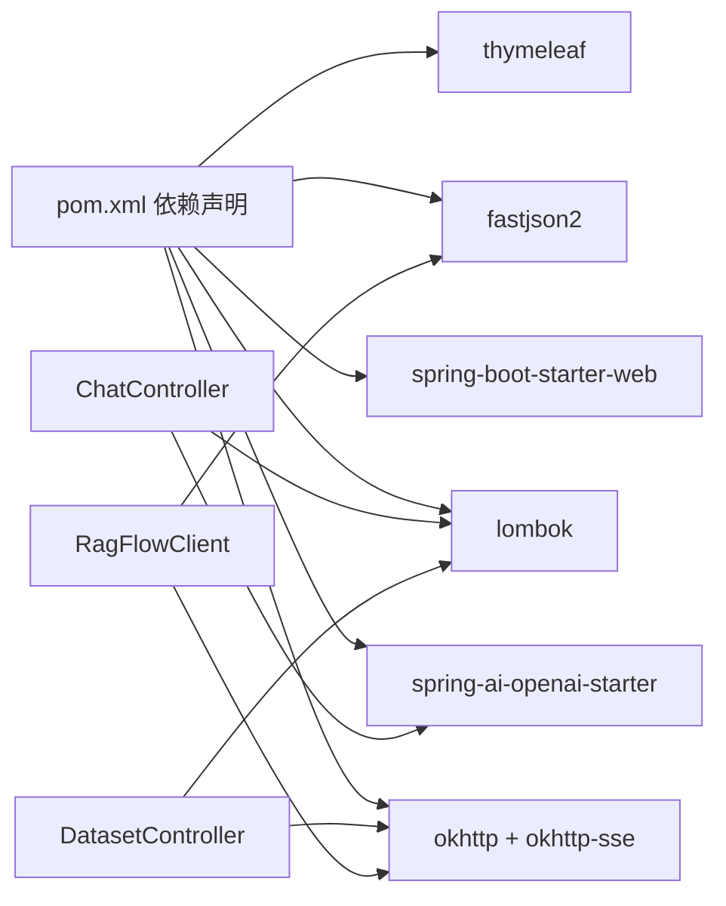
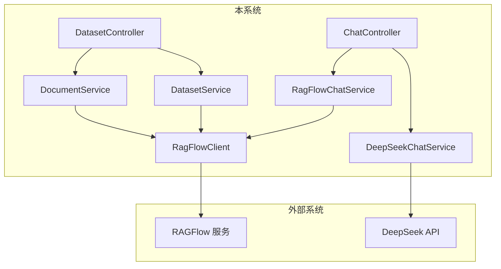
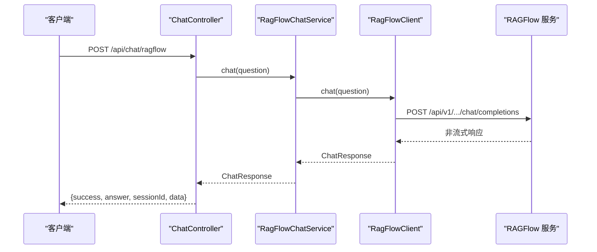

# 系统架构

<cite>
**本文引用的文件**
- [DeepSeekRagFlowApplication.java](file://src/main/java/org/wiki/DeepSeekRagFlowApplication.java)
- [ChatController.java](file://src/main/java/org/wiki/controller/ChatController.java)
- [DatasetController.java](file://src/main/java/org/wiki/controller/DatasetController.java)
- [PageController.java](file://src/main/java/org/wiki/controller/PageController.java)
- [RagFlowChatService.java](file://src/main/java/org/wiki/service/RagFlowChatService.java)
- [DeepSeekChatService.java](file://src/main/java/org/wiki/service/DeepSeekChatService.java)
- [RagFlowClient.java](file://src/main/java/org/wiki/client/RagFlowClient.java)
- [RagFlowProperties.java](file://src/main/java/org/wiki/config/RagFlowProperties.java)
- [WebConfig.java](file://src/main/java/org/wiki/config/WebConfig.java)
- [GlobalExceptionHandler.java](file://src/main/java/org/wiki/config/GlobalExceptionHandler.java)
- [ChatHistoryService.java](file://src/main/java/org/wiki/service/ChatHistoryService.java)
- [DatasetService.java](file://src/main/java/org/wiki/service/DatasetService.java)
- [DocumentService.java](file://src/main/java/org/wiki/service/DocumentService.java)
- [ChatRequest.java](file://src/main/java/org/wiki/model/ChatRequest.java)
- [ChatResponse.java](file://src/main/java/org/wiki/model/ChatResponse.java)
- [Dataset.java](file://src/main/java/org/wiki/model/Dataset.java)
- [Document.java](file://src/main/java/org/wiki/model/Document.java)
- [application.yml](file://src/main/resources/application.yml)
- [pom.xml](file://pom.xml)
</cite>

## 目录
1. [引言](#引言)
2. [项目结构](#项目结构)
3. [核心组件](#核心组件)
4. [架构总览](#架构总览)
5. [详细组件分析](#详细组件分析)
6. [依赖分析](#依赖分析)
7. [性能考量](#性能考量)
8. [故障排查指南](#故障排查指南)
9. [结论](#结论)
10. [附录](#附录)

## 引言
本项目基于 Spring Boot 构建，集成 DeepSeek 大模型与 RAGFlow 知识库系统，提供三种对话模式：RAGFlow 独立问答、DeepSeek 直连问答、以及“DeepSeek + RAG 增强”问答。系统采用经典的 MVC 分层架构，清晰划分控制器层、服务层、客户端层与配置层；同时通过模型对象封装数据结构，统一对外 API 响应格式，便于前端消费与扩展。

## 项目结构
系统采用按层次与功能分层的组织方式：
- 应用入口：启动类负责应用初始化与容器启动
- 控制器层：暴露 REST API，处理 HTTP 请求与响应
- 服务层：封装业务逻辑，协调外部调用与内部状态
- 客户端层：封装对 RAGFlow 的 HTTP 调用细节
- 配置层：集中管理跨域、全局异常处理与外部配置属性
- 模型层：定义请求/响应与领域对象的数据结构
- 配置文件：应用端口、AI 服务配置、RAGFlow 参数等

图表来源
- [DeepSeekRagFlowApplication.java:1-12](file://src/main/java/org/wiki/DeepSeekRagFlowApplication.java#L1-L12)
- [ChatController.java:1-276](file://src/main/java/org/wiki/controller/ChatController.java#L1-L276)
- [DatasetController.java:1-197](file://src/main/java/org/wiki/controller/DatasetController.java#L1-L197)
- [PageController.java:1-30](file://src/main/java/org/wiki/controller/PageController.java#L1-L30)
- [RagFlowChatService.java:1-84](file://src/main/java/org/wiki/service/RagFlowChatService.java#L1-L84)
- [DeepSeekChatService.java:1-125](file://src/main/java/org/wiki/service/DeepSeekChatService.java#L1-L125)
- [ChatHistoryService.java:1-88](file://src/main/java/org/wiki/service/ChatHistoryService.java#L1-L88)
- [DatasetService.java:1-128](file://src/main/java/org/wiki/service/DatasetService.java#L1-L128)
- [DocumentService.java:1-98](file://src/main/java/org/wiki/service/DocumentService.java#L1-L98)
- [RagFlowClient.java:1-231](file://src/main/java/org/wiki/client/RagFlowClient.java#L1-L231)
- [RagFlowProperties.java:1-32](file://src/main/java/org/wiki/config/RagFlowProperties.java#L1-L32)
- [WebConfig.java:1-23](file://src/main/java/org/wiki/config/WebConfig.java#L1-L23)
- [GlobalExceptionHandler.java:1-46](file://src/main/java/org/wiki/config/GlobalExceptionHandler.java#L1-L46)
- [ChatRequest.java:1-59](file://src/main/java/org/wiki/model/ChatRequest.java#L1-L59)
- [ChatResponse.java:1-52](file://src/main/java/org/wiki/model/ChatResponse.java#L1-L52)
- [Dataset.java:1-33](file://src/main/java/org/wiki/model/Dataset.java#L1-L33)
- [Document.java:1-24](file://src/main/java/org/wiki/model/Document.java#L1-L24)

章节来源
- [pom.xml:1-102](file://pom.xml#L1-L102)
- [application.yml:1-27](file://src/main/resources/application.yml#L1-L27)

## 核心组件
- 应用入口：负责启动 Spring Boot 应用，装配各组件
- 控制器层：提供对话与知识库管理的 REST API，处理会话历史与流式输出
- 服务层：封装 RAGFlow 与 DeepSeek 的调用细节，提供统一的业务方法
- 客户端层：基于 OkHttp 实现 RAGFlow 的 HTTP 客户端，支持流式与非流式
- 配置层：集中管理跨域、全局异常处理与外部服务参数
- 模型层：定义请求/响应与领域对象，确保前后端契约一致

章节来源
- [DeepSeekRagFlowApplication.java:1-12](file://src/main/java/org/wiki/DeepSeekRagFlowApplication.java#L1-L12)
- [ChatController.java:1-276](file://src/main/java/org/wiki/controller/ChatController.java#L1-L276)
- [DatasetController.java:1-197](file://src/main/java/org/wiki/controller/DatasetController.java#L1-L197)
- [RagFlowChatService.java:1-84](file://src/main/java/org/wiki/service/RagFlowChatService.java#L1-L84)
- [DeepSeekChatService.java:1-125](file://src/main/java/org/wiki/service/DeepSeekChatService.java#L1-L125)
- [RagFlowClient.java:1-231](file://src/main/java/org/wiki/client/RagFlowClient.java#L1-L231)
- [RagFlowProperties.java:1-32](file://src/main/java/org/wiki/config/RagFlowProperties.java#L1-L32)
- [WebConfig.java:1-23](file://src/main/java/org/wiki/config/WebConfig.java#L1-L23)
- [GlobalExceptionHandler.java:1-46](file://src/main/java/org/wiki/config/GlobalExceptionHandler.java#L1-L46)
- [ChatHistoryService.java:1-88](file://src/main/java/org/wiki/service/ChatHistoryService.java#L1-L88)
- [DatasetService.java:1-128](file://src/main/java/org/wiki/service/DatasetService.java#L1-L128)
- [DocumentService.java:1-98](file://src/main/java/org/wiki/service/DocumentService.java#L1-L98)
- [ChatRequest.java:1-59](file://src/main/java/org/wiki/model/ChatRequest.java#L1-L59)
- [ChatResponse.java:1-52](file://src/main/java/org/wiki/model/ChatResponse.java#L1-L52)
- [Dataset.java:1-33](file://src/main/java/org/wiki/model/Dataset.java#L1-L33)
- [Document.java:1-24](file://src/main/java/org/wiki/model/Document.java#L1-L24)

## 架构总览
系统采用 MVC 分层与“服务+客户端”的解耦设计：
- 控制器层：接收 HTTP 请求，编排服务层方法，处理会话与流式输出
- 服务层：封装业务规则与外部调用，屏蔽协议差异
- 客户端层：统一 RAGFlow HTTP 访问，支持 SSE 流式
- 配置层：集中管理跨域、异常处理与外部服务参数
- 模型层：定义请求/响应与领域对象，保证契约稳定

图表来源
- [ChatController.java:1-276](file://src/main/java/org/wiki/controller/ChatController.java#L1-L276)
- [DatasetController.java:1-197](file://src/main/java/org/wiki/controller/DatasetController.java#L1-L197)
- [RagFlowChatService.java:1-84](file://src/main/java/org/wiki/service/RagFlowChatService.java#L1-L84)
- [DeepSeekChatService.java:1-125](file://src/main/java/org/wiki/service/DeepSeekChatService.java#L1-L125)
- [ChatHistoryService.java:1-88](file://src/main/java/org/wiki/service/ChatHistoryService.java#L1-L88)
- [DatasetService.java:1-128](file://src/main/java/org/wiki/service/DatasetService.java#L1-L128)
- [DocumentService.java:1-98](file://src/main/java/org/wiki/service/DocumentService.java#L1-L98)
- [RagFlowClient.java:1-231](file://src/main/java/org/wiki/client/RagFlowClient.java#L1-L231)
- [RagFlowProperties.java:1-32](file://src/main/java/org/wiki/config/RagFlowProperties.java#L1-L32)
- [WebConfig.java:1-23](file://src/main/java/org/wiki/config/WebConfig.java#L1-L23)
- [GlobalExceptionHandler.java:1-46](file://src/main/java/org/wiki/config/GlobalExceptionHandler.java#L1-L46)

## 详细组件分析

### 控制器层
- ChatController：提供三种对话模式与会话历史管理，支持非流式与 SSE 流式输出
- DatasetController：提供知识库 CRUD、文档上传/解析/删除等操作
- PageController：提供静态页面路由，用于前端模板渲染

图表来源
- [ChatController.java:1-276](file://src/main/java/org/wiki/controller/ChatController.java#L1-L276)
- [DatasetController.java:1-197](file://src/main/java/org/wiki/controller/DatasetController.java#L1-L197)
- [PageController.java:1-30](file://src/main/java/org/wiki/controller/PageController.java#L1-L30)

章节来源
- [ChatController.java:1-276](file://src/main/java/org/wiki/controller/ChatController.java#L1-L276)
- [DatasetController.java:1-197](file://src/main/java/org/wiki/controller/DatasetController.java#L1-L197)
- [PageController.java:1-30](file://src/main/java/org/wiki/controller/PageController.java#L1-L30)

### 服务层
- RagFlowChatService：封装 RAGFlow 对话调用，支持非流式与 SSE 流式，提取回答文本
- DeepSeekChatService：基于 Spring AI 的 ChatClient，支持纯对话、RAG 增强对话与流式输出
- ChatHistoryService：基于内存的会话消息存储，支持创建、查询、清理与消息上限控制
- DatasetService：封装 RAGFlow 知识库管理 API，统一错误处理
- DocumentService：封装文档上传、列出、删除与解析执行

图表来源
- [RagFlowChatService.java:1-84](file://src/main/java/org/wiki/service/RagFlowChatService.java#L1-L84)
- [DeepSeekChatService.java:1-125](file://src/main/java/org/wiki/service/DeepSeekChatService.java#L1-L125)
- [ChatHistoryService.java:1-88](file://src/main/java/org/wiki/service/ChatHistoryService.java#L1-L88)
- [DatasetService.java:1-128](file://src/main/java/org/wiki/service/DatasetService.java#L1-L128)
- [DocumentService.java:1-98](file://src/main/java/org/wiki/service/DocumentService.java#L1-L98)
- [RagFlowClient.java:1-231](file://src/main/java/org/wiki/client/RagFlowClient.java#L1-L231)

章节来源
- [RagFlowChatService.java:1-84](file://src/main/java/org/wiki/service/RagFlowChatService.java#L1-L84)
- [DeepSeekChatService.java:1-125](file://src/main/java/org/wiki/service/DeepSeekChatService.java#L1-L125)
- [ChatHistoryService.java:1-88](file://src/main/java/org/wiki/service/ChatHistoryService.java#L1-L88)
- [DatasetService.java:1-128](file://src/main/java/org/wiki/service/DatasetService.java#L1-L128)
- [DocumentService.java:1-98](file://src/main/java/org/wiki/service/DocumentService.java#L1-L98)

### 客户端层
- RagFlowClient：基于 OkHttp 的 HTTP 客户端，封装 GET/POST/PUT/DELETE 与 SSE 流式读取，统一鉴权头与超时设置

图表来源
- [RagFlowClient.java:1-231](file://src/main/java/org/wiki/client/RagFlowClient.java#L1-L231)
- [RagFlowProperties.java:1-32](file://src/main/java/org/wiki/config/RagFlowProperties.java#L1-L32)

章节来源
- [RagFlowClient.java:1-231](file://src/main/java/org/wiki/client/RagFlowClient.java#L1-L231)
- [RagFlowProperties.java:1-32](file://src/main/java/org/wiki/config/RagFlowProperties.java#L1-L32)

### 配置层
- RagFlowProperties：集中管理 RAGFlow 服务地址、API Key、聊天助手 ID 与超时时间
- WebConfig：启用 CORS，允许 /api/** 路径跨域访问
- GlobalExceptionHandler：统一异常处理，区分 IO 与通用异常并返回标准响应

图表来源
- [WebConfig.java:1-23](file://src/main/java/org/wiki/config/WebConfig.java#L1-L23)
- [GlobalExceptionHandler.java:1-46](file://src/main/java/org/wiki/config/GlobalExceptionHandler.java#L1-L46)
- [RagFlowProperties.java:1-32](file://src/main/java/org/wiki/config/RagFlowProperties.java#L1-L32)

章节来源
- [WebConfig.java:1-23](file://src/main/java/org/wiki/config/WebConfig.java#L1-L23)
- [GlobalExceptionHandler.java:1-46](file://src/main/java/org/wiki/config/GlobalExceptionHandler.java#L1-L46)
- [RagFlowProperties.java:1-32](file://src/main/java/org/wiki/config/RagFlowProperties.java#L1-L32)

### 模型层
- ChatRequest/ChatResponse：封装 RAGFlow 对话请求与响应结构
- Dataset/Document：封装知识库与文档领域对象

图表来源
- [ChatRequest.java:1-59](file://src/main/java/org/wiki/model/ChatRequest.java#L1-L59)
- [ChatResponse.java:1-52](file://src/main/java/org/wiki/model/ChatResponse.java#L1-L52)
- [Dataset.java:1-33](file://src/main/java/org/wiki/model/Dataset.java#L1-L33)
- [Document.java:1-24](file://src/main/java/org/wiki/model/Document.java#L1-L24)

章节来源
- [ChatRequest.java:1-59](file://src/main/java/org/wiki/model/ChatRequest.java#L1-L59)
- [ChatResponse.java:1-52](file://src/main/java/org/wiki/model/ChatResponse.java#L1-L52)
- [Dataset.java:1-33](file://src/main/java/org/wiki/model/Dataset.java#L1-L33)
- [Document.java:1-24](file://src/main/java/org/wiki/model/Document.java#L1-L24)

## 依赖分析
- 外部依赖：Spring Boot Web、Spring AI OpenAI 兼容层、OkHttp 与 SSE、FastJSON2、Lombok、Thymeleaf
- 组件耦合：控制器依赖服务；服务依赖客户端；客户端依赖配置；模型独立，仅被服务与客户端使用
- 循环依赖：未发现循环依赖迹象

图表来源
- [pom.xml:1-102](file://pom.xml#L1-L102)
- [ChatController.java:1-276](file://src/main/java/org/wiki/controller/ChatController.java#L1-L276)
- [DatasetController.java:1-197](file://src/main/java/org/wiki/controller/DatasetController.java#L1-L197)
- [RagFlowClient.java:1-231](file://src/main/java/org/wiki/client/RagFlowClient.java#L1-L231)

章节来源
- [pom.xml:1-102](file://pom.xml#L1-L102)

## 性能考量
- 流式输出：RAGFlow 与 DeepSeek 均支持流式输出，降低首字节延迟，提升用户体验
- 线程池：控制器中为 SSE 流式场景提供缓存线程池，避免阻塞主线程
- 超时控制：RAGFlow 客户端基于配置设置连接/读/写超时，防止长时间阻塞
- 内存会话：会话消息基于并发 Map 存储并限制最大消息数，避免内存无限增长
- 建议优化：
  - 生产环境将会话存储替换为持久化存储（如 Redis/数据库）
  - 对外部 API 调用增加熔断与重试策略
  - 对大文档解析与向量化过程异步化并引入队列

## 故障排查指南
- 全局异常处理：捕获通用异常与 IO 异常，返回标准 JSON 结构与合理状态码
- 常见问题定位：
  - RAGFlow 服务不可达或鉴权失败：检查配置项与网络连通性
  - DeepSeek API Key 或模型配置错误：核对 application.yml 中的 OpenAI 兼容配置
  - 跨域问题：确认 WebConfig 中 CORS 规则是否覆盖 /api/** 路径
- 日志级别：开发阶段可提高日志级别以便快速定位问题

章节来源
- [GlobalExceptionHandler.java:1-46](file://src/main/java/org/wiki/config/GlobalExceptionHandler.java#L1-L46)
- [WebConfig.java:1-23](file://src/main/java/org/wiki/config/WebConfig.java#L1-L23)
- [application.yml:1-27](file://src/main/resources/application.yml#L1-L27)

## 结论
本系统以清晰的 MVC 分层与“服务+客户端”解耦为核心，结合 Spring AI 与 OkHttp，实现了对 RAGFlow 与 DeepSeek 的统一接入。通过模型对象与统一响应格式，提升了前后端协作效率。建议在生产环境中增强持久化、限流熔断与可观测性能力，以进一步提升可扩展性与可维护性。

## 附录
- 系统边界图（概念示意）

- 关键流程示例：RAGFlow 非流式对话

图表来源
- [ChatController.java:1-276](file://src/main/java/org/wiki/controller/ChatController.java#L1-L276)
- [RagFlowChatService.java:1-84](file://src/main/java/org/wiki/service/RagFlowChatService.java#L1-L84)
- [RagFlowClient.java:1-231](file://src/main/java/org/wiki/client/RagFlowClient.java#L1-L231)