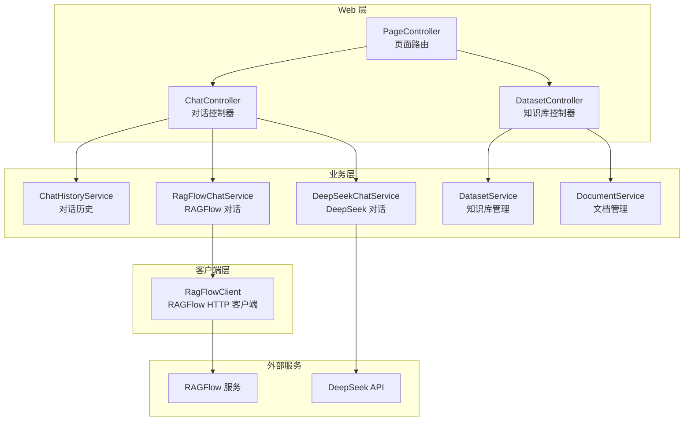
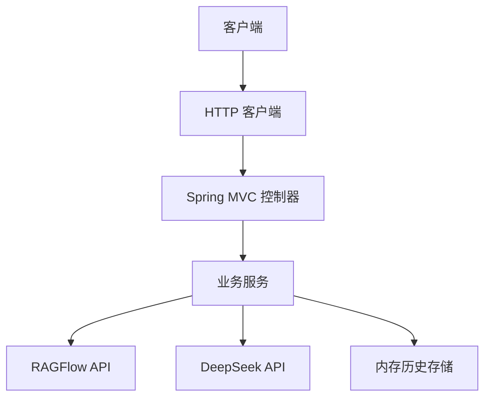
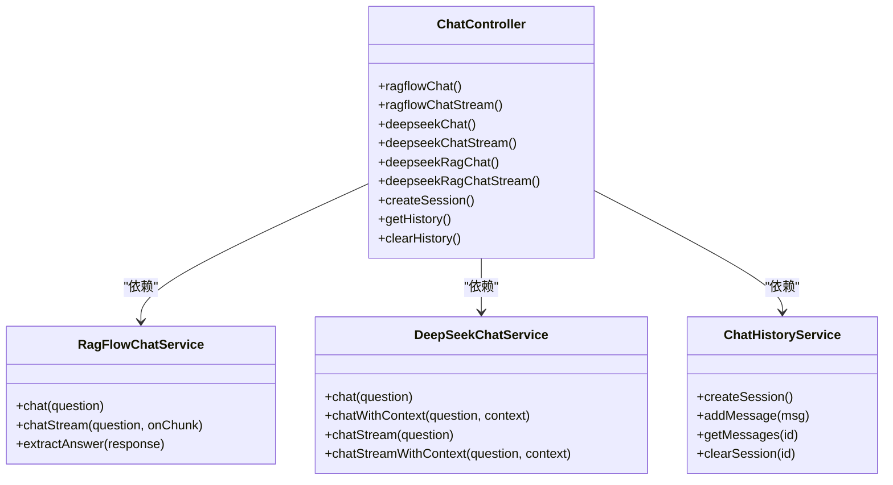
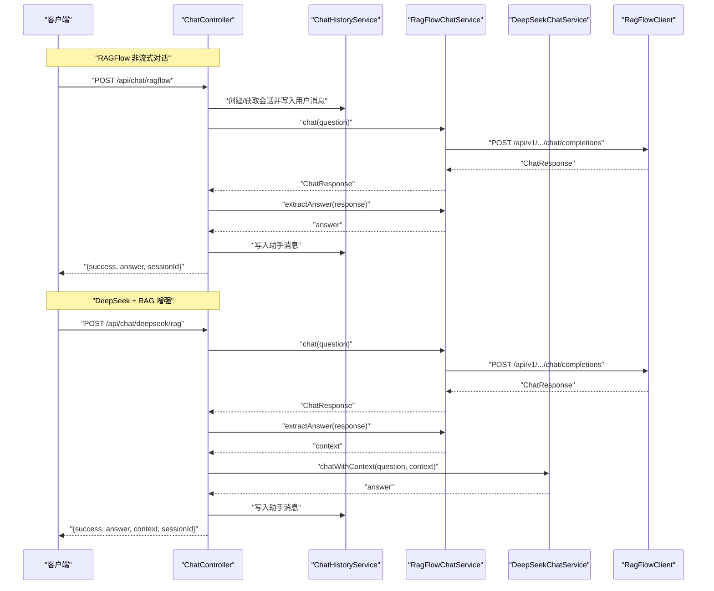
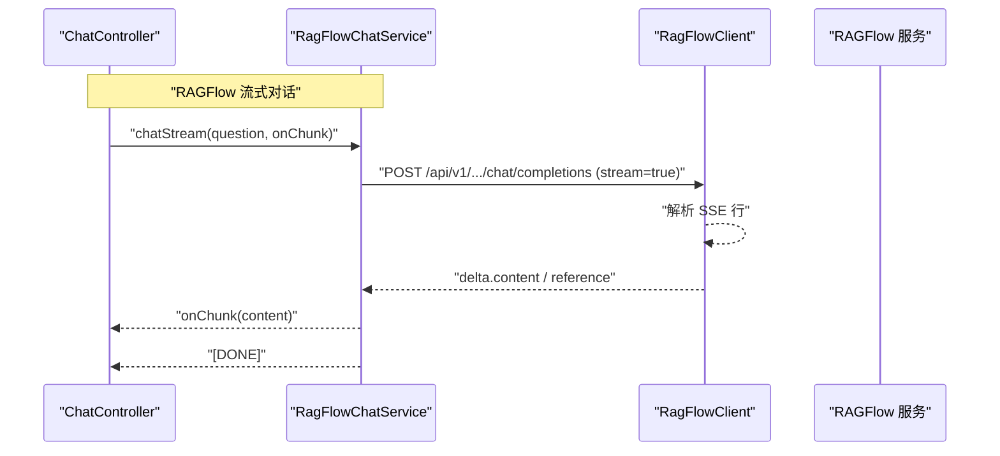
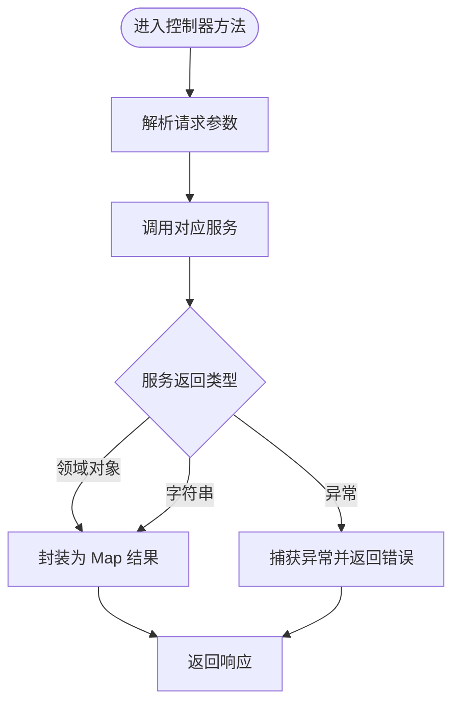
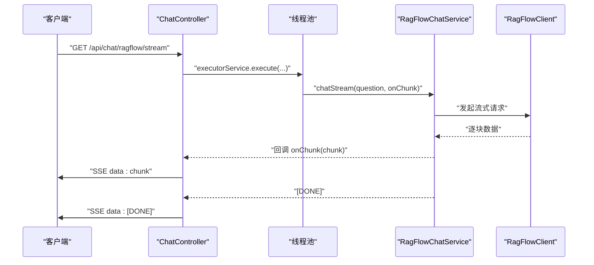
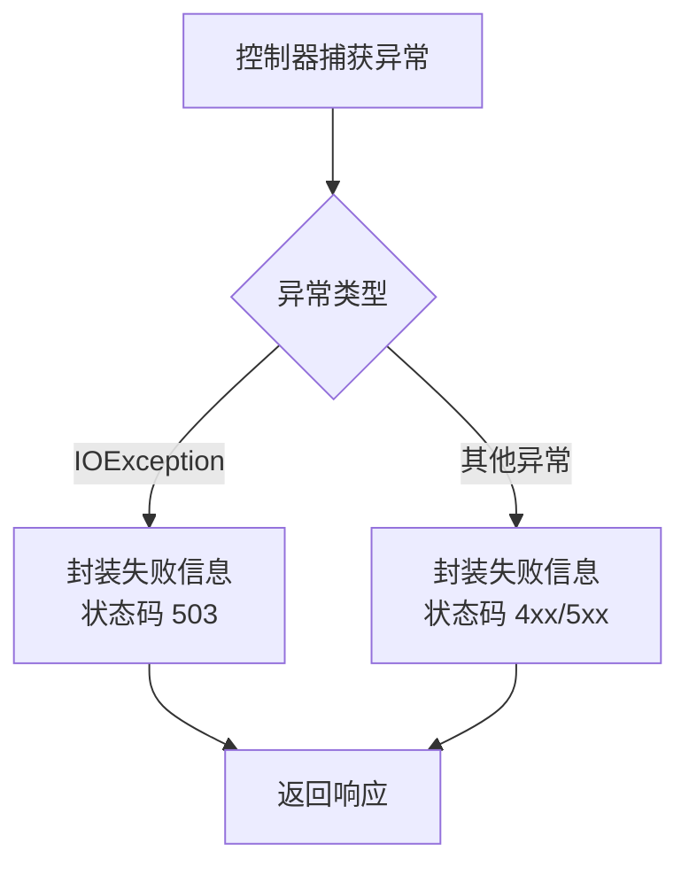
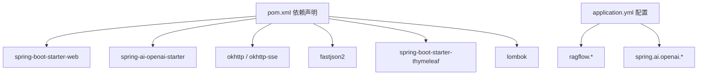

# 组件交互模式

<cite>
**本文引用的文件**
- [DeepSeekRagFlowApplication.java](file://src/main/java/org/wiki/DeepSeekRagFlowApplication.java)
- [ChatController.java](file://src/main/java/org/wiki/controller/ChatController.java)
- [DatasetController.java](file://src/main/java/org/wiki/controller/DatasetController.java)
- [PageController.java](file://src/main/java/org/wiki/controller/PageController.java)
- [RagFlowChatService.java](file://src/main/java/org/wiki/service/RagFlowChatService.java)
- [DeepSeekChatService.java](file://src/main/java/org/wiki/service/DeepSeekChatService.java)
- [RagFlowClient.java](file://src/main/java/org/wiki/client/RagFlowClient.java)
- [ChatHistoryService.java](file://src/main/java/org/wiki/service/ChatHistoryService.java)
- [DatasetService.java](file://src/main/java/org/wiki/service/DatasetService.java)
- [DocumentService.java](file://src/main/java/org/wiki/service/DocumentService.java)
- [GlobalExceptionHandler.java](file://src/main/java/org/wiki/config/GlobalExceptionHandler.java)
- [RagFlowProperties.java](file://src/main/java/org/wiki/config/RagFlowProperties.java)
- [ChatMessage.java](file://src/main/java/org/wiki/model/ChatMessage.java)
- [ChatResponse.java](file://src/main/java/org/wiki/model/ChatResponse.java)
- [Dataset.java](file://src/main/java/org/wiki/model/Dataset.java)
- [application.yml](file://src/main/resources/application.yml)
- [pom.xml](file://pom.xml)
</cite>

## 目录
1. [简介](#简介)
2. [项目结构](#项目结构)
3. [核心组件](#核心组件)
4. [架构总览](#架构总览)
5. [详细组件分析](#详细组件分析)
6. [依赖分析](#依赖分析)
7. [性能考虑](#性能考虑)
8. [故障排查指南](#故障排查指南)
9. [结论](#结论)
10. [附录](#附录)

## 简介
本文件聚焦于系统中组件之间的交互关系与通信机制，涵盖以下方面：
- 控制器与服务层的依赖注入与调用关系
- 服务层内部协作模式（RAGFlow、DeepSeek、历史会话）
- 客户端与外部服务（RAGFlow API、DeepSeek API）的交互流程
- 参数传递与返回值处理
- 组件交互时序图与调用链路图
- 异步处理与并发控制
- 错误传播与异常处理

## 项目结构
系统采用典型的分层架构：Web 层（控制器）、业务层（服务）、客户端层（HTTP 客户端）、配置与模型层。前端页面由 Thymeleaf 提供，控制器负责接收请求、协调服务与外部 API，并通过 SSE 或响应体返回结果。

图表来源
- [ChatController.java:30-41](file://src/main/java/org/wiki/controller/ChatController.java#L30-L41)
- [DatasetController.java:27-35](file://src/main/java/org/wiki/controller/DatasetController.java#L27-L35)
- [RagFlowChatService.java:18-24](file://src/main/java/org/wiki/service/RagFlowChatService.java#L18-L24)
- [DeepSeekChatService.java:22-28](file://src/main/java/org/wiki/service/DeepSeekChatService.java#L22-L28)
- [RagFlowClient.java:23-35](file://src/main/java/org/wiki/client/RagFlowClient.java#L23-L35)
- [ChatHistoryService.java:16-21](file://src/main/java/org/wiki/service/ChatHistoryService.java#L16-L21)
- [DatasetService.java:21-27](file://src/main/java/org/wiki/service/DatasetService.java#L21-L27)
- [DocumentService.java:21-27](file://src/main/java/org/wiki/service/DocumentService.java#L21-L27)

章节来源
- [application.yml:1-27](file://src/main/resources/application.yml#L1-L27)
- [pom.xml:25-88](file://pom.xml#L25-L88)

## 核心组件
- 控制器层：负责接收 HTTP 请求、参数校验、调用服务层、组装响应；支持同步与 SSE 流式输出。
- 服务层：封装业务逻辑，协调外部 API；包含 RAGFlow 对话服务、DeepSeek 对话服务、历史会话服务、知识库与文档管理服务。
- 客户端层：封装 RAGFlow HTTP 客户端，统一处理认证、超时、请求与响应。
- 配置与模型：读取应用配置（RAGFlow 与 DeepSeek），定义请求/响应模型。

章节来源
- [ChatController.java:30-41](file://src/main/java/org/wiki/controller/ChatController.java#L30-L41)
- [RagFlowChatService.java:18-24](file://src/main/java/org/wiki/service/RagFlowChatService.java#L18-L24)
- [DeepSeekChatService.java:22-28](file://src/main/java/org/wiki/service/DeepSeekChatService.java#L22-L28)
- [RagFlowClient.java:23-35](file://src/main/java/org/wiki/client/RagFlowClient.java#L23-L35)
- [ChatHistoryService.java:16-21](file://src/main/java/org/wiki/service/ChatHistoryService.java#L16-L21)
- [DatasetService.java:21-27](file://src/main/java/org/wiki/service/DatasetService.java#L21-L27)
- [DocumentService.java:21-27](file://src/main/java/org/wiki/service/DocumentService.java#L21-L27)
- [RagFlowProperties.java:10-31](file://src/main/java/org/wiki/config/RagFlowProperties.java#L10-L31)
- [ChatMessage.java:17-81](file://src/main/java/org/wiki/model/ChatMessage.java#L17-L81)
- [ChatResponse.java:16-51](file://src/main/java/org/wiki/model/ChatResponse.java#L16-L51)
- [Dataset.java:13-32](file://src/main/java/org/wiki/model/Dataset.java#L13-L32)

## 架构总览
系统通过 Spring MVC 暴露 REST 接口，控制器作为入口协调服务层；服务层通过客户端访问外部 API。DeepSeek 通过 Spring AI 的 OpenAI 兼容适配器直接调用；RAGFlow 通过自定义 HTTP 客户端调用其 OpenAI 兼容接口。SSE 用于流式输出，ExecutorService 用于异步处理。

图表来源
- [ChatController.java:30-41](file://src/main/java/org/wiki/controller/ChatController.java#L30-L41)
- [RagFlowClient.java:23-35](file://src/main/java/org/wiki/client/RagFlowClient.java#L23-L35)
- [DeepSeekChatService.java:22-28](file://src/main/java/org/wiki/service/DeepSeekChatService.java#L22-L28)
- [ChatHistoryService.java:16-21](file://src/main/java/org/wiki/service/ChatHistoryService.java#L16-L21)

## 详细组件分析

### 控制器与服务层的依赖注入与调用关系
- 控制器通过构造函数注入所需服务，确保线程安全与可测试性。
- 控制器负责参数解析、异常捕获与响应封装；服务层负责具体业务与外部调用。
- 历史会话服务贯穿对话流程，用于记录用户与助手消息。

图表来源
- [ChatController.java:30-41](file://src/main/java/org/wiki/controller/ChatController.java#L30-L41)
- [RagFlowChatService.java:18-24](file://src/main/java/org/wiki/service/RagFlowChatService.java#L18-L24)
- [DeepSeekChatService.java:22-28](file://src/main/java/org/wiki/service/DeepSeekChatService.java#L22-L28)
- [ChatHistoryService.java:16-21](file://src/main/java/org/wiki/service/ChatHistoryService.java#L16-L21)

章节来源
- [ChatController.java:30-41](file://src/main/java/org/wiki/controller/ChatController.java#L30-L41)
- [ChatHistoryService.java:31-43](file://src/main/java/org/wiki/service/ChatHistoryService.java#L31-L43)

### 服务层内部协作模式
- RAGFlow 模式：控制器调用 RagFlowChatService，后者通过 RagFlowClient 访问 RAGFlow API，返回非流式或流式结果。
- DeepSeek 模式：控制器调用 DeepSeekChatService，后者通过 Spring AI 的 ChatClient 直接调用 DeepSeek API，支持纯对话与流式输出。
- RAG 增强模式：先调用 RagFlowChatService 获取上下文，再调用 DeepSeekChatService 的带上下文对话方法。

图表来源
- [ChatController.java:51-76](file://src/main/java/org/wiki/controller/ChatController.java#L51-L76)
- [ChatController.java:148-174](file://src/main/java/org/wiki/controller/ChatController.java#L148-L174)
- [RagFlowChatService.java:34-41](file://src/main/java/org/wiki/service/RagFlowChatService.java#L34-L41)
- [RagFlowChatService.java:77-82](file://src/main/java/org/wiki/service/RagFlowChatService.java#L77-L82)
- [RagFlowClient.java:135-148](file://src/main/java/org/wiki/client/RagFlowClient.java#L135-L148)
- [DeepSeekChatService.java:54-78](file://src/main/java/org/wiki/service/DeepSeekChatService.java#L54-L78)

章节来源
- [ChatController.java:51-76](file://src/main/java/org/wiki/controller/ChatController.java#L51-L76)
- [ChatController.java:148-174](file://src/main/java/org/wiki/controller/ChatController.java#L148-L174)
- [RagFlowChatService.java:34-41](file://src/main/java/org/wiki/service/RagFlowChatService.java#L34-L41)
- [RagFlowChatService.java:77-82](file://src/main/java/org/wiki/service/RagFlowChatService.java#L77-L82)
- [DeepSeekChatService.java:54-78](file://src/main/java/org/wiki/service/DeepSeekChatService.java#L54-L78)

### 客户端与外部服务交互模式
- RAGFlow API：通过 RagFlowClient 发起 OpenAI 兼容接口请求，支持非流式与流式两种模式；流式模式解析 SSE 数据块并回调上层。
- DeepSeek API：通过 Spring AI 的 ChatClient 与 OpenAI 兼容接口对接，支持纯对话与带上下文对话，以及原生 Flux 流式输出。

图表来源
- [ChatController.java:85-107](file://src/main/java/org/wiki/controller/ChatController.java#L85-L107)
- [RagFlowChatService.java:50-72](file://src/main/java/org/wiki/service/RagFlowChatService.java#L50-L72)
- [RagFlowClient.java:154-200](file://src/main/java/org/wiki/client/RagFlowClient.java#L154-L200)

章节来源
- [RagFlowClient.java:135-148](file://src/main/java/org/wiki/client/RagFlowClient.java#L135-L148)
- [RagFlowClient.java:154-200](file://src/main/java/org/wiki/client/RagFlowClient.java#L154-L200)
- [application.yml:8-16](file://src/main/resources/application.yml#L8-L16)

### 参数传递与返回值处理
- 控制器接收查询参数或表单参数，封装为 Map 返回；服务层返回领域模型或字符串；客户端层负责序列化与反序列化。
- 历史会话服务维护内存中的消息列表，限制最大消息数，避免无限增长。

图表来源
- [ChatController.java:51-76](file://src/main/java/org/wiki/controller/ChatController.java#L51-L76)
- [ChatController.java:117-137](file://src/main/java/org/wiki/controller/ChatController.java#L117-L137)
- [ChatHistoryService.java:31-43](file://src/main/java/org/wiki/service/ChatHistoryService.java#L31-L43)

章节来源
- [ChatController.java:51-76](file://src/main/java/org/wiki/controller/ChatController.java#L51-L76)
- [ChatController.java:117-137](file://src/main/java/org/wiki/controller/ChatController.java#L117-L137)
- [ChatHistoryService.java:31-43](file://src/main/java/org/wiki/service/ChatHistoryService.java#L31-L43)

### 异步处理与并发控制
- SSE 流式输出使用独立线程池执行，避免阻塞主线程；控制器在异步任务中处理流式数据并通过 SseEmitter 推送。
- 内存历史存储使用并发映射，保证多线程场景下的读写安全。

图表来源
- [ChatController.java:85-107](file://src/main/java/org/wiki/controller/ChatController.java#L85-L107)
- [RagFlowChatService.java:50-72](file://src/main/java/org/wiki/service/RagFlowChatService.java#L50-L72)
- [RagFlowClient.java:154-200](file://src/main/java/org/wiki/client/RagFlowClient.java#L154-L200)

章节来源
- [ChatController.java:35-41](file://src/main/java/org/wiki/controller/ChatController.java#L35-L41)
- [ChatController.java:89-104](file://src/main/java/org/wiki/controller/ChatController.java#L89-L104)
- [ChatController.java:242-271](file://src/main/java/org/wiki/controller/ChatController.java#L242-L271)
- [ChatHistoryService.java](file://src/main/java/org/wiki/service/ChatHistoryService.java#L21)

### 错误传播与异常处理
- 控制器对 IO 异常与通用异常进行捕获并返回统一格式的结果。
- 全局异常处理器根据异常类型设置状态码，IO 异常映射为服务不可用。
- RAGFlow 客户端在 HTTP 不成功时抛出 IO 异常，便于上层统一处理。

图表来源
- [ChatController.java:70-75](file://src/main/java/org/wiki/controller/ChatController.java#L70-L75)
- [ChatController.java:131-136](file://src/main/java/org/wiki/controller/ChatController.java#L131-L136)
- [ChatController.java:168-173](file://src/main/java/org/wiki/controller/ChatController.java#L168-L173)
- [GlobalExceptionHandler.java:20-44](file://src/main/java/org/wiki/config/GlobalExceptionHandler.java#L20-L44)
- [RagFlowClient.java:52-56](file://src/main/java/org/wiki/client/RagFlowClient.java#L52-L56)
- [RagFlowClient.java:177-179](file://src/main/java/org/wiki/client/RagFlowClient.java#L177-L179)

章节来源
- [GlobalExceptionHandler.java:20-44](file://src/main/java/org/wiki/config/GlobalExceptionHandler.java#L20-L44)
- [RagFlowClient.java:52-56](file://src/main/java/org/wiki/client/RagFlowClient.java#L52-L56)
- [RagFlowClient.java:177-179](file://src/main/java/org/wiki/client/RagFlowClient.java#L177-L179)

## 依赖分析
- 外部依赖：Spring Boot Web、Spring AI OpenAI 兼容适配器、OkHttp、FastJSON2、Lombok、Thymeleaf。
- 配置依赖：RAGFlow 与 DeepSeek 的基础地址、API Key、聊天助手 ID、超时等。

图表来源
- [pom.xml:25-88](file://pom.xml#L25-L88)
- [application.yml:8-22](file://src/main/resources/application.yml#L8-L22)

章节来源
- [pom.xml:25-88](file://pom.xml#L25-L88)
- [application.yml:8-22](file://src/main/resources/application.yml#L8-L22)

## 性能考虑
- 流式输出：优先使用 SSE 与 Spring AI 的 Flux，降低延迟与内存占用。
- 线程池：控制器使用缓存线程池处理 SSE 流，避免阻塞请求线程。
- 超时配置：RAGFlow 客户端基于配置设置连接与读取超时，防止长时间阻塞。
- 历史存储：内存存储适合演示，生产环境建议替换为持久化存储并增加容量限制策略。

## 故障排查指南
- RAGFlow 服务不可达：检查基础地址与 API Key 配置，确认网络连通性；查看全局异常处理器返回的 503 错误信息。
- DeepSeek 身份验证失败：确认 OpenAI 兼容接口的 API Key 与基础地址正确。
- SSE 流中断：检查控制器线程池与 SseEmitter 的超时设置，确认回调中未抛出未捕获异常。
- 响应为空或无引用：确认 RAGFlow 的 reference 配置开启，解析逻辑是否正确提取 delta.content 与 reference 字段。

章节来源
- [GlobalExceptionHandler.java:37-44](file://src/main/java/org/wiki/config/GlobalExceptionHandler.java#L37-L44)
- [RagFlowClient.java:30-35](file://src/main/java/org/wiki/client/RagFlowClient.java#L30-L35)
- [application.yml:18-22](file://src/main/resources/application.yml#L18-L22)

## 结论
本系统通过清晰的分层设计与依赖注入，实现了控制器、服务层、客户端与外部服务之间的稳定交互。RAGFlow 与 DeepSeek 的双通道设计满足多种对话模式需求，SSE 与 Spring AI 的结合提供了良好的流式体验。通过全局异常处理与线程池异步化，系统具备较好的健壮性与并发能力。建议在生产环境中引入持久化历史存储与更完善的监控告警体系。

## 附录
- 配置项说明
  - ragflow.base-url：RAGFlow 服务地址
  - ragflow.api-key：RAGFlow API Key
  - ragflow.chat-id：聊天助手 ID
  - ragflow.timeout：请求超时（秒）
  - spring.ai.openai.api-key：DeepSeek API Key
  - spring.ai.openai.base-url：DeepSeek 基础地址
  - spring.ai.openai.chat.options.model：模型名称
  - spring.ai.openai.chat.options.temperature：采样温度
  - spring.ai.openai.chat.options.max-tokens：最大生成长度

章节来源
- [application.yml:8-22](file://src/main/resources/application.yml#L8-L22)
- [RagFlowProperties.java:10-31](file://src/main/java/org/wiki/config/RagFlowProperties.java#L10-L31)