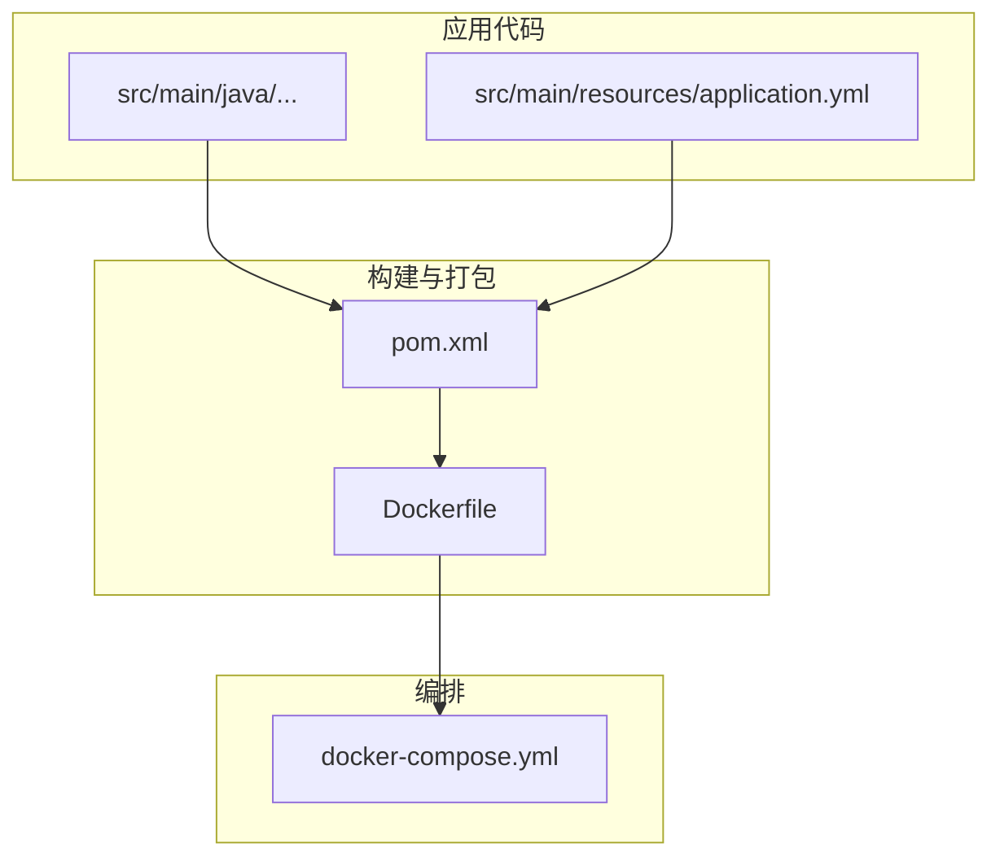
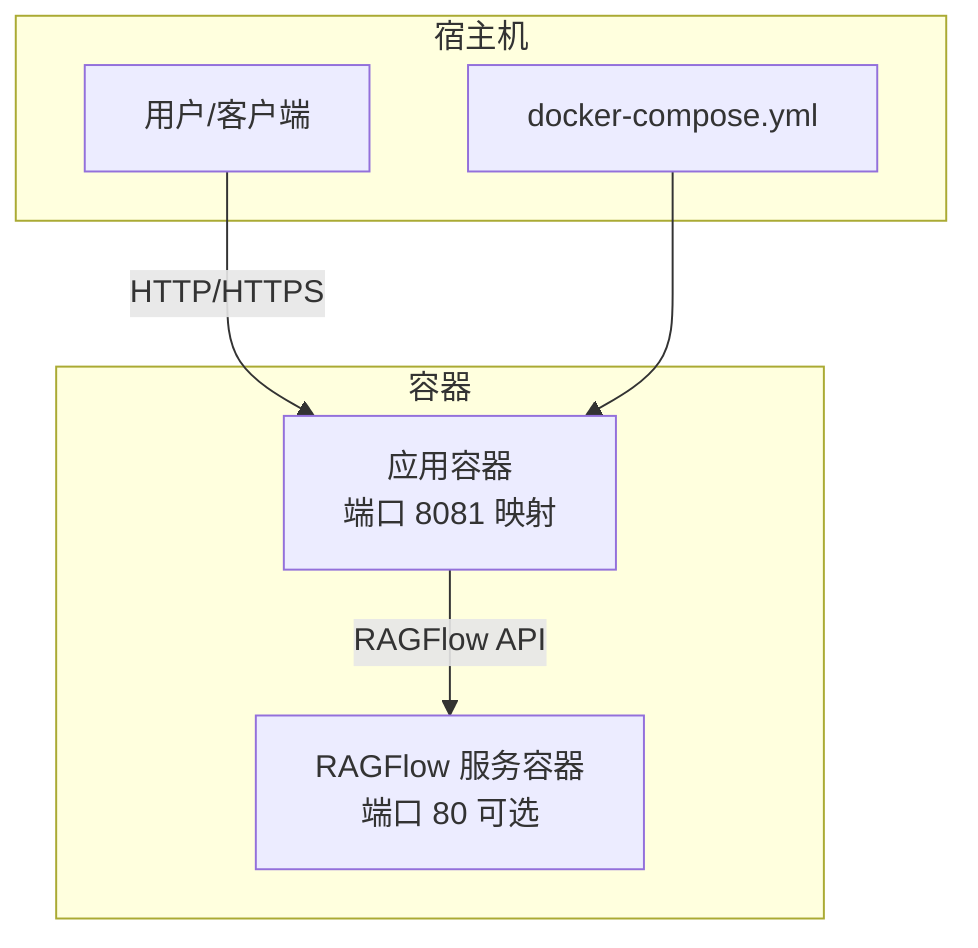
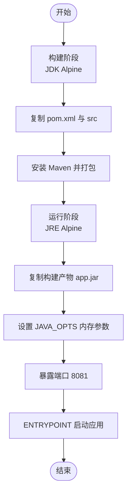
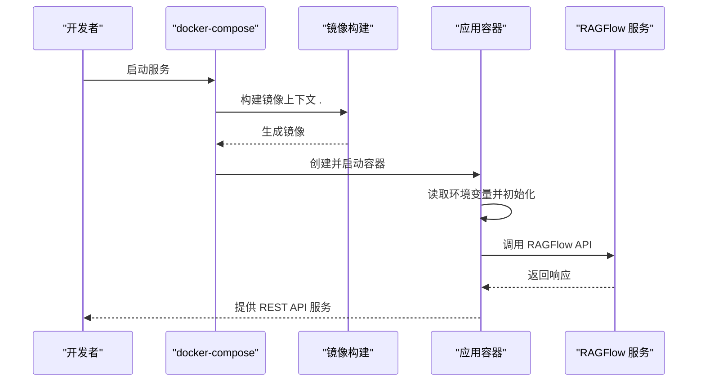
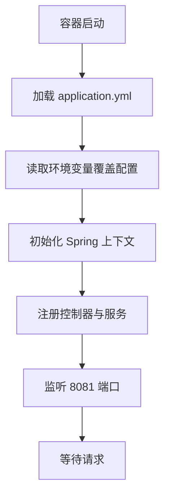
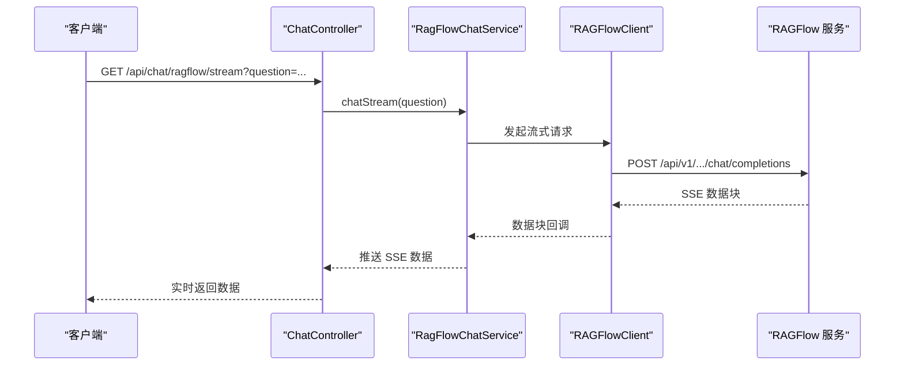
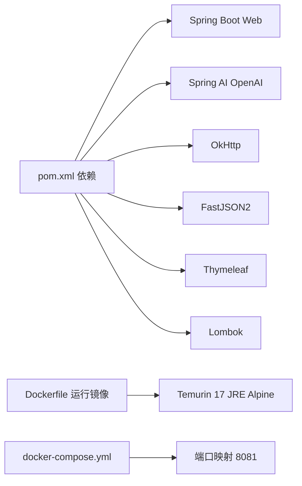

# 容器化部署

<cite>
**本文引用的文件**
- [Dockerfile](file://Dockerfile)
- [docker-compose.yml](file://docker-compose.yml)
- [pom.xml](file://pom.xml)
- [application.yml](file://src/main/resources/application.yml)
- [DeepSeekRagFlowApplication.java](file://src/main/java/org/wiki/DeepSeekRagFlowApplication.java)
- [RagFlowProperties.java](file://src/main/java/org/wiki/config/RagFlowProperties.java)
- [RagFlowClient.java](file://src/main/java/org/wiki/client/RagFlowClient.java)
- [ChatController.java](file://src/main/java/org/wiki/controller/ChatController.java)
- [DatasetController.java](file://src/main/java/org/wiki/controller/DatasetController.java)
</cite>

## 目录
1. [简介](#简介)
2. [项目结构](#项目结构)
3. [核心组件](#核心组件)
4. [架构总览](#架构总览)
5. [详细组件分析](#详细组件分析)
6. [依赖分析](#依赖分析)
7. [性能考虑](#性能考虑)
8. [故障排查指南](#故障排查指南)
9. [结论](#结论)
10. [附录](#附录)

## 简介
本项目是一个基于 Spring Boot 的知识库问答演示应用，支持与 DeepSeek 和 RAGFlow 服务集成。本文档提供完整的容器化部署指南，涵盖 Docker 多阶段构建、docker-compose 编排、镜像参数配置、启动流程、最佳实践、调试方法以及高级编排建议。

## 项目结构
该仓库采用标准的 Maven 工程结构，包含 Java 源码、资源文件、Dockerfile 和 docker-compose 编排文件。核心模块包括：
- 应用入口与配置：Spring Boot 启动类、YAML 配置
- 控制器层：提供聊天与知识库管理的 REST API
- 客户端层：封装对 RAGFlow 的 HTTP 调用
- 构建与打包：Maven 依赖与 Docker 多阶段构建

图表来源
- [Dockerfile:1-15](file://Dockerfile#L1-L15)
- [docker-compose.yml:1-20](file://docker-compose.yml#L1-L20)
- [pom.xml:1-102](file://pom.xml#L1-L102)
- [application.yml:1-27](file://src/main/resources/application.yml#L1-L27)

章节来源
- [Dockerfile:1-15](file://Dockerfile#L1-L15)
- [docker-compose.yml:1-20](file://docker-compose.yml#L1-L20)
- [pom.xml:1-102](file://pom.xml#L1-L102)
- [application.yml:1-27](file://src/main/resources/application.yml#L1-L27)

## 核心组件
- 多阶段 Docker 构建：使用 Alpine Linux 的 JDK 作为构建镜像，JRE 作为运行镜像，减小最终镜像体积
- 端口与环境变量：容器暴露 8081 端口，通过环境变量注入 RAGFlow 与 DeepSeek 的配置
- Spring Boot 配置：应用默认监听 8081 端口，支持日志级别与 RAGFlow 参数的外部化配置
- API 接口：提供聊天（含流式）、知识库管理等 REST 接口，便于容器内访问与外部集成

章节来源
- [Dockerfile:1-15](file://Dockerfile#L1-L15)
- [application.yml:1-27](file://src/main/resources/application.yml#L1-L27)
- [ChatController.java:1-276](file://src/main/java/org/wiki/controller/ChatController.java#L1-L276)
- [DatasetController.java:1-197](file://src/main/java/org/wiki/controller/DatasetController.java#L1-L197)

## 架构总览
下图展示了容器化部署的整体架构：应用容器通过 docker-compose 编排，映射端口并注入环境变量；应用内部通过 RAGFlow 客户端调用外部 RAGFlow 服务。

图表来源
- [docker-compose.yml:1-20](file://docker-compose.yml#L1-L20)
- [RagFlowClient.java:1-231](file://src/main/java/org/wiki/client/RagFlowClient.java#L1-L231)

## 详细组件分析

### Dockerfile 多阶段构建
- 构建阶段（builder）
  - 基础镜像：使用 Eclipse Temurin 17 JDK Alpine
  - 工作目录：/app
  - 依赖复制：复制 pom.xml 与 src 目录
  - 构建命令：安装 Maven 并执行打包（跳过测试）
- 运行阶段
  - 基础镜像：Eclipse Temurin 17 JRE Alpine
  - 工作目录：/app
  - 文件复制：从构建阶段复制 jar 包至 app.jar
  - 环境变量：设置 JVM 内存参数（初始堆 256MB，最大堆 512MB）
  - 端口暴露：8081
  - 入口命令：以 JAVA_OPTS 启动 Spring Boot 应用

图表来源
- [Dockerfile:1-15](file://Dockerfile#L1-L15)

章节来源
- [Dockerfile:1-15](file://Dockerfile#L1-L15)
- [pom.xml:15-23](file://pom.xml#L15-L23)

### docker-compose.yml 配置详解
- 版本：使用 3.8
- 服务定义
  - 构建上下文：当前目录，Dockerfile 指向根目录 Dockerfile
  - 容器名：deepseek-ragflow-demo
  - 端口映射：宿主 8081 -> 容器 8081
  - 环境变量
    - DEEPSEEK API Key：SPRING_AI_OPENAI_API_KEY
    - DEEPSEEK Base URL：SPRING_AI_OPENAI_BASE_URL
    - RAGFlow Base URL：RAGFLOW_BASE_URL（默认 host.docker.internal:80）
    - RAGFlow API Key：RAGFLOW_API_KEY
    - RAGFlow Chat ID：RAGFLOW_CHAT_ID
  - 重启策略：unless-stopped
  - 额外主机：host.docker.internal -> host-gateway，便于容器内访问宿主机

图表来源
- [docker-compose.yml:1-20](file://docker-compose.yml#L1-L20)
- [RagFlowClient.java:1-231](file://src/main/java/org/wiki/client/RagFlowClient.java#L1-L231)

章节来源
- [docker-compose.yml:1-20](file://docker-compose.yml#L1-L20)

### 应用配置与启动流程
- Spring Boot 启动类：应用入口注解启用自动装配
- 端口配置：server.port=8081
- RAGFlow 属性：通过 @ConfigurationProperties 绑定 ragflow.* 前缀
- 启动流程
  - 容器启动后，Spring Boot 加载 application.yml
  - 读取环境变量覆盖默认配置
  - 初始化 RAGFlow 客户端与相关服务
  - 暴露 REST API 供外部调用

图表来源
- [DeepSeekRagFlowApplication.java:1-12](file://src/main/java/org/wiki/DeepSeekRagFlowApplication.java#L1-L12)
- [application.yml:1-27](file://src/main/resources/application.yml#L1-L27)
- [RagFlowProperties.java:1-32](file://src/main/java/org/wiki/config/RagFlowProperties.java#L1-L32)

章节来源
- [DeepSeekRagFlowApplication.java:1-12](file://src/main/java/org/wiki/DeepSeekRagFlowApplication.java#L1-L12)
- [application.yml:1-27](file://src/main/resources/application.yml#L1-L27)
- [RagFlowProperties.java:1-32](file://src/main/java/org/wiki/config/RagFlowProperties.java#L1-L32)

### API 与客户端交互
- 控制器层
  - ChatController：提供 RAGFlow/DeepSeek 对话接口，支持非流式与流式（SSE）
  - DatasetController：提供知识库 CRUD 与文档上传/运行等接口
- 客户端层
  - RagFlowClient：封装 RAGFlow REST API 调用，支持 GET/POST/PUT/DELETE 与 SSE 流式数据处理

图表来源
- [ChatController.java:1-276](file://src/main/java/org/wiki/controller/ChatController.java#L1-L276)
- [RagFlowClient.java:1-231](file://src/main/java/org/wiki/client/RagFlowClient.java#L1-L231)

章节来源
- [ChatController.java:1-276](file://src/main/java/org/wiki/controller/ChatController.java#L1-L276)
- [RagFlowClient.java:1-231](file://src/main/java/org/wiki/client/RagFlowClient.java#L1-L231)

## 依赖分析
- Maven 依赖
  - Spring Boot Web 3.2.0
  - Spring AI OpenAI Starter（兼容 DeepSeek API）
  - Spring AI Tika 文档解析
  - OkHttp 4.12.0（HTTP 客户端）
  - FastJSON2 2.0.53（JSON 处理）
  - Lombok 1.18.34（简化 POJO）
  - Thymeleaf 3.2.0（模板引擎）
- 运行时镜像
  - 基于 Eclipse Temurin 17 JRE Alpine，体积小、启动快
- 网络与端口
  - 容器暴露 8081 端口，compose 映射到宿主 8081
  - RAGFlow 服务可通过 RAGFLOW_BASE_URL 指定，默认指向 host.docker.internal:80

图表来源
- [pom.xml:25-88](file://pom.xml#L25-L88)
- [Dockerfile:7-14](file://Dockerfile#L7-L14)
- [docker-compose.yml:9-11](file://docker-compose.yml#L9-L11)

章节来源
- [pom.xml:25-88](file://pom.xml#L25-L88)
- [Dockerfile:7-14](file://Dockerfile#L7-L14)
- [docker-compose.yml:9-11](file://docker-compose.yml#L9-L11)

## 性能考虑
- 镜像优化
  - 使用 JRE 运行镜像替代 JDK，减少镜像体积与攻击面
  - Alpine 基础镜像进一步压缩体积
- JVM 内存
  - 初始堆 256MB、最大堆 512MB，适合轻量服务；生产可根据负载调整
- 端口与网络
  - 单端口暴露，便于反向代理与负载均衡
- 并发与流式
  - 控制器支持 SSE 流式输出，降低延迟并提升用户体验

章节来源
- [Dockerfile:11-12](file://Dockerfile#L11-L12)
- [ChatController.java:85-107](file://src/main/java/org/wiki/controller/ChatController.java#L85-L107)
- [ChatController.java:223-228](file://src/main/java/org/wiki/controller/ChatController.java#L223-L228)

## 故障排查指南
- 日志查看
  - 应用日志级别为 DEBUG，可在 compose 中通过环境变量或挂载日志目录查看
- Shell 进入
  - 使用 docker exec -it <container> sh 进入容器交互式 shell
- 网络诊断
  - 使用 curl 或浏览器访问 http://localhost:8081/api/chat/ragflow（示例端点）
  - 检查 RAGFLOW_BASE_URL 是否可达，必要时确认 extra_hosts 配置
- 常见问题
  - 端口冲突：修改 compose 中宿主端口映射
  - API Key 错误：确认环境变量是否正确注入
  - RAGFlow 不可用：检查 RAGFLOW_BASE_URL 与防火墙设置

章节来源
- [application.yml:24-27](file://src/main/resources/application.yml#L24-L27)
- [docker-compose.yml:18-19](file://docker-compose.yml#L18-L19)
- [RagFlowClient.java:30-35](file://src/main/java/org/wiki/client/RagFlowClient.java#L30-L35)

## 结论
本项目提供了简洁高效的容器化方案：多阶段 Docker 构建、Alpine 基础镜像、JRE 运行时与最小暴露端口，结合 docker-compose 的环境变量注入，能够快速部署并运行知识库问答服务。通过合理的资源与安全配置，可满足开发与生产场景的基本需求。

## 附录

### 镜像构建参数与说明
- JDK 版本：17（Temurin）
- 运行时：JRE Alpine
- 内存限制：JAVA_OPTS 设置初始堆与最大堆
- 端口暴露：8081
- 入口命令：以 JAVA_OPTS 启动 Spring Boot 应用

章节来源
- [Dockerfile:1-15](file://Dockerfile#L1-L15)

### docker-compose.yml 关键字段说明
- build：指定构建上下文与 Dockerfile
- container_name：容器命名
- ports：端口映射（宿主:容器）
- environment：环境变量注入
- restart：重启策略
- extra_hosts：将 host.docker.internal 解析到宿主机网关

章节来源
- [docker-compose.yml:1-20](file://docker-compose.yml#L1-L20)

### 容器启动流程与健康检查建议
- 启动流程：构建镜像 -> 创建容器 -> 注入环境变量 -> 初始化应用 -> 监听端口
- 健康检查建议：在 compose 中添加 healthcheck 字段，探测 /actuator/health（如启用 Actuator）

章节来源
- [docker-compose.yml:17](file://docker-compose.yml#L17)

### 容器编排高级配置建议
- 负载均衡：使用 Nginx 或反向代理在多个实例间分发请求
- 自动扩缩容：结合 Kubernetes HPA 或 Docker Swarm 服务副本数
- 故障转移：多实例部署 + 健康检查 + 负载均衡器

章节来源
- [ChatController.java:85-107](file://src/main/java/org/wiki/controller/ChatController.java#L85-L107)