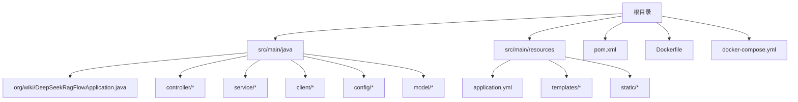
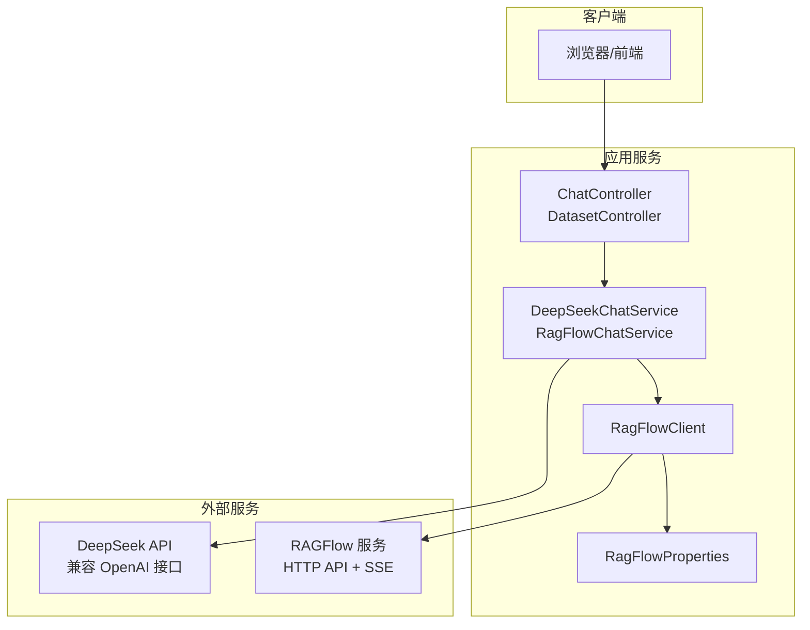
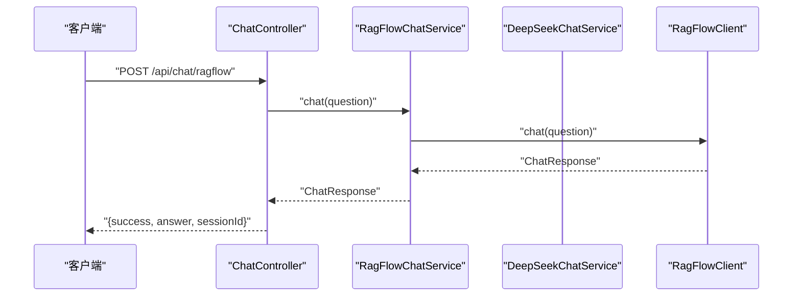
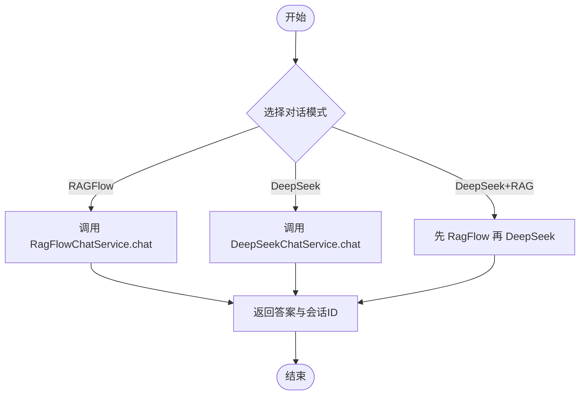
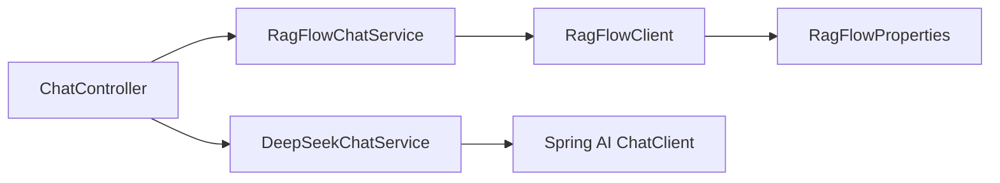

# 本地部署

<cite>
**本文引用的文件**
- [pom.xml](file://pom.xml)
- [application.yml](file://src/main/resources/application.yml)
- [Dockerfile](file://Dockerfile)
- [docker-compose.yml](file://docker-compose.yml)
- [DeepSeekRagFlowApplication.java](file://src/main/java/org/wiki/DeepSeekRagFlowApplication.java)
- [RagFlowProperties.java](file://src/main/java/org/wiki/config/RagFlowProperties.java)
- [WebConfig.java](file://src/main/java/org/wiki/config/WebConfig.java)
- [GlobalExceptionHandler.java](file://src/main/java/org/wiki/config/GlobalExceptionHandler.java)
- [RagFlowClient.java](file://src/main/java/org/wiki/client/RagFlowClient.java)
- [DeepSeekChatService.java](file://src/main/java/org/wiki/service/DeepSeekChatService.java)
- [RagFlowChatService.java](file://src/main/java/org/wiki/service/RagFlowChatService.java)
- [ChatController.java](file://src/main/java/org/wiki/controller/ChatController.java)
- [DatasetController.java](file://src/main/java/org/wiki/controller/DatasetController.java)
- [ChatRequest.java](file://src/main/java/org/wiki/model/ChatRequest.java)
- [ChatResponse.java](file://src/main/java/org/wiki/model/ChatResponse.java)
</cite>

## 目录
1. [简介](#简介)
2. [项目结构](#项目结构)
3. [核心组件](#核心组件)
4. [架构总览](#架构总览)
5. [详细组件分析](#详细组件分析)
6. [依赖分析](#依赖分析)
7. [性能考虑](#性能考虑)
8. [故障排除指南](#故障排除指南)
9. [结论](#结论)
10. [附录](#附录)

## 简介
本指南面向在开发环境中本地部署 DeepSeek + RAGFlow 系统的工程师，覆盖 Maven 构建流程、Java 与 Maven 版本要求、application.yml 配置详解、启动方式（命令行与环境变量）、开发调试技巧以及常见问题排查。系统基于 Spring Boot 3.2.0 与 Spring AI OpenAI Starter，兼容 DeepSeek API；同时通过 OkHttp 调用 RAGFlow HTTP API，并提供 RESTful 控制器与 Thymeleaf 页面。

## 项目结构
项目采用标准 Maven 多模块工程风格，当前子模块为 deepseek-ragflow-demo。核心目录与职责如下：
- src/main/java: 应用入口、控制器、服务、客户端、配置与模型
- src/main/resources: 配置文件 application.yml、模板与静态资源
- pom.xml: 依赖与构建配置
- Dockerfile 与 docker-compose.yml: 容器化与编排

图表来源
- [pom.xml](file://pom.xml)
- [DeepSeekRagFlowApplication.java](file://src/main/java/org/wiki/DeepSeekRagFlowApplication.java)
- [application.yml](file://src/main/resources/application.yml)

章节来源
- [pom.xml](file://pom.xml)
- [application.yml](file://src/main/resources/application.yml)
- [Dockerfile](file://Dockerfile)
- [docker-compose.yml](file://docker-compose.yml)

## 核心组件
- 应用入口与启动
  - 应用入口类负责启动 Spring Boot 应用，绑定主函数入口。
  - 参考路径：[DeepSeekRagFlowApplication.java](file://src/main/java/org/wiki/DeepSeekRagFlowApplication.java)

- 配置与属性绑定
  - RAGFlow 配置属性类，映射 application.yml 中 ragflow.* 前缀。
  - 参考路径：[RagFlowProperties.java](file://src/main/java/org/wiki/config/RagFlowProperties.java)
  - 配置文件示例参考：[application.yml](file://src/main/resources/application.yml)

- Web 与跨域
  - WebConfig 提供 CORS 映射，允许 /api/** 跨域访问。
  - 参考路径：[WebConfig.java](file://src/main/java/org/wiki/config/WebConfig.java)

- 全局异常处理
  - 统一捕获异常并返回结构化错误响应，区分 IO 异常与通用异常。
  - 参考路径：[GlobalExceptionHandler.java](file://src/main/java/org/wiki/config/GlobalExceptionHandler.java)

- RAGFlow 客户端
  - 基于 OkHttp 实现 RAGFlow RESTful API 调用，支持 GET/POST/PUT/DELETE 与 SSE 流式对话。
  - 参考路径：[RagFlowClient.java](file://src/main/java/org/wiki/client/RagFlowClient.java)

- 对话服务
  - DeepSeekChatService：基于 Spring AI ChatClient 调用 DeepSeek（兼容 OpenAI 接口），支持非流式与流式对话。
  - RagFlowChatService：封装 RAGFlow 对话与流式解析。
  - 参考路径：
    - [DeepSeekChatService.java](file://src/main/java/org/wiki/service/DeepSeekChatService.java)
    - [RagFlowChatService.java](file://src/main/java/org/wiki/service/RagFlowChatService.java)

- 控制器
  - ChatController：提供 RAGFlow、DeepSeek、DeepSeek+RAG 三种对话模式的 REST 接口与 SSE 流。
  - DatasetController：提供知识库与文档的增删查改与运行解析。
  - 参考路径：
    - [ChatController.java](file://src/main/java/org/wiki/controller/ChatController.java)
    - [DatasetController.java](file://src/main/java/org/wiki/controller/DatasetController.java)

- 模型
  - ChatRequest/ChatResponse：RAGFlow 对话请求与响应的数据模型。
  - 参考路径：
    - [ChatRequest.java](file://src/main/java/org/wiki/model/ChatRequest.java)
    - [ChatResponse.java](file://src/main/java/org/wiki/model/ChatResponse.java)

章节来源
- [DeepSeekRagFlowApplication.java](file://src/main/java/org/wiki/DeepSeekRagFlowApplication.java)
- [RagFlowProperties.java](file://src/main/java/org/wiki/config/RagFlowProperties.java)
- [WebConfig.java](file://src/main/java/org/wiki/config/WebConfig.java)
- [GlobalExceptionHandler.java](file://src/main/java/org/wiki/config/GlobalExceptionHandler.java)
- [RagFlowClient.java](file://src/main/java/org/wiki/client/RagFlowClient.java)
- [DeepSeekChatService.java](file://src/main/java/org/wiki/service/DeepSeekChatService.java)
- [RagFlowChatService.java](file://src/main/java/org/wiki/service/RagFlowChatService.java)
- [ChatController.java](file://src/main/java/org/wiki/controller/ChatController.java)
- [DatasetController.java](file://src/main/java/org/wiki/controller/DatasetController.java)
- [ChatRequest.java](file://src/main/java/org/wiki/model/ChatRequest.java)
- [ChatResponse.java](file://src/main/java/org/wiki/model/ChatResponse.java)

## 架构总览
系统由 Spring Boot 应用承载，通过控制器对外提供 REST 接口，服务层整合 DeepSeek 与 RAGFlow 能力，客户端封装底层 HTTP 调用。整体交互如下：

图表来源
- [ChatController.java](file://src/main/java/org/wiki/controller/ChatController.java)
- [DatasetController.java](file://src/main/java/org/wiki/controller/DatasetController.java)
- [DeepSeekChatService.java](file://src/main/java/org/wiki/service/DeepSeekChatService.java)
- [RagFlowChatService.java](file://src/main/java/org/wiki/service/RagFlowChatService.java)
- [RagFlowClient.java](file://src/main/java/org/wiki/client/RagFlowClient.java)
- [RagFlowProperties.java](file://src/main/java/org/wiki/config/RagFlowProperties.java)

## 详细组件分析

### Maven 构建与依赖
- JDK 与编译目标
  - Maven 编译源与目标版本均为 17，需确保本地 JDK 17+。
  - 参考路径：[pom.xml](file://pom.xml)

- 关键依赖
  - Spring Boot Web、Thymeleaf、Spring AI OpenAI Starter、Spring AI Tika、OkHttp、FastJSON2、Lombok。
  - 参考路径：[pom.xml](file://pom.xml)

- 仓库与里程碑
  - 配置了 Spring Milestones 仓库以支持里程碑版本的 Spring AI。
  - 参考路径：[pom.xml](file://pom.xml)

- 构建流程（开发机）
  - 安装 JDK 17+ 与 Maven（建议 3.6+，与 JDK 17 兼容良好）。
  - 在项目根目录执行 Maven 清理与打包命令，跳过测试可加速构建。
  - 参考路径：[pom.xml](file://pom.xml)

章节来源
- [pom.xml](file://pom.xml)

### 配置文件 application.yml 详解
- 服务器端口
  - server.port：默认 8081，可在启动时通过命令行或环境变量覆盖。
  - 参考路径：[application.yml](file://src/main/resources/application.yml)

- Spring AI OpenAI 配置（兼容 DeepSeek）
  - spring.ai.openai.api-key：DeepSeek API Key。
  - spring.ai.openai.base-url：DeepSeek API 地址（兼容 OpenAI 接口）。
  - spring.ai.openai.chat.options.*：模型名、温度、最大 tokens 等。
  - 参考路径：[application.yml](file://src/main/resources/application.yml)

- RAGFlow 配置
  - ragflow.base-url：RAGFlow 服务地址（默认本地 80 端口）。
  - ragflow.api-key：RAGFlow API Key。
  - ragflow.chat-id：RAGFlow 中创建的聊天助手 ID。
  - ragflow.timeout：请求超时（秒）。
  - 参考路径：
    - [application.yml](file://src/main/resources/application.yml)
    - [RagFlowProperties.java](file://src/main/java/org/wiki/config/RagFlowProperties.java)

- 日志级别
  - logging.level.org.wiki：设置为 DEBUG，便于开发调试。
  - 参考路径：[application.yml](file://src/main/resources/application.yml)

章节来源
- [application.yml](file://src/main/resources/application.yml)
- [RagFlowProperties.java](file://src/main/java/org/wiki/config/RagFlowProperties.java)

### 启动方式与环境变量
- 本地启动（IDE 或命令行）
  - 使用应用入口类启动，或通过 Maven 插件运行。
  - 参考路径：[DeepSeekRagFlowApplication.java](file://src/main/java/org/wiki/DeepSeekRagFlowApplication.java)

- 环境变量覆盖
  - 可通过环境变量覆盖 application.yml 中的敏感配置，例如：
    - SPRING_AI_OPENAI_API_KEY
    - SPRING_AI_OPENAI_BASE_URL
    - RAGFLOW_BASE_URL
    - RAGFLOW_API_KEY
    - RAGFLOW_CHAT_ID
  - 参考路径：
    - [docker-compose.yml](file://docker-compose.yml)
    - [application.yml](file://src/main/resources/application.yml)

- Docker 启动（容器内）
  - Dockerfile 中定义了基于 JDK 17 的多阶段构建与 JRE 运行镜像，暴露 8081 端口，设置默认 JVM 参数。
  - 参考路径：[Dockerfile](file://Dockerfile)

章节来源
- [DeepSeekRagFlowApplication.java](file://src/main/java/org/wiki/DeepSeekRagFlowApplication.java)
- [docker-compose.yml](file://docker-compose.yml)
- [Dockerfile](file://Dockerfile)

### 开发调试技巧
- 热重载（DevTools）
  - 可引入 Spring Boot DevTools 以启用自动重启与类加载器热替换，提升迭代效率。
  - 参考路径：[pom.xml](file://pom.xml)

- 断点调试
  - 在控制器、服务层与客户端处设置断点，结合浏览器或 Postman 发起请求，观察参数与返回。
  - 参考路径：
    - [ChatController.java](file://src/main/java/org/wiki/controller/ChatController.java)
    - [RagFlowChatService.java](file://src/main/java/org/wiki/service/RagFlowChatService.java)
    - [RagFlowClient.java](file://src/main/java/org/wiki/client/RagFlowClient.java)

- 日志定位
  - application.yml 已开启 DEBUG 级别日志，便于跟踪请求链路与异常。
  - 参考路径：[application.yml](file://src/main/resources/application.yml)

- SSE 调试
  - 使用浏览器开发者工具 Network 面板查看事件流，或使用 curl 观察 SSE 数据。
  - 参考路径：[ChatController.java](file://src/main/java/org/wiki/controller/ChatController.java)

章节来源
- [pom.xml](file://pom.xml)
- [application.yml](file://src/main/resources/application.yml)
- [ChatController.java](file://src/main/java/org/wiki/controller/ChatController.java)

### API 与数据模型
- 对话接口（ChatController）
  - RAGFlow 非流式：POST /api/chat/ragflow
  - RAGFlow 流式：GET /api/chat/ragflow/stream
  - DeepSeek 非流式：POST /api/chat/deepseek
  - DeepSeek 流式：GET /api/chat/deepseek/stream
  - DeepSeek+RAG 非流式：POST /api/chat/deepseek/rag
  - DeepSeek+RAG 流式：GET /api/chat/deepseek/rag/stream
  - 会话管理：POST /api/chat/session、GET /api/chat/history/{sessionId}、DELETE /api/chat/history/{sessionId}
  - 参考路径：[ChatController.java](file://src/main/java/org/wiki/controller/ChatController.java)

- 知识库接口（DatasetController）
  - 创建知识库、查询列表、详情、删除
  - 上传文档、列出文档、删除文档、运行解析
  - 参考路径：[DatasetController.java](file://src/main/java/org/wiki/controller/DatasetController.java)

- 数据模型
  - ChatRequest/ChatResponse：RAGFlow 对话请求与响应结构。
  - 参考路径：
    - [ChatRequest.java](file://src/main/java/org/wiki/model/ChatRequest.java)
    - [ChatResponse.java](file://src/main/java/org/wiki/model/ChatResponse.java)

图表来源
- [ChatController.java](file://src/main/java/org/wiki/controller/ChatController.java)
- [RagFlowChatService.java](file://src/main/java/org/wiki/service/RagFlowChatService.java)
- [RagFlowClient.java](file://src/main/java/org/wiki/client/RagFlowClient.java)

图表来源
- [ChatController.java](file://src/main/java/org/wiki/controller/ChatController.java)
- [RagFlowChatService.java](file://src/main/java/org/wiki/service/RagFlowChatService.java)
- [DeepSeekChatService.java](file://src/main/java/org/wiki/service/DeepSeekChatService.java)

## 依赖分析
- 组件耦合
  - 控制器依赖服务层；服务层依赖客户端与属性配置；客户端依赖属性与 OkHttp。
  - 参考路径：
    - [ChatController.java](file://src/main/java/org/wiki/controller/ChatController.java)
    - [RagFlowChatService.java](file://src/main/java/org/wiki/service/RagFlowChatService.java)
    - [DeepSeekChatService.java](file://src/main/java/org/wiki/service/DeepSeekChatService.java)
    - [RagFlowClient.java](file://src/main/java/org/wiki/client/RagFlowClient.java)
    - [RagFlowProperties.java](file://src/main/java/org/wiki/config/RagFlowProperties.java)

- 外部依赖
  - Spring AI OpenAI Starter：提供 ChatClient，简化与 DeepSeek 的交互。
  - OkHttp：用于 RAGFlow HTTP API 与 SSE。
  - FastJSON2：序列化/反序列化。
  - Lombok：减少样板代码。
  - 参考路径：[pom.xml](file://pom.xml)

图表来源
- [ChatController.java](file://src/main/java/org/wiki/controller/ChatController.java)
- [RagFlowChatService.java](file://src/main/java/org/wiki/service/RagFlowChatService.java)
- [DeepSeekChatService.java](file://src/main/java/org/wiki/service/DeepSeekChatService.java)
- [RagFlowClient.java](file://src/main/java/org/wiki/client/RagFlowClient.java)
- [RagFlowProperties.java](file://src/main/java/org/wiki/config/RagFlowProperties.java)

章节来源
- [pom.xml](file://pom.xml)
- [ChatController.java](file://src/main/java/org/wiki/controller/ChatController.java)
- [RagFlowChatService.java](file://src/main/java/org/wiki/service/RagFlowChatService.java)
- [DeepSeekChatService.java](file://src/main/java/org/wiki/service/DeepSeekChatService.java)
- [RagFlowClient.java](file://src/main/java/org/wiki/client/RagFlowClient.java)
- [RagFlowProperties.java](file://src/main/java/org/wiki/config/RagFlowProperties.java)

## 性能考虑
- 连接与超时
  - RAGFlow 客户端设置了连接/读/写超时，建议根据网络状况调整 ragflow.timeout。
  - 参考路径：[RagFlowClient.java](file://src/main/java/org/wiki/client/RagFlowClient.java)

- 流式输出
  - SSE 流式对话避免一次性响应大块数据，降低前端压力；注意浏览器与代理对长连接的限制。
  - 参考路径：[ChatController.java](file://src/main/java/org/wiki/controller/ChatController.java)

- 日志级别
  - 开发阶段 DEBUG，生产建议调整为 INFO/ERROR，避免日志风暴。
  - 参考路径：[application.yml](file://src/main/resources/application.yml)

- JVM 参数
  - Dockerfile 中提供了默认 JVM 参数，可根据实际内存与并发需求调整。
  - 参考路径：[Dockerfile](file://Dockerfile)

## 故障排除指南
- 端口冲突
  - 现象：启动失败提示端口占用。
  - 处理：修改 application.yml 的 server.port 或释放占用端口。
  - 参考路径：[application.yml](file://src/main/resources/application.yml)

- 内存不足
  - 现象：启动报 OOM 或频繁 GC。
  - 处理：增大 JVM 堆大小（通过 JAVA_OPTS 或容器环境变量）。
  - 参考路径：[Dockerfile](file://Dockerfile)

- 依赖缺失
  - 现象：Maven 构建失败或找不到类。
  - 处理：确保 JDK 17+、Maven 正常、网络可达 Spring 里程碑仓库。
  - 参考路径：[pom.xml](file://pom.xml)

- 认证失败
  - 现象：RAGFlow 或 DeepSeek 返回未授权。
  - 处理：检查 API Key、Base URL、Chat ID 是否正确。
  - 参考路径：
    - [application.yml](file://src/main/resources/application.yml)
    - [RagFlowProperties.java](file://src/main/java/org/wiki/config/RagFlowProperties.java)

- 跨域问题
  - 现象：前端请求被拦截。
  - 处理：确认 WebConfig 的 CORS 配置是否生效。
  - 参考路径：[WebConfig.java](file://src/main/java/org/wiki/config/WebConfig.java)

- IO 异常与服务不可用
  - 现象：RAGFlow 服务调用失败。
  - 处理：检查网络连通性、超时设置与服务状态；查看全局异常处理器返回的错误信息。
  - 参考路径：
    - [GlobalExceptionHandler.java](file://src/main/java/org/wiki/config/GlobalExceptionHandler.java)
    - [RagFlowClient.java](file://src/main/java/org/wiki/client/RagFlowClient.java)

章节来源
- [application.yml](file://src/main/resources/application.yml)
- [Dockerfile](file://Dockerfile)
- [pom.xml](file://pom.xml)
- [RagFlowProperties.java](file://src/main/java/org/wiki/config/RagFlowProperties.java)
- [WebConfig.java](file://src/main/java/org/wiki/config/WebConfig.java)
- [GlobalExceptionHandler.java](file://src/main/java/org/wiki/config/GlobalExceptionHandler.java)
- [RagFlowClient.java](file://src/main/java/org/wiki/client/RagFlowClient.java)

## 结论
本指南提供了从环境准备、Maven 构建、配置说明到启动调试与问题排查的完整本地部署路径。建议在开发机上优先使用 IDE 启动与断点调试，在集成测试阶段使用 Docker Compose 进行端到端验证。通过合理设置日志级别与 JVM 参数，可获得更稳定的开发体验。

## 附录
- 快速启动清单
  - 安装 JDK 17+ 与 Maven
  - 配置 application.yml 中的 DeepSeek 与 RAGFlow 参数
  - 启动 RAGFlow 服务（确保可访问）
  - 运行应用入口类或执行 Maven 打包
  - 使用浏览器访问页面或 Postman 调用 /api/chat 接口

- 常用命令参考
  - Maven 构建：在项目根目录执行清理与打包命令（可跳过测试）
  - Docker 构建与运行：使用 docker-compose.yml 定义的环境变量与端口映射

章节来源
- [pom.xml](file://pom.xml)
- [docker-compose.yml](file://docker-compose.yml)
- [application.yml](file://src/main/resources/application.yml)