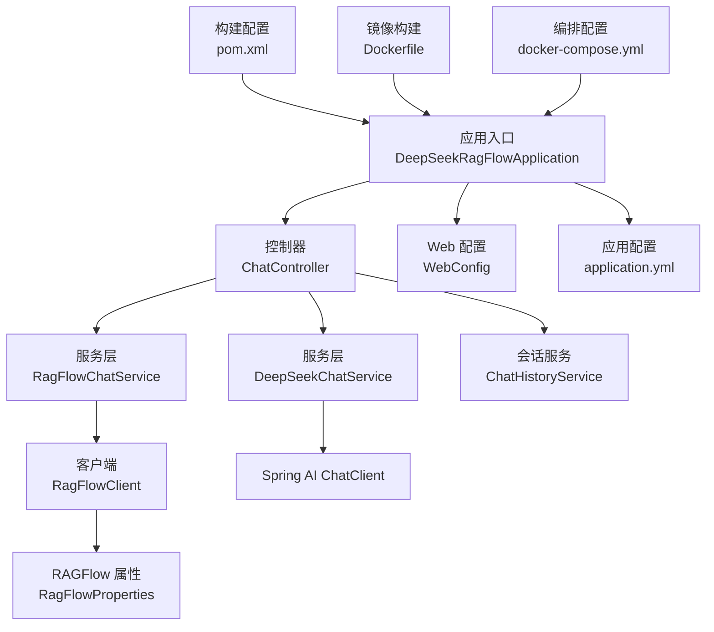
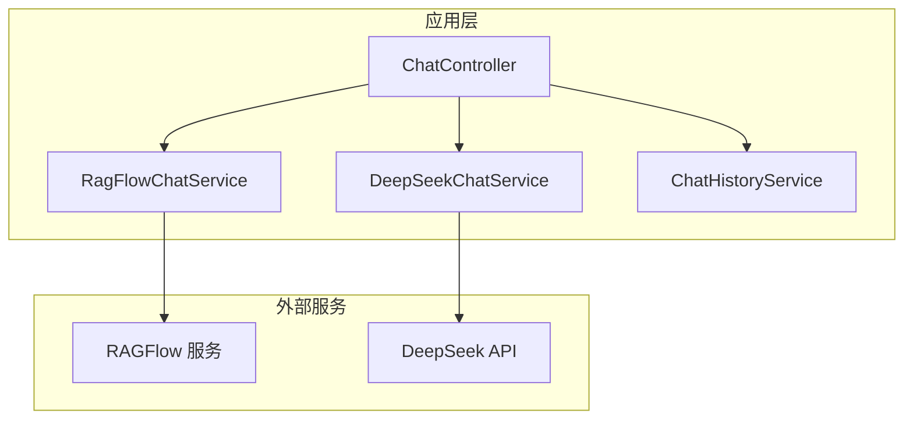
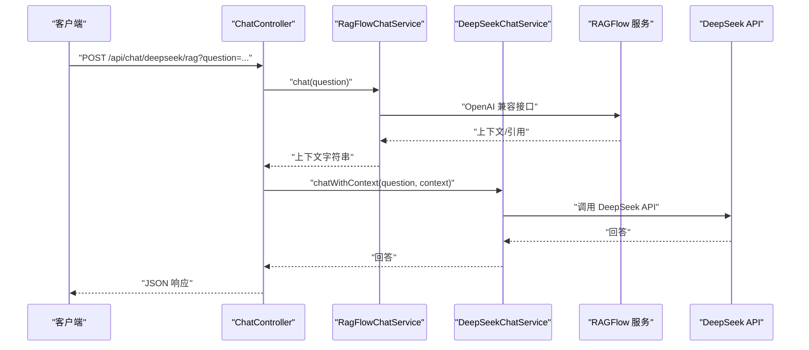
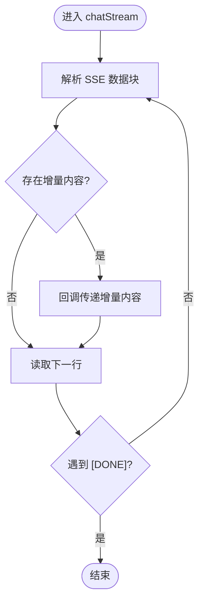
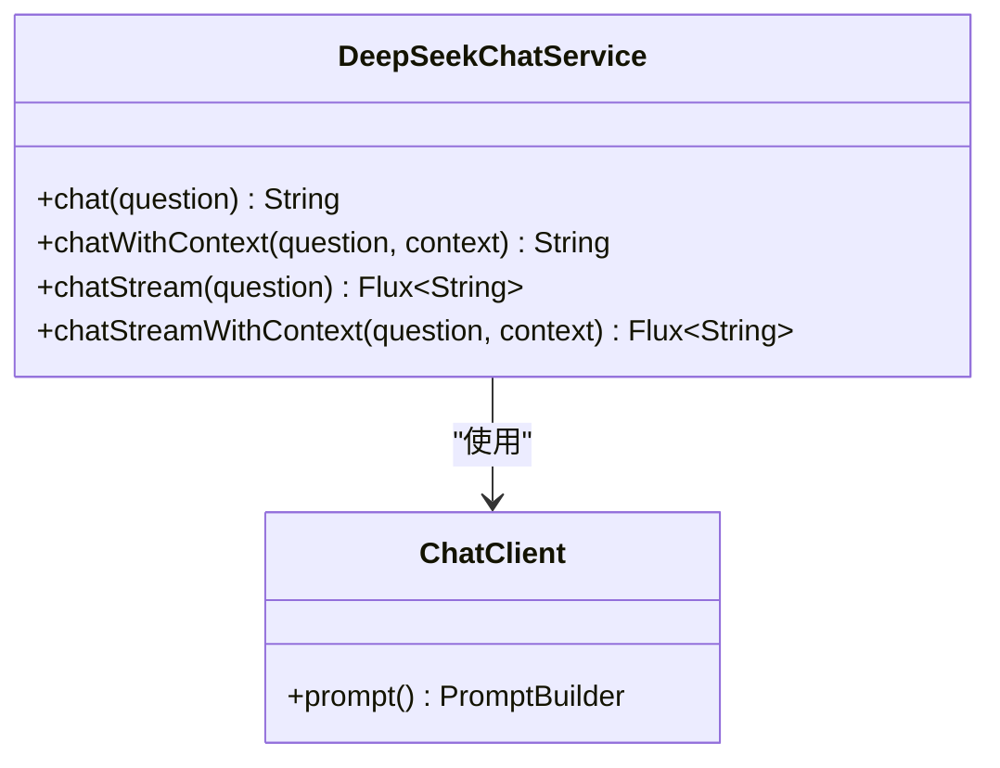
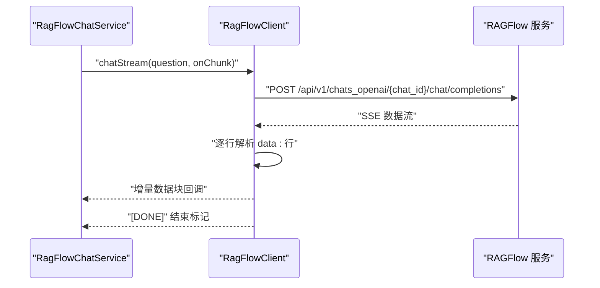
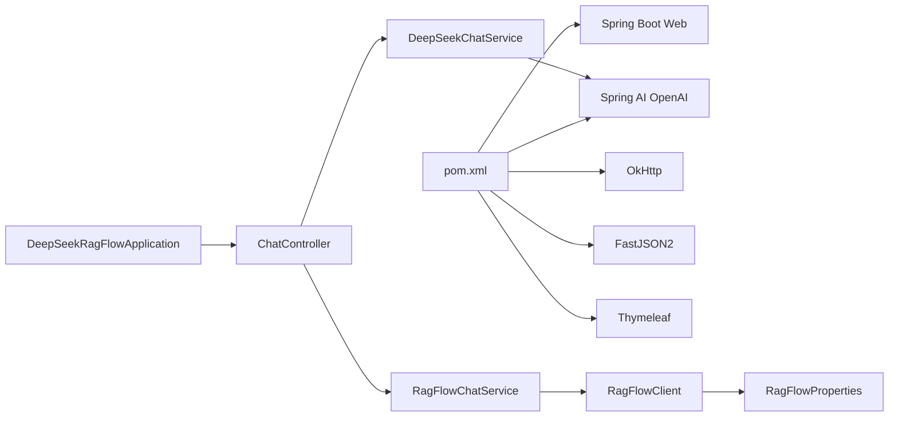

# 生产运维

<cite>
**本文引用的文件**
- [Dockerfile](file://Dockerfile)
- [docker-compose.yml](file://docker-compose.yml)
- [pom.xml](file://pom.xml)
- [application.yml](file://src/main/resources/application.yml)
- [DeepSeekRagFlowApplication.java](file://src/main/java/org/wiki/DeepSeekRagFlowApplication.java)
- [ChatController.java](file://src/main/java/org/wiki/controller/ChatController.java)
- [RagFlowChatService.java](file://src/main/java/org/wiki/service/RagFlowChatService.java)
- [DeepSeekChatService.java](file://src/main/java/org/wiki/service/DeepSeekChatService.java)
- [RagFlowClient.java](file://src/main/java/org/wiki/client/RagFlowClient.java)
- [ChatHistoryService.java](file://src/main/java/org/wiki/service/ChatHistoryService.java)
- [RagFlowProperties.java](file://src/main/java/org/wiki/config/RagFlowProperties.java)
- [WebConfig.java](file://src/main/java/org/wiki/config/WebConfig.java)
- [ChatRequest.java](file://src/main/java/org/wiki/model/ChatRequest.java)
- [ChatResponse.java](file://src/main/java/org/wiki/model/ChatResponse.java)
</cite>

## 目录
1. [简介](#简介)
2. [项目结构](#项目结构)
3. [核心组件](#核心组件)
4. [架构总览](#架构总览)
5. [详细组件分析](#详细组件分析)
6. [依赖分析](#依赖分析)
7. [性能考量](#性能考量)
8. [故障排查指南](#故障排查指南)
9. [结论](#结论)
10. [附录](#附录)

## 简介
本指南面向生产环境的运维团队，围绕基于 Spring Boot 的 DeepSeek + RAGFlow 系统，提供从硬件与系统配置、容器编排部署、监控与告警、备份与恢复、滚动更新与蓝绿部署、安全加固、容量规划与性能优化，到运维自动化与 CI/CD 集成的全栈运维实践建议。文档严格依据仓库中现有实现与配置文件进行分析与总结，避免臆测，确保可落地性与可追溯性。

## 项目结构
该工程采用标准 Spring Boot Maven 工程结构，核心模块包括：
- 应用入口与配置：启动类、Web MVC 配置、应用配置
- 控制器层：统一对外 API，支持多种对话模式与会话管理
- 服务层：RAGFlow 与 DeepSeek 的业务服务封装
- 客户端层：RAGFlow HTTP 客户端，封装 REST/SSE 调用
- 模型层：请求/响应数据模型
- 构建与运行：Maven、Dockerfile、docker-compose

图表来源
- [DeepSeekRagFlowApplication.java:1-12](file://src/main/java/org/wiki/DeepSeekRagFlowApplication.java#L1-L12)
- [ChatController.java:1-276](file://src/main/java/org/wiki/controller/ChatController.java#L1-L276)
- [RagFlowChatService.java:1-84](file://src/main/java/org/wiki/service/RagFlowChatService.java#L1-L84)
- [DeepSeekChatService.java:1-125](file://src/main/java/org/wiki/service/DeepSeekChatService.java#L1-L125)
- [RagFlowClient.java:1-231](file://src/main/java/org/wiki/client/RagFlowClient.java#L1-L231)
- [ChatHistoryService.java:1-88](file://src/main/java/org/wiki/service/ChatHistoryService.java#L1-L88)
- [RagFlowProperties.java:1-32](file://src/main/java/org/wiki/config/RagFlowProperties.java#L1-L32)
- [WebConfig.java:1-23](file://src/main/java/org/wiki/config/WebConfig.java#L1-L23)
- [application.yml:1-27](file://src/main/resources/application.yml#L1-L27)
- [pom.xml:1-102](file://pom.xml#L1-L102)
- [Dockerfile:1-15](file://Dockerfile#L1-L15)
- [docker-compose.yml:1-20](file://docker-compose.yml#L1-L20)

章节来源
- [Dockerfile:1-15](file://Dockerfile#L1-L15)
- [docker-compose.yml:1-20](file://docker-compose.yml#L1-L20)
- [pom.xml:1-102](file://pom.xml#L1-L102)
- [application.yml:1-27](file://src/main/resources/application.yml#L1-L27)
- [DeepSeekRagFlowApplication.java:1-12](file://src/main/java/org/wiki/DeepSeekRagFlowApplication.java#L1-L12)

## 核心组件
- 应用入口与启动：负责 Spring Boot 应用初始化与启动。
- 控制器层：提供多模式对话 API（RAGFlow、DeepSeek、RAG 增强），支持 SSE 流式输出与会话历史管理。
- 服务层：
  - RagFlowChatService：封装 RAGFlow 对话调用与流式处理。
  - DeepSeekChatService：封装 Spring AI ChatClient 的对话与流式输出。
  - ChatHistoryService：基于内存的会话消息存储（生产建议持久化）。
- 客户端层：RagFlowClient 使用 OkHttp 调用 RAGFlow REST/SSE 接口，支持超时与鉴权头。
- 配置层：RagFlowProperties 绑定 ragflow.* 配置；WebConfig 提供 CORS 支持；application.yml 提供端口、模型参数与日志级别等基础配置。
- 构建与运行：Maven 管理依赖与打包；Dockerfile 定义多阶段构建与运行时 JVM 参数；docker-compose 提供本地编排与环境变量注入。

章节来源
- [ChatController.java:1-276](file://src/main/java/org/wiki/controller/ChatController.java#L1-L276)
- [RagFlowChatService.java:1-84](file://src/main/java/org/wiki/service/RagFlowChatService.java#L1-L84)
- [DeepSeekChatService.java:1-125](file://src/main/java/org/wiki/service/DeepSeekChatService.java#L1-L125)
- [ChatHistoryService.java:1-88](file://src/main/java/org/wiki/service/ChatHistoryService.java#L1-L88)
- [RagFlowClient.java:1-231](file://src/main/java/org/wiki/client/RagFlowClient.java#L1-L231)
- [RagFlowProperties.java:1-32](file://src/main/java/org/wiki/config/RagFlowProperties.java#L1-L32)
- [WebConfig.java:1-23](file://src/main/java/org/wiki/config/WebConfig.java#L1-L23)
- [application.yml:1-27](file://src/main/resources/application.yml#L1-L27)
- [pom.xml:1-102](file://pom.xml#L1-L102)
- [Dockerfile:1-15](file://Dockerfile#L1-L15)
- [docker-compose.yml:1-20](file://docker-compose.yml#L1-L20)

## 架构总览
系统采用“控制器-服务-客户端”的分层架构，结合 Spring AI 与 OkHttp 实现对 DeepSeek 与 RAGFlow 的统一调用。应用通过 SSE 提供流式对话能力，同时支持非流式同步调用与会话历史管理。

图表来源
- [ChatController.java:1-276](file://src/main/java/org/wiki/controller/ChatController.java#L1-L276)
- [RagFlowChatService.java:1-84](file://src/main/java/org/wiki/service/RagFlowChatService.java#L1-L84)
- [DeepSeekChatService.java:1-125](file://src/main/java/org/wiki/service/DeepSeekChatService.java#L1-L125)
- [RagFlowClient.java:1-231](file://src/main/java/org/wiki/client/RagFlowClient.java#L1-L231)

## 详细组件分析

### 控制器层：ChatController
- 功能要点
  - 支持三种对话模式：RAGFlow 非流式、RAGFlow 流式、DeepSeek 非流式、DeepSeek 流式、DeepSeek+RAG 增强（非流式/流式）。
  - SSE 流式输出：RAGFlow 与 DeepSeek+RAG 增强均支持流式输出，分别使用 SseEmitter 与 Spring AI 原生 Flux。
  - 会话管理：创建会话、查询历史、清空历史；消息上限控制与并发安全。
- 关键流程
  - RAGFlow 非流式：调用 RagFlowChatService.chat，提取回答并写入会话。
  - RAGFlow 流式：使用 SseEmitter 异步推送增量数据块。
  - DeepSeek+RAG 增强：先调用 RAGFlow 获取上下文，再调用 DeepSeek 生成最终回答。
  - 流式增强：先获取上下文，再流式生成回答并推送增量数据块。

图表来源
- [ChatController.java:148-174](file://src/main/java/org/wiki/controller/ChatController.java#L148-L174)
- [RagFlowChatService.java:34-41](file://src/main/java/org/wiki/service/RagFlowChatService.java#L34-L41)
- [DeepSeekChatService.java:54-78](file://src/main/java/org/wiki/service/DeepSeekChatService.java#L54-L78)

章节来源
- [ChatController.java:1-276](file://src/main/java/org/wiki/controller/ChatController.java#L1-L276)

### 服务层：RagFlowChatService
- 功能要点
  - 封装 RAGFlow 对话调用，支持非流式与流式两种模式。
  - 流式解析：解析 SSE 数据块，提取增量内容与引用信息。
  - 结果提取：从 ChatResponse 中提取回答文本。
- 性能与可靠性
  - 依赖 RagFlowClient 的超时设置与连接池配置。
  - 流式处理对网络抖动敏感，需结合上层超时与重试策略。

图表来源
- [RagFlowChatService.java:50-72](file://src/main/java/org/wiki/service/RagFlowChatService.java#L50-L72)
- [RagFlowClient.java:154-200](file://src/main/java/org/wiki/client/RagFlowClient.java#L154-L200)

章节来源
- [RagFlowChatService.java:1-84](file://src/main/java/org/wiki/service/RagFlowChatService.java#L1-L84)
- [RagFlowClient.java:1-231](file://src/main/java/org/wiki/client/RagFlowClient.java#L1-L231)

### 服务层：DeepSeekChatService
- 功能要点
  - 使用 Spring AI ChatClient 调用 DeepSeek API（兼容 OpenAI 接口）。
  - 支持纯对话与 RAG 增强两种提示词模板。
  - 支持非流式与流式两种输出方式。
- 设计优势
  - 利用 Spring AI 的流式能力，简化 SSE 输出逻辑。
  - RAG 增强通过系统提示词注入上下文，保证回答一致性与准确性。

图表来源
- [DeepSeekChatService.java:1-125](file://src/main/java/org/wiki/service/DeepSeekChatService.java#L1-L125)

章节来源
- [DeepSeekChatService.java:1-125](file://src/main/java/org/wiki/service/DeepSeekChatService.java#L1-L125)

### 客户端层：RagFlowClient
- 功能要点
  - 基于 OkHttp 的通用 HTTP 客户端，封装 GET/POST/PUT/DELETE。
  - 流式对话：基于 SSE，逐行解析 data: 行，过滤 [DONE]。
  - 文件上传：multipart/form-data 上传至 RAGFlow 知识库。
- 超时与错误处理
  - 连接超时、读超时、写超时由构造函数配置。
  - 非成功状态码抛出异常，便于上层统一处理。

图表来源
- [RagFlowClient.java:154-200](file://src/main/java/org/wiki/client/RagFlowClient.java#L154-L200)
- [RagFlowChatService.java:50-72](file://src/main/java/org/wiki/service/RagFlowChatService.java#L50-L72)

章节来源
- [RagFlowClient.java:1-231](file://src/main/java/org/wiki/client/RagFlowClient.java#L1-L231)

### 配置层：RagFlowProperties 与 WebConfig
- RagFlowProperties
  - 绑定 ragflow.* 配置项：baseUrl、apiKey、chatId、timeout。
  - 为客户端提供统一的外部服务地址与鉴权信息。
- WebConfig
  - 配置 CORS，允许 /api/** 路径跨域访问，支持 OPTIONS 方法与凭证。

章节来源
- [RagFlowProperties.java:1-32](file://src/main/java/org/wiki/config/RagFlowProperties.java#L1-L32)
- [WebConfig.java:1-23](file://src/main/java/org/wiki/config/WebConfig.java#L1-L23)

### 数据模型：ChatRequest 与 ChatResponse
- ChatRequest：定义 OpenAI 兼容接口的请求体结构，包含消息列表、是否流式、额外参数（如引用）。
- ChatResponse：定义 OpenAI 兼容接口的响应体结构，包含 choices、usage 等字段。

章节来源
- [ChatRequest.java:1-59](file://src/main/java/org/wiki/model/ChatRequest.java#L1-L59)
- [ChatResponse.java:1-52](file://src/main/java/org/wiki/model/ChatResponse.java#L1-L52)

## 依赖分析
- 外部依赖
  - Spring Boot Web、Spring AI OpenAI Starter、OkHttp、FastJSON2、Lombok、Thymeleaf。
- 内部依赖
  - 控制器依赖服务层；服务层依赖客户端与属性配置；客户端依赖属性配置。
- 运行时依赖
  - Java 17 运行时、JVM 内存参数（见 Dockerfile）。

图表来源
- [pom.xml:25-88](file://pom.xml#L25-L88)
- [DeepSeekRagFlowApplication.java:1-12](file://src/main/java/org/wiki/DeepSeekRagFlowApplication.java#L1-L12)
- [ChatController.java:1-276](file://src/main/java/org/wiki/controller/ChatController.java#L1-L276)
- [RagFlowChatService.java:1-84](file://src/main/java/org/wiki/service/RagFlowChatService.java#L1-L84)
- [DeepSeekChatService.java:1-125](file://src/main/java/org/wiki/service/DeepSeekChatService.java#L1-L125)
- [RagFlowClient.java:1-231](file://src/main/java/org/wiki/client/RagFlowClient.java#L1-L231)
- [RagFlowProperties.java:1-32](file://src/main/java/org/wiki/config/RagFlowProperties.java#L1-L32)

章节来源
- [pom.xml:1-102](file://pom.xml#L1-L102)

## 性能考量
- JVM 与容器资源
  - 当前镜像默认 JVM 最小堆与最大堆分别为 256MB 与 512MB，适合开发/演示场景。生产环境建议根据 QPS、响应延迟与 GC 行为调整堆大小与 GC 参数。
  - 建议在容器编排中设置合理的 CPU 与内存资源配额，并启用水平/垂直自动伸缩策略。
- 网络与超时
  - RAGFlowClient 默认读超时来自配置（秒级），建议结合上游服务 SLA 设置合理超时与重试。
  - SSE 流式传输对网络稳定性敏感，建议在网关或反向代理层开启长连接与缓冲策略。
- 并发与线程
  - ChatController 使用缓存线程池执行异步任务，生产环境建议使用有界队列与拒绝策略，防止 OOM。
- I/O 与序列化
  - 使用 FastJSON2 进行 JSON 解析，建议在高并发场景下评估序列化开销与内存分配。
- 模型参数
  - application.yml 中的模型温度与最大 tokens 影响响应时延与成本，建议按场景调优。

章节来源
- [Dockerfile:11-12](file://Dockerfile#L11-L12)
- [RagFlowClient.java:30-35](file://src/main/java/org/wiki/client/RagFlowClient.java#L30-L35)
- [application.yml:13-16](file://src/main/resources/application.yml#L13-L16)
- [ChatController.java:35-35](file://src/main/java/org/wiki/controller/ChatController.java#L35-L35)

## 故障排查指南
- 常见问题定位
  - RAGFlow API 调用失败：检查 baseUrl、apiKey、chatId 与网络连通性；关注客户端返回的状态码与错误体。
  - SSE 流式异常：确认上游服务是否正确发送 data: 行与 [DONE] 结束标记；排查解析异常与回调异常。
  - DeepSeek 调用失败：检查 API Key 与 base-url 配置；确认模型名称与温度参数。
  - CORS 问题：确认 WebConfig 中的路径匹配与允许的 Origin/Method/Headers。
- 日志与可观测性
  - application.yml 中已设置日志级别为 DEBUG，便于问题定位；生产环境建议调整为 INFO/ERROR 并配合集中日志采集。
- 会话存储
  - ChatHistoryService 基于内存存储，重启即丢失；生产环境建议替换为 Redis 或数据库持久化。

章节来源
- [RagFlowClient.java:49-56](file://src/main/java/org/wiki/client/RagFlowClient.java#L49-L56)
- [RagFlowChatService.java:67-70](file://src/main/java/org/wiki/service/RagFlowChatService.java#L67-L70)
- [application.yml:24-27](file://src/main/resources/application.yml#L24-L27)
- [WebConfig.java:14-21](file://src/main/java/org/wiki/config/WebConfig.java#L14-L21)
- [ChatHistoryService.java:18-43](file://src/main/java/org/wiki/service/ChatHistoryService.java#L18-L43)

## 结论
本项目提供了清晰的分层架构与完善的 API 能力，具备良好的扩展性与可运维性。生产部署建议重点围绕资源规划、网络与超时策略、并发与线程池、持久化与监控等方面进行强化。后续可在现有基础上引入容器编排、监控告警、备份恢复与蓝绿发布等体系化能力，以满足生产级 SLA 与合规要求。

## 附录

### 硬件与系统配置建议
- CPU
  - 单实例建议至少 2 核，高并发场景建议 4 核以上；容器编排中设置 CPU 请求与限制。
- 内存
  - JVM 堆建议从 1GB 起步，结合 GC 日志与内存曲线逐步调优；容器设置内存限制并预留系统开销。
- 存储
  - 本地磁盘仅用于日志与临时文件；会话与配置建议持久化至对象存储或数据库。
- 网络
  - 与 RAGFlow 与 DeepSeek 的网络延迟与可用性直接影响用户体验；建议就近部署或使用 CDN/专线。

### 容器编排部署建议
- Docker Compose
  - 可用于单节点部署与测试验证；生产建议迁移到 Kubernetes。
- Kubernetes
  - 使用 Deployment/StatefulSet 管理副本与持久化；使用 ConfigMap/Secret 管理配置与密钥。
  - 使用 Service/Ingress 暴露服务；设置 HPA/LimitRange 控制资源。
  - 使用 PodDisruptionBudget 保障可用性。
- 云原生平台
  - 在云厂商托管集群上启用自动伸缩、网络策略与安全组；结合平台的负载均衡与证书管理。

### 监控与告警
- 指标采集
  - Spring Boot Actuator 暴露健康、指标与线程池等信息；Prometheus 抓取指标。
- 日志聚合
  - 使用 Fluent Bit/Fluentd 收集容器日志；集中存储至 ELK 或 Loki；设置日志分级与保留策略。
- 性能监控
  - APM（如 SkyWalking/OpenTelemetry）追踪链路与慢调用；结合分布式追踪与指标面板。

### 备份与恢复
- 数据备份
  - 会话与用户数据持久化至数据库/Redis；定期快照与归档。
- 配置备份
  - ConfigMap/Secret 与 GitOps 管理配置变更；版本化与回滚。
- 灾难恢复
  - 多可用区部署；建立 RPO/RTO 目标；定期演练恢复流程。

### 滚动更新与蓝绿部署
- 滚动更新
  - 设置最大不可用与最大额外副本；结合 readiness/liveness 探针；灰度流量切换。
- 蓝绿/金丝雀
  - 通过标签与路由规则实现双环境并行；逐步放量与自动回滚。

### 安全加固
- 网络安全
  - 使用 TLS 终止与证书管理；限制入站/出站网络策略；启用 WAF。
- 访问控制
  - API Key 管理与轮换；最小权限原则；审计日志。
- 数据加密
  - 静态数据加密；传输层加密；密钥生命周期管理。

### 容量规划与性能优化
- 负载测试
  - 使用 JMeter/K6/Gatling 等工具模拟峰值流量；关注 P95/P99 延迟与错误率。
- 瓶颈分析
  - 分布式追踪定位慢调用；数据库/缓存/外部 API 的热点分析。
- 资源调优
  - JVM 参数、线程池大小、连接池与超时；容器资源配额与自动伸缩阈值。

### 运维自动化与 CI/CD
- 自动化脚本
  - 镜像构建、推送、部署与回滚脚本；配置校验与健康检查。
- CI/CD 流水线
  - 触发条件：分支保护、PR 审批、单元测试通过；制品管理与签名；多环境发布策略。