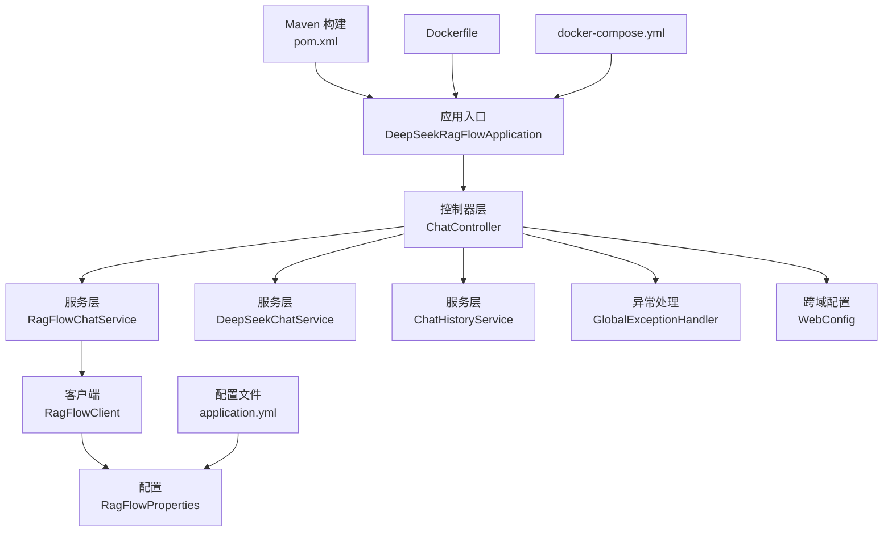
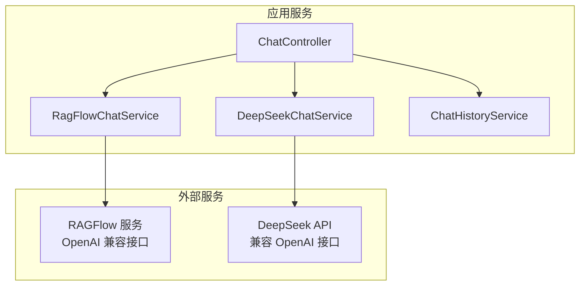
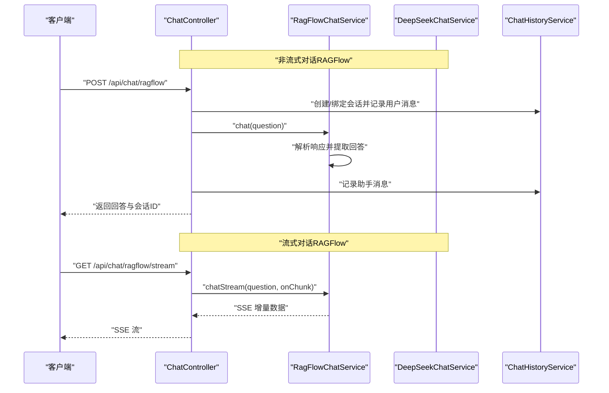
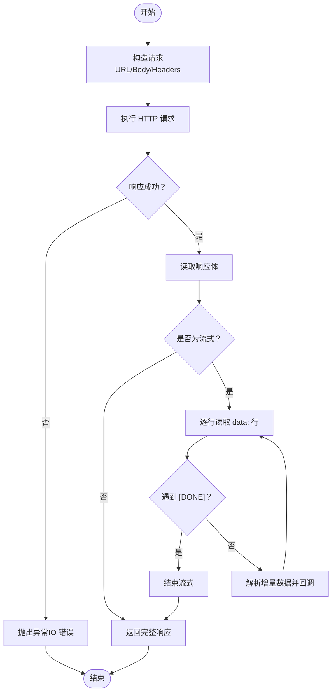
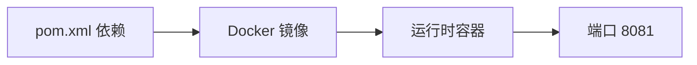

# 部署与运维

<cite>
**本文引用的文件**
- [Dockerfile](file://Dockerfile)
- [docker-compose.yml](file://docker-compose.yml)
- [pom.xml](file://pom.xml)
- [application.yml](file://src/main/resources/application.yml)
- [DeepSeekRagFlowApplication.java](file://src/main/java/org/wiki/DeepSeekRagFlowApplication.java)
- [ChatController.java](file://src/main/java/org/wiki/controller/ChatController.java)
- [RagFlowChatService.java](file://src/main/java/org/wiki/service/RagFlowChatService.java)
- [RagFlowClient.java](file://src/main/java/org/wiki/client/RagFlowClient.java)
- [DeepSeekChatService.java](file://src/main/java/org/wiki/service/DeepSeekChatService.java)
- [RagFlowProperties.java](file://src/main/java/org/wiki/config/RagFlowProperties.java)
- [WebConfig.java](file://src/main/java/org/wiki/config/WebConfig.java)
- [GlobalExceptionHandler.java](file://src/main/java/org/wiki/config/GlobalExceptionHandler.java)
- [ChatRequest.java](file://src/main/java/org/wiki/model/ChatRequest.java)
- [ChatResponse.java](file://src/main/java/org/wiki/model/ChatResponse.java)
- [ChatHistoryService.java](file://src/main/java/org/wiki/service/ChatHistoryService.java)
</cite>

## 目录
1. [简介](#简介)
2. [项目结构](#项目结构)
3. [核心组件](#核心组件)
4. [架构总览](#架构总览)
5. [详细组件分析](#详细组件分析)
6. [依赖分析](#依赖分析)
7. [性能考虑](#性能考虑)
8. [故障排除指南](#故障排除指南)
9. [结论](#结论)
10. [附录](#附录)

## 简介
本文件面向运维工程师与开发团队，提供 DeepSeek + RAGFlow 系统的部署与运维指南。内容覆盖本地构建与启动、单容器 Docker 部署、docker-compose 多服务编排、生产环境最佳实践、监控与日志、故障排除、备份与升级、以及安全加固与 CI/CD 建议。系统基于 Spring Boot 3.2 与 Spring AI OpenAI 兼容接口，结合 OkHttp 调用 RAGFlow HTTP API，并提供 SSE 流式对话能力。

## 项目结构
该仓库为一个独立的 Spring Boot 应用模块，采用标准 Maven 结构，包含控制器、服务层、客户端、配置与模型等包。核心入口为 Spring Boot 启动类，资源目录包含应用配置与模板页面；根目录提供 Dockerfile 与 docker-compose.yml，便于容器化部署。

图表来源
- [DeepSeekRagFlowApplication.java:1-12](file://src/main/java/org/wiki/DeepSeekRagFlowApplication.java#L1-L12)
- [ChatController.java:1-276](file://src/main/java/org/wiki/controller/ChatController.java#L1-L276)
- [RagFlowChatService.java:1-84](file://src/main/java/org/wiki/service/RagFlowChatService.java#L1-L84)
- [RagFlowClient.java:1-231](file://src/main/java/org/wiki/client/RagFlowClient.java#L1-L231)
- [DeepSeekChatService.java:1-125](file://src/main/java/org/wiki/service/DeepSeekChatService.java#L1-L125)
- [RagFlowProperties.java:1-32](file://src/main/java/org/wiki/config/RagFlowProperties.java#L1-L32)
- [GlobalExceptionHandler.java:1-46](file://src/main/java/org/wiki/config/GlobalExceptionHandler.java#L1-L46)
- [WebConfig.java:1-23](file://src/main/java/org/wiki/config/WebConfig.java#L1-L23)
- [application.yml:1-27](file://src/main/resources/application.yml#L1-L27)
- [pom.xml:1-102](file://pom.xml#L1-L102)
- [Dockerfile:1-15](file://Dockerfile#L1-L15)
- [docker-compose.yml:1-20](file://docker-compose.yml#L1-L20)

章节来源
- [Dockerfile:1-15](file://Dockerfile#L1-L15)
- [docker-compose.yml:1-20](file://docker-compose.yml#L1-L20)
- [pom.xml:1-102](file://pom.xml#L1-L102)
- [application.yml:1-27](file://src/main/resources/application.yml#L1-L27)
- [DeepSeekRagFlowApplication.java:1-12](file://src/main/java/org/wiki/DeepSeekRagFlowApplication.java#L1-L12)

## 核心组件
- 应用入口与启动
  - 启动类负责加载 Spring Boot 应用上下文，暴露 HTTP 端口并注册控制器与服务。
  - 章节来源
    - [DeepSeekRagFlowApplication.java:1-12](file://src/main/java/org/wiki/DeepSeekRagFlowApplication.java#L1-L12)
- 控制器层
  - 提供三类对话接口：RAGFlow 非流式/流式、DeepSeek 非流式/流式、DeepSeek+RAG 增强模式（非流式/流式），并提供会话管理与历史查询。
  - 章节来源
    - [ChatController.java:1-276](file://src/main/java/org/wiki/controller/ChatController.java#L1-L276)
- 服务层
  - RagFlowChatService：封装 RAGFlow 客户端调用，支持非流式与流式问答，并提取回答文本。
  - DeepSeekChatService：基于 Spring AI ChatClient 调用 DeepSeek（兼容 OpenAI 接口），支持纯对话与 RAG 增强对话及流式输出。
  - ChatHistoryService：基于内存的会话历史管理（生产建议持久化）。
  - 章节来源
    - [RagFlowChatService.java:1-84](file://src/main/java/org/wiki/service/RagFlowChatService.java#L1-L84)
    - [DeepSeekChatService.java:1-125](file://src/main/java/org/wiki/service/DeepSeekChatService.java#L1-L125)
    - [ChatHistoryService.java:1-88](file://src/main/java/org/wiki/service/ChatHistoryService.java#L1-L88)
- 客户端与配置
  - RagFlowClient：基于 OkHttp 的 HTTP 客户端，封装 GET/POST/PUT/DELETE 与 SSE 流式读取，支持文件上传。
  - RagFlowProperties：RAGFlow 服务地址、API Key、聊天助手 ID、超时等配置项。
  - WebConfig：CORS 跨域配置。
  - GlobalExceptionHandler：统一异常处理，区分业务与 IO 异常并返回标准化响应。
  - 章节来源
    - [RagFlowClient.java:1-231](file://src/main/java/org/wiki/client/RagFlowClient.java#L1-L231)
    - [RagFlowProperties.java:1-32](file://src/main/java/org/wiki/config/RagFlowProperties.java#L1-L32)
    - [WebConfig.java:1-23](file://src/main/java/org/wiki/config/WebConfig.java#L1-L23)
    - [GlobalExceptionHandler.java:1-46](file://src/main/java/org/wiki/config/GlobalExceptionHandler.java#L1-L46)
- 模型
  - ChatRequest/ChatResponse：RAGFlow 对话请求与响应的数据模型。
  - 章节来源
    - [ChatRequest.java:1-59](file://src/main/java/org/wiki/model/ChatRequest.java#L1-L59)
    - [ChatResponse.java:1-52](file://src/main/java/org/wiki/model/ChatResponse.java#L1-L52)

## 架构总览
系统采用“控制器-服务-客户端”的分层设计，控制器对外提供 REST API，服务层负责业务逻辑与第三方集成，客户端封装 HTTP 通信细节。RAGFlow 与 DeepSeek 通过不同路径接入：前者使用 OpenAI 兼容接口与 SSE 流式输出，后者通过 Spring AI ChatClient 实现。

图表来源
- [ChatController.java:1-276](file://src/main/java/org/wiki/controller/ChatController.java#L1-L276)
- [RagFlowChatService.java:1-84](file://src/main/java/org/wiki/service/RagFlowChatService.java#L1-L84)
- [DeepSeekChatService.java:1-125](file://src/main/java/org/wiki/service/DeepSeekChatService.java#L1-L125)
- [RagFlowClient.java:1-231](file://src/main/java/org/wiki/client/RagFlowClient.java#L1-L231)

## 详细组件分析

### 控制器与 API 工作流
- 非流式对话
  - RAGFlow：接收问题参数，调用 RagFlowChatService，解析回答并写入会话历史。
  - DeepSeek：直接调用 DeepSeekChatService，返回回答并记录历史。
  - DeepSeek+RAG：先调用 RAGFlow 获取上下文，再调用 DeepSeek 生成增强回答。
- 流式对话
  - RAGFlow：通过 SSE 逐块推送增量内容，包含引用信息提示。
  - DeepSeek：使用 Spring AI 原生 Flux 流式输出；DeepSeek+RAG 先获取上下文再流式生成。
- 会话管理
  - 创建会话、查询历史、清空会话等接口，配合 ChatHistoryService 实现。

图表来源
- [ChatController.java:1-276](file://src/main/java/org/wiki/controller/ChatController.java#L1-L276)
- [RagFlowChatService.java:1-84](file://src/main/java/org/wiki/service/RagFlowChatService.java#L1-L84)

章节来源
- [ChatController.java:1-276](file://src/main/java/org/wiki/controller/ChatController.java#L1-L276)

### RAGFlow 客户端与流式处理
- HTTP 客户端
  - 基于 OkHttp，支持 GET/POST/PUT/DELETE，统一添加认证头与 JSON 内容类型。
  - 超时配置由 RagFlowProperties 的 timeout 字段控制。
- 流式 SSE
  - 通过读取响应流逐行解析 data: 行，过滤 [DONE] 结束标记，回调上层消费增量数据。
- 文件上传
  - 支持多部分表单上传至指定数据集的文档接口。

图表来源
- [RagFlowClient.java:1-231](file://src/main/java/org/wiki/client/RagFlowClient.java#L1-L231)
- [RagFlowProperties.java:1-32](file://src/main/java/org/wiki/config/RagFlowProperties.java#L1-L32)

章节来源
- [RagFlowClient.java:1-231](file://src/main/java/org/wiki/client/RagFlowClient.java#L1-L231)
- [RagFlowProperties.java:1-32](file://src/main/java/org/wiki/config/RagFlowProperties.java#L1-L32)

### DeepSeek 服务与 Spring AI 集成
- 非流式与流式对话
  - 使用 ChatClient 构建 Prompt，支持系统提示注入（RAG 增强场景）。
  - 流式输出基于 Reactor Flux，自动拼接增量内容并在完成后发送结束标记。
- 模型参数
  - application.yml 中定义了模型名、温度、最大令牌数等参数，可在运行时通过环境变量覆盖。

章节来源
- [DeepSeekChatService.java:1-125](file://src/main/java/org/wiki/service/DeepSeekChatService.java#L1-L125)
- [application.yml:1-27](file://src/main/resources/application.yml#L1-L27)

### 统一异常处理与跨域配置
- 全局异常处理
  - 对 Exception 与 IOException 进行分类处理，返回标准化 JSON 结果与状态码。
- CORS 配置
  - 对 /api/** 开放跨域访问，允许 OPTIONS 方法与凭证传递。

章节来源
- [GlobalExceptionHandler.java:1-46](file://src/main/java/org/wiki/config/GlobalExceptionHandler.java#L1-L46)
- [WebConfig.java:1-23](file://src/main/java/org/wiki/config/WebConfig.java#L1-L23)

## 依赖分析
- 构建与运行时
  - Maven 依赖包含 Spring Boot Web、Spring AI OpenAI Starter、OkHttp、FastJSON2、Lombok、Thymeleaf 等。
  - 运行时镜像基于 Alpine Linux，JRE 仅包含必要组件，减小体积。
- 容器化
  - Dockerfile 使用多阶段构建：builder 阶段安装 Maven 并打包，runtime 阶段仅复制 JAR 到 JRE 基础镜像。
  - 默认暴露 8081 端口，可通过环境变量调整 JVM 参数。

图表来源
- [pom.xml:1-102](file://pom.xml#L1-L102)
- [Dockerfile:1-15](file://Dockerfile#L1-L15)

章节来源
- [pom.xml:1-102](file://pom.xml#L1-L102)
- [Dockerfile:1-15](file://Dockerfile#L1-L15)

## 性能考虑
- JVM 与线程池
  - Dockerfile 设置最小与最大堆大小，建议在生产环境中根据并发与内存需求调整。
  - ChatController 使用缓存线程池处理流式请求，注意避免长时间阻塞与内存泄漏。
- I/O 与超时
  - RAGFlow 客户端读超时由 RagFlowProperties.timeout 控制，建议结合上游服务 SLA 调整。
- 流式输出
  - SSE 与 Reactor Flux 均为背压友好，但需确保客户端及时消费，避免缓冲区溢出。
- 缓存与会话
  - ChatHistoryService 当前基于内存，建议在生产环境替换为 Redis 或数据库持久化，设置 TTL 与容量上限。

章节来源
- [Dockerfile:1-15](file://Dockerfile#L1-L15)
- [ChatController.java:1-276](file://src/main/java/org/wiki/controller/ChatController.java#L1-L276)
- [RagFlowClient.java:1-231](file://src/main/java/org/wiki/client/RagFlowClient.java#L1-L231)
- [ChatHistoryService.java:1-88](file://src/main/java/org/wiki/service/ChatHistoryService.java#L1-L88)

## 故障排除指南
- 启动与端口
  - 确认容器映射端口与主机一致，检查防火墙与安全组规则。
  - 查看容器日志定位启动失败原因。
- RAGFlow 连接失败
  - 核对 RAGFLOW_BASE_URL、RAGFLOW_API_KEY、RAGFLOW_CHAT_ID 环境变量。
  - 检查 RAGFlow 服务可达性与网络连通性。
  - 关注 GlobalExceptionHandler 对 IO 异常的统一处理与返回信息。
- DeepSeek 认证失败
  - 核对 SPRING_AI_OPENAI_API_KEY 与 base-url 配置。
  - 若出现 401/403，确认密钥有效性与权限范围。
- 超时与流式中断
  - 调整 RagFlowProperties.timeout 与客户端连接/写超时。
  - 检查上游服务性能与限流策略。
- 日志级别
  - application.yml 中已开启 DEBUG 级别，便于排查；生产环境建议降级为 INFO。

章节来源
- [docker-compose.yml:1-20](file://docker-compose.yml#L1-L20)
- [application.yml:1-27](file://src/main/resources/application.yml#L1-L27)
- [GlobalExceptionHandler.java:1-46](file://src/main/java/org/wiki/config/GlobalExceptionHandler.java#L1-L46)
- [RagFlowProperties.java:1-32](file://src/main/java/org/wiki/config/RagFlowProperties.java#L1-L32)

## 结论
本项目提供了完整的 DeepSeek + RAGFlow 对话能力，具备容器化与多模式对话接口。建议在生产环境中完善持久化、监控告警、安全加固与高可用部署方案，以满足稳定性与可维护性要求。

## 附录

### 本地部署与启动
- Maven 构建
  - 在项目根目录执行构建命令，跳过测试以加速打包。
  - 章节来源
    - [Dockerfile:1-15](file://Dockerfile#L1-L15)
- 应用启动
  - 使用 Spring Boot 启动类运行，默认监听 8081 端口。
  - 章节来源
    - [DeepSeekRagFlowApplication.java:1-12](file://src/main/java/org/wiki/DeepSeekRagFlowApplication.java#L1-L12)
    - [application.yml:1-27](file://src/main/resources/application.yml#L1-L27)

### Docker 单容器部署
- 构建镜像
  - 使用根目录 Dockerfile 构建镜像，多阶段减少镜像体积。
  - 章节来源
    - [Dockerfile:1-15](file://Dockerfile#L1-L15)
- 运行容器
  - 映射 8081 端口，设置环境变量覆盖默认配置。
  - 章节来源
    - [docker-compose.yml:1-20](file://docker-compose.yml#L1-L20)

### docker-compose 多服务编排
- 服务定义
  - 包含应用服务、端口映射、环境变量与重启策略。
  - 章节来源
    - [docker-compose.yml:1-20](file://docker-compose.yml#L1-L20)
- 环境变量
  - DEEPSEEK_API_KEY、RAGFLOW_BASE_URL、RAGFLOW_API_KEY、RAGFLOW_CHAT_ID 等。
  - 章节来源
    - [docker-compose.yml:1-20](file://docker-compose.yml#L1-L20)
    - [application.yml:1-27](file://src/main/resources/application.yml#L1-L27)

### 生产环境最佳实践
- 容器化
  - 使用只读根文件系统、最小权限用户、健康检查与资源限制。
- 负载均衡与高可用
  - 使用反向代理或云负载均衡，多副本部署并共享会话存储（Redis/数据库）。
- 安全加固
  - 限制暴露端口、启用 TLS、密钥管理与审计日志。
- 监控与日志
  - 集成指标采集（如 Micrometer）、应用日志收集与错误追踪（如 APM）。

### 监控与日志配置
- 应用日志
  - application.yml 中设置日志级别，建议生产环境使用文件输出与轮转。
- 错误追踪
  - 全局异常处理器统一返回结构化错误信息，便于前端与监控系统识别。
- 性能监控
  - 建议引入指标端点与链路追踪，关注慢请求与错误率。

章节来源
- [application.yml:1-27](file://src/main/resources/application.yml#L1-L27)
- [GlobalExceptionHandler.java:1-46](file://src/main/java/org/wiki/config/GlobalExceptionHandler.java#L1-L46)

### 备份与恢复策略
- 配置备份
  - 备份 application.yml、docker-compose.yml 与环境变量文件。
- 数据备份
  - ChatHistoryService 当前为内存存储，生产环境需迁移至持久化存储并制定定期备份计划。
- 恢复流程
  - 重建容器后恢复配置与数据，验证 API 可用性与下游服务连通性。

章节来源
- [ChatHistoryService.java:1-88](file://src/main/java/org/wiki/service/ChatHistoryService.java#L1-L88)

### 版本升级流程
- 依赖升级
  - 更新 pom.xml 中的依赖版本，重新构建镜像。
- 配置变更
  - application.yml 中新增或变更字段需同步到环境变量或配置中心。
- 发布策略
  - 使用蓝绿/滚动发布，逐步切换流量并观察指标与日志。

章节来源
- [pom.xml:1-102](file://pom.xml#L1-L102)
- [application.yml:1-27](file://src/main/resources/application.yml#L1-L27)

### 安全加固措施
- 密钥管理
  - 使用环境变量或密钥管理服务注入 API Key，避免硬编码。
- 网络隔离
  - 将应用与 RAGFlow 服务置于同一 VPC 或私有网络，限制入站访问。
- 访问控制
  - 启用 API 认证与授权，限制敏感接口访问。
- 审计与合规
  - 记录关键操作与异常事件，满足合规要求。

### 运维自动化与 CI/CD 建议
- 构建与测试
  - 在 CI 中执行 Maven 构建与单元测试，生成可复用的镜像。
- 部署流水线
  - 使用 GitOps 管理 docker-compose.yml 与配置，自动化部署与回滚。
- 健康检查
  - 配置就绪探针与存活探针，确保容器健康状态。