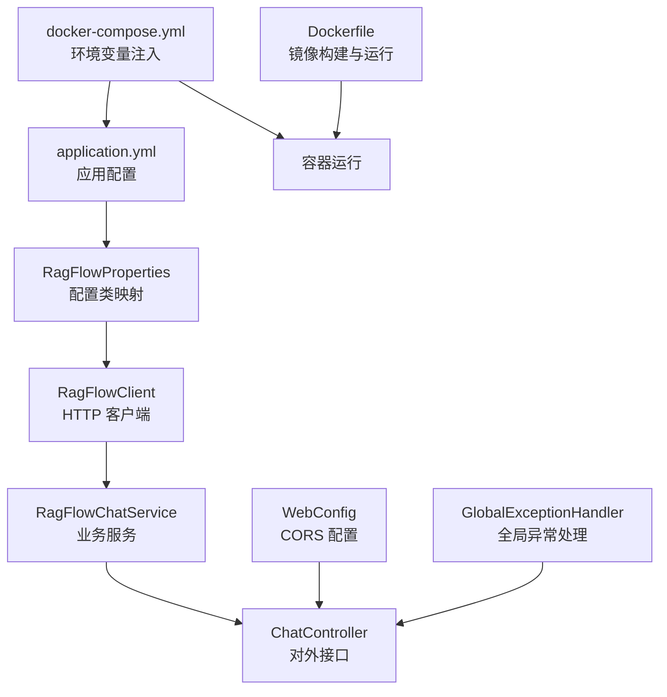
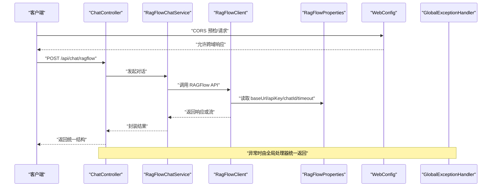
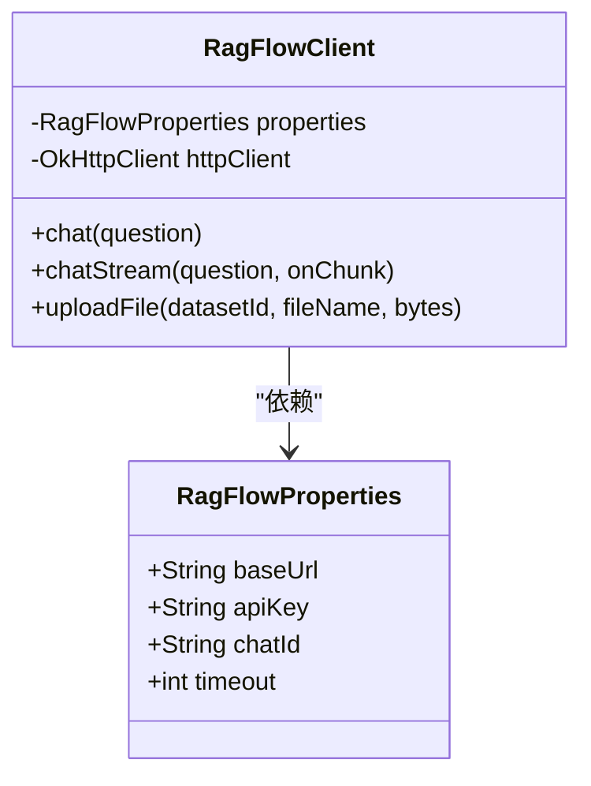
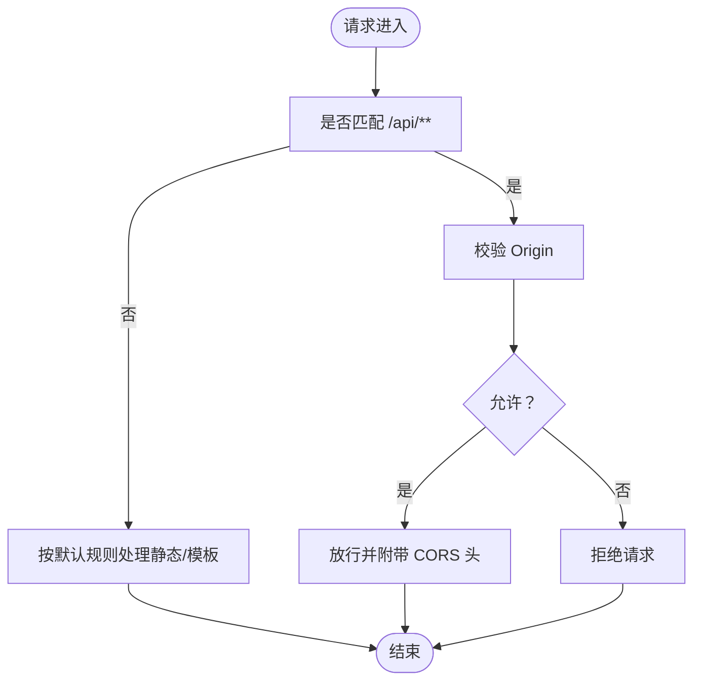
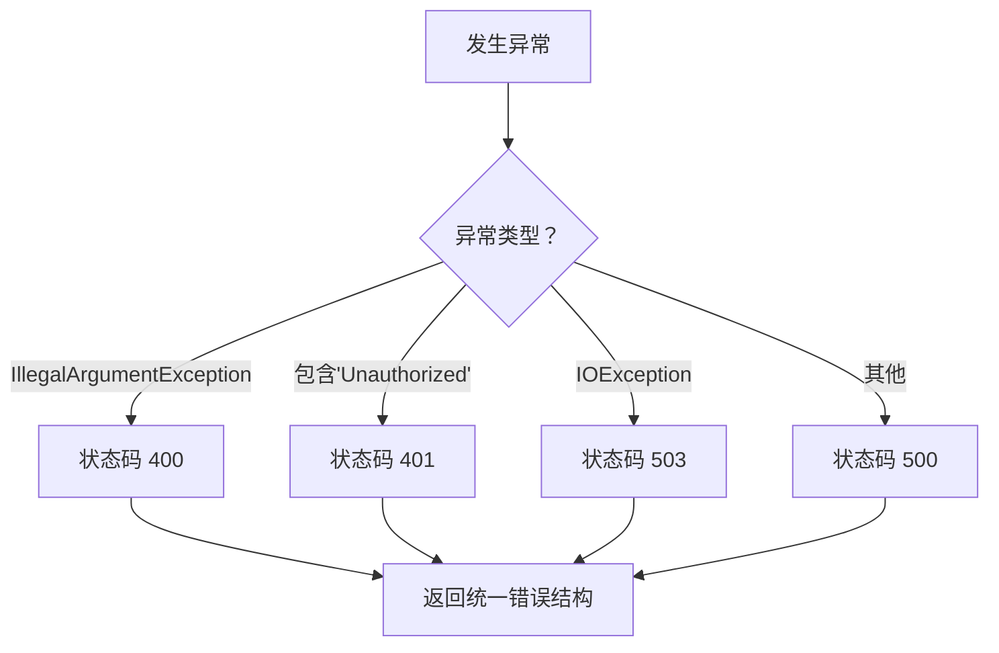
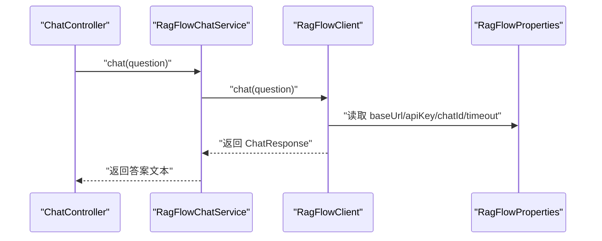
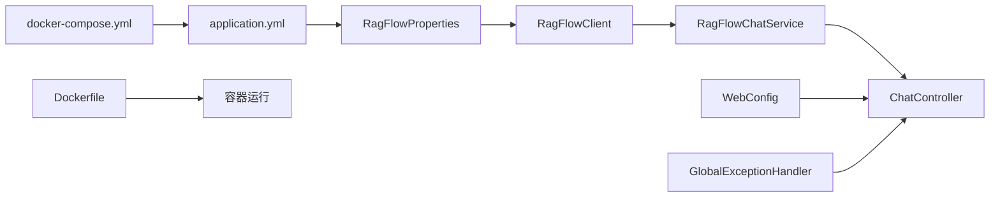

# 配置管理

<cite>
**本文引用的文件**
- [application.yml](file://src/main/resources/application.yml)
- [RagFlowProperties.java](file://src/main/java/org/wiki/config/RagFlowProperties.java)
- [WebConfig.java](file://src/main/java/org/wiki/config/WebConfig.java)
- [GlobalExceptionHandler.java](file://src/main/java/org/wiki/config/GlobalExceptionHandler.java)
- [RagFlowClient.java](file://src/main/java/org/wiki/client/RagFlowClient.java)
- [RagFlowChatService.java](file://src/main/java/org/wiki/service/RagFlowChatService.java)
- [ChatController.java](file://src/main/java/org/wiki/controller/ChatController.java)
- [ChatRequest.java](file://src/main/java/org/wiki/model/ChatRequest.java)
- [ChatResponse.java](file://src/main/java/org/wiki/model/ChatResponse.java)
- [Dockerfile](file://Dockerfile)
- [docker-compose.yml](file://docker-compose.yml)
- [DeepSeekRagFlowApplication.java](file://src/main/java/org/wiki/DeepSeekRagFlowApplication.java)
</cite>

## 目录
1. [简介](#简介)
2. [项目结构与配置位置](#项目结构与配置位置)
3. [核心配置组件](#核心配置组件)
4. [架构总览](#架构总览)
5. [详细组件分析](#详细组件分析)
6. [依赖关系分析](#依赖关系分析)
7. [性能与可用性考量](#性能与可用性考量)
8. [环境与部署配置示例](#环境与部署配置示例)
9. [配置验证与热更新](#配置验证与热更新)
10. [故障排除指南](#故障排除指南)
11. [结论](#结论)

## 简介
本文件系统化梳理 DeepSeek + RAGFlow 示例项目的配置管理方案，覆盖 application.yml 的关键参数、RagFlowProperties 配置类映射、Web 层 CORS 与静态资源策略、全局异常处理机制、以及在不同环境（开发/测试/生产）中的部署与运行方式。同时给出配置验证、热更新建议、安全注意事项与常见问题排查方法，帮助开发者快速上手并稳定运维该系统。

## 项目结构与配置位置
- 配置文件集中于 resources 目录，采用 Spring Boot 默认的 application.yml。
- Web 层配置位于 config 包中，包含跨域与全局异常处理。
- RAGFlow 客户端与服务层通过 RagFlowProperties 注入配置，实现外部服务参数化。
- Docker 与 docker-compose 提供容器化部署与环境变量注入。

图表来源
- [application.yml:1-27](file://src/main/resources/application.yml#L1-L27)
- [RagFlowProperties.java:1-32](file://src/main/java/org/wiki/config/RagFlowProperties.java#L1-L32)
- [RagFlowClient.java:1-231](file://src/main/java/org/wiki/client/RagFlowClient.java#L1-L231)
- [RagFlowChatService.java:1-84](file://src/main/java/org/wiki/service/RagFlowChatService.java#L1-L84)
- [ChatController.java:1-276](file://src/main/java/org/wiki/controller/ChatController.java#L1-L276)
- [WebConfig.java:1-23](file://src/main/java/org/wiki/config/WebConfig.java#L1-L23)
- [GlobalExceptionHandler.java:1-46](file://src/main/java/org/wiki/config/GlobalExceptionHandler.java#L1-L46)
- [docker-compose.yml:1-20](file://docker-compose.yml#L1-L20)
- [Dockerfile:1-15](file://Dockerfile#L1-L15)

章节来源
- [application.yml:1-27](file://src/main/resources/application.yml#L1-L27)
- [docker-compose.yml:1-20](file://docker-compose.yml#L1-L20)
- [Dockerfile:1-15](file://Dockerfile#L1-L15)

## 核心配置组件
- application.yml：定义服务器端口、Spring 应用名、OpenAI 兼容接口（DeepSeek）、RAGFlow 服务地址与密钥、日志级别等。
- RagFlowProperties：将 ragflow.* 前缀的配置映射为 Java 字段，供客户端与服务层使用。
- WebConfig：启用 CORS，限定路径前缀、允许的方法与头、凭证与缓存时间。
- GlobalExceptionHandler：统一捕获异常，按类型映射 HTTP 状态码，返回统一的错误响应结构。

章节来源
- [application.yml:1-27](file://src/main/resources/application.yml#L1-L27)
- [RagFlowProperties.java:1-32](file://src/main/java/org/wiki/config/RagFlowProperties.java#L1-L32)
- [WebConfig.java:1-23](file://src/main/java/org/wiki/config/WebConfig.java#L1-L23)
- [GlobalExceptionHandler.java:1-46](file://src/main/java/org/wiki/config/GlobalExceptionHandler.java#L1-L46)

## 架构总览
下图展示配置如何贯穿到运行时：application.yml 与 docker-compose 的环境变量共同决定运行期配置；RagFlowProperties 将其映射为对象；RagFlowClient 依据配置构造 HTTP 请求；ChatController 通过服务层调用客户端；WebConfig 提供跨域支持；GlobalExceptionHandler 统一处理异常。

图表来源
- [ChatController.java:1-276](file://src/main/java/org/wiki/controller/ChatController.java#L1-L276)
- [RagFlowChatService.java:1-84](file://src/main/java/org/wiki/service/RagFlowChatService.java#L1-L84)
- [RagFlowClient.java:1-231](file://src/main/java/org/wiki/client/RagFlowClient.java#L1-L231)
- [RagFlowProperties.java:1-32](file://src/main/java/org/wiki/config/RagFlowProperties.java#L1-L32)
- [WebConfig.java:1-23](file://src/main/java/org/wiki/config/WebConfig.java#L1-L23)
- [GlobalExceptionHandler.java:1-46](file://src/main/java/org/wiki/config/GlobalExceptionHandler.java#L1-L46)

## 详细组件分析

### application.yml 参数详解
- server.port：应用监听端口，默认 8081。
- spring.application.name：应用名，用于日志与监控标识。
- spring.ai.openai.api-key：DeepSeek API Key（兼容 OpenAI 接口）。
- spring.ai.openai.base-url：DeepSeek API 基础地址。
- spring.ai.openai.chat.options.*：模型与推理参数（模型名、温度、最大 token 数），用于 Spring AI 客户端。
- ragflow.base-url：RAGFlow 服务地址（例如 http://host.docker.internal:80）。
- ragflow.api-key：RAGFlow API Key。
- ragflow.chat-id：RAGFlow 中创建的聊天助手 ID。
- ragflow.timeout：RAGFlow 客户端读取超时（秒）。
- logging.level.org.wiki：日志级别（示例为 DEBUG）。

章节来源
- [application.yml:1-27](file://src/main/resources/application.yml#L1-L27)

### RagFlowProperties 配置类
- 作用：将 application.yml 中 ragflow.* 前缀的键映射为 Java 字段，便于在客户端与服务层以类型安全的方式访问。
- 关键字段：
  - baseUrl：默认 http://localhost:80，可通过环境变量覆盖。
  - apiKey：必填，用于鉴权。
  - chatId：必填，指定 RAGFlow 聊天助手。
  - timeout：默认 120 秒，用于 OkHttp 读取超时。
- 使用方式：RagFlowClient 构造函数注入 RagFlowProperties，读取上述字段拼接 URL 并设置请求头。

图表来源
- [RagFlowProperties.java:1-32](file://src/main/java/org/wiki/config/RagFlowProperties.java#L1-L32)
- [RagFlowClient.java:1-231](file://src/main/java/org/wiki/client/RagFlowClient.java#L1-L231)

章节来源
- [RagFlowProperties.java:1-32](file://src/main/java/org/wiki/config/RagFlowProperties.java#L1-L32)
- [RagFlowClient.java:25-35](file://src/main/java/org/wiki/client/RagFlowClient.java#L25-L35)

### WebConfig CORS 与静态资源
- CORS 映射：对 /api/** 开放跨域，允许任意源、任意方法、任意头、允许携带凭证、预检缓存 3600 秒。
- 静态资源：默认使用 Spring Boot 静态资源目录（resources/static），模板位于 resources/templates。当前项目未显式扩展静态资源路径，遵循默认约定。

图表来源
- [WebConfig.java:1-23](file://src/main/java/org/wiki/config/WebConfig.java#L1-L23)

章节来源
- [WebConfig.java:1-23](file://src/main/java/org/wiki/config/WebConfig.java#L1-L23)

### 全局异常处理机制
- 统一异常处理类，拦截 Exception 与 IOException。
- 错误响应结构包含 success=false 与 message 字段。
- 状态码映射：
  - IllegalArgumentException -> 400 Bad Request
  - 包含“Unauthorized”的字符串 -> 401 Unauthorized
  - 其他 -> 500 Internal Server Error
  - IO 异常（通常为 RAGFlow API 调用失败）-> 503 Service Unavailable
- 日志记录：对异常进行统一记录，便于定位问题。

图表来源
- [GlobalExceptionHandler.java:1-46](file://src/main/java/org/wiki/config/GlobalExceptionHandler.java#L1-L46)

章节来源
- [GlobalExceptionHandler.java:1-46](file://src/main/java/org/wiki/config/GlobalExceptionHandler.java#L1-L46)

### RAGFlow 客户端与服务层配置使用
- 客户端：
  - 读取 RagFlowProperties 的 baseUrl、apiKey、chatId、timeout。
  - 构建 OkHttpClient，设置连接/读/写超时。
  - 对外提供 chat、chatStream、uploadFile 等方法。
- 服务层：
  - 调用客户端执行问答与流式问答。
  - 解析响应，提取答案文本。
- 控制器：
  - 提供多种对话模式（RAGFlow、DeepSeek、RAG 增强）及会话历史管理。
  - 支持 SSE 流式输出。

图表来源
- [ChatController.java:51-76](file://src/main/java/org/wiki/controller/ChatController.java#L51-L76)
- [RagFlowChatService.java:34-41](file://src/main/java/org/wiki/service/RagFlowChatService.java#L34-L41)
- [RagFlowClient.java:135-148](file://src/main/java/org/wiki/client/RagFlowClient.java#L135-L148)
- [RagFlowProperties.java:15-30](file://src/main/java/org/wiki/config/RagFlowProperties.java#L15-L30)

章节来源
- [RagFlowClient.java:25-35](file://src/main/java/org/wiki/client/RagFlowClient.java#L25-L35)
- [RagFlowChatService.java:1-84](file://src/main/java/org/wiki/service/RagFlowChatService.java#L1-L84)
- [ChatController.java:1-276](file://src/main/java/org/wiki/controller/ChatController.java#L1-L276)

## 依赖关系分析
- 配置依赖链：application.yml -> RagFlowProperties -> RagFlowClient -> RagFlowChatService -> ChatController。
- Web 依赖链：WebConfig -> ChatController。
- 异常处理：GlobalExceptionHandler -> ChatController（通过 Spring MVC 拦截）。
- 容器化依赖：docker-compose.yml 通过环境变量覆盖 application.yml 中的敏感配置，Dockerfile 决定运行时 JVM 参数与暴露端口。

图表来源
- [application.yml:1-27](file://src/main/resources/application.yml#L1-L27)
- [RagFlowProperties.java:1-32](file://src/main/java/org/wiki/config/RagFlowProperties.java#L1-L32)
- [RagFlowClient.java:1-231](file://src/main/java/org/wiki/client/RagFlowClient.java#L1-L231)
- [RagFlowChatService.java:1-84](file://src/main/java/org/wiki/service/RagFlowChatService.java#L1-L84)
- [ChatController.java:1-276](file://src/main/java/org/wiki/controller/ChatController.java#L1-L276)
- [WebConfig.java:1-23](file://src/main/java/org/wiki/config/WebConfig.java#L1-L23)
- [GlobalExceptionHandler.java:1-46](file://src/main/java/org/wiki/config/GlobalExceptionHandler.java#L1-L46)
- [docker-compose.yml:1-20](file://docker-compose.yml#L1-L20)
- [Dockerfile:1-15](file://Dockerfile#L1-L15)

章节来源
- [docker-compose.yml:1-20](file://docker-compose.yml#L1-L20)
- [Dockerfile:1-15](file://Dockerfile#L1-L15)

## 性能与可用性考量
- 超时设置：
  - RAGFlow 客户端读取超时由 ragflow.timeout 控制，避免长时间阻塞。
  - SSE 流式对话设置了较长的超时时间（控制器侧），确保长对话稳定。
- 并发与线程池：
  - 控制器使用缓存线程池处理流式任务，注意在高并发场景下评估内存与线程开销。
- 日志级别：
  - 建议在生产环境将日志级别调整为 INFO 或 WARN，降低 I/O 压力。
- 资源限制：
  - Dockerfile 中设置了 JVM 最小/最大堆大小，可根据实际负载调整。

章节来源
- [RagFlowClient.java:30-34](file://src/main/java/org/wiki/client/RagFlowClient.java#L30-L34)
- [ChatController.java:86-107](file://src/main/java/org/wiki/controller/ChatController.java#L86-L107)

## 环境与部署配置示例
- 开发环境（本地直连 RAGFlow）：
  - 设置 ragflow.base-url 为 RAGFlow 实际地址，例如 http://host.docker.internal:80。
  - 在 docker-compose 中通过环境变量注入 DEEPSEEK_API_KEY、RAGFLOW_API_KEY、RAGFLOW_CHAT_ID。
- 测试环境（CI/CD）：
  - 使用独立的 RAGFlow 服务与 API Key，通过环境变量注入，避免硬编码。
- 生产环境（容器化）：
  - 通过 docker-compose 的 extra_hosts 将 host.docker.internal 映射到宿主机网关，以便容器内访问宿主机服务。
  - JVM 参数可在 Dockerfile 中调整，或通过启动命令覆盖。

章节来源
- [docker-compose.yml:11-19](file://docker-compose.yml#L11-L19)
- [Dockerfile:11-14](file://Dockerfile#L11-L14)

## 配置验证与热更新
- 配置验证建议：
  - 启动时打印关键配置摘要（baseUrl、chatId、timeout），便于核对。
  - 对 API Key 进行最小权限校验（例如尝试一次无副作用的 GET 请求）。
  - 对超时与网络连通性进行探测（Ping RAGFlow 服务）。
- 热更新能力：
  - 当前实现不支持运行时动态刷新配置（未引入 Spring Cloud Config 或 RefreshScope）。
  - 如需热更新，可引入配置中心与 @RefreshScope，或通过重启容器/滚动更新方式生效。

章节来源
- [RagFlowClient.java:40-57](file://src/main/java/org/wiki/client/RagFlowClient.java#L40-L57)
- [RagFlowProperties.java:1-32](file://src/main/java/org/wiki/config/RagFlowProperties.java#L1-L32)

## 故障排除指南
- 401 Unauthorized：
  - 检查 ragflow.api-key 是否正确，确认 RAGFlow 后台密钥未过期。
- 503 Service Unavailable（IO 异常）：
  - 检查 ragflow.base-url 可达性，确认 RAGFlow 服务正常运行。
  - 核对 chat-id 是否存在且可访问。
- 超时问题：
  - 调整 ragflow.timeout，或检查网络延迟与 RAGFlow 服务性能。
- CORS 问题：
  - 确认前端域名与请求方法在 WebConfig 中已允许，预检缓存时间是否足够。
- 日志定位：
  - 查看 application.yml 中的日志级别，必要时提升至 DEBUG 以获取更详细信息。

章节来源
- [GlobalExceptionHandler.java:20-44](file://src/main/java/org/wiki/config/GlobalExceptionHandler.java#L20-L44)
- [WebConfig.java:14-21](file://src/main/java/org/wiki/config/WebConfig.java#L14-L21)
- [RagFlowClient.java:175-199](file://src/main/java/org/wiki/client/RagFlowClient.java#L175-L199)

## 结论
本项目通过 application.yml 与 RagFlowProperties 将外部服务参数化，结合 WebConfig 的 CORS 与 GlobalExceptionHandler 的统一异常处理，形成了清晰、可维护的配置体系。配合 docker-compose 的环境变量注入与 Dockerfile 的运行时参数，能够在不同环境中快速部署与运行。建议在生产环境进一步完善配置验证、安全加固与可观测性，以提升稳定性与可运维性。