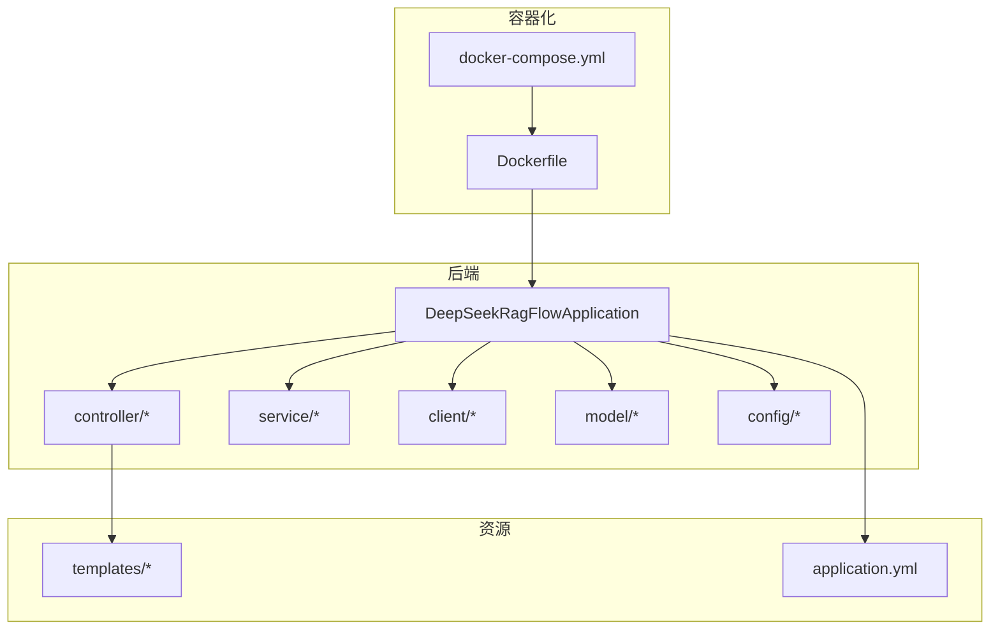
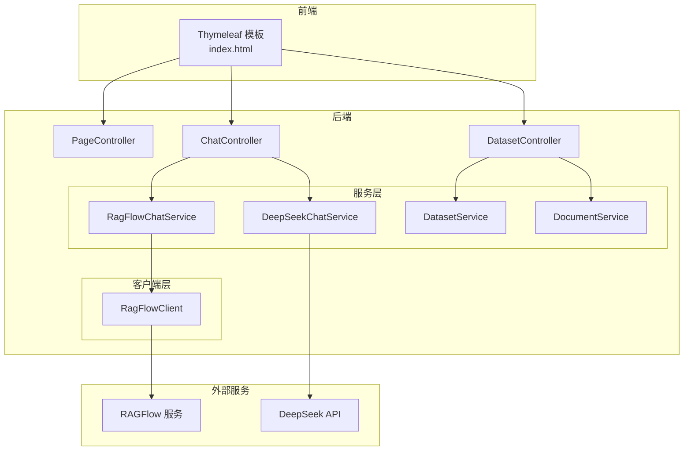
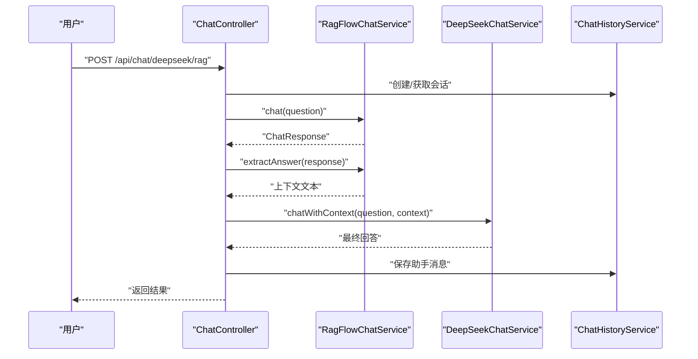
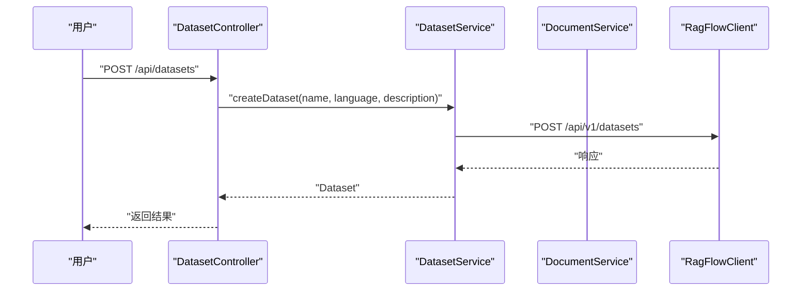
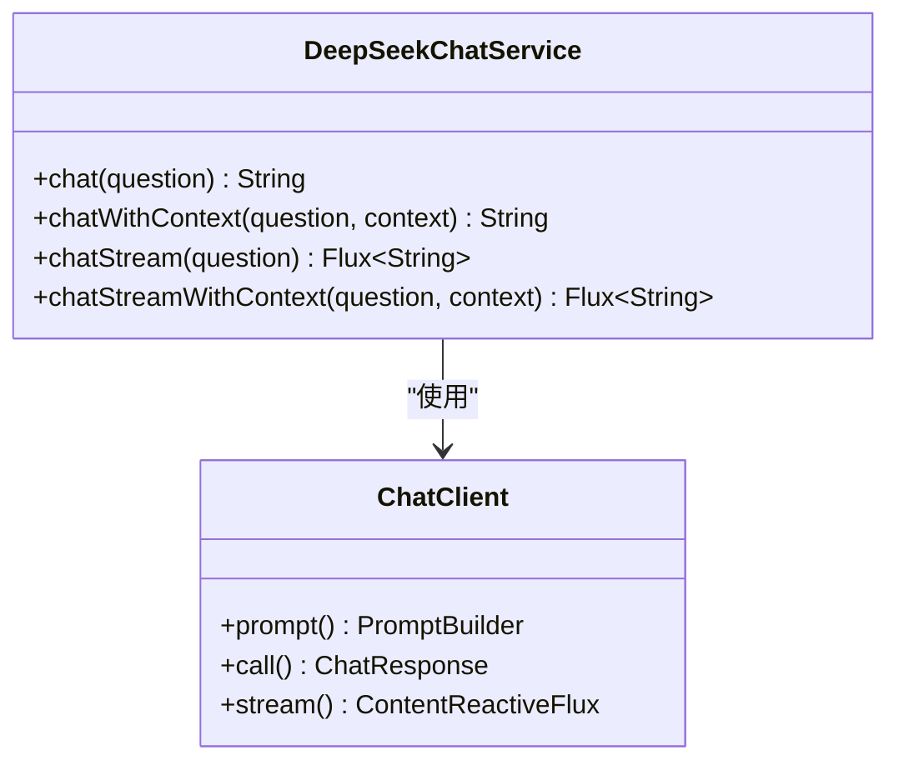
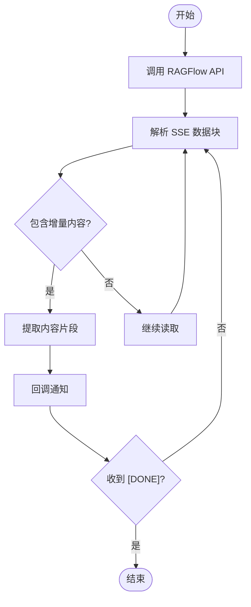
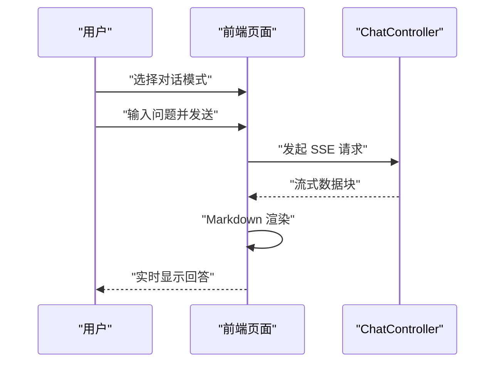
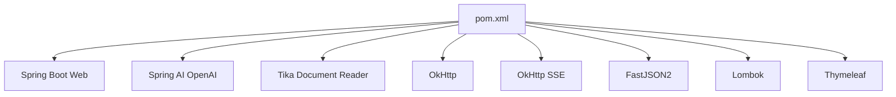

# 项目概述

<cite>
**本文档引用的文件**
- [DeepSeekRagFlowApplication.java](file://src/main/java/org/wiki/DeepSeekRagFlowApplication.java)
- [application.yml](file://src/main/resources/application.yml)
- [pom.xml](file://pom.xml)
- [Dockerfile](file://Dockerfile)
- [docker-compose.yml](file://docker-compose.yml)
- [ChatController.java](file://src/main/java/org/wiki/controller/ChatController.java)
- [DatasetController.java](file://src/main/java/org/wiki/controller/DatasetController.java)
- [PageController.java](file://src/main/java/org/wiki/controller/PageController.java)
- [DeepSeekChatService.java](file://src/main/java/org/wiki/service/DeepSeekChatService.java)
- [RagFlowChatService.java](file://src/main/java/org/wiki/service/RagFlowChatService.java)
- [RagFlowClient.java](file://src/main/java/org/wiki/client/RagFlowClient.java)
- [DatasetService.java](file://src/main/java/org/wiki/service/DatasetService.java)
- [DocumentService.java](file://src/main/java/org/wiki/service/DocumentService.java)
- [ChatMessage.java](file://src/main/java/org/wiki/model/ChatMessage.java)
- [index.html](file://src/main/resources/templates/index.html)
</cite>

## 目录
1. [简介](#简介)
2. [项目结构](#项目结构)
3. [核心组件](#核心组件)
4. [架构总览](#架构总览)
5. [详细组件分析](#详细组件分析)
6. [依赖关系分析](#依赖关系分析)
7. [性能考虑](#性能考虑)
8. [故障排除指南](#故障排除指南)
9. [结论](#结论)
10. [附录](#附录)

## 简介
本项目是一个基于 Spring Boot 的知识库问答系统，集成了 DeepSeek 大语言模型与 RAGFlow 知识库系统，提供三种对话模式：
- RAGFlow 知识库问答：直接利用 RAGFlow 的检索能力进行问答
- DeepSeek 直接对话：通过 DeepSeek API 进行通用对话
- DeepSeek + RAG 增强对话：先检索知识库片段，再由 DeepSeek 基于上下文生成回答

系统采用 Spring Web MVC 提供 REST API，使用 Thymeleaf 作为前端模板引擎，前端页面通过 SSE 实现流式对话体验。后端通过 OkHttp 调用 RAGFlow 的 OpenAI 兼容接口，通过 Spring AI 的 OpenAI Starter 与 DeepSeek API 交互。

## 项目结构
项目采用标准的 Maven 多模块结构，核心模块为 deepseek-ragflow-demo，包含以下关键目录：
- src/main/java/org/wiki：后端 Java 源码
  - controller：REST 控制器层
  - service：业务服务层
  - client：外部服务客户端封装
  - model：数据模型
  - config：全局配置与拦截器
- src/main/resources：资源文件
  - static：静态资源（未在当前结构中使用）
  - templates：Thymeleaf 模板
  - application.yml：应用配置

**图表来源**
- [DeepSeekRagFlowApplication.java:1-12](file://src/main/java/org/wiki/DeepSeekRagFlowApplication.java#L1-L12)
- [application.yml:1-27](file://src/main/resources/application.yml#L1-L27)
- [Dockerfile:1-15](file://Dockerfile#L1-L15)
- [docker-compose.yml:1-20](file://docker-compose.yml#L1-L20)

**章节来源**
- [pom.xml:1-102](file://pom.xml#L1-L102)
- [application.yml:1-27](file://src/main/resources/application.yml#L1-L27)

## 核心组件
- 应用入口：Spring Boot 启动类负责应用初始化与启动
- 控制器层：
  - ChatController：提供三种对话模式的 REST 接口，支持非流式与 SSE 流式输出，并提供会话历史管理
  - DatasetController：提供知识库的创建、查询、删除以及文档上传、查询、删除等管理接口
  - PageController：提供 Thymeleaf 页面路由，返回前端模板
- 服务层：
  - DeepSeekChatService：基于 Spring AI 的 ChatClient 调用 DeepSeek API，支持纯对话、RAG 增强对话与流式输出
  - RagFlowChatService：封装 RAGFlow 的 OpenAI 兼容接口，支持问答与流式输出，并提取回答内容
  - DatasetService：封装 RAGFlow 知识库管理 API
  - DocumentService：封装 RAGFlow 文档管理 API
- 客户端层：
  - RagFlowClient：基于 OkHttp 封装 RAGFlow 的 RESTful API，支持通用 HTTP 方法与 SSE 流式数据处理
- 模型层：ChatMessage 等数据模型用于会话历史管理
- 配置层：GlobalExceptionHandler、WebConfig、RagFlowProperties 等

**章节来源**
- [ChatController.java:1-276](file://src/main/java/org/wiki/controller/ChatController.java#L1-L276)
- [DatasetController.java:1-197](file://src/main/java/org/wiki/controller/DatasetController.java#L1-L197)
- [PageController.java:1-30](file://src/main/java/org/wiki/controller/PageController.java#L1-L30)
- [DeepSeekChatService.java:1-125](file://src/main/java/org/wiki/service/DeepSeekChatService.java#L1-L125)
- [RagFlowChatService.java:1-84](file://src/main/java/org/wiki/service/RagFlowChatService.java#L1-L84)
- [RagFlowClient.java:1-231](file://src/main/java/org/wiki/client/RagFlowClient.java#L1-L231)
- [DatasetService.java:1-128](file://src/main/java/org/wiki/service/DatasetService.java#L1-L128)
- [DocumentService.java:1-98](file://src/main/java/org/wiki/service/DocumentService.java#L1-L98)
- [ChatMessage.java:1-82](file://src/main/java/org/wiki/model/ChatMessage.java#L1-L82)

## 架构总览
系统采用分层架构，前端通过 Thymeleaf 模板提供用户界面，后端通过 REST API 提供统一接口，外部服务通过专用客户端封装访问。

**图表来源**
- [PageController.java:1-30](file://src/main/java/org/wiki/controller/PageController.java#L1-L30)
- [ChatController.java:1-276](file://src/main/java/org/wiki/controller/ChatController.java#L1-L276)
- [DatasetController.java:1-197](file://src/main/java/org/wiki/controller/DatasetController.java#L1-L197)
- [DeepSeekChatService.java:1-125](file://src/main/java/org/wiki/service/DeepSeekChatService.java#L1-L125)
- [RagFlowChatService.java:1-84](file://src/main/java/org/wiki/service/RagFlowChatService.java#L1-L84)
- [RagFlowClient.java:1-231](file://src/main/java/org/wiki/client/RagFlowClient.java#L1-L231)

## 详细组件分析

### 对话控制器（ChatController）
- 功能特性：
  - 支持三种对话模式：RAGFlow 知识库问答、DeepSeek 直接对话、DeepSeek + RAG 增强对话
  - 提供非流式与 SSE 流式两种输出方式
  - 提供会话管理：创建会话、获取历史、清空历史
- 关键流程：
  - RAGFlow 模式：调用 RagFlowChatService 执行问答，提取回答并保存到会话历史
  - DeepSeek 模式：调用 DeepSeekChatService 执行问答，保存到会话历史
  - RAG 增强模式：先执行 RAGFlow 检索，再将上下文传递给 DeepSeek 生成最终回答
- 错误处理：捕获 IO 异常并返回统一的错误响应

**图表来源**
- [ChatController.java:148-174](file://src/main/java/org/wiki/controller/ChatController.java#L148-L174)
- [RagFlowChatService.java:26-41](file://src/main/java/org/wiki/service/RagFlowChatService.java#L26-L41)
- [DeepSeekChatService.java:54-78](file://src/main/java/org/wiki/service/DeepSeekChatService.java#L54-L78)

**章节来源**
- [ChatController.java:1-276](file://src/main/java/org/wiki/controller/ChatController.java#L1-L276)

### 知识库管理控制器（DatasetController）
- 功能特性：
  - 知识库管理：创建、查询、删除、更新
  - 文档管理：上传、查询、删除、解析运行
- 关键流程：
  - 通过 DatasetService 和 DocumentService 调用 RagFlowClient 执行具体操作
  - 统一返回 JSON 结构的响应

**图表来源**
- [DatasetController.java:41-58](file://src/main/java/org/wiki/controller/DatasetController.java#L41-L58)
- [DatasetService.java:37-53](file://src/main/java/org/wiki/service/DatasetService.java#L37-L53)

**章节来源**
- [DatasetController.java:1-197](file://src/main/java/org/wiki/controller/DatasetController.java#L1-L197)
- [DatasetService.java:1-128](file://src/main/java/org/wiki/service/DatasetService.java#L1-L128)
- [DocumentService.java:1-98](file://src/main/java/org/wiki/service/DocumentService.java#L1-L98)

### DeepSeek 对话服务（DeepSeekChatService）
- 功能特性：
  - 纯对话模式：直接调用 DeepSeek API
  - RAG 增强模式：通过系统提示词注入上下文
  - 流式输出：基于 Spring AI 的 Flux 实现
- 配置要点：
  - 通过 Spring AI OpenAI Starter 与 DeepSeek API 兼容接口对接
  - 支持温度、最大令牌数等参数配置

**图表来源**
- [DeepSeekChatService.java:1-125](file://src/main/java/org/wiki/service/DeepSeekChatService.java#L1-L125)

**章节来源**
- [DeepSeekChatService.java:1-125](file://src/main/java/org/wiki/service/DeepSeekChatService.java#L1-L125)

### RAGFlow 对话服务（RagFlowChatService）
- 功能特性：
  - 非流式问答：调用 RAGFlow OpenAI 兼容接口
  - 流式问答：解析 SSE 数据流，提取增量内容与引用信息
  - 内容提取：从响应中提取回答文本
- 客户端封装：
  - 通过 RagFlowClient 统一封装 HTTP 请求与 SSE 处理

**图表来源**
- [RagFlowChatService.java:50-72](file://src/main/java/org/wiki/service/RagFlowChatService.java#L50-L72)
- [RagFlowClient.java:154-200](file://src/main/java/org/wiki/client/RagFlowClient.java#L154-L200)

**章节来源**
- [RagFlowChatService.java:1-84](file://src/main/java/org/wiki/service/RagFlowChatService.java#L1-L84)
- [RagFlowClient.java:1-231](file://src/main/java/org/wiki/client/RagFlowClient.java#L1-L231)

### 前端页面与交互（index.html）
- 功能特性：
  - 侧边栏导航：对话问答与知识库管理
  - 对话模式切换：RAGFlow、DeepSeek、RAG 增强
  - 流式渲染：Markdown 渲染与代码高亮
  - 会话管理：初始化会话、清空对话、历史记录
- 技术实现：
  - 使用 Marked.js 渲染 Markdown
  - 使用 highlight.js 进行代码高亮
  - 通过 Fetch API 与后端交互，SSE 流式接收数据

**图表来源**
- [index.html:257-325](file://src/main/resources/templates/index.html#L257-L325)
- [ChatController.java:85-107](file://src/main/java/org/wiki/controller/ChatController.java#L85-L107)

**章节来源**
- [index.html:1-329](file://src/main/resources/templates/index.html#L1-L329)

## 依赖关系分析
项目使用 Maven 管理依赖，核心依赖包括：
- Spring Boot Starter Web：提供 Web 开发基础能力
- Spring AI OpenAI Starter：与 DeepSeek API 兼容接口对接
- Spring AI Tika Document Reader：文档解析能力
- OkHttp 与 OkHttp SSE：HTTP 客户端与 SSE 流式支持
- FastJSON2：JSON 序列化与反序列化
- Lombok：简化 Java 代码
- Thymeleaf：模板引擎

**图表来源**
- [pom.xml:25-88](file://pom.xml#L25-L88)

**章节来源**
- [pom.xml:1-102](file://pom.xml#L1-L102)

## 性能考虑
- 流式输出：RAGFlow 与 DeepSeek 的流式接口通过 SSE 实现，提升用户体验
- 线程池：ChatController 使用缓存线程池处理流式任务，避免阻塞主线程
- 超时配置：RAGFlow 客户端设置合理的连接与读取超时时间
- 容器优化：Dockerfile 使用多阶段构建，JRE 运行时镜像减少体积

## 故障排除指南
- 配置检查：
  - 确认 application.yml 中的 DeepSeek API Key、Base URL、模型参数正确
  - 确认 RAGFlow Base URL、API Key、Chat ID、超时时间配置正确
- 网络连通性：
  - 确认 RAGFlow 服务可达，端口开放
  - Docker 环境下确认 host.docker.internal 映射正确
- 日志查看：
  - application.yml 中已启用 DEBUG 级别日志，便于定位问题
- 常见问题：
  - API Key 无效：检查 DeepSeek 与 RAGFlow 的密钥配置
  - 超时错误：调整 RAGFlow 的 timeout 参数或网络环境
  - SSE 断开：检查后端流式处理逻辑与前端读取循环

**章节来源**
- [application.yml:1-27](file://src/main/resources/application.yml#L1-L27)
- [docker-compose.yml:11-19](file://docker-compose.yml#L11-L19)

## 结论
本项目成功整合了 DeepSeek 大语言模型与 RAGFlow 知识库系统，提供了灵活的对话模式与完整的知识库管理能力。通过 Spring Boot 的现代化开发框架与 Thymeleaf 的简洁模板，实现了良好的开发体验与用户体验。系统具备清晰的分层架构、完善的错误处理与流式交互能力，适合在企业级场景中部署与扩展。

## 附录

### 快速开始指南
- 环境要求：
  - JDK 17 或以上版本
  - Maven 3.6+（本地构建）
  - Docker 与 Docker Compose（容器化部署）
- 依赖安装：
  - 使用 Maven 安装项目依赖
  - 或使用 Docker Compose 构建与启动
- 基本配置：
  - 在 application.yml 中配置 DeepSeek API Key 与 Base URL
  - 在 application.yml 中配置 RAGFlow Base URL、API Key、Chat ID、超时时间
  - 通过环境变量覆盖 Docker 配置（DEEPSEEK_API_KEY、RAGFLOW_BASE_URL、RAGFLOW_API_KEY、RAGFLOW_CHAT_ID）

**章节来源**
- [application.yml:1-27](file://src/main/resources/application.yml#L1-L27)
- [docker-compose.yml:11-16](file://docker-compose.yml#L11-L16)
- [Dockerfile:1-15](file://Dockerfile#L1-L15)